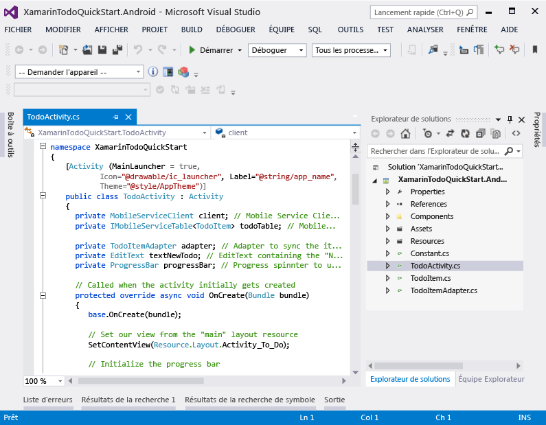

<properties pageTitle="Get Started with Mobile Services for Xamarin.Android" metaKeywords="Azure Xamarin.Android application, mobile service XamarinAndroid, getting started Azure Xamarin.Android" writer="craigd" description="Learn how to use Azure Mobile Services with your Xamarin.Android app." metaCanonical="" documentationCenter="Mobile" title="Get started with Mobile Services" />

Prise en main de Mobile Services
================================

[Windows Store](/fr-fr/documentation/articles/mobile-services-windows-store-get-started "Windows Store") [Windows Phone](/fr-fr/documentation/articles/mobile-services-windows-phone-get-started "Windows Phone") [iOS](/fr-fr/documentation/articles/mobile-services-ios-get-started "iOS") [Android](/fr-fr/documentation/articles/mobile-services-android-get-started "Android") [HTML](/fr-fr/documentation/articles/mobile-services-html-get-started "HTML") [Xamarin.iOS](/fr-fr/documentation/articles/partner-xamarin-mobile-services-ios-get-started "Xamarin.iOS") [Xamarin.Android](/fr-fr/documentation/articles/partner-xamarin-mobile-services-android-get-started "Xamarin.Android") [Sencha](/fr-fr/documentation/articles/partner-sencha-mobile-services-get-started/ "Sencha") [PhoneGap](/fr-fr/documentation/articles/mobile-services-javascript-backend-phonegap-get-started/ "PhoneGap")

Ce didacticiel vous montre comment ajouter un service principal cloud à une application Xamarin.Android en utilisant Azure Mobile Services. Dans ce didacticiel, vous allez créer un service mobile et une simple application *To do list* qui stocke les données d'application dans le nouveau service mobile.

Voici une capture d'écran de l'application terminée :

[regarder le didacticiel](http://channel9.msdn.com/Series/Windows-Azure-Mobile-Services/Getting-Started-with-Xamarin-and-Windows-Azure-Mobile-Services) [Lire la vidéo](http://channel9.msdn.com/Series/Windows-Azure-Mobile-Services/Getting-Started-with-Xamarin-and-Windows-Azure-Mobile-Services) 10:05:00

Pour suivre ce didacticiel, vous avez besoin de [Xamarin.Android](http://xamarin.com/download), qui installe Xamarin Studio et un plug-in Visual Studio (sous Windows), ainsi que la dernière plateforme Android. Le Kit de développement logiciel (SDK) Android 4.2 ou une version ultérieure est nécessaire.

Le projet de démarrage rapide téléchargé contient le composant Azure Mobile services pour Xamarin.Android. Même si ce projet cible Android 4.2 ou une version ultérieure, le Kit de développement logiciel (SDK) Mobile Services n'a besoin que d'Android 2.2 (ou une version ultérieure).

**Remarque**

Pour effectuer ce didacticiel, vous avez besoin d'un compte Azure. Si vous ne possédez pas de compte, vous pouvez créer un compte d'évaluation gratuit en quelques minutes. Pour plus d'informations, consultez la page [Version d'évaluation gratuite d'Azure](http://www.windowsazure.com/fr-fr/pricing/free-trial/?WT.mc_id=A9C9624B5).

Création d'un service mobile
----------------------------

[WACOM.INCLUDE [mobile-services-create-new-service](../includes/mobile-services-create-new-service.md)]

Création d'une applicationCréation d'une application Xamarin.Android
-----------------------------------------------------------------------------------------------------

Après avoir créé votre service mobile, vous pouvez suivre un démarrage rapide facile dans le portail de gestion pour créer une application ou modifier une application existante afin de vous connecter au service mobile.

Dans cette section, vous allez créer une application Xamarin.Android connectée à votre service mobile.

1.  Dans le portail de gestion, cliquez sur **Mobile Services**, puis sur le service mobile que vous venez de créer.

2.  Sous l'onglet de démarrage rapide, cliquez sur **Xamarin.Android** sous **Choisissez une plateforme** et développez **Créer une application Android**.

    

    Les trois étapes permettant de créer une application Xamarin.Android connectée à votre service mobile s'affichent.

    

3.  Cliquez sur **Create TodoItem table** pour créer une table permettant de stocker les données d'application.

4.  Sous **Download and run app**, cliquez sur **Télécharger**.

    Cette opération télécharge le projet de votre exemple d'application *To do list* qui est connectée à votre service mobile. Enregistrez le fichier projet compressé sur votre ordinateur local et notez l'emplacement où vous l'avez enregistré.

Exécution de votre application Android
--------------------------------------

La dernière étape de ce didacticiel consiste à générer et à exécuter votre nouvelle application.

1.  Accédez à l'emplacement où vous avez enregistré les fichiers projet compressés, puis développez les fichiers sur votre ordinateur.

2.  Dans Xamarin Studio ou Visual Studio, cliquez sur **Fichier**, puis sur **Ouvrir**, accédez aux exemples de fichiers non compressés et sélectionnez **XamarinTodoQuickStart.Android.sln** pour l'ouvrir.

 	

	

1.  Appuyez sur le bouton **Exécuter** pour générer le projet et démarrer l'application. Vous êtes invité à sélectionner un émulateur ou un périphérique USB connecté.

    **Remarque**

    Afin d'exécuter le projet dans l'émulateur Android, vous devez définir au moins un AVD (appareil virtuel Android). Utilisez le gestionnaire AVD pour créer et gérer ces appareils.

2.  Dans l'application, tapez un texte explicite, comme *Suivre le didacticiel*, puis cliquez sur **Ajouter**.

    

    Ceci envoie une demande POST vers le nouveau service mobile hébergé dans Azure. Les données de la requête sont insérées dans la table TodoItem. Les éléments stockés dans la table sont renvoyés par le service mobile et les données sont affichées dans la liste.

    > [WACOM.NOTE]
    > Vous pouvez vérifier le code (se trouvant dans le fichier ToDoActivity.cs C\#) qui accède au service mobile pour exécuter une requête et insérer des données.

3.  De retour dans le portail de gestion, cliquez sur l'onglet **Données**, puis sur la table **TodoItems**.

    

    Cela vous permet de parcourir les données insérées par l'application dans la table.

    

Étapes suivantes
----------------

Maintenant que vous avez effectué le démarrage rapide, découvrez comment exécuter d'autres tâches importantes dans Mobile Services :

-   [Prise en main des données](/en-us/develop/mobile/tutorials/get-started-with-data-xamarin-android)
    
    En savoir plus sur le stockage et l'interrogation des données à l'aide de Mobile Services.

-   [Prise en main de l'authentification](/en-us/develop/mobile/tutorials/get-started-with-users-xamarin-android)
    
    En savoir plus sur l'authentification des utilisateurs de votre application avec un fournisseur d'identité.

-   [Prise en main des notifications Push](/en-us/develop/mobile/tutorials/get-started-with-push-xamarin-android)
    
    En savoir plus sur l'envoi d'une notification Push très basique sur votre application.

