<properties
   pageTitle="Exécuter n’importe quelle application Windows sur n’importe quel appareil avec Azure RemoteApp | Microsoft Azure"
   description="Découvrez comment partager n’importe quelle application Windows avec vos utilisateurs grâce à Azure RemoteApp."
   services="remoteapp"
   documentationCenter=""
   authors="lizap"
   manager="mbaldwin"
   editor=""/>

<tags
   ms.service="remoteapp"
   ms.devlang="na"
   ms.topic="hero-article"
   ms.tgt_pltfrm="na"
   ms.workload="compute"
   ms.date="06/02/2016"
   ms.author="elizapo"/>

# Exécuter n’importe quelle application Windows sur n’importe quel appareil avec Azure RemoteApp

Vous pouvez exécuter une application Windows n’importe où et sur n’importe quel appareil. Pour cela, il vous suffit d’utiliser Azure RemoteApp. Qu’il s’agisse d’une application personnalisée écrite il y a 10 ans ou d’une application Office, vos utilisateurs n’ont plus besoin d’être rattachés à un système d’exploitation spécifique (comme Windows XP) pour accéder à ces applications.

Grâce à Azure RemoteApp, vos utilisateurs peuvent également utiliser leurs propres appareils Android ou Apple et bénéficier de la même expérience que sur Windows (ou Windows Phone). Pour obtenir ce résultat, votre application Windows est hébergée sur une collection de machines virtuelles Windows via Azure, auxquelles vos utilisateurs peuvent accéder depuis n’importe quel lieu connecté à Internet.

Lisez la suite pour obtenir un exemple précis de façon de procéder.

Dans cet article, nous allons partager l’application Access avec tous nos utilisateurs. Toutefois, vous pouvez utiliser n'importe quelle application. Tant que vous pouvez installer votre application sur un ordinateur Windows Server 2012 R2, vous pouvez la partager à l'aide de la procédure ci-dessous. Vous pouvez consulter la [configuration requise des applications](remoteapp-appreqs.md) pour vous assurer du bon fonctionnement de votre application.

Veuillez noter que, comme Access est une base de données, et comme nous voulons que cette base de données soit utile, nous allons effectuer quelques étapes supplémentaires afin de permettre aux utilisateurs d’accéder au partage de données Access. Si votre application n'est pas une base de données ou si vos utilisateurs n'ont pas besoin d'accéder à un partage de fichiers, vous pouvez ignorer ces étapes de ce didacticiel.

[AZURE.INCLUDE [free-trial-note](../../includes/free-trial-note.md)]

## Création d’une collection dans RemoteApp

Commencez par créer une collection. La collection sert à répertorier vos applications et vos utilisateurs. Chaque collection est basée sur une image, vous pouvez créer votre propre image ou utiliser celle fournie avec votre abonnement. Pour ce didacticiel, nous allons utiliser l’image d’évaluation d’Office 2013. Elle contient l’application que nous voulons partager.

1. Sur le portail Azure, faites défiler le volet de navigation de gauche jusqu’à ce que RemoteApp apparaisse. Ouvrez cette page.
2. Cliquez sur **Créer une collection RemoteApp**.
3. Cliquez sur **Création rapide** et entrez un nom pour votre collection.
4. Sélectionnez la région que vous souhaitez utiliser pour créer votre collection. Pour une expérience optimale, sélectionnez la région la plus proche du lieu où vos utilisateurs accéderont à l’application. Par exemple, dans ce didacticiel, les utilisateurs se trouveront à Redmond, Washington. La région Azure la plus proche est la zone **Ouest des États-Unis**.
5. Sélectionnez le profil de facturation que vous souhaitez utiliser. Le profil de facturation de base place 16 utilisateurs sur une machine virtuelle Azure de grande taille, contre 10 utilisateurs si vous optez pour le profil de facturation standard. En règle générale, le profil de base fonctionne bien pour les workflows de type « saisie de données ». Pour les applications très performantes comme Office, nous vous recommandons d’utiliser le profil standard.
6. Enfin, sélectionnez l’image d’Office 2013 Professionnel. Cette image contient les applications d’Office 2013. Rappel - cette image est uniquement valable pour les collections d'évaluation et les POC. Vous ne pouvez pas utiliser cette image dans une collection de production.
7. Cliquez à présent sur **Créer une collection RemoteApp**.

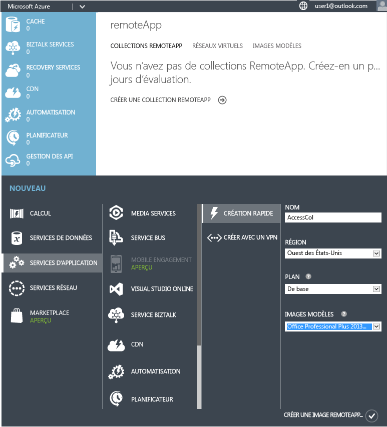

Cette opération permet de lancer la création votre collection, mais peut nécessiter jusqu’à une heure de chargement.

Vous êtes maintenant prêt à ajouter vos utilisateurs.

## Partage de l’application avec des utilisateurs

Une fois votre collection créée, il est temps pour vous de publier Access et d’ajouter les utilisateurs devant y accéder.

Si vous avez quitté le nœud Azure RemoteApp pendant la création de la collection, retournez-y depuis la page d’accueil Azure avant de commencer.

2. Cliquez sur la collection que vous avez créée précédemment pour accéder à des options supplémentaires et configurer la collection. 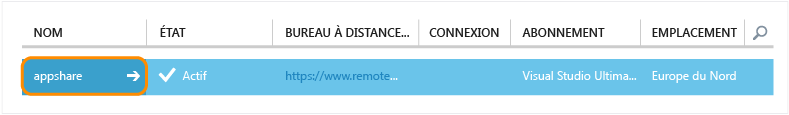
3. Dans l’onglet **Publication**, cliquez sur **Publier** en bas de l’écran, puis cliquez sur **Publier des programmes du menu Démarrer**. 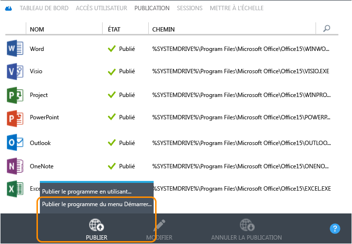
4. Sélectionnez les applications que vous souhaitez publier dans la liste. Dans notre cas, nous avons choisi Access. Cliquez sur **Terminé**. Attendez que les applications finissent d’être publiées. 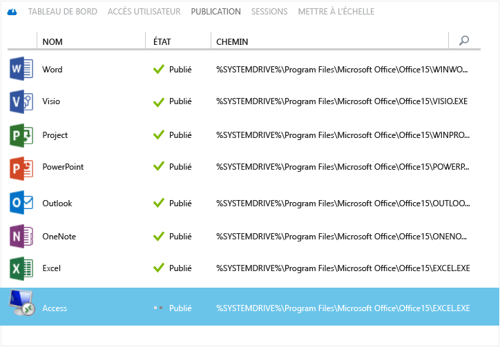

1. Une fois l’application publiée, rendez-vous sur l’onglet **Accès utilisateur** afin d’y ajouter tous les utilisateurs devant accéder à vos applications. Entrez les noms d’utilisateur (adresse e-mail) de vos utilisateurs, puis cliquez sur **Enregistrer**.

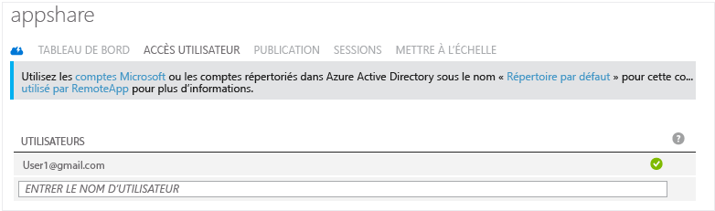

1. À présent, il est temps d’informer vos utilisateurs sur la publication de ces nouvelles applications et sur la manière d’y accéder. Pour ce faire, envoyez à vos utilisateurs un e-mail contenant l’URL de téléchargement du client Bureau à distance. 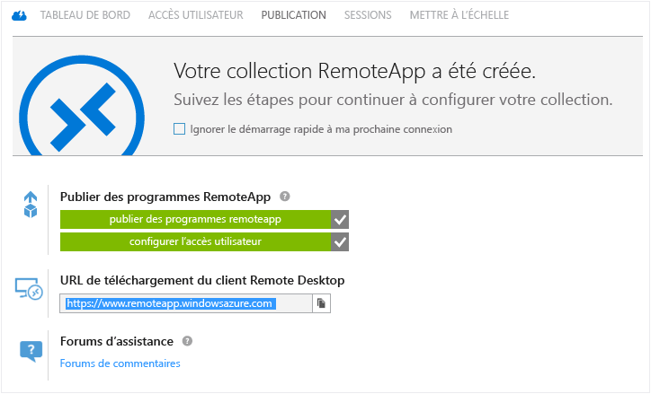

## Configuration de l’accès à Access

Certaines applications nécessitent une configuration supplémentaire après leur déploiement via RemoteApp. Dans le cas d’Access, nous allons créer un partage de fichiers sur Azure, accessible par n’importe quel utilisateur. (Si vous ne souhaitez pas effectuer cette opération, vous pouvez créer une [collection hybride](remoteapp-create-hybrid-deployment.md) [au lieu de notre collection cloud], afin que vos utilisateurs accèdent aux fichiers et aux informations sur votre réseau local.) Vous allez ensuite devoir demander aux utilisateurs de mapper un lecteur local sur leur ordinateur vers le système de fichiers Azure.

Dans un premier temps, vous allez être mis à contribution en tant qu’administrateur. Dans un second temps, nous allons demander à vos utilisateurs de procéder à quelques étapes.

1. Commencez par publier l’interface de ligne de commande (cmd.exe). Dans l’onglet **Publication**, sélectionnez **cmd**, puis cliquez sur **Publier > Publier le programme à l’aide d’un chemin d’accès**.
2. Entrez le nom de l’application et le chemin d’accès. Dans notre cas, utilisez « Explorateur de fichiers » comme nom et « %SYSTEMDRIVE%\\windows\\explorer.exe » comme chemin d’accès. 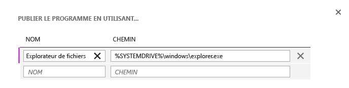
3. Vous devez à présent créer un [compte de stockage](../storage/storage-create-storage-account.md) Azure. Nous avons appelé le nôtre « accessstorage », choisissez donc un nom significatif pour vous. (Pour reprendre Highlander, il peut n’y avoir qu’un seul « accessstorage ».) 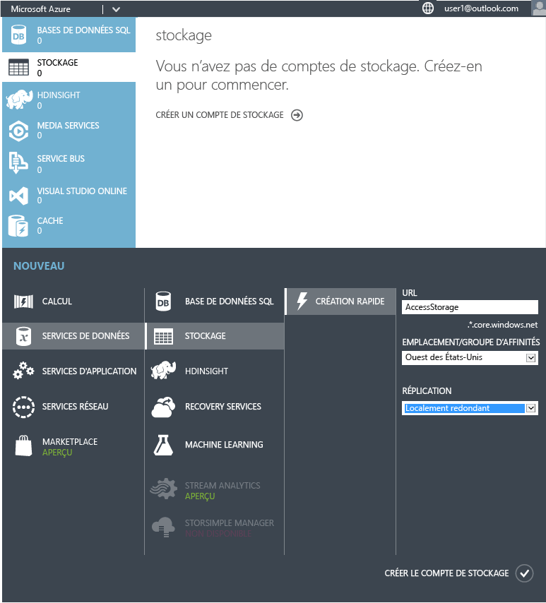
4. Revenez maintenant à votre tableau de bord afin d’obtenir le chemin d’accès vers votre espace de stockage (emplacement de point de terminaison). Vous allez l’utiliser dans peu de temps, veillez donc à le copier quelque part. 
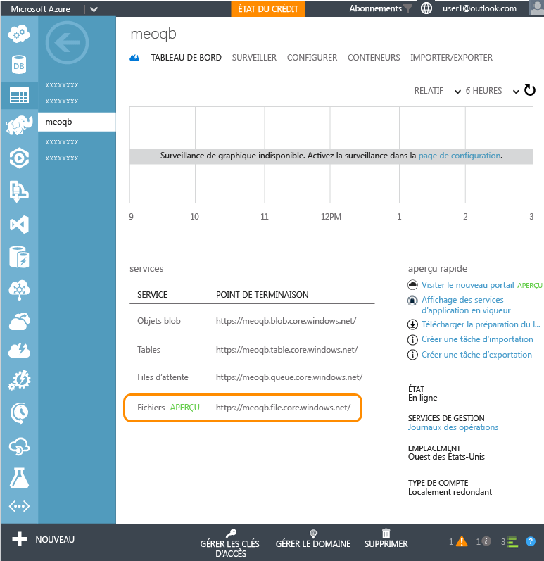
5. Une fois le compte de stockage créé, vous allez avoir besoin de la clé d’accès primaire. Cliquez sur **Gérer les clés d’accès**, puis copiez la clé d’accès primaire.
6. À présent, définissez le contexte du compte de stockage et créez un partage de fichiers pour Access. Dans une fenêtre Windows PowerShell exécutée avec des privilèges élevés, exécutez les applets de commande suivantes :

        $ctx=New-AzureStorageContext <account name> <account key>
    	$s = New-AzureStorageShare <share name> -Context $ctx

	Voici les applets de commande que nous avons exécutées dans notre cas :

	    $ctx=New-AzureStorageContext accessstorage <key>
    	$s = New-AzureStorageShare <share name> -Context $ctx

C’est maintenant au tour des utilisateurs de poursuivre les opérations. Tout d’abord, demandez à vos utilisateurs d’installer un [client RemoteApp](remoteapp-clients.md). Les utilisateurs doivent ensuite mapper un lecteur depuis leur compte vers le partage de fichiers Azure que vous avez créé et ajouté à leurs fichiers Access. Voici comment ces derniers doivent procéder :

1. Dans le client RemoteApp, accédez aux applications publiées. Démarrez le programme cmd.exe.
2. Pour mapper un lecteur depuis votre ordinateur vers le partage de fichiers, exécutez la commande suivante :

		net use z: \<accountname>.file.core.windows.net<share name> /u:<user name> <account key>

	Si vous définissez le paramètre **/persistent** sur Oui, le lecteur mappé persistera entre les sessions.
1. À présent, lancez l’application Explorateur de fichiers depuis RemoteApp. Copiez les fichiers Access que vous souhaitez utiliser dans l’application partagée dans le partage de fichiers. 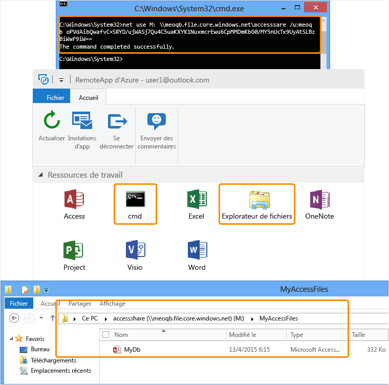
1. Enfin, ouvrez Access, puis la base de données que vous venez de partager. Vous devriez voir vos données d’Access s’exécuter directement sur le cloud. 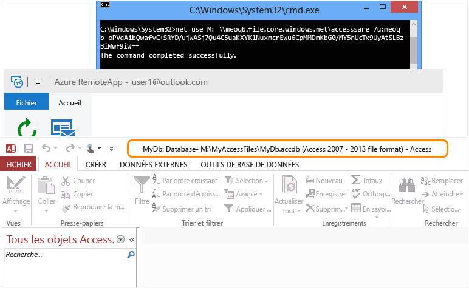

Vous pouvez désormais utiliser Access sur n’importe lequel de vos appareils. Veillez simplement à installer un client RemoteApp.

<!--Every topic should have next steps and links to the next logical set of content to keep the customer engaged-->
## Étapes suivantes

Maintenant que vous maîtrisez la création d’une collection, essayez de créer une [collection utilisant Office 365](remoteapp-tutorial-o365anywhere.md). Vous pouvez également créer une [collection hybride ](remoteapp-create-hybrid-deployment.md)ayant accès à votre réseau local.

<!--Image references-->
 

<!---HONumber=AcomDC_0629_2016-->