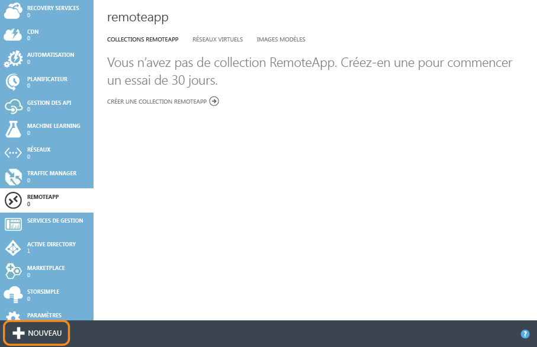
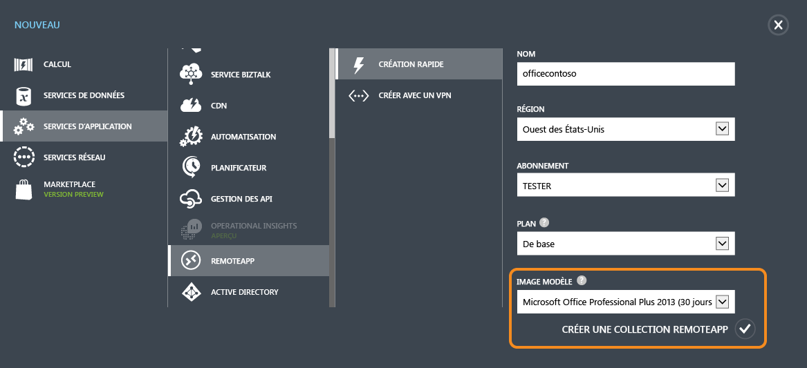
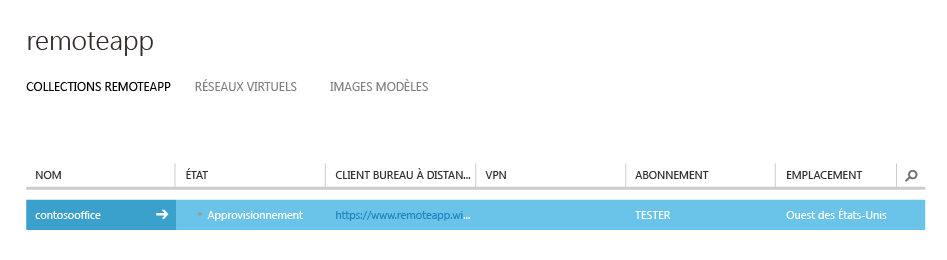
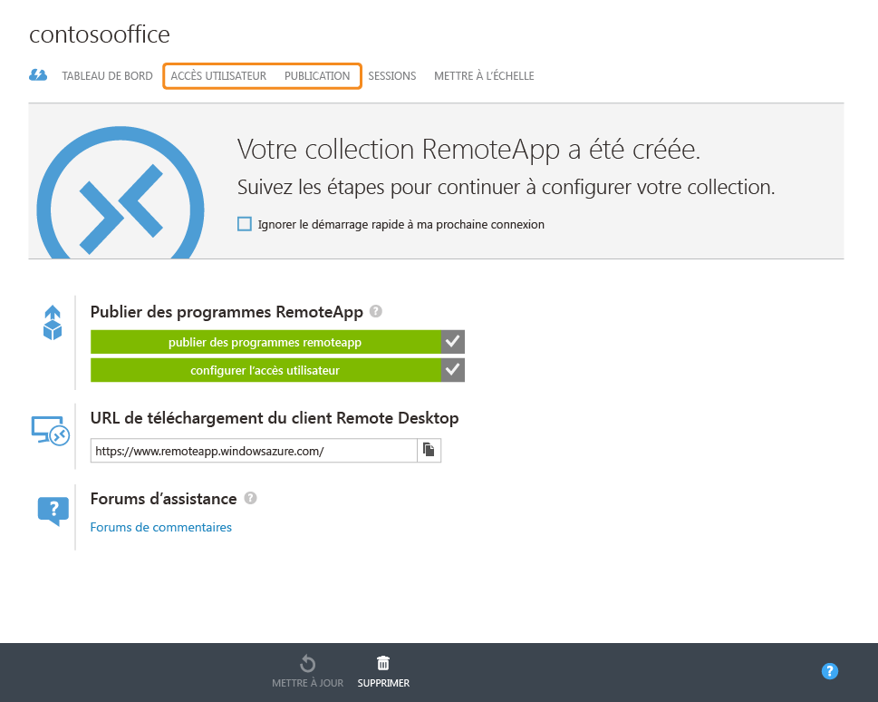
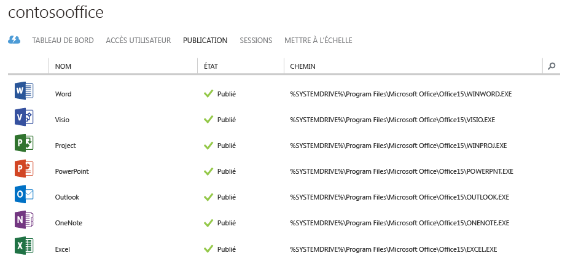
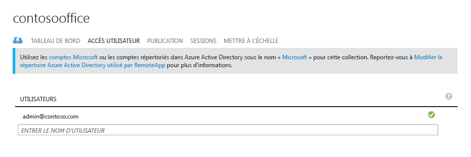
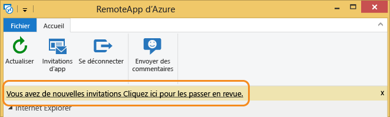
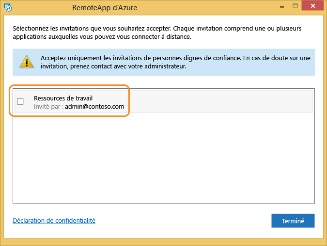
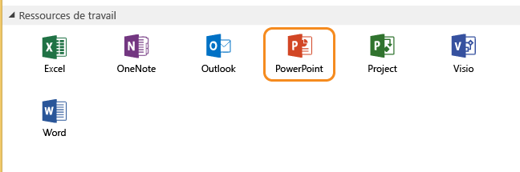
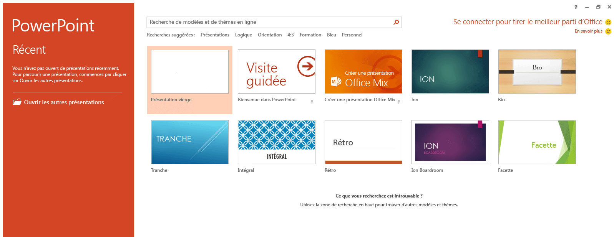

<properties
   pageTitle="Profitez de la même expérience d’Office 365 sur n’importe quel appareil avec Azure RemoteApp | Microsoft Azure"
   description="Découvrez comment partager n’importe quelle application Office 365 avec vos utilisateurs grâce à Azure RemoteApp."
   services="remoteapp"
   documentationCenter=""
   authors="guscatalano"
   manager="mbaldwin"
   editor=""/>

<tags
   ms.service="remoteapp"
   ms.devlang="na"
   ms.topic="hero-article"
   ms.tgt_pltfrm="na"
   ms.workload="compute"
   ms.date="06/27/2016"
   ms.author="guscatal;elizapo"/>

# Bénéficiez de la même expérience Office 365 sur n’importe quel appareil avec Azure RemoteApp

Cet article explique comment déployer Office 365 sur n’importe quel appareil au sein de votre société. Vos utilisateurs peuvent bénéficier des mêmes fonctionnalités et de la même interface utilisateur sur Android, Apple et Windows.

Pour ce faire, nous allons utiliser Azure RemoteApp en hébergeant Office 365 sur des machines virtuelles évolutives dans Azure, auxquelles les utilisateurs peuvent se connecter. Nous appelons cet ensemble de machines virtuelles une « collection cloud ».

## Création d'une collection cloud

Après avoir créé un compte Azure, accédez à **RemoteApp** en cliquant sur le lien situé à gauche. 

Continuez en cliquant sur **Nouveau** en bas de la fenêtre, puis sur Création rapide, afin de créer une collection. Indiquez un nom, la région, l’abonnement, le plan et l’image « Office Professionnel 2013 » proposée. 

Une fois le formulaire rempli, le processus de création de formulaire devrait démarrer. Cette procédure peut prendre environ une heure.

Une fois le processus terminé, vous devriez obtenir le résultat suivant. Si vous cliquez sur **Publication**, vous voyez que la plupart des applications Office ont déjà été publiées. 

À ce stade, vous pouvez également ajouter des utilisateurs ayant accès à cette collection en cliquant sur **Accès utilisateur**. 

À présent, nous allons essayer de nous connecter à Office 365 !

## Connexion à Office 365

Rendez-vous sur [https://www.remoteapp.windowsazure.com/](https://www.remoteapp.windowsazure.com/), faites défiler la page vers le bas et cliquez sur **Télécharger les clients** pour installer le client Azure RemoteApp sur votre appareil. Les captures d’écran ci-dessous correspondent à l’environnement Windows.

Lorsque l’application démarre, le système vous demande de vous connecter à l’aide de votre compte Microsoft (anciennement dénommé « Windows Live ID »). Utilisez celui de votre compte Azure pour le moment. Une fois connecté, vous devriez voir une notification vous indiquant de nouvelles invitations. Cliquez dessus pour afficher une liste comme celle ci-dessous. Acceptez l’invitation correspondant à l’adresse e-mail de votre compte Azure.

Ce que vous voyez lorsque de nouvelles invitations sont disponibles.

Une fois l’invitation acceptée, vous devriez voir toutes les applications Office dans le client Azure RemoteApp.

Lorsque vous cliquez sur l’une de ces applications, celle-ci démarre sur la machine virtuelle Azure, entièrement configurée ! Vous n’avez plus qu’à l’utiliser !

<!---HONumber=AcomDC_0629_2016-->