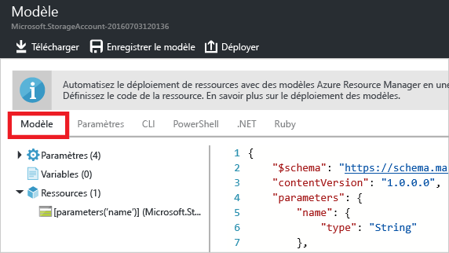

<properties
	pageTitle="Exporter un modèle Azure Resource Manager | Microsoft Azure"
	description="Utilisez Azure Resource Manage pour exporter un modèle à partir d’un groupe de ressources existant."
	services="azure-resource-manager"
	documentationCenter=""
	authors="tfitzmac"
	manager="timlt"
	editor="tysonn"/>

<tags
	ms.service="azure-resource-manager"
	ms.workload="multiple"
	ms.tgt_pltfrm="na"
	ms.devlang="na"
	ms.topic="get-started-article"
	ms.date="06/28/2016"
	ms.author="tomfitz"/>

# Exporter un modèle Azure Resource Manager à partir de ressources existantes

Resource Manager vous permet d’exporter un modèle Resource Manager à partir de ressources existantes dans votre abonnement. Vous pouvez utiliser le modèle généré pour découvrir la syntaxe du modèle, ou pour automatiser le redéploiement de votre solution en fonction des besoins.

Il est important de noter qu’il existe deux façons différentes d’exporter un modèle :

- Vous pouvez exporter le modèle actuel qui a été utilisé pour un déploiement. Le modèle exporté inclut l’ensemble des paramètres et des variables exactement comme elles ont été définies dans le modèle d’origine. Cette approche est particulièrement utile lorsque vous avez déployé des ressources via le portail et que vous voulez voir comment créer le modèle pour créer ces ressources.
- Vous pouvez exporter le modèle qui représente l’état actuel du groupe de ressources. Le modèle exporté n’est pas basé sur un modèle utilisé pour le déploiement. Au lieu de cela, il crée un modèle qui est un instantané du groupe de ressources. Le modèle exporté aura probablement de nombreuses valeurs codées en dur et pas autant de paramètres que vous pourriez généralement définir. Cette approche est utile lorsque vous avez modifié le groupe de ressources par le biais du portail ou de scripts et que vous devez maintenant capturer le groupe de ressources en tant que modèle.

Les deux approches sont présentées dans cette rubrique. Dans l’article [Personnaliser un modèle Azure Resource Manager exporté](resource-manager-customize-template.md), vous allez apprendre à utiliser un modèle généré à partir de l’état actuel du groupe de ressources et à le rendre plus utile pour redéployer votre solution.

Dans ce didacticiel, vous allez vous connecter au portail Azure, créer un compte de stockage et exporter le modèle pour ce dernier. Vous allez ajouter un réseau virtuel pour modifier le groupe de ressources. Enfin, vous allez exporter un nouveau modèle qui représente son état actuel. Bien que cet article présente le cas d’une infrastructure simplifiée, vous pouvez suivre les mêmes étapes pour exporter un modèle dédié à une solution plus complexe.

## Créez un compte de stockage.

1. Dans le [Portail Azure](https://portal.azure.com), sélectionnez **Nouveau** > **Données + Stockage** > **Compte de stockage**.

      

2. Créez un compte de stockage portant le nom **stockage**, vos initiales et la date. Le nom du compte de stockage doit être unique dans Azure. Si vous avez essayé un nom déjà utilisé, essayez une variante. Pour le groupe de ressources, utilisez **ExportGroup**. Vous pouvez utiliser les valeurs par défaut des autres propriétés. Sélectionnez **Créer**.

      

Une fois le déploiement terminé, votre abonnement contient le compte de stockage.

## Exporter le modèle à partir de l’historique de déploiement

1. Accédez au panneau de groupe de ressources de votre nouveau groupe de ressources. Vous pouvez voir que le résultat du dernier déploiement est répertorié. Sélectionnez ce lien.

      

2. Un historique des déploiements du groupe s’affiche. Dans votre cas, il n’y a probablement qu’un seul déploiement répertorié. Sélectionnez ce déploiement.

     

3. Un résumé du déploiement s’affiche. Le résumé inclut l’état du déploiement et ses opérations, ainsi que les valeurs de paramètres que vous avez fournies. Pour voir le modèle utilisé pour le déploiement, sélectionnez **Afficher le modèle**.

     

4. Resource Manager récupère pour vous les cinq fichiers ci-dessous :

   1. **Modèle** - Modèle définissant l’infrastructure de votre solution. Lorsque vous avez créé le compte de stockage via le portail, Resource Manager a utilisé un modèle pour le déployer et a enregistré ce modèle pour référence ultérieure.
   2. **Paramètres** - Fichier de paramètres que vous pouvez utiliser pour transmettre des valeurs au cours du déploiement. Il contient les valeurs que vous avez fournies lors du premier déploiement, mais vous pouvez modifier ces valeurs lors du redéploiement du modèle.
   3. **CLI** - Fichier de script d’interface de ligne de commande Azure que vous pouvez utiliser pour déployer le modèle.
   4. **PowerShell** - Fichier de script Azure PowerShell que vous pouvez utiliser pour déployer le modèle.
   5. **.NET** - Classe .NET que vous pouvez utiliser pour déployer le modèle.

     Les fichiers sont disponibles via des liens dans le panneau. Par défaut, le modèle est sélectionné.

       

     Regardons de plus près le modèle. Ce modèle doit ressembler à ce qui suit :

        {
          "$schema": "https://schema.management.azure.com/schemas/2015-01-01/deploymentTemplate.json#",
          "contentVersion": "1.0.0.0",
          "parameters": {
            "name": {
              "type": "String"
            },
            "accountType": {
              "type": "String"
            },
            "location": {
              "type": "String"
            },
            "encryptionEnabled": {
              "defaultValue": false,
              "type": "Bool"
            }
          },
          "resources": [
            {
              "type": "Microsoft.Storage/storageAccounts",
              "sku": {
                "name": "[parameters('accountType')]"
              },
              "kind": "Storage",
              "name": "[parameters('name')]",
              "apiVersion": "2016-01-01",
              "location": "[parameters('location')]",
              "properties": {
                "encryption": {
                  "services": {
                    "blob": {
                      "enabled": "[parameters('encryptionEnabled')]"
                    }
                  },
                  "keySource": "Microsoft.Storage"
                }
              }
            }
          ]
        }
 
Il s’agit du modèle réel utilisé pour créer votre compte de stockage. Notez qu’il contient des paramètres qui vous permettent de déployer différents types de comptes de stockage. Pour plus d’informations sur la structure d’un modèle, consultez [Création de modèles Azure Resource Manager](resource-group-authoring-templates.md). Pour obtenir la liste complète des fonctions que vous pouvez utiliser dans un modèle, consultez [Fonctions des modèles Azure Resource Manager](resource-group-template-functions.md).


## Ajouter un réseau virtuel

Le modèle que vous avez téléchargé dans la section précédente représentait l’infrastructure de ce déploiement d’origine, mais il ne sera pas pris en compte dans les modifications que vous apporterez après le déploiement. Pour illustrer ce problème, modifions le groupe de ressources en ajoutant un réseau virtuel via le portail.

1. Dans le volet du groupe de ressources, sélectionnez **Ajouter**.

      

2. Sélectionnez **Réseau virtuel** à partir des ressources disponibles.

      

2. Nommez votre réseau virtuel **VNET** et utilisez les valeurs par défaut pour les autres propriétés. Sélectionnez **Créer**.

      

3. Une fois le réseau virtuel correctement déployé vers votre groupe de ressources, examinez à nouveau l’historique de déploiement. Vous voyez maintenant deux déploiements. Si le second déploiement ne s’affiche pas, vous devrez peut-être fermer le volet du groupe de ressources et le réouvrir. Sélectionnez un déploiement plus récent.

      

4. Examinez le modèle pour ce déploiement. Notez qu’il définit uniquement les modifications apportées pour ajouter le réseau virtuel.

Il est généralement recommandé de travailler avec un modèle qui déploie l’ensemble de l’infrastructure de votre solution en une seule opération, plutôt qu’en mémorisant de nombreux modèles différents à déployer.


## Exportation du modèle à partir d’un groupe de ressources

Bien que chaque déploiement affiche seulement les modifications apportées à votre groupe de ressources, vous pouvez à tout moment exporter un modèle pour afficher les attributs de votre groupe de ressources complet.

1. Pour afficher le modèle pour un groupe de ressources, sélectionnez **Exporter le modèle**.

      

     Tous les types de ressources prennent en charge la fonction de modèle d’exportation. Si votre groupe de ressources contient uniquement le compte de stockage et le réseau virtuel indiqués dans cet article, aucune erreur ne s’affiche. Cependant, si vous avez créé d’autres types de ressources, vous pouvez rencontrer une erreur indiquant qu’il existe un problème avec l’exportation. Vous allez apprendre à gérer ces problèmes dans la section [Résoudre les problèmes d’exportation](#fixing-export-issues).

      

2. Vous verrez à nouveau les 5 fichiers que vous pouvez utiliser pour redéployer la solution, mais cette fois le modèle est un peu différent. Ce modèle comporte seulement 2 paramètres : un pour le nom du compte de stockage et un pour le nom du réseau virtuel.

        "parameters": {
          "virtualNetworks_VNET_name": {
            "defaultValue": "VNET",
            "type": "String"
          },
          "storageAccounts_storagetf05092016_name": {
            "defaultValue": "storagetf05092016",
            "type": "String"
          }
        },

     Resource Manager n’a pas récupéré les modèles utilisés pendant le déploiement. Au lieu de cela, il a généré un nouveau modèle basé sur la configuration actuelle des ressources. Par exemple, l’emplacement et la valeur de réplication du compte stockage sont définis sur :

        "location": "northeurope",
        "tags": {},
        "properties": {
            "accountType": "Standard_RAGRS"
        },

3. Téléchargez le modèle afin de pouvoir travailler dessus en local.

      

4. Recherchez le fichier .zip que vous avez téléchargé et extrayez le contenu. Vous pouvez utiliser ce modèle téléchargé pour redéployer votre infrastructure.

## Résoudre les problèmes d’exportation

Tous les types de ressources prennent en charge la fonction de modèle d’exportation. Certains types de ressources ne sont pas exportés pour empêcher l’exposition de données sensibles. Par exemple, si vous avez une chaîne de connexion dans la configuration de votre site, vous souhaitez probablement qu’il ne s’affiche pas explicitement dans un modèle exporté. Vous pouvez contourner ce problème en ajoutant manuellement les ressources manquantes à votre modèle.

> [AZURE.NOTE] Vous rencontrerez des problèmes d’exportation uniquement lors de l’exportation à partir d’un groupe de ressources et non à partir de votre historique de déploiement. Si votre dernier déploiement représente précisément l’état actuel du groupe de ressources, vous devez exporter le modèle à partir de l’historique de déploiement, plutôt que depuis le groupe de ressources. Procédez à une exportation à partir d’un groupe de ressources lorsque vous avez apporté des modifications au groupe de ressources qui ne sont pas définies dans un modèle unique.

Par exemple, si vous exportez un modèle pour un groupe de ressources contenant une application web, une base de données SQL et une chaîne de connexion dans la configuration de site, le message suivant s’affiche.


La sélection du message vous montre exactement les types de ressources qui n’ont pas été exportés.
     


Certains correctifs courants sont présentés ci-dessous. Pour implémenter ces ressources, vous devrez ajouter des paramètres au modèle. Consultez [Personnaliser et redéployer le modèle exporté](resource-manager-customize-template.md) pour en savoir plus.

### Chaîne de connexion

Dans la ressource de sites web, ajoutez une définition pour la chaîne de connexion à la base de données :

```
{
  "type": "Microsoft.Web/sites",
  ...
  "resources": [
    {
      "apiVersion": "2015-08-01",
      "type": "config",
      "name": "connectionstrings",
      "dependsOn": [
          "[concat('Microsoft.Web/Sites/', parameters('<site-name>'))]"
      ],
      "properties": {
          "DefaultConnection": {
            "value": "[concat('Data Source=tcp:', reference(concat('Microsoft.Sql/servers/', parameters('<database-server-name>'))).fullyQualifiedDomainName, ',1433;Initial Catalog=', parameters('<database-name>'), ';User Id=', parameters('<admin-login>'), '@', parameters('<database-server-name>'), ';Password=', parameters('<admin-password>'), ';')]",
              "type": "SQLServer"
          }
      }
    }
  ]
}
```    

### Extension du site web

Dans la ressource de sites web, ajoutez une définition à installer par le biais de code :

```
{
  "type": "Microsoft.Web/sites",
  ...
  "resources": [
    {
      "name": "MSDeploy",
      "type": "extensions",
      "location": "[resourceGroup().location]",
      "apiVersion": "2015-08-01",
      "dependsOn": [
        "[concat('Microsoft.Web/sites/', parameters('<site-name>'))]"
      ],
      "properties": {
        "packageUri": "[concat(parameters('<artifacts-location>'), '/', parameters('<package-folder>'), '/', parameters('<package-file-name>'), parameters('<sas-token>'))]",
        "dbType": "None",
        "connectionString": "",
        "setParameters": {
          "IIS Web Application Name": "[parameters('<site-name>')]"
        }
      }
    }
  ]
}
```

### Extension de machine virtuelle

Pour obtenir des exemples d’extensions de machine virtuelle, consultez [Exemples de configuration d’extension de machine virtuelle Azure Windows](./virtual-machines/virtual-machines-windows-extensions-configuration-samples.md).

### Passerelle de réseau virtuel

Ajoutez un type de ressource de passerelle de réseau virtuel.

```
{
  "type": "Microsoft.Network/virtualNetworkGateways",
  "name": "[parameters('<gateway-name>')]",
  "apiVersion": "2015-06-15",
  "location": "[resourceGroup().location]",
  "properties": {
    "gatewayType": "[parameters('<gateway-type>')]",
    "ipConfigurations": [
      {
        "name": "default",
        "properties": {
          "privateIPAllocationMethod": "Dynamic",
          "subnet": {
            "id": "[resourceId('Microsoft.Network/virtualNetworks/subnets', parameters('<vnet-name>'), parameters('<new-subnet-name>'))]"
          },
          "publicIpAddress": {
            "id": "[resourceId('Microsoft.Network/publicIPAddresses', parameters('<new-public-ip-address-Name>'))]"
          }
        }
      }
    ],
    "enableBgp": false,
    "vpnType": "[parameters('<vpn-type>')]"
  },
  "dependsOn": [
    "Microsoft.Network/virtualNetworks/codegroup4/subnets/GatewaySubnet",
    "[concat('Microsoft.Network/publicIPAddresses/', parameters('<new-public-ip-address-Name>'))]"
  ]
},
```

### Passerelle de réseau local

Ajoutez un type de ressource de passerelle de réseau local.

```
{
    "type": "Microsoft.Network/localNetworkGateways",
    "name": "[parameters('<local-network-gateway-name>')]",
    "apiVersion": "2015-06-15",
    "location": "[resourceGroup().location]",
    "properties": {
      "localNetworkAddressSpace": {
        "addressPrefixes": "[parameters('<address-prefixes>')]"
      }
    }
}
```

### Connexion

Ajoutez un type de ressource de connexion.

```
{
    "apiVersion": "2015-06-15",
    "name": "[parameters('<connection-name>')]",
    "type": "Microsoft.Network/connections",
    "location": "[resourceGroup().location]",
    "properties": {
        "virtualNetworkGateway1": {
        "id": "[resourceId('Microsoft.Network/virtualNetworkGateways', parameters('<gateway-name>'))]"
      },
      "localNetworkGateway2": {
        "id": "[resourceId('Microsoft.Network/localNetworkGateways', parameters('<local-gateway-name>'))]"
      },
      "connectionType": "IPsec",
      "routingWeight": 10,
      "sharedKey": "[parameters('<shared-key>')]"
    }
},
```


## Étapes suivantes

Félicitations ! Vous avez appris comment exporter un modèle à partir des ressources que vous avez créées dans le portail.

- Dans la deuxième partie de ce didacticiel, vous allez personnaliser le modèle que vous venez de télécharger en ajoutant des paramètres et en le redéployant dans un script. Consultez [Personnaliser et redéployer le modèle exporté](resource-manager-customize-template.md).
- Pour savoir comment exporter un modèle via PowerShell, consultez [Utilisation d’Azure PowerShell avec Azure Resource Manager](powershell-azure-resource-manager.md).
- Pour savoir comment exporter un modèle via l’interface de ligne de commande Azure, consultez [Utiliser l’interface de ligne de commande Azure pour Mac, Linux et Windows avec Azure Resource Manager](xplat-cli-azure-resource-manager.md).

<!---HONumber=AcomDC_0629_2016-->