# Alertes de sécurité par type dans le centre de sécurité Azure
Ce document vous aide à comprendre les différents types d’alertes de sécurité disponibles dans Azure Security Center. Pour plus d’informations sur la gestion des alertes, consultez [Gestion et résolution des alertes de sécurité dans Azure Security Center](security-center-managing-and-responding-alerts.md) .

> [!NOTE]
> Pour activer la détection avancée, effectuez une mise à niveau vers Azure Security Center Standard. Une version d’évaluation gratuite de 90 jours est disponible. Pour mettre à niveau, sous [Stratégie de sécurité](security-center-policies.md), sélectionnez Niveau tarifaire. Pour en savoir plus, consultez la [page de tarification](https://azure.microsoft.com/pricing/details/security-center/) .
>
>

## Quels types d’alertes sont disponibles ?
Azure Security Center fournit différentes alertes qui s’alignent sur les étapes de cyberchaîne de destruction. La figure ci-dessous fournit des exemples de différentes alertes en lien avec certaines de ces étapes.

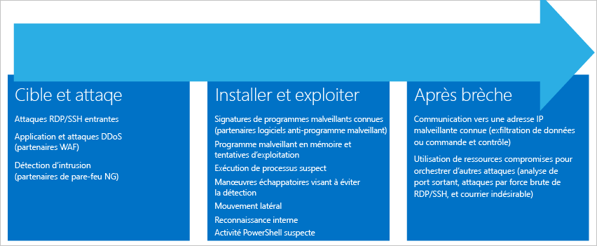

**Cible et attaque**

* Attaques RDP/SSH entrantes
* Attaques d’applications et DDoS (partenaires WAF)
* Détection d’intrusion (partenaires pare-feu NG)

**Installation et code malveillant exploitant une faille de sécurité**

* Signatures de programmes malveillants connus (partenaires AM)
* Tentatives de codes malveillants exploitant une faille de sécurité et de programmes malveillants en mémoire
* Exécution de processus suspects
* Manœuvres dissimulées pour éviter la découverte
* Mouvement latéral
* Reconnaissance interne
* Activité PowerShell suspecte

**Après une violation**  

* Communication vers une adresse IP malveillante connue (exfiltration des données ou commande et contrôle)
* Utilisation des ressources compromises pour lancer d’autres attaques (attaques en force brute RDP/SSH analysant le port sortant, et courrier indésirable)

Différents types d’attaques sont associées à chaque phase et elles ciblent différents sous-systèmes. Pour résoudre ces attaques pendant ces phases, Azure Security Center comporte trois catégories d’alertes :

* Analyse comportementale de la machine virtuelle (VMBA)
* Analyse du réseau
* Analyse des ressources

## Analyse comportementale de la machine virtuelle
Azure Security Center peut utiliser l’analyse comportementale pour identifier les ressources compromises en se basant sur l’analyse des journaux d’événements (par exemple, les événements de création de processus, les événements de connexion, etc.). En outre, il existe une corrélation avec les autres signaux pour rechercher les preuves d’une campagne généralisée.

> [!NOTE]
> Pour plus d’informations sur le fonctionnement des fonctionnalités de détection de Security Center, consultez [Fonctionnalités de détection d’Azure Security Center](security-center-detection-capabilities.md).
>
>

### Analyse des incidents
L’analyse de la mémoire de vidage sur incident est une méthode utilisée pour détecter les programmes malveillants sophistiqués capables d’échapper aux solutions de sécurité traditionnelles. Différentes formes de programmes malveillants tentent de réduire le risque de détection par des produits antivirus en n’écrivant jamais sur le disque ou en chiffrant les composants logiciels écrits sur le disque. Ainsi, les programmes malveillants sont difficiles à l’aide des logiciels anti-programmes malveillants traditionnels. Toutefois, ces programmes malveillants peuvent être détectés à l’aide de l’analyse de mémoire, car le programme malveillant laisse des traces en mémoire pour pouvoir fonctionner.

Lorsque le logiciel se bloque, un vidage sur incident capture une partie de la mémoire au moment de l’incident. L’incident peut être provoqué par un programme malveillant, une application générale ou des problèmes système. En analysant la mémoire dans le vidage sur incident, Azure Security Center peut détecter les techniques utilisées pour exploiter la vulnérabilité des logiciels, accéder aux données confidentielles et persister subrepticement au sein d’un ordinateur compromis. Ces opérations ont peu d’impact sur les performances des hôtes car l’analyse est effectuée au cœur d’Azure Security Center.

Les champs suivants sont communs aux alertes de vidage sur incident répertoriées ci-dessous :

* DUMPFILE : nom du fichier de vidage sur incident.
* PROCESSNAME : nom du processus bloqué.
* PROCESSVERSION : version du processus bloqué.

### Shellcode détecté
Un shellcode est la charge utile exécutée après qu’un programme malveillant a exploité une vulnérabilité logicielle. Cette alerte indique que l’analyse de vidage sur incident a détecté du code exécutable présentant un comportement souvent associé à des charges utiles malveillantes. Bien que des logiciels non malveillants puissent présenter aussi ce comportement, il n’est pas typique des pratiques de développement logiciel normales.

Cette alerte fournit le champ supplémentaire suivant :

* ADRESSE : emplacement du shellcode dans la mémoire.

Voici un exemple de ce type d’alerte :

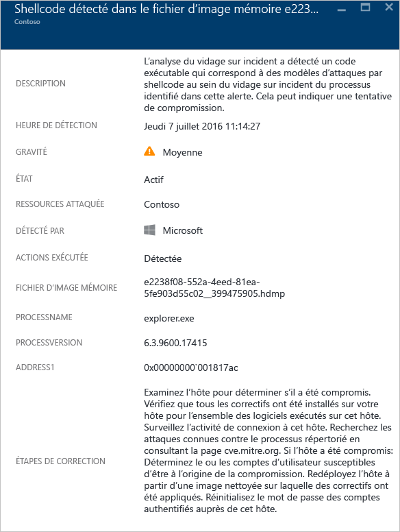

### Détournement de module détecté
Windows s’appuie sur des bibliothèques de liens dynamiques (DLL) pour exploiter les fonctionnalités système courantes. Un détournement de DLL se produit lorsqu’un programme malveillant modifie l’ordre de chargement des DLL pour charger des charges utiles malveillantes dans la mémoire, où du code arbitraire peut être exécuté. Cette alerte indique que l’analyse de vidage sur incident a détecté qu’un module portant le même nom est chargé à partir de deux chemins d’accès différents, l’un de ces chemins correspondant à un emplacement de fichier binaire système Windows courant.

Les développeurs de logiciels légitimes modifient parfois l’ordre de chargement des DLL pour des raisons non malveillantes, telles que l’instrumentation ou l’extension du système d’exploitation Windows ou des applications Windows. Pour distinguer les modifications malveillantes et les modifications potentiellement bénignes apportées à l’ordre de chargement des DLL, Azure Security Center vérifie si un module chargé est conforme à un profil suspect. Le résultat de cette vérification est indiqué par le champ « SIGNATURE » de l’alerte et est répercuté dans le niveau de gravité de l’alerte, la description de l’alerte et les étapes de correction de l’alerte. L’analyse de la copie sur disque du module de détournement, par exemple en vérifiant la signature numérique des fichiers ou en exécutant une analyse antivirus, peut fournir des informations supplémentaires quant à la nature légitime ou malveillante de ce dernier.

En plus des champs communs décrits dans la section « Shellcode détecté » ci-dessus, cette alerte fournit les champs suivants :

* SIGNATURE : indique si le module de détournement est conforme à un profil de comportement suspect.
* HIJACKEDMODULE : nom du module système Windows détourné.
* HIJACKEDMODULEPATH : chemin d’accès du module système Windows détourné.
* HIJACKINGMODULEPATH : chemin d’accès du module de détournement.

Voici un exemple de ce type d’alerte :

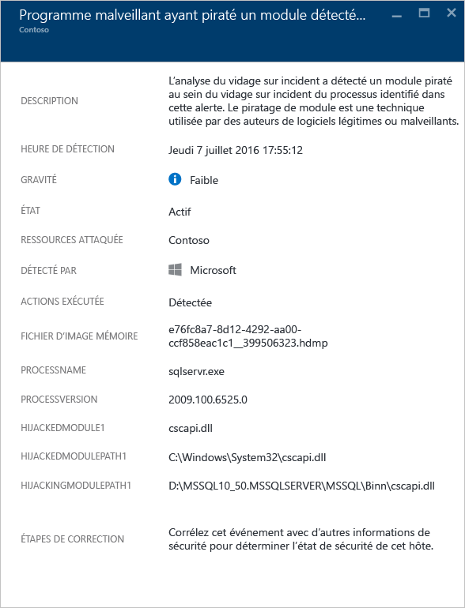

### Usurpation d’identité de module Windows détectée
Les programmes malveillants peuvent utiliser des noms courants de fichiers binaires système (par exemple, SVCHOST.EXE) ou de modules (par exemple, NTDLL.DLL) Windows pour « se fondre » et cacher la nature malveillante des logiciels aux administrateurs système. Cette alerte indique que l’analyse de vidage sur incident a détecté que le fichier de vidage sur incident contient des modules qui utilisent des noms de modules système Windows, mais ne remplissent pas les autres critères typiques des modules Windows. L’analyse de la copie sur disque du module d’usurpation d’identité peut fournir des informations supplémentaires quant à la nature légitime ou malveillante de ce dernier. L’analyse peut inclure les opérations suivantes :

* Confirmation que le fichier en question est fourni dans le cadre d’un package logiciel légitime
* Vérification de la signature numérique du fichier
* Exécution d’une analyse antivirus sur le fichier

En plus des champs communs décrits dans la section « Shellcode détecté » ci-dessus, cette alerte fournit les champs suivants :

* DETAILS : indique si les métadonnées du module sont valides et si le module a été chargé depuis un chemin d’accès système.
* NOM : nom du module Windows d’usurpation d’identité.
* PATH : chemin d’accès du module Windows d’usurpation d’identité.

Cette alerte extrait et affiche également certains champs de l’en-tête PE du module, tels que « CHECKSUM » et « TIMESTAMP ». Ces champs sont affichés uniquement s’ils sont présents dans le module. Pour plus d’informations sur ces champs, consultez la [spécification Microsoft PE et COFF](https://msdn.microsoft.com/windows/hardware/gg463119.aspx) .

Voici un exemple de ce type d’alerte :

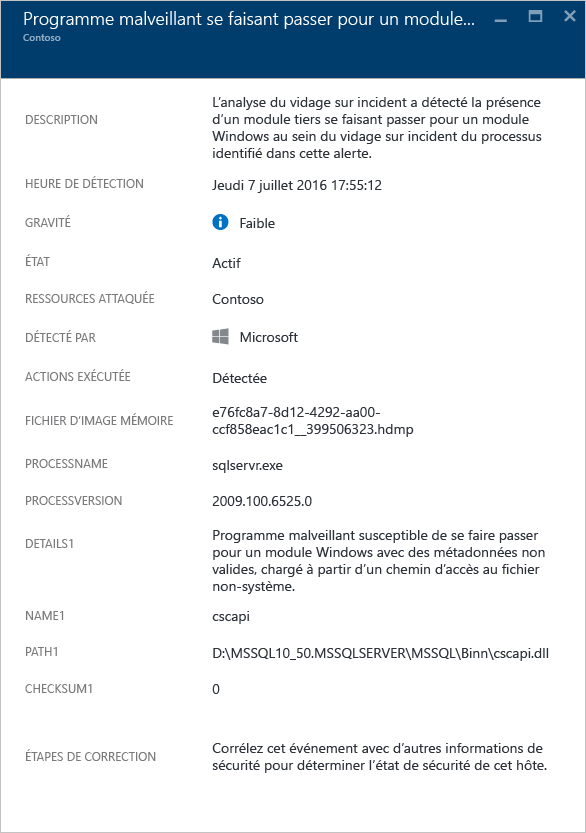

### Fichier binaire système modifié détecté
Les programmes malveillants peuvent modifier des fichiers binaires système de base pour accéder de façon dissimulée aux données ou persister subrepticement sur un système compromis. Cette alerte indique que l’analyse de vidage sur incident a détecté que des fichiers binaires de base du système d’exploitation Windows ont été modifiés dans la mémoire ou sur le disque.
Les développeurs de logiciels légitimes modifient parfois des modules système dans la mémoire pour des raisons non malveillantes, par exemple avec Detours ou pour la compatibilité des applications. Pour distinguer les modules malveillants et les modules potentiellement légitimes, Azure Security Center vérifie si le module modifié est conforme à un profil suspect. Le résultat de cette vérification est indiqué par le niveau de gravité de l’alerte, la description de l’alerte et les étapes de correction de l’alerte.

En plus des champs communs décrits dans la section « Shellcode détecté » ci-dessus, cette alerte fournit les champs suivants :

* MODULENAME : nom du fichier binaire système modifié.
* MODULEVERSION : version du fichier binaire système modifié.

Voici un exemple de ce type d’alerte :

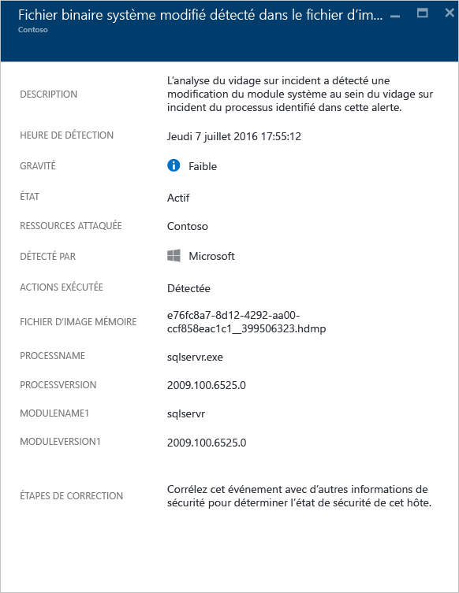

### Processus suspect exécuté
Azure Security Center identifie le processus suspect en cours d’exécution dans la machine virtuelle cible et déclenche une alerte. La détection ne recherche pas un nom spécifique, mais son paramètre. Ainsi, même si la personne malveillante renomme le fichier exécutable, Azure Security Center est toujours en mesure de le détecter.

Voici un exemple de ce type d’alerte :

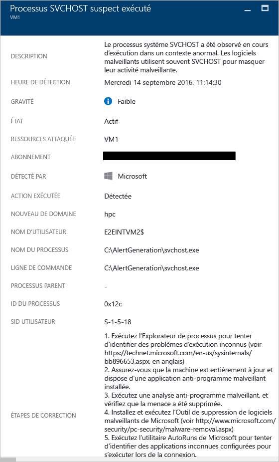

### Plusieurs comptes de domaine interrogés
Azure Security Center peut détecter plusieurs tentatives d’interrogation de comptes de domaine, généralement effectuées par des personnes malveillantes au cours de la reconnaissance du réseau. Les personnes malveillantes peuvent exploiter cette technique pour interroger le domaine et identifier les utilisateurs, les comptes d’administration de domaine, les ordinateurs qui sont des contrôleurs de domaine et la relation d’approbation potentielle d’un domaine avec d’autres domaines.

Voici un exemple de ce type d’alerte :

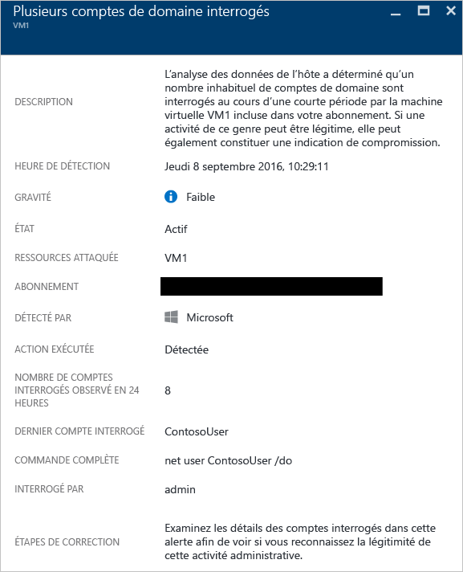

## Analyse du réseau
La détection des menaces sur le réseau assurée par Azure Security Center fonctionne en collectant automatiquement les informations de sécurité à partir du trafic IPFIX (Internet Protocol Flow Information Export) Azure. Elle analyse ces informations, souvent issues de plusieurs sources, pour identifier les menaces.

### Trafic sortant suspect détecté
Les périphériques réseau peuvent être détectés et profilés de la même façon que les autres types de systèmes. Les pirates commencent généralement par l’analyse des ports / le balayage des ports. L’exemple ci-dessous présente un trafic SSH suspect d’une machine virtuelle pouvant être en train de procéder à une attaque de force brute SSH ou à une attaque par balayage des ports contre une ressource externe.

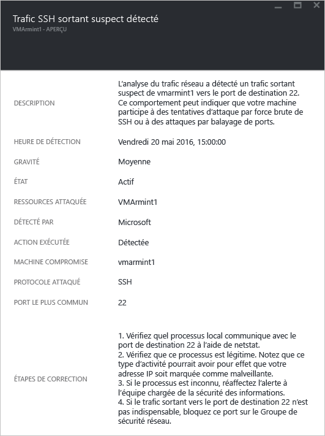

Cette alerte fournit des informations qui vous permettent d’identifier la ressource qui a été utilisée pour lancer ce type d’attaque, l’ordinateur compromis, l’heure de détection, le protocole et le port qui a été utilisé. Ce panneau vous donne également une liste des étapes de résolution pouvant être utilisées pour résoudre ce problème.

### Communication réseau avec un ordinateur malveillant
En exploitant les flux des informations sur les menaces de Microsoft, Azure Security Center peut détecter les ordinateurs compromis qui communiquent avec des adresses IP malveillantes, généralement un centre de commande et de contrôle. Dans ce cas, Azure Security Center a détecté que la communication a été effectuée à l’aide du programme malveillant Pony Loader (également appelé [Fareit](https://www.microsoft.com/security/portal/threat/encyclopedia/entry.aspx?Name=PWS:Win32/Fareit.AF)).

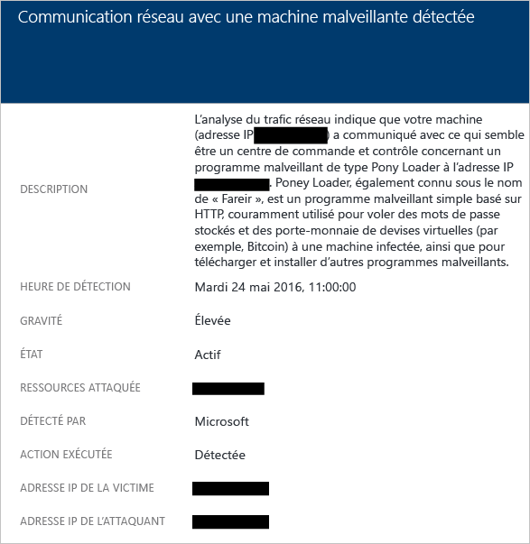

Cette alerte fournit des informations qui vous permettent d’identifier la ressource qui a été utilisée pour lancer ce type d’attaque, la ressource attaquée, l’adresse IP de la victime, l’adresse IP de l’attaquant et l’heure de détection.

> [!NOTE]
> Les adresses IP dynamiques ont été supprimés de cette capture d’écran à des fins de confidentialité.
>
>

### Attaque potentielle par déni de service sortant détectée
Un trafic réseau anormal provenant d’une machine virtuelle peut amener Azure Security Center à déclencher un type d’attaque potentielle par déni de service.

Voici un exemple de ce type d’alerte :

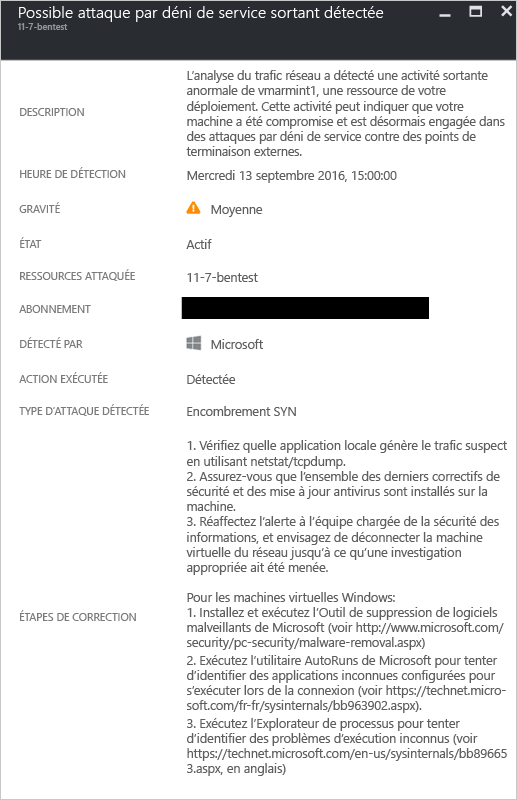

## Analyse des ressources
Dans Security Center, l’analyse des ressources se concentre sur les services PaaS, comme l’intégration avec la fonctionnalité de [détection des menaces de la base de données SQL Azure](../sql-database/sql-database-threat-detection-get-started.md) . Selon les résultats de l’analyse de ces zones, Azure Security Center déclenche une alerte associée aux ressources.

### Injection potentielle de code SQL
Une attaque par injection de code SQL est une attaque dans laquelle un code malveillant est inséré dans les chaînes transmises ultérieurement à une instance de SQL Server pour analyse et exécution. Toute procédure qui construit des instructions SQL doit être analysée pour rechercher les vulnérabilités d’injection, car SQL Server exécutera toutes les requêtes syntaxiquement valides qu’il reçoit. La fonctionnalité de détection des menaces SQL utilise l’apprentissage machine, l’analyse comportementale et la détection d’anomalie pour déterminer les événements suspects pouvant survenir dans les bases de données SQL Azure. Par exemple :

* Tentative d’accès à la base de données par un ancien employé
* Attaques par injection de code SQL
* Accès inhabituel à la base de données de production par un utilisateur à son domicile

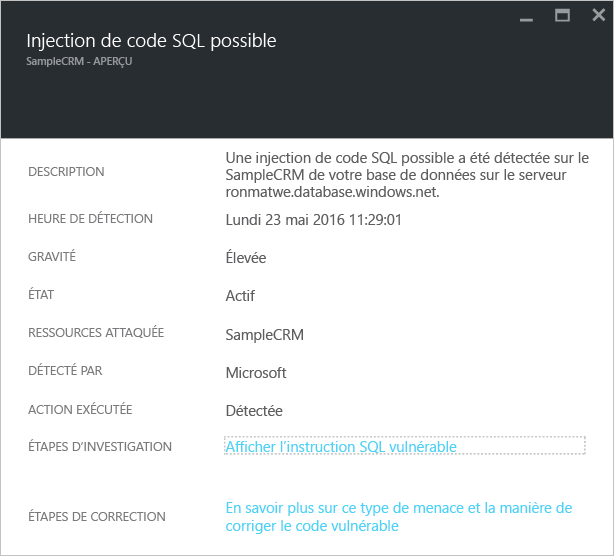

Cette alerte fournit des informations qui vous permettent d’identifier la ressource attaquée, l’heure de détection et l’état de l’attaque. Elle fournit également un lien vers des étapes d’investigation supplémentaires.

### Vulnérabilité par injection de code SQL
Cette alerte est déclenchée lorsqu’une erreur d’application a été détectée sur une base de données, pouvant indiquer une vulnérabilité potentielle liée à des attaques par injection de code SQL.

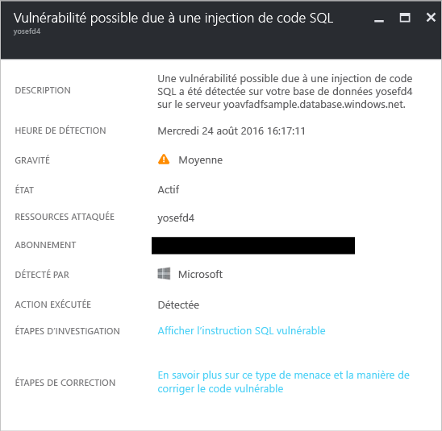

### Accès inhabituel depuis un emplacement inconnu
Cette alerte est déclenchée lorsqu’un accès à partir d’une adresse IP inconnue a été détectée sur le serveur, qui n’était pas visible lors de la dernière période.

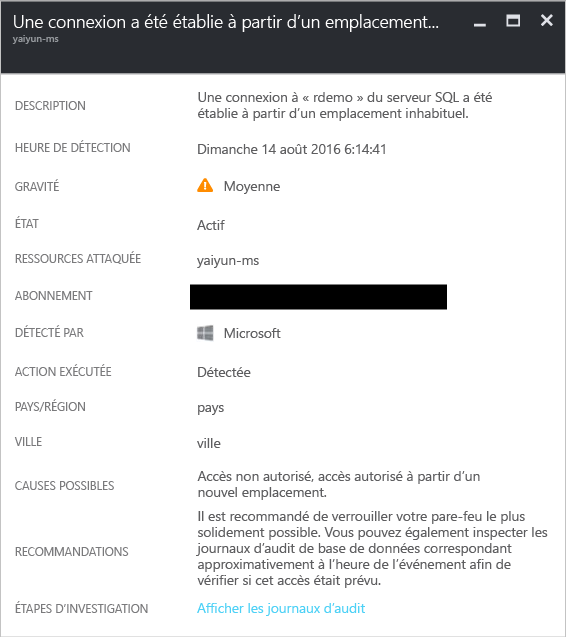

## Voir aussi
Ce document vous a présenté les différents types d’alertes de sécurité dans Azure Security Center. Pour plus d’informations sur le Centre de sécurité, consultez les rubriques suivantes :

* [Gestion des incidents de sécurité dans Azure Security Center](security-center-incident.md)
* [Fonctionnalités de détection d’Azure Security Center](security-center-detection-capabilities.md)
* [Guide des opérations et de planification du Centre de sécurité Azure](security-center-planning-and-operations-guide.md)
* [FAQ d’Azure Security Center](security-center-faq.md) : découvrez les réponses aux questions les plus souvent posées à propos de l’utilisation de ce service.
* [Blog sur la sécurité Azure](http://blogs.msdn.com/b/azuresecurity/) : accédez à des billets de blog sur la sécurité et la conformité Azure.

<!--HONumber=Dec16_HO2-->

