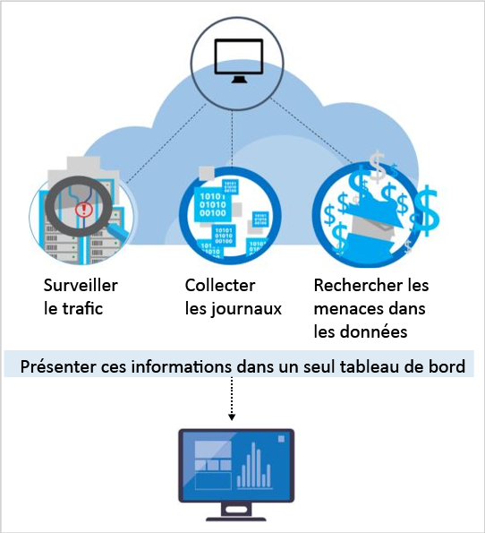

<properties
   pageTitle="Fonctionnalités de détection dans Azure Security Center | Microsoft Azure"
   description="Ce document vous a permis de découvrir les fonctionnalités de détection d’Azure Security Center, ainsi que leur fonctionnement."
   services="security-center"
   documentationCenter="na"
   authors="YuriDio"
   manager="swadhwa"
   editor=""/>

<tags
   ms.service="security-center"
   ms.topic="hero-article"
   ms.devlang="na"
   ms.tgt_pltfrm="na"
   ms.workload="na"
   ms.date="07/21/2016"
   ms.author="yurid"/>

# Fonctionnalités de détection d’Azure Security Center
Ce document aborde les fonctionnalités avancées de détection d’Azure Security Center, qui permet d’identifier les menaces actives ciblant vos ressources Microsoft Azure et fournit les informations nécessaires pour y répondre rapidement.

## Répondre aux menaces actuelles
Les menaces ont fortement évolué au cours des 20 dernières années. Dans le passé, les entreprises avaient uniquement à se soucier de la dégradation de site web par des personnes malveillantes isolées cherchant principalement à découvrir « jusqu’où elles pouvaient aller ». Les pirates d’aujourd’hui sont beaucoup plus sophistiqués et organisés. Ils ont souvent des objectifs financiers et stratégiques spécifiques. Ils ont également davantage de ressources disponibles, car ils peuvent être financés par des États-nations ou encore par le crime organisé.

Cela a conduit à un niveau inédit de professionnalisme dans les rangs des attaquants. Ces derniers ne s’intéressent plus à la dégradation de site web, mais plutôt au vol d’informations, aux comptes financiers et aux données privées qu’ils peuvent utiliser pour générer des liquidités sur le marché ouvert ou pour exploiter une activité commerciale particulière, ou encore une position politique ou militaire. Les pirates qui violent les réseaux afin de nuire à l’infrastructure et aux personnes constituent une menace bien plus importante que les pirates avec des objectifs financiers.

Face au problème, les organisations déploient souvent plusieurs solutions, axées sur la défense du périmètre de l’entreprise ou de points de terminaison en recherchant des signatures d’attaques connues. Ces solutions ont tendance à générer un volume élevé d’alertes basse fidélité, qui nécessitent qu’un analyste les trie et les examine. La plupart des organisations ne disposent pas du temps et de l’expertise nécessaires pour répondre à ces alertes, qui restent alors bien souvent sans réponse. Parallèlement, les attaquants ont fait évoluer leurs méthodes pour compromettre les nombreuses défenses basées sur la signature et pour [s’adapter aux environnements de cloud](https://azure.microsoft.com/blog/detecting-threats-with-azure-security-center/). De nouvelles approches sont nécessaires pour identifier plus rapidement les nouvelles menaces, et accélérer la détection et la réaction.

## Comment Azure Security Center détecte et répond aux menaces

Les chercheurs en sécurité de Microsoft sont constamment à l’affût des nouvelles menaces. Ils ont accès à un vaste jeu de télémétrie acquis grâce à la présence globale de Microsoft sur le cloud et localement. Cette collection diverse et étendue de jeux de données permet à Microsoft de détecter de nouveaux modèles et de nouvelles tendances d’attaques dans ses produits locaux destinés au consommateur et aux entreprises, ainsi que dans ses services en ligne. Par conséquent, Azure Security Center peut rapidement mettre à jour ses algorithmes de détection, puisque les pirates sont à l’origine d’attaques innovantes de plus en plus sophistiquées. Cela permet de faire face à des menaces en pleine mutation.

La détection des menaces d’Azure Security Center fonctionne en collectant automatiquement les informations de sécurité à partir de vos ressources Azure, du réseau et des solutions de partenaires connectées. Elle analyse ces informations, souvent issues de plusieurs sources, pour identifier les menaces. Les alertes de sécurité, ainsi que les recommandations sur la façon de répondre à la menace, sont hiérarchisées dans Azure Security Center.

Azure Security Center emploie des analyses de sécurité avancées allant bien au-delà des approches simplement basées sur la signature. Les innovations en matière de Big Data et de technologies [Machine Learning](https://azure.microsoft.com/blog/machine-learning-in-azure-security-center/) sont mises à profit pour évaluer des événements dans toute la structure du cloud, et permettent ainsi de détecter des menaces qui seraient impossibles à identifier à l’aide de méthodes manuelles et de prédire l’évolution des attaques. Ces analyses de sécurité comprennent les éléments suivants :

- **Informations sur les menaces intégrées** : recherche les éléments malveillants en exploitant des informations globales concernant les menaces provenant de produits et services Microsoft, de Microsoft Digital Crimes Unit (DCU), de Microsoft Security Response Center (MSRC) et de sources externes.
- **Analyse comportementale** : applique des modèles connus pour détecter les comportements malveillants.
- **Détection des anomalies** : utilise le profilage statistique pour créer une ligne de base historique. Il avertit sur les écarts par rapport aux lignes de base établies qui se conforment à un vecteur d’attaque potentielle.

> [AZURE.NOTE] Les détections avancées sont disponibles dans le niveau Standard d’Azure Security Center. Une version d’évaluation gratuite de 90 jours est disponible. Vous pouvez effectuer une mise à niveau à partir de la sélection du niveau tarifaire dans la [Stratégie de sécurité](security-center-policies.md). Pour plus d’informations sur la tarification, consultez la page [Azure Security Center](https://azure.microsoft.com/pricing/details/security-center/).

### Informations sur les menaces
Microsoft dispose d’une multitude d’informations en matière de menaces à l’échelle mondiale. La télémétrie provient de plusieurs sources, telles qu’Azure, Office 365, Microsoft CRM Online, Microsoft Dynamics AX, outlook.com, MSN.com, Microsoft Digital Crimes Unit (DCU) et Microsoft Security Response Center (MSRC). Les chercheurs reçoivent également les informations sur les menaces partagées par les principaux fournisseurs de services cloud et s’abonnent aux flux d’informations sur les menaces provenant de tiers. Azure Security Center peut utiliser ces informations pour vous alerter en cas de menaces provenant d’éléments malveillants connus. Voici quelques exemples :

- **Communications sortantes vers une adresse IP malveillante** : le trafic sortant vers un botnet ou un darknet connu indique probablement que la ressource a été compromise et qu’une personne malveillante essaie d’exécuter des commandes sur ce système ou d’exfiltrer des données. Azure Security Center compare le trafic réseau à la base de données de menaces globales de Microsoft et vous avertit s’il détecte une communication avec une adresse IP malveillante.

## Analyse comportementale

L’analyse comportementale est une technique qui analyse et compare les données à une collection de modèles connus. Toutefois, ces modèles ne sont pas de simples signatures. Ils sont déterminés par le biais d’algorithmes d’apprentissage automatique appliqués aux ensembles de données massifs. Azure Security Center peut utiliser l’analyse comportementale pour identifier les ressources compromises en se basant sur l’analyse des journaux de la machine virtuelle, des journaux du périphérique réseau virtuel, des journaux Service Fabric et d’autres sources.

En outre, il existe une corrélation avec les autres signaux pour rechercher les preuves d’une campagne généralisée. Cela permet d’identifier les événements qui sont cohérents avec les indicateurs de compromission établis. Voici quelques exemples :

- **Exécution de processus suspect** : les attaquants utilisent un certain nombre de techniques pour exécuter des logiciels malveillants en l’absence de détection. Par exemple, un pirate peut donner au programme malveillant le même nom que celui utilisé pour des fichiers système légitimes, mais placera ces fichiers à d’autres emplacements, utilisera un nom très similaire à un fichier anodin ou masquera la véritable extension du fichier. Azure Security Center modélise les comportements et surveille les exécutions du processus pour détecter les valeurs aberrantes telles que celles-ci.
- **Programme malveillant masqué et échec d’exploitation** : un programme malveillant sophistiqué est en mesure d’échapper aux produits anti-programme malveillant traditionnels en choisissant de ne jamais écrire sur le disque ou en chiffrant des composants logiciels stockés sur le disque. Toutefois, ces logiciels malveillants peuvent être détectés à l’aide de l’analyse de mémoire, car le programme malveillant laisse des traces en mémoire pour pouvoir fonctionner. Lorsque le logiciel se bloque, un vidage sur incident capture une partie de la mémoire au moment de l’incident. En analysant la mémoire dans le vidage sur incident, Azure Security Center peut détecter les techniques utilisées pour exploiter la vulnérabilité des logiciels, accéder aux données confidentielles et persister subrepticement au sein d’un ordinateur compromis sans affecter les performances de votre machine.
- **Mouvement latéral et reconnaissance interne** : afin de persister dans un réseau compromis et de localiser/récolter des données précieuses, les attaquants tentent souvent de se déplacer latéralement à partir de l’ordinateur compromis vers d’autres ordinateurs au sein du même réseau. Azure Security Center surveille les activités de processus et de connexion afin de détecter les tentatives de développement du pirate au sein du réseau, telles que l’exécution de commande à distance, la détection de réseau et l’énumération de compte.
- **Scripts PowerShell malveillants** : les attaquants utilisent PowerShell pour exécuter du code malveillant sur des machines virtuelles cibles à des fins diverses. Azure Security Center inspecte l’activité PowerShell à la recherche d’activité suspecte.
- **Attaques sortantes** : les attaquants ciblent souvent les ressources cloud en vue d’utiliser ces ressources pour lancer d’autres attaques. Les machines virtuelles compromises peuvent, par exemple, servir à lancer des attaques par force brute contre d’autres machines virtuelles, envoyer du courrier indésirable, ou analyser les ports ouverts et autres appareils sur Internet. En appliquant l’apprentissage automatique au trafic réseau, Azure Security Center peut détecter lorsque les communications réseau sortantes dépassent la norme. Dans le cas du courrier indésirable, Azure Security Center met également en corrélation le trafic de messagerie inhabituel avec l’intelligence issue d’Office 365 pour déterminer si le courrier est susceptible d’être mal intentionné ou est le résultat d’une campagne de courrier électronique légitime.

### Détection des anomalies

Azure Security Center utilise également la détection des anomalies pour identifier les menaces. Contrairement à l’analyse comportementale (qui dépend des modèles connus dérivés de grands jeux de données), la détection des anomalies est plus « personnalisée » et se concentre sur les lignes de base propres à vos déploiements. L’apprentissage automatique est appliqué pour déterminer l’activité normale de vos déploiements et les règles sont générées pour définir les conditions de valeurs aberrantes pouvant signaler un événement de sécurité. Voici un exemple :

- **Attaques par force brute RDP/SSH entrantes** : vos déploiements peuvent comporter des machines virtuelles occupées par un nombre plus ou moins important de connexions quotidiennes. Azure Security Center peut déterminer l’activité de connexion de base de ces machines virtuelles et utiliser l’apprentissage automatique pour définir ce qui ne correspond pas à une activité normale. Si le nombre de connexions, l’heure de connexion, l’emplacement à partir duquel les connexions sont demandées, ou autres caractéristiques relatives à la connexion diffèrent considérablement de la ligne de base, une alerte peut être générée. Là encore, l’apprentissage automatique détermine ce qui est significatif.

## Analyse continue des informations sur les menaces

Azure Security Center s’appuie sur des équipes de recherche de sécurité et de sciences des données qui surveillent en continu les évolutions en matière de menaces. Cela inclut les initiatives suivantes :

- **Analyse des informations sur les menaces** : les informations sur les menaces incluent des mécanismes, des indicateurs, des implications et des conseils pratiques sur les menaces, nouvelles ou existantes. Ces informations sont partagées avec la communauté dédiée à la sécurité, et Microsoft surveille en permanence le flux des informations sur les menaces provenant de sources internes et externes.
- **Partage de signal** : les informations fournies par les équipes de sécurité sur le portefeuille complet de services cloud et locaux, de serveurs, et d’appareils de point de terminaison client de Microsoft sont partagées et analysées.
- **Spécialistes de la sécurité Microsoft** : engagement continu avec les équipes Microsoft travaillant dans des domaines de la sécurité spécialisés, tels que la forensique et la détection d’attaques web.
- **Réglage de la détection** : des algorithmes sont exécutés sur les jeux de données client réels, et les chercheurs en sécurité collaborent avec les clients pour valider les résultats. Les vrais et les faux positifs sont utilisés pour affiner les algorithmes d’apprentissage automatique.

Ces efforts combinés aboutissent à des détections nouvelles et améliorées, dont vous pouvez bénéficier instantanément sans aucune action de votre part.

## Étapes suivantes
Dans ce document, vous avez découvert les fonctionnalités de détection d’Azure Security Center et leur fonctionnement. Pour plus d’informations sur le Centre de sécurité, consultez les rubriques suivantes :

- [Guide des opérations et de planification du Centre de sécurité Azure](security-center-planning-and-operations-guide.md)
- [Gestion et résolution des alertes de sécurité dans le Centre de sécurité Azure](security-center-managing-and-responding-alerts.md)
- [Surveillance de l’intégrité de la sécurité dans Azure Security Center](security-center-monitoring.md) : découvrez comment surveiller l’intégrité de vos ressources Azure.
- [Surveillance des solutions de partenaire avec Azure Security Center](security-center-partner-solutions.md) : découvrez comment surveiller l’état d’intégrité de vos solutions de partenaire.
- [FAQ d’Azure Security Center](security-center-faq.md) : découvrez les réponses aux questions les plus souvent posées à propos de l’utilisation de ce service.
- [Blog sur la sécurité Azure](http://blogs.msdn.com/b/azuresecurity/) : accédez à des billets de blog sur la sécurité et la conformité Azure.

<!---HONumber=AcomDC_0803_2016-->