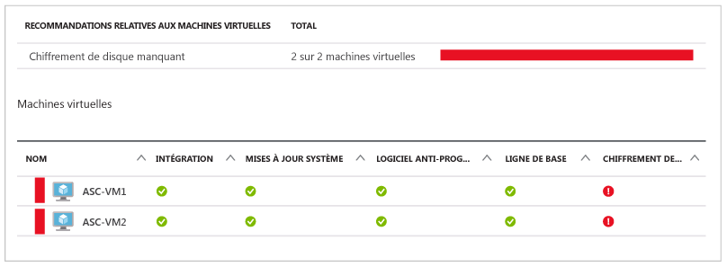
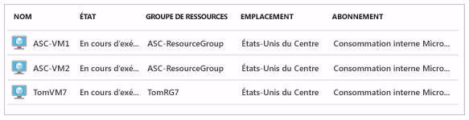
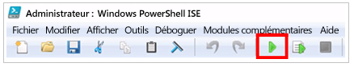
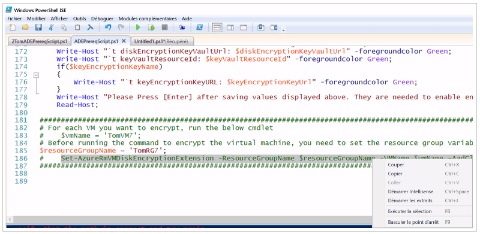
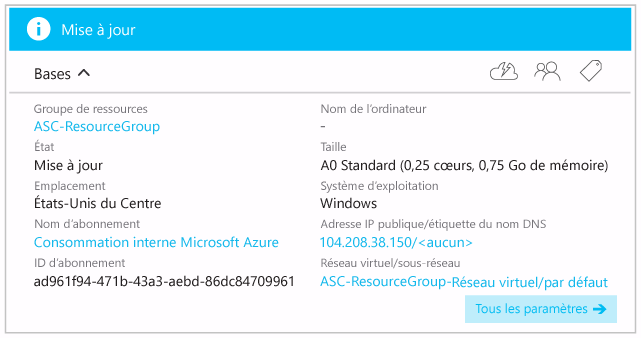
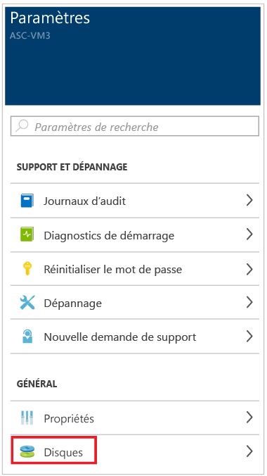
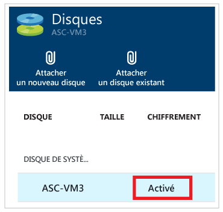

# Chiffrement d’une machine virtuelle Azure
Le Centre de sécurité Azure émet une alerte si certaines de vos machines virtuelles ne sont pas chiffrées. Ces alertes indiquant un niveau de gravité élevé, il est recommandé de chiffrer ces machines virtuelles.

> [!NOTE]
> Les informations contenues dans ce document concernent le chiffrement des machines virtuelles sans utiliser une clé de chiffrement à clé (requise pour la sauvegarde des machines virtuelles à l’aide d’Azure Backup). Consultez l’article [Azure Disk Encryption for Windows and Linux Azure Virtual Machines](https://docs.microsoft.com/en-us/azure/security/azure-security-disk-encryption) (Utilisation d’Azure Disk Encryption pour les machines virtuelles Azure exécutées sous Windows et Linux) pour plus d’informations sur l’utilisation d’une clé de chiffrement à clé pour prendre en charge Azure Backup pour les machines virtuelles Azure chiffrées.
>
>

Pour chiffrer les machines virtuelles Azure qui ont fait l’objet d’une alerte par le Centre de sécurité Azure, nous vous recommandons de procéder de la manière suivante :

* Installez et configurez Azure PowerShell. Vous pourrez ainsi exécuter les commandes PowerShell nécessaires afin d’obtenir la configuration requise pour le chiffrement des machines virtuelles Azure.
* Récupérez et exécutez le script Azure PowerShell de configuration d’Azure Disk Encryption.
* Chiffrez vos machines virtuelles.

Ce document permet aux utilisateurs peu familiarisés avec Azure PowerShell de chiffrer leurs machines virtuelles.
Pour suivre cette procédure, vous devez utiliser Windows 10 en tant qu’ordinateur client à partir duquel vous allez configurer Azure Disk Encryption.

Il existe de nombreuses méthodes permettant d’obtenir la configuration requise et de configurer le chiffrement des machines virtuelles Azure. Si vous êtes déjà familiarisé avec Azure PowerShell ou avec l’interface de ligne de commande Azure, vous pouvez opter pour d’autres approches.

> [!NOTE]
> Pour plus d’informations sur les autres méthodes de configuration du chiffrement pour les machines virtuelles Azure, consultez [Azure Disk Encryption for Windows and Linux Azure Virtual Machines](https://gallery.technet.microsoft.com/Azure-Disk-Encryption-for-a0018eb0)(Utilisation d’Azure Disk Encryption pour les machines virtuelles Azure exécutées sous Windows et Linux).
>
>

## Installation et configuration d'Azure PowerShell
Vous devez disposer d’Azure PowerShell version 1.2.1 ou ultérieure. L’article [Installation et configuration d’Azure PowerShell](/powershell/azureps-cmdlets-docs) décrit toutes les étapes à suivre pour configurer votre ordinateur avec Azure PowerShell. L’approche la plus simple consiste à installer Web PI, selon la procédure décrite dans la suite de cet article. Même si vous disposez déjà d’Azure PowerShell, nous vous recommandons de le réinstaller avec la méthode Web PI afin d’avoir la garantie d’utiliser la version la plus récente d’Azure PowerShell.

## Récupérer et exécuter le script de configuration d’Azure Disk Encryption
Le script de configuration d’Azure Disk Encryption permet de configurer toutes les conditions préalables requises pour le chiffrement de vos machines virtuelles Azure.

1. Accédez à la page GitHub contenant le [script de configuration d’Azure Disk Encryption](https://github.com/Azure/azure-powershell/blob/dev/src/ResourceManager/Compute/Commands.Compute/Extension/AzureDiskEncryption/Scripts/AzureDiskEncryptionPreRequisiteSetup.ps1).
2. Sur la page GibHub, cliquez sur le bouton **Raw** .
3. Utilisez les touches **CTRL-A** pour sélectionner l’intégralité du texte de la page, puis les touches **CTRL-C** pour copier le contenu dans le Presse-papiers.
4. Ouvrez le **Bloc-notes** pour y coller le texte que vous avez copié.
5. Sur votre lecteur C:, créez un dossier que vous appellerez **AzureADEScript**.
6. Enregistrez le fichier du Bloc-notes (cliquez sur **Fichier**, puis sur **Enregistrer sous**). Dans la zone de texte Nom de fichier, entrez **« ADEPrereqScript.ps1 »** et cliquez sur **Enregistrer**. Veillez à placer le nom entre guillemets ; dans le cas contraire, le fichier sera enregistré avec l’extension .txt.

Maintenant que le contenu du script est enregistré, ouvrez le script dans PowerShell ISE :

1. Dans le menu Démarrer, cliquez sur **Cortana**. Demandez à **Cortana** d’accéder à PowerShell en saisissant **PowerShell** dans la zone de texte de recherche Cortana.
2. Cliquez avec le bouton droit sur **Windows PowerShell ISE**, puis cliquez sur **Exécuter en tant qu’administrateur**.
3. Dans la fenêtre **Administrateur : Windows PowerShell ISE**, cliquez sur **Afficher** puis sur **Afficher le volet de script**.
4. Si le volet **Commandes** s’affiche à droite de la fenêtre, cliquez sur l’icône **« x »** en haut à droite du volet pour le fermer. Si le texte s’affiche en caractères trop petits, utilisez les touches **CTRL+** (signe « + »). Si le texte est trop gros, utilisez les touches **CTRL-** (signe « - »).
5. Cliquez sur **Fichier**, puis sur **Ouvrir**. Accédez au dossier **C:\AzureADEScript** et double-cliquez sur **ADEPrereqScript**.
6. Le contenu **ADEPrereqScript** doit maintenant apparaître dans PowerShell ISE. Un code couleur vous aide à distinguer plus facilement les différents composants, notamment les commandes, les paramètres et les variables.

Vous devriez obtenir un résultat semblable à ce qui suit :

Le volet supérieur correspond au « volet de script » et le volet inférieur à la « console ». Nous emploierons ces termes dans la suite de cet article.

## Exécuter la commande PowerShell de configuration d’Azure Disk Encryption
Après le démarrage du script de configuration d’Azure Disk Encryption, vous êtes invité à renseigner les informations suivantes :

* **Nom du groupe de ressources** nom du groupe de ressources que vous souhaitez placer dans le coffre de clés.  S’il n’existe aucun groupe de ressources associé à ce nom, un groupe de ressources sera créé en utilisant le nom que vous avez saisi. Si vous disposez déjà d’un groupe de ressources et que vous souhaitez l’utiliser dans cet abonnement, entrez simplement le nom de ce groupe de ressources.
* **Nom du coffre de clés** : nom du coffre de clés dans lequel les clés de chiffrement doivent être placées. S’il n’existe aucun coffre de clés associé à ce nom, un coffre de clés sera créé en utilisant le nom que vous avez saisi. Si vous disposez déjà d’un coffre de clés et que vous souhaitez l’utiliser, entrez simplement le nom de ce coffre de clés.
* **Emplacement** : emplacement du coffre de clés. Assurez-vous que le coffre de clés et les machines virtuelles à chiffrer se trouvent au même emplacement. Si vous ignorez l’emplacement du coffre de clés, lisez la suite de cet article pour vous aider à l’identifier.
* **Nom de l’application Azure Active Directory** : nom de l’application Azure Active Directory qui vous servira à écrire les clés secrètes dans le coffre de clés. S’il n’existe aucune application de ce nom, une nouvelle application sera créée en utilisant le nom que vous avez saisi. Si vous disposez déjà d’une application Azure Active Directory et que vous souhaitez l’utiliser, entrez simplement le nom de l’application Azure Active Directory.

> [!NOTE]
> Si vous souhaitez connaître l’intérêt qu’il y a à créer une application Azure Active Directory, consultez la rubrique *Inscription d’une application auprès d’Azure Active Directory* de l’article [Prise en main du coffre de clés Azure](../key-vault/key-vault-get-started.md).
>
>

Pour chiffrer une machine virtuelle Azure, procédez comme suit :

1. Si vous avez fermé PowerShell ISE, ouvrez une instance élevée de PowerShell ISE. Si vous n’avez pas encore ouvert PowerShell ISE, suivez les instructions indiquées au début de cet article. Si vous avez fermé le script, ouvrez le fichier **ADEPrereqScript.ps1** sous le menu **Fichier**, puis cliquez sur **Ouvrir** et sélectionnez le script à partir du dossier **c:\AzureADEScript**. Si vous avez suivi toutes les instructions fournies depuis le début de cet article, vous pouvez tout simplement passer à l’étape suivante.
2. Dans la console de PowerShell ISE (volet inférieur de PowerShell ISE), saisissez **cd c:\AzureADEScript** et appuyez sur **ENTRÉE** pour basculer le script sur l’ordinateur local.
3. Configurez la stratégie d’exécution sur votre ordinateur afin de pouvoir exécuter le script. Dans la console, entrez **Set-ExecutionPolicy Unrestricted** , puis appuyez sur ENTRÉE. Si une boîte de dialogue vous informe des effets d’une modification de la stratégie d’exécution, cliquez sur **Oui pour tout** ou **Oui** (si l’option **Oui pour tout** est disponible, sélectionnez-la ; sinon****, cliquez sur **Oui**).
4. Connectez-vous à votre compte Azure. Dans la console, entrez **Login-AzureRmAccount** et appuyez sur **ENTRÉE**. Dans la nouvelle boîte de dialogue, entrez vos informations d’identification (assurez-vous que vous disposez des droits pour modifier les machines virtuelles ; dans le cas contraire, vous ne serez pas en mesure de les chiffrer. En cas de doute, renseignez-vous auprès du propriétaire ou de l’administrateur de votre abonnement). Vous devriez voir des informations concernant vos paramètres suivants : **Environment**, **Account**, **TenantId**, **SubscriptionId** et **CurrentStorageAccount**. Copiez le contenu du champ **SubscriptionId** dans le Bloc-notes. Vous en aurez besoin à l’étape 6.
5. Identifiez l’abonnement auquel est associée votre machine virtuelle et repérez son emplacement. Accédez à [https://portal.azure.com](ttps://portal.azure.com) et connectez-vous.  À gauche de la page, cliquez sur **Machines virtuelles**. Vous obtenez une liste de vos machines virtuelles ainsi que des abonnements auxquels elles sont rattachées.

   
6. Revenez maintenant à PowerShell ISE. Définissez le contexte d’abonnement dans lequel le script sera exécuté. Dans la console, tapez **Select-AzureRmSubscription –SubscriptionId <ID_de_votre_abonement>** (remplacez **<ID_de_votre_abonement>** par votre ID d’abonnement) et appuyez sur **ENTRÉE**. Vous verrez des informations concernant votre environnement et les paramètres **Account**, **TenantId**, **SubscriptionId** et **CurrentStorageAccount**.
7. Vous êtes maintenant prêt à exécuter le script. Cliquez sur le bouton **Exécuter le script** ou appuyez sur la touche **F5** du clavier.

   
8. Le script vous invite à renseigner le paramètre **resourceGroupName** : entrez le nom du *Groupe de ressources* que vous souhaitez utiliser, puis appuyez sur **ENTRÉE**. Si vous ne disposez d’aucun groupe de ressources, saisissez un nouveau nom. Si vous disposez déjà d’un *Groupe de ressources* que vous souhaitez utiliser (par exemple, celui dans lequel se trouve votre machine virtuelle), entrez le nom du Groupe de ressources existant.
9. Le script vous invite à renseigner le paramètre **keyVaultName** : entrez le nom du *Coffre de clés* que vous souhaitez utiliser, puis appuyez sur ENTRÉE. Si vous ne disposez d’aucun groupe de ressources, saisissez un nouveau nom. Si vous disposez déjà d’un coffre de clés et que vous souhaitez l’utiliser, entrez simplement le nom de ce *Coffre de clés*.
10. Le script vous invite à renseigner le paramètre **location** : entrez le nom de l’emplacement dans lequel se trouve la machine virtuelle que vous souhaitez chiffrer, puis appuyez sur **ENTRÉE**. Si vous ne connaissez pas l’emplacement, revenez à l’étape 5.
11. Le script vous invite à renseigner le paramètre **aadAppName** : entrez le nom de l’application *Azure Active Directory* que vous souhaitez utiliser, puis appuyez sur **ENTRÉE**. Si vous ne disposez d’aucun groupe de ressources, saisissez un nouveau nom. Si vous disposez déjà d’une *application Azure Active Directory* et que vous souhaitez l’utiliser, entrez simplement le nom de votre *application Azure Active Directory*.
12. Une boîte de dialogue de connexion s’affiche. Indiquez vos informations d’identification (vous devez effectivement vous reconnecter).
13. Le script s’exécute. À la fin de son exécution, il vous demande de copier les valeurs des paramètres **aadClientID**, **aadClientSecret**, **diskEncryptionKeyVaultUrl** et **keyVaultResourceId**. Copiez chacune de ces valeurs dans le Presse-papiers, puis collez-les dans le Bloc-notes.
14. De nouveau dans PowerShell ISE, placez le curseur à la fin de la dernière ligne, puis appuyez sur **ENTRÉE**.

Le script doit générer un résultat semblable à ce qui suit :

## Chiffrer la machine virtuelle Azure
Vous êtes maintenant prêt à chiffrer votre machine virtuelle. Si votre machine virtuelle se trouve dans le même groupe de ressources que le coffre de clés, vous pouvez passer directement aux étapes du chiffrement. Dans le cas contraire, vous devez saisir la commande suivante dans la console de PowerShell ISE :

**$resourceGroupName = <’Virtual_Machine_RG’>**

Remplacez**< Virtual_Machine_RG >** par le nom du groupe de ressources dans lequel se trouvent vos machines virtuelles, en conservant les guillemets simples. Appuyez sur **Entrée**.
Pour vérifier que le nom du groupe de ressources que vous avez saisi est correct, entrez la commande suivante dans la console PowerShell ISE :

**$resourceGroupName**

Appuyez sur **ENTRÉE**. Le nom du groupe de ressources dans lequel se trouvent vos machines virtuelles doit normalement s’afficher. Par exemple :

### Étapes du chiffrement
Vous devez tout d’abord indiquer à PowerShell le nom de la machine virtuelle que vous souhaitez chiffrer. Dans la console, entrez la commande suivante :

**$vmName = <’your_vm_name’>**

Remplacez **<’your_vm_name’>** par le nom de votre machine virtuelle (en veillant à bien conserver les guillemets simples), puis appuyez sur **ENTRÉE**.

Pour vérifier que le nom de la machine virtuelle saisi est correct, entrez la commande suivante :

**$vmName**

Appuyez sur **ENTRÉE**. Le nom de la machine virtuelle que vous souhaitez chiffrer doit normalement s’afficher. Par exemple :

Il existe deux façons d’exécuter la commande de chiffrement d’une machine virtuelle. La première méthode consiste à saisir la commande suivante dans la console PowerShell ISE :

~~~
Set-AzureRmVMDiskEncryptionExtension -ResourceGroupName $resourceGroupName -VMName $vmName -AadClientID $aadClientID -AadClientSecret $aadClientSecret -DiskEncryptionKeyVaultUrl $diskEncryptionKeyVaultUrl -DiskEncryptionKeyVaultId $keyVaultResourceId
~~~

Appuyez ensuite sur **ENTRÉE**.

La deuxième méthode consiste à cliquer dans le volet de script (le volet supérieur de PowerShell ISE) et à faire défiler le contenu jusqu’en bas du script. Mettez en surbrillance la commande ci-dessus et cliquez dessus avec le bouton droit de la souris, puis cliquez sur **Exécuter la sélection** ou appuyez sur la touche **F8** du clavier.

Quelle que soit la méthode que vous utilisez, une boîte de dialogue vous informe que l’opération prendra 10 à 15 minutes. Cliquez sur **Oui**.

Au cours du processus de chiffrement, vous pouvez revenir au portail Azure et consulter l’état de la machine virtuelle. À gauche de la page, cliquez sur **Machines virtuelles** puis, dans le panneau **Machines virtuelles**, cliquez sur le nom de la machine virtuelle que vous êtes en train de chiffrer. Dans le panneau qui s’affiche, vous remarquerez que l’**État** est défini sur **Mise à jour**. ce qui prouve que le chiffrement est en cours.

Revenez maintenant à PowerShell ISE. Une fois le script exécuté, vous obtenez le message suivant.

Pour vérifier que la machine virtuelle est bien chiffrée, revenez au portail Azure et cliquez sur **Machines virtuelles** à gauche de la page. Cliquez sur le nom de la machine virtuelle que vous avez chiffrée. Dans le panneau **Paramètres**, cliquez sur **Disques**.

Dans le panneau **Disques**, l’option **Chiffrement** est **activée**.

## Étapes suivantes
Dans ce document, vous avez appris à chiffrer une machine virtuelle Azure. Pour plus d’informations sur le Centre de sécurité Azure, consultez les rubriques suivantes :

* [Surveillance de l’intégrité de la sécurité dans le Centre de sécurité Azure](security-center-monitoring.md) : découvrez comment surveiller l’intégrité de vos ressources Azure
* [Gestion et résolution des alertes de sécurité dans le Centre de sécurité Azure](security-center-managing-and-responding-alerts.md) – Découvrez comment gérer et résoudre les alertes de sécurité
* [FAQ du Centre de sécurité Azure](security-center-faq.md) – Forum Aux Questions concernant l’utilisation de ce service
* [Blog sur la sécurité Azure](http://blogs.msdn.com/b/azuresecurity/) : recherchez des billets de blog sur la sécurité et la conformité Azure

