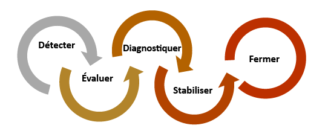
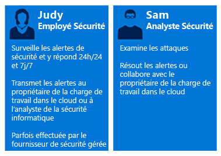
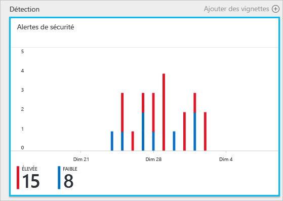
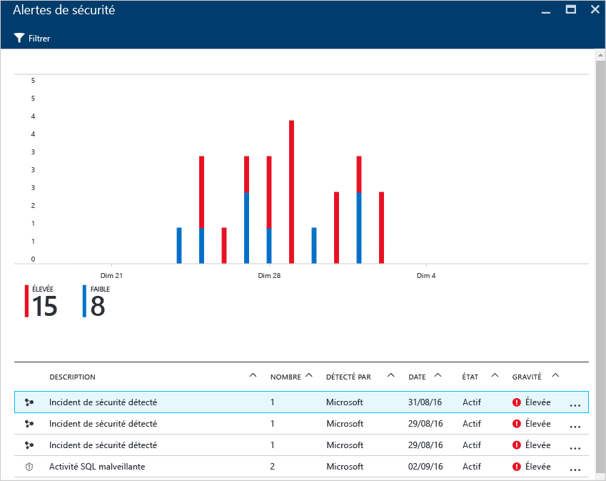
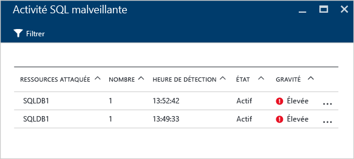
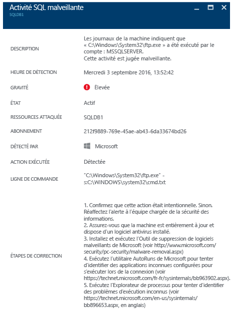

# Utilisation d’Azure Security Center pour la réponse aux incidents
De nombreuses organisations apprennent à répondre aux incidents uniquement après avoir subi une attaque. Pour réduire les coûts et les dommages, il est important de disposer d’un plan de réponse aux incidents avant qu’une attaque ne survienne. Vous pouvez utiliser Azure Security Center à différentes étapes de la réponse à un incident.

## Planification de la réponse aux incidents
L’efficacité d’un plan dépend de trois caractéristiques principales : la capacité à se protéger contre les menaces, à détecter ces dernières et à y répondre. La protection vise à empêcher les incidents, la détection à identifier les menaces au plus tôt, et la réponse à expulser le cybercriminel et à restaurer les systèmes pour atténuer l’impact d’une intrusion.

Cet article utilise les étapes de réponse aux incidents de sécurité de l’article [Microsoft Azure Security Response in the Cloud](https://gallery.technet.microsoft.com/Azure-Security-Response-in-dd18c678) (Réponse aux incidents de sécurité mise en œuvre par Microsoft Azure dans le cloud), illustrées dans le schéma suivant :

Vous pouvez utiliser Azure Security Center pendant les phases de détection, d’évaluation et de diagnostic. Voici des exemples de l’utilité d’Azure Security Center au cours des trois étapes initiales de réponse aux incidents :

* **Détecter** : examiner le premier signe de l’examen d’un événement.
  * Exemple : examinez la vérification initiale du déclenchement d’une alerte de sécurité à priorité élevée dans le tableau de bord d’Azure Security Center.
* **Évaluer**: procéder à l’évaluation initiale pour obtenir plus d’informations sur l’activité suspecte.
  * Exemple : obtenir des informations supplémentaires sur l’alerte de sécurité.
* **Diagnostiquer** : mener une investigation technique et identifier les stratégies de confinement, d’atténuation des risques et de contournement.
  * Exemple : suivre les étapes techniques de résolution décrites par Security Center dans cette alerte de sécurité spécifique.

Le scénario qui suit vous montre comment tirer parti d’Azure Security Center pendant les étapes de détection, d’évaluation et de diagnostic/réponse d’un incident de sécurité. Dans Azure Security Center, un [incident de sécurité](https://blogs.technet.microsoft.com/office365security/addressing-your-cxos-top-five-cloud-security-concerns/) est un regroupement de toutes les alertes d’une ressource correspondant à des modèles de [chaîne de destruction](security-center-incident.md). Les incidents apparaissent dans la mosaïque et le panneau [Alertes de sécurité](security-center-managing-and-responding-alerts.md). Un incident affiche la liste des alertes associées, qui vous permet d’en savoir plus sur chaque occurrence. Azure Security Center offre également des alertes de sécurité autonomes pouvant être utilisées pour détecter une activité suspecte.

## Scénario
Contoso a récemment migré une partie de ses ressources locales dans Azure, notamment certaines bases de données SQL et charges de travail métier reposant sur des machines virtuelles. L’équipe principale de réponse aux incidents de sécurité informatique (CSIRT) de Contoso rencontre aujourd’hui des difficultés pour étudier les problèmes de sécurité car les renseignements sur la sécurité ne sont pas intégrés à leurs outils actuels de réponse aux incidents. Cette absence d’intégration pose un problème durant l’étape de détection (trop de faux positifs) et durant les étapes d’évaluation et de diagnostic. Dans le cadre de la migration, l’équipe a décidé d’opter pour Security Center pour l’aider à résoudre ce problème.

La première phase de cette migration s’est terminée après l’intégration de toutes les ressources et l’application de toutes les recommandations de sécurité d’Azure Security Center. L’équipe CSIRT de Contoso est le point central pour la gestion des incidents de sécurité informatique. Elle se compose d’un groupe de personnes chargées de traiter les incidents de sécurité. Les membres de l’équipe ont des responsabilités clairement définies pour s’assurer que tous les domaines d’action sont couverts.

Pour les besoins de ce scénario, nous allons nous concentrer sur les rôles des personnes suivantes, qui font partie de l’équipe CSIRT de Contoso :

Judy travaille aux opérations de sécurité. Ses responsabilités incluent :

* La surveillance et l’élimination en continu des menaces de sécurité.
* La remontée des problèmes au propriétaire des charges de travail de cloud ou à l’analyste de la sécurité en fonction des besoins.

Sam est analyste de la sécurité et ses responsabilités incluent :

* L’examen des attaques.
* La correction des alertes.
* La collaboration avec les propriétaires des charges de travail pour déterminer et appliquer des mesures de correction.

Comme vous pouvez le voir, Judy et Sam ont des responsabilités différentes, et ils doivent travailler ensemble en se partageant les informations d’Azure Security Center.

## Solution recommandée
Comme Judy et Sam ont des rôles différents, ils utilisent différentes sections d’Azure Security Center afin d’obtenir des informations pertinentes pour leurs activités quotidiennes. Judy utilise les **alertes de sécurité** dans le cadre de sa surveillance quotidienne.

Judy utilise les alertes de sécurité pendant les étapes de détection et d’évaluation. Une fois l’évaluation initiale terminée, Judy peut faire remonter le problème à Sam si un examen complémentaire est requis. À ce stade, Sam doit utiliser les informations fournies par Azure Security Center, parfois conjointement avec d’autres sources de données, pour passer à l’étape de diagnostic.

## Mise en œuvre de cette solution
Pour découvrir comment utiliser Azure Security Center dans un scénario de réponse aux incidents, nous allons suivre Judy pendant les étapes de détection et d’évaluation, puis voir ce que Sam fait pour diagnostiquer le problème.

### Étapes de détection et d’évaluation de la réponse aux incidents
Judy s’est connectée au portail Azure et se trouve dans la console Azure Security Center. Dans le cadre de ses activités de surveillance quotidiennes, elle a commencé à examiner les alertes de sécurité à priorité élevée en suivant cette procédure :

1. Cliquer sur la mosaïque **Alertes de sécurité** et accédez au panneau **Alertes de sécurité**.
    
   
   > [!NOTE]
   > Pour les besoins de ce scénario, Judy va procéder à une évaluation de l’alerte d’activité SQL malveillante signalée dans la figure précédente.
   > 
   > 
2. Cliquer sur l’alerte **Malicious SQL activity** (Activité SQL malveillante) et examiner les ressources attaquées dans le panneau **Malicious SQL Activity** (Activité SQL malveillante) :  
   
    Dans ce panneau, Judy peut prendre connaissance des ressources attaquées, du nombre de fois que cette attaque s’est produite et de l’heure à laquelle elle a été détectée.
3. Cliquer sur la **ressource attaquée** pour obtenir des informations supplémentaires sur cette attaque.

Après avoir lu la description, Judy est convaincue qu’il ne s’agit pas d’un faux positif et qu’elle doit faire remonter ce dossier à Sam.

### Étape de diagnostic de la réponse aux incidents
Sam reçoit le dossier de Judy et commence à examiner les étapes de correction suggérées par Azure Security Center.

### Ressources supplémentaires
L’équipe de réponse aux incidents peut également tirer parti de la fonctionnalité [Security Center Power BI](security-center-powerbi.md) pour afficher différents types de rapports. Ces rapports peuvent les aider lors d’un examen plus poussé pour visualiser, analyser et filtrer des recommandations et des alertes de sécurité. Les entreprises qui utilisent leur solution SIEM (Security Information and Event Management) pendant le processus d’examen peuvent également [intégrer Azure Security Center à celle-ci](security-center-integrating-alerts-with-log-integration.md). Vous pouvez également intégrer les journaux d’audit et les événements de sécurité des machines virtuelles Azure à l’aide de [l’outil d’intégration des journaux Azure](https://blogs.msdn.microsoft.com/azuresecurity/2016/07/21/microsoft-azure-log-integration-preview/). Pour examiner ces attaques, vous pouvez utiliser ces informations conjointement avec les informations fournies par Azure Security Center.

## Conclusion
La mise en place d’une équipe avant la survenue d’un incident est très importante pour votre organisation et aura un impact positif sur la gestion des incidents. Si elle dispose des bons outils pour surveiller les ressources, cette équipe pourra plus facilement prendre des mesures précises pour résoudre un incident de sécurité. Les [fonctionnalités de détection](security-center-detection-capabilities.md) d’Azure Security Center aident le département informatique à répondre aux incidents de sécurité et à corriger les problèmes de sécurité rapidement.

<!--HONumber=Dec16_HO2-->

