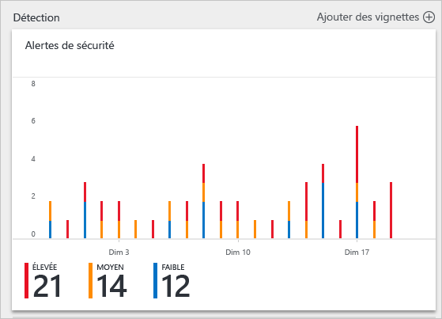
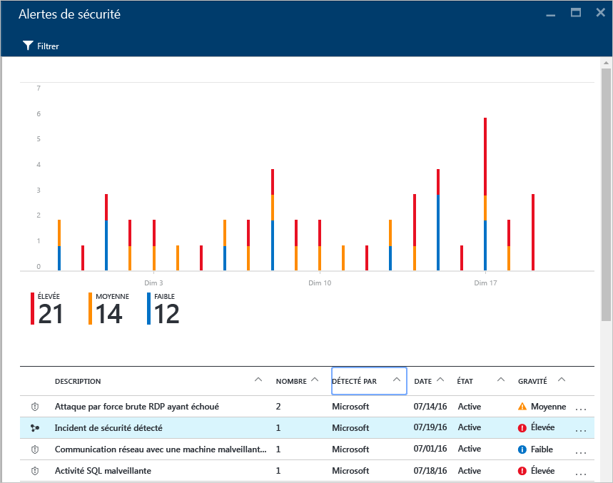
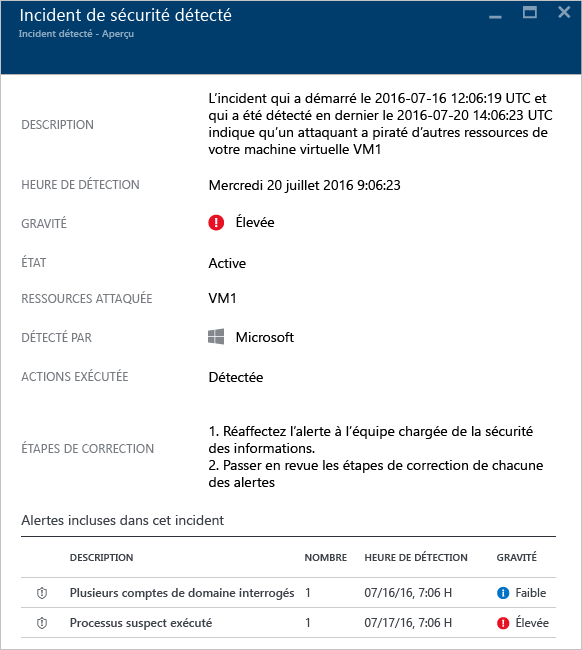
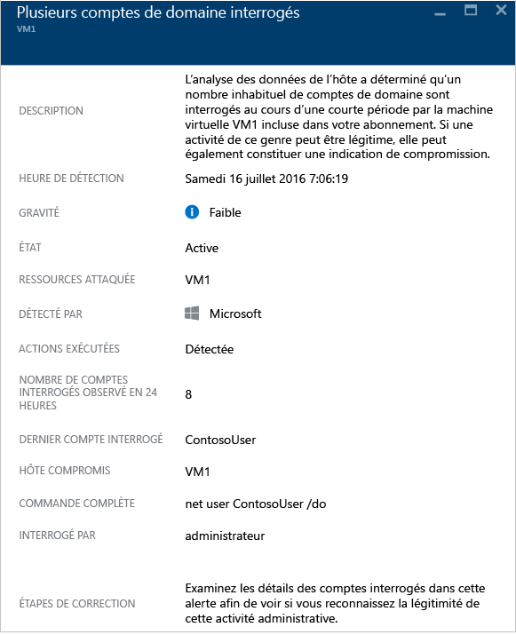

<properties
   pageTitle="Gestion des incidents de sécurité dans Azure Security Center | Microsoft Azure"
   description="Ce document est conçu pour vous aider à utiliser les fonctionnalités de Azure Security Center pour gérer les incidents de sécurité."
   services="security-center"
   documentationCenter="na"
   authors="YuriDio"
   manager="swadhwa"
   editor=""/>

<tags
   ms.service="security-center"
   ms.topic="hero-article"
   ms.devlang="na"
   ms.tgt_pltfrm="na"
   ms.workload="na"
   ms.date="07/20/2016"
   ms.author="yurid"/>

# Gestion des incidents de sécurité dans Azure Security Center 
Procéder au triage et à l’examen des alertes de sécurité peut prendre beaucoup de temps, même pour le plus compétent des analystes de sécurité, et bien souvent il est difficile de savoir par où commencer. En utilisant les [fonctions d’analyse](security-center-detection-capabilities.md) pour connecter les informations entre différentes [alertes de sécurité](security-center-managing-and-responding-alerts.md), le Centre de sécurité peut vous fournir une vue unique d’une campagne d’attaque et de l’ensemble des alertes associées. Vous pouvez donc rapidement savoir quelles actions l’attaquant a effectuées et quelles ressources ont été affectées.

Ce document explique comment utiliser la fonction d’alerte de sécurité dans le Centre de sécurité pour vous aider à gérer les incidents de sécurité.

## Qu’est-ce qu’un incident de sécurité ?

Dans le Centre de sécurité, un incident de sécurité est un regroupement de toutes les alertes d’une ressource correspondant à des modèles de [chaîne de destruction](https://blogs.technet.microsoft.com/office365security/addressing-your-cxos-top-five-cloud-security-concerns/). Les incidents apparaissent dans la vignette et le panneau [Alertes de sécurité](security-center-managing-and-responding-alerts.md). Un incident affiche la liste des alertes associées, qui vous permet d’en savoir plus sur chaque occurrence.

## Gestion des incidents de sécurité

Vous pouvez connaître vos incidents de sécurité en cours en consultant la mosaïque Alertes de sécurité. Accédez au portail Azure et suivez les étapes ci-dessous pour en savoir plus sur chaque incident de sécurité :

1. La mosaïque **Alertes de sécurité** s’affiche dans le tableau de bord Centre de sécurité.

    

2.  Cliquez sur cette vignette pour la développer si un incident de sécurité a été détecté. Il apparaîtra sous le graphique des alertes de sécurité comme indiqué dans cette image.

    

3.	Notez que la description de l’incident de sécurité présente une autre icône que celle utilisée pour les autres alertes. Cliquez dessus pour afficher plus de détails sur cet incident.

	

4. 	Sur le panneau **Incident de sécurité détecté**, vous trouverez davantage d’informations sur cet incident de sécurité, ce qui inclut la description complète de l’incident, son niveau de gravité (qui, dans ce cas, est élevé), l’état actuel de l’incident (dans ce cas, il est toujours *actif*), la ressource attaquée (dans ce cas, *VM1*), les étapes de résolution et, enfin, les alertes qui ont été affichées au cours de l’incident. Si vous souhaitez obtenir plus d’informations sur chaque alerte, il vous suffit de cliquer dessus pour ouvrir un autre panneau, comme indiqué ci-dessous.

	

Les informations sur ce panneau varient en fonction de l’alerte. Consultez [Gestion et résolution des alertes de sécurité dans Azure Security Center](security-center-managing-and-responding-alerts.md) pour en savoir plus sur la gestion de ces alertes. Voici quelques considérations importantes concernant cette fonctionnalité :

- Un nouveau filtre vous permet de personnaliser votre affichage pour afficher uniquement les incidents, uniquement les alertes ou bien les deux.
- Une même alerte peut s’afficher dans le cadre d’un incident (le cas échéant), mais également apparaître sous la forme d’une alerte autonome.
- Ignorer un incident n’a pas pour effet d’ignorer les alertes associées.

## Voir aussi

Dans ce document, vous avez vu comment utiliser la fonctionnalité de gestion des incidents de sécurité du Centre de sécurité. Pour plus d’informations sur le Centre de sécurité, consultez les rubriques suivantes :

- [Guide des opérations et de planification du Centre de sécurité Azure](security-center-planning-and-operations-guide.md)
- [Gestion et résolution des alertes de sécurité dans le Centre de sécurité Azure](security-center-managing-and-responding-alerts.md)
- [Surveillance de l’intégrité de la sécurité dans Azure Security Center](security-center-monitoring.md) : découvrez comment surveiller l’intégrité de vos ressources Azure.
- [Surveillance des solutions de partenaires avec Azure Security Center](security-center-partner-solutions.md) : découvrez comment surveiller l’état d’intégrité de vos solutions de partenaires.
- [FAQ de Azure Security Center](security-center-faq.md) : forum aux questions concernant l’utilisation de ce service.
- [Blog sur la sécurité Azure](http://blogs.msdn.com/b/azuresecurity/) : trouvez des billets de blog sur la sécurité et la conformité Azure.

<!---HONumber=AcomDC_0720_2016-->