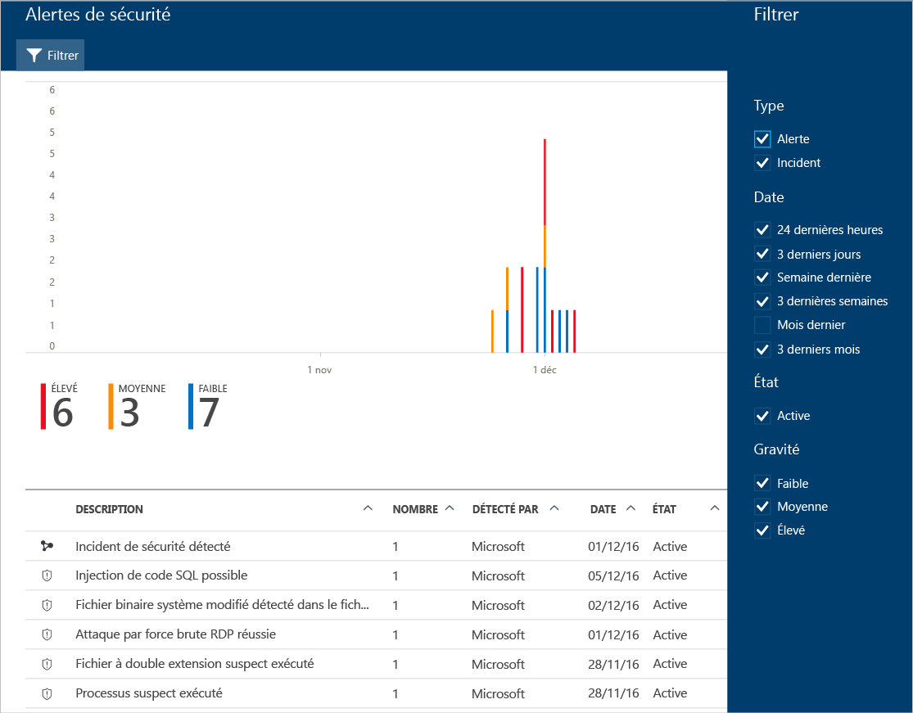

# Gestion et résolution des alertes de sécurité dans le Centre de sécurité Azure
Ce document est conçu pour vous aider à utiliser Azure Security Center afin de gérer et résoudre les alertes de sécurité.

> [!NOTE]
> Pour activer la détection avancée, effectuez une mise à niveau vers Azure Security Center Standard. Une version d’évaluation gratuite de 60 jours est disponible. Pour mettre à niveau, sous [Stratégie de sécurité](security-center-policies.md), sélectionnez Niveau tarifaire. Consultez [Tarification d’Azure Security Center](security-center-pricing.md) pour en savoir plus.
>
>

## Que sont les alertes de sécurité ?
Le Centre de sécurité collecte, analyse et intègre automatiquement les données de journaux provenant de vos ressources Azure, du réseau et des solutions partenaires connectées, telles que les solutions de protection des points de terminaison et des pare-feu, pour détecter les menaces réelles et réduire le nombre de faux positifs. Une liste hiérarchisée d’alertes de sécurité est affichée dans le Centre de sécurité, ainsi que les informations nécessaires pour trouver rapidement la cause d’une attaque et des recommandations sur la façon d’y remédier.

> [!NOTE]
> Pour plus d’informations sur le fonctionnement des fonctionnalités de détection de Security Center, consultez [Fonctionnalités de détection d’Azure Security Center](security-center-detection-capabilities.md).
>
>

## Gestion des alertes de sécurité
Vous pouvez connaître vos alertes actuelles en consultant la vignette **Alertes de sécurité** . Suivez les étapes ci-après pour obtenir plus d’informations sur chaque alerte :

1. La mosaïque **Alertes de sécurité** s’affiche dans le tableau de bord de Security Center.

    

2. Cliquez sur la vignette pour ouvrir le panneau **Alertes de sécurité** et afficher des détails supplémentaires sur les alertes.

   

Les détails de chaque alerte sont affichés au bas de la page. Pour les organiser à votre convenance, cliquez sur la colonne que vous voulez trier. La définition de chaque colonne est indiquée ci-dessous :

* **Description** : brève explication de l’alerte.
* **Nombre**: liste de toutes les alertes d’un type spécifique qui ont été détectées un jour précis.
* **Détectée par**: service à l’origine du déclenchement de l’alerte.
* **Date**: date à laquelle l’événement s’est produit.
* **État**: état actuel de l’alerte. Il existe deux types d’état :
  * **Active**: l’alerte de sécurité a été détectée.
* **Gravité**: niveau de gravité (élevé, moyen ou bas).

### Filtrage des alertes
Vous pouvez filtrer les alertes en fonction de la date, de l’état et du niveau de gravité. Le filtrage des alertes peut être utile quand vous avez besoin de restreindre le nombre d’alertes de sécurité qui s’affichent. Supposons que vous souhaitiez vérifier les alertes de sécurité qui se sont produites au cours des dernières 24 heures, car vous recherchez une violation de sécurité potentielle du système.

1. Cliquez sur **Filtrer** dans le panneau **Alertes de sécurité**. Dans le panneau **Filtrer** qui s’ouvre, vous pouvez sélectionner la date, l’état et les niveaux de gravité que vous souhaitez visualiser.

    

### Répondre à des alertes de sécurité
Sélectionnez une alerte de sécurité pour en savoir plus sur les événements qui l’ont déclenchée et, le cas échéant, les étapes à suivre pour y remédier. Les alertes de sécurité sont regroupées par type et date d’apparition. Le fait de cliquer sur une alerte de sécurité ouvre une page contenant une liste des alertes groupées.

Dans ce cas, les alertes qui ont été déclenchées concernent une activité suspecte utilisant le protocole RDP. Les première, deuxième, troisième, quatrième et cinquième colonnes affichent respectivement les ressources qui ont été attaquées, le nombre de fois où la ressource a été attaquée, l’heure de l’attaque, l’état de l’alerte et le niveau de gravité de l’attaque. Après avoir examiné ces informations, cliquez sur la ressource qui a été attaquée.

Vous trouverez plus d’informations sur l’événement dans le champ **Description**. Ces informations permettent d’en savoir plus sur ce qui a déclenché l’alerte de sécurité, sur la ressource cible, sur l’adresse IP source (le cas échéant) et sur la manière de remédier au problème.  Dans certains cas, l’adresse IP source est vide (non disponible), car certains journaux d’événements Windows de la sécurité n’incluent pas l’adresse IP.

La correction suggérée par Security Center dépend de l’alerte de sécurité. Dans certains cas, vous pouvez être amené à utiliser d’autres fonctionnalités Azure pour appliquer la correction recommandée. Par exemple, pour cette attaque, la correction consiste à mettre sur liste noire l’adresse IP à l’origine de l’attaque à l’aide d’une règle de [liste de contrôle d’accès (ACL) réseau](../virtual-network/virtual-networks-acl.md) ou de [groupe de sécurité réseau](../virtual-network/virtual-networks-nsg.md). Pour plus d’informations sur les différents types d’alertes, consultez l’article [Security Alerts by Type in Azure Security Center](security-center-alerts-type.md)(Alertes de sécurité par type dans Azure Security Center).

> [!NOTE]
> Security Center a sorti avec les versions préliminaires limitées un nouvel ensemble de moyens de détection qui exploitent les enregistrements d’audit, une infrastructure d’audit courante, pour détecter des comportements malveillants sur les machines Linux. [Envoyez-nous](mailto:ASC_linuxdetections@microsoft.com) un e-mail avec vos ID d’abonnement pour joindre la version préliminaire.

## Voir aussi
Dans ce document, vous avez appris à configurer des stratégies de sécurité dans le Centre de sécurité. Pour plus d’informations sur le Centre de sécurité, consultez les rubriques suivantes :

* [Gestion des incidents de sécurité dans Azure Security Center](security-center-incident.md)
* [Fonctionnalités de détection d’Azure Security Center](security-center-detection-capabilities.md)
* [Guide des opérations et de planification du Centre de sécurité Azure](security-center-planning-and-operations-guide.md)
* [FAQ d’Azure Security Center](security-center-faq.md) : découvrez les réponses aux questions les plus souvent posées à propos de l’utilisation de ce service.
* [Blog sur la sécurité Azure](http://blogs.msdn.com/b/azuresecurity/) : accédez à des billets de blog sur la sécurité et la conformité Azure.
