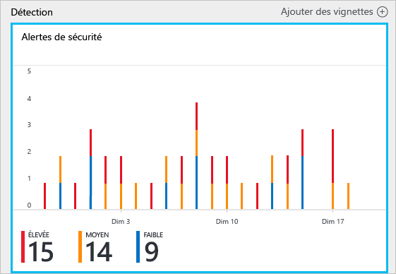
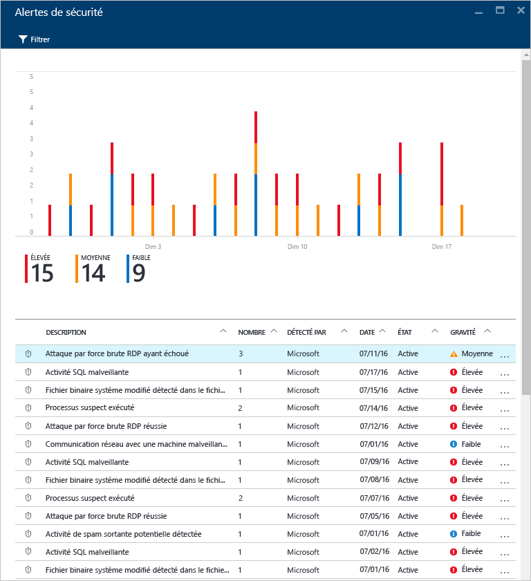
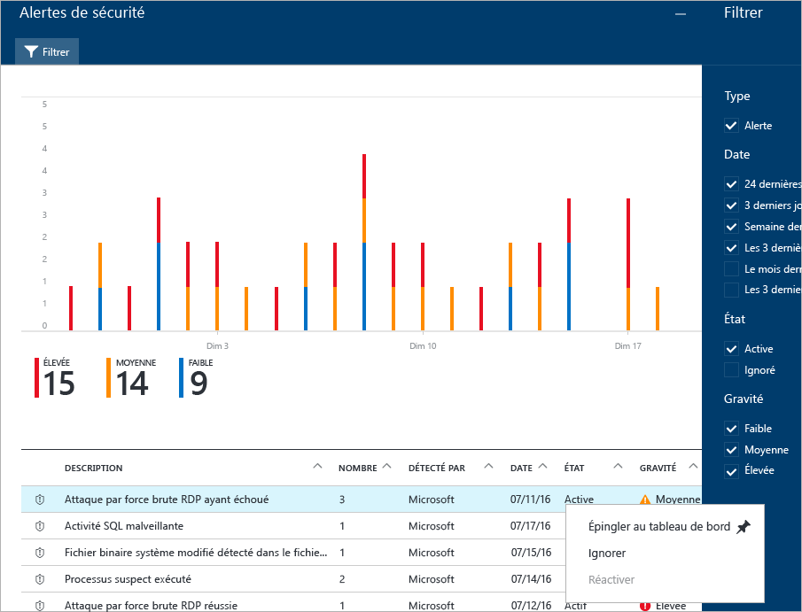
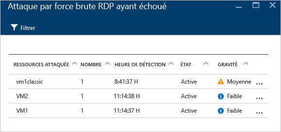
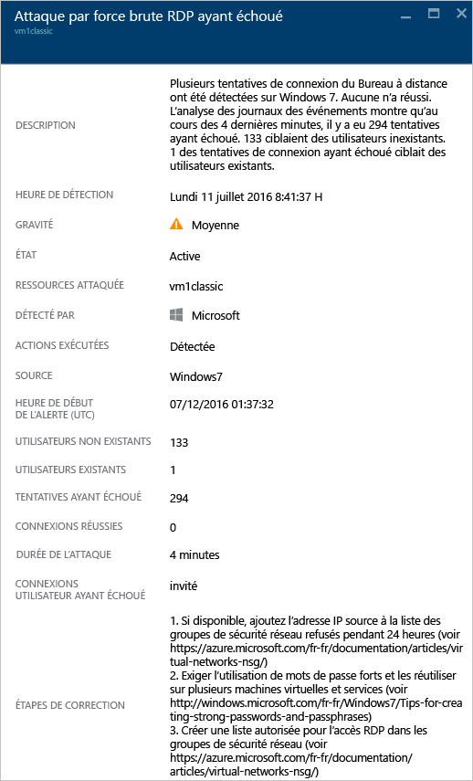
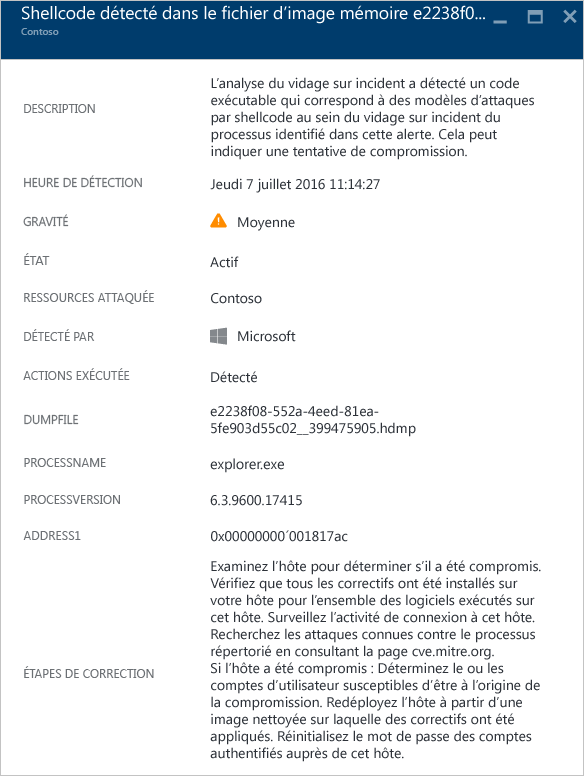
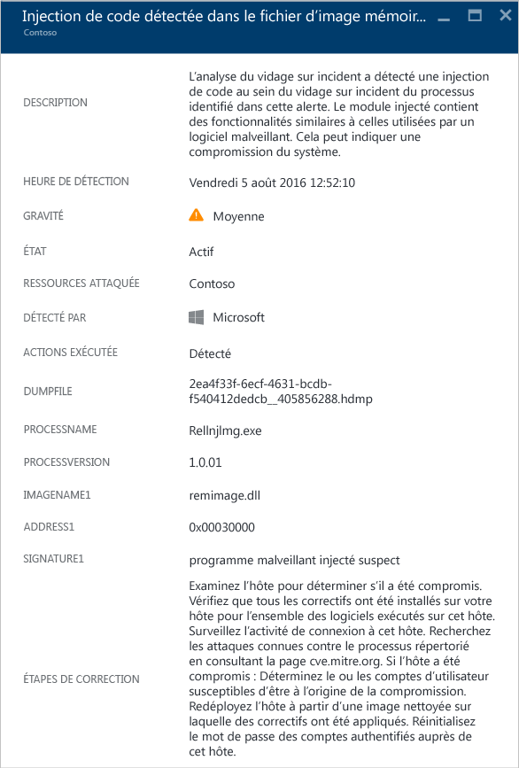
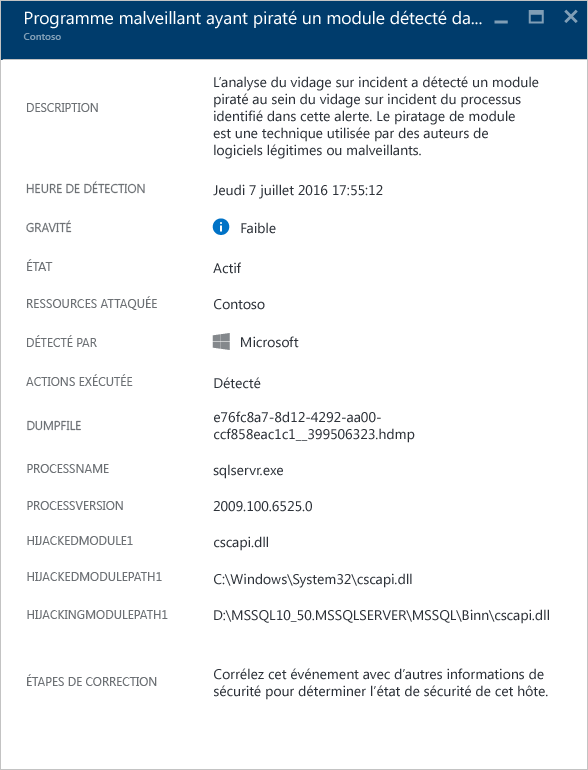
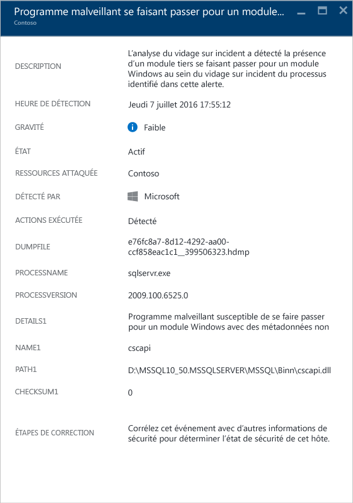
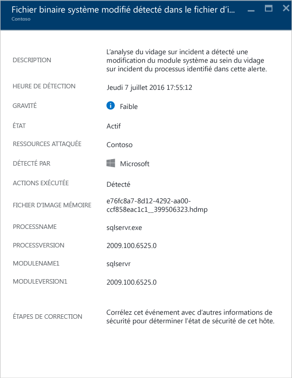

<properties
   pageTitle="Gestion et résolution des alertes de sécurité dans le Centre de sécurité Azure | Microsoft Azure"
   description="Ce document est conçu pour vous aider à utiliser les fonctionnalités du Centre de sécurité Azure pour gérer et résoudre les alertes de sécurité."
   services="security-center"
   documentationCenter="na"
   authors="YuriDio"
   manager="swadhwa"
   editor=""/>

<tags
   ms.service="security-center"
   ms.topic="hero-article"
   ms.devlang="na"
   ms.tgt_pltfrm="na"
   ms.workload="na"
   ms.date="08/26/2016"
   ms.author="yurid"/>

# Gestion et résolution des alertes de sécurité dans le Centre de sécurité Azure
Ce document est conçu pour vous aider à utiliser Azure Security Center afin de gérer et résoudre les alertes de sécurité.

> [AZURE.NOTE] Pour activer la détection avancée, effectuez une mise à niveau vers Azure Security Center Standard. Une version d’évaluation gratuite de 90 jours est disponible. Pour mettre à niveau, sous [Stratégie de sécurité](security-center-policies.md), sélectionnez Niveau tarifaire. Pour en savoir plus, consultez la [page de tarification](https://azure.microsoft.com/pricing/details/security-center/).

## Que sont les alertes de sécurité ?
Le Centre de sécurité collecte, analyse et intègre automatiquement les données de journaux provenant de vos ressources Azure, du réseau et des solutions partenaires connectées, telles que les solutions de protection des points de terminaison et des pare-feu, pour détecter les menaces réelles et réduire le nombre de faux positifs. Une liste hiérarchisée d’alertes de sécurité est affichée dans le Centre de sécurité, ainsi que les informations nécessaires pour trouver rapidement la cause d’une attaque et des recommandations sur la façon d’y remédier. Azure Security Center regroupe également les alertes correspondant à des modèles de chaînes de destruction en [incidents](security-center-incident.md).

> [AZURE.NOTE] Pour plus d’informations sur le fonctionnement des fonctionnalités de détection de Security Center, consultez [Fonctionnalités de détection d’Azure Security Center](security-center-detection-capabilities.md).

## Gestion des alertes de sécurité

Vous pouvez connaître vos alertes actuelles en consultant la vignette **Alertes de sécurité**. Accédez au Portail Azure et suivez les étapes ci-après pour obtenir plus d’informations sur chaque alerte :

1. La vignette **Alertes de sécurité** est affichée dans le tableau de bord Centre de sécurité.

    

2.  Cliquez sur la vignette pour ouvrir le panneau **Alertes de sécurité**, qui fournit des détails supplémentaires sur les alertes, comme indiqué ci-dessous.

    

Les détails de chaque alerte sont affichés au bas du panneau. Pour les organiser à votre convenance, cliquez sur la colonne que vous voulez trier. La définition de chaque colonne est indiquée ci-dessous :

- **Alerte** : brève explication de l’alerte.
- **Nombre** : liste de toutes les alertes d’un type spécifique qui ont été détectées un jour précis.
- **Détectée par** : service à l’origine du déclenchement de l’alerte.
- **Date** : date à laquelle l’événement s’est produit.
- **État** : état actuel de l’alerte. Il existe deux types d’état :
    - **Active** : l’alerte de sécurité a été détectée.
    - **Ignorée** : l’alerte de sécurité a été ignorée par l’utilisateur. Cet état est généralement attribué aux alertes qui ont été examinées, mais qui ont nécessité une correction ou qui ne correspondent pas à une attaque.

- **Gravité** : niveau de gravité (élevé, moyen ou bas).

### Filtrage des alertes

Vous pouvez filtrer les alertes en fonction de la date, de l’état et du niveau de gravité. Le filtrage des alertes peut être utile quand vous avez besoin de restreindre le nombre d’alertes de sécurité qui s’affichent. Supposons que vous souhaitiez vérifier les alertes de sécurité qui se sont produites au cours des dernières 24 heures, car vous recherchez une violation de sécurité potentielle du système.

1. Cliquez sur **Filtrer** dans le panneau **Alertes de sécurité**. Dans le panneau **Filtrer** qui s’ouvre, vous pouvez sélectionner la date, l’état et les niveaux de gravité que vous souhaitez visualiser.

	

2. 	Pour certaines alertes, vous pouvez déterminer qu’il s’agit d’un faux positif pour votre environnement, ou que le comportement signalé est normal pour une ressource donnée. Si vous déterminez qu’une alerte de sécurité n’est pas applicable, vous pouvez l’ignorer, puis la faire disparaître à l’aide du filtre. Il existe deux façons d’ignorer une alerte de sécurité. Cliquez avec le bouton droit sur une alerte, puis sélectionnez **Ignorer**, ou pointez sur un élément, cliquez sur les trois points qui apparaissent à droite, puis sélectionnez **Ignorer**. Vous pouvez afficher les alertes de sécurité ignorées en cliquant sur **Filtrer**, puis en sélectionnant **Ignorées**.

	

### Répondre à des alertes de sécurité

Sélectionnez une alerte de sécurité pour en savoir plus sur les événements qui l’ont déclenchée et, le cas échéant, les étapes à suivre pour y remédier. Les alertes de sécurité sont regroupées par type et date d’apparition. Le fait de cliquer sur une alerte de sécurité ouvre un volet contenant une liste des alertes groupées.

Dans ce cas, les alertes qui ont été déclenchées concernent une activité suspecte utilisant le protocole RDP. Les première, deuxième, troisième, quatrième et cinquième colonnes affichent respectivement les ressources qui ont été attaquées, le nombre de fois où la ressource a été attaquée, l’heure de l’attaque, l’état de l’alerte et le niveau de gravité de l’attaque. Après avoir examiné ces informations, cliquez sur la ressource qui a été attaquée. Un nouveau panneau s’affiche.

Vous trouverez plus d’informations sur l’événement dans le champ **Description** de ce panneau. Ces informations permettent d’en savoir plus sur ce qui a déclenché l’alerte de sécurité, sur la ressource cible, sur l’adresse IP source (le cas échéant) et sur la manière de remédier au problème. Dans certains cas, l’adresse IP source sera vide (non disponible), car certains journaux d’événements Windows de la sécurité n’incluent pas l’adresse IP.

> [AZURE.NOTE] La correction suggérée par le Centre de sécurité dépend de l’alerte de sécurité. Dans certains cas, vous pouvez être amené à utiliser d’autres fonctionnalités Azure pour appliquer la correction recommandée. Par exemple, pour cette attaque, la correction consiste à mettre sur liste noire l’adresse IP à l’origine de l’attaque à l’aide d’une règle de [liste de contrôle d’accès (ACL) réseau](../virtual-network/virtual-networks-acl.md) ou de [groupe de sécurité réseau](../virtual-network/virtual-networks-nsg.md).

## Alertes de sécurité par type
La procédure utilisée pour accéder à l’alerte d’activité RDP suspecte peut être utilisée pour accéder aux autres types d’alertes. Voici d’autres exemples d’alertes que vous pouvez rencontrer dans les alertes du Centre de sécurité :

### Injection de code SQL potentielle
Une attaque par injection de code SQL est une attaque dans laquelle un code malveillant est inséré dans les chaînes transmises ultérieurement à une instance de SQL Server pour analyse et exécution. Toute procédure qui construit des instructions SQL doit être analysée pour rechercher les vulnérabilités d’injection, car SQL Server exécutera toutes les requêtes syntaxiquement valides qu’il reçoit.

Cette alerte fournit des informations qui vous permettent d’identifier la ressource attaquée, l’heure de détection et l’état de l’attaque. Elle fournit également un lien vers des étapes d’investigation supplémentaires.

### Trafic sortant suspect détecté

Les périphériques réseau peuvent être détectés et profilés de la même façon que les autres types de systèmes. Les pirates commencent généralement par l’analyse des ports / le balayage des ports. L’exemple ci-dessous présente un trafic SSH suspect d’une machine virtuelle pouvant être en train de procéder à une attaque de force brute SSH ou à une attaque par balayage des ports contre une ressource externe.

Cette alerte fournit des informations qui vous permettent d’identifier la ressource qui a été utilisée pour lancer ce type d’attaque, l’ordinateur compromis, l’heure de détection, le protocole et le port qui a été utilisé. Ce panneau vous donne également une liste des étapes de résolution pouvant être utilisées pour résoudre ce problème.

### Communication réseau avec un ordinateur malveillant
 
En exploitant les flux des informations sur les menaces de Microsoft, Azure Security Center peut détecter les ordinateurs compromis qui communiquent avec des adresses IP malveillantes, généralement un centre de commande et de contrôle. Dans ce cas, Azure Security Center a détecté que la communication a été effectuée à l’aide du programme malveillant Pony Loader (également appelé [Fareit](https://www.microsoft.com/security/portal/threat/encyclopedia/entry.aspx?Name=PWS:Win32/Fareit.AF)).

Cette alerte fournit des informations qui vous permettent d’identifier la ressource qui a été utilisée pour lancer ce type d’attaque, la ressource attaquée, l’adresse IP de la victime, l’adresse IP de l’attaquant et l’heure de détection.

> [AZURE.NOTE] Les adresses IP dynamiques ont été supprimés de cette capture d’écran à des fins de confidentialité.

### Shellcode détecté 

Un shellcode est la charge utile exécutée après qu’un programme malveillant a exploité une vulnérabilité logicielle. Cette alerte indique que l’analyse de vidage sur incident a détecté du code exécutable présentant un comportement souvent associé à des charges utiles malveillantes. Bien que des logiciels non malveillants puissent présenter aussi ce comportement, il n’est pas typique des pratiques de développement logiciel normales.

Les champs suivants sont communs à toutes les alertes de vidage sur incident :

- DUMPFILE : nom du fichier de vidage sur incident.
- PROCESSNAME : nom du processus bloqué.
- PROCESSVERSION : version du processus bloqué.

Cette alerte fournit le champ supplémentaire suivant :

- ADRESSE : emplacement du shellcode dans la mémoire.

Voici un exemple de ce type d’alerte :

### Injection de code détectée

L’injection de code est l’insertion de modules exécutables dans des processus ou des threads en cours d’exécution. Cette technique est utilisée par les programmes malveillants pour accéder aux données, les masquer ou empêcher leur suppression (persistance des données, par exemple). Cette alerte indique que l’analyse de vidage sur incident a détecté un module injecté.
 
Les développeurs de logiciels légitimes injectent parfois du code pour des raisons non malveillantes, telles que la modification ou l’extension d’une application ou d’un composant de système d’exploitation existant. Pour distinguer les modules injectés malveillants et non malveillants, Azure Security Center vérifie si le module injecté est conforme à un profil de comportement suspect. Le résultat de cette vérification est indiqué par le champ « SIGNATURE » de l’alerte et est répercuté dans le niveau de gravité de l’alerte, la description de l’alerte et les étapes de correction de l’alerte.

En plus des champs communs décrits dans la section « Shellcode détecté » ci-dessus, cette alerte fournit les champs suivants :

- ADRESSE : emplacement du module injecté dans la mémoire.
- IMAGENAME : nom du module injecté. Notez que ce champ peut être vide si le nom n’est pas fourni dans l’image.
- SIGNATURE : indique si le module injecté est conforme à un profil de comportement suspect. Le tableau suivant présente des exemples de résultats et leur description :

| **Valeur de signature** | **Description** |
|--------------------------------------|-------------------------------------------------------------------------------------------------------------------|
| Exploitation de chargeur réflectif suspecte | Ce comportement suspect est souvent corrélé avec le chargement de code injecté indépendamment du chargeur du système d’exploitation. |
| Exploitation de code injecté suspecte | Signale un comportement malveillant souvent corrélé avec l’injection de code dans la mémoire. |
| Exploitation d’injection de code suspecte | Signale un comportement malveillant souvent corrélé avec l’utilisation de code injecté dans la mémoire. |
| Exploitation de débogueur injecté suspecte | Signale un comportement malveillant souvent corrélé avec la détection ou le contournement d’un débogueur. |
| Exploitation distante de code injecté suspecte | Signale un comportement malveillant souvent corrélé avec des scénarios de commande et contrôle. |

Voici un exemple de ce type d’alerte :

### Détournement de module détecté

Windows s’appuie sur des bibliothèques de liens dynamiques (DLL) pour exploiter les fonctionnalités système courantes. Un détournement de DLL se produit lorsqu’un programme malveillant modifie l’ordre de chargement des DLL pour charger des charges utiles malveillantes dans la mémoire, où du code arbitraire peut être exécuté. Cette alerte indique que l’analyse de vidage sur incident a détecté qu’un module portant le même nom est chargé à partir de deux chemins d’accès différents, l’un de ces chemins correspondant à un emplacement de fichier binaire système Windows courant.

Les développeurs de logiciels légitimes modifient parfois l’ordre de chargement des DLL pour des raisons non malveillantes, telles que l’instrumentation ou l’extension du système d’exploitation Windows ou des applications Windows. Pour distinguer les modifications malveillantes et les modifications potentiellement bénignes apportées à l’ordre de chargement des DLL, Azure Security Center vérifie si un module chargé est conforme à un profil suspect. Le résultat de cette vérification est indiqué par le champ « SIGNATURE » de l’alerte et est répercuté dans le niveau de gravité de l’alerte, la description de l’alerte et les étapes de correction de l’alerte. L’analyse de la copie sur disque du module de détournement, par exemple en vérifiant la signature numérique des fichiers ou en exécutant une analyse antivirus, peut fournir des informations supplémentaires quant à la nature légitime ou malveillante de ce dernier.

En plus des champs communs décrits dans la section « Shellcode détecté » ci-dessus, cette alerte fournit les champs suivants :

- SIGNATURE : indique si le module de détournement est conforme à un profil de comportement suspect.
- HIJACKEDMODULE : nom du module système Windows détourné.
- HIJACKEDMODULEPATH : chemin d’accès du module système Windows détourné.
- HIJACKINGMODULEPATH : chemin d’accès du module de détournement.

Voici un exemple de ce type d’alerte :

### Usurpation d’identité de module Windows détectée

Les programmes malveillants peuvent utiliser des noms courants de fichiers binaires système (par exemple, SVCHOST.EXE) ou de modules (par exemple, NTDLL.DLL) Windows pour « se fondre » et cacher la nature malveillante des logiciels aux administrateurs système. Cette alerte indique que l’analyse de vidage sur incident a détecté que le fichier de vidage sur incident contient des modules qui utilisent des noms de modules système Windows, mais ne remplissent pas les autres critères typiques des modules Windows. L’analyse de la copie sur disque du module d’usurpation d’identité peut fournir des informations supplémentaires quant à la nature légitime ou malveillante de ce dernier. L’analyse peut inclure les opérations suivantes :

- Confirmation que le fichier en question est fourni dans le cadre d’un package logiciel légitime
- Vérification de la signature numérique du fichier
- Exécution d’une analyse antivirus sur le fichier

En plus des champs communs décrits dans la section « Shellcode détecté » ci-dessus, cette alerte fournit les champs suivants :

- DETAILS : indique si les métadonnées du module sont valides et si le module a été chargé depuis un chemin d’accès système.
- NOM : nom du module Windows d’usurpation d’identité.
- PATH : chemin d’accès du module Windows d’usurpation d’identité.

Cette alerte extrait et affiche également certains champs de l’en-tête PE du module, tels que « CHECKSUM » et « TIMESTAMP ». Ces champs sont affichés uniquement s’ils sont présents dans le module. Pour plus d’informations sur ces champs, consultez la [spécification Microsoft PE et COFF](https://msdn.microsoft.com/windows/hardware/gg463119.aspx).

Voici un exemple de ce type d’alerte :

### Fichier binaire système modifié détecté 

Les programmes malveillants peuvent modifier des fichiers binaires système de base pour accéder de façon dissimulée aux données ou persister subrepticement sur un système compromis. Cette alerte indique que l’analyse de vidage sur incident a détecté que des fichiers binaires de base du système d’exploitation Windows ont été modifiés dans la mémoire ou sur le disque.

Les développeurs de logiciels légitimes modifient parfois des modules système dans la mémoire pour des raisons non malveillantes, par exemple avec Detours ou pour la compatibilité des applications. Pour distinguer les modules malveillants et les modules potentiellement légitimes, Azure Security Center vérifie si le module modifié est conforme à un profil suspect. Le résultat de cette vérification est indiqué par le niveau de gravité de l’alerte, la description de l’alerte et les étapes de correction de l’alerte.

En plus des champs communs décrits dans la section « Shellcode détecté » ci-dessus, cette alerte fournit les champs suivants :

- MODULENAME : nom du fichier binaire système modifié.
- MODULEVERSION : version du fichier binaire système modifié.

Voici un exemple de ce type d’alerte :

## Voir aussi

Dans ce document, vous avez appris à configurer des stratégies de sécurité dans le Centre de sécurité. Pour plus d’informations sur le Centre de sécurité, consultez les rubriques suivantes :

- [Gestion des incidents de sécurité dans Azure Security Center](security-center-incident.md)
- [Fonctionnalités de détection d’Azure Security Center](security-center-detection-capabilities.md)
- [Guide des opérations et de planification du Centre de sécurité Azure](security-center-planning-and-operations-guide.md)
- [FAQ d’Azure Security Center](security-center-faq.md) : découvrez les réponses aux questions les plus souvent posées à propos de l’utilisation de ce service.
- [Blog sur la sécurité Azure](http://blogs.msdn.com/b/azuresecurity/) : accédez à des billets de blog sur la sécurité et la conformité Azure.

<!---HONumber=AcomDC_0831_2016-->