# Surveillance de l’intégrité de la sécurité dans le Centre de sécurité Azure
Cet article a pour but de vous aider à utiliser les fonctionnalités de surveillance d’Azure Security Center, afin de contrôler la conformité aux stratégies.

## Qu’est-ce que la surveillance de l’intégrité de la sécurité ?
Nous pensons souvent que la surveillance consiste à veiller et à attendre qu’un événement se produise pour y répondre. Ici, la surveillance de la sécurité fait référence à une stratégie proactive qui audite vos ressources afin d’identifier les systèmes qui ne répondent pas aux normes organisationnelles ou aux meilleures pratiques.

## Surveillance de l'intégrité de la sécurité
Une fois que vous avez activé les [stratégies de sécurité](security-center-policies.md) pour les ressources d’un abonnement, Azure Security Center analyse la sécurité de vos ressources afin d’identifier les vulnérabilités potentielles. Les informations sur la configuration du réseau sont instantanément disponibles. L’affichage des informations concernant la configuration des machines virtuelles (telles que l’état des mises à jour de sécurité ou la configuration du système d’exploitation) peut prendre une heure ou plus. Vous pouvez visualiser l’état de sécurité de vos ressources et les problèmes éventuels dans le panneau **Intégrité de la sécurité des ressources**. Vous pouvez également afficher une liste de ces problèmes dans le panneau **Recommandations** .

Pour plus d’informations sur la façon d’appliquer des recommandations, consultez [Implémentation des recommandations de sécurité dans Azure Security Center](security-center-recommendations.md).

La mosaïque **Intégrité de la sécurité des ressources** vous permet de surveiller l’état de sécurité de vos ressources. L’exemple suivant représente des problèmes de niveau de gravité élevé ou moyen, qui nécessitent une attention particulière. Les stratégies de sécurité qui sont activées ont un impact sur les types de contrôles surveillés.

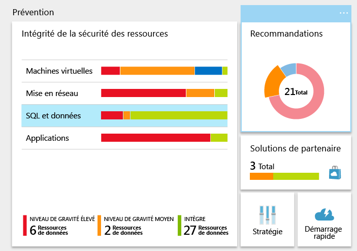

Si Azure Security Center identifie une vulnérabilité qui doit être corrigée (par exemple, une machine virtuelle à laquelle il manque des mises à jour de sécurité ou un sous-réseau sans [groupe de sécurité réseau](/virtual-network/virtual-networks-nsg.md)), cette vulnérabilité est identifiée dans ce panneau.

### Surveillance des machines virtuelles
Quand vous cliquez sur **Machines virtuelles** dans la mosaïque **Intégrité de la sécurité des ressources**, le panneau **Machines virtuelles** s’ouvre et affiche des informations détaillées sur les étapes d’intégration et de prévention, ainsi que la liste de toutes les machines virtuelles surveillées par Azure Security Center, comme illustré dans la capture d’écran suivante.

* Étapes de mise en route
* Recommandations pour machines virtuelles
* Machines virtuelles

Dans chaque section, vous pouvez sélectionner une option afin d’afficher plus de détails sur les étapes recommandées pour résoudre le problème. Les sections suivantes explique ces points plus en détail.

#### Recommandations concernant la surveillance
Cette section indique la quantité totale de machines virtuelles qui ont été initialisées pour la collecte des données et leur état actuel. Une fois la collecte des données initialisée sur toutes les machines virtuelles, cette dernière est prête à recevoir les stratégies de sécurité d’Azure Security Center. Lorsque vous cliquez sur cette entrée, le panneau **État de l'installation de la collecte de données** s’affiche et vous permet de voir le nom des machines virtuelles et l’état actuel de la collecte de données dans la colonne **ÉTAT D’INSTALLATION**, comme illustré dans la capture d’écran suivante.

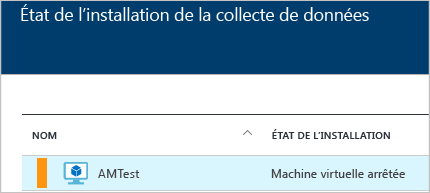

#### Recommandations pour machines virtuelles
Cette section contient une série de [recommandations pour chaque machine virtuelle](security-center-virtual-machine-recommendations.md) surveillée par Azure Security Center. La première colonne indique la recommandation. La deuxième colonne indique le nombre total de machines virtuelles qui sont affectées par cette recommandation. La troisième colonne indique la gravité du problème, comme illustré dans la capture d’écran suivante.

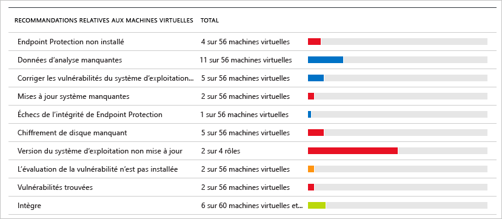

> [!NOTE]
> Seules les machines virtuelles ayant au moins un point de terminaison public sont affichées dans le panneau **Intégrité de mise en réseau** dans la liste **Topologie du réseau**.
> 
> 

Chaque recommandation dispose d’un ensemble d’actions pouvant être effectuées après avoir cliqué dessus. Par exemple, si vous cliquez sur **Mises à jour système manquantes**, le panneau **Mises à jour système manquantes** s’ouvre. Ce dernier répertorie les machines virtuelles auxquelles il manque des correctifs ainsi que le niveau de gravité de la mise à jour manquante, comme illustré dans la capture d’écran suivante.

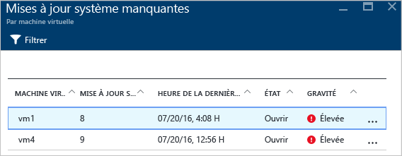

Le panneau **Mises à jour système manquantes** affiche un tableau contenant les informations suivantes :

* **MACHINE VIRTUELLE**: nom de la machine virtuelle sur laquelle il manque des mises à jour.
* **MISES À JOUR SYSTÈME**: quantité de mises à jour système manquantes.
* **HEURE DE LA DERNIÈRE ANALYSE** : heure de la dernière analyse de la machine virtuelle par Azure Security Center, afin de contrôler les mises à jour.
* **ÉTAT**: état actuel de la recommandation :
  * **Ouverte** : la recommandation n’a pas encore été prise en compte.
  * **En cours** : la recommandation est actuellement appliquée à ces ressources ; aucune action de votre part n’est nécessaire.
  * **Résolue** : la recommandation a déjà été achevée. (Une fois problème résolu, l’entrée a été grisée).
* **GRAVITÉ**: donne le niveau de gravité de chaque recommandation :
  * **Élevée** : existence d’une vulnérabilité sur une ressource importante (application, machine virtuelle, groupe de sécurité réseau). Le problème doit être analysé.
  * **Moyenne** : certaines étapes supplémentaires sont nécessaires pour terminer un processus ou éliminer une vulnérabilité.
  * **Faible**: existence d’une vulnérabilité devant être prise en compte, mais qui ne nécessite aucune attention immédiate. Par défaut, les recommandations de niveau Faible ne sont pas affichées, mais vous pouvez filtrer les recommandations pour les faire apparaître.

Pour afficher des informations détaillées sur les recommandations, cliquez sur le nom de la machine virtuelle. Un nouveau panneau s’ouvre pour cette machine virtuelle. Il contient une liste des mises à jour, comme illustré dans la capture d’écran suivante.

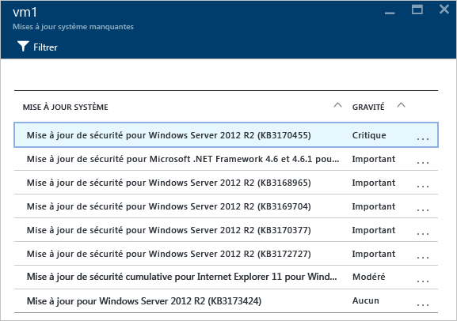

> [!NOTE]
> Les recommandations de sécurité de ce panneau sont les mêmes que celles figurant dans le panneau **Recommandations**. Pour plus d’informations sur la résolution des recommandations, consultez l’article [Implémentation des recommandations de sécurité dans le Centre de sécurité Azure](security-center-recommendations.md). Cela s’applique non seulement aux machines virtuelles, mais aussi à toutes les ressources qui sont disponibles dans la mosaïque **Intégrité des ressources**.
> 
> 

#### Section Machines virtuelles
La section Machines virtuelles vous fournit un aperçu de toutes les machines virtuelles et des recommandations. Chaque colonne représente un ensemble de recommandations, comme illustré dans la capture d’écran suivante :

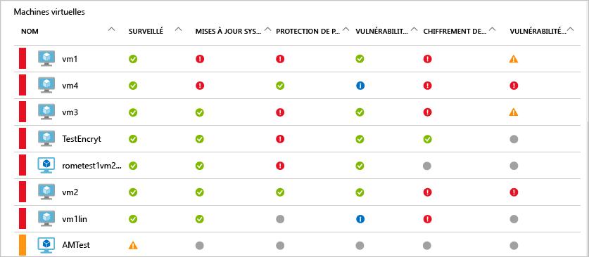

L’icône qui s’affiche sous chaque recommandation vous aide à identifier rapidement les machines virtuelles qui requièrent votre attention, ainsi que le type de recommandation.

Dans l’exemple précédent, une machine virtuelle a une recommandation critique concernant la protection de point de terminaison. Pour obtenir plus d’informations sur la machine virtuelle, cliquez dessus. Le nouveau panneau qui s’ouvre représente cette machine virtuelle, comme illustré dans la capture d’écran suivante.

Ce panneau comporte des informations détaillées sur la sécurité de la machine virtuelle. L’action recommandée et le niveau de gravité de chaque recommandation sont affichés en bas du panneau.

#### Section Cloud services (version préliminaire)
L’état d’intégrité des services cloud est inclus dans la mosaïque **Intégrité de la sécurité** de la machine virtuelle. Une recommandation est créée lorsque la version du système d’exploitation est obsolète, comme illustré dans la capture d’écran suivante :

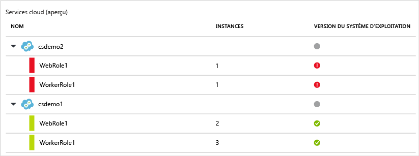

Vous devez suivre les étapes de la recommandation pour mettre à jour la version du système d’exploitation. Par exemple, si vous cliquez sur l’alerte rouge dans les liugnes WebRole1 (exécute Windows Server avec votre application web automatiquement déployée sur IIS) ou WorkerRole1 (exécute Windows Server avec votre application web automatiquement déployée sur IIS), un nouveau panneau s’ouvre et affiche des informations détaillées sur cette recommandation, comme illustré dans la capture d’écran suivante :

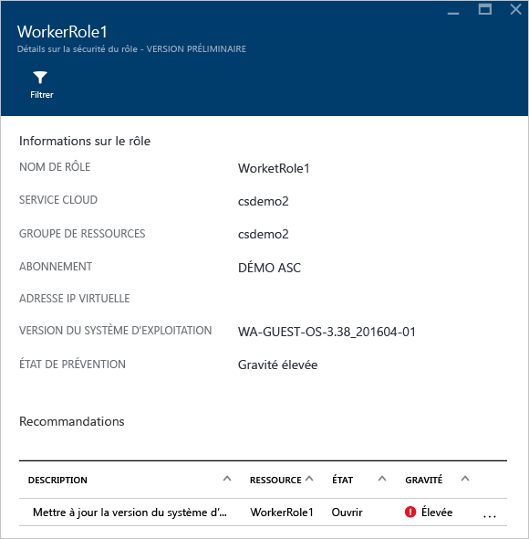

Pour voir une explication plus normative concernant cette recommandation, cliquez sur **Mettre à jour la version du système d’exploitation** sous la colonne **DESCRIPTION**. Le panneau **Mettre à jour la version du système d’exploitation (aperçu)** s’ouvre et affiche des informations détaillées.

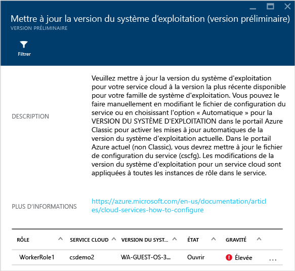  

### Surveillance des réseaux virtuels
Lorsque vous cliquez sur **Mise en réseau** dans la mosaïque **Intégrité de la sécurité des ressources**, le panneau **Mise en réseau** s’ouvre et affiche des informations détaillées, comme illustré dans la capture d’écran suivante :

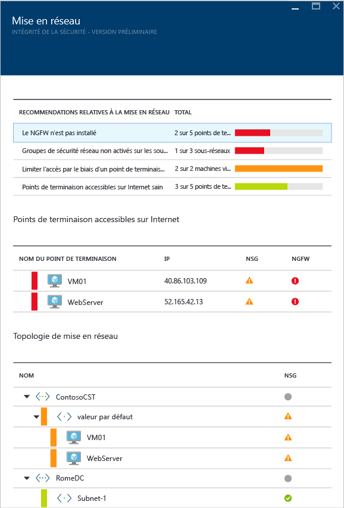

#### Recommandations pour la mise en réseau
En haut du panneau se trouve un récapitulatif des problèmes et au bas du panneau, la liste des réseaux surveillés. Ces informations sont similaires à celles qui figurent dans les informations sur l’intégrité des ressources.

La section de répartition des états du réseau répertorie les problèmes de sécurité potentiels et propose des [recommandations](security-center-network-recommendations.md)pour leur résolution. Voici des exemples de problèmes potentiels :

* Absence d’installation d’un pare-feu de nouvelle génération
* Non-activation des groupes de sécurité réseau
* Non-activation des groupes de sécurité réseau sur les machines virtuelles
* Restriction de l’accès externe via le point de terminaison externe public
* Intégrité des points de terminaison exposés à Internet

Lorsque vous cliquez sur une recommandation, un nouveau panneau s’ouvre avec plus de détails sur la recommandation comme indiqué dans l’exemple suivant.

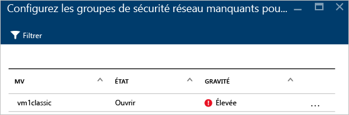

Dans cet exemple, le panneau **Configurer les groupes de sécurité réseau manquants pour les sous-réseaux** contient une liste de sous-réseaux et de machines virtuelles sur lesquels la protection des groupes de sécurité réseau fait défaut. Si vous cliquez sur le sous-réseau auquel vous souhaitez appliquer le groupe de sécurité réseau, un autre panneau s’ouvre.

Dans le panneau **Choisir un groupe de sécurité réseau**, vous pouvez sélectionner le groupe de sécurité réseau le mieux adapté au sous-réseau, ou bien vous pouvez créer un groupe de sécurité réseau.

#### Section des points de terminaison accessibles sur Internet
La section **Points de terminaison accessibles sur Internet** présente les machines virtuelles qui sont actuellement configurées avec un point de terminaison accessible sur Internet, ainsi que leur état actuel.

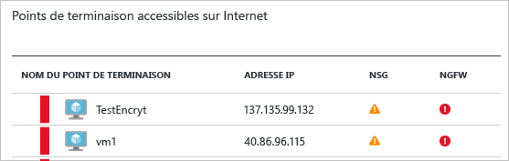

Ce tableau indique le nom du point de terminaison qui représente la machine virtuelle, l’adresse IP Internet et l’état de gravité actuel du groupe de sécurité réseau et du pare-feu nouvelle génération. Le tableau est trié par niveau de gravité :

* Rouge (en haut) : priorité élevée ; doivent être traités immédiatement
* Orange : priorité moyenne ; doivent être traités dès que possible
* Vert (le dernier) : état d’intégrité

#### Section de topologie de mise en réseau
La section **Topologie de mise en réseau** contient une vue hiérarchique des ressources, comme illustré dans la capture d’écran suivante :

Ce tableau est trié (machines virtuelles et sous-réseaux) par niveau de gravité :

* Rouge (en haut) : priorité élevée ; doivent être traités immédiatement
* Orange : priorité moyenne ; doivent être traités dès que possible
* Vert (le dernier) : état d’intégrité

Dans cette topologie, le premier niveau se décompose comme suit : [réseaux virtuels](../virtual-network/virtual-networks-overview.md), [passerelles de réseau virtuel](/vpn-gateway/vpn-gateway-site-to-site-create.md) et [réseaux virtuels (classiques)](/virtual-network/virtual-networks-create-vnet-classic-pportal.md). Le deuxième niveau comprend des sous-réseaux et le troisième niveau regroupe les machines virtuelles appartenant à ces sous-réseaux. La colonne de droite présente l’état actuel du groupe de sécurité réseau pour ces ressources, comme illustré dans l’exemple suivant :

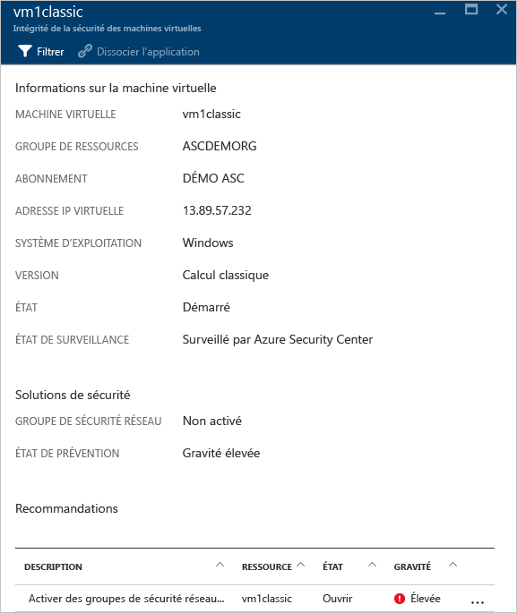

La partie inférieure de ce panneau regroupe les recommandations pour cette machine virtuelle, similaires celles décrites ci-dessus. Vous pouvez cliquer sur une recommandation pour en savoir plus, ou appliquer la configuration ou le contrôle de sécurité nécessaire.

### Surveiller des données

Lorsque vous cliquez sur **SQL & Data (SQL et données)** dans la mosaïque **Intégrité de la sécurité des ressources**, le panneau **Ressources de données** s’ouvre avec des recommandations pour SQL et Stockage. Il contient également des [recommandations](security-center-sql-service-recommendations.md) pour l’état général de la base de données. Pour plus d’informations sur le chiffrement du stockage, consultez [Enable encryption for Azure storage account in Azure Security Center (Activer le chiffrement pour le compte de stockage Azure dans Azure Security Center)](security-center-enable-encryption-for-storage-account.md).

Sous **Recommandations SQL**, vous pouvez cliquer sur une recommandation et obtenir des informations sur les actions permettant de résoudre un problème. L’exemple suivant montre le détail de la recommandation **Database Auditing & Threat detection on SQL databases (Audit de base de données et détection des menaces sur les bases de données SQL)**.

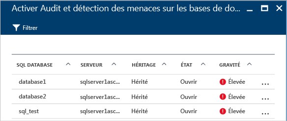

Le panneau **Enable Auditing & Threat detection on SQL databases (Activer l’audit et la détection des menaces sur les bases de données SQL)** fournit les informations suivantes :

* Une liste des bases de données SQL.
* Le serveur sur lequel elles se trouvent.
* Des informations indiquant si ce paramètre a été hérité du serveur ou s’il est unique dans cette base de données.
* L’état actuel du problème.
* Le niveau de gravité du problème.

Lorsque vous cliquez sur la base de données pour suivre cette recommandation, le panneau **Audit et détection des menaces** s’ouvre, comme illustré dans la capture d’écran suivante.

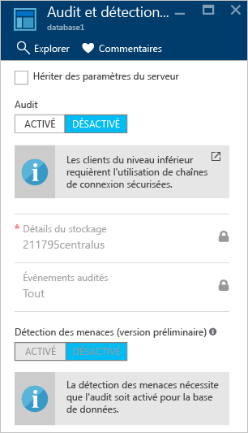

Pour activer l’audit, sélectionnez **ACTIVÉ** sous **Audit**.

### Surveillance des applications

Si votre charge de travail Azure comprend des applications situées sur des [machines virtuelles (créées via Azure Resource Manager)](../azure-resource-manager/resource-manager-deployment-model.md) comportant des ports web exposés (ports TCP 80 et 443), Azure Security Center peut les surveiller pour identifier les problèmes de sécurité potentiels et recommander des étapes de résolution. Lorsque vous cliquez sur la mosaïque **Applications**, le panneau **Applications** s’ouvre et affiche des recommandations dans la section **Recommandations relatives aux applications**. Il montre également la répartition des applications par hôte/IP virtuelle, comme illustré dans la capture d’écran suivante.

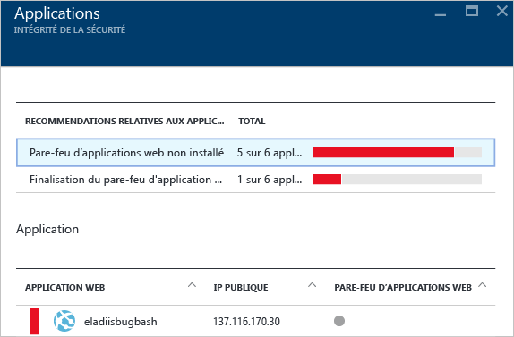

Comme pour les recommandations précédentes, vous pouvez cliquer sur l’une d’entre elles pour afficher des informations détaillées sur le problème et la procédure à suivre pour le résoudre. L’exemple illustré ci-dessus représente une application ayant été identifiée comme une application web non sécurisée. Quand vous sélectionnez une application considérée comme non sécurisée, un autre panneau s’ouvre avec l’option suivante disponible :

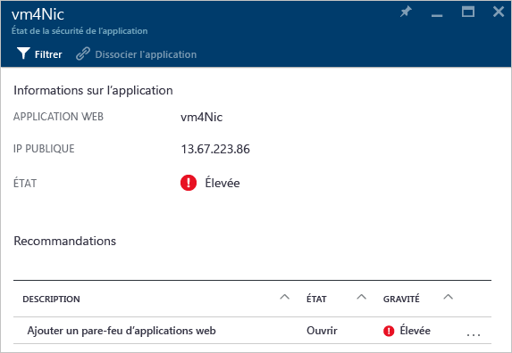

Ce panneau répertorie toutes les recommandations pour cette application. Lorsque vous cliquez sur la recommandation **Ajouter un pare-feu d’applications web**, le panneau **Ajouter un pare-feu d’applications web** s’ouvre en affichant des options vous permettant d’installer le pare-feu d’applications web (WAF) d’un partenaire, comme illustré dans la capture d’écran suivante.

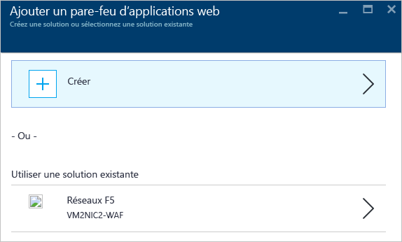

## Voir aussi
Dans cet article, vous avez vu comment utiliser les fonctionnalités de surveillance d’Azure Security Center. Pour plus d’informations sur le Centre de sécurité Azure, consultez les rubriques suivantes :

* [Définition des stratégies de sécurité dans Azure Security Center](security-center-policies.md) : découvrez comment configurer des paramètres de sécurité dans Azure Security Center.
* [Gestion et résolution des alertes de sécurité dans Azure Security Center](security-center-managing-and-responding-alerts.md) : découvrez comment gérer et résoudre les alertes de sécurité.
* [Surveillance des solutions partenaires avec Azure Security Center](security-center-partner-solutions.md) : découvrez comment surveiller l’état d’intégrité de vos solutions partenaires.
* [FAQ Azure Security Center](security-center-faq.md) : forum aux questions concernant l’utilisation de ce service.
* [Blog sur la sécurité Azure](http://blogs.msdn.com/b/azuresecurity/) : accédez à des billets de blog sur la sécurité et la conformité Azure.

<!--HONumber=Jan17_HO2-->

