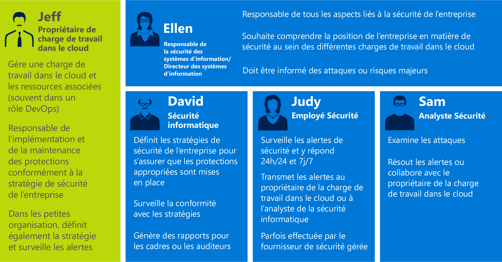
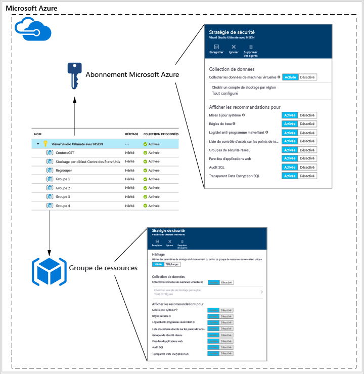
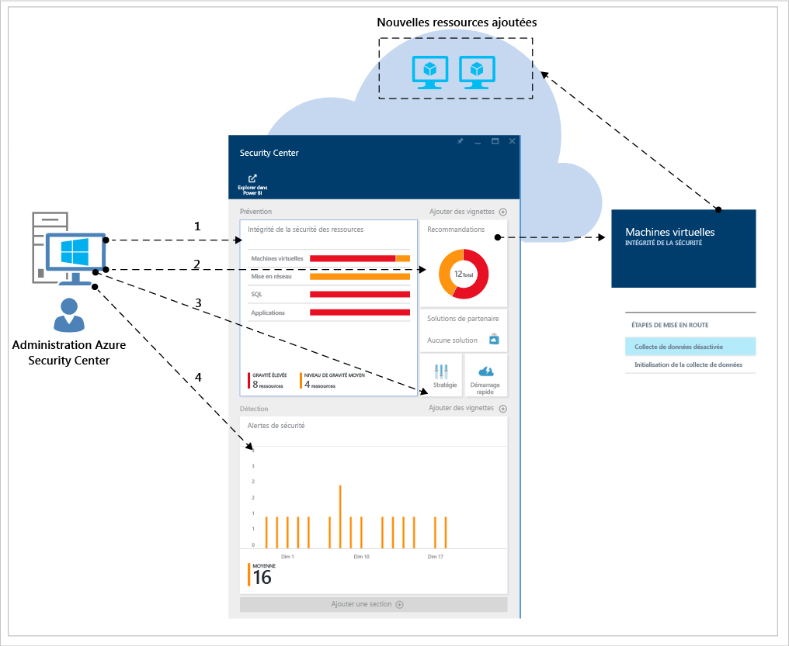
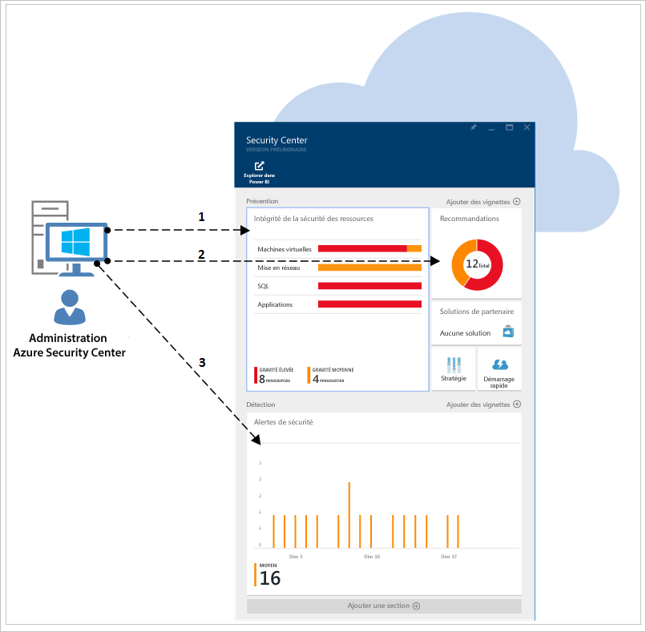
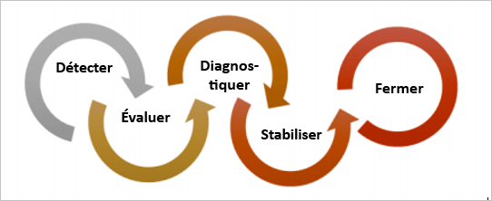
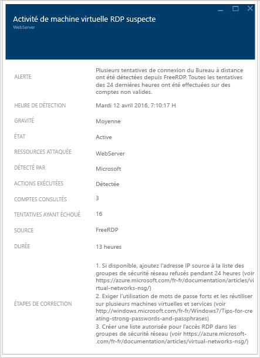

# Guide des opérations et de planification du Centre de sécurité Azure
Ce guide s’adresse aux informaticiens professionnels, aux architectes informatiques, aux analystes de la sécurité des informations et aux administrateurs de cloud dont les entreprises prévoient d’utiliser le Centre de sécurité Azure.

## Guide de planification
Ce guide couvre un ensemble d’étapes et de tâches que vous pouvez suivre pour optimiser votre utilisation du Centre de sécurité en fonction des critères de sécurité et du modèle de gestion de cloud de votre entreprise. Pour tirer pleinement parti du Centre de sécurité, il est important de comprendre comment les différents utilisateurs ou équipes de votre entreprise utilisent ce service afin de répondre aux besoins de sécurisation du développement et des opérations, de surveillance, de gouvernance et de réponse aux incidents. Les principaux aspects à prendre en compte lorsque vous prévoyez d’utiliser le Centre de sécurité sont les suivants :

* Rôles de sécurité et contrôles d’accès
* Stratégies et recommandations de sécurité
* Collecte et stockage des données
* Surveillance continue de la sécurité
* Réponse aux incidents

Dans la section suivante, vous allez apprendre à planifier chacun de ces aspects et à appliquer ces recommandations en fonction de vos besoins.

> [!NOTE]
> Pour obtenir des réponses utiles lors des phases de conception et de planification, consultez le [Forum aux questions (FAQ) du Centre de sécurité Azure](security-center-faq.md) .
> 
> 

## Rôles de sécurité et contrôles d’accès
Selon la taille et la structure de votre entreprise, plusieurs personnes et équipes peuvent utiliser le Centre de sécurité pour différentes tâches liées à la sécurité. Le diagramme suivant vous présente un exemple de personnes fictives avec leurs responsabilités et rôles respectifs en termes de sécurité :

Le Centre de sécurité permet à ces personnes d’assumer ces différentes responsabilités. Par exemple :

**Jeff (propriétaire de la charge de travail cloud)**

* Gérer une charge de travail de cloud et ses ressources connexes
* Chargé de l’implémentation et de la maintenance des protections conformément à la stratégie de sécurité de l’entreprise

**Ellen (directrice informatique/responsable de la sécurité des systèmes d’information)**

* Responsable de tous les aspects liés à la sécurité de l’entreprise
* Souhaite comprendre la position de l’entreprise en matière de sécurité à travers les charges de travail de cloud
* Doit être informée des attaques et des risques majeurs

**David (sécurité informatique)**

* Définit les stratégies de sécurité de l’entreprise afin de garantir que les protections appropriées sont en place
* Surveille la conformité aux stratégies
* Génère les rapports pour la direction ou les auditeurs

**Judy (opérations de sécurité)**

* Surveille et répond aux alertes de sécurité 24h/24, 7j/7.
* Rend des comptes au propriétaire de la charge de travail de cloud ou à l’analyste de la sécurité informatique

**Sam (analyste de sécurité)**

* Analyse les attaques
* Solutionne les alertes ou travaille avec le propriétaire de la charge de travail de cloud pour mettre en œuvre les solutions 

Azure Security Center utilise le [contrôle d’accès en fonction du rôle (RBAC)](../active-directory/role-based-access-control-configure.md) qui fournit des [rôles intégrés](../active-directory/role-based-access-built-in-roles.md) susceptibles d’être attribués à des utilisateurs, des groupes et des services dans Azure. Lorsqu’un utilisateur ouvre le Centre de sécurité, il voit uniquement les informations relatives aux ressources auxquelles il a accès. Autrement dit, l’utilisateur se voit attribuer le rôle de propriétaire, collaborateur ou lecteur, pour l’abonnement ou le groupe de ressources auquel appartiennent les ressources. 

> [!NOTE]
> Un utilisateur doit être au moins propriétaire ou collaborateur du groupe de ressources ou de l’abonnement pour voir Azure Security Center.
> 
> 

En considérant les personnes décrites dans le diagramme précédent, voici le RBAC qui serait nécessaire :

**Jeff (propriétaire de la charge de travail cloud)**

* Propriétaire/collaborateur du groupe de ressources

**David (sécurité informatique)**

* Propriétaire/collaborateur de l’abonnement

**Judy (opérations de sécurité)**

* Lecteur de l’abonnement, autorisé à consulter les alertes
* Propriétaire/collaborateur de l’abonnement, requis pour clore les alertes

**Sam (analyste de sécurité)**

* Lecteur de l’abonnement, autorisé à consulter les alertes
* Propriétaire/collaborateur de l’abonnement, requis pour solutionner ou clore les alertes
* Accès à Storage éventuellement requis

Autres informations importantes à prendre en compte :

* Seuls les collaborateurs et propriétaires d’abonnement peuvent modifier une stratégie de sécurité
* Seuls les propriétaires et collaborateurs d’abonnement et de groupe de ressources peuvent appliquer les recommandations de sécurité pour une ressource

Lorsque vous planifiez le contrôle d’accès à l’aide de RBAC dans le Centre de sécurité, veillez à identifier qui dans votre entreprise utilisera le Centre de sécurité, ainsi que les types de tâches qu’ils effectueront, puis configurez RBAC en conséquence.

> [!NOTE]
> Nous vous recommandons d’attribuer le rôle le moins permissif permettant aux utilisateurs d’effectuer leurs tâches. Par exemple, les utilisateurs qui n’ont besoin que de consulter des informations sur l’état de sécurité des ressources sans effectuer aucune action, telles que l’application des recommandations ou la modification des stratégies, doivent recevoir le rôle de lecteur.
> 
> 

## Stratégies et recommandations de sécurité
Une stratégie de sécurité définit l’ensemble des contrôles recommandés pour les ressources d’un abonnement ou groupe de ressources spécifique. Dans le Centre de sécurité, vous devez définir des stratégies en fonction des exigences de sécurité de votre entreprise et du type d’applications ou de sensibilité des données.

Les stratégies qui sont activées au niveau de l’abonnement sont automatiquement propagées à tous les groupes de ressources de l’abonnement, comme indiqué dans le schéma suivant :

Comme indiqué dans la figure précédente, les stratégies de sécurité des groupes de ressources peuvent être héritées de l’abonnement.

Si des ressources d’un groupe de ressources nécessitent un autre jeu de stratégies, vous pouvez désactiver l’héritage et appliquer des stratégies personnalisées à un groupe de ressources spécifique.

Si vous avez besoin de stratégies personnalisées dans certains groupes de ressources, vous devez désactiver l’héritage dans le groupe de ressources et modifier les stratégies de sécurité. Par exemple, si certaines de vos charges de travail ne nécessitent pas la stratégie SQL Transparent Data Encryption, désactivez cette dernière au niveau de l’abonnement et ne l’activez que dans les groupes de ressources qui la requièrent.

Lorsque vous créez des stratégies personnalisées pour différents groupes de ressources, vous devez planifier leur déploiement, sachant qu’en cas de conflit (entre l’abonnement et le groupe de ressources), la stratégie du groupe de ressources prévaut.

> [!NOTE]
> Si vous devez examiner les stratégies qui ont été modifiées, vous pouvez utiliser les [journaux d’audit Azure](https://blogs.msdn.microsoft.com/cloud_solution_architect/2015/03/10/audit-logs-for-azure-events/). Les modifications de stratégie y sont toujours enregistrées.
> 
> 

### Recommandations de sécurité
Avant de configurer des stratégies de sécurité, examinez chacune des [recommandations de sécurité](security-center-recommendations.md)et déterminer si ces stratégies conviennent à vos différents abonnements et groupes de ressources. Il est également important de comprendre quelle action est effectuée en réponse aux recommandations de sécurité.

**Protection de point de terminaison**: si une machine virtuelle n’a aucune solution de protection de point de terminaison activée, le Centre de sécurité vous recommande d’en installer une. Si vous avez déjà mis en place une solution locale de protection de point de terminaison, vous devez décider si vous voulez utiliser le même logiciel anti-programme malveillant pour vos machines virtuelles Azure. Le Centre de sécurité vous propose plusieurs options de protection de point de terminaison.  Vous pouvez utiliser la solution gratuite Microsoft Antimalware ou faire votre choix parmi les solutions de protection de point de terminaison de partenaires intégrés. Pour plus d’informations sur le déploiement d’un logiciel anti-programme malveillant à l’aide du Centre de sécurité, voir [Installer Endpoint Protection dans Azure Security Center](security-center-install-endpoint-protection.md).

**Mises à jour système**: le Centre de sécurité identifie les machines virtuelles sur lesquelles des mises à jour de sécurité ou du système d’exploitation pour IaaS et Cloud Services (PaaS) sont manquantes. Désignez la personne chargée d’installer les mises à jour ainsi que les modalités d’application de celles-ci. De nombreuses entreprises utilisent WSUS, Windows Update ou un autre outil.

**Configurations de ligne de base**: si la configuration du système d’exploitation des machines virtuelles ne correspond pas aux lignes de base recommandées, une recommandation s’affiche. Examinez l’ensemble de lignes de base [ici](https://gallery.technet.microsoft.com/Azure-Security-Center-a789e335) et déterminez comment les configurations de système d’exploitation sont appliquées.

**Chiffrement de disque**: si vous avez des disques de machines virtuelles qui ne sont pas chiffrés, le Centre de sécurité vous recommande d’appliquer Azure Disk Encryption. Cette fonctionnalité tire parti de BitLocker pour Windows et DM-Crypt pour Linux pour le chiffrement de volume pour le système d’exploitation et les disques de données. Cette recommandation vous oriente vers un [guide étape par étape](security-center-disk-encryption.md) qui vous explique comment assurer ce chiffrement.

N’oubliez pas que plusieurs scénarios de chiffrement sont à envisager. Vous devez planifier les spécificités propres à chacun d’eux :

* Chiffrement des nouvelles machines virtuelles Azure à partir de disques durs virtuels chiffrés avec vos propres clés de chiffrement
* Chiffrement des nouvelles machines virtuelles Azure créées à partir de la galerie Azure
* Chiffrement des machines virtuelles Azure en cours d’exécution dans Azure

La planification requise sera différente dans chacun de ces scénarios. Pour plus d’informations sur chacun de ces scénarios, voir le [livre blanc sur Azure Disk Encryption](https://gallery.technet.microsoft.com/Azure-Disk-Encryption-for-a0018eb0) .

**Pare-feu d’applications web**: le Centre de sécurité identifie les machines virtuelles exécutant des applications web et vous recommande d’installer un pare-feu d’applications web (WAF). Évaluez les solutions de partenaire pour identifier celle qui est la mieux adaptée à votre entreprise et déterminez son modèle de licence (les partenaires peuvent prendre en charge les modèles BYOL (apportez votre propre licence) et/ou de paiement à l’utilisation). Pour plus d’informations sur le déploiement d’un pare-feu d’applications web dans vos machines virtuelles Azure à l’aide du Centre de sécurité, voir [Ajouter un pare-feu d’applications web dans Azure Security Center](security-center-add-web-application-firewall.md).

**Pare-feu de nouvelle génération**: vous permet d’approvisionner une appliance virtuelle des principaux fournisseurs, notamment Check Point, suivi de près par Cisco et Fortinet. Cela permet d’étendre les protections du réseau au-delà des groupes de sécurité réseau, intégrés à Azure. Le Centre de sécurité détecte les déploiements pour lesquels un pare-feu de nouvelle génération est recommandé et vous permet d’approvisionner une appliance virtuelle.

**Mise en réseau virtuelle** : Azure Security Center évalue l’infrastructure et la configuration de votre [réseau virtuel Azure](https://azure.microsoft.com/documentation/services/virtual-network/) pour vérifier que le [Groupe de sécurité réseau](../virtual-network/virtual-networks-nsg.md) est appliqué et correctement configuré avec des règles de trafic entrant. Vous devez déterminer les règles de trafic à définir et les communiquer aux personnes qui appliqueront les recommandations de sécurité associées.

Le Centre de sécurité vous recommande de fournir les détails du contact de sécurité pour votre abonnement Azure. Ces informations seront utilisées par Microsoft pour vous contacter si Microsoft Security Response Center (MSRC) découvre que vos données client ont été utilisées par un tiers illégal ou non autorisé. Pour plus d’informations sur la mise en œuvre de cette recommandation, consultez [Fournir les détails du contact de sécurité dans Azure Security Center](security-center-provide-security-contact-details.md) .

## Collecte et stockage des données
Il est vivement recommandé d’activer la collecte des données pour chacun de vos abonnements, car cela garantit la surveillance de la sécurité sur toutes vos machines virtuelles. La collecte des données peut être assurée par l’agent de surveillance Azure (ASMAgentLauncher.exe) ou l’extension Surveillance de la sécurité Azure (ASMMonitoringAgent.exe.

L’extension Surveillance de la sécurité Azure analyse diverses configurations de sécurité et collecte les journaux de sécurité de la machine virtuelle. Ces données sont envoyées au compte de stockage spécifié. Le gestionnaire d’analyse (ASMSoftwareScanner.exe), également installé sur la machine virtuelle, peut être utilisé comme module de recherche de correctifs.

L’encombrement de base de l’agent de surveillance de la sécurité Azure (ASM) est le suivant :

* Encombrement de mémoire de 3 Mo dans la plupart des cas, avec des pics potentiels de 10 Mo lorsqu’un scénario es exécuté toutes les 12 heures.  
* Utilisation minime du processeur par les processus persistants et les scanneurs. 
* Utilisation minimale du disque.

L’agent ASM génère une chaîne de processus pouvant atteindre un total d’environ 30 Mo en mémoire.  Chaque instance d’agent de surveillance peut utiliser jusqu’à 3 Go de disque. Chaque instance est limitée à 20 % du processeur, bien qu’en pratique ce soit bien inférieur. 

Une fois la collecte de données activée dans la stratégie de sécurité, l’agent et les extensions de surveillance sont installées automatiquement sur toutes les machines virtuelles existantes et nouvelles qui sont prises en charge et provisionnées dans Azure.  Les processus de l’agent sont conçus pour être non invasifs et ont un impact minimal sur les performances de la machine Virtuelle.

> [!NOTE]
> Pour résoudre les problèmes liés à l’agent de surveillance de sécurité Azure, voir le [Guide de résolution des problèmes d’Azure Security Center](security-center-troubleshooting-guide.md).
> 
> 

Si, à un moment donné, vous souhaitez désactiver la collecte de données, vous pouvez le faire dans la stratégie de sécurité. Pour supprimer les agents de surveillance déployés, sélectionnez l’option de menu Supprimer les agents.

> [!NOTE]
> Pour obtenir la liste des machines virtuelles prises en charge, voir le [Forum aux questions (FAQ) du Centre de sécurité Azure](security-center-faq.md).
> 
> 

Pour chaque région où s’exécutent des machines virtuelles, vous devez choisir le compte de stockage où doivent être stockées les données collectées à partir de ces machines virtuelles. Si vous ne choisissez pas un compte de stockage pour chaque région, un compte sera créé. Vous pouvez choisir un emplacement de stockage par région ou stocker toutes les informations dans un emplacement central. S’il est possible de configurer les stratégies de sécurité au niveau du groupe de ressources et de l’abonnement Azure, le choix de la région du compte de stockage ne s’effectue que dans l’abonnement.

Si vous utilisez un compte de stockage partagé entre différentes ressources Azure, lisez l’article [Objectifs de performance et évolutivité de Stockage Azure](../storage/storage-scalability-targets.md) pour en savoir plus sur les contraintes et limites de taille. Votre abonnement présente également des limites concernant le compte de stockage. Pour mieux comprendre ces limites, voir [Abonnement Azure et limites, quotas et contraintes du service](../azure-subscription-service-limits.md).

Les coûts associés à ce stockage ne sont pas inclus dans le prix du service d’Azure Security Center. Ils sont facturés séparément au [tarif normal de Stockage Azure](https://azure.microsoft.com/pricing/details/storage/). Concernant la planification, vous devez savoir qu’Azure Security Center ajoute des données à votre stockage Azure, ce qui peut augmenter le coût de 1 à 3 de dollars par an.

Des critères de performances et d’évolutivité sont également à prendre en compte en fonction de la taille de votre environnement Azure et des ressources qui utilisent votre compte de stockage. Pour plus d’informations, voir [Liste de contrôle des performances et de l’extensibilité de Stockage Azure Microsoft](../storage/storage-performance-checklist.md) .

> [!NOTE]
> Microsoft prend des engagements fermes pour protéger la confidentialité et la sécurité de ces données. Microsoft adhère aux recommandations strictes de conformité et de sécurité, du codage jusqu'à l'exploitation d'un service. Pour plus d’informations sur la gestion des données et la confidentialité, lisez [Sécurité des données d’Azure Security Center](security-center-data-security.md).
> 
> 

## Surveillance continue de la sécurité
Après la configuration initiale et la mise en œuvre des recommandations du Centre de sécurité, l’étape suivante détermine les processus opérationnels de ce dernier.

Pour accéder à Azure Security Center à partir du Portail Azure, cliquez sur **Parcourir**, puis tapez **Security Center** dans le champ **Filtre**. Les vues affichées sont mises à jour en fonction des filtres appliqués.

Le Centre de sécurité n’interfère pas avec vos procédures de fonctionnement normales. Il surveille passivement vos déploiements et fournit des recommandations en fonction des stratégies de sécurité activées.

Le tableau de bord du Centre de sécurité est divisé en deux parties principales :

* Prévention
* Détection

Lorsque vous activez pour la première fois la collecte des données de votre environnement Azure dans Azure Security Center, veillez à passer en revue toutes les recommandations, ce que vous pouvez faire dans le panneau **Recommandations** ou par ressource (**Machine virtuelle**, **Mise en réseau**, **SQL** et **Application**).

Une fois toutes les recommandations traitées, la section **Prévention** doit être verte pour toutes les ressources concernées. À ce stade, la surveillance continue devient plus facile puisque vous n’effectuerez des actions qu’en fonction des modifications apportées dans les mosaïques de recommandations et d’intégrité de la sécurité des ressources.

La section **Détection** est plus réactive. Ces alertes concernent les problèmes qui surviennent maintenant ou qui existent déjà et ont été détectés par les contrôles d’Azure Security Center et par des systèmes tiers. La mosaïque Alertes de sécurité affiche des graphiques à barres qui indiquent le nombre d’alertes de détection de menaces enregistrées chaque jour, ainsi que leur répartition au sein des catégories de gravité (faible, moyenne, élevée). Pour plus d’informations sur les alertes de sécurité, voir [Gestion et résolution des alertes de sécurité dans Azure Security Center](security-center-managing-and-responding-alerts.md).

> [!NOTE]
> Vous pouvez également utiliser Microsoft Power BI pour visualiser vos données du Centre de sécurité. Voir [Obtenir des informations à partir des données du Centre de sécurité Azure à l’aide de Power BI](security-center-powerbi.md).
> 
> 

### Surveillance des ressources nouvelles ou modifiées
La plupart des environnements Azure sont dynamiques, avec des nouvelles ressources ajoutées ou retirées régulièrement, des configurations ou des modifications, etc. Le Centre de sécurité vous offre une visibilité sur l’état de la sécurité de ces nouvelles ressources.

Lorsque vous ajoutez de nouvelles ressources (machines virtuelles, bases de données SQL) dans votre environnement Azure, le Centre de sécurité les détecte automatiquement et commence à surveiller leur sécurité. Cela inclut également les rôles Web et les rôles de travail PaaS. Si la collecte de données est activée dans la [stratégie de sécurité](security-center-policies.md), des fonctionnalités de surveillance supplémentaires sont activées automatiquement pour vos machines virtuelles.

1. Pour les machines virtuelles, accédez à la mosaïque **Intégrité de la sécurité des ressources**, puis cliquez sur **Machines virtuelles**. Les problèmes liés à l’activation de la collecte de données ou aux recommandations associées s’affichent dans la section **Recommandations relatives à la surveillance** .
2. Consultez les **recommandations** pour découvrir les éventuels risques de sécurité identifiés pour la nouvelle ressource.
3. Il est très courant, lors de l’ajout de nouvelles machines virtuelles à votre environnement, que seul le système d’exploitation soit installé initialement. Le propriétaire de la ressource peut avoir besoin de temps pour déployer d’autres applications qui seront utilisées par ces machines virtuelles.  L’idéal est de connaître le but de cette charge de travail. Va-t-il s’agir d’un serveur d’applications ? Selon la nature de cette nouvelle charge de travail, vous pouvez activer la **stratégie de sécurité**appropriée, ce qui constitue la troisième étape de cette charge de travail.
4. Lorsque de nouvelles ressources sont ajoutées à votre environnement Azure, il est possible que les nouvelles alertes s’affichent dans la mosaïque **Alertes de sécurité** . Vérifiez toujours si des nouvelles alertes s’affichent dans cette mosaïque et prenez des mesures en fonction des recommandations du Centre de sécurité.

Vous devez également surveiller régulièrement l’état des ressources existantes pour identifier les modifications de configuration qui sont à l’origine de risques de sécurité, d’alertes de sécurité et de dérive par rapport aux lignes de base recommandées. Commencez dans le tableau de bord du Centre de sécurité. Là, consultez régulièrement trois zones principales.

1. Le panneau **Intégrité de la sécurité des ressources** vous permet d’accéder rapidement à vos principales ressources. Utilisez cette option pour surveiller vos machines virtuelles, réseaux, SQL et applications.
2. Le panneau **Recommandations** vous permet de consulter les recommandations du Centre de sécurité. La surveillance continue peut signaler que vous n’avez aucune recommandation aujourd’hui, ce qui est normal puisque vous les avez toutes traitées pendant la configuration initiale du Centre de sécurité. Voilà pourquoi cette section peut ne pas afficher de nouvelles informations tous les jours et ne doit être consultée qu’en cas de besoin.
3. Le panneau **Détection** peut changer très fréquemment ou très rarement. Passez toujours en revue les alertes de sécurité et prenez des mesures en fonction des recommandations du Centre de sécurité.

## Réponse aux incidents
Le Centre de sécurité détecte les menaces et vous les signale dès qu’elles se produisent. Les organisations doivent surveiller les nouvelles alertes de sécurité et réagir soit en examinant l’attaque plus en détail,soit en la contrant. Pour plus d’informations sur le fonctionnement de la détection des menaces par le Centre de sécurité, voir [Fonctionnalités de détection d’Azure Security Center](security-center-detection-capabilities.md).

Même si cet article ne vise pas à vous aider à créer votre propre plan de réponse aux incidents, nous allons utiliser le cycle de vie Microsoft Azure Security Response in the Cloud comme base pour les étapes de réponse aux incidents. Les étapes sont présentées dans le diagramme suivant :

> [!NOTE]
> Vous pouvez utiliser le document [Computer Security Incident Handling Guide](http://nvlpubs.nist.gov/nistpubs/SpecialPublications/NIST.SP.800-61r2.pdf) (Guide de gestion des incidents de sécurité informatique) du NIST (National Institute of Standards and Technology) comme référence pour vous aider à créer votre plan.
> 
> 

Vous pouvez utiliser les alertes du Centre de sécurité lors des étapes suivantes :

* **Détecter**: identifier une activité suspecte dans une ou plusieurs ressources. 
* **Évaluer**: procéder à l’évaluation initiale pour obtenir plus d’informations sur l’activité suspecte.
* **Diagnostiquer**: suivre les étapes techniques de résolution pour remédier au problème.

Chaque alerte de sécurité fournit des informations permettant de mieux comprendre la nature de l’attaque et propose des solutions possibles. Certaines alertes fournissent également des liens vers des informations plus détaillées ou d’autres sources d’information dans Azure. Vous pouvez utiliser ces informations pour mieux cerner le problème et mettre en place une réponse.

L’exemple suivant montre une activité RDP suspecte :

Comme vous pouvez le constater, ce panneau affiche des informations sur l’heure de l’attaque, le nom d’hôte source, la machine virtuelle cible, et détaille une procédure recommandée. Parfois, aucune information ne sera disponible concernant la source de l’attaque. Pour plus d’informations sur ce type de comportement, voir [Missing Source Information in Azure Security Center Alerts](https://blogs.msdn.microsoft.com/azuresecurity/2016/03/25/missing-source-information-in-azure-security-center-alerts/) (Informations sur la source manquantes dans les alertes Azure Security Center).

La vidéo [How to Leverage the Azure Security Center & Microsoft Operations Management Suite for an Incident Response](https://channel9.msdn.com/Blogs/Taste-of-Premier/ToP1703) (Comment tirer profit d’Azure Security Center et de Microsoft Operations Management Suite pour répondre aux incidents) présente des démonstrations pouvant vous aider à comprendre comment Azure Security Center peut être utilisé dans chacune de ces étapes.

> [!NOTE]
> Consultez l’article [Utilisation d’Azure Security Center pour la réponse aux incidents](security-center-incident-response.md) pour plus d’informations sur l’utilisation des fonctionnalités d’Azure Security Center afin de vous aider lors du processus de réponse aux incidents. 
> 
> 

## Voir aussi
Dans ce document, vous avez vu comment planifier l’adoption du Centre de sécurité. Pour plus d’informations sur le Centre de sécurité, consultez les rubriques suivantes :

* [Gestion et résolution des alertes de sécurité dans le Centre de sécurité Azure](security-center-managing-and-responding-alerts.md)
* [Surveillance de l’intégrité de la sécurité dans Azure Security Center](security-center-monitoring.md) : découvrez comment surveiller l’intégrité de vos ressources Azure.
* [Surveillance des solutions de partenaire avec Azure Security Center](security-center-partner-solutions.md) : découvrez comment surveiller l’état d’intégrité de vos solutions de partenaire.
* [FAQ d’Azure Security Center](security-center-faq.md) : découvrez les réponses aux questions les plus souvent posées à propos de l’utilisation de ce service.
* [Blog sur la sécurité Azure](http://blogs.msdn.com/b/azuresecurity/) : accédez à des billets de blog sur la sécurité et la conformité Azure.

