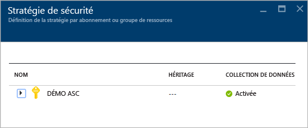
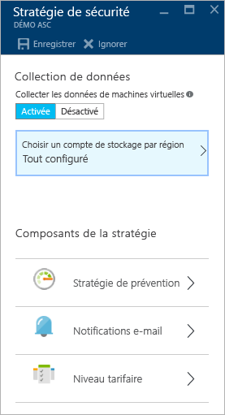
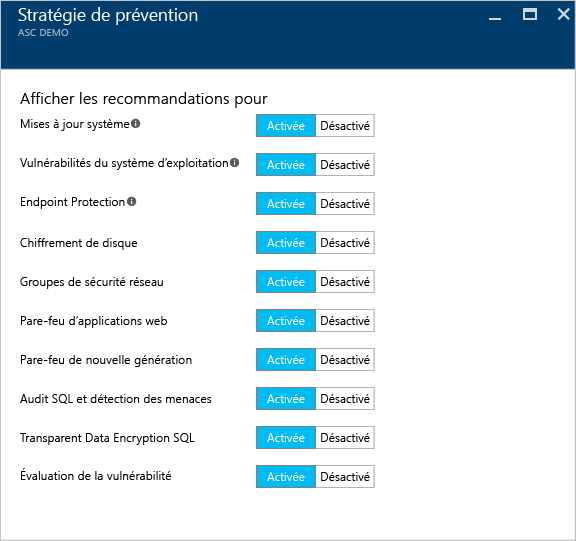
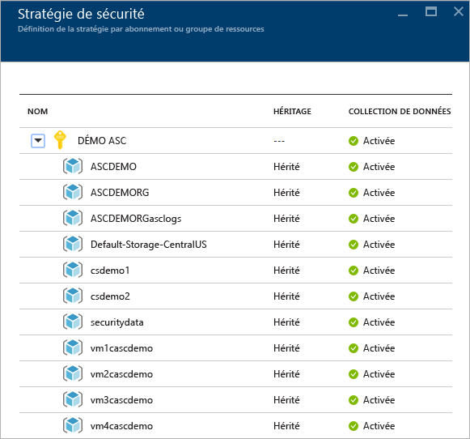
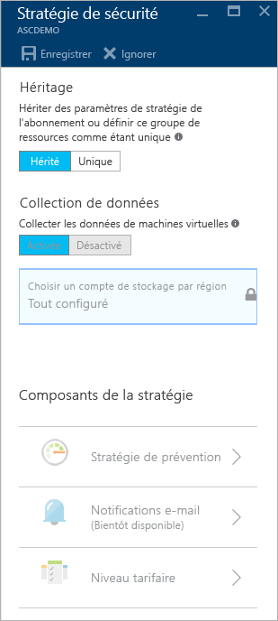

<properties
   pageTitle="Définir des stratégies de sécurité dans Azure Security Center | Microsoft Azure"
   description="Ce document est conçu pour vous aider à configurer des stratégies de sécurité dans le Centre de sécurité Azure."
   services="security-center"
   documentationCenter="na"
   authors="YuriDio"
   manager="swadhwa"
   editor=""/>

<tags
   ms.service="security-center"
   ms.devlang="na"
   ms.topic="hero-article"
   ms.tgt_pltfrm="na"
   ms.workload="na"
   ms.date="09/22/2016"
   ms.author="yurid"/>

# Définir des stratégies de sécurité dans Azure Security Center
Ce document est conçu pour vous aider à configurer des stratégies de sécurité dans le Centre de sécurité en vous guidant tout au long des étapes nécessaires à l’exécution de cette tâche.

## Que sont les stratégies de sécurité ?
Une stratégie de sécurité définit l’ensemble des contrôles recommandés pour les ressources d’un abonnement ou groupe de ressources spécifique. Dans le Centre de sécurité, vous devez définir des stratégies pour vos abonnements ou groupes de ressources Azure en fonction des exigences de sécurité de votre société et du type d’applications ou du niveau de confidentialité des données de chaque abonnement.

Par exemple, les ressources utilisées pour le développement ou le test peuvent avoir des exigences de sécurité différentes de celles utilisées pour les applications de production. De même, les applications qui utilisent des données réglementées, telles que des informations d’identification personnelle, peuvent nécessiter un niveau de sécurité plus élevé. Les stratégies de sécurité activées dans Azure Security Center déterminent les recommandations de sécurité et la surveillance qui vous aident à identifier les vulnérabilités potentielles et à éliminer les menaces. Pour plus d’informations sur le choix de l’option adaptée à votre situation, consultez le [Guide des opérations et de planification d’Azure Security Center](security-center-planning-and-operations-guide.md).

## Définir des stratégies de sécurité pour des abonnements

Vous pouvez configurer des stratégies de sécurité pour chaque abonnement ou groupe de ressources. Pour modifier une stratégie de sécurité, vous devez avoir le rôle de propriétaire ou de collaborateur pour l’abonnement concerné. Connectez-vous au portail Azure et suivez les étapes ci-dessous pour configurer des stratégies de sécurité dans Security Center :

1. Cliquez sur la mosaïque **Stratégie** dans le tableau de bord du Centre de sécurité.

2. Dans le panneau **Stratégie de sécurité – Définir une stratégie par abonnement ou par groupe de ressources** qui s’ouvre, sélectionnez l’abonnement pour lequel vous voulez activer la stratégie de sécurité. Si vous préférez activer la stratégie de sécurité pour un groupe de ressources et non pour l’ensemble de l’abonnement, passez à la section suivante, qui porte sur la configuration de stratégies de sécurité pour des groupes de ressources.

    

3. Le panneau **Stratégie de sécurité** de l’abonnement sélectionné s’ouvre avec des options similaires à celles de la capture d’écran suivante :

    

	Les options disponibles dans ce panneau sont :
	- **Stratégie de prévention** : utilisez cette option pour configurer des stratégies par abonnement ou par groupe de ressources.
	- **Notification par e-mail** : utilisez cette option pour configurer une notification par e-mail qui est envoyée à la première occurrence quotidienne d’une alerte et pour les alertes de gravité élevée. Les préférences de courrier électronique peuvent être configurées uniquement pour les stratégies d’abonnement. Pour plus d’informations sur la configuration d’une notification par e-mail, consultez [Fournir les détails du contact de sécurité dans Azure Security Center](security-center-provide-security-contact-details.md).
	- **Niveau tarifaire** : utilisez cette option pour mettre à niveau l’option de niveau tarifaire. Pour plus d’informations sur les options de tarification, consultez la page [Azure Security Center](https://azure.microsoft.com/pricing/details/security-center/).

4.  Vérifiez que l’option **Collecter des données à partir des machines virtuelles** est définie sur **Activé**. Cette option active la collecte automatique des journaux sur les ressources existantes et nouvelles.

    >[AZURE.NOTE] Nous vous recommandons d’activer la collecte des données pour chacun de vos abonnements afin de vous assurer que la surveillance de la sécurité est disponible pour toutes les machines virtuelles (nouvelles et existantes). L’activation de la collecte des données installe l’agent de surveillance. Si vous ne voulez pas activer la collecte des données depuis cet emplacement, vous pourrez le faire ultérieurement dans les panneaux **Intégrité** et **Recommandations**. Vous pouvez également activer la collecte des données pour l’abonnement uniquement ou pour certaines machines virtuelles. Pour plus d’informations sur les machines virtuelles prises en charge, consultez [FAQ du Centre de sécurité Azure](security-center-faq.md).

5. Si votre compte de stockage n’est pas encore configuré, un avertissement similaire à celui de la capture d’écran suivante peut s’afficher lors de l’ouverture du panneau **Stratégie de sécurité** :

    

6. Si cet avertissement s’affiche, cliquez sur cette option, puis sélectionnez la région, comme illustré dans la capture d’écran suivante :

    

7. Pour chaque région où s’exécutent des machines virtuelles, choisissez le compte de stockage où doivent être stockées les données collectées à partir de ces machines virtuelles. Vous pouvez ainsi stocker facilement les données dans une même région pour garantir la confidentialité et la souveraineté des données. Une fois que vous avez décidé de la région à utiliser, sélectionnez-la, puis sélectionnez le compte de stockage.

8. Dans le panneau **Choisir des comptes de stockage**, cliquez sur **OK**.

    > [AZURE.NOTE] Si vous préférez, vous pouvez agréger les données de machines virtuelles appartenant à des régions différentes dans un compte de stockage central. Pour plus d’informations, consultez [FAQ du Centre de sécurité Azure](security-center-faq.md).

9. Dans le panneau **Stratégie de sécurité**, cliquez sur **Activé** pour activer les recommandations de sécurité que vous voulez utiliser pour cet abonnement. Cliquez sur **Stratégie de prévention** pour afficher des options similaires à celles de la capture d’écran suivante :

	

Le tableau ci-dessous explique à quoi sert chaque option :

| Stratégie | Lorsque l’option est activée |
|----- |-----|
| Mises à jour système | Une liste quotidienne des mises à jour de sécurité et critiques disponibles est récupérée à partir de Windows Update ou de Windows Server Update Services. La liste récupérée dépend du service configuré pour cette machine virtuelle et recommande d’appliquer les mises à jour manquantes. Pour les systèmes Linux, la stratégie utilise le système de gestion des packages fournis par un distributeur afin de déterminer pour quels packages des mises à jour sont disponibles. Elle vérifie également la disponibilité des mises à jour de sécurité et critiques à partir des machines virtuelles [Azure Cloud Services](./cloud-services/cloud-services-how-to-configure.md). |
| Vulnérabilités du système d’exploitation | Analyse les configurations de système d’exploitation tous les jours afin d’identifier les problèmes susceptibles de rendre la machine virtuelle vulnérable aux attaques. Cette stratégie recommande également des modifications de configuration pour résoudre ces vulnérabilités. Pour plus d’informations sur les configurations spécifiques surveillées, consultez la [liste des règles de base recommandées](https://gallery.technet.microsoft.com/Azure-Security-Center-a789e335). |
| Protection du point de terminaison | Recommande l’approvisionnement d’Endpoint Protection pour toutes les machines virtuelles Windows afin d’identifier et de supprimer les virus, les logiciels espions et autres logiciels malveillants.|
| Chiffrement de disque | Recommande d’activer le chiffrement de disque dans toutes les machines virtuelles pour améliorer la protection des données au repos.
| groupes de sécurité réseau ; | Recommande la configuration de [Groupes de sécurité réseau](../virtual-network/virtual-networks-nsg.md) pour contrôler le trafic entrant et sortant vers les machines virtuelles dotées de points de terminaison publics. Les groupes de sécurité réseau configurés pour un sous-réseau sont hérités par toutes les interfaces réseau de machine virtuelle, sauf indication contraire. En plus de vérifier qu’un groupe de sécurité réseau a été configuré, cette stratégie évalue les règles de sécurité de trafic entrant afin d’identifier les règles autorisant le trafic entrant. |
| Pare-feu d’application web | Recommande l’approvisionnement d’un pare-feu d’applications web sur les machines virtuelles lorsque l’une des conditions suivantes est remplie :  Une [adresse IP publique de niveau d’instance](../virtual-network/virtual-networks-instance-level-public-ip.md) (ILPIP) est utilisée et les règles de sécurité de trafic entrant du groupe de sécurité réseau associé sont configurées pour autoriser l’accès au port 80 ou 443.  Une adresse IP à équilibrage de charge est utilisée et les règles associées d’équilibrage de charge et NAT (Network Access Translation) de trafic entrant sont configurées pour autoriser l’accès au port 80 ou 443. Pour plus d’informations, consultez [Prise en charge d’un équilibrage de charge par Azure Resource Manager](../load-balancer/load-balancer-arm.md). |
| Pare-feu de nouvelle génération | Étend les protections du réseau au-delà des groupes de sécurité réseau intégrés à Azure. Security Center détecte les déploiements pour lesquels un pare-feu de nouvelle génération est recommandé et vous permet d’approvisionner une appliance virtuelle. |
| Audit SQL et détection des menaces | Recommande l’activation de l’audit de l’accès à Azure SQL Database à des fins de conformité, mais également de détection avancée des menaces et d’examen. |
| Chiffrement transparent des données SQL | Recommande l’activation du chiffrement au repos pour votre base de données Azure SQL Database, ainsi que pour les sauvegardes associées et les fichiers journaux de transaction. Même si vos données font l’objet d’une violation de sécurité, elles ne seront pas lisibles. |
| Évaluation des vulnérabilités | Recommande d’installer une solution d’évaluation des vulnérabilités sur votre machine virtuelle. |

Après avoir configuré toutes les options, cliquez sur **OK** dans le panneau **Stratégie de sécurité** contenant les recommandations, puis cliquez sur **Enregistrer** dans le panneau **Stratégie de sécurité** contenant les paramètres initiaux.

## Définir des stratégies de sécurité pour des groupes de ressources

Si vous préférez configurer vos stratégies de sécurité par groupe de ressources, la procédure est similaire à celle suivie pour configurer des stratégies de sécurité pour des abonnements. La principale différence réside dans le fait que vous devez développer le nom d’abonnement et sélectionner le groupe de ressources de votre choix pour configurer la stratégie de sécurité spécifique :

Une fois le groupe de ressources sélectionné, le panneau **Stratégie de sécurité** s’ouvre. L’option **Héritage** est activée par défaut. Cela signifie que toutes les stratégies de sécurité associées à ce groupe de ressources sont héritées de l’abonnement. Vous pouvez modifier cette configuration si vous souhaitez appliquer une stratégie de sécurité personnalisée à un groupe de ressources. Si tel est le cas, vous devez sélectionner l’option **Unique** et apporter vos modifications sous **Stratégie de prévention**.

> [AZURE.NOTE] En cas de conflit entre la stratégie de l’abonnement et celle du groupe de ressources, la stratégie du groupe de ressources est prioritaire.

## Voir aussi

Dans ce document, vous avez appris à configurer des stratégies de sécurité dans le Centre de sécurité Azure. Pour plus d’informations sur le Centre de sécurité Azure, consultez les rubriques suivantes :

- [Guide des opérations et de planification d’Azure Security Center](security-center-planning-and-operations-guide.md) : découvrez comment planifier l’adoption d’Azure Security Center et prenez connaissance des considérations relatives à la conception.
- [Surveillance de l’intégrité de la sécurité dans Azure Security Center](security-center-monitoring.md) : découvrez comment surveiller l’intégrité de vos ressources Azure.
- [Gestion et résolution des alertes de sécurité dans Azure Security Center](security-center-managing-and-responding-alerts.md) : découvrez comment gérer et résoudre les alertes de sécurité.
- [Surveillance des solutions de partenaire avec Azure Security Center](security-center-partner-solutions.md) : découvrez comment surveiller l’état d’intégrité de vos solutions de partenaire.
- [FAQ d’Azure Security Center](security-center-faq.md) : forum aux questions concernant l’utilisation de ce service.
- [Blog sur la sécurité Azure](http://blogs.msdn.com/b/azuresecurity/) : accédez à des billets de blog sur la sécurité et la conformité Azure.

<!---HONumber=AcomDC_0928_2016-->