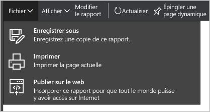

<properties
   pageTitle="Obtenir des informations à partir des données du Centre de sécurité Azure à l’aide de Power BI| Microsoft Azure"
   description="Le pack de contenu Power BI du Centre de sécurité Azure vous permet non seulement d’accéder en toute simplicité à des alertes et recommandations de sécurité, mais également d’identifier les tendances ainsi que les ressources ciblées à partir d’un jeu de données spécialement compilées pour vos rapports."
   services="security-center"
   documentationCenter="na"
   authors="YuriDio"
   manager="swadhwa"
   editor=""/>

<tags
   ms.service="security-center"
   ms.devlang="na"
   ms.topic="hero-article"
   ms.tgt_pltfrm="na"
   ms.workload="na"
   ms.date="02/25/2016"
   ms.author="yurid"/>

# Obtenir des informations à partir des données du Centre de sécurité Azure à l’aide de Power BI
Le [tableau de bord Power BI](http://aka.ms/azure-security-center-power-bi) du Centre de sécurité Azure vous permet de visualiser, analyser et filtrer des recommandations ainsi que des alertes de sécurité depuis n’importe quelle plate-forme, y compris un appareil mobile. Vous pouvez utiliser cet outil pour identifier les tendances et schémas d’attaque, avec la possibilité d’afficher des alertes de sécurité par ressource ou par adresse IP source, mais également visualiser par ressource ou par âge les risques de sécurité qui n’ont pas fait l’objet d’un correctif. Vous pouvez par ailleurs combiner de diverses manières les recommandations et alertes de sécurité du Centre de sécurité avec d’autres données, par exemple avec les [journaux d’audit Azure](https://powerbi.microsoft.com/blog/monitor-azure-audit-logs-with-power-bi/) et la fonction d’[audit de base de données SQL Azure](https://powerbi.microsoft.com/blog/monitor-your-azure-sql-database-auditing-activity-with-power-bi/), qui intègrent des tableaux de bord Power BI ; vous avez également la possibilité d’exporter ces données vers Excel afin de générer facilement des rapports sur l’état de sécurité de vos ressources cloud.

> [AZURE.NOTE] Les informations contenues dans ce document s’appliquent à la version préliminaire du Centre de sécurité Azure.

## Explorer les données du Centre de sécurité Azure à l’aide des services Power BI
Dans Power BI, connectez-vous au [pack de contenu du Centre de sécurité Azure](https://app.powerbi.com/groups/me/getdata/services/azure-security-center) et suivez les étapes ci-dessous :

1\. Cliquez sur **Connexion** dans la mosaïque du Centre de sécurité Azure pour continuer.

2\. La fenêtre **Se connecter au Centre de sécurité Azure** s’ouvre. Dans le champ **ID d’abonnement Azure**, indiquez votre abonnement Azure, puis cliquez sur **Suivant**.

3\. Dans la liste déroulante **Méthode d’authentification**, sélectionnez **oAuth2** et cliquez sur **Se connecter**.

4\. Vous êtes redirigé vers une page d’authentification dans laquelle vous devez saisir les informations d’identification que vous utilisez pour vous connecter au Centre de sécurité Azure. Une fois le processus d’authentification effectué, Power BI commence à importer les données qui serviront de base à la génération de vos rapports. Il est possible que le message suivant s’affiche entre-temps à droite de votre navigateur :

5\. Une fois le processus terminé, les rapports suivants sont chargés dans votre tableau de bord Power BI du Centre de sécurité Azure :

Vous pouvez voir instantanément le nombre d’alertes et de recommandations de sécurité, ainsi que le nombre de machines virtuelles, de bases de données SQL Azure et de ressources réseau surveillés par le Centre de sécurité Azure.

Un lien vers le Centre de sécurité Azure vous redirige vers le portail Azure. Les graphiques vous permettent de visualiser facilement les informations relatives aux recommandations et alertes de sécurité, notamment :

- Intégrité de la sécurité des ressources
- Recommandations globales en attente
- Recommandations pour les machines virtuelles
- Nombre d’alertes dans le temps
- Ressources ciblées par des attaques
- Adresses IP ciblées par des attaques

Chaque graphique recèle des informations supplémentaires. Il vous suffit de sélectionner une mosaïque pour afficher d’autres informations. Par exemple, la mosaïque Intégrité de la sécurité des ressources affiche des détails supplémentaires sur les recommandations en attente selon les ressources, comme indiqué ci-dessous :

Si vous cliquez sur une ligne de ce graphique, les autres lignes apparaissent en grisé afin que vous puissiez vous concentrer uniquement sur celle que vous avez sélectionnée. Pour revenir au tableau de bord, cliquez sur **Centre de sécurité Azure** sous l’option **Tableaux de bord** dans le volet gauche de cette page.

> [AZURE.NOTE] Si vous souhaitez personnaliser vos rapports, vous avez la possibilité de les modifier en y ajoutant des champs supplémentaires ou en adaptant les éléments visuels existants. Pour plus d’informations, consultez la page [Interagir avec un rapport en mode Édition dans Power BI](https://powerbi.microsoft.com/documentation/powerbi-service-interact-with-a-report-in-editing-view/).

Les mosaïques **Nombre d’alertes dans le temps**, **Ressources ciblées par des attaques** et **Adresses IP ciblées par des attaques** affichent des informations similaires lorsque vous les sélectionnez. Le rapport regroupe en effet toutes les informations relatives à ces trois variables sur une même page intitulée **Ressources visées** comme indiqué ci-dessous :

À ce stade, vous pouvez également enregistrer une copie de ce rapport, l’imprimer ou encore le publier sur le web à l’aide des options disponibles dans le menu **Fichier**.

##Accéder à Power BI à l’aide du tableau de bord du Centre de sécurité Azure
Vous pouvez également utiliser le tableau de bord du Centre de sécurité Azure pour accéder aux rapports Power BI. Pour ce faire, procédez comme suit :

1\. Dans le tableau de bord du **Centre de sécurité Azure**, cliquez sur le bouton **Explorer dans Power BI**.

2\. Le volet **Explorer dans Power BI** s’ouvre à droite de l’écran, comme indiqué ci-dessous :

3\. Dans la liste déroulante, **Choisir un abonnement à explorer dans Power BI**, sélectionnez l’abonnement que vous souhaitez utiliser.

4\. Dans le champ **Copier l’ID d’abonnement**, cliquez sur le bouton de copie. 5. Cliquez sur le bouton **Accéder à Power BI**. 6. La fenêtre **Se connecter au Centre de sécurité Azure** s’ouvre. Dans le champ **ID d’abonnement Azure**, indiquez votre abonnement Azure, puis cliquez sur **Suivant**.

7\. Dans la liste déroulante **Méthode d’authentification**, sélectionnez **oAuth2** et cliquez sur **Se connecter**.

8\. Vous êtes redirigé vers une page d’authentification dans laquelle vous devez saisir les informations d’identification que vous utilisez pour vous connecter au Centre de sécurité Azure. Une fois le processus d’authentification effectué, Power BI commence à importer les données qui serviront de base à la génération de vos rapports.

## Étapes suivantes
Dans ce document, vous avez vu comment utiliser le service Power BI depuis le Centre de sécurité Azure. Pour plus d’informations sur le Centre de sécurité Azure, consultez les rubriques suivantes :

- [Définition des stratégies de sécurité dans le Centre de sécurité Azure](security-center-policies.md) – Découvrez comment configurer des paramètres de sécurité dans le Centre de sécurité Azure
- [Gestion et résolution des alertes de sécurité dans le Centre de sécurité Azure](security-center-managing-and-responding-alerts.md) – Découvrez comment gérer et résoudre les alertes de sécurité
- [FAQ du Centre de sécurité Azure](security-center-faq.md) – Forum Aux Questions concernant l’utilisation de ce service
- [Blog sur la sécurité Azure](http://blogs.msdn.com/b/azuresecurity/) : recherchez des billets de blog sur la sécurité et la conformité Azure

<!---HONumber=AcomDC_0302_2016-->