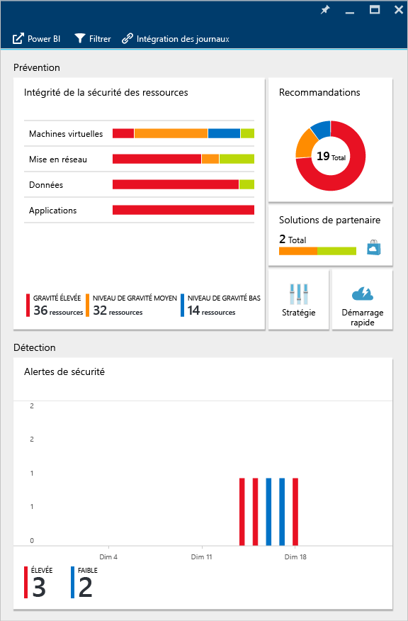
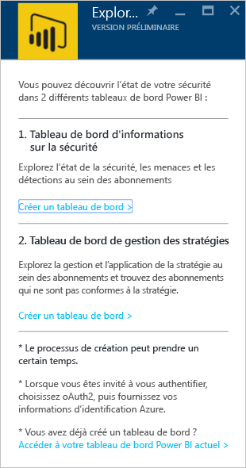
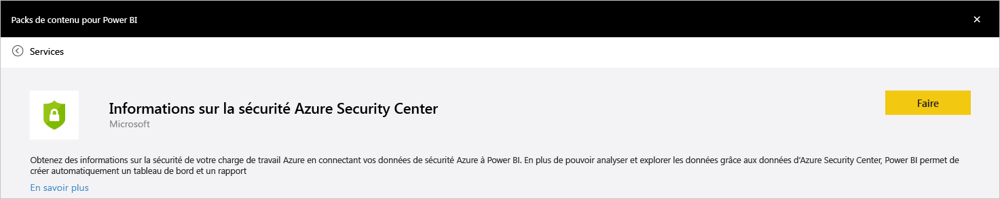
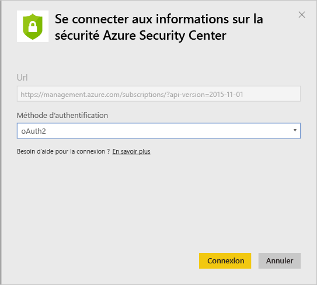
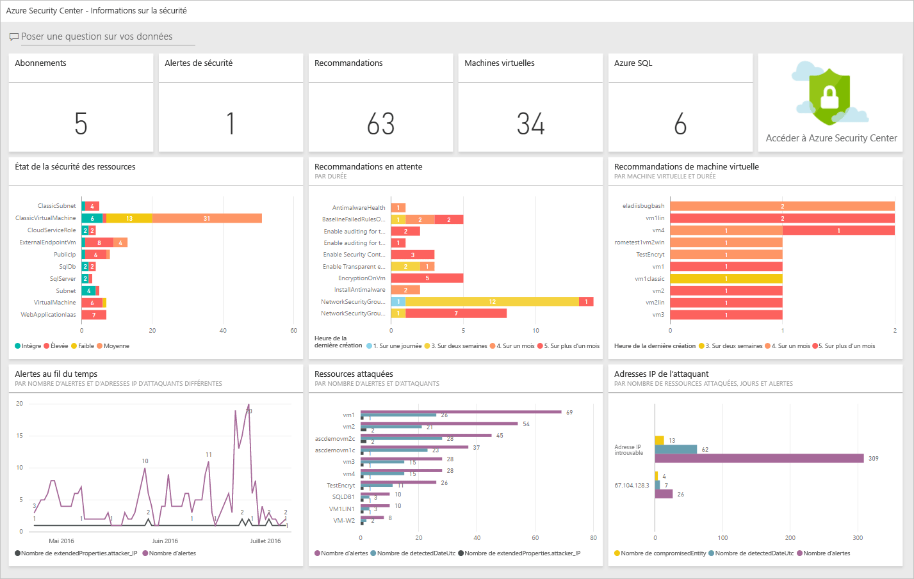
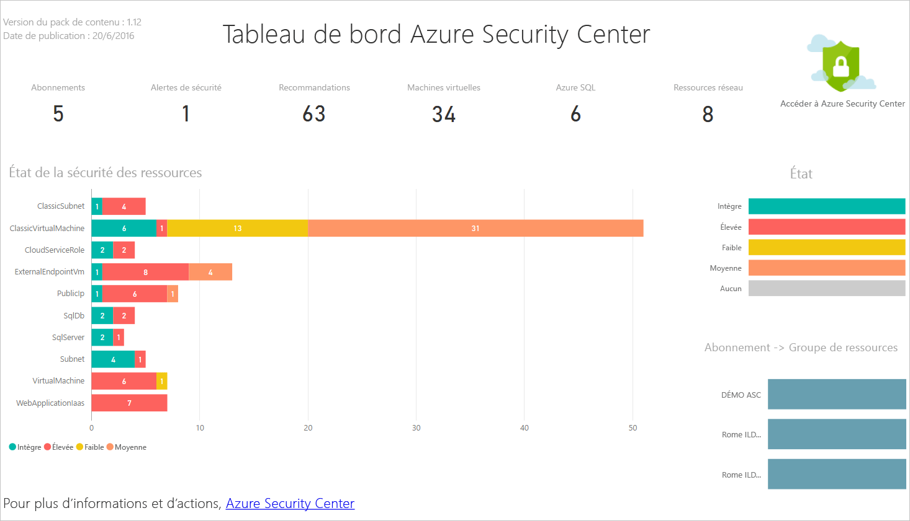
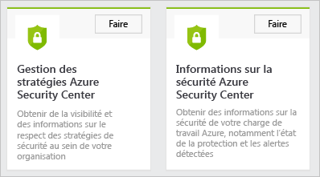
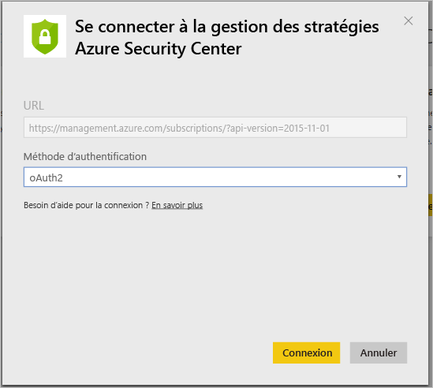
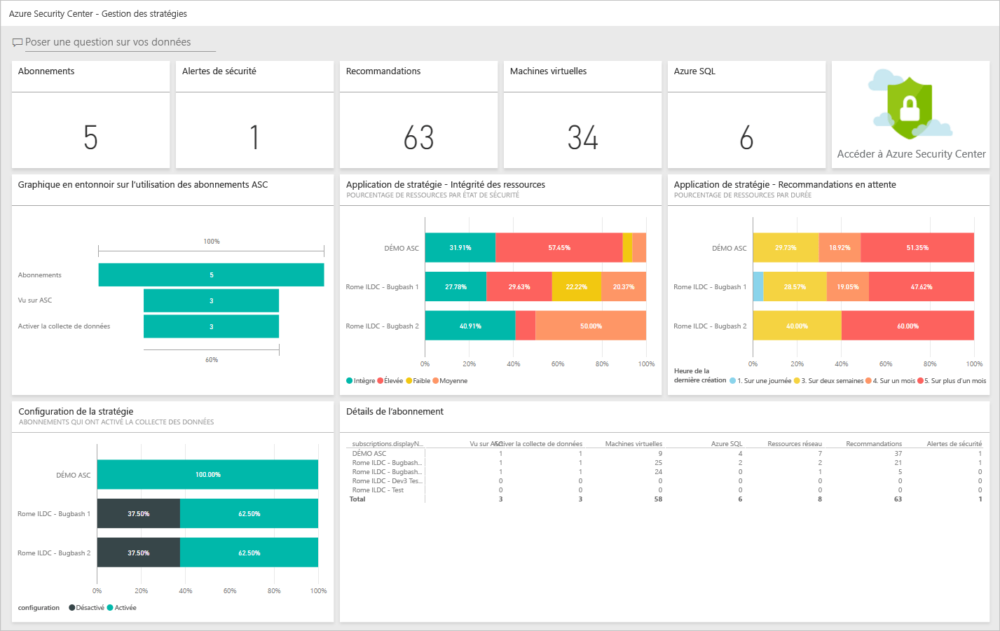

# Obtenir des informations à partir des données du Centre de sécurité Azure à l’aide de Power BI
Le [tableau de bord Power BI](http://aka.ms/azure-security-center-power-bi) du Centre de sécurité Azure vous permet de visualiser, analyser et filtrer des recommandations ainsi que des alertes de sécurité depuis n’importe quelle plate-forme, y compris un appareil mobile. Vous pouvez utiliser cet outil pour identifier les tendances et schémas d’attaque, avec la possibilité d’afficher des alertes de sécurité par ressource ou par adresse IP source, mais également visualiser par ressource ou par âge les risques de sécurité qui n’ont pas fait l’objet d’un correctif. 

Vous pouvez par ailleurs combiner de diverses manières les recommandations et alertes de sécurité d’Azure Security Center avec d’autres données, en utilisant , par exemple, les données des [journaux d’audit Azure](https://powerbi.microsoft.com/blog/monitor-azure-audit-logs-with-power-bi/) et [d’audit Azure SQL Database](https://powerbi.microsoft.com/blog/monitor-your-azure-sql-database-auditing-activity-with-power-bi/). Ils intègrent tous les deux des tableaux de bord Power BI et vous avez également la possibilité d’exporter ces données vers Excel afin de générer facilement des rapports sur l’état de sécurité de vos ressources cloud.

## Accéder à Power BI à l’aide du tableau de bord du Centre de sécurité Azure
Vous pouvez également utiliser le tableau de bord du Centre de sécurité Azure pour accéder aux rapports Power BI. Pour ce faire, procédez comme suit : 

1. Dans le tableau de bord **d’Azure Security Center**, cliquez sur le bouton **Explorer dans Power BI**.
   
     
2. Le panneau **Explorer dans Power BI** s’ouvre sur la droite, comme illustré dans l’écran suivant :
   
    
3. Si vous créez le tableau de bord Power BI pour la première fois, vous pouvez choisir l’une des options ci-après dans le panneau dans le panneau **Explore dans Power BI** : 
   
   * **Tableau de bord des informations de sécurité**: choisissez cette option si vous voulez créer un tableau de bord qui inclut l’état de la sécurité, les threads et les détections. Il s’agit d’une option plus courante pour le rôle DevOps responsable de l’analyse de l’état de protection et de la détection des alertes sur les différents abonnements.
   * **Tableau de bord de gestion des stratégies**: choisissez cette option si vous voulez explorer les stratégies de gestion et d’application.  Il s’agit d’une option plus courante pour l’équipe informatique centrale qui est davantage axée sur la gouvernance. L’équipe peut utiliser ce tableau de bord pour améliorer la visibilité et obtenir des informations sur l’adhésion aux stratégies de sécurité au sein de leur organisation.
   * Si vous disposez déjà d’un tableau de bord Power BI, cliquez sur **Go to your current Power BI dashboard**(Accéder au tableau de bord Power BI en cours).
4. Pour les besoins de cet exemple, cliquez sur l’option **Tableau de bord des informations de sécurité** . Si c’est la première fois que vous créez un tableau de bord Power BI pour Azure Security Center, vous êtes invité à installer le pack de contenu. Cliquez sur le bouton **Obtenir** situé dans la fenêtre **Packs de contenu pour Power BI** comme illustré dans l’écran suivant :
   
    
5. La fenêtre **Se connecter aux informations de sécurité Azure Security Center** s’affiche. Vérifiez que la méthode **d’authentification** est **oAuth2** comme indiqué ci-dessous et cliquez sur le bouton **Se connecter**.
   
    
6. Vous pouvez être invité à vous authentifier de nouveau à l’aide de vos informations d’identification Azure. Une fois l’authentification effectuée, votre tableau de bord est créé. Une fois le tableau de bord créé, un rapport ayant une structure similaire à celle illustrée dans l’écran ci-après s’affiche :
   
    

> [!NOTE]
> Une actualisation quotidienne du rapport est planifiée. Si vous rencontrez des problèmes liés à cette actualisation, lisez l’article [Problèmes potentiels d’actualisation avec Azure Security Center Power BI](https://blogs.msdn.microsoft.com/azuresecurity/2016/04/07/azure-security-center-power-bi-refresh-fails/)pour plus d’informations sur la manière de les résoudre.
> 
> 

Vous pouvez voir ici le nombre d’alertes et de recommandations de sécurité, ainsi que le nombre de machines virtuelles, de bases de données Azure SQL Database et de ressources réseau surveillées par le Centre de sécurité Azure.

Un lien vers le Centre de sécurité Azure vous redirige vers le portail Azure. Les graphiques vous permettent de visualiser facilement les informations relatives aux recommandations et alertes de sécurité, notamment :

* État de sécurité des ressources
* Recommandations en attente
* Recommandations pour les machines virtuelles
* Nombre d’alertes dans le temps
* Ressources ciblées par des attaques
* Adresses IP ciblées par des attaques

Chaque graphique recèle des informations supplémentaires. Sélectionnez une mosaïque pour afficher d’autres informations. Par exemple, la mosaïque **État de sécurité des ressources** affiche des détails supplémentaires sur les recommandations en attente selon les ressources, comme illustré dans l’écran suivant :

Si vous cliquez sur une ligne de ce graphique, les autres lignes apparaissent en grisé afin que vous puissiez vous concentrer uniquement sur celle que vous avez sélectionnée. Pour revenir au tableau de bord, cliquez sur **Azure Security Center** sous l’option **Tableaux de bord** dans le volet gauche de cette page.

> [!NOTE]
> Si vous souhaitez personnaliser vos rapports, vous avez la possibilité de les modifier en y ajoutant des champs supplémentaires ou en adaptant les éléments visuels existants. Pour plus d’informations, consultez la page [Interagir avec un rapport en mode Édition dans Power BI](https://powerbi.microsoft.com/documentation/powerbi-service-interact-with-a-report-in-editing-view/) .
> 
> 

Les mosaïques **Nombre d’alertes dans le temps, Ressources ciblées par des attaques** et **Adresses IP ciblées par des attaques** affichent des informations similaires quand vous les sélectionnez. Le rapport regroupe en effet toutes les informations relatives à ces trois variables sur une même page intitulée **Ressources visées** comme illustré dans l’écran suivant :

À ce stade, vous pouvez également enregistrer une copie de ce rapport, l’imprimer ou encore le publier sur le web à l’aide des options disponibles dans le menu **Fichier** .

## Explorer les données du Centre de sécurité Azure à l’aide des services Power BI
Dans Power BI, connectez-vous au [Power BI Content Pack Services](https://msit.powerbi.com/groups/me/getdata/services) (Services du pack de contenu Power BI) et exécutez les étapes suivantes :

1. Dans la fenêtre **Pack de contenu pour Power BI** , les deux options illustrées ci-dessous s’affichent.
   
    
   
   > [!NOTE]
   > Si vous avez déjà exécuté la première partie de cet article, vous ne verrez qu’une seule option, à savoir la gestion des stratégies Azure Security Center.
   > 
   > 
2. Pour les besoins de cet exemple, cliquez sur **Get** (Obtenir) dans la mosaïque **Azure Security Center Policy Management** (Gestion des stratégies Azure Security Center).
3. Dans la fenêtre **Connect to Azure Security Center Policy Management** (Se connecter à la gestion des stratégies Azure Security Center), vérifiez que vous sélectionner **oAuth2** dans la liste déroulante **Authentication Method** (Méthode d’authentification) comme illustré ci-dessous et cliquez sur le bouton **Sign in** (Se connecter).
   
    
4. Vous êtes redirigé vers une page d’authentification dans laquelle vous devez saisir les informations d’identification que vous utilisez pour vous connecter au Centre de sécurité Azure. Une fois le processus d’authentification terminé, Power BI commence à importer les données qui serviront de base à la génération de vos rapports. Il est possible que le message suivant s’affiche entre-temps à droite de votre navigateur :
   
    
   
   > [!NOTE]
   > Lorsque le tableau de bord est créé pour la première fois, cela peut prendre plus de temps, surtout dans les scénarios à abonnements multiples. 
   > 
   > 
5. Une fois le processus terminé, le tableau de bord Power BI d’Azure Security Center est chargé avec un rapport **Gestion des stratégies** ressemblant à celui illustré ci-dessous :
   
    

## Voir aussi
Dans ce document, vous avez vu comment utiliser le service Power BI depuis le Centre de sécurité Azure. Pour plus d’informations sur le Centre de sécurité Azure, consultez les rubriques suivantes :

* [Guide des opérations et de planification d’Azure Security Center](security-center-planning-and-operations-guide.md) : découvrez comment planifier l’adoption d’Azure Security Center.
* [Définition des stratégies de sécurité dans Azure Security Center](security-center-policies.md) : découvrez comment configurer des paramètres de sécurité dans Azure Security Center
* [Gestion et résolution des alertes de sécurité dans Azure Security Center](security-center-managing-and-responding-alerts.md) : découvrez comment gérer et résoudre les alertes de sécurité
* [FAQ d’Azure Security Center](security-center-faq.md) : découvrez les réponses aux questions les plus souvent posées à propos de l’utilisation de ce service
* [Blog sur la sécurité Azure](http://blogs.msdn.com/b/azuresecurity/) : accédez à des billets de blog sur la sécurité et la conformité Azure.

<!--HONumber=Dec16_HO2-->

