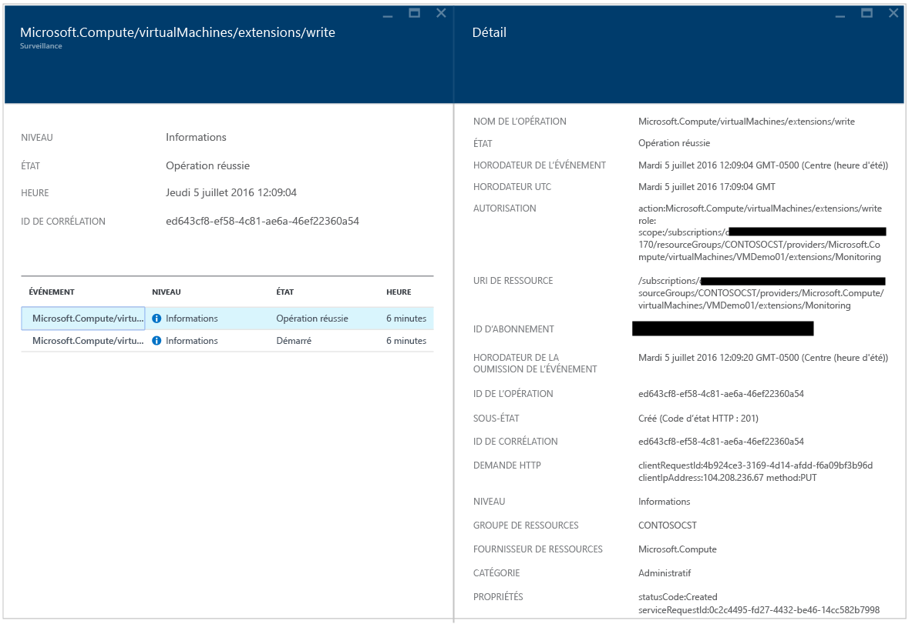

<properties
   pageTitle="Guide de résolution des problèmes d’Azure Security Center | Microsoft Azure"
   description="Ce document vous aide à résoudre les problèmes dans Azure Security Center."
   services="security-center"
   documentationCenter="na"
   authors="YuriDio"
   manager="swadhwa"
   editor=""/>

<tags
   ms.service="security-center"
   ms.devlang="na"
   ms.topic="hero-article"
   ms.tgt_pltfrm="na"
   ms.workload="na"
   ms.date="07/21/2016"
   ms.author="yurid"/>

# Guide de résolution des problèmes d’Azure Security Center
Ce guide s’adresse aux informaticiens professionnels, aux analystes de la sécurité des informations et aux administrateurs de cloud dont les entreprises utilisent Azure Security Center et qui doivent résoudre des problèmes liés au Centre de sécurité.

## Guide de résolution des problèmes
Ce guide explique comment résoudre les problèmes liés au Centre de sécurité. Vous pouvez résoudre la majorité des problèmes rencontrés dans le Centre de sécurité en commençant par examiner les enregistrements du [journal d’audit](https://azure.microsoft.com/updates/audit-logs-in-azure-preview-portal/) pour le composant en échec. Les journaux d’audit vous permettent de déterminer :

- Les opérations ayant eu lieu.
- Qui a initié l’opération.
- Le moment où a eu lieu l’opération.
- L’état de l’opération.
- Les valeurs d’autres propriétés qui peuvent vous aider à effectuer des recherches sur l’opération.

Le journal d’audit contient toutes les opérations d’écriture (PUT, POST, DELETE) effectuées sur vos ressources, mais n’inclut pas les opérations de lecture (GET).

## Résolution des problèmes d’installation de l’agent de surveillance dans Windows

L’agent de surveillance d’Azure Security Center est utilisé pour effectuer la collecte de données. Une fois la collecte des données activée et l’agent installé correctement sur l’ordinateur cible, les processus suivants doivent être en cours d’exécution :

- ASMAgentLauncher.exe - Agent de surveillance Azure
- ASMMonitoringAgent.exe - Extension de l’agent de surveillance Azure
- ASMSoftwareScanner.exe - Gestionnaire d’analyse Azure

L’extension Surveillance de la sécurité Azure analyse diverses configurations de sécurité et collecte les journaux de sécurité de la machine virtuelle. Le gestionnaire d’analyse sera utilisé comme module de recherche de correctifs.

Si l’installation s’effectue correctement, vous devez voir une entrée similaire à celle ci-dessous dans les journaux d’audit pour la machine virtuelle cible :

Vous pouvez également obtenir plus d’informations sur le processus d’installation en consultant les journaux de l’agent, situés sous *%systemdrive%\\windowsazure\\logs* (exemple : C:\\WindowsAzure\\Logs).

> [AZURE.NOTE] Si l’agent Azure Security Center ne fonctionne pas correctement, vous devrez redémarrer la machine virtuelle cible, car il n’existe aucune commande pour arrêter et démarrer l’agent.

## Résolution des problèmes d’installation de l’agent de surveillance dans Linux
Lors de la résolution des problèmes d’installation de l’agent de machine virtuelle sur un système Linux, vous devez vous assurer que l’extension a été téléchargée sous /var/lib/waagent/. Vous pouvez exécuter la commande ci-dessous pour vérifier qu’elle a été installée :

`cat /var/log/waagent.log`

Les autres fichiers journaux que vous pouvez consulter pour résoudre les problèmes sont les suivants :

- /var/log/mdsd.err
- /var/log/azure/

Dans un système qui fonctionne, vous devez voir une connexion au processus mdsd sur TCP 29130. Il s’agit du journal système communiquant avec le processus mdsd. Vous pouvez vérifier ce comportement en exécutant la commande suivante :

`netstat -plantu | grep 29130`

## Contacter le support Microsoft

Vous pouvez identifier certains problèmes en suivant les recommandations fournies dans cet article, tandis que d’autres problèmes sont documentés dans le [Forum](https://social.msdn.microsoft.com/Forums/fr-FR/home?forum=AzureSecurityCenter) public d’Azure Security Center. Toutefois, si vous avez besoin d’informations supplémentaires en matière de résolution des problèmes, vous pouvez ouvrir une nouvelle demande de support à l’aide du portail Azure, comme indiqué ci-dessous :

## Voir aussi

Dans ce document, vous avez appris à configurer des stratégies de sécurité dans le Centre de sécurité Azure. Pour plus d’informations sur le Centre de sécurité Azure, consultez les rubriques suivantes :

- [Guide des opérations et de planification d’Azure Security Center](security-center-planning-and-operations-guide.md) : découvrez comment planifier l’adoption d’Azure Security Center et prenez connaissance des considérations relatives à la conception.
- [Surveillance de l’intégrité de la sécurité dans Azure Security Center](security-center-monitoring.md) : découvrez comment surveiller l’intégrité de vos ressources Azure.
- [Gestion et résolution des alertes de sécurité dans Azure Security Center](security-center-managing-and-responding-alerts.md) : découvrez comment gérer et résoudre les alertes de sécurité.
- [Surveillance des solutions de partenaire avec Azure Security Center](security-center-partner-solutions.md) : découvrez comment surveiller l’état d’intégrité de vos solutions de partenaire.
- [FAQ d’Azure Security Center](security-center-faq.md) : découvrez les réponses aux questions les plus souvent posées à propos de l’utilisation de ce service.
- [Blog sur la sécurité Azure](http://blogs.msdn.com/b/azuresecurity/) : accédez à des billets de blog sur la sécurité et la conformité Azure.

<!---HONumber=AcomDC_0803_2016-->