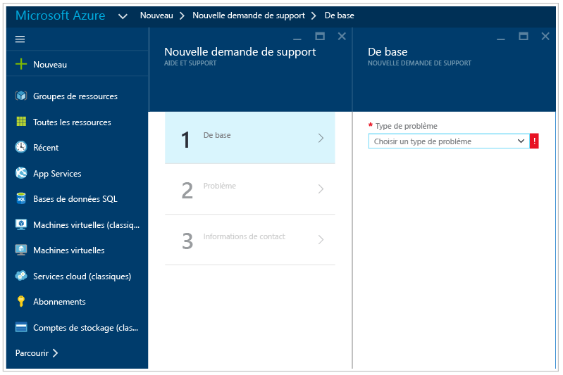

# Guide de résolution des problèmes d’Azure Security Center
Ce guide s’adresse aux informaticiens professionnels, aux analystes de la sécurité des informations et aux administrateurs de cloud dont les entreprises utilisent Azure Security Center et qui doivent résoudre des problèmes liés à ce service.

>[!NOTE] 
>À compter de début juin 2017, Security Center utilisera Microsoft Monitoring Agent pour collecter et stocker des données. Consultez [Azure Security Center Platform Migration](security-center-platform-migration.md) (Migration de la plateforme Azure Security Center) pour en savoir plus. Les informations contenues dans cet article représentent les fonctionnalités de Security Center après la transition vers Microsoft Monitoring Agent.
>

## Guide de résolution des problèmes
Ce guide explique comment résoudre les problèmes liés au Centre de sécurité. Vous pouvez résoudre la majorité des problèmes rencontrés dans Security Center, en commençant par examiner les enregistrements du [journal d’audit](https://azure.microsoft.com/updates/audit-logs-in-azure-preview-portal/) pour le composant en échec. Les journaux d’audit vous permettent de déterminer :

* Les opérations ayant eu lieu.
* Qui a initié l’opération.
* Le moment où a eu lieu l’opération.
* L’état de l’opération.
* Les valeurs d’autres propriétés qui peuvent vous aider à effectuer des recherches sur l’opération.

Le journal d’audit contient toutes les opérations d’écriture (PUT, POST, DELETE) effectuées sur vos ressources, mais n’inclut pas les opérations de lecture (GET).

## Microsoft Monitoring Agent
Security Center utilise Microsoft Monitoring Agent (le même agent que celui utilisé par Operations Management Suite et le service Log Analytics) pour collecter les données relatives à la sécurité sur vos machines virtuelles Azure. Une fois la collecte des données activée et l’agent installé correctement sur l’ordinateur cible, le processus suivant doit être en cours d’exécution :

* HealthService.exe

Si vous ouvrez la console de gestion des services (services.msc), vous verrez également le service Microsoft Monitoring Agent en cours d’exécution comme indiqué ci-dessous :

Pour vérifier votre version de l’agent, ouvrez le **Gestionnaire des tâches** et, dans l’onglet **Processus**, localisez le **service Microsoft Monitoring Agent**. Cliquez dessus avec le bouton droit de la souris, puis cliquez sur **Propriétés**. Dans l’onglet **Détails**, recherchez la version du fichier, comme indiqué ci-dessous :

   

## Scénarios d’installation de Microsoft Monitoring Agent
Il existe deux scénarios d’installation qui peuvent produire des résultats différents lors de l’installation de Microsoft Monitoring Agent sur votre ordinateur. Les scénarios pris en charge sont les suivants :

* **Agent installé automatiquement par Security Center** : dans ce scénario, vous serez en mesure d’afficher les alertes dans Security Center et dans la recherche de journal. Vous recevrez des notifications par courrier électronique à l’adresse de messagerie qui a été configurée dans la stratégie de sécurité associée à l’abonnement auquel la ressource appartient.
.
* **Agent installé manuellement sur une machine virtuelle dans Azure** : dans ce scénario, si vous utilisez des agents téléchargés et installés manuellement avant février 2017, vous ne pouvez afficher les alertes dans le portail Security Center que si vous filtrez sur l’abonnement auquel appartient l’espace de travail. Si vous filtrez sur l’abonnement auquel appartient la ressource, vous ne voyez pas les alertes. Vous recevrez des notifications par courrier électronique à l’adresse de messagerie qui a été configurée dans la stratégie de sécurité associée à l’abonnement auquel l’espace de travail appartient.

>[!NOTE]
> Pour éviter le comportement expliqué dans le second scénario, veillez à télécharger la dernière version de l’agent.
> 

## Résolution des problèmes de configuration réseau requise de l’agent de surveillance
Pour que les agents se connectent et s’inscrivent auprès de Security Center, ils doivent accéder aux ressources réseau, y compris les numéros de port et les URL de domaine.

- Pour les serveurs proxy, vous devez vous assurer que les ressources de serveur proxy appropriées sont configurées dans les paramètres de l’agent. Lisez cet article pour obtenir plus d’informations sur la façon de [modifier les paramètres proxy](https://docs.microsoft.com/en-us/azure/log-analytics/log-analytics-windows-agents#configure-proxy-settings).
- Si un pare-feu restreint l’accès à Internet, vous devez configurer votre pare-feu pour autoriser l’accès à OMS. Aucune action n’est nécessaire dans les paramètres de l’agent.

Le tableau suivant présente les ressources nécessaires pour la communication.

| Ressource de l'agent | Ports | Ignorer l’inspection HTTPS |
|---|---|---|
| *.ods.opinsights.azure.com | 443 | Oui |
| *.oms.opinsights.azure.com | 443 | Oui |
| *.blob.core.windows.net | 443 | Oui |
| *.azure-automation.net | 443 | Oui |

Si vous rencontrez des problèmes d’intégration avec l’agent, lisez l’article [Comment faire pour résoudre les problèmes d’intégration de Microsoft Operations Management Suite](https://support.microsoft.com/en-us/help/3126513/how-to-troubleshoot-operations-management-suite-onboarding-issues).

## Dépannage d’une protection du point de terminaison qui ne fonctionne pas correctement

L’agent invité représente le processus parent de toutes les actions effectuées par l’extension [Microsoft Antimalware](../security/azure-security-antimalware.md). Lorsque le processus de l’agent invité échoue, le programme Microsoft Antimalware exécuté comme un processus enfant de l’agent invité peut également échouer.  Dans les scénarios recommandés pour vérifier les options suivantes :

- Si la machine virtuelle cible est une image personnalisée et que le créateur de la machine virtuelle n’a jamais installé l’agent invité.
- Si la cible est une machine virtuelle Linux au lieu d’une machine virtuelle Windows, l’installation de la version Windows de l’extension anti-programme malveillant sur une machine virtuelle Linux échoue. L’agent invité Linux a des exigences spécifiques en termes de version du système d’exploitation et de packages requis, et si ces conditions ne sont pas remplies, l’agent de la machine virtuelle ne fonctionnera pas ici non plus. 
- Si la machine virtuelle a été créée avec une ancienne version de l’agent invité. Dans ce cas, notez que certains anciens agents ne pourront pas se mettre automatiquement à jour avec la version la plus récente, et cela peut entraîner ce problème. Utilisez toujours la dernière version de l’agent invité si vous créez vos propres images.
- Certains logiciels d’administration tiers peuvent désactiver l’agent invité ou bloquer l’accès à certains emplacements de fichiers. Si vous avez installé un logiciel tiers sur votre machine virtuelle, assurez-vous que l’agent figure sur la liste d’exclusion.
- Certains paramètres de pare-feu ou d’un groupe de sécurité réseau (NSG) peuvent bloquer le trafic réseau vers et depuis l’agent invité.
- Certaines listes de contrôle d’accès (ACL) peuvent empêcher l’accès au disque.
- Un espace disque insuffisant peut empêcher l’agent invité de fonctionner correctement. 

Par défaut, l’interface utilisateur de Microsoft Antimalware est désactivée. Consultez l’article [Activation de l’interface utilisateur Microsoft Antimalware sur des machines virtuelles Azure Resource Manager après le déploiement](https://blogs.msdn.microsoft.com/azuresecurity/2016/03/09/enabling-microsoft-antimalware-user-interface-post-deployment/) pour plus d’informations sur l’activation de l’interface utilisateur, le cas échéant.

## Résolution des problèmes de chargement du tableau de bord

Si vous rencontrez des problèmes de chargement du tableau de bord de Security Center, vérifiez que l’utilisateur qui inscrit l’abonnement auprès de Security Center (c’est-à-dire le premier utilisateur qui a ouvert Security Center avec l’abonnement) et l’utilisateur qui souhaite activer la collecte des données ont le rôle *Propriétaire* ou *Contributeur* pour l’abonnement. À partir de ce moment, les utilisateurs ayant le rôle *Lecteur* pour l’abonnement peuvent également consulter le tableau de bord, les alertes, les recommandations et les stratégies.

## Contacter le support Microsoft
Vous pouvez identifier certains problèmes en suivant les recommandations fournies dans cet article, tandis que d’autres problèmes sont documentés dans le [Forum](https://social.msdn.microsoft.com/Forums/en-US/home?forum=AzureSecurityCenter)public d’Azure Security Center. Toutefois, si vous avez encore besoin d’aide pour résoudre votre problème, vous pouvez ouvrir une nouvelle demande de support à l’aide du **portail Azure**, comme indiqué ci-dessous : 

## Voir aussi
Dans ce document, vous avez appris à configurer des stratégies de sécurité dans le Centre de sécurité Azure. Pour plus d’informations sur le Centre de sécurité Azure, consultez les rubriques suivantes :

* [Guide des opérations et de planification d’Azure Security Center](security-center-planning-and-operations-guide.md) : découvrez comment planifier l’adoption d’Azure Security Center et prenez connaissance des considérations relatives à la conception.
* [Surveillance de l’intégrité de la sécurité dans Azure Security Center](security-center-monitoring.md) : découvrez comment surveiller l’intégrité de vos ressources Azure.
* [Gestion et résolution des alertes de sécurité dans Azure Security Center](security-center-managing-and-responding-alerts.md) : découvrez comment gérer et résoudre les alertes de sécurité.
* [Surveillance des solutions de partenaire avec Azure Security Center](security-center-partner-solutions.md) : découvrez comment surveiller l’état d’intégrité de vos solutions de partenaire.
* [FAQ d’Azure Security Center](security-center-faq.md) : découvrez les réponses aux questions les plus souvent posées à propos de l’utilisation de ce service.
* [Blog sur la sécurité Azure](http://blogs.msdn.com/b/azuresecurity/) : accédez à des billets de blog sur la sécurité et la conformité Azure.

