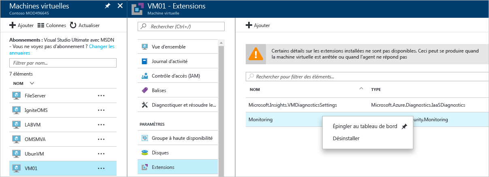

# Guide de résolution des problèmes d’Azure Security Center
Ce guide s’adresse aux informaticiens professionnels, aux analystes de la sécurité des informations et aux administrateurs de cloud dont les entreprises utilisent Azure Security Center et qui doivent résoudre des problèmes liés à ce service.

## Guide de résolution des problèmes
Ce guide explique comment résoudre les problèmes liés au Centre de sécurité. Vous pouvez résoudre la majorité des problèmes rencontrés dans le Centre de sécurité en commençant par examiner les enregistrements du [journal d’audit](https://azure.microsoft.com/updates/audit-logs-in-azure-preview-portal/) pour le composant en échec. Les journaux d’audit vous permettent de déterminer :

* Les opérations ayant eu lieu.
* Qui a initié l’opération.
* Le moment où a eu lieu l’opération.
* L’état de l’opération.
* Les valeurs d’autres propriétés qui peuvent vous aider à effectuer des recherches sur l’opération.

Le journal d’audit contient toutes les opérations d’écriture (PUT, POST, DELETE) effectuées sur vos ressources, mais n’inclut pas les opérations de lecture (GET).

## Résolution des problèmes d’installation de l’agent de surveillance dans Windows
L’agent de surveillance d’Azure Security Center est utilisé pour effectuer la collecte de données. Une fois la collecte des données activée et l’agent installé correctement sur l’ordinateur cible, les processus suivants doivent être en cours d’exécution :

* ASMAgentLauncher.exe - Agent de surveillance Azure 
* ASMMonitoringAgent.exe - Extension de l’agent de surveillance Azure
* ASMSoftwareScanner.exe - Gestionnaire d’analyse Azure

L’extension Surveillance de la sécurité Azure analyse diverses configurations de sécurité et collecte les journaux de sécurité de la machine virtuelle. Le gestionnaire d’analyse sera utilisé comme module de recherche de correctifs.

Si l’installation s’effectue correctement, vous devez voir une entrée similaire à celle ci-dessous dans les journaux d’audit pour la machine virtuelle cible :

Vous pouvez également obtenir plus d’informations sur le processus d’installation en consultant les journaux de l’agent, situés sous *%systemdrive%\windowsazure\logs* (exemple : C:\WindowsAzure\Logs).

> [!NOTE]
> Si l’agent Azure Security Center ne fonctionne pas correctement, vous devrez redémarrer la machine virtuelle cible, car il n’existe aucune commande pour arrêter et démarrer l’agent.

Si vous rencontrez toujours des problèmes de collecte des données, vous pouvez désinstaller l’agent en suivant les étapes ci-dessous :

1. Dans le **portail Azure**, sélectionnez la machine virtuelle concernée par les problèmes de collecte des données, puis cliquez sur **Extensions**.
2. Cliquez avec le bouton droit sur **Microsoft.Azure.Security.Monitoring**, puis sélectionnez **Désinstaller**.

L’extension Surveillance de la sécurité Azure devrait être réinstallée automatiquement au bout de quelques minutes.

## Résolution des problèmes d’installation de l’agent de surveillance dans Linux
Lors de la résolution des problèmes d’installation de l’agent de machine virtuelle sur un système Linux, vous devez vous assurer que l’extension a été téléchargée sous /var/lib/waagent/. Vous pouvez exécuter la commande ci-dessous pour vérifier qu’elle a été installée :

`cat /var/log/waagent.log` 

Les autres fichiers journaux que vous pouvez consulter pour résoudre les problèmes sont les suivants : 

* /var/log/mdsd.err
* /var/log/azure/

Dans un système qui fonctionne, vous devez voir une connexion au processus mdsd sur TCP 29130. Il s’agit du journal système communiquant avec le processus mdsd. Vous pouvez vérifier ce comportement en exécutant la commande suivante :

`netstat -plantu | grep 29130`

## Dépannage d’une protection du point de terminaison qui ne fonctionne pas correctement

L’agent invité représente le processus parent de toutes les actions effectuées par l’extension [Microsoft Antimalware](../security/azure-security-antimalware.md). Lorsque le processus de l’agent invité échoue, le programme Microsoft Antimalware exécuté comme un processus enfant de l’agent invité peut également échouer.  Dans les scénarios recommandés pour vérifier les options suivantes :

- Si la machine virtuelle cible est une image personnalisée et que le créateur de la machine virtuelle n’a jamais installé l’agent invité.
- Si la cible est une machine virtuelle Linux au lieu d’une machine virtuelle Windows, l’installation de la version Windows de l’extension anti-programme malveillant sur une machine virtuelle Linux échoue. L’agent invité Linux a des exigences spécifiques en termes de version du système d’exploitation et de packages requis, et si ces conditions ne sont pas remplies, l’agent de la machine virtuelle ne fonctionnera pas ici non plus. 
- Si la machine virtuelle a été créée avec une ancienne version de l’agent invité. Dans ce cas, notez que certains anciens agents ne pourront pas se mettre automatiquement à jour avec la version la plus récente, et cela peut entraîner ce problème. Utilisez toujours la dernière version de l’agent invité si vous créez vos propres images.
- Certains logiciels d’administration tiers peuvent désactiver l’agent invité ou bloquer l’accès à certains emplacements de fichiers. Si vous avez installé un logiciel tiers sur votre machine virtuelle, assurez-vous que l’agent figure sur la liste d’exclusion.
- Certains paramètres de pare-feu ou d’un groupe de sécurité réseau (NSG) peuvent bloquer le trafic réseau vers et depuis l’agent invité.
- Certaines listes de contrôle d’accès (ACL) peuvent empêcher l’accès au disque.
- Un espace disque insuffisant peut empêcher l’agent invité de fonctionner correctement. 

Par défaut, l’interface utilisateur de Microsoft Antimalware est désactivée. Consultez l’article [Activation de l’interface utilisateur Microsoft Antimalware sur des machines virtuelles Azure Resource Manager après le déploiement](https://blogs.msdn.microsoft.com/azuresecurity/2016/03/09/enabling-microsoft-antimalware-user-interface-post-deployment/) pour plus d’informations sur l’activation de l’interface utilisateur, le cas échéant.

## Résolution des problèmes de chargement du tableau de bord

Si vous rencontrez des problèmes de chargement du tableau de bord de Security Center, vérifiez que l’utilisateur qui inscrit l’abonnement auprès de Security Center (c’est-à-dire le premier utilisateur qui a ouvert Security Center avec l’abonnement) et l’utilisateur qui souhaite activer la collecte des données ont le rôle *Propriétaire* ou *Contributeur* pour l’abonnement. À partir de ce moment, les utilisateurs ayant le rôle *Lecteur* pour l’abonnement peuvent également consulter le tableau de bord, les alertes, les recommandations et les stratégies.

## Contacter le support Microsoft
Vous pouvez identifier certains problèmes en suivant les recommandations fournies dans cet article, tandis que d’autres problèmes sont documentés dans le [Forum](https://social.msdn.microsoft.com/Forums/en-US/home?forum=AzureSecurityCenter)public d’Azure Security Center. Toutefois, si vous avez encore besoin d’aide pour résoudre votre problème, vous pouvez ouvrir une nouvelle demande de support à l’aide du **portail Azure**, comme indiqué ci-dessous : 

## Voir aussi
Dans ce document, vous avez appris à configurer des stratégies de sécurité dans le Centre de sécurité Azure. Pour plus d’informations sur le Centre de sécurité Azure, consultez les rubriques suivantes :

* [Guide des opérations et de planification d’Azure Security Center](security-center-planning-and-operations-guide.md) : découvrez comment planifier l’adoption d’Azure Security Center et prenez connaissance des considérations relatives à la conception.
* [Surveillance de l’intégrité de la sécurité dans Azure Security Center](security-center-monitoring.md) : découvrez comment surveiller l’intégrité de vos ressources Azure.
* [Gestion et résolution des alertes de sécurité dans Azure Security Center](security-center-managing-and-responding-alerts.md) : découvrez comment gérer et résoudre les alertes de sécurité.
* [Surveillance des solutions de partenaire avec Azure Security Center](security-center-partner-solutions.md) : découvrez comment surveiller l’état d’intégrité de vos solutions de partenaire.
* [FAQ d’Azure Security Center](security-center-faq.md) : découvrez les réponses aux questions les plus souvent posées à propos de l’utilisation de ce service.
* [Blog sur la sécurité Azure](http://blogs.msdn.com/b/azuresecurity/) : accédez à des billets de blog sur la sécurité et la conformité Azure.

