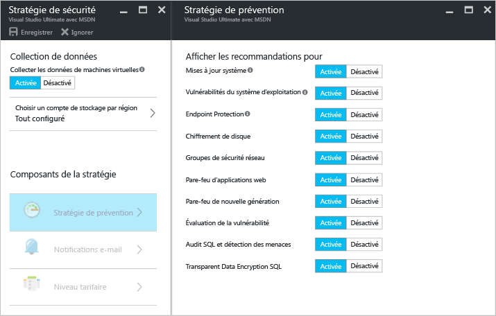
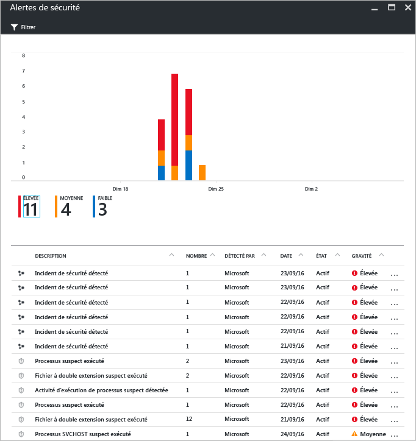

# Azure Security Center et machines virtuelles Azure
[Azure Security Center](https://azure.microsoft.com/services/security-center/) vous aide à vous empêcher, détecter et répondre aux menaces. Il fournit une surveillance de la sécurité et une gestion des stratégies intégrées pour l’ensemble de vos abonnements Azure, vous aidant ainsi à détecter les menaces qui pourraient passer inaperçues. De plus, il est compatible avec un vaste écosystème de solutions de sécurité.

Cet article explique comment Security Center peut vous aider à sécuriser vos machines virtuelles Azure.

## Pourquoi utiliser Security Center ?
Security Center vous aide à protéger les données de vos machines virtuelles dans Azure en vous offrant de la visibilité sur les paramètres de sécurité de votre machine virtuelle. Lorsque Security Center protège vos machines virtuelles, les fonctionnalités suivantes sont disponibles :

* Paramètres de sécurité du système d’exploitation avec les règles de configuration recommandées
* Sécurité du système et mises à jour critiques manquantes
* Recommandations de protection du point de terminaison
* Validation du chiffrement de disque
* Évaluation et correction des vulnérabilités
* Détection de menaces

En plus de vous aider à protéger vos machines virtuelles Azure, Security Center fournit également l’analyse de la sécurité et la gestion des services cloud, App Services et réseaux virtuels, notamment. 

> [!NOTE]
> Pour en savoir plus sur Azure Security Center, consultez l’article [Présentation d’Azure Security Center](security-center-intro.md).
> 
> 

## Composants requis
Pour commencer à utiliser Azure Security Center, vous devez connaître et prendre en compte les points suivants :

* Vous devez disposer d’un abonnement à Microsoft Azure. Pour plus d’informations sur les niveaux Gratuit et Standard de Security Center, consultez l’article [Tarification de Security Center](https://azure.microsoft.com/pricing/details/security-center/).
* Planifiez votre adoption de Security Center. Consultez l’article [Guide des opérations et de planification d’Azure Security Center](security-center-planning-and-operations-guide.md) pour en savoir plus sur la planification et le fonctionnement.
* Pour plus d’informations sur la prise en charge du système d’exploitation, consultez le [Forum au questions Azure Security Center](security-center-faq.md). 

## Définir une stratégie de sécurité
La collecte de données doit être activée pour qu’Azure Security Center puisse rassembler les informations nécessaires pour fournir des recommandations et des alertes générées en fonction de la stratégie de sécurité que vous configurez. Dans la figure ci-dessous, vous pouvez voir que la **collecte des données** a été **activée**.

Une stratégie de sécurité définit l’ensemble des contrôles recommandés pour les ressources d’un abonnement ou groupe de ressources spécifique. Avant d’activer la stratégie de sécurité, vous devez activer la collecte de données : Security Center collecte les données de vos machines virtuelles afin d’évaluer l’état de leur sécurité, de fournir des recommandations en matière de sécurité et de vous avertir des menaces. Dans Security Center, vous devez définir des stratégies pour vos abonnements ou groupes de ressources Azure en fonction des exigences de sécurité de votre société et du type d’applications ou du niveau de confidentialité des données de chaque abonnement. 

> [!NOTE]
> Pour en savoir plus sur chaque **stratégie de prévention** disponible, consultez l’article [Définir des stratégies de sécurité](security-center-policies.md).
> 
> 

## Gérer les recommandations de sécurité
Le Centre de sécurité analyse l’état de sécurité de vos ressources Azure. Lorsqu’il identifie des failles de sécurité potentielles, il crée des recommandations. Ces recommandations vous guident tout au long du processus de configuration des contrôles nécessaires.

Après la définition d’une stratégie de sécurité, le Centre de sécurité analyse l’état de sécurité de vos ressources pour identifier les vulnérabilités potentielles. Les recommandations sont affichées dans un tableau où chaque ligne correspond à une recommandation. Le tableau ci-dessous fournit des exemples de recommandations pour les machines virtuelles Azure et ce que chacune fait si vous l’appliquez. Lorsque vous sélectionnez une recommandation, des informations vous montrent comment implémenter la recommandation dans Security Center.

| Recommandation | Description |
| --- | --- |
| [Activer la collecte des données pour des abonnements](security-center-enable-data-collection.md) |Recommande l’activation de la collecte des données dans la stratégie de sécurité pour chacun de vos abonnements et toutes les machines virtuelles de vos abonnements. |
| [Corriger des vulnérabilités du système d’exploitation](security-center-remediate-os-vulnerabilities.md) |Recommande d’aligner les configurations de votre système d’exploitation sur les règles de configuration recommandées, comme le fait de ne pas permettre l’enregistrement des mots de passe. |
| [Appliquer des mises à jour système](security-center-apply-system-updates.md) |Recommande le déploiement des mises à jour de sécurité du système et des mises à jour critiques manquantes sur les machines virtuelles. |
| [Redémarrage après des mises à jour système](security-center-apply-system-updates.md#reboot-after-system-updates) |Recommande de redémarrer une machine virtuelle pour terminer le processus de mise à jour du système. |
| [Installer Endpoint Protection](security-center-install-endpoint-protection.md) |Recommande l’approvisionnement de logiciels anti-programme malveillant sur les machines virtuelles (Windows uniquement). |
| [Résoudre les alertes d’intégrité Endpoint Protection](security-center-resolve-endpoint-protection-health-alerts.md) |Recommande la résolution des défaillances de protection de point de terminaison. |
| [Activer l’agent de machine virtuelle](security-center-enable-vm-agent.md) |Vous permet de connaître les machines virtuelles qui nécessitent l’agent de machine virtuelle. L’agent de machine virtuelle doit être installé sur les machines virtuelles pour approvisionner l’analyse des correctifs, l’analyse des lignes de base et les logiciels anti-programme malveillant. L’agent de machine virtuelle est installé par défaut sur les machines virtuelles déployées depuis Azure Marketplace. L’article [Installer l’agent de machine virtuelle – Deuxième partie](http://azure.microsoft.com/blog/2014/04/15/vm-agent-and-extensions-part-2/) fournit des informations sur l’installation de l’agent de machine virtuelle. |
| [Apply disk encryption (Appliquer le chiffrement de disque Azure Disk Encryption)](security-center-apply-disk-encryption.md) |Recommande le chiffrement des disques des machines virtuelles à l’aide d’Azure Disk Encryption (Windows et Linux). Le chiffrement est recommandé pour les systèmes d’exploitation et les volumes de données de votre machine virtuelle. |
| [Évaluation des vulnérabilités non installée](security-center-vulnerability-assessment-recommendations.md) |Recommande d’installer une solution d’évaluation des vulnérabilités sur votre machine virtuelle. |
| [Corriger des vulnérabilités](security-center-vulnerability-assessment-recommendations.md#review-the-recommendation) |Vous permet de voir les vulnérabilités du système et des applications détectées par la solution d’évaluation des vulnérabilités installée sur votre machine virtuelle. |

> [!NOTE]
> Pour en savoir plus sur les recommandations, consultez l’article [Gestion des recommandations de sécurité](security-center-recommendations.md).
> 
> 

## Surveiller l’intégrité de la sécurité
Une fois que vous avez activé les [stratégies de sécurité](security-center-policies.md) pour les ressources d’un abonnement, Azure Security Center analyse la sécurité de vos ressources afin d’identifier les vulnérabilités potentielles.  Vous pouvez visualiser l’état de sécurité de vos ressources, ainsi que les problèmes éventuels, dans le panneau **Intégrité de la sécurité des ressources** . Lorsque vous cliquez sur **Machines virtuelles** dans la vignette **Intégrité de la sécurité des ressources**, le panneau **Machines virtuelles** s’ouvre, et indique des recommandations pour vos machines virtuelles. 

## Gérer et répondre aux alertes de sécurité
Security Center collecte, analyse et intègre automatiquement les données de journaux provenant de vos ressources Azure, du réseau et des solutions partenaires connectées, telles que les solutions de protection des points de terminaison et des pare-feu, pour détecter les menaces réelles et réduire le nombre de faux positifs. En tirant parti d’une agrégation de [fonctionnalités de détection](security-center-detection-capabilities.md) diversifiées, Security Center est en mesure de générer des alertes de sécurité hiérarchisées pour vous aider à étudier rapidement le problème et de fournir des recommandations afin de corriger les attaques possibles.

Sélectionnez une alerte de sécurité pour en savoir plus sur les événements qui l’ont déclenchée et, le cas échéant, les étapes à suivre pour y remédier. Les alertes de sécurité sont regroupées par [type](security-center-alerts-type.md) et date d’apparition.

## Voir aussi
Pour plus d’informations sur le Centre de sécurité, consultez les rubriques suivantes :

* [Définition des stratégies de sécurité dans Azure Security Center](security-center-policies.md) : découvrez comment configurer des stratégies de sécurité pour vos groupes de ressources et abonnements Azure.
* [Gestion et résolution des alertes de sécurité dans Azure Security Center](security-center-managing-and-responding-alerts.md) : découvrez comment gérer et résoudre les alertes de sécurité.
* [FAQ Azure Security Center](security-center-faq.md) : forum aux questions concernant l’utilisation de ce service.

