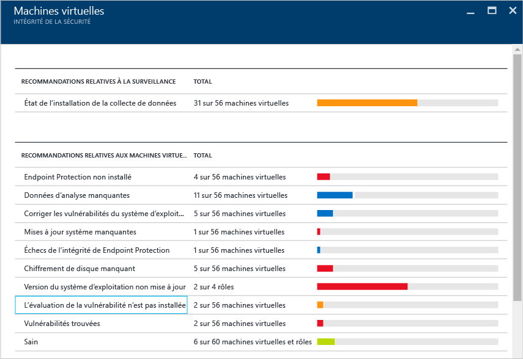
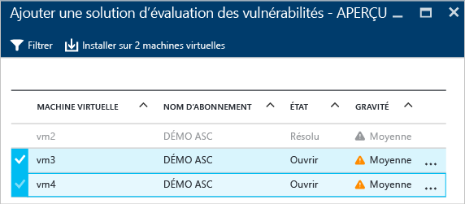
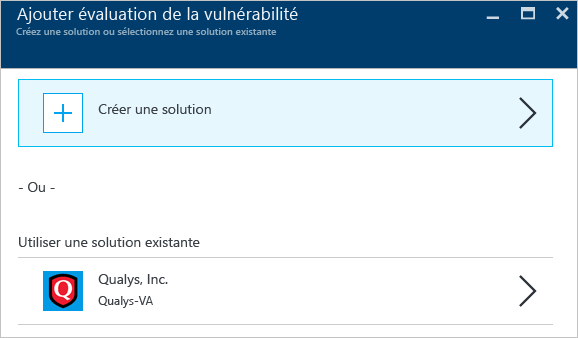
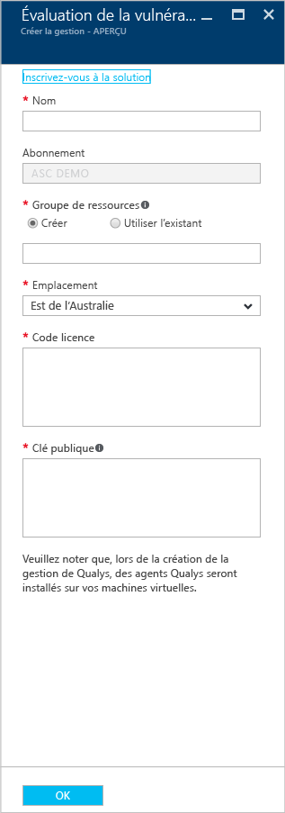
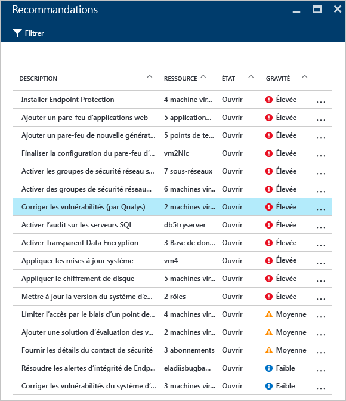
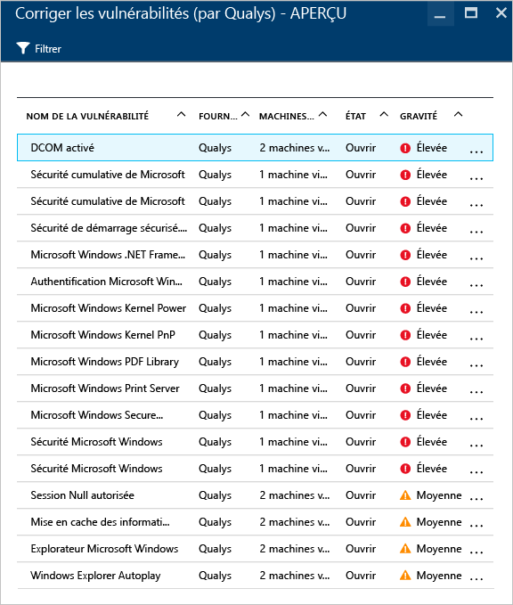
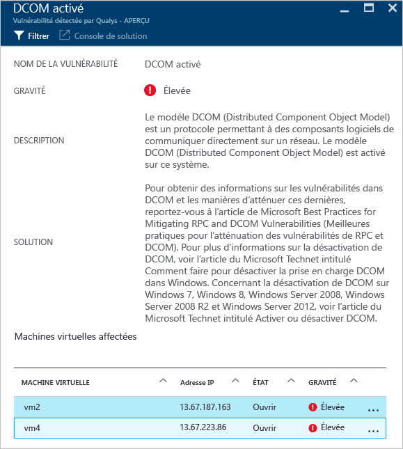

# Évaluation des vulnérabilités dans Azure Security Center
Ce document traite des recommandations d’évaluation des vulnérabilités applicables aux machines virtuelles s’exécutant sur Azure.

## Qu’est-ce que l’évaluation des vulnérabilités ?
L’évaluation des vulnérabilités dans Azure Security Center fait partie des recommandations de machine virtuelle. Si Azure Security Center ne trouve pas de solution d’évaluation des vulnérabilités installée sur votre machine virtuelle, il vous recommandera d’en installer une. Une fois déployé, l’agent partenaire commencera à signaler les données de vulnérabilité à la plateforme de gestion partenaire qui, en retour, fournira des données de surveillance de l’intégrité et des vulnérabilités à Azure Security Center. Les utilisateurs peuvent rapidement identifier les machines virtuelles vulnérables à partir du tableau de bord d’Azure Security Center et peuvent obtenir plus d’informations et de rapports en basculant sur la console de gestion partenaire directement depuis Azure Security Center.

> [!NOTE]
> Ce document présente le service à l’aide d’un exemple de déploiement. Il ne s’agit pas d’un guide pas à pas.
> 
> 

## Limitations de la version préliminaire publique
Les limitations suivantes s’appliquent à la version préliminaire publique d’évaluation des vulnérabilités actuelle :

* La seule solution partenaire d’évaluation des vulnérabilités disponible est celle de [Qualys](https://www.qualys.com/lp/azure). D'autres seront ajoutés par la suite.
* Vous pouvez installer la solution d’évaluation des vulnérabilités sur plusieurs machines virtuelles tant qu’elles appartiennent au même abonnement.
* Seules les machines virtuelles Windows sont prises en charge ; les machines virtuelles Linux seront ajoutées pour la disponibilité générale.

## Appliquer la recommandation de machine virtuelle
Quand Azure Security Center détecte qu’une ou plusieurs machines virtuelles prises en charge sont dépourvues de solution d’évaluation des vulnérabilités, il déclenche une recommandation de machine virtuelle. Ce qui suit vous permettra d’accéder à cette recommandation et de l’appliquer à plusieurs machines virtuelles qui appartiennent au même abonnement :

1. Dans la vignette **Intégrité de la sécurité des ressources**, cliquez sur **Machines virtuelles**.
2. Dans le panneau **Machines virtuelles**, sélectionnez **Évaluation des vulnérabilités non installée**, comme indiqué sur l’écran suivant :
   
    
3. Dans le panneau **Add a vulnerability assessment solution - PREVIEW** (Ajouter une solution d’évaluation des vulnérabilités - VERSION PRÉLIMINAIRE), sélectionnez les machines virtuelles sur lesquelles installer la solution d’évaluation des vulnérabilités, comme indiqué sur l’écran suivant :
   
    
4. Dans le panneau **Ajouter une solution d’évaluation des vulnérabilités - VERSION PRÉLIMINAIRE**, cliquez sur l’option **Installer sur 2 machines virtuelles** (le nom peut varier en fonction du nombre de machines virtuelles sélectionnées). Le panneau **Add Vulnerability Assessment** (Ajouter une évaluation des vulnérabilités) s’affiche alors, comme indiqué sur l’écran suivant :
   
    
5. Dans ce panneau, vous pouvez choisir de créer une évaluation des vulnérabilités, ce qui vous permet de sélectionner une solution partenaire à partir de **Place de marché Azure**. Vous pouvez également sélectionner une solution partenaire existante sous Utiliser une solution existante, comme ici, **Qualys**.

## Créer une solution d’évaluation des vulnérabilités
Si vous disposez de plusieurs abonnements, vous pouvez créer une solution d’évaluation des vulnérabilités pour chacun d’entre eux. Les étapes principales sont identiques à celles énumérées dans la section précédente, à la seule différence que vous devrez cliquer sur l’option **Créer** à l’étape 4. Après avoir sélectionné cette option, procédez comme suit.

> [!NOTE]
> L’exemple suivant utilise Qualys. Pour déployer un agent cloud Qualys à partir d’Azure Security Center, vous avez besoin d’un code de licence et d’une clé publique de Qualys. Consultez la [documentation Qualys](https://community.qualys.com/docs/DOC-5823-deploying-qualys-cloud-agents-from-microsoft-azure-security-center) relative à la récupération du code de licence et de la clé publique.
> 
> 

1. Dans le panneau **Create a new Vulnerability Assessment** (Créer une évaluation des vulnérabilités), cliquez sur le nom du partenaire, ici **Qualys**.
2. Le panneau du partenaire s’ouvre alors. Les champs affichés dans ce panneau peuvent changer en fonction du partenaire. Ici, nous utiliserons **Qualys** :
   
    
3. Dans le champ **Nom** , tapez le nom de cette solution. Vous pouvez utiliser un nom en relation avec le groupe de ressources ou l’abonnement que vous voulez lier.
4. Dans le champ **Abonnement** , sélectionnez l’abonnement que vous voulez utiliser pour cette solution.
5. Dans le champ **Groupe de ressources** , sélectionnez un groupe de ressources existant ou créez-en un.
6. Dans le champ **Emplacement** , sélectionnez l’emplacement géographique de cette solution.
7. Dans le champ **Code de licence** (spécifique à Qualys), saisissez le numéro de licence fourni par le partenaire.
8. Dans le champ **Clé publique** (spécifique à Qualys), saisissez les informations de clé publique fournies par le partenaire et cliquez sur **OK**.

## Examiner les recommandations
Une fois la solution d’évaluation des vulnérabilités installée sur la machine virtuelle cible, elle analyse cette dernière pour détecter et identifier les vulnérabilités des applications et du système.

> [!NOTE]
> La première analyse peut durer quelques heures. Par la suite, elle aura lieu toutes les heures.
> 
> 

Ces problèmes seront visibles sous les options **Recommandations relatives aux machines virtuelles** . L’exemple suivant montre comment la recommandation s’affiche sous le panneau **Recommandations** :

Dans cet exemple, la recommandation sélectionnée indique que la détection a été effectuée par Qualys. Si vous cliquez sur cette recommandation, un nouveau panneau avec une liste des vulnérabilités apparaît, comme indiqué sur l’écran suivant :

Cette liste affiche toutes les vulnérabilités par ordre de gravité, ainsi que le nombre de machines virtuelles affectées par cette vulnérabilité. Dans cet exemple, la vulnérabilité Enable DCOM (Activer DCOM) a été sélectionnée, et un nouveau panneau indiquant les étapes recommandées pour traiter cette vulnérabilité apparaît :

## Voir aussi
Dans ce document, vous avez appris à appliquer les recommandations d’évaluation des vulnérabilités dans Azure Security Center. Pour plus d’informations sur le Centre de sécurité Azure, consultez les rubriques suivantes :

* [Azure Security Center planning and operations guide](security-center-planning-and-operations-guide.md). découvrez comment planifier l’adoption d’Azure Security Center et prenez connaissance des considérations relatives à la conception.
* [Surveillance de l’intégrité de la sécurité dans Azure Security Center](security-center-monitoring.md). découvrez comment surveiller l’intégrité de vos ressources Azure.
* [Gestion et résolution des alertes de sécurité dans Azure Security Center](security-center-managing-and-responding-alerts.md). découvrez comment gérer et résoudre les alertes de sécurité.
* [Surveillance des solutions de partenaire avec Azure Security Center](security-center-partner-solutions.md). découvrez comment surveiller l’état d’intégrité de vos solutions de partenaire.
* [FAQ du Centre de sécurité Azure](security-center-faq.md). forum aux questions concernant l’utilisation de ce service.
* [Blog sur la sécurité Azure](http://blogs.msdn.com/b/azuresecurity/). accédez à des billets de blog sur la sécurité et la conformité Azure.

<!--HONumber=Nov16_HO2-->

