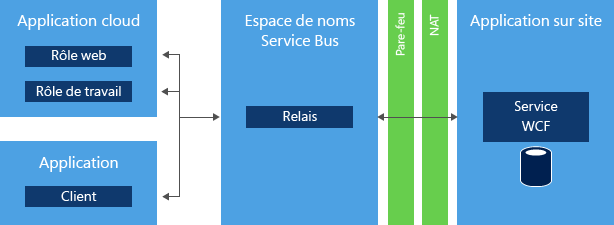
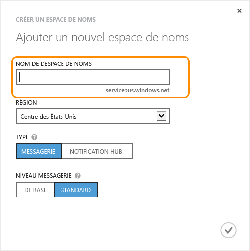
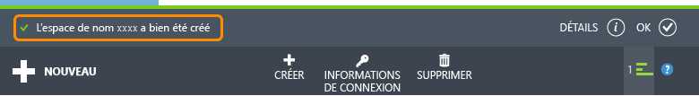

<properties 
	pageTitle="Utilisation de Service Bus Relay (.NET) - Azure" 
	description="Découvrez comment utiliser le service de relais Azure Service Bus pour connecter deux applications hébergées dans des emplacements différents." 
	services="service-bus" 
	documentationCenter=".net" 
	authors="sethmanheim" 
	manager="timlt" 
	editor=""/>

<tags 
	ms.service="service-bus" 
	ms.workload="tbd" 
	ms.tgt_pltfrm="na" 
	ms.devlang="dotnet" 
	ms.topic="article" 
	ms.date="07/02/2015" 
	ms.author="sethm"/>

# Utilisation du service Service Bus Relay

Ce guide montre comment utiliser le service Service Bus Relay. Les exemples sont écrits en C# et utilisent l'API Windows Communication Foundation (WCF) avec les extensions contenues dans l'assembly Service Bus, qui fait partie du Kit de développement logiciel (SDK) Microsoft Azure .NET. Pour plus d'informations sur Service Bus Relay, consultez la section [Étapes suivantes](#Next-steps).

[AZURE.INCLUDE [create-account-note](../../includes/create-account-note.md)]

## Présentation de Service Bus Relay

Le service Service Bus *Relay* vous permet de créer des applications hybrides qui s’exécutent à la fois dans un centre de données Azure et dans votre propre environnement d’entreprise local. Service Bus Relay facilite ce processus en offrant la possibilité d'exposer les services WCF (Windows Communication Foundation) qui résident dans un réseau d'entreprise sur le cloud public en toute sécurité, sans avoir à ouvrir une connexion de pare-feu ni à exiger des modifications intrusives dans une infrastructure de réseau d'entreprise.

Service Bus Relay vous permet d'héberger des services WCF au sein de votre environnement d'entreprise existant. Vous pouvez ensuite déléguer l'écoute des sessions et des demandes entrantes adressées à ces services WCF au service Service Bus s'exécutant dans Azure. Cela vous permet d'exposer ces services au code d'application s'exécutant dans Azure, à des travailleurs itinérants ou à des environnements extranet de partenaires. Service Bus vous permet de contrôler de manière précise et sécurisée les utilisateurs autorisés à accéder à ces services. Il offre un moyen efficace et sûr d'exposer les fonctionnalités et les données applicatives de vos solutions d'entreprise existantes et d'en tirer profit depuis le cloud.

Ce guide montre comment utiliser Service Bus Relay pour créer un service Web WCF, exposé à l'aide d'une liaison de canal TCP, qui implémente une conversation sécurisée entre deux parties.

## Création d'un espace de noms de service

Avant d'utiliser Service Bus Relay dans Azure, vous devez créer un espace de noms de service. Ce dernier fournit un conteneur d'étendue pour l'adressage des ressources Service Bus au sein de votre application.

Pour créer un espace de noms de service :

1.  Connectez-vous au [portail de gestion Azure][].

2.  Dans le volet de navigation gauche du portail de gestion, cliquez sur **Service Bus**.

3.  Dans le volet inférieur du portail de gestion, cliquez sur **Créer**.

	

4.  Dans la boîte de dialogue **Add a new namespace**, entrez un nom d’espace de noms. Le système vérifie immédiatement si le nom est disponible.

	

5.  Après vous être assuré que le nom de l'espace de noms est disponible, choisissez le pays ou la région où votre espace de noms doit être hébergé (veillez à utiliser le même pays ou la même région que celui ou celle où vous déployez vos ressources de calcul).

	IMPORTANT : choisissez la **même région** que celle que vous prévoyez de sélectionner pour le déploiement de votre application. Vous bénéficiez ainsi des meilleures performances.

6.	Laissez les autres champs de la boîte de dialogue avec leurs valeurs par défaut (**Messaging** et **Niveau Standard**), puis cliquez sur la coche. Le système crée l'espace de noms de service et l'active. Vous devrez peut-être attendre plusieurs minutes afin que le système approvisionne des ressources pour votre compte.

	

	L'espace de noms créé s'affiche alors dans le portail de gestion. Son activation peut prendre un certain temps. Patientez jusqu’à ce que l’état soit **Actif** avant de continuer.

## Obtention d'informations d'identification de gestion par défaut pour l'espace de noms

Afin d'exécuter des opérations de gestion, comme la création d'une connexion de relais, vous devez configurer sur le nouvel espace de noms la règle d'autorisation par signature d'accès partagé de l'espace de noms. Pour plus d'informations sur la signature d'accès partagé (SAS), consultez [Authentification par signature d'accès partagé avec Service Bus][].

1.  Dans le volet de navigation gauche, cliquez sur le nœud **Service Bus** pour afficher la liste des espaces de noms disponibles : 

2.  Double-cliquez sur le nom de l'espace de noms que vous venez de créer dans la liste affichée : 

3.  Cliquez sur l'onglet **Configurer** en haut de la page.
 
4.  Quand un espace de noms Service Bus est configuré, un objet **SharedAccessAuthorizationRule**, avec **KeyName** défini sur **RootManageSharedAccessKey**, est créé par défaut. Cette page affiche cette clé, ainsi que les clés primaire et secondaire de la règle par défaut.

## Obtention du package NuGet Service Bus

Le package **NuGet** Service Bus est le moyen le plus simple de se procurer l'API Service Bus et de configurer votre application avec toutes les dépendances Service Bus. L'extension Visual Studio NuGet facilite l'installation et la mise à jour des bibliothèques et des outils de Visual Studio et Visual Studio Express. Le package NuGet Service Bus est le moyen le plus simple de se procurer l'API Service Bus et de configurer votre application avec toutes les dépendances Service Bus.

Pour installer le package NuGet dans votre application, procédez comme suit :

1.  Dans l'Explorateur de solutions, cliquez avec le bouton droit sur **References**, puis cliquez sur **Manage NuGet Packages**.
2.  Recherchez « Service Bus » et sélectionnez l’élément **Microsoft Azure Service Bus**. Cliquez sur **Install** pour terminer l'installation, puis fermez cette boîte de dialogue.

	
  

## Utilisation de Service Bus pour exposer et consommer un service web SOAP avec TCP

Pour exposer un service Web SOAP WCF existant pour une consommation externe, vous devez apporter des modifications aux liaisons et aux adresses du service. Vous pouvez ainsi être amené à modifier votre fichier de configuration ou votre code, selon la façon dont vous avez défini et configuré vos services WCF. Notez que WCF vous permet de disposer de plusieurs points de terminaison réseau sur un même service. Vous pouvez donc conserver les points de terminaison internes existants et ajouter en même temps des points de terminaison Service Bus pour l'accès externe.

Dans cette tâche, vous allez créer un service WCF simple et y ajouter un écouteur Service Bus. Cet exercice part du principe que vous utilisez déjà Visual Studio, vous ne serez donc pas guidé pour la création de projet. Il porte essentiellement sur le code.

Avant de commencer les étapes ci-après, exécutez la procédure suivante pour configurer votre environnement :

1.  Dans Visual Studio, créez une application de console contenant deux projets (« Client » et « Service ») dans la solution.
2.  Ajoutez le package **Microsoft Azure Service Bus** NuGet pour les deux projets. Cela a pour effet d'ajouter toutes les références d'assembly nécessaires à vos projets.

### Création du service

Pour commencer, créez le service proprement dit. Un service WCF se compose d'au moins trois parties distinctes :

-   Définition d'un contrat décrivant la nature des messages échangés et des opérations à appeler. 
-   Implémentation dudit contrat.
-   Hôte hébergeant ce service WCF et exposant un certain nombre de points de terminaison.

Les exemples de code présentés dans cette section portent sur chacun de ces composants.

Le contrat définit une seule opération, `AddNumbers`, qui ajoute deux nombres et renvoie le résultat. L'interface `IProblemSolverChannel` permet au client de gérer plus facilement la durée de vie du proxy. Il est recommandé de créer une interface de ce type. De même, vous avez tout intérêt à placer cette définition de contrat dans un fichier distinct de façon à pouvoir y faire référence dans les deux projets (« Client » et « Service »). Vous pouvez également copier le code dans les deux projets :

        using System.ServiceModel;
     
        [ServiceContract(Namespace = "urn:ps")]
        interface IProblemSolver
        {
            [OperationContract]
            int AddNumbers(int a, int b);
        }
     
        interface IProblemSolverChannel : IProblemSolver, IClientChannel {}

Une fois que le contrat est en place, l'implémentation est anecdotique :

        class ProblemSolver : IProblemSolver
        {
            public int AddNumbers(int a, int b)
            {
                return a + b;
            }
        }

### Configuration d’un hôte de service par programme

Maintenant que le contrat et l'implémentation sont en place, vous pouvez héberger le service. L'hébergement se situe à l'intérieur d'un objet [System.ServiceModel.ServiceHost](https://msdn.microsoft.com/library/azure/system.servicemodel.servicehost.aspx), qui se charge de gérer les instances du service et héberge les points de terminaison qui écoutent les messages. Dans le code suivant, le service est configuré avec d'une part un point de terminaison local normal et d'autre part un point de terminaison Service Bus, ceci afin d'illustrer la configuration côte à côte des points de terminaison internes et externes. Remplacez la chaîne *namespace* par le nom de votre espace de noms et *yourKey* par la clé SAP que vous avez obtenue à l'étape de configuration précédente.

    ServiceHost sh = new ServiceHost(typeof(ProblemSolver));

    sh.AddServiceEndpoint(
       typeof (IProblemSolver), new NetTcpBinding(), 
       "net.tcp://localhost:9358/solver");

    sh.AddServiceEndpoint(
       typeof(IProblemSolver), new NetTcpRelayBinding(), 
       ServiceBusEnvironment.CreateServiceUri("sb", "namespace", "solver"))
        .Behaviors.Add(new TransportClientEndpointBehavior {
              TokenProvider = TokenProvider.CreateSharedAccessSignatureTokenProvider("RootManageSharedAccessKey", "yourKey")});

    sh.Open();

    Console.WriteLine("Press ENTER to close");
    Console.ReadLine();

    sh.Close();

Dans l'exemple, vous créez deux points de terminaison dans le cadre de l'implémentation du même contrat. L’un est local et l’autre projeté via Service Bus. Les principales différences sont les liaisons : [`NetTcpBinding`](https://msdn.microsoft.com/library/azure/system.servicemodel.nettcpbinding.aspx) pour le point de terminaison local et [NetTcpRelayBinding](https://msdn.microsoft.com/library/azure/microsoft.servicebus.nettcprelaybinding.aspx) pour le point de terminaison et les adresses Service Bus. Le point de terminaison local possède une adresse réseau locale avec un port distinct. Le point de terminaison Service Bus possède une adresse de point de terminaison constituée de la chaîne « sb », du nom de votre espace de noms et du chemin d'accès « solver ». L'URI obtenu est le suivant : « sb://[serviceNamespace].servicebus.windows.net/solver », lequel identifie le point de terminaison du service comme un point de terminaison TCP Service Bus associé à un nom DNS externe complet. Si vous insérez le code en remplaçant les espaces réservés comme indiqué plus haut dans la fonction `Main` de l’application « Service », vous obtiendrez un service fonctionnel. Si vous voulez que votre service écoute exclusivement sur Service Bus, supprimez la déclaration du point de terminaison local.

### Configuration d’un hôte de service dans le fichier App.config

Vous pouvez également configurer l'hôte à l'aide du fichier App.config. Dans ce cas, le code d'hébergement du service se présente comme suit :

    ServiceHost sh = new ServiceHost(typeof(ProblemSolver));
    sh.Open();
    Console.WriteLine("Press ENTER to close");
    Console.ReadLine();
    sh.Close();

Les définitions de point de terminaison se déplacent dans le fichier App.config. Notez que le package **NuGet** a déjà ajouté une plage de définitions dans le fichier App.config, qui sont des extensions de la configuration requise pour Service Bus. L’extrait de code suivant, équivalent exact de l’extrait de code précédent, doit figurer juste en dessous de l’élément **system.serviceModel**. Cet extrait suppose que l'espace de noms C# de votre projet se nomme « Service ». Remplacez les espaces réservés par l’espace de noms et la clé SAS du service Service Bus.

    <services>
        <service name="Service.ProblemSolver">
            <endpoint contract="Service.IProblemSolver"
                      binding="netTcpBinding"
                      address="net.tcp://localhost:9358/solver"/>
            <endpoint contract="Service.IProblemSolver"
                      binding="netTcpRelayBinding"
                      address="sb://namespace.servicebus.windows.net/solver"
                      behaviorConfiguration="sbTokenProvider"/>
        </service>
    </services>
    <behaviors>
        <endpointBehaviors>
            <behavior name="sbTokenProvider">
                <transportClientEndpointBehavior>
                    <tokenProvider>
                        <sharedAccessSignature keyName="RootManageSharedAccessKey" key="yourKey" />
                    </tokenProvider>
                </transportClientEndpointBehavior>
            </behavior>
        </endpointBehaviors>
    </behaviors>

Une fois ces modifications effectuées, le service démarre comme précédemment, mais avec deux points de terminaison actifs : l'un local et l'autre écoutant dans le cloud.

### Création du client

#### Configuration d’un client par programme

Pour utiliser le service, vous pouvez créer un client WCF à l’aide d’un objet [`ChannelFactory`](https://msdn.microsoft.com/library/system.servicemodel.channelfactory.aspx). Service Bus utilise un modèle de sécurité basée sur un jeton, implémenté à l'aide de SAS. La classe **TokenProvider** représente un fournisseur de jetons de sécurité dont les méthodes de fabrique intégrées renvoient des fournisseurs de jetons bien connus. L'exemple ci-dessous utilise la méthode [`CreateSharedAccessSignatureTokenProvider`](https://msdn.microsoft.com/library/azure/microsoft.servicebus.tokenprovider.createsharedaccesssignaturetokenprovider.aspx) pour gérer l'acquisition du jeton SAS approprié. Le nom et la clé sont ceux obtenus sur le portail comme indiqué dans la section précédente.

Tout d'abord, référencez ou copiez le code du contrat `IProblemSolver` du service dans votre projet client.

Ensuite, remplacez le code dans la méthode `Main` du client, en remplaçant de nouveau le texte d’espace réservé par l’espace de noms et la clé SAS de Service Bus :

    var cf = new ChannelFactory<IProblemSolverChannel>(
        new NetTcpRelayBinding(), 
        new EndpointAddress(ServiceBusEnvironment.CreateServiceUri("sb", "namespace", "solver")));

    cf.Endpoint.Behaviors.Add(new TransportClientEndpointBehavior
                { TokenProvider = TokenProvider.CreateSharedAccessSignatureTokenProvider("RootManageSharedAccessKey","yourKey") });
     
    using (var ch = cf.CreateChannel())
    {
        Console.WriteLine(ch.AddNumbers(4, 5));
    }

Vous pouvez maintenant créer le client et le service, les exécuter (en exécutant le service en premier) ; le client appellera alors le service et imprimera « **9** ». Vous pouvez exécuter le client et le serveur sur différents ordinateurs, voire sur des réseaux, la communication fonctionnera toujours. Le code client peut également être exécuté dans le cloud ou en local.

#### Configuration d’un client dans le fichier App.config

Vous pouvez également configurer le client à l'aide du fichier App.config. Dans ce cas, le code client se présente comme suit :

    var cf = new ChannelFactory<IProblemSolverChannel>("solver");
    using (var ch = cf.CreateChannel())
    {
        Console.WriteLine(ch.AddNumbers(4, 5));
    }

Les définitions de point de terminaison se déplacent dans le fichier App.config. L’extrait de code suivant, qui est identique au code présenté précédemment, doit figurer juste en dessous de l’élément **system.serviceModel**. Comme précédemment, vous devez remplacer les espaces réservés par l’espace de noms et la clé SAS de Service Bus.

    <client>
        <endpoint name="solver" contract="Service.IProblemSolver"
                  binding="netTcpRelayBinding"
                  address="sb://namespace.servicebus.windows.net/solver"
                  behaviorConfiguration="sbTokenProvider"/>
    </client>
    <behaviors>
        <endpointBehaviors>
            <behavior name="sbTokenProvider">
                <transportClientEndpointBehavior>
                    <tokenProvider>
                        <sharedAccessSignature keyName="RootManageSharedAccessKey" key="yourKey" />
                    </tokenProvider>
                </transportClientEndpointBehavior>
            </behavior>
        </endpointBehaviors>
    </behaviors>

## Étapes suivantes

Maintenant que vous avez appris les principes de base du service Service Bus **Relay**, consultez ces liens pour en savoir plus :

-   Création d’un service : [Génération d’un service pour Service Bus][].
-   Création du client : [Génération d’une application cliente Service Bus][].
-   Exemples Service Bus : téléchargement depuis la page [Exemples Azure][] ou consultation de la présentation sur [MSDN][].

  [Create a Service Namespace]: #create_namespace
  [Obtain the Default Management Credentials for the Namespace]: #obtain_credentials
  [Get the Service Bus NuGet Package]: #get_nuget_package
  [How to: Use Service Bus to Expose and Consume a SOAP Web Service  with TCP]: #how_soap
  [portail de gestion Azure]: http://manage.windowsazure.com
  [Authentification par signature d'accès partagé avec Service Bus]: http://msdn.microsoft.com/library/azure/dn170477.aspx
  [Génération d’un service pour Service Bus]: http://msdn.microsoft.com/library/azure/ee173564.aspx
  [Génération d’une application cliente Service Bus]: http://msdn.microsoft.com/library/azure/ee173543.aspx
  [Exemples Azure]: https://code.msdn.microsoft.com/windowsazure/site/search?query=service%20bus&f%5B0%5D.Value=service%20bus&f%5B0%5D.Type=SearchText&ac=2
  [MSDN]: https://msdn.microsoft.com/fr-fr/library/azure/dn194201.aspx
 

<!---HONumber=July15_HO4-->