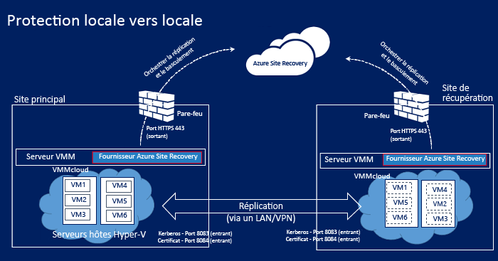
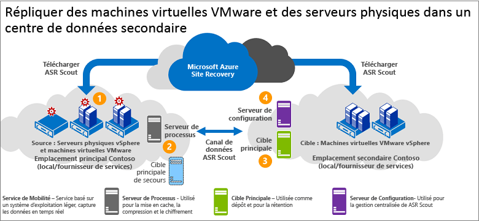

# Comment fonctionne la réplication de machines locales vers un site secondaire dans Site Recovery ?

Cet article décrit les composants et les processus impliqués dans la réplication des serveurs physiques et des machines virtuelles locaux sur Azure à l’aide du service [Azure Site Recovery](site-recovery-overview.md).

Vous pouvez répliquer les éléments suivants vers un site local secondaire :
- Machines virtuelles Hyper-V locales, sur clusters Hyper-V et hôtes autonomes qui sont gérés dans des clouds System Center Virtual Machine Manager (VMM).
- Machines virtuelles VMware locales et serveurs physiques Windows/Linux. Dans ce scénario, la réplication est gérée par Scout.

Publiez des commentaires au bas de cet article, ou sur le [Forum Azure Recovery Services](https://social.msdn.microsoft.com/forums/azure/home?forum=hypervrecovmgr).

## Répliquer des machines virtuelles Hyper-V vers un site local secondaire

### Composants architecturaux

Voici ce dont vous avez besoin pour la réplication des machines virtuelles Hyper-V vers un site secondaire.

**Composant** | **Emplacement** | **Détails**
--- | --- | ---
**Microsoft Azure** | Vous avez besoin d’un compte Microsoft. |
**Serveur VMM** | Nous recommandons l’utilisation d’un serveur VMM dans le site principal et un autre dans le site secondaire | Chaque serveur VMM doit être connecté à Internet.   Chaque serveur doit avoir au moins un cloud privé VMM avec l’ensemble des profils de fonctionnalités Hyper-V.   Vous installez le fournisseur Azure Site Recovery sur le serveur VMM. Le fournisseur coordonne et orchestre la réplication avec le service Site Recovery via Internet. Les communications entre le fournisseur et Azure sont sécurisées et chiffrées.
**Serveur Hyper-V** |  Un ou plusieurs serveurs hôtes Hyper-V dans les clouds VMM principaux et secondaires.   Les serveurs doivent être connectés à Internet.   Les données sont répliquées entre les serveurs hôtes Hyper-V principal et secondaire via une liaison LAN ou VPN, en utilisant Kerberos ou une authentification par certificat.  
**Machines virtuelles Hyper-V** | Situé sur le serveur hôte Hyper-V source. | Le serveur hôte source doit avoir au moins une machine virtuelle que vous souhaitez répliquer.

### Processus de réplication

1. Vous configurez le compte Azure.
2. Vous créez un coffre Replication Services pour Site Recovery et configurez les paramètres du coffre, notamment :

    - Source et cible de la réplication (sites principal et secondaire).
    - Installation du fournisseur Azure Site Recovery et de l’agent Microsoft Azure Recovery Services. Le fournisseur est installé sur les serveurs VMM et l’agent sur chaque hôte Hyper-V.
    - Vous créez une stratégie de réplication pour le cloud VMM source. La stratégie est appliquée à toutes les machines virtuelles situées sur des hôtes dans le cloud.
    - Vous activez la réplication pour les machines virtuelles Hyper-V. La réplication initiale se déclenche selon les paramètres de la stratégie de réplication.
4. Les modifications des données font l’objet d’un suivi et la réplication des modifications delta débute après la réplication initiale. Les modifications qui font l’objet d’un suivi sont conservées dans un fichier .hrl.
5. Vous effectuez un test de basculement pour vérifier que tout fonctionne bien.

**Figure 1 : réplication de VMM vers VMM**

### Processus de basculement et de restauration automatique

1. Vous pouvez effectuer un [basculement](site-recovery-failover.md) planifié ou non planifié entre des sites locaux. Si vous exécutez un basculement planifié, les machines virtuelles sources sont arrêtées pour éviter toute perte de données.
2. Vous pouvez basculer vers une seule machine ou créer des [plans de récupération](site-recovery-create-recovery-plans.md) pour orchestrer le basculement de plusieurs machines.
4. Si vous effectuez un basculement non planifié vers un site secondaire, une fois l’opération terminée, les machines de l’emplacement secondaire ne sont pas protégées ou réplicables. Si vous avez lancé un basculement planifié, une fois l’opération terminée, les machines de l’emplacement secondaire sont protégées.
5. Ensuite, validez le basculement pour accéder à la charge de travail à partir de la machine virtuelle répliquée.
6. Lorsque votre site principal est à nouveau disponible, vous déclenchez la réplication inverse depuis le site secondaire vers le site principal. La réplication inverse affecte aux machines virtuelles l’état protégé, mais l’emplacement actif est toujours le centre de données secondaire.
7. Pour placer le site principal à l’emplacement actif, lancez un basculement planifié depuis le site secondaire vers le site principal, puis une autre réplication inverse.

## Réplication de machines virtuelles VMware/serveurs physiques sur un site secondaire

Vous répliquez les machines virtuelles ou les serveurs physiques VMware vers un site secondaire à l’aide d’InMage Scout, à l’aide des composants architecturaux suivants :

### Composants architecturaux

**Composant** | **Emplacement** | **Détails**
--- | --- | ---
**Microsoft Azure** | InMage Scout. | Pour obtenir InMage Scout, vous avez besoin d’un abonnement Azure.   Après avoir créé un coffre Recovery Services, téléchargez InMage Scout et installez les dernières mises à jour pour configurer le déploiement.
**Serveur de traitement** | Situé dans le site principal | Vous déployez le serveur de traitement pour gérer la mise en cache, la compression et l’optimisation des données.   Il gère aussi l’installation Push de l’Agent unifié sur les machines à protéger.
**Serveur de configuration** | Situé sur le site secondaire | Le serveur de configuration gère, configure et surveille votre déploiement via le site web de gestion ou la console vContinuum.
**Serveur vContinuum** | facultatif. Installé au même emplacement que le serveur de configuration. | Il intègre une console qui vous permet de gérer et surveiller votre environnement protégé.
**Serveur cible maître** | Situé sur le site secondaire | Le serveur cible maître stocke les données répliquées. Il reçoit les données du serveur de traitement, crée une machine de réplication sur le site secondaire et stocke les points de rétention des données.   Le nombre de serveurs cibles maîtres dont vous avez besoin dépend du nombre de machines que vous protégez.   Si vous voulez effectuer une restauration sur le site principal, vous avez là aussi besoin d’un serveur cible maître. L’Agent unifié est installé sur ce serveur.
**Serveur VMware ESX/ESXi et vCenter** |  Les machines virtuelles sont hébergées sur des hôtes ESX/ESXi. Les hôtes sont gérés avec un serveur vCenter | Vous avez besoin d’une infrastructure VMware pour répliquer des machines virtuelles VMware.
**Machines virtuelles/serveurs physiques** |  L’Agent unifié installé sur les machines virtuelles VMware et les serveurs physiques que vous souhaitez répliquer. | Il joue le rôle de fournisseur de communication entre tous les composants.

### Processus de réplication

1. Vous configurez les serveurs de composants dans chaque site (configuration, processus, cible maître) et installez l’Agent unifié sur les ordinateurs que vous souhaitez répliquer.
2. Après la réplication initiale, l’agent de chaque machine envoie les modifications de réplication différentielle au serveur de traitement.
3. Le serveur de traitement optimise ces données et les transfère vers le serveur cible maître du site secondaire. Le serveur de configuration gère le processus de réplication.

**Figure 2 : réplication de VMware vers VMware**

## Étapes suivantes

Examen de la [matrice de prise en charge](site-recovery-support-matrix-to-sec-site.md)

