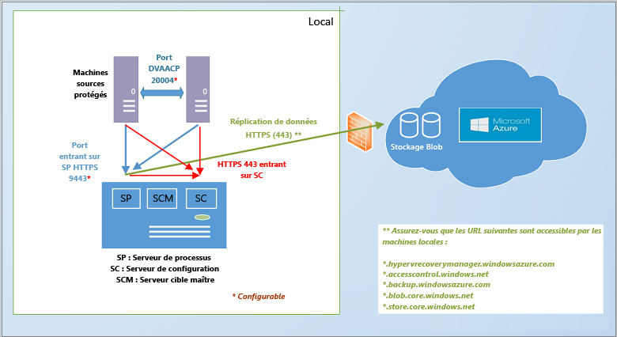

<properties
	pageTitle="Comment Site Recovery fonctionne-t-il ? | Microsoft Azure"
	description="Cet article propose une vue d’ensemble de l’architecture de Site Recovery."
	services="site-recovery"
	documentationCenter=""
	authors="rayne-wiselman"
	manager="jwhit"
	editor=""/>

<tags
	ms.service="site-recovery"
	ms.workload="backup-recovery"
	ms.tgt_pltfrm="na"
	ms.devlang="na"
	ms.topic="get-started-article"
	ms.date="03/27/2016"
	ms.author="raynew"/>

# Comment Azure Site Recovery fonctionne-t-il ?

Lisez cet article pour comprendre l’architecture sous-jacente du service Azure Site Recovery et les composants qui le font fonctionner.

Publiez des commentaires ou des questions au bas de cet article ou sur le [Forum Azure Recovery Services](https://social.msdn.microsoft.com/forums/azure/home?forum=hypervrecovmgr).

## Vue d'ensemble

Les organisations ont besoin d’une stratégie de continuité des activités et de récupération d’urgence qui détermine la façon dont les applications, les charges de travail et les données restent disponibles pendant les temps d’arrêt prévus et imprévus et comment rétablir au plus vite les conditions de travail normales.

Site Recovery est un service Azure qui participe à votre stratégie de continuité des activités et de récupération d’urgence en orchestrant la réplication des machines virtuelles et des serveurs physiques locaux dans le cloud (Azure) ou sur un site secondaire. Quand des pannes se produisent sur votre site principal, vous basculez sur le site secondaire pour préserver la disponibilité des applications et des charges de travail. Vous restaurez votre site principal dès lors qu’il retrouve un fonctionnement normal.

Site Recovery peut être déployé pour orchestrer la réplication dans un certain nombre de scénarios :

- **Réplication des machines virtuelles VMware **: vous pouvez répliquer des machines virtuelles VMware locales dans [Azure](site-recovery-vmware-to-azure-classic.md) ou dans un [centre de données secondaire](site-recovery-vmware-to-vmware.md).
- **Réplication des serveurs physiques** : vous pouvez répliquer des ordinateurs physiques exécutant Windows ou Linux sur [Azure](site-recovery-vmware-to-azure-classic.md) ou un [centre de données secondaire](site-recovery-vmware-to-vmware.md).
- **Réplication des machines virtuelles Hyper-V gérées dans des clouds System Center VMM **: vous pouvez répliquer des machines virtuelles Hyper-V locales dans des clouds VMM en les répliquant dans [Azure](site-recovery-vmm-to-azure.md) ou dans un [centre de données secondaire](site-recovery-vmm-to-vmm.md). 
- **Réplication des machines virtuelles Hyper- V (sans VMM)** : vous pouvez répliquer des machines virtuelles Hyper-V qui ne sont pas gérées dans [Azure](site-recovery-hyper-v-site-to-azure.md).
- **Migration des machines virtuelles** : vous pouvez utiliser Site Recovery pour [migrer des machines virtuelles Azure IaaS](site-recovery-migrate-azure-to-azure.md) entre différentes régions ou pour [migrer des instances AWS Windows](site-recovery-migrate-aws-to-azure.md) vers des machines virtuelles Azure IaaS. Actuellement, seule la migration est prise en charge, ce qui signifie que vous pouvez basculer vers ces machines virtuelles, mais que vous ne pouvez pas les restaurer.

Azure Site Recovery peut répliquer la plupart des applications exécutées sur ces machines virtuelles et ces serveurs physiques. Vous pouvez consulter la page [Quelles charges de travail pouvez-vous protéger avec Azure Site Recovery ?](site-recovery-workload.md) pour obtenir un récapitulatif complet des applications prises en charge.

## Répliquer des machines virtuelles VMware locales ou des serveurs physiques dans Azure

Il existe actuellement deux architectures différentes pour la réplication des machines virtuelles VMware ou des serveurs physiques Windows/Linux dans Azure :

- [Architecture héritée](site-recovery-vmware-to-azure-classic-legacy.md) : cette architecture ne doit pas être utilisée pour les nouveaux déploiements. 
- [Architecture améliorée ](site-recovery-vmware-to-azure-classic.md): cette toute dernière architecture doit être utilisée pour tous les nouveaux déploiements. Si vous avez déjà déployé ce scénario à l’aide de l’architecture héritée [en savoir plus sur la migration](site-recovery-vmware-to-azure-classic-legacy.md#migrate-to-the-enhanced-deployment) vers le déploiement amélioré.

Dans le déploiement amélioré, vous devez configurer un serveur d’administration locale avec tous les composants de Site Recovery. Vous distribuez automatiquement (ou installez manuellement) le service Mobilité sur chaque machine que vous voulez protéger. Après la réplication initiale, le service Mobilité de l’ordinateur envoie les données de réplication différentielle au serveur de traitement, qui l’optimise avant l’envoi vers le stockage Azure.

 

### Au niveau local
Voici ce dont vous aurez besoin en local :

- **Serveur de d’administration** : vous aurez besoin d’un ordinateur Windows Server 2012 R2 pour jouer le rôle du serveur d’administration. Sur ce serveur, vous devez installer tous ces composants Site Recovery à l’aide d’un seul fichier d’installation :

	- **Composant du serveur de configuration** : coordonne la communication entre votre environnement local et Azure et gère la réplication et la récupération des données.
	- **Composant du serveur de traitement** : fait office de passerelle de réplication. Il reçoit les données de réplication d’ordinateurs source protégés, les optimise grâce à la mise en cache, la compression et le chiffrement et envoie les données vers le stockage Azure. Il gère également l’installation Push du service Mobilité sur des machines protégées et assure la détection automatique des machines virtuelles VMware. À mesure que s’étend votre déploiement, vous pouvez ajouter des serveurs de traitement dédiés supplémentaires afin de gérer de plus grands volumes de trafic de réplication.
	- **Composant du serveur cible maître** : gère les données de réplication pendant la restauration automatique à partir d’Azure. 
- **Hôtes VMware ESX/ESXi et serveur vCenter** : vous aurez besoin d’un ou de plusieurs serveurs hôtes ESX/ESXi sur lesquels s’exécutent des machines virtuelles VMware. Nous vous recommandons de déployer un serveur vCenter pour gérer ces hôtes. **Remarque :** **même si vous répliquez des serveurs physiques, vous devez les restaurer automatiquement sur VMware**. Lorsque vous répliquez un serveur physique, celui-ci s’exécute comme une machine virtuelle Azure lorsque vous basculez vers Azure. Il est restauré en local comme machine virtuelle VMware. 
	
- **Machines virtuelles/Serveurs physiques** : le composant du service Mobilité doit être installé sur chaque ordinateur que vous souhaitez répliquer dans Azure. Ce service enregistre les écritures de données sur la machine et les transmet au serveur de traitement. Ce composant peut être installé manuellement ou transféré et installé automatiquement par le serveur de traitement lorsque vous activez la réplication d’une machine.

### Microsoft Azure

Voici ce dont vous aurez besoin dans l’infrastructure Azure :- **Compte Azure** : vous devez disposer d’un compte Microsoft Azure. - **Stockage Azure** : vous devez posséder un compte de stockage Azure pour stocker les données répliquées. Les données répliquées sont stockées dans le stockage Azure et les machines virtuelles Azure sont lancées lors du basculement. - **Réseau azure** : vous avez besoin d’un réseau virtuel auquel les machines virtuelles Azure se connectent lors du basculement.
	
	
### Restauration automatique

La restauration automatique en local s’effectue toujours sur des machines virtuelles VMware, même si vous avez basculé vers un serveur physique. Voici ce dont vous aurez besoin :

- **Serveur de traitement temporaire dans Azure** : si vous souhaitez effectuer une restauration automatique à partir d’Azure après le basculement, vous devez définir une machine virtuelle Azure configurée comme serveur de traitement pour gérer la réplication à partir d’Azure. Vous pourrez supprimer cette machine virtuelle une fois la restauration terminée.
- **Connexion VPN** : pour une restauration automatique, vous devrez disposer d’une connexion VPN (ou d’Azure ExpressRoute) configurée à partir du réseau Azure sur le site local.
- **Serveur cible maître local distinct** : le serveur cible maître local gère la restauration automatique. Le serveur cible maître est installé par défaut sur le serveur d’administration. Toutefois, si vous restaurez automatiquement de plus grands volumes de trafic vous devez définir un serveur cible maître local à cet effet. 

[En savoir plus](site-recovery-vmware-to-azure-classic.md#before-you-start-deployment) sur les exigences relatives au déploiement amélioré. [En savoir plus](site-recovery-failback-azure-to-vmware-classic.md) sur la restauration automatique pour le déploiement amélioré.

## Répliquer des machines virtuelles Hyper-V dans des clouds VMM vers Azure.

Pour déployer ce scénario au cours d’un déploiement de Site Recovery, le fournisseur Site Recovery est installé sur le serveur VMM. Le fournisseur coordonne et orchestre la réplication avec le service Site Recovery via Internet. L’agent Azure Recovery Services est installé au cours du déploiement de Site Recovery sur le serveur hôte Hyper-V et les données sont répliquées entre celui-ci et le stockage Azure via HTTPS 443. Les communications en provenance du fournisseur et de l’agent sont sécurisées et chiffrées. Les données répliquées dans le stockage Azure sont également chiffrées.

- En local : 
	- **Serveur VMM** : au moins un serveur VMM configuré avec au moins un cloud privé VMM. Le serveur doit s’exécuter sur System Center 2012 R2 et doit disposer d’une connexion à Internet. Si vous souhaitez vous assurer que les machines virtuelles Azure sont bien connectées à un réseau après le basculement, vous devez configurer le mappage réseau. Pour ce faire, vos machines virtuelles sources doivent être connectées à un réseau de machines virtuelles VMM. Ce réseau de machines virtuelles doit être lié à un réseau logique lui-même associé au cloud.
	- **Serveur Hyper-V** : au moins un serveur hôte Hyper-V hébergé dans le cloud VMM. Les hôtes Hyper-V doivent exécuter Windows Server 2012 R2.
	- **Machines protégées** : le serveur hôte Hyper-V source doit avoir au moins une machine virtuelle à protéger.
	
- Azure :
	- **Compte Azure** : vous devez disposer d’un compte Microsoft Azure.
	- **Stockage Azure** : vous aurez besoin d’un compte de stockage Azure pour stocker les données répliquées. Les données répliquées sont stockées dans le stockage Azure et les machines virtuelles Azure sont lancées au moment du basculement.
	- **Réseau Azure** : si vous souhaitez configurer un mappage de réseau pour vous assurer que les machines virtuelles Azure sont bien connectées à des réseaux après le basculement, vous devez configurer un réseau Azure.

	

En savoir plus sur les [exigences relatives au déploiement](site-recovery-vmm-to-azure.md#before-you-start).

## Répliquer des machines virtuelles VMware ou des serveurs physiques dans un site secondaire

Pour répliquer des machines virtuelles VMware ou des serveurs physiques Windows/Linux sur un site secondaire, vous allez télécharger InMage Scout inclus dans l’abonnement Azure Site Recovery. Vous configurez les serveurs de composants dans chaque site (configuration, processus, cible maître) et installez l’Agent unifié sur les ordinateurs que vous souhaitez répliquer. Après la réplication initiale, l’agent de chaque ordinateur envoie les modifications de réplication différentielle au serveur de traitement. Le serveur de traitement optimise ces données et les transfère vers le serveur cible maître du site secondaire. Le serveur de configuration gère le processus de réplication.

### Site principal en local

- **Serveur de traitement** : installez le composant serveur de traitement sur votre site principal pour gérer la mise en cache, la compression et l’optimisation des données. Il gère aussi l’installation Push de l’Agent unifié sur les machines à protéger. 
- **Hyperviseur VMware ESX/ESXi et serveur vCenter** : si vous protégez des machines virtuelles VMware, vous aurez besoin d’un hyperviseur VMware ESX/ESXi et éventuellement d’un serveur VMware vCenter capable de gérer des hyperviseurs.
- **Machines virtuelles/Serveurs physiques** : l’Agent unifié doit être installé sur les machines virtuelles VMware ou les serveurs physiques Windows/Linux que vous souhaitez protéger. Cet agent est également installé sur les ordinateurs servant de serveur cible maître. Il joue le rôle de fournisseur de communication entre tous les composants. 
	
### Site secondaire en local
 
- **Serveur de configuration** : le serveur de configuration est le premier composant installé. Vous l’installez sur le site secondaire pour gérer, configurer et surveiller votre déploiement via le site web de gestion ou la console vContinuum. Chaque déploiement ne comporte qu’un seul serveur de configuration, qui doit être installé sur un ordinateur exécutant Windows Server 2012 R2.
- **Serveur vContinuum** : installé au même emplacement (site secondaire) que le serveur de configuration. Il intègre une console qui vous permet de gérer et surveiller votre environnement protégé. Dans une installation par défaut, le serveur vContinuum est le premier serveur cible maître et l’Agent unifié y est installé.
- **Serveur cible maître** : le serveur cible maître stocke les données répliquées. Il reçoit les données du serveur de traitement, crée une machine de réplication sur le site secondaire et stocke les points de rétention des données. Le nombre de serveurs cibles maîtres dont vous avez besoin dépend du nombre de machines que vous protégez. Si vous voulez effectuer une restauration sur le site principal, vous aurez là aussi besoin d’un serveur cible maître. 

### Microsoft Azure

Vous déployez ce scénario à l’aide d’InMage Scout. Pour l’obtenir, vous avez besoin d’un abonnement Azure. Après avoir créé un coffre Site Recovery, téléchargez InMage Scout et installez les dernières mises à jour pour configurer le déploiement.

## Répliquer des machines virtuelles Hyper-V dans Azure (sans VMM)

Pour répliquer des machines virtuelles Hyper-V qui ne sont pas gérées dans des clouds VMM dans Azure, vous devez installer le fournisseur Azure Site Recovery et l’agent Azure Recovery Services sur l’hôte Hyper-V lors du déploiement de Site Recovery. Le fournisseur coordonne et orchestre la réplication avec le service Site Recovery via Internet. L’agent gère les données de réplication de données via HTTPS 443. Les communications en provenance du fournisseur et de l’agent sont sécurisées et chiffrées. Les données répliquées dans le stockage Azure sont également chiffrées.

### Au niveau local

- **Serveur Hyper-V** : au moins un serveur hôte Hyper-V. Les hôtes Hyper-V doivent exécuter Windows Server 2012 R2.
- **Machines protégées** : le serveur hôte Hyper-V source doit avoir au moins une machine virtuelle à protéger.
	
### Microsoft Azure

- **Compte Azure** : vous devez disposer d’un compte Microsoft Azure.
- **Stockage Azure** : vous aurez besoin d’un compte de stockage Azure pour stocker les données répliquées. Les données répliquées sont stockées dans le stockage Azure et les machines virtuelles Azure sont lancées au moment du basculement.

[En savoir plus](site-recovery-hyper-v-site-to-azure.md#before-you-start) sur les exigences relatives au déploiement.

## Répliquer des machines virtuelles Hyper-V dans des clouds VMM vers Azure.

Pour déployer ce scénario au cours d’un déploiement de Site Recovery, vous devez installer le fournisseur Azure Site Recovery sur le serveur VMM et l’agent Azure Recovery Services sur l’hôte Hyper-V. Le fournisseur coordonne et orchestre la réplication avec le service Site Recovery via Internet. L’agent gère les données de réplication de données via HTTPS 443. Les communications en provenance du fournisseur et de l’agent sont sécurisées et chiffrées. Les données répliquées dans le stockage Azure (au repos) sont également chiffrées.

### Au niveau local

- **Serveur VMM** : au moins un serveur VMM configuré avec au moins un cloud privé VMM. Le serveur doit s’exécuter sur System Center 2012 R2 et doit disposer d’une connexion à Internet. Si vous souhaitez vous assurer que les machines virtuelles Azure sont bien connectées à un réseau après le basculement, vous devez configurer le mappage réseau. Pour ce faire, vous devez connecter les machines virtuelles sources à un réseau de machines virtuelles VMM. Ce réseau doit être lié à un réseau logique lui-même associé au cloud.
- **Serveur Hyper-V** : au moins un serveur hôte Hyper-V hébergé dans le cloud VMM. Les hôtes Hyper-V doivent exécuter Windows Server 2012 R2.
- **Machines protégées** : le serveur hôte Hyper-V source doit avoir au moins une machine virtuelle à protéger.
	
### Microsoft Azure

- **Compte Azure** : vous devez disposer d’un compte Microsoft Azure.
- **Stockage Azure** : vous aurez besoin d’un compte de stockage Azure pour stocker les données répliquées. Les données répliquées sont stockées dans le stockage Azure et les machines virtuelles Azure sont lancées au moment du basculement.
- **Réseau Azure** : si vous souhaitez vous assurer que les machines virtuelles Azure sont bien connectées à des réseaux après le basculement, vous devez configurer le mappage réseau. Pour ce faire, vous devez disposer d’un réseau Azure.

[En savoir plus](site-recovery-vmm-to-azure.md#before-you-start) sur les exigences relatives au déploiement.

## Répliquer des machines virtuelles Hyper-V sur un centre de données secondaire

Pour déployer ce scénario au cours d’un déploiement d’Azure Site Recovery, le fournisseur Site Recovery est installé sur le serveur VMM. Le fournisseur coordonne et orchestre la réplication avec le service Site Recovery via Internet. Les données sont répliquées entre les serveurs hôtes Hyper-V principal et secondaire via une liaison LAN ou VPN en utilisant Kerberos ou une authentification par certificat. Les communications en provenance du fournisseur et celles échangées entre les serveurs hôtes Hyper-V sont sécurisées et chiffrées.

### Au niveau local

- **Serveur VMM** : nous recommandons un serveur VMM sur le site principal et un sur le site secondaire, chacun contenant au moins un cloud privé VMM. Le serveur doit exécuter au moins System Center 2012 SP1 avec les dernières mises à jour et être connecté à Internet. Le profil de capacité Hyper-V doit être défini sur les clouds.
- **Serveur Hyper-V** : serveurs hôtes Hyper-V situés dans les clouds VMM principaux et secondaires. Les serveurs hôtes doivent exécuter au moins Windows Server 2012 avec les dernières mises à jour installées, et être connectés à Internet.
- **Machines protégées** : le serveur hôte Hyper-V source doit avoir au moins une machine virtuelle à protéger.
	
### Microsoft Azure

Vous avez besoin d’un abonnement Azure.

[En savoir plus](site-recovery-vmm-to-vmm.md#before-you-start) sur les exigences relatives au déploiement.

## Répliquer des machines virtuelles Hyper-V sur un centre de données secondaire avec la réplication SAN

Pour déployer ce scénario au cours d’un déploiement de Site Recovery, le fournisseur Azure Site Recovery est installé sur les serveurs VMM. Le fournisseur coordonne et orchestre la réplication avec le service Site Recovery via Internet. Les données sont répliquées entre les groupes de stockage principal et secondaire en utilisant la réplication SAN synchrone.

### Au niveau local

- **Groupe SAN** : un [groupe SAN pris en charge](http://social.technet.microsoft.com/wiki/contents/articles/28317.deploying-azure-site-recovery-with-vmm-and-san-supported-storage-arrays.aspx) géré par le serveur VMM principal. Le SAN partage une infrastructure réseau avec une autre baie de stockage SAN dans le site secondaire.
- **Serveur VMM** : nous recommandons un serveur VMM sur le site principal et un sur le site secondaire, chacun contenant au moins un cloud privé VMM. Le serveur doit exécuter au moins System Center 2012 SP1 avec les dernières mises à jour et être connecté à Internet. Le profil de capacité Hyper-V doit être défini sur les clouds.
- **Serveur Hyper-V** : serveurs hôtes Hyper-V situés dans les clouds VMM principaux et secondaires. Les serveurs hôtes doivent exécuter au moins Windows Server 2012 avec les dernières mises à jour installées, et être connectés à Internet.
- **Machines protégées** : le serveur hôte Hyper-V source doit avoir au moins une machine virtuelle à protéger.
	
### Microsoft Azure

Vous avez besoin d’un abonnement Azure.

[En savoir plus](site-recovery-vmm-san.md#before-you-start) sur les exigences relatives au déploiement.

## Cycle de vie de la protection Hyper-V

Ce flux de travail présente le processus de protection, de réplication et de basculement des machines virtuelles Hyper-V.

1. **Activer la protection** : installez le coffre Site Recovery, configurez les paramètres de réplication d’un cloud VMM ou d’un site Hyper-V, puis activez la protection des machines virtuelles. Un travail appelé **Activer la protection** est initiée et peut être surveillée sous l’onglet **Travaux**. Le travail vérifie que la machine est conforme à la configuration requise et appelle ensuite la méthode [CreateReplicationRelationship](https://msdn.microsoft.com/library/hh850036.aspx), laquelle configure la réplication vers Azure avec les paramètres que vous avez configurés. Le travail **Activer la protection** appelle aussi la méthode [StartReplication](https://msdn.microsoft.com/library/hh850303.aspx) pour initialiser une réplication complète des machines virtuelles.
2. **Réplication initiale** : un instantané de machine virtuelle est créé et les disques durs virtuels sont répliqués un par un jusqu’à ce qu’ils soient tous copiés dans Azure ou sur le centre de données secondaire. La durée de cette opération dépend de la taille de la machine virtuelle, de la bande passante réseau et de la méthode de réplication initiale que vous avez choisie. Si des modifications interviennent sur les disques pendant la réplication initiale, le dispositif de suivi de réplication des réplicas Hyper-V assure le suivi de ces modifications dans des journaux de réplication Hyper-V (.hrl), qui se trouvent dans le même dossier que les disques. À chaque disque correspond un fichier .hrl, qui est envoyé au stockage secondaire. Notez que l’instantané et les fichiers journaux consomment des ressources disque pendant la réplication initiale. À la fin de la réplication initiale, l’instantané de machine virtuelle est supprimé et les modifications de disque delta figurant dans le journal sont synchronisées et fusionnées.
3. **Finaliser la protection** : une fois la réplication initiale terminée, le travail **Finaliser la protection** configure les paramètres réseau et d’autres paramètres de post-réplication de sorte que la machine virtuelle soit protégée. Si vous répliquez dans Azure, vous devrez peut-être modifier les paramètres de la machine virtuelle pour la préparer au basculement. À ce stade, vous pouvez exécuter un basculement de test pour vérifier que tout fonctionne comme prévu.
4. **Réplication** : la synchronisation delta commence à l’issue de la réplication initiale, selon les paramètres de réplication. 
	- **Échec de la réplication** : si la réplication différentielle échoue et qu’une réplication complète serait coûteuse en bande passante et en temps, une resynchronisation se produit. Par exemple, si les fichiers .hrl atteignent 50 % de la taille du disque, la machine virtuelle est marquée pour resynchronisation. La resynchronisation réduit la quantité de données envoyées par le calcul des sommes de contrôle des machines virtuelles source et cible et l’envoi du seul delta. Une fois la resynchronisation terminée, la réplication différentielle doit reprendre. Par défaut, la resynchronisation est planifiée pour s’exécuter automatiquement en dehors des heures de bureau, mais vous pouvez resynchroniser une machine virtuelle manuellement.
	- **Erreur de réplication** : si une erreur de réplication se produit, une nouvelle tentative intégrée se produit. S’il s’agit d’une erreur non récupérable, telle qu’une erreur d’authentification ou d’autorisation ou qu’une machine de réplication est dans un état non valide, aucune nouvelle tentative n’intervient. S’il s’agit d’une erreur récupérable, par exemple une erreur réseau ou un manque d’espace disque ou de mémoire, une nouvelle tentative se produit à intervalles croissants (après 1, 2, 4, 8 et 10 minutes, puis toutes les 30 minutes).
4. **Basculements planifiés/non planifiés** : exécutez des basculements planifiés/non planifiés quand cela est nécessaire. Si vous exécutez un basculement planifié, les machines virtuelles sources sont arrêtées pour éviter toute perte de données. Une fois créées, les machines virtuelles de réplication sont en attente de validation. Vous devez les valider pour terminer le basculement, sauf si vous effectuez une réplication avec SAN, auquel cas, la validation est automatique. Dès lors que le site principal est opérationnel, la restauration peut intervenir. Si vous répliquez dans Azure, la réplication inverse est automatique. Dans le cas contraire, vous devez lancer manuellement une réplication inverse.
 

## Étapes suivantes

[Préparer le déploiement](site-recovery-best-practices.md)

<!---HONumber=AcomDC_0330_2016-->