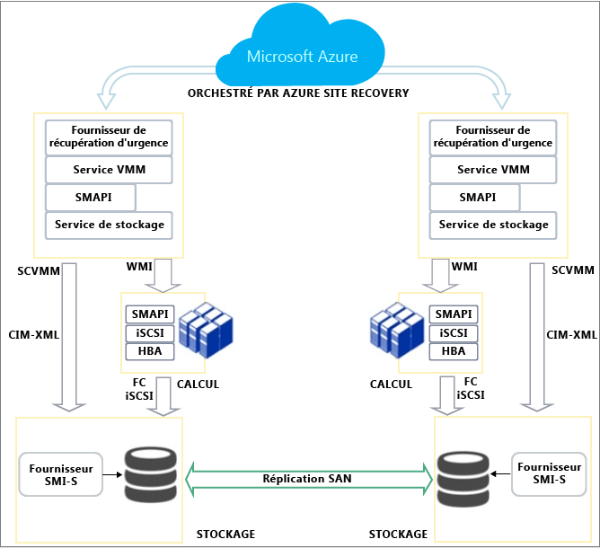

<properties
	pageTitle="Comment Azure Site Recovery fonctionne-t-il ?"
	description="Cet article propose une vue d’ensemble de l’architecture de Site Recovery."
	services="site-recovery"
	documentationCenter=""
	authors="rayne-wiselman"
	manager="jwhit"
	editor=""/>

<tags
	ms.service="site-recovery"
	ms.workload="backup-recovery"
	ms.tgt_pltfrm="na"
	ms.devlang="na"
	ms.topic="get-started-article"
	ms.date="11/29/2015"
	ms.author="raynew"/>

# Comment Azure Site Recovery fonctionne-t-il ?

## À propos de cet article

Cet article décrit l’architecture sous-jacente de Site Recovery et des composants qui le font fonctionner. Après avoir lu cet article, vous pourrez poser des questions sur le [forum Azure Recovery Services](https://social.msdn.microsoft.com/forums/azure/home?forum=hypervrecovmgr).

## Vue d’ensemble

Les organisations ont besoin d’une stratégie de continuité des activités et de récupération d’urgence qui détermine la façon dont les applications, les charges de travail et les données restent disponibles pendant les temps d’arrêt prévus et imprévus et comment rétablir au plus vite les conditions de travail normales. Une telle stratégie repose principalement sur des solutions qui visent à sécuriser et à récupérer les données d’entreprise et à rendre les charges de travail disponibles en continu quand un incident se produit.

Site Recovery est un service Azure qui participe à votre stratégie de continuité des activités et de récupération d’urgence en orchestrant la réplication des machines virtuelles et des serveurs physiques locaux dans le cloud (Azure) ou sur un centre de données secondaire. Quand des pannes se produisent sur votre site principal, vous basculez sur le site secondaire pour préserver la disponibilité des applications et des charges de travail. Vous restaurez votre site principal dès lors qu’il retrouve un fonctionnement normal.

Site Recovery peut être utilisé dans plusieurs scénarios et peut protéger plusieurs charges de travail.

- **Protection des machines virtuelles VMware** : vous pouvez protéger des machines virtuelles VMware locales en les répliquant sur Azure ou un centre de données secondaire.- **Protection des machines virtuelles Hyper-V** : vous pouvez protéger des machines virtuelles Hyper-V locales en les répliquant dans le cloud (Azure) ou sur un centre de données secondaire.  
- **Protection des serveurs physiques** : vous pouvez protéger des ordinateurs physiques exécutant Windows ou Linux en les répliquant sur Azure ou un centre de données secondaire.
- **Migration des machines virtuelles** : vous pouvez utiliser Site Recovery pour migrer des machines virtuelles Azure IaaS entre différentes régions ou pour migrer des instances AWS Windows vers des machines virtuelles Azure IaaS.

Vous pouvez obtenir un récapitulatif complet des déploiements pris en charge dans les articles [Vue d’ensemble de Microsoft Azure Site Recovery](site-recovery-overview.md) et [Aide relative à la charge de travail Site Recovery](site-recovery-workload.md).

## Répliquer entre un serveur physique local ou une machine virtuelle VMware et Azure

Si vous voulez protéger des machines virtuelles VMware ou des ordinateurs physiques Windows/Linux en les répliquant sur Azure, voici ce dont vous avez besoin.

**Emplacement** | **Ce dont vous avez besoin** 
--- | --- 
 Local | **Serveur de traitement** : ce serveur optimise les données des machines virtuelles VMware ou des ordinateurs physiques Linux/Windows protégés avant de les envoyer vers Azure. Il gère aussi l’installation Push du composant du service Mobilité sur la machine protégée et assure une détection automatique des machines virtuelles VMware.    **Serveur VMware vCenter** : si vous protégez des machines virtuelles VMware, vous avez besoin d’un serveur VMwave vCenter qui gère vos hyperviseurs vSphere.   **Serveur ESX** : si vous protégez des machines virtuelles VMware, vous avez besoin d’un serveur exécutant ESX/ESXi version 5.1 ou 5.5 avec les dernières mises à jour.   **Machines** : si vous protégez VMware, vous devez disposer de machines virtuelles VMware avec les outils VMware installés et en cours d’exécution. Si vous protégez des ordinateurs physiques, ils doivent exécuter un système d’exploitation Windows ou Linux pris en charge. Voyez [ce qui est pris en charge](site-recovery-vmware-to-azure/#before-you-start).    **Service Mobilité** : s’installe sur les machines que vous voulez protéger pour capturer les modifications et les communiquer au serveur de traitement.   Composants tiers : ce déploiement dépend de certains [composants tiers](http://download.microsoft.com/download/C/D/7/CD79E327-BF5A-4026-8FF4-9EB990F9CEE2/Third-Party_Notices.txt).
Microsoft Azure | **Serveur de configuration **: machine virtuelle A3 Azure standard qui coordonne la communication entre les machines protégées, le serveur de traitement et les serveurs cibles maîtres dans Azure. Il configure la réplication et coordonne la récupération quand un basculement intervient.   **Serveur cible maître** : machine virtuelle Azure qui stocke les données répliquées à partir des machines protégées en utilisant des disques durs virtuels attachés, créés sur le stockage d’objets blob de votre compte de stockage Azure. Un serveur cible maître de restauration s’exécute en local pour vous permettre de restaurer des machines virtuelles Azure en machines virtuelles VMware.    **Coffre Site Recovery** : au moins un coffre Azure Site Recovery (installé avec un abonnement au service Site Recovery)    **Réseau virtuel** : réseau Azure sur lequel sont situés le serveur de configuration et les serveurs cibles maîtres, dans le même abonnement et la même région que le service Site Recovery.    **Stockage Azure** : compte de stockage Azure destiné à stocker les données répliquées. Il doit s’agir d’un compte géo-redondant standard ou premium de la même région que l’abonnement Site Recovery.

Dans ce scénario, des communications peuvent se produire entre une connexion VPN et les ports internes du réseau Azure (à l’aide d’Azure ExpressRoute ou d’un réseau VPN de site à site) ou entre une connexion Internet sécurisée et les points de terminaison public mappés du service cloud Azure pour les machines virtuelles des serveurs cibles maîtres et de configuration.

Le service Mobilité s’exécutant sur les machines protégées envoie les données de réplication au serveur de traitement et envoie les métadonnées de réplication au serveur de configuration. Le serveur de traitement communique avec le serveur de configuration pour les informations de gestion et de contrôle. Il envoie des informations de réplication au serveur cible maître puis optimise et envoie les données répliquées au serveur cible maître.

## Réplication de machines virtuelles Hyper-V dans Azure (avec VMM)

Si vos machines virtuelles se trouvent sur un hôte Hyper-V géré dans un cloud System Center VMM, voici ce dont vous avez besoin pour les répliquer dans Azure.

**Emplacement** | **Ce dont vous avez besoin** 
--- | --- 
Local | **Serveur VMM** : au moins un serveur VMM configuré avec au moins un cloud privé VMM. Le fournisseur Azure Site Recovery doit être installé sur chaque serveur VMM.  **Serveur Hyper-V** : au moins un serveur hôte Hyper-V situé dans le cloud VMM. L’agent Microsoft Recovery Services doit être installé sur chaque serveur Hyper-V.    **Machines virtuelles** : au moins une machine virtuelle s’exécutant sur le serveur Hyper-V. Rien n’est installé sur la machine virtuelle.
Microsoft Azure | **Coffre site Recovery** : au moins un coffre Azure Site Recovery (configuré avec un abonnement au service Site Recovery).   **Compte de stockage** : compte de stockage Azure relevant du même abonnement que le service Site Recovery. Les machines répliquées sont stockées dans le stockage Azure. 

Dans ce scénario, le fournisseur s’exécutant sur le serveur VMM coordonne et orchestre la réplication avec le service Site Recovery via Internet. Les données sont répliquées entre l’agent Recovery Services s’exécutant sur le serveur Hyper-V local et le stockage Azure via HTTPS 443. Les communications en provenance du fournisseur et de l’agent sont sécurisées et chiffrées. Les données répliquées dans le stockage Azure sont également chiffrées.

## Réplication de machines virtuelles Hyper-V dans Azure (sans VMM)

Si vos machines virtuelles ne sont pas gérées par un serveur System Center VMM, voici ce que vous devez faire pour les répliquer dans Azure.

**Emplacement** | **Ce dont vous avez besoin**
--- | --- 
 Local | **Serveur Hyper-V** : au moins un serveur hôte Hyper-V. Le fournisseur Azure Site Recovery et l’agent Microsoft Recovery Services doivent être installés sur chaque serveur Hyper-V.   **Machines virtuelles** : au moins une machine virtuelle s’exécutant sur le serveur Hyper-V. Rien n’est installé sur la machine virtuelle.
Microsoft Azure | **Coffre site Recovery** : au moins un coffre Azure Site Recovery (configuré avec un abonnement au service Site Recovery).   **Compte de stockage** : compte de stockage Azure relevant du même abonnement que le service Site Recovery. Les machines répliquées sont stockées dans le stockage Azure.

Dans ce scénario, le fournisseur s’exécutant sur le serveur Hyper-V coordonne et orchestre la réplication avec le service Site Recovery via Internet. Les données sont répliquées entre l’agent Recovery Services s’exécutant sur le serveur Hyper-V local et le stockage Azure via HTTPS 443. Les communications en provenance du fournisseur et de l’agent sont sécurisées et chiffrées. Les données répliquées dans le stockage Azure sont également chiffrées.

## Répliquer des machines virtuelles Hyper-V sur un centre de données secondaire

Si vous souhaitez protéger vos machines virtuelles Hyper-V en les répliquant sur un centre de données secondaire, voici ce que vous devez faire. À noter que ces instructions ne valent que si votre serveur hôte Hyper-V est géré dans un cloud System Center VMM.

**Emplacement** | **Ce dont vous avez besoin** 
--- | --- 
 Local | **Serveur VMM** : un serveur VMM sur le site principal et un autre sur le site secondaire. Le fournisseur Azure Site Recovery doit être installé sur chaque serveur VMM.  **Serveur Hyper-V** : au moins un serveur hôte Hyper-V situé dans un cloud VMM sur les sites principal et secondaire. Rien n’est installé sur les serveurs Hyper-V.    **Machines virtuelles** : au moins une machine virtuelle s’exécutant sur le serveur Hyper-V. Rien n’est installé sur la machine virtuelle.
Microsoft Azure | **Coffre Site Recovery** : au moins un coffre Azure Site Recovery (configuré avec un abonnement au service Site Recovery). 

Dans ce scénario, le fournisseur s’exécutant sur le serveur VMM coordonne et orchestre la réplication avec le service Site Recovery via Internet. Les données sont répliquées entre les serveurs hôtes Hyper-V principal et secondaire via Internet en utilisant Kerberos ou une authentification par certificat. Les communications en provenance du fournisseur et celles échangées entre les serveurs hôtes Hyper-V sont sécurisées et chiffrées.

## Répliquer des machines virtuelles Hyper-V sur un centre de données secondaire avec la réplication SAN

Si vos machines virtuelles se trouvent sur un hôte Hyper-V géré dans un cloud System Center VMM et que vous utilisez un stockage SAN, voici ce dont vous avez besoin pour effectuer une réplication entre deux centres de données.

**Emplacement** | **Ce dont vous avez besoin** 
--- | --- 
 Centre de données principal | **Groupe SAN** : un [groupe SAN pris en charge](http://social.technet.microsoft.com/wiki/contents/articles/28317.deploying-azure-site-recovery-with-vmm-and-san-supported-storage-arrays.aspx) géré par le serveur VMM principal. Le SAN partage une infrastructure réseau avec un autre groupe SAN du site secondaire.    **Serveur VMM** : au moins un serveur VMM avec un ou plusieurs clouds VMM et des groupes de réplication configurés. Le fournisseur Azure Site Recovery doit être installé sur chaque serveur VMM.    **Serveur Hyper-V** : au moins un serveur hôte Hyper-V avec des machines virtuelles, situé dans un groupe de réplication. Rien n’est installé sur les serveurs hôtes Hyper-V.   **Machines virtuelles** : au moins une machine virtuelle s’exécutant sur le serveur hôte Hyper-V. Rien n’est installé sur la machine virtuelle. 
Centre de données secondaire | **Groupe SAN** : un [groupe SAN pris en charge](http://social.technet.microsoft.com/wiki/contents/articles/28317.deploying-azure-site-recovery-with-vmm-and-san-supported-storage-arrays.aspx) géré par le serveur VMM secondaire.   **Serveur VMM** : au moins un serveur VMM avec un ou plusieurs clouds VMM.   **Serveur Hyper-V** : au moins un serveur hôte Hyper-V. 
Microsoft Azure | **Coffre Site Recovery** : au moins un coffre Azure Site Recovery (configuré avec un abonnement au service Site Recovery).

Dans ce scénario, le fournisseur s’exécutant sur le serveur VMM coordonne et orchestre la réplication avec le service Site Recovery via Internet. Les données sont répliquées entre les groupes de stockage principal et secondaire en utilisant la réplication SAN synchrone.

## Cycle de vie de la protection Hyper-V

Ce flux de travail présente le processus de protection, de réplication et de basculement des machines virtuelles Hyper-V.

1. **Activer la protection** : installez le coffre Site Recovery, configurez les paramètres de réplication d’un cloud VMM ou d’un site Hyper-V, puis activez la protection des machines virtuelles. Un travail appelé **Activer la protection** est initiée et peut être surveillée sous l’onglet **Travaux**. Le travail vérifie que la machine est conforme à la configuration requise et appelle ensuite la méthode [CreateReplicationRelationship](https://msdn.microsoft.com/library/hh850036.aspx), laquelle configure la réplication vers Azure avec les paramètres que vous avez configurés. Le travail **Activer la protection** appelle aussi la méthode [StartReplication](https://msdn.microsoft.com/library/hh850303.aspx) pour initialiser une réplication complète des machines virtuelles.
2. **Réplication initiale** : un instantané de machine virtuelle est créé et les disques durs virtuels sont répliqués un par un jusqu’à ce qu’ils soient tous copiés dans Azure ou sur le centre de données secondaire. La durée de cette opération dépend de la taille, de la bande passante réseau et de la méthode de réplication initiale que vous avez choisie. Si des modifications interviennent sur les disques pendant la réplication initiale, le dispositif de suivi de réplication des réplicas Hyper-V assure le suivi de ces modifications dans des journaux de réplication Hyper-V (.hrl), qui se trouvent dans le même dossier que les disques. À chaque disque correspond un fichier .hrl, qui est envoyé au stockage secondaire. Notez que l’instantané et les fichiers journaux consomment des ressources disque pendant la réplication initiale. À la fin de la réplication initiale, l’instantané de machine virtuelle est supprimé et les modifications de disque delta figurant dans le journal sont synchronisées et fusionnées.
3. **Finaliser la protection** : une fois la réplication initiale terminée, le travail **Finaliser la protection** configure les paramètres réseau et d’autres paramètres de post-réplication et la machine virtuelle est protégée. Si vous répliquez dans Azure, vous devrez peut-être modifier les paramètres de la machine virtuelle pour la préparer au basculement. À ce stade, vous pouvez exécuter un basculement de test pour vérifier que tout fonctionne comme prévu.
4. **Réplication** : à l’issue de la réplication différentielle, la synchronisation se produit, selon les paramètres de réplication et la méthode. 
	- **Échec de la réplication** : si la réplication différentielle échoue et qu’une réplication complète serait coûteuse en bande passante et en temps, une resynchronisation se produit. Par exemple, si les fichiers .hrl atteignent 50 % de la taille du disque, la machine virtuelle est marquée pour resynchronisation. La resynchronisation réduit la quantité de données envoyées par le calcul des sommes de contrôle des machines virtuelles source et cible et l’envoi du seul delta. Une fois la resynchronisation terminée, la réplication différentielle doit reprendre. Par défaut, la resynchronisation est planifiée pour s’exécuter automatiquement en dehors des heures de bureau, mais vous pouvez resynchroniser une machine virtuelle manuellement.
	- **Erreur de réplication** : si une erreur de réplication se produit, une nouvelle tentative intégrée se produit. S’il s’agit d’une erreur non récupérable, telle qu’une erreur d’authentification ou d’autorisation ou qu’une machine de réplication est dans un état non valide, aucune nouvelle tentative n’intervient. S’il s’agit d’une erreur récupérable, par exemple une erreur réseau ou un manque d’espace disque ou de mémoire, une nouvelle tentative se produit à intervalles croissants (après 1, 2, 4, 8 et 10 minutes, puis toutes les 30 minutes).
4. **Basculements planifiés/non planifiés** : exécutez des basculements planifiés/non planifiés quand cela est nécessaire. Si vous exécutez un basculement planifié, les machines virtuelles sources sont arrêtées pour éviter toute perte de données. Une fois créées, les machines virtuelles de réplication sont en attente de validation. Vous devez les valider pour terminer le basculement, sauf si vous effectuez une réplication avec SAN, auquel cas, la validation est automatique. Dès lors que le site principal est opérationnel, la restauration peut intervenir. Si vous répliqué dans Azure, la réplication inverse est automatique. Dans le cas contraire, vous devez lancer une réplication inverse.
 

## Répliquer des machines virtuelles VMware et des serveurs physiques sur Azure

Vous pouvez répliquer des machines virtuelles VMware et des serveurs physiques (Windows/Linux) dans Azure via une connexion VPN de site à site ou via Internet.

### Répliquer dans Azure via une connexion VPN de site à site (ou ExpressRoute)

#### Répliquer via Internet

## Répliquer entre serveurs physiques locaux ou machines virtuelles VMware dans des centres de données principal et secondaire

Si vous voulez protéger des machines virtuelles VMware ou des ordinateurs physiques Windows/Linux en les répliquant entre deux centres de données locaux, voici ce dont vous avez besoin.

**Emplacement** | **Ce dont vous avez besoin** 
--- | --- 
 Local, site principal | **Serveur de traitement** : installez le composant serveur de traitement sur votre site principal pour gérer la mise en cache, la compression et l’optimisation des données. Il gère aussi l’installation Push de l’Agent unifié sur les machines à protéger.    **Protection VMware** : si vous protégez des machines virtuelles VMware, vous aurez besoin d’un hyperviseur EXS/ESXi VMware ou d’un serveur VMware vCenter gérant plusieurs hyperviseurs.   **Protection de serveurs physiques** : si vous protégez des ordinateurs physiques, ils doivent exécuter Windows ou Linux.    **Agent unifié** : installez-le sur les machines que vous voulez protéger et sur la machine qui fait office de serveur cible maître. Il joue le rôle de fournisseur de communication entre tous les composants InMage.
Local, site secondaire | **Serveur de configuration** : le serveur de configuration est le premier composant installé. Vous l’installez sur le site secondaire pour gérer, configurer et surveiller votre déploiement via le site web de gestion ou la console vContinuum. Le serveur de configuration inclut aussi le mécanisme Push qui permet un déploiement à distance de l’Agent unifié. Un déploiement ne compte qu’un seul serveur de configuration, et vous devez l’installer sur un ordinateur exécutant Windows Server 2012 R2.    **Serveur vContinuum** : installez-le au même emplacement (site secondaire) que le serveur de configuration. Il intègre une console qui vous permet de gérer et surveiller votre environnement protégé. Dans une installation par défaut, le serveur vContinuum est le premier serveur cible maître et l’Agent unifiée y est installé.    **Serveur cible maître** : le serveur cible maître stocke les données répliquées. Il reçoit les données du serveur de traitement, crée une machine de réplication sur le site secondaire et stocke les points de rétention des données. Le nombre de serveurs cibles maîtres dont vous avez besoin dépend du nombre de machines que vous protégez. Si vous voulez effectuer une restauration sur le site principal, vous aurez là aussi besoin d’un serveur cible maître. 
Microsoft Azure | **Coffre Site Recovery** : au moins un coffre Azure Site Recovery (configuré avec un abonnement au service Site Recovery). Vous devez télécharger InMage Scout pour configurer le déploiement après avoir créé le coffre. Vous devez aussi installer la dernière mise à jour pour tous les serveurs de composant InMage.

Dans ce scénario, les modifications de la réplication différentielle sont envoyées de l’Agent unifié exécuté sur la machine protégée vers le serveur de traitement. Le serveur de traitement optimise ces données et les transfère vers le serveur cible maître du site secondaire. Le serveur de configuration gère le processus de réplication.

## Étapes suivantes

[Préparer le déploiement](site-recovery-best-practices.md).

<!---HONumber=Nov15_HO4-->