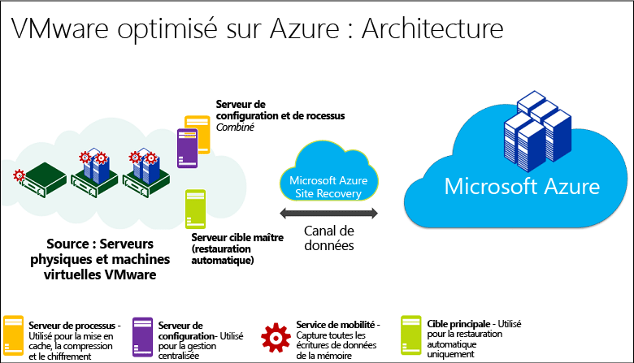
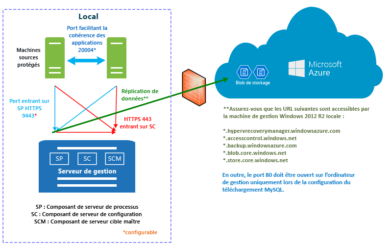
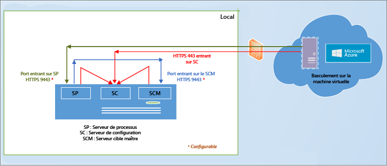
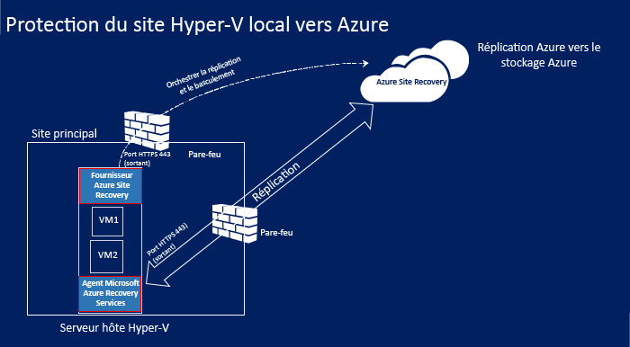
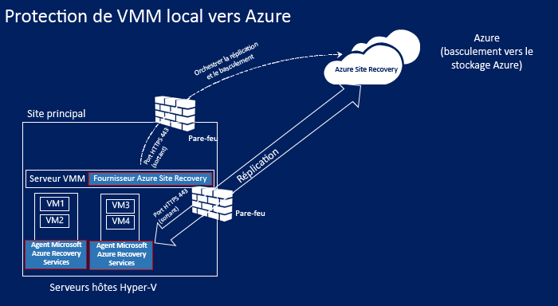
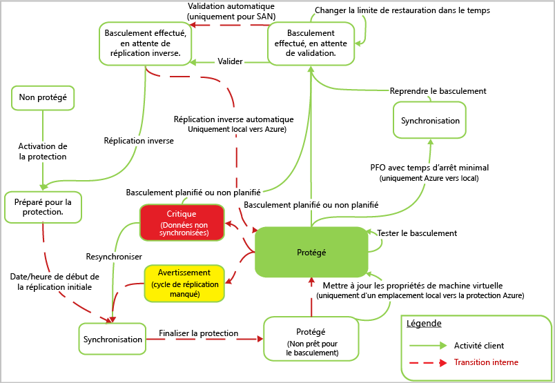

# Comment Azure Site Recovery fonctionne-t-il ?

Lisez cet article pour comprendre l’architecture sous-jacente du service Azure Site Recovery et les composants qui le font fonctionner.

Les organisations ont besoin d’une stratégie BCDR qui détermine la façon dont les applications, les charges de travail et les données demeurent opérationnelles et disponibles pendant les temps d’arrêt prévus et imprévus, et qui précise comment rétablir au plus vite des conditions de travail normales. Votre stratégie BCDR doit assurer la sécurisation et la récupération des données d’entreprise, ainsi que la disponibilité continue des charges de travail suite à un sinistre.

Site Recovery est un service Azure qui participe à votre stratégie de continuité des activités et de récupération d’urgence en orchestrant la réplication des machines virtuelles et des serveurs physiques locaux dans le cloud (Azure) ou sur un centre de données secondaire. Lorsque des pannes se produisent sur votre site principal, vous effectuez un basculement sur le site secondaire pour préserver la disponibilité des applications et des charges de travail. Vous restaurez votre site principal dès lors qu’il retrouve un fonctionnement normal. Pour en savoir plus, consultez [Qu’est-ce que Site Recovery ?](site-recovery-overview.md)

Cet article décrit le déploiement dans le [portail Azure](https://portal.azure.com). Le [portail Azure Classic](https://manage.windowsazure.com/) permet de gérer les coffres Site Recovery existants, mais pas d’en créer.

Postez vos commentaires à la fin de cet article. Publiez vos questions techniques sur le [Forum Azure Recovery Services](https://social.msdn.microsoft.com/forums/azure/home?forum=hypervrecovmgr).

## Scénarios de déploiement

Site Recovery peut être déployé pour orchestrer la réplication dans un certain nombre de scénarios :

- **Réplication des machines virtuelles VMware** : vous pouvez répliquer des machines virtuelles VMware locales dans Azure ou dans un centre de données secondaire.
- **Réplication des ordinateurs physiques** : vous pouvez répliquer des ordinateurs physiques (Windows ou Linux) dans Azure ou dans un centre de données secondaire. Le processus de réplication des ordinateurs physiques est presque identique à celui des machines virtuelles VMware.
- **Réplication des machines virtuelles Hyper-V** : vous pouvez répliquer des machines virtuelles Hyper-V dans Azure ou dans un site VMM secondaire. Pour pouvoir les répliquer dans un site secondaire, elles doivent être gérées dans des clouds System Center Virtual Machine Manager (VMM).
- **Migration de machines virtuelles** : en plus de la réplication (réplication, basculement et restauration automatique) dans Azure, vous pouvez également migrer des machines virtuelles locales et des serveurs physiques vers des machines virtuelles Azure (réplication, basculement, aucune restauration). Voici ce que vous pouvez migrer :
    - Migration de charges de travail s’exécutant sur des machines virtuelles Hyper-V locales, des machines virtuelles VMware et des serveurs physiques, pour les exécuter sur des machines virtuelles Azure.
    - Migration de [machines virtuelles IaaS Azure](site-recovery-migrate-azure-to-azure.md) entre des régions Azure. Actuellement, seule la migration est prise en charge dans ce scénario, pas la restauration automatique.
    - Migration d’[instances Windows AWS](site-recovery-migrate-aws-to-azure.md) vers des machines virtuelles IaaS Azure. Actuellement, seule la migration est prise en charge dans ce scénario, pas la restauration automatique.

Site Recovery peut répliquer les applications exécutées sur les machines virtuelles et les serveurs physiques pris en charge. Vous pouvez consulter la page [Quelles charges de travail pouvez-vous protéger avec Azure Site Recovery ?](site-recovery-workload.md)

## Répliquer des machines virtuelles WMware/serveurs physiques sur Azure

### Composants

**Composant** | **Détails**
--- | ---
**Microsoft Azure** | Dans Azure, vous avez besoin d’un compte Microsoft Azure, d’un compte de stockage Azure et d’un réseau Azure.   Le stockage et le réseau peuvent être des comptes Resource Manager ou Classic.    Les données répliquées sont stockées dans le compte de stockage, et les machines virtuelles Azure sont créées avec les données répliquées lors du basculement à partir de votre site local. Les machines virtuelles Azure se connectent au réseau virtuel Azure lors de leur création.
**Serveur de configuration** | Vous configurez un serveur de configuration local pour coordonner les communications entre le site local et Azure, et pour gérer la réplication des données.
**Serveur de traitement** | Installé par défaut sur le serveur de configuration local.   Fait office de passerelle de réplication. Il reçoit les données de réplication d’ordinateurs source protégés, les optimise grâce à la mise en cache, la compression et le chiffrement et envoie les données vers le stockage Azure.   Il gère l’installation Push du service Mobility sur des machines protégées et détecte automatiquement les machines virtuelles VMware.   À mesure que s’étend votre déploiement, vous pouvez ajouter des serveurs de traitement dédiés supplémentaires afin de gérer de plus grands volumes de trafic de réplication.
**Serveur cible maître** | Installé par défaut sur le serveur de configuration local.   Gère les données de réplication pendant la restauration automatique à partir d’Azure. Si les volumes de trafic de restauration automatique sont importants, vous pouvez déployer un serveur cible maître distinct pour la restauration.
**Serveurs VMware** | Vous ajoutez des serveurs vCenter et vSphere à votre coffre Recovery Services pour répliquer des machines virtuelles VMware.   Si vous répliquez des serveurs physiques, il vous faudra une infrastructure VMware locale pour la restauration. Il est impossible d’effectuer une restauration sur un serveur physique.
**Machines répliquées** | Le service Mobility est installé sur chaque machine que vous souhaitez répliquer. Il peut être installé manuellement sur chaque ordinateur ou avec une installation push à partir du serveur de traitement.

**Figure 1 : composants VMware vers Azure**

### Processus de réplication

1. Vous configurez le déploiement, y compris les composants Azure et un coffre Recovery Services. Dans le coffre, vous spécifiez la source et la cible de réplication, configurez le serveur de configuration, ajoutez des serveurs VMware, créez une stratégie de réplication, déployez le service Mobility, autorisez la réplication et effectuez un test de basculement.
2.  Les machines débutent la réplication conformément à la stratégie définie, et une copie initiale des données est répliquée sur le stockage Azure.
4. La réplication des modifications delta dans Azure commence une fois la réplication initiale terminée. Le suivi des modifications d’une machine est conservé dans un fichier .hrl.
    - Les machines qui assurent la réplication communiquent avec le serveur de configuration sur le port HTTPS 443 entrants, pour la gestion de la réplication.
    - Les machines qui assurent la réplication envoient des données de réplication au serveur de traitement sur le port HTTPS 9443 entrant (configuration possible).
    - Le serveur de configuration orchestre la gestion de la réplication avec Azure sur le port HTTPS 443 sortant.
    - Le serveur de traitement reçoit les données à partir des machines source, puis les chiffre et les envoie au stockage Azure via le port 443 sortant.
    - Si vous activez la cohérence multimachine virtuelle, les machines du groupe de réplication communiquent entre elles sur le port 20004. Le mode multimachine virtuelle est utilisé si vous regroupez plusieurs machines dans des groupes de réplication qui partagent des points de récupération cohérents en cas d’incident et avec les applications lorsqu’ils basculent. Cela est utile si les machines exécutent la même charge de travail et doivent être cohérentes.
5. Le trafic est répliqué sur des points de terminaison publics de stockage Azure via Internet. L’autre solution consiste à utiliser l’[homologation publique](https://docs.microsoft.com/en-us/azure/expressroute/expressroute-circuit-peerings#public-peering) Azure ExpressRoute. La réplication du trafic à partir d’un site local vers Azure via un réseau VPN de site à site n’est pas prise en charge.

**Figure 2 : réplication de VMware vers Azure**

### Processus de basculement et de restauration automatique

1. Vous effectuez des basculements non planifiés depuis des machines virtuelles VMware et des serveurs physiques locaux vers Azure. Le basculement planifié n’est pas pris en charge.
2. Vous pouvez basculer sur une seule machine ou créer des [plans de récupération](site-recovery-create-recovery-plans.md) pour orchestrer le basculement de plusieurs machines.
3. Lorsque vous effectuez un basculement, les machines virtuelles répliquées seront créées dans Azure. Vous validez un basculement pour accéder à la charge de travail à partir de la machine virtuelle Azure répliquée.
4. Lorsque votre site local principal est à nouveau disponible, vous pouvez lancer la restauration automatique. Vous configurez une infrastructure de restauration automatique, lancez la réplication de la machine à partir du site secondaire vers le site principal et effectuez un basculement non planifié à partir du site secondaire. Une fois ce basculement validé, les données sont à nouveau disponibles en local et vous devez relancer la réplication sur Azure. [En savoir plus](site-recovery-failback-azure-to-vmware.md)

La restauration automatique doit répondre à plusieurs conditions requises :

- **La restauration automatique physique à physique n’est pas prise en charge**: cela signifie que si vous basculez les serveurs physiques vers Azure, puis souhaitez les restaurer automatiquement, vous devez le faire vers une machine virtuelle VMware. Il est impossible d’effectuer cette procédure vers un serveur physique. Vous aurez besoin d’une machine virtuelle Azure vers laquelle effectuer la restauration et, si vous n’avez pas déployé le serveur de configuration en tant que machine virtuelle VMware, vous devrez configurer un serveur cible maître distinct en tant que machine virtuelle VMware. C’est nécessaire, car le serveur cible maître interagit sur et s’attache au stockage VMware pour restaurer les disques vers une machine virtuelle VMware.
- **Serveur de traitement temporaire dans Azure**: si vous souhaitez effectuer une restauration automatique à partir d’Azure après le basculement, vous devez définir une machine virtuelle Azure configurée comme serveur de traitement pour gérer la réplication à partir d’Azure. Vous pourrez supprimer cette machine virtuelle une fois la restauration terminée.
- **Connexion VPN**: pour une restauration automatique, vous devrez disposer d’une connexion VPN (ou d’Azure ExpressRoute) configurée à partir du réseau Azure sur le site local.
- **Serveur cible maître local distinct** : le serveur cible maître local gère la restauration automatique. Le serveur cible maître est installé par défaut sur le serveur d’administration. Toutefois, si vous restaurez automatiquement de plus grands volumes de trafic vous devez définir un serveur cible maître local à cet effet.
- **Stratégie de restauration automatique** : pour répliquer vers votre site local, vous avez besoin d’une stratégie de restauration automatique. Celle-ci est automatiquement créée lors de la création de votre stratégie de réplication.

**Figure 3 : restauration automatique VMware/physique**

## Réplication de machines virtuelles VMware/serveurs physiques sur un site secondaire

### Composants

**Composant** | **Détails**
--- | ---
**Microsoft Azure** | Vous déployez ce scénario à l’aide d’InMage Scout. Pour l’obtenir, vous avez besoin d’un abonnement Azure.   Après avoir créé un coffre Recovery Services, téléchargez InMage Scout et installez les dernières mises à jour pour configurer le déploiement.
**Serveur de traitement** | Vous déployez le composant serveur de traitement sur votre site principal pour gérer la mise en cache, la compression et l’optimisation des données.   Il gère aussi l’installation Push de l’Agent unifié sur les machines à protéger.
**Serveur VMware ESX/ESXi et vCenter** |  Vous avez besoin d’une infrastructure VMware pour répliquer des machines virtuelles VMware.
**Machines virtuelles/serveurs physiques** |  Vous installez l’Agent unifié sur les machines virtuelles VMware ou les serveurs physiques Windows/Linux à répliquer.   Il joue le rôle de fournisseur de communication entre tous les composants.
**Serveur de configuration** | Le serveur de configuration est installé sur le site secondaire pour gérer, configurer et surveiller votre déploiement via le site web de gestion ou la console vContinuum.
**Serveur vContinuum** | Installé au même emplacement que le serveur de configuration.   Il intègre une console qui vous permet de gérer et surveiller votre environnement protégé.
**Serveur cible maître (site secondaire)** | Le serveur cible maître stocke les données répliquées. Il reçoit les données du serveur de traitement, crée une machine de réplication sur le site secondaire et stocke les points de rétention des données.   Le nombre de serveurs cibles maîtres dont vous avez besoin dépend du nombre de machines que vous protégez.   Si vous voulez effectuer une restauration sur le site principal, vous avez là aussi besoin d’un serveur cible maître. L’Agent unifié est installé sur ce serveur.

### Processus de réplication

1. Vous configurez les serveurs de composants dans chaque site (configuration, processus, cible maître) et installez l’Agent unifié sur les ordinateurs que vous souhaitez répliquer.
2. Après la réplication initiale, l’agent de chaque machine envoie les modifications de réplication différentielle au serveur de traitement.
3. Le serveur de traitement optimise ces données et les transfère vers le serveur cible maître du site secondaire. Le serveur de configuration gère le processus de réplication.

**Figure 4 : réplication de VMware vers VMware**

## Réplication de machines virtuelles Hyper-V dans Azure

### Composants

**Composant** | **Détails**
--- | ---
**Microsoft Azure** | Dans Azure, vous avez besoin d’un compte Microsoft Azure, d’un compte de stockage Azure et d’un réseau Azure.   Le stockage et le réseau peuvent être des comptes Resource Manager ou Classic.   Les données répliquées sont stockées dans le compte de stockage, et les machines virtuelles Azure sont créées avec les données répliquées lors du basculement à partir de votre site local.   Les machines virtuelles Azure se connectent au réseau virtuel Azure lors de leur création.
**Serveur VMM** | Si vos hôtes Hyper-V sont situés dans des clouds VMM, vous devez disposer de réseaux logiques et de réseaux de machines virtuelles pour configurer le [mappage réseau](site-recovery-network-mapping.md). Un réseau de machines virtuelles doit être lié à un réseau logique lui-même associé au cloud.
**Hôte Hyper-V** | Vous devez avoir un ou plusieurs serveurs hôtes Hyper-V.
**Machines virtuelles Hyper-V** | Vous devez avoir une ou plusieurs machines virtuelles sur le serveur hôte Hyper-V. Le fournisseur exécuté sur l’hôte Hyper-V coordonne et orchestre la réplication avec le service Site Recovery via Internet. L’agent gère les données de réplication de données via HTTPS 443. Les communications en provenance du fournisseur et de l’agent sont sécurisées et chiffrées. Les données répliquées dans le stockage Azure sont également chiffrées.

## Processus de réplication

1. Vous configurez les composants Azure. Nous vous recommandons de configurer les comptes de stockage et de réseau avant de lancer le déploiement de Site Recovery.
2. Vous créez un coffre Replication Services pour Site Recovery et configurez les paramètres du coffre, notamment :
    - Si vous ne gérez pas les hôtes Hyper-V dans un cloud VMM, vous créez un conteneur de site Hyper-V et y ajoutez des hôtes Hyper-V.
    - Source et cible de la réplication. Si vos hôtes Hyper-V sont gérés dans VMM, la source est le cloud VMM. Si tel n’est pas le cas, la source est le site Hyper-V.
    - Installation du fournisseur Azure Site Recovery et de l’agent Microsoft Azure Recovery Services. Si vous avez VMM, le fournisseur sera installé dessus et l’agent sur chaque hôte Hyper-V. Si vous n’avez pas VMM, le fournisseur et l’agent sont installés sur chaque hôte.
    - Vous créez une stratégie de réplication pour le site Hyper-V ou un cloud VMM. La stratégie est appliquée à toutes les machines virtuelles situées sur les hôtes du site ou du cloud.
    - Vous activez la réplication pour les machines virtuelles Hyper-V. La réplication initiale se déclenche selon les paramètres de la stratégie de réplication.
4. Les modifications des données font l’objet d’un suivi et la réplication des modifications delta dans Azure débute après la réplication initiale. Les modifications qui font l’objet d’un suivi sont conservées dans un fichier .hrl.
5. Vous effectuez un test de basculement pour vérifier que tout fonctionne bien.

### Processus de basculement et de restauration automatique

1. Vous pouvez effectuer un [basculement](site-recovery-failover.md) planifié ou non planifié vers Azure à partir de machines virtuelles Hyper-V locales. Si vous exécutez un basculement planifié, les machines virtuelles sources sont arrêtées pour éviter toute perte de données.
2. Vous pouvez basculer sur une seule machine ou créer des [plans de récupération](site-recovery-create-recovery-plans.md) pour orchestrer le basculement de plusieurs machines.
4. Une fois le basculement effectué, vous pouvez voir les machines virtuelles répliquées dans Azure. Si nécessaire, vous pouvez affecter une adresse IP publique à la machine virtuelle.
5. Vous validez ensuite le basculement pour accéder à la charge de travail à partir de la machine virtuelle Azure répliquée.
6. Lorsque votre site local principal est à nouveau disponible, vous pouvez lancer la restauration automatique. Vous effectuez un basculement planifié depuis Azure vers le site principal. Pour un basculement planifié, vous pouvez choisir d’effectuer une restauration automatique vers la même machine virtuelle ou un autre emplacement et synchroniser les modifications entre Azure et un emplacement local pour éviter toute perte de données. Lorsque les machines virtuelles sont créées en local, vous validez le basculement.

**Figure 5 : réplication de site Hyper-V vers Azure**

**Figure 6 : réplication de site Hyper-V dans des clouds VMM vers Azure**

## Réplication de machines virtuelles Hyper-V vers un site secondaire

### Composants

**Composant** | **Détails**
--- | ---
**Compte Azure** | Vous devez avoir un compte Microsoft Azure.
**Serveur VMM** | Nous recommandons l’utilisation d’un serveur VMM dans le site principal et d’un autre dans le site secondaire, connectés à Internet.   Chaque serveur doit avoir au moins un cloud privé VMM avec l’ensemble des profils de fonctionnalités Hyper-V.   Vous installez le fournisseur Azure Site Recovery sur le serveur VMM. Le fournisseur coordonne et orchestre la réplication avec le service Site Recovery via Internet. Les communications entre le fournisseur et Azure sont sécurisées et chiffrées.
**Serveur Hyper-V** |  Vous devez avoir un ou plusieurs serveurs hôtes Hyper-V dans les clouds VMM principaux et secondaires. Les serveurs doivent être connectés à Internet.   Les données sont répliquées entre les serveurs hôtes Hyper-V principal et secondaire via une liaison LAN ou VPN, en utilisant Kerberos ou une authentification par certificat.  
**Machines sources** | Le serveur hôte Hyper-V source doit avoir au moins une machine virtuelle que vous souhaitez répliquer.

## Processus de réplication

1. Vous configurez le compte Azure.
2. Vous créez un coffre Replication Services pour Site Recovery et configurez les paramètres du coffre, notamment :

    - Source et cible de la réplication (sites principal et secondaire).
    - Installation du fournisseur Azure Site Recovery et de l’agent Microsoft Azure Recovery Services. Le fournisseur est installé sur les serveurs VMM et l’agent sur chaque hôte Hyper-V.
    - Vous créez une stratégie de réplication pour le cloud VMM source. La stratégie est appliquée à toutes les machines virtuelles situées sur des hôtes dans le cloud.
    - Vous activez la réplication pour les machines virtuelles Hyper-V. La réplication initiale se déclenche selon les paramètres de la stratégie de réplication.
4. Les modifications des données font l’objet d’un suivi et la réplication des modifications delta débute après la réplication initiale. Les modifications qui font l’objet d’un suivi sont conservées dans un fichier .hrl.
5. Vous effectuez un test de basculement pour vérifier que tout fonctionne bien.

**Figure 7 : réplication de VMM vers VMM**

### Processus de basculement et de restauration automatique

1. Vous pouvez effectuer un [basculement](site-recovery-failover.md) planifié ou non planifié entre des sites locaux. Si vous exécutez un basculement planifié, les machines virtuelles sources sont arrêtées pour éviter toute perte de données.
2. Vous pouvez basculer vers une seule machine ou créer des [plans de récupération](site-recovery-create-recovery-plans.md) pour orchestrer le basculement de plusieurs machines.
4. Si vous effectuez un basculement non planifié vers un site secondaire, une fois l’opération terminée, les machines de l’emplacement secondaire ne sont pas protégées ou réplicables. Si vous avez effectué un basculement planifié, une fois l’opération terminée, les machines de l’emplacement secondaire sont protégées.
5. Vous validez ensuite le basculement pour accéder à la charge de travail à partir de la machine virtuelle répliquée.
6. Lorsque votre site principal est à nouveau disponible, vous déclenchez la réplication inverse depuis le site secondaire vers le site principal. La réplication inverse place les machines virtuelles dans un état protégé, mais le centre de données secondaire reste l’emplacement actif.
7. Pour placer le site principal à l’emplacement actif, lancez un basculement planifié depuis le site secondaire vers le site principal, puis une autre réplication inverse.

### Flux de travail de réplication Hyper-V

**Étape du flux de travail** | **Action**
--- | ---
1. **Activer la protection** | Lorsque vous activez la protection d’une machine virtuelle Hyper-V, le travail **Activer la protection** est lancé pour vérifier que la machine répond aux conditions requises. Le travail appelle deux méthodes :   [CreateReplicationRelationship](https://msdn.microsoft.com/library/hh850036.aspx) pour configurer la réplication avec les paramètres que vous avez configurés.   [StartReplication](https://msdn.microsoft.com/library/hh850303.aspx) pour initialiser une réplication de machine virtuelle complète.
2. **Réplication initiale** |  Un instantané de la machine virtuelle est créé et les disques durs virtuels sont répliqués un par un jusqu’à ce qu’ils soient tous copiés dans l’emplacement secondaire.   La durée de cette opération dépend de la taille de la machine virtuelle, de la bande passante réseau et de la méthode de réplication initiale que vous avez choisie.   Si des modifications interviennent sur les disques pendant la réplication initiale, le dispositif de suivi de réplication des réplicas Hyper-V assure le suivi de ces modifications dans des journaux de réplication Hyper-V (.hrl), qui se trouvent dans le même dossier que les disques.   À chaque disque correspond un fichier .hrl, qui est envoyé au stockage secondaire.   L’instantané et les fichiers journaux consomment des ressources disque pendant la réplication initiale. À la fin de la réplication initiale, l’instantané de machine virtuelle est supprimé et les modifications de disque delta figurant dans le journal sont synchronisées et fusionnées.
3. **Finaliser la protection** | Une fois la réplication initiale terminée, le travail **Finaliser la protection** configure les paramètres réseau et d’autres paramètres de post-réplication, pour protéger la machine virtuelle.   Si vous répliquez dans Azure, vous devrez peut-être modifier les paramètres de la machine virtuelle pour la préparer au basculement.   À ce stade, vous pouvez exécuter un basculement de test pour vérifier que tout fonctionne comme prévu.
4. **Réplication** | La synchronisation delta commence à l’issue de la réplication initiale, selon les paramètres de réplication.   **Échec de la réplication**: si la réplication différentielle échoue et si une réplication complète serait coûteuse en bande passante et en temps, une resynchronisation se produit. Par exemple, si les fichiers .hrl atteignent 50 % de la taille du disque, la machine virtuelle est marquée pour resynchronisation. La resynchronisation réduit la quantité de données envoyées par le calcul des sommes de contrôle des machines virtuelles source et cible et l’envoi du seul delta. Une fois la resynchronisation terminée, la réplication différentielle doit reprendre. Par défaut, la resynchronisation est planifiée pour s’exécuter automatiquement en dehors des heures de bureau, mais vous pouvez resynchroniser une machine virtuelle manuellement.   **Erreur de réplication** : si une erreur de réplication se produit, une nouvelle tentative intégrée est effectuée. S’il s’agit d’une erreur non récupérable, telle qu’une erreur d’authentification ou d’autorisation ou qu’une machine de réplication est dans un état non valide, aucune nouvelle tentative n’intervient. S’il s’agit d’une erreur récupérable, par exemple une erreur réseau ou un manque d’espace disque ou de mémoire, une nouvelle tentative se produit à intervalles croissants (après 1, 2, 4, 8 et 10 minutes, puis toutes les 30 minutes).
5. **Basculement planifié/non planifié** | Vous pouvez effectuer des basculements planifiés ou non planifiés si nécessaire.   Si vous exécutez un basculement planifié, les machines virtuelles sources sont arrêtées pour éviter toute perte de données.   Une fois créées, les machines virtuelles de réplication sont en attente de validation. Vous devez les valider pour finaliser le basculement.   Une fois le site principal opérationnel, vous pouvez restaurer automatiquement le site principal, lorsqu’il est disponible.

**Figure 8 : flux de travail Hyper-V**

## Étapes suivantes

[Préparer le déploiement](site-recovery-best-practices.md)

<!--HONumber=Jan17_HO1-->

