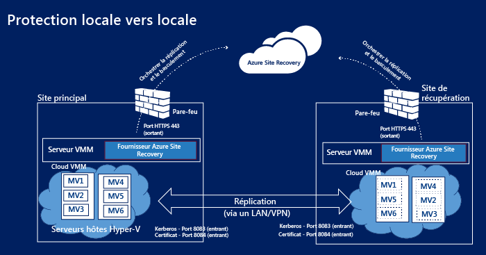
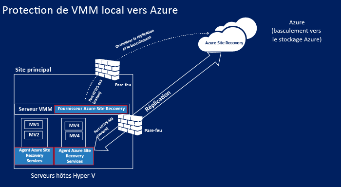
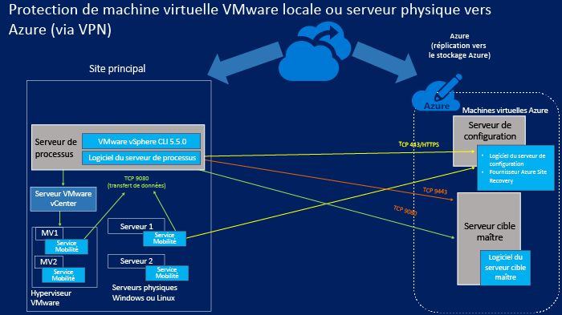
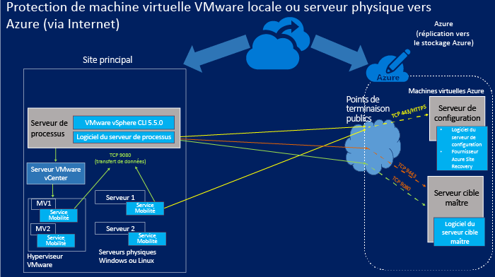

<properties
	pageTitle="Composants de Site Recovery" 
	description="Cet article propose une vue d'ensemble des composants de Site Recovery et de leur gestion" 
	services="site-recovery"
	documentationCenter=""
	authors="rayne-wiselman"
	manager="jwhit"
	editor=""/>

<tags
	ms.service="site-recovery"
	ms.workload="backup-recovery"
	ms.tgt_pltfrm="na"
	ms.devlang="na"
	ms.topic="article"
	ms.date="07/09/2015"
	ms.author="raynew"/>

# Composants de Site Recovery

Azure Site Recovery contribue à mettre en œuvre la stratégie de continuité des activités et de récupération d'urgence de votre entreprise en coordonnant la réplication, le basculement et la récupération de machines virtuelles et de serveurs physiques. Les machines peuvent être répliquées vers Azure ou vers un centre de données local secondaire. [Lire la présentation](site-recovery-overview.md).

Cet article résume et décrit les composants de Site Recovery qui sont installés sur les serveurs et les machines virtuelles.

Vous pouvez poser vos questions relatives à cet article sur le [Forum Azure Recovery Services](https://social.msdn.microsoft.com/forums/azure/home?forum=hypervrecovmgr).

## Vue d'ensemble

Les composants de Site Recovery varient légèrement selon le scénario de protection.

### Protection entre deux centres de données avec VMM

**Scénario** | **Description** | **Composants requis** | **Détails**
--- | --- | --- | ---
Vous déployez Azure Site Recovery pour répliquer des machines virtuelles entre deux centres de données | 
Chaque centre de données a un serveur VMM

Chaque serveur VMM a un cloud privé qui contient un ou plusieurs serveurs hôtes Hyper-V avec des machines virtuelles à protéger
 | Le fournisseur Azure Site Recovery sera installé sur les deux serveurs VMM. | 
Aucun composant n’est installé sur les serveurs hôtes Hyper-V ou sur les machines virtuelles protégées

Le fournisseur Azure Site Recovery sur le serveur VMM communique avec le service Site Recovery via HTTPS 443 pour orchestrer la protection

La réplication se produit entre les serveurs hôtes Hyper-V principal et secondaires via internet à l'aide de l'authentification des certificats ou Kerberos sur les ports 8083 et 8084.

### Protection entre un centre de données avec VMM et Azure

**Scénario** | **Description** | **Composants requis** | **Détails**
--- | --- | --- | ---
Vous déployez Azure Site Recovery pour répliquer des machines virtuelles entre un centre de données et Azure | 
Le centre de données local a un serveur VMM avec un cloud privé qui contient un ou plusieurs serveurs hôtes Hyper-V avec des machines virtuelles à protéger
 | 
Le fournisseur Azure Site Recovery sera installé sur le serveur VMM

L’agent Microsoft Recovery Services sera installé sur les serveurs hôtes Hyper-V source
 | 
Aucun composant n’est installé sur les machines virtuelles protégées

Le fournisseur Azure Site Recovery sur le serveur VMM communique avec le service Site Recovery via HTTPS 443 pour orchestrer la protection

La réplication se produit entre l’agent Microsoft Recovery Services s’exécutant sur les serveurs hôtes Hyper-V source et Azure via HTTPS 443.

###  Protection entre un site Hyper-V et Azure

**Scénario** | **Description** | **Composants requis** | **Détails**
--- | --- | --- | ---
Vous déployez Azure Site Recovery pour répliquer des machines virtuelles entre un centre de données et Azure | 
Le centre de données local a un ou plusieurs serveurs hôtes Hyper-V avec des machines virtuelles à protéger

Pendant la configuration, vous définissez un site Hyper-V qui contient un ou plusieurs de ces serveurs hôtes Hyper-V
 | 
Une unique installation de composant s'exécute pour installer à la fois le fournisseur Azure Site Recovery et l'agent Microsoft Recovery Services sur les serveurs hôtes Hyper-V
 | 
Aucun serveur VMM dans le déploiement

Aucun composant n’est installé sur les machines virtuelles protégées

Le fournisseur Azure Site Recovery sur le serveur hôte Hyper-V communique avec le service Site Recovery via HTTPS 443 pour orchestrer la protection

La réplication se produit entre l’agent Microsoft Recovery Services s’exécutant sur le serveur hôte Hyper-V et Azure via HTTPS 443.

### Protection entre un serveur physique local ou une machine virtuelle VMware et Azure 

Dans ce scénario, la réplication peut se produire de deux manières :

- Via une connexion VPN (avec Azure ExpressRoute ou un VPN de site à site)
- Via une connexion sécurisée sur internet

#### Via une connexion VPN de site à site (ou ExpressRoute)

Les communications à partir des serveurs locaux sont dirigées vers les ports internes sur le réseau virtuel Azure auquel les machines virtuelles de configuration et les machines virtuelles cibles maîtres sont connectées.

#### Via internet

Toutes les communications à partir des serveurs locaux sont dirigées vers des points de terminaison publics mappés sur le service cloud Azure pour la machine virtuelle du serveur de configuration et la machine virtuelle du serveur cible maître. Les points de terminaison sont créés dynamiquement lorsque vous déployez les machines virtuelles.

#### Ports

**Composant** | **Port** | **Détails** 
--- | --- | --- | ---
**Serveur de traitement** |9080 | Les machines protégées envoient des données à répliquer au serveur de traitement via TCP 9080.
**Serveur de configuration** | HTTPS/443 | Le service de mobilité s'exécutant sur les machines protégées envoie les métadonnées de réplication au serveur de configuration sur le port 443.
 | HTTPS/443 | Le serveur de configuration coordonne et orchestre la protection de la machine. Le serveur de traitement communique avec le serveur de configuration sur le port 443 ou sur le point de terminaison public mappé pour recevoir les informations de gestion et de contrôle. 
 | 9443 | En cas de restauration automatique, l'outil vContinuum demande le contrôle et des métadonnées du serveur de configuration sur le port 9443 (non illustré dans le diagramme)
 | 5986 | La gestion à distance avec PowerShell utilise le port 5986 (non illustré dans le diagramme)
 | 3389 | Connexion RDP au serveur de configuration sur le port 3389 (non illustré dans le diagramme)
**Serveur cible maître** | 80 | Le site de traitement envoie des communications sur le trafic de réplication au serveur cible maître via 9080
 | HTTP/443 | Le serveur de traitement réplique les données vers le serveur cible maître via HTTP ou 443 (VPN)
 | HTTP/443 | Le serveur de traitement réplique les données vers le serveur cible maître via HTTP ou 443 (VPN)
**Règles de pare-feu** | | 
Pour assurer le bon fonctionnement de l’installation Push du service de mobilité, le pare-feu des machines protégées doit autoriser le Partage de fichiers et d’imprimantes et Windows Management Instrumentation.

Les règles de pare-feu sur les machines que vous souhaitez protéger doivent leur permettre de communiquer avec le serveur de configuration.

Pour permettre la connexion aux machines virtuelles Azure via internet après un basculement, les règles de pare-feu sur les machines doivent autoriser les connexions Bureau à distance sur internet. Pour permettre la connexion à une machine Linux basculée dans Azure, le service Secure Shell doit être configuré pour démarrer automatiquement au démarrage du système, et les règles de pare-feu doivent autoriser une connexion ssh.

## Composants de Site Recovery

**Composant** | **Détails** | **Installation** | **Scénario de déploiement**
--- | --- | --- | ---
**Fournisseur Azure Site Recovery pour VMM** | Gère la communication entre le serveur VMM et le service Site Recovery. | Installé sur un serveur VMM | Utilisé lorsque vous configurez la protection entre deux sites VMM ou entre un site VMM et Azure
**Fournisseur Azure Site Recovery pour Hyper-V** | Gère la communication entre l'hôte Hyper-V et le service Site Recovery lorsque VMM n'est pas déployé. | Installé sur un serveur hôte Hyper-V | Utilisé lorsque vous configurez la protection entre un site Hyper-V et Azure.   
**Agent Microsoft Recovery Services** | Gère la communication entre le serveur hôte Hyper-V et le service Site Recovery. | Installé sur le serveur hôte Hyper-V | 
Utilisé lorsque vous configurez la protection entre un site Hyper-V et Azure.

Vous téléchargez un seul fournisseur qui inclut à la fois le fournisseur Azure Site Recovery pour Hyper-V et l'agent Microsoft Recovery Services.

**Serveur de traitement/Serveur de traitement de restauration** | 
Optimise les données des machines VMware protégées ou du serveur physique Linux/Windows avant de les envoyer au serveur cible maître dans Azure

Lance l’installation Push du service de mobilité sur des machines virtuelles VMware ou des serveurs physiques

Effectue la détection automatique des machines virtuelles VMware.
 
Serveur de traitement de restauration automatique : le tout premier point d'optimisation des données avant que la réplication ne soit applicable au serveur de traitement de restauration
 | 
Installé sur un serveur local sous Windows Server 2012 R2 au minimum

Serveur de traitement de restauration : s'exécute sur une machine virtuelle Azure de taille A4 standard
 | 
Utilisé lorsque vous configurez la protection entre un serveur physique local ou des machines virtuelles VMware, et Azure.

Serveur de traitement de restauration : utilisé pour la restauration à partir d’Azure vers un site local

**Service de mobilité** | Capture les modifications sur les machines protégées et les transmet au serveur de traitement local en vue de leur réplication sur Azure. | Installé sur des machines virtuelles VMware locales ou sur des serveurs physiques à protéger| Utilisé lorsque vous configurez la protection entre un serveur physique local ou des machines virtuelles VMware, et Azure.
**Serveur cible maître/Serveur cible maître de restauration** | 
Stocke les données répliquées à partir de vos machines protégées à l'aide de disques durs virtuels attachés créés sur le stockage d'objets blob dans votre compte de stockage Azure

Serveur cible maître de restauration : stocke les données répliquées à partir de machines virtuelles basculées dans Azure. Les données sont stockées sur des VMDK créés dans le magasin de données sélectionné lorsque la réplication inverse est activée pour la restauration automatique.
 | 
Installé comme machine virtuelle Azure comme serveur Windows basé sur une image de la galerie Windows Server 2012 R2 (pour protéger des ordinateurs Windows) ou comme serveur Linux basé sur une image de la galerie OpenLogic CentOS 6.6 (pour protéger les ordinateurs Linux)

Deux tailles sont disponibles : A3 standard et D14 standard

Serveur cible maître de restauration : s’exécute sur une machine virtuelle VMware. Il est configuré sur l’hôte sur lequel la machine sera restaurée.
| 
Utilisé lorsque vous configurez la protection entre un serveur physique local ou des machines virtuelles VMware, et Azure.

Serveur cible maître de restauration : utilisé pour la restauration de machines virtuelles basculées à partir d’Azure vers un site local

**Serveur de configuration** | 
Coordonne la communication entre les ordinateurs protégés, le serveur de traitement et les serveurs cibles maîtres dans Azure

Configure la réplication et coordonne la récupération dans Azure lors du basculement
 | Installé sur une machine virtuelle A3 standard Azure dans le même abonnement Azure que Site Recovery. | Utilisé lorsque vous configurez la protection entre un serveur physique local ou des machines virtuelles VMware, et Azure.

## Planification du déploiement des composants

### Fournisseur Azure Site Recovery

Le fournisseur s'exécute sur vos serveurs VMM, sur les serveurs hôtes Hyper-V si vous n'avez pas de serveur VMM dans votre déploiement, ou sur un serveur de configuration. Il se connecte au service Site Recovery sur Internet via une connexion HTTPS chiffrée. Notez les points suivants :

- Vous n'avez pas besoin d'ajouter d’exceptions de pare-feu spécifiques pour connecter le fournisseur à Site Recovery.
- Si vous voulez connecter le serveur sur lequel le fournisseur s'exécute à internet à l'aide d'un serveur proxy, vous pouvez utiliser les paramètres de proxy existants ou spécifier un proxy personnalisé.
- Le serveur proxy doit laisser passer ces adresses à travers le pare-feu :

	-  *.accesscontrol.windows.net -  .backup.windowsazure.com
	-  *.blob.core.windows.net -  *.store.core.windows.net	
- Si votre pare-feu a des règles basées sur l’adresse IP, assurez-vous qu'elles autorisent la communication à partir du serveur de configuration vers les adresses IP décrites dans la section [Plages d’adresses IP des centres de données Azure](https://www.microsoft.com/download/details.aspx?id=41653) et pour le protocole HTTPS (443). Vous devrez autoriser les plages IP de la région Azure que vous prévoyez d'utiliser, ainsi que celles de la région ouest des États-Unis.
- Si vous déployez Site Recovery avec VMM et utilisez un proxy personnalisé, un compte RunAs VMM (DRAProxyAccount) sera créé automatiquement à l’aide des informations d’identification du proxy spécifiées dans les paramètres personnalisés du proxy dans le portail Site Recovery. Pour permettre l’authentification du compte, vous devez configurer le serveur proxy.
- Si vous utilisez un proxy, le trafic envoyé à partir du fournisseur installé sur un serveur hôte Hyper-V vers le proxy doit être envoyé via HTTP.

### Agent Microsoft Recovery Services

L’agent se connecte au service Site Recovery sur Internet via une connexion HTTPS chiffrée. Aucune exception de pare-feu spécifique n’est requise.

### Composants pour la protection des serveurs physiques ou VMware

#### Serveur cible maître

- Le serveur maître cible peut être une machine virtuelle Azure A4 ou D14 standard.
- Avec un serveur maître cible A4 standard, vous pouvez ajouter 16 disques de données (maximum de 1023 Go par disque de données) à chaque machine virtuelle.
- Avec un serveur maître cible D14 standard, vous pouvez ajouter 32 disques de données (maximum de 1023 Go par disque de données) à chaque machine virtuelle.
- Un serveur cible maître de taille D14 standard n’est requis que si vous souhaitez protéger un serveur ayant plus de 15 disques attachés ; pour toutes les autres configurations, vous pouvez déployer des serveurs cibles maîtres de taille A4 standard.
- Notez qu'un disque attaché au serveur maître cible est réservé comme lecteur de rétention. Azure Site Recovery vous permet de définir des fenêtres de rétention et de récupérer les ordinateurs protégés vers un point de récupération à tout moment dans cette fenêtre. Le lecteur de rétention conserve un journal des modifications du disque pendant la durée de la fenêtre. Cela réduit le nombre maximal de disques disponibles pour la réplication à 15 sur un A4 et à 31 sur un D14.

#### Serveur de traitement 

- Le serveur de traitement utilise le cache disque. Assurez-vous qu'il y a assez d'espace libre C:/ pour le cache. Le dimensionnement du cache est affecté par le taux de modification des données des ordinateurs que vous protégez. Nous recommandons généralement d'affecter une taille de répertoire de cache de 600 Go pour les déploiements de taille moyenne.
- Vous devez déployer un serveur de traitement supplémentaire si le taux de modification des données des ordinateurs protégés dépasse la capacité d'un serveur de traitement existant.
- Pour étendre votre déploiement, vous devez ajouter plusieurs serveurs de traitement et plusieurs serveurs cibles maîtres. Vous devez déployer un second serveur maître cible si vous n'avez pas suffisamment de disques libres sur un serveur maître cible existant.
-  Notez que les serveurs de traitement et les serveurs cibles maîtres ne nécessitent pas de mappage un-à-un. Vous pouvez déployer le premier serveur de traitement avec le deuxième serveur maître cible, et ainsi de suite.

#### Serveur de configuration

- Le serveur de configuration est une machine virtuelle standard A3 basée sur une image de la galerie Azure Site Recovery Windows Server 2012 R2 est créée dans votre abonnement pour le serveur de configuration. Elle est créée comme première instance d'un service cloud avec une adresse IP publique réservée.
- Chemin d'installation en caractères anglais uniquement.

#### Service de mobilité

Installé sur des machines virtuelles VMware ou des serveurs physiques. Les serveurs et les machines doivent respecter les conditions suivantes :

- **Serveurs Windows** :
	-  Système d’exploitation 64 bits : Windows Server 2012 R2, Windows Server 2012 ou Windows Server 2008 R2 avec au moins SP1.
	-  Nom d'hôte, points de montage, noms de périphériques, chemin d'accès système Windows (par exemple : C:\\Windows) en anglais uniquement.
	-  Système d'exploitation sur C:\\ drive.
	-  Seuls les disques de base sont pris en charge. Les disques dynamiques ne sont pas pris en charge.

- **Serveurs Linux** :
	- Un système d’exploitation 64 bits pris en charge : Centos 6.4, 6.5 ou 6.6 ; Oracle Enterprise Linux 6.4 ou 6.5 exécutant le noyau compatible Red Hat ou Unbreakable Enterprise Kernel Release 3 (UEK3), SUSE Linux Enterprise Server 11 SP3.
	- Les fichiers /etc/hosts sur les machines protégées doivent contenir des entrées qui mappent le nom d'hôte local aux adresses IP associées à toutes les cartes réseau.
	- Nom d'hôte, points de montage, noms de périphériques et chemins d'accès système et noms de fichiers Linux (par exemple /etc/; /usr) en anglais uniquement.
	-  Systèmes de stockage pris en charge : système de fichiers : EXT3, ETX4, ReiserFS, XFS / Mappeur de logiciel-périphérique multichemin (multipath) / Gestionnaire de volume : LVM2. Les serveurs physiques avec stockage de contrôleur HP CCISS ne sont pas pris en charge.

Pour plus d’informations sur la planification de ces composants, consultez la section relative à la planification de la capacité dans [cet article](site-recovery-vmware-to-azure.md).

## Maintien à jour des composants

**Composant** | **Mise à jour** 
--- | --- 

**Fournisseur Azure Site Recovery pour VMM**

**Agent Azure Recovery Services**
 | 

**Première installation** : téléchargez la dernière version sur la page de démarrage rapide

**Mise à jour** : vous pouvez télécharger les dernières versions (ainsi que les versions antérieures) sur le tableau de bord de Site Recovery. Si vous optez pour les mises à jour Microsoft Update, la dernière version du fournisseur et de l'agent sera installée automatiquement sur le serveur.

**Serveur de traitement**

**Serveur de configuration**

**Serveur cible maître**
 | Consultez les mises à jour sur le tableau de bord de Site Recovery. 
**Service de mobilité** | 
Assurez-vous d’avoir les dernières mises à jour du service de mobilité sur chacune des machines que vous souhaitez protéger :

Vous pouvez télécharger les dernières mises à jour :

[Windows](http://download.microsoft.com/download/7/C/7/7C70CA53-2D8E-4FE0-BD85-8F7A7A8FA163/Microsoft-ASR_UA_8.3.0.0_Windows_GA_03Jul2015_release.exe)

[RHELP6-64](http://download.microsoft.com/download/B/4/5/B45D1C8A-C287-4339-B60A-70F2C7EB6CFE/Microsoft-ASR_UA_8.3.0.0_RHEL6-64_GA_03Jul2015_release.tar.gz)

[OL6-64](http://download.microsoft.com/download/9/4/8/948A2D75-FC47-4DED-B2D7-DA4E28B9E339/Microsoft-ASR_UA_8.3.0.0_OL6-64_GA_03Jul2015_release.tar.gz)

[SLES11-SP3-64](http://download.microsoft.com/download/6/A/2/6A22BFCD-E978-41C5-957E-DACEBD43B353/Microsoft-ASR_UA_8.3.0.0_SLES11-SP3-64_GA_03Jul2015_release.tar.gz)

Une fois assuré que le serveur de traitement est à jour, vous pouvez également télécharger la dernière version du service de mobilité à partir du dossier C:\\pushinstallsvc\\repository sur le serveur de traitement
  

## Étapes suivantes

Commencez à configurer les composants pour votre scénario de déploiement. [En savoir plus](site-recovery-overview.md).

<!---HONumber=July15_HO2-->