# <a name="azure-site-recovery-deployment-planner"></a>Azure Site Recovery deployment planner
Cet article présente le guide de l’utilisateur d’Azure Site Recovery portant sur les déploiements de production de VMware vers Azure.

## <a name="overview"></a>Vue d'ensemble

Avant de commencer à protéger les machines virtuelles VMware à l’aide de Site Recovery, allouez suffisamment de bande passante en fonction de votre taux de modifications des données par jour pour atteindre votre objectif de point de récupération (RPO) souhaité. Assurez-vous de déployer le nombre approprié de serveurs de configuration et de serveurs de processus en local.

Vous devez également créer le type approprié et le nombre de comptes de stockage Azure cibles. Vous créez des comptes de stockage standard ou premium, en tenant compte de la croissance de vos serveurs de production sources en raison d’une utilisation accrue au fil du temps. Vous choisissez le type de stockage par machine virtuelle, en fonction des caractéristiques de charge de travail (par exemple, les opérations de lecture/écriture d’E/S par seconde, ou l’activité des données) et des limites Site Recovery.

La préversion publique d’Azure Site Recovery deployment planner est un outil de ligne de commande qui est actuellement disponible uniquement pour le scénario de déploiement VMware vers Azure. Vous pouvez profiler à distance vos machines virtuelles VMware à l’aide de cet outil (sans conséquences sur la production) pour comprendre les besoins de stockage Azure et de bande passante afin d’assurer la réussite de la réplication et du test de basculement. Vous pouvez exécuter l’outil sans installer les composants Site Recovery locaux. Cependant, pour obtenir des résultats de débit précis, nous vous recommandons d’exécuter l’outil sur un serveur Windows Server répondant à la configuration requise minimale du serveur de configuration Site Recovery que vous devrez finalement déployer dans les premières étapes du déploiement de production.

L’outil fournit les informations suivantes :

**Évaluation de la compatibilité**

* Une évaluation de l’éligibilité de la machine virtuelle en fonction du nombre de disques, de la taille du disque, des E/S par seconde et de l’activité
* La bande passante réseau estimée requise pour la réplication différentielle

**Besoin de bande passante réseau et évaluation de RPO**

* La bande passante réseau estimée requise pour la réplication différentielle
* Le débit pouvant être obtenu par Site Recovery dans le scénario « local vers Azure »
* Le nombre de machines virtuelles à traiter par lot en fonction de la bande passante estimée pour effectuer une réplication initiale pendant une durée donnée

**Exigences de l’infrastructure Azure**

* Le type de stockage (compte de stockage standard ou premium) pour chaque machine virtuelle
* Le nombre total de comptes de stockage standard et premium à configurer pour la réplication
* Suggestions d’affectation de noms pour les comptes de stockage en fonction des conseils liés au Stockage Azure
* L’emplacement du compte de stockage pour toutes les machines virtuelles
* Le nombre de cœurs Azure à configurer avant le test de basculement ou le basculement sur l’abonnement
* La taille recommandée de machine virtuelle Azure pour chaque machine virtuelle sur site

**Exigences de l’infrastructure locale**
* Le nombre requis de serveurs de configuration et de serveurs de processus à déployer en local

>[!IMPORTANT]
>
>Étant donné que l’utilisation est susceptible d’augmenter au fil du temps, tous les calculs de l’outil précédent sont effectués en supposant un facteur de croissance de 30 pour cent de caractéristiques de charge de travail et à l’aide d’une valeur de 95e centile de toutes les mesures profilage (E/S par seconde en lecture/écriture, activité, etc.). Ces deux éléments (facteur de croissance et calcul de centile), sont configurables. Pour en savoir plus sur le facteur de croissance, consultez la section « Considérations relatives au facteur de croissance ». Pour en savoir plus sur la valeur de centile, consultez la section « Valeur de centile utilisée pour le calcul ».
>

## <a name="requirements"></a>Configuration requise
L’outil comporte deux phases principales : le profilage et la génération de rapport. En outre, une troisième option permet de calculer le débit uniquement. La configuration requise pour le serveur à partir de laquelle le profilage et la mesure du débit sont initiés est présentée dans le tableau suivant :

| Configuration requise du serveur | Description|
|---|---|
|Profilage et mesure du débit| <ul><li>Système d’exploitation : Microsoft Windows Server 2012 R2<br>(dans l’idéal, correspondant au moins aux [recommandations de taille pour le serveur de configuration](https://aka.ms/asr-v2a-on-prem-components))</li><li>Configuration de la machine : 8 processeurs virtuels, 16 Go de RAM, disque dur de 300 Go</li><li>[Microsoft .NET Framework 4.5](https://aka.ms/dotnet-framework-45)</li><li>[VMware vSphere PowerCLI 6.0 R3](https://developercenter.vmware.com/tool/vsphere_powercli/6.0)</li><li>[Microsoft Visual C++ Redistributable pour Visual Studio 2012](https://aka.ms/vcplusplus-redistributable)</li><li>Accès Internet à Azure à partir de ce serveur</li><li>Compte Azure Storage</li><li>Accès administrateur sur le serveur</li><li>Au minimum 100 Go d’espace disque disponible (en supposant que 1 000 machines virtuelles avec une moyenne de trois disques chacune, profilage pour 30 jours)</li><li>Les paramètres de niveau de statistiques de VMware vCenter doivent être définis sur le niveau 2 ou un niveau supérieur</li></ul>|
| Génération de rapport | Un PC Windows ou serveur Windows Server doté de Microsoft Excel 2013 ou version ultérieure |
| Autorisations utilisateur | Autorisation de lecture seule pour le compte d’utilisateur utilisé pour accéder au serveur VMware vCenter/à l’hôte VMware vSphere ESXi lors du profilage |

> [!NOTE]
>
>L’outil peut profiler uniquement des machines virtuelles avec des disques de machines virtuelles et des disques RDM. Il ne peut pas profiler les machines virtuelles équipées de disques iSCSI ou NFS. Site Recovery prend en charge les disques iSCSI et NFS pour les serveurs VMware, mais comme l’outil Deployment Planner ne se trouve pas dans l’invité et n’effectue le profilage qu’à l’aide des compteurs de performance vCenter, il n’a pas de visibilité sur ces types de disque.
>

## <a name="download-and-extract-the-public-preview"></a>Télécharger et extraire la préversion publique
1. Téléchargez la dernière version de la [préversion publique de Site Recovery deployment planner](https://aka.ms/asr-deployment-planner).  
L’outil se présente dans un dossier .zip. Sa version actuelle ne prend en charge que le scénario VMware vers Azure.

2. Copiez le dossier .zip sur le serveur Windows à partir duquel vous voulez exécuter l’outil.  
Vous pouvez exécuter l’outil à partir de Windows Server 2012 R2 si le serveur a accès au réseau pour se connecter au serveur vCenter/à l’hôte vSphere ESXi qui contient les machines virtuelles à profiler. Toutefois, nous vous recommandons d’exécuter l’outil sur un serveur dont la configuration matérielle répond aux [indications de dimensionnement pour les serveurs de configuration](https://aka.ms/asr-v2a-on-prem-components). Si vous avez déjà déployé les composants Site Recovery en local, exécutez l’outil à partir du serveur de configuration.

 Nous vous recommandons d’adopter la même configuration matérielle que le serveur de configuration (qui dispose d’un serveur de processus intégré) sur le serveur sur lequel vous exécutez l’outil. Cette configuration garantit que le débit atteint rapporté par l’outil corresponde au débit que Site Recovery peut atteindre lors de la réplication. Le calcul du débit dépend de la bande passante réseau disponible sur le serveur et de la configuration matérielle (processeur, stockage, etc.) du serveur. Si vous exécutez l’outil à partir de n’importe quel autre serveur, le débit est calculé à partir de ce serveur vers Microsoft Azure. En outre, étant donné que la configuration matérielle du serveur peut différer de celle du serveur de configuration, le débit atteint rapporté par l’outil peut être inexact.

3. Extrayez le dossier .zip.  
Le dossier contient plusieurs fichiers et sous-dossiers. Le fichier exécutable s’appelle ASRDeploymentPlanner.exe dans le dossier parent.

    Exemple :  
    Copiez le fichier .zip sur le lecteur E:\ et extrayez-le.
   E:\ASR Deployment Planner-Preview_v1.1.zip

    E:\ASR Deployment Planner-Preview_v1.1\ ASR Deployment Planner-Preview_v1.1\ ASRDeploymentPlanner.exe

## <a name="capabilities"></a>Fonctionnalités
Vous pouvez exécuter l’outil de ligne de commande (ASRDeploymentPlanner.exe) dans l’un des trois modes suivants :

1. Profilage  
2. Génération de rapport
3. GetThroughput

Tout d’abord, exécutez l’outil en mode profilage pour rassembler l’activité des données de machine virtuelle et les E/S par seconde. Ensuite, exécutez l’outil pour générer le rapport afin de déterminer les besoins en bande passante réseau et en stockage.

## <a name="profiling"></a>Profilage
En mode profilage, l’outil Deployment Planner se connecte au serveur vCenter ou à l’hôte vSphere ESXi pour collecter les données de performance sur la machine virtuelle.

* Le profilage n’affecte pas les performances des machines virtuelles de production, car aucune connexion directe n’est établie. Toutes les données de performance sont collectées à partir du serveur vCenter/de l’hôte vSphere ESXi.
* Pour s’assurer que les effets du profilage sur le serveur sont négligeables, l’outil interroge l’hôte du serveur vCenter/de l’hôte vSphere ESXi toutes les 15 minutes. Cet intervalle de requête ne compromet pas la précision du profilage, car l’outil stocke les données du compteur de performances toutes les minutes.

### <a name="create-a-list-of-vms-to-profile"></a>Créer une liste de machines virtuelles à profiler
Tout d’abord, vous avez besoin d’une liste des machines virtuelles à profiler. Vous pouvez obtenir tous les noms des machines virtuelles sur un serveur vCenter/hôte vSphere ESXi à l’aide des commandes VMware vSphere PowerCLI indiquées dans la procédure suivante. Vous pouvez également répertorier dans un fichier les noms conviviaux ou adresses IP des machines virtuelles que vous souhaitez profiler manuellement.

1. Connectez-vous à la machine virtuelle sur laquelle VMware vSphere PowerCLI est installé.
2. Ouvrez la console VMware vSphere PowerCLI.
3. Assurez-vous que la stratégie d’exécution est activée pour le script. Si elle est désactivée, lancez la console VMware vSphere PowerCLI en mode administrateur, puis activez-la en exécutant la commande suivante :

            Set-ExecutionPolicy –ExecutionPolicy AllSigned

4. Pour obtenir tous les noms des machines virtuelles sur un serveur vCenter/hôte vSphere ESXi et enregistrer la liste dans un fichier .txt, exécutez les deux commandes répertoriées ici.
Remplacez &lsaquo;server name&rsaquo;, &lsaquo;user name&rsaquo;, &lsaquo;password&rsaquo; et &lsaquo;outputfile.txt&rsaquo; par vos entrées.

            Connect-VIServer -Server <server name> -User <user name> -Password <password>

            Get-VM |  Select Name | Sort-Object -Property Name >  <outputfile.txt>

5. Ouvrez le fichier de sortie dans le bloc-notes et copiez les noms de toutes les machines virtuelles que vous souhaitez profiler dans un autre fichier (par exemple, ProfileVMList.txt), en indiquant un nom de machine virtuelle par ligne. Ce fichier est utilisé comme entrée pour le paramètre *-VMListFile* de l’outil de ligne de commande.

    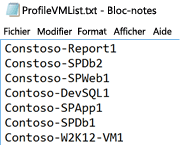

### <a name="start-profiling"></a>Démarrer le profilage
Après avoir établi la liste des machines virtuelles à profiler, vous pouvez exécuter l’outil en mode profilage. Voici la liste des paramètres obligatoires et facultatifs de l’outil à exécuter en mode profilage.

ASRDeploymentPlanner.exe -Operation StartProfiling /?

| Nom du paramètre | Description |
|---|---|
| -Operation | StartProfiling |
| -Server | Le nom de domaine complet ou l’adresse IP du serveur vCenter/de l’hôte vSphere ESXi dont les machines virtuelles doivent être profilées.|
| -User | Le nom d’utilisateur pour se connecter au serveur vCenter/à l’hôte vSphere ESXi. L’utilisateur doit disposer au moins d’un accès en lecture seule.|
| -VMListFile |    Le fichier qui contient la liste des machines virtuelles à profiler. Le chemin d’accès du fichier peut être absolu ou relatif. Le fichier doit contenir un nom/une adresse IP de machine virtuelle par ligne. Le nom de la machine virtuelle spécifié dans le fichier doit être identique au nom de la machine virtuelle sur le serveur vCenter/l’hôte vSphere ESXi.<br>Par exemple, le fichier VMList.txt contient les machines virtuelles suivantes :<ul><li>virtual_machine_A</li><li>10.150.29.110</li><li>virtual_machine_B</li><ul> |
| -NoOfDaysToProfile | Le nombre de jours pendant lesquels le profilage doit être exécuté. Nous vous recommandons d’exécuter le profilage pendant plus de 15 jours pour vous assurer que le modèle de charge de travail de votre environnement sur la période spécifiée est observé et utilisé pour fournir une recommandation précise. |
| -Répertoire | (Facultatif) La convention d’appellation universelle (UNC) ou le chemin d’accès du répertoire local pour stocker les données de profilage générées pendant le profilage. Si aucun nom de répertoire n’est spécifié, le répertoire ProfiledData figurant dans le chemin d’accès actuel est utilisé comme répertoire par défaut. |
| -Mot de passe | (Facultatif) Le mot de passe utilisé pour se connecter au serveur vCenter/à l’hôte vSphere ESXi. Si vous spécifiez aucun mot de passe maintenant, vous êtes invité à l’indiquer à l’exécution de la commande.|
| -StorageAccountName | (Facultatif) Le nom du compte de stockage utilisé pour rechercher le débit réalisable pour la réplication des données locales vers Azure. L’outil charge les données de test sur ce compte de stockage pour calculer le débit.|
| -StorageAccountKey | (Facultatif) La clé du compte de stockage utilisée pour accéder au compte de stockage. Accédez au portail Azure > Comptes de stockage > <*Nom du compte de stockage*> > Paramètres > Clés d’accès > Key1 (ou clé d’accès principale pour le compte de stockage classique). |

Nous recommandons que vous profiliez vos machines virtuelles pendant au moins 15 à 30 jours. Pendant la période de profilage, ASRDeploymentPlanner.exe continue de s’exécuter. Les entrées du temps de profilage de l’outil sont indiquées en jours. Si vous souhaitez procéder au profilage pendant quelques heures ou quelques minutes dans le cadre d’un test rapide de l’outil, dans la préversion publique, vous devez convertir le temps en nombre de jours équivalent. Par exemple, pour un profilage de 30 minutes, l’entrée doit être égale à 30/(60*24) = 0,021 jours. Le temps de profilage minimum autorisé est de 30 minutes.

Pendant le profilage, vous pouvez éventuellement transmettre un nom et une clé du compte de stockage pour déterminer le débit que Site Recovery peut atteindre au moment de la réplication du serveur de configuration ou du serveur de processus vers Azure. Si la clé et le nom du compte de stockage ne sont pas transmis au cours du profilage, l’outil ne calcule pas le débit réalisable.

Vous pouvez exécuter plusieurs instances de l’outil pour différents ensembles de machines virtuelles. Veillez à ce que les noms des machines virtuelles ne soient pas répétés dans les ensembles de profilage. Exemple : si vous avez profilé dix machines virtuelles (VM1 à VM10) et que, après quelques jours, vous voulez profiler cinq autres machines virtuelles (VM11 à VM15) ; vous pouvez exécuter l’outil à partir d’une autre console de ligne de commande pour le second ensemble de machines virtuelles (VM11 à VM15). Assurez-vous que le second ensemble de machines virtuelles ne comporte pas de noms de machine virtuelle de la première instance de profilage ou utilisez un autre répertoire de sortie pour la seconde exécution. Si deux instances de l’outil sont utilisées pour profiler les mêmes machines virtuelles et que vous utilisez le même répertoire de sortie, le rapport généré sera incorrect.

Les configurations de machines virtuelles sont capturées une fois au début de l’opération de profilage et stockées dans un fichier appelé VMDetailList.xml. Ces informations sont utilisées lorsque le rapport est généré. Toute modification de configuration de machine virtuelle (par exemple, un nombre accru de cœurs, de disques ou de cartes réseau) du début à la fin du profilage n’est pas capturée. Si une configuration de machines virtuelles profilées est modifiée en cours de profilage, la solution de contournement dans la préversion publique consiste à obtenir les toutes dernières informations des machines virtuelles lorsque vous générez le rapport :

* Sauvegardez VMdetailList.xml et supprimez le fichier de son emplacement actuel.
* Transmettez les arguments -User et -Password au moment de la génération du rapport.

La commande de profilage génère plusieurs fichiers dans le répertoire de profilage. Ne supprimez pas les fichiers, car cela affecterait la génération de rapports.

#### <a name="example-1-profile-vms-for-30-days-and-find-the-throughput-from-on-premises-to-azure"></a>Exemple 1 : profiler des machines virtuelles pendant 30 jours et déterminer le débit pour le scénario « local vers Azure »
```
ASRDeploymentPlanner.exe -Operation StartProfiling -Directory “E:\vCenter1_ProfiledData” -Server vCenter1.contoso.com -VMListFile “E:\vCenter1_ProfiledData\ProfileVMList1.txt”  -NoOfDaysToProfile  30  -User vCenterUser1 -StorageAccountName  asrspfarm1 -StorageAccountKey Eby8vdM02xNOcqFlqUwJPLlmEtlCDXJ1OUzFT50uSRZ6IFsuFq2UVErCz4I6tq/K1SZFPTOtr/KBHBeksoGMGw==
```

#### <a name="example-2-profile-vms-for-15-days"></a>Exemple 2 : profiler des machines virtuelles pendant 15 jours

```
ASRDeploymentPlanner.exe -Operation StartProfiling -Directory “E:\vCenter1_ProfiledData” -Server vCenter1.contoso.com -VMListFile “E:\vCenter1_ProfiledData\ProfileVMList1.txt”  -NoOfDaysToProfile  15  -User vCenterUser1
```

#### <a name="example-3-profile-vms-for-1-hour-for-a-quick-test-of-the-tool"></a>Exemple 3 : profiler des machines virtuelles pendant 1 heure pour tester rapidement l’outil
```
ASRDeploymentPlanner.exe -Operation StartProfiling -Directory “E:\vCenter1_ProfiledData” -Server vCenter1.contoso.com -VMListFile “E:\vCenter1_ProfiledData\ProfileVMList1.txt”  -NoOfDaysToProfile  0.04  -User vCenterUser1
```

>[!NOTE]
>
>* Si le serveur sur lequel s’exécute l’outil est redémarré ou est tombé en panne, ou si vous fermez l’outil à l’aide de Ctrl + C, les données profilées sont conservées. Cependant, il existe un risque de manquer les 15 dernières minutes de données profilées. Dans ce cas, réexécutez l’outil en mode profilage après le redémarrage du serveur.
>* Lorsque le nom et la clé du compte de stockage sont transmis, l’outil mesure le débit au cours de la dernière étape du profilage. Si l’outil est fermé avant la fin du profilage, le débit n’est pas calculé. Pour trouver le débit avant de générer le rapport, vous pouvez exécuter l’opération GetThroughput à partir de la console de ligne de commande. Autrement, le rapport généré ne contient pas les informations de débit.


## <a name="generate-a-report"></a>Générer un rapport
L’outil génère un fichier Microsoft Excel avec les macros activées (fichier XLSM) en tant que sortie du rapport, qui résume toutes les recommandations de déploiement. Le rapport est intitulé DeploymentPlannerReport_<*identificateur numérique unique*>.xlsm et placé dans le répertoire spécifié.

À l’issue du profilage, vous pouvez exécuter l’outil en mode génération de rapport. Le tableau suivant contient une liste des paramètres obligatoires et facultatifs de l’outil à exécuter en mode génération de rapport.

`ASRDeploymentPlanner.exe -Operation GenerateReport /?`

|Nom du paramètre | Description |
|-|-|
| -Operation | GenerateReport |
| -Server |  Le nom de domaine complet ou l’adresse IP du serveur vCenter/vSphere (utilisez le même nom ou la même adresse IP que ceux utilisés lors du profilage) sur lequel se trouvent les machines virtuelles profilées dont le rapport doit être généré. Notez que si vous avez utilisé un serveur vCenter au moment du profilage, vous ne pouvez pas utiliser un serveur vSphere pour la génération de rapport, et inversement.|
| -VMListFile | Le fichier qui contient la liste des machines virtuelles profilées pour lesquels le rapport va être généré. Le chemin d’accès du fichier peut être absolu ou relatif. Le fichier doit contenir un nom ou une adresse IP de machine virtuelle par ligne. Les noms de machines virtuelles spécifiés dans le fichier doivent être identiques à ceux des machines virtuelles sur le serveur vCenter/l’hôte vSphere ESXi, et ils correspondent à ce qui a été utilisé au moment du profilage.|
| -Répertoire | (Facultatif) UNC ou chemin d’accès du répertoire local où les données profilées (fichiers générés lors du profilage) sont stockées. Ces données sont requises pour générer le rapport. Si aucun nom n’est spécifié, le répertoire ProfiledData est utilisé. |
| -GoalToCompleteIR | (Facultatif) Le nombre d’heures pendant lesquelles la réplication initiale des machines virtuelles profilées doit être effectuée. Le rapport généré indique le nombre de machines virtuelles pour lesquelles la réplication initiale peut être effectuée dans le délai spécifié. La valeur par défaut est 72 heures. |
| -User | (Facultatif) Le nom d’utilisateur permettant de se connecter au serveur vCenter/vSphere. Le nom est utilisé pour extraire les dernières informations de configuration des machines virtuelles, comme le nombre de disques, le nombre de cœurs, le nombre de cartes réseau, etc. à utiliser dans le rapport. Si aucun nom n’est fourni, les informations de configuration collectées au début du profilage sont utilisées. |
| -Mot de passe | (Facultatif) Le mot de passe utilisé pour se connecter au serveur vCenter/à l’hôte vSphere ESXi. Si le mot de passe n’est pas spécifié en tant que paramètre, vous êtes invité à l’indiquer ultérieurement à l’exécution de la commande. |
| -DesiredRPO | (Facultatif) L’objectif de point de récupération souhaité, en minutes. La valeur par défaut est 15 minutes.|
| -Bandwidth | Bande passante en Mbits/s. Le paramètre permet de calculer le RPO qui peut être atteint pour la bande passante spécifiée. |
| -StartDate | (Facultatif) La date et l’heure de début au format MM-JJ-AAAA:HH:MM (24 heures). Le paramètre *StartDate* doit être spécifié avec le paramètre *EndDate*. Si le paramètre StartDate est spécifié, le rapport est généré pour les données profilées collectées entre les dates StartDate et EndDate. |
| -EndDate | (Facultatif) La date et l’heure de fin au format MM-JJ-AAAA:HH:MM (24 heures). Le paramètre *EndDate* doit être spécifié avec le paramètre *StartDate*. Si le paramètre EndDate est spécifié, le rapport est généré pour les données profilées collectées entre les dates StartDate et EndDate. |
| -GrowthFactor | (Facultatif) Le facteur de croissance, exprimé en pourcentage. La valeur par défaut est 30 pour cent. |

#### <a name="example-1-generate-a-report-with-default-values-when-the-profiled-data-is-on-the-local-drive"></a>Exemple 1 :générer un rapport contenant des valeurs par défaut lorsque les données profilées sont situées sur le lecteur local
```
ASRDeploymentPlanner.exe -Operation GenerateReport -Server vCenter1.contoso.com -Directory “\\PS1-W2K12R2\vCenter1_ProfiledData” -VMListFile “\\PS1-W2K12R2\vCenter1_ProfiledData\ProfileVMList1.txt”
```

#### <a name="example-2-generate-a-report-when-the-profiled-data-is-on-a-remote-server"></a>Exemple 2 : générer un rapport lorsque les données profilées sont situées sur un serveur distant
Vous devez disposer d’un accès en lecture/écriture sur le répertoire distant.
```
ASRDeploymentPlanner.exe -Operation GenerateReport -Server vCenter1.contoso.com -Directory “\\PS1-W2K12R2\vCenter1_ProfiledData” -VMListFile “\\PS1-W2K12R2\vCenter1_ProfiledData\ProfileVMList1.txt”
```

#### <a name="example-3-generate-a-report-with-a-specific-bandwidth-and-goal-to-complete-ir-within-specified-time"></a>Exemple 3 : générer un rapport contenant la bande passante spécifique et les objectifs pour terminer le RI dans le temps indiqué
```
ASRDeploymentPlanner.exe -Operation GenerateReport -Server vCenter1.contoso.com -Directory “E:\vCenter1_ProfiledData” -VMListFile “E:\vCenter1_ProfiledData\ProfileVMList1.txt” -Bandwidth 100 -GoalToCompleteIR 24
```

#### <a name="example-4-generate-a-report-with-a-5-percent-growth-factor-instead-of-the-default-30-percent"></a>Exemple 4 : générer un rapport avec un facteur de croissance de 5 pour cent au lieu des 30 pour cent par défaut
```
ASRDeploymentPlanner.exe -Operation GenerateReport -Server vCenter1.contoso.com -Directory “E:\vCenter1_ProfiledData” -VMListFile “E:\vCenter1_ProfiledData\ProfileVMList1.txt” -GrowthFactor 5
```

#### <a name="example-5-generate-a-report-with-a-subset-of-profiled-data"></a>Exemple 5 : générer un rapport contenant un sous-ensemble de données profilées
Par exemple, vous disposez de 30 jours de données profilées et vous souhaitez générer un rapport pour une période de 20 jours seulement.
```
ASRDeploymentPlanner.exe -Operation GenerateReport -Server vCenter1.contoso.com -Directory “E:\vCenter1_ProfiledData” -VMListFile “E:\vCenter1_ProfiledData\ProfileVMList1.txt” -StartDate  01-10-2017:12:30 -EndDate 01-19-2017:12:30
```

#### <a name="example-6-generate-a-report-for-5-minute-rpo"></a>Exemple 6 : générer un rapport pour un RPO de 5 minutes
```
ASRDeploymentPlanner.exe -Operation GenerateReport -Server vCenter1.contoso.com -Directory “E:\vCenter1_ProfiledData” -VMListFile “E:\vCenter1_ProfiledData\ProfileVMList1.txt”  -DesiredRPO 5
```

## <a name="percentile-value-used-for-the-calculation"></a>Valeur de centile utilisée pour le calcul
**Quelle valeur de centile par défaut des indicateurs de performance collectés pendant le profilage l’outil va-t-il utiliser au moment de la génération de rapport ?**

L’outil est configuré par défaut sur les valeurs du 95e centile des E/S par seconde de lecture/écriture, des E/S par seconde d’écriture et de l’activité des données collectées pendant le profilage de toutes les machines virtuelles. Cette mesure garantit que le pic du 100e centile que vos machines virtuelles peuvent voir en raison d’événements temporaires n’est pas utilisé pour déterminer vos besoins de compte de stockage cible et de bande passante source. Par exemple, un événement temporaire peut être une tâche de sauvegarde exécutée une fois par jour, une indexation de base de données périodique ou une activité de génération de rapport d’analyse ou d’autres événements similaires ponctuels et de courte durée.

L’utilisation des valeurs du 95e centile permet de donner une image exacte des caractéristiques des charges de travail réelles et vous offre les meilleures performances lorsque les charges de travail s’exécutent sur Azure. Nous ne prévoyons pas que vous modifiiez ce numéro. Si vous modifiez la valeur (au 90e centile par exemple), vous pouvez mettre à jour le fichier de configuration *ASRDeploymentPlanner.exe.config* dans le dossier par défaut et l’enregistrer pour générer un nouveau rapport sur les données profilées existantes.
```
<add key="WriteIOPSPercentile" value="95" />      
<add key="ReadWriteIOPSPercentile" value="95" />      
<add key="DataChurnPercentile" value="95" />
```

## <a name="growth-factor-considerations"></a>Considérations relatives au facteur de croissance
**Pourquoi devrais-je tenir compte du facteur de croissance lors de la planification de déploiement ?**

Il est essentiel de tenir compte de la croissance dans vos caractéristiques de charge de travail en supposant une augmentation potentielle de l’utilisation au fil du temps. Une fois la protection en place, si les caractéristiques de votre charge de travail changent, vous ne pouvez pas basculer vers un compte de stockage différent pour la protection sans désactiver et réactiver la protection.

Par exemple, supposons que, aujourd’hui, votre machine virtuelle s’intègre dans un compte de réplication de stockage standard. Au cours des trois derniers mois, plusieurs modifications sont susceptibles de se produire :

* Le nombre d’utilisateurs de l’application qui s’exécute sur la machine virtuelle va augmenter.
* L’activité accrue en résultant sur la machine virtuelle va nécessiter que la machine virtuelle devienne un stockage premium de sorte que la réplication Site Recovery puisse suivre le rythme.
* Par conséquent, vous devez désactiver et réactiver la protection de compte de stockage premium.

Nous vous recommandons de planifier la croissance pendant la planification du déploiement et pendant que la valeur par défaut est 30 pour cent. Vous êtes expert du modèle d’utilisation de vos applications et des projections de croissance et vous pouvez modifier ce nombre en conséquence lors de la génération d’un rapport. En outre, vous pouvez générer plusieurs rapports avec différents facteurs de croissance avec les mêmes données profilées et déterminer les recommandations de stockage cible et de bande passante source fonctionnent le mieux pour vous.

Le rapport Microsoft Excel généré contient les informations suivantes :

* [Input](site-recovery-deployment-planner.md#input)
* [Recommandations](site-recovery-deployment-planner.md#recommendations-with-desired-rpo-as-input)
* [Recommandations : entrée de bande passante](site-recovery-deployment-planner.md#recommendations-with-available-bandwidth-as-input)
* [VM<->Storage Placement](site-recovery-deployment-planner.md#vm-storage-placement)
* [Compatible VMs](site-recovery-deployment-planner.md#compatible-vms)
* [Incompatible VMs](site-recovery-deployment-planner.md#incompatible-vms)


## <a name="get-throughput"></a>GetThroughput

Pour estimer le débit que Site Recovery peut atteindre pendant la réplication de données locales vers Azure, exécutez l’outil en mode GetThroughput. L’outil calcule le débit à partir du serveur sur lequel l’outil est exécuté. Idéalement, ce serveur est basé sur le guide de dimensionnement des serveurs de configuration. Si vous avez déjà déployé les composants d’infrastructure Site Recovery en local, exécutez l’outil sur le serveur de configuration.

Ouvrez une console de ligne de commande et accédez au dossier de l’outil de planification du déploiement Site Recovery. Exécutez ASRDeploymentPlanner.exe avec les paramètres ci-dessous.

`ASRDeploymentPlanner.exe -Operation GetThroughput /?`

|Nom du paramètre | Description |
|-|-|
| -operation | GetThroughput |
| -Répertoire | (Facultatif) UNC ou chemin d’accès du répertoire local où les données profilées (fichiers générés lors du profilage) sont stockées. Ces données sont requises pour générer le rapport. Si aucun nom de répertoire n’est spécifié, le répertoire ProfiledData est utilisé. |
| -StorageAccountName | Le nom du compte de stockage Azure permettant de déterminer la bande passante utilisée pour la réplication des données locales vers Azure. L’outil charge les données de test sur ce compte de stockage pour trouver la bande passante consommée. |
| -StorageAccountKey | La clé du compte de stockage utilisée pour accéder au compte de stockage. Accédez au portail Azure > Comptes de stockage > <*Nom du compte de stockage*> > Paramètres > Clés d’accès > Key1 (ou clé d’accès principale pour un compte de stockage classique). |
| -VMListFile | Le fichier qui contient la liste des machines virtuelles à profiler pour calculer la bande passante consommée. Le chemin d’accès du fichier peut être absolu ou relatif. Le fichier doit contenir un nom/une adresse IP de machine virtuelle par ligne. Les noms de machine virtuelle spécifiés dans le fichier doivent être identiques au nom des machines virtuelles sur le serveur vCenter/l’hôte vSphere ESXi.<br>Par exemple, le fichier VMList.txt contient les machines virtuelles suivantes :<ul><li>VM_A</li><li>10.150.29.110</li><li>VM_B</li></ul>|

L’outil crée plusieurs fichiers asrvhdfile<#>.vhd de 64 Mo (où # représente le nombre de fichiers) dans le répertoire spécifié. L’outil charge ces fichiers sur le compte de stockage pour déterminer le débit. Une fois le débit mesuré, l’outil supprime tous les fichiers du compte de stockage et du serveur local. Si l’outil est interrompu pour une raison quelconque alors qu’il calcule le débit, cela ne supprime pas les fichiers du stockage ou du serveur local. Vous devrez les supprimer manuellement.

Le débit est mesuré à un moment donné et il s’agit du débit maximal que Site Recovery peut atteindre lors d’une réplication, sous réserve que tous les autres facteurs restent identiques. Par exemple, si une application commence à consommer davantage de bande passante sur le même réseau, le débit réel varie pendant la réplication. Si vous exécutez la commande GetThroughput à partir d’un serveur de configuration, l’outil ne reconnaît pas les machines virtuelles protégées ni la réplication en cours. Le résultat du débit mesuré est différent si l’opération GetThroughput est exécutée lorsque les machines virtuelles protégées présentent des taux d’activité élevés. Nous vous recommandons d’exécuter l’outil à différents moments dans le temps pendant le profilage pour comprendre les niveaux de débit pouvant être atteints à des moments différents. Dans le rapport, l’outil affiche le dernier débit mesuré.

### <a name="example"></a>Exemple
```
ASRDeploymentPlanner.exe -Operation GetThroughput -Directory  E:\vCenter1_ProfiledData -VMListFile E:\vCenter1_ProfiledData\ProfileVMList1.txt  -StorageAccountName  asrspfarm1 -StorageAccountKey by8vdM02xNOcqFlqUwJPLlmEtlCDXJ1OUzFT50uSRZ6IFsuFq2UVErCz4I6tq/K1SZFPTOtr/KBHBeksoGMGw==
```

>[!NOTE]
>
> Exécutez l’outil sur un serveur doté des mêmes caractéristiques de stockage et de processeur que le serveur de configuration.
>
> Pour la réplication, définissez la bande passante recommandée pour atteindre le RPO souhaité en permanence. Après avoir défini la bande passante appropriée, si vous ne constatez pas d’augmentation du débit atteint signalé par l’outil, vérifiez les points suivants :
>
>  1. Vérifiez si un réseau Qualité de Service (QoS) limite le débit Site Recovery.
>
>  2. Vérifiez si votre coffre Site Recovery se trouve dans la région Microsoft Azure physique prise en charge la plus proche pour réduire la latence du réseau.
>
>  3. Vérifiez les caractéristiques de stockage local pour déterminer si vous pouvez améliorer le matériel (par exemple, passer d’un disque dur à un disque SSD).
>
>  4. Modifiez les paramètres Site Recovery sur le serveur de processus pour [augmenter la quantité de bande passante réseau utilisée pour la réplication](./site-recovery-plan-capacity-vmware.md#control-network-bandwidth).

## <a name="recommendations-with-desired-rpo-as-input"></a>Recommandations liées au RPO souhaité en tant qu’entrée

### <a name="profiled-data"></a>Données profilées


**Profiled data period**: la période pendant laquelle le profilage a été exécuté. Par défaut, l’outil inclut toutes les données profilées pour le calcul, sauf s’il génère le rapport pour une période spécifique à l’aide des options StartDate et EndDate pendant la génération du rapport.

**Server Name** : le nom ou l’adresse IP de VMware vCenter ou de l’hôte ESXi dont le rapport des machines virtuelles est généré.

**Desired RPO** :l’objectif de point de récupération (RPO) de votre déploiement. Par défaut, la bande passante réseau requise est calculée pour les valeurs RPO de 15, 30 et 60 minutes. En fonction de la sélection, les valeurs concernées sont mises à jour sur la feuille. Si vous avez utilisé le paramètre *DesiredRPOinMin* lors de la génération du rapport, cette valeur est affichée dans le résultat Desired RPO.

### <a name="profiling-overview"></a>Vue d’ensemble du profilage

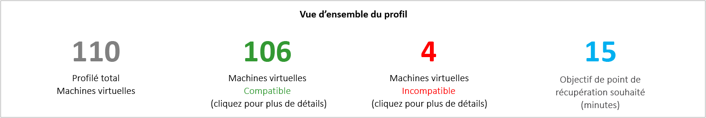

**Total Profiled Virtual Machines** : le nombre total de machines virtuelles dont les données profilées sont disponibles. Si le fichier VMListFile contient des noms de machines virtuelles qui n’ont pas été profilées, celles-ci ne sont pas prises en compte dans la génération de rapport et sont exclues du nombre total de machines virtuelles profilées.

**Compatible Virtual Machines** : le nombre de machines virtuelles pouvant être protégées dans Azure à l’aide de Site Recovery. Il s’agit du nombre total de machines virtuelles compatibles pour lesquelles la bande passante réseau requise, le nombre de comptes de stockage, le nombre de cœurs Azure et le nombre de serveurs de configuration et de serveurs de processus supplémentaires sont calculés. Les détails de chaque machine virtuelle compatible sont disponibles dans la section « Machines virtuelles compatibles ».

**Incompatible Virtual Machines** : le nombre de machines virtuelles qui sont incompatibles pour la protection assurée avec Site Recovery. Les raisons de l’incompatibilité sont indiquées dans la section Machines virtuelles incompatibles. Si VMListFile contient des noms de machines virtuelles qui n’ont pas été profilées, ces machines virtuelles sont exclues du nombre de machines virtuelles incompatibles. Ces machines virtuelles sont répertoriées comme « Data not found » à la fin de la section Machines virtuelles incompatibles.

**Desired RPO** : votre objectif de point de récupération souhaité, en minutes. Le rapport est généré pour les trois valeurs RPO : 15 (valeur par défaut), 30 et 60 minutes. La recommandation de la bande passante dans le rapport est modifiée en fonction de votre sélection dans la liste déroulante « Desired RPO » dans l’angle supérieur droit de la feuille. Si vous avez généré le rapport à l’aide du paramètre *-DesiredRPO* avec une valeur personnalisée, cette valeur personnalisée s’affiche par défaut dans la liste déroulante « Desired RPO ».

### <a name="required-network-bandwidth-mbps"></a>Bande passante réseau requise (Mbits/s)

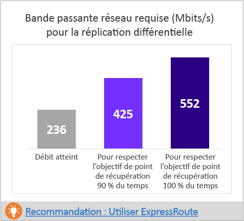

**To meet RPO 100 percent of the time :** la bande passante recommandée en Mbits/s à allouer pour atteindre votre RPO souhaité 100 pour cent du temps. Cette quantité de bande passante doit être dédiée à la réplication différentielle à l’état stable de toutes vos machines virtuelles compatibles afin d’éviter toute violation de RPO.

**To meet RPO 90 percent of the time :** en raison de la tarification haut débit ou pour toute autre raison, si vous ne pouvez pas configurer la bande passante nécessaire pour atteindre votre RPO souhaité 100 pour cent du temps, vous pouvez choisir un paramètre de bande passante inférieure pouvant satisfaire votre RPO souhaité 90 pour cent du temps. Pour comprendre les implications de la configuration de cette bande passante réduite, le rapport fournit une analyse par simulation du nombre et de la durée de violations de RPO à attendre.

**Achieved Throughput :** le débit du serveur sur lequel vous avez exécuté la commande GetThroughput pour la région Microsoft Azure où se trouve le compte de stockage. Cette valeur de débit indique le niveau estimé que vous pouvez obtenir lorsque vous protégez les machines virtuelles compatibles à l’aide de Site Recovery, sous réserve que les caractéristiques de réseau et de stockage du serveur de configuration/serveur de processus demeurent identiques à celles du serveur à partir duquel vous avez exécuté l’outil.

Pour la réplication, vous devez définir la bande passante recommandée pour atteindre le RPO souhaité en permanence. Après avoir défini la bande passante, si vous ne constatez pas d’augmentation du débit atteint signalé par l’outil, vérifiez les points suivants :

1. Vérifiez si un réseau Qualité de Service (QoS) limite le débit Site Recovery.

2. Vérifiez si votre coffre Site Recovery se trouve dans la région Microsoft Azure physique prise en charge la plus proche pour réduire la latence du réseau.

3. Vérifiez les caractéristiques de stockage local pour déterminer si vous pouvez améliorer le matériel (par exemple, passer d’un disque dur à un disque SSD).

4. Modifiez les paramètres Site Recovery sur le serveur de processus pour [augmenter la quantité de bande passante réseau utilisée pour la réplication](./site-recovery-plan-capacity-vmware.md#control-network-bandwidth).

Si vous exécutez l’outil sur un serveur de configuration ou un serveur de processus qui a déjà protégé les machines virtuelles, exécutez l’outil plusieurs fois. La valeur de débit atteint change selon la quantité des données d’activité en cours de traitement à ce moment précis.

Pour tous les déploiements Site Recovery d’entreprise, nous vous recommandons d’utiliser [ExpressRoute](https://aka.ms/expressroute).

### <a name="required-storage-accounts"></a>Comptes de stockage requis
Le graphique suivant indique le nombre total de comptes de stockage (standard et premium) nécessaires pour protéger toutes les machines virtuelles compatibles. Pour savoir quel compte de stockage utiliser pour chaque machine virtuelle, consultez la section « VM-storage placement ».

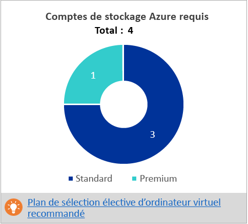

### <a name="required-number-of-azure-cores"></a>Required number of Azure cores
Il s’agit du nombre total de cœurs à configurer avant le basculement ou le test de basculement de l’ensemble des machines virtuelles compatibles. Si un nombre insuffisant de cœurs est disponible dans l’abonnement, Site Recovery ne peut pas créer de machines virtuelles au moment du basculement ou du test de basculement.

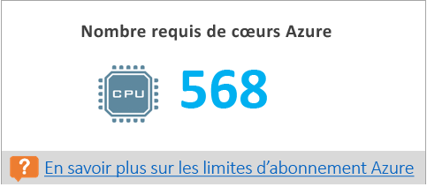

### <a name="required-on-premises-infrastructure"></a>Required on-premises infrastructure
Il s’agit du nombre total de serveurs de processus supplémentaires et de serveurs de configuration à configurer qui suffirait pour protéger toutes les machines virtuelles compatibles. En fonction des [recommandations de taille pour le serveur de configuration](https://aka.ms/asr-v2a-on-prem-components) prises en charge, l’outil peut recommander des serveurs supplémentaires. La recommandation est basée sur la valeur la plus élevée entre l’activité quotidienne et le nombre maximal de machines virtuelles protégées (en partant d’une moyenne de trois disques par machine virtuelle), peu importe que le serveur de configuration ou le serveur de processus supplémentaire soit atteint en premier. Vous trouverez tous les détails de l’activité totale quotidienne et du nombre total de disques protégés se trouvent dans la section Input.

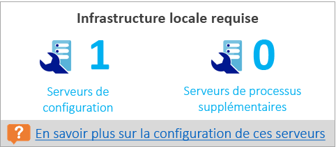

### <a name="what-if-analysis"></a>Analyse de scénarios
Cette analyse indique le nombre de violations susceptibles de se produire pendant la période de profilage lorsque vous configurez une bande passante plus faible pour que le RPO souhaité ne soit rempli que 90 pour cent du temps. Une ou plusieurs violations de RPO peuvent se produire sur un jour donné. Le graphique affiche le pic RPO de la journée.
En vous appuyant sur cette analyse, vous pouvez décider si le nombre de violations de RPO tous les jours et d’accès RPO maximal par jour est acceptable avec la bande passante inférieure spécifiée. S’il est acceptable, vous pouvez allouer la bande passante inférieure pour la réplication. Sinon, allouez la bande passante supérieure, comme suggéré pour atteindre le RPO souhaité 100 pour cent du temps.

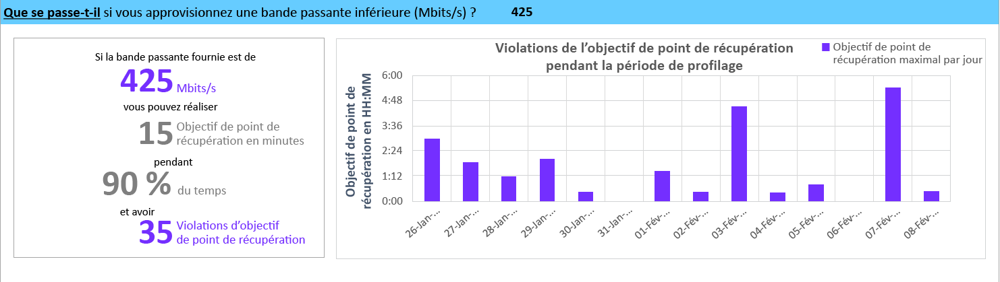

### <a name="recommended-vm-batch-size-for-initial-replication"></a>Recommended VM batch size for initial replication
Dans cette section, nous recommandons le nombre de machines virtuelles qui peuvent être protégées en parallèle pour effectuer la réplication initiale dans les 72 heures avec la bande passante suggérée pour respecter le RPO souhaité en permanence. Cette valeur est configurable. Pour modifier cette valeur au moment de la génération de rapports, utilisez le paramètre *GoalToCompleteIR*.

Ce graphique affiche une plage de valeurs de bande passante et un nombre de tailles de lot de machines virtuelles pour effectuer une réplication initiale en 72 heures en fonction de la taille moyenne de machine virtuelle détectée sur toutes les machines virtuelles compatibles.

Dans la préversion publique, le rapport ne spécifie pas les machines virtuelles à inclure dans un lot. Vous pouvez utiliser la taille de disque indiquée dans la section « Machines virtuelles compatibles » pour déterminer la taille de chaque machine virtuelle, et sélectionner des machines virtuelles pour un lot, ou les sélectionner en fonction des caractéristiques de charge de travail connues. La durée d’exécution de la réplication initiale change proportionnellement en fonction de la taille de disque réelle des machines virtuelles, de l’espace disque utilisé et du débit réseau disponible.

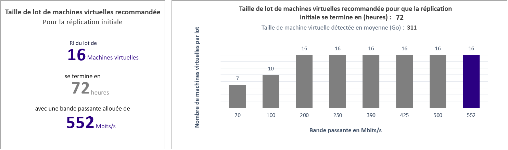

### <a name="growth-factor-and-percentile-values-used"></a>Growth factor and percentile values used
Cette section figurant en bas de la feuille indique la valeur de centile utilisé pour tous les compteurs de performances des machines virtuelles profilées (par défaut : 95e centile) et le facteur de croissance (par défaut : 30 %) qui est utilisé dans tous les calculs.

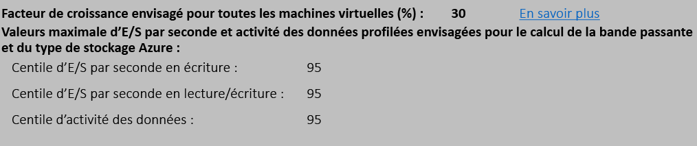

## <a name="recommendations-with-available-bandwidth-as-input"></a>Recommandations relatives à la bande passante disponible comme entrée

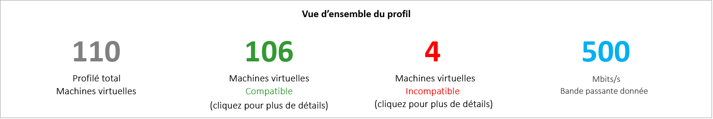

Vous pouvez vous trouver dans une situation dans laquelle vous ne pouvez pas configurer une bande passante supérieure à x Mbits/s pour la réplication Site Recovery. L’outil vous permet d’entrer la bande passante disponible (à l’aide du paramètre -Bandwidth lors de la génération de rapport) et d’obtenir le RPO réalisable en minutes. Avec cette valeur de RPO réalisable, vous pouvez choisir de configurer une bande passante supplémentaire ou vous contenter d’une solution de récupération d’urgence avec ce RPO.


## <a name="input"></a>Entrée
La feuille de calcul Input fournit une vue d’ensemble de l’environnement VMware profilé.

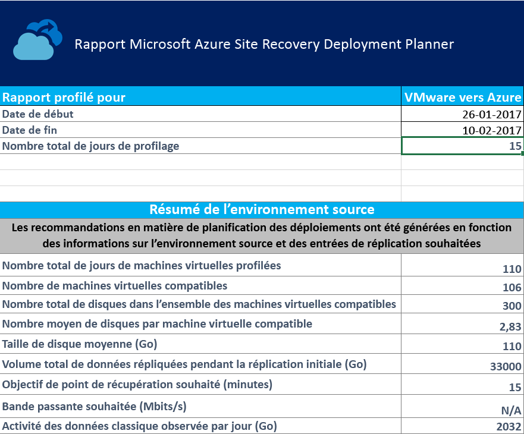

**Start Date** et **End Date** : les dates de début et de fin du profilage des données prises en compte pour la génération de rapport. Par défaut, la date de début est la date à laquelle le profilage démarre, et la date de fin est la date à laquelle le profilage s’arrête. Il peut s’agir des valeurs StartDate et EndDate si le rapport est généré avec ces paramètres.

**Total number of profiling days** : le nombre total de jours de profilage compris entre les dates de début et de fin pendant lesquelles le rapport est généré.

**Number of compatible virtual machines** : le nombre total de machines virtuelles compatibles pour lesquelles la bande passante réseau requise, ainsi que le nombre requis de comptes de stockage, de cœurs Microsoft Azure et de serveurs de processus supplémentaires et de serveurs de configuration sont calculés.

**Total number of disks across all compatible virtual machines** : ce nombre est utilisé comme nombre d’entrées pour déterminer le nombre de serveurs de processus supplémentaires et de serveurs de configuration à utiliser dans le déploiement.

**Average number of disks per compatible virtual machine** : le nombre moyen de disques calculé sur toutes les machines virtuelles compatibles.

**Average disk size (GB)** : la taille de disque moyenne calculée sur toutes les machines virtuelles compatibles.

**Desired RPO (minutes)** : l’objectif de point de récupération par défaut ou la valeur transmise pour le paramètre DesiredRPO au moment de la génération de rapport pour estimer la bande passante requise.

**Desired bandwidth (Mbps)** : la valeur que vous avez transmise pour le paramètre Bandwidth au moment de la génération de rapport pour estimer le RPO réalisable.

**Observed typical data churn per day (GB)** : l’activité moyenne des données observée tous les jours de profilage. Ce nombre est utilisé comme nombre d’entrées pour déterminer le nombre de serveurs de processus supplémentaires et de serveurs de configuration à utiliser dans le déploiement.


## <a name="vm-storage-placement"></a>VM-storage placement

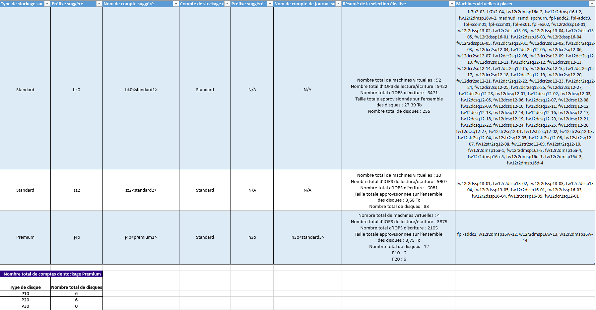

**Disk Storage Type** : le compte de stockage standard ou premium utilisé pour répliquer toutes les machines virtuelles correspondantes, mentionnées dans la colonne **VMs to Place**.

**Suggested Prefix** : le préfixe suggéré à trois caractères qui permet de nommer le compte de stockage. Vous pouvez utiliser votre propre préfixe, mais la suggestion de l’outil suit la [convention d’affectation de noms aux partitions pour les comptes de stockage](https://aka.ms/storage-performance-checklist).

**Suggested Account Name** : le nom du compte de stockage après lequel vous incluez le préfixe suggéré. Remplacez le nom entre crochets pointus(< and >) avec votre entrée personnalisée.

**Log Storage Account :** tous les journaux de réplication sont stockés dans un compte de stockage standard. Pour les machines virtuelles qui répliquent vers un compte de stockage premium, configurez un compte de stockage standard supplémentaire pour le stockage des journaux. Un seul et même compte de stockage standard des journaux peut être utilisé par plusieurs comptes de stockage de réplication premium. Les machines virtuelles qui sont répliquées vers les comptes de stockage standard utilisent le même compte de stockage pour les journaux.

**Suggested Log Account Name** : le nom de votre compte de stockage des journaux après lequel vous incluez le préfixe suggéré. Remplacez le nom entre crochets pointus(< and >) avec votre entrée personnalisée.

**Placement Summary** : un résumé de la charge totale des machines virtuelles sur le compte de stockage au moment de la réplication et du test de basculement/basculement. Il inclut le nombre total de machines virtuelles mappées au compte de stockage, le total des E/S par seconde de lecture/écriture sur toutes les machines virtuelles placées dans ce compte de stockage, le total des E/S par seconde d’écriture (réplication), la taille totale configurée sur tous les disques ainsi que le nombre total de disques.

**Virtual Machines to Place** : une liste de toutes les machines virtuelles qui doivent être placées dans le compte de stockage donné pour optimiser les performances et l’utilisation.

## <a name="compatible-vms"></a>Machines virtuelles compatibles
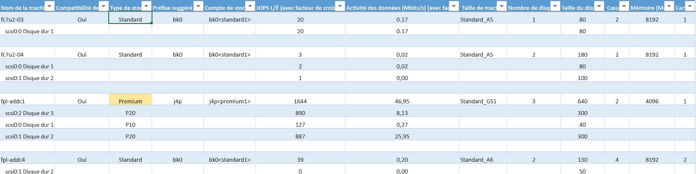

**VM Name** : nom de la machine virtuelle ou adresse IP utilisés dans VMListFile lorsqu’un rapport est généré. Cette colonne répertorie également les disques (VMDK) qui sont attachés aux machines virtuelles. Pour distinguer les machines virtuelles vCenter avec des noms ou des adresses IP en double, les noms incluent le nom de l’hôte ESXi. L’hôte ESXi répertorié est celui dans lequel la machine virtuelle a été placée lors de la détection de l’outil pendant le profilage.

**VM Compatibility** : les valeurs sont **Oui** et **Oui**\*. **Oui**\* : pour les instances dans lesquelles la machine virtuelle est adaptée pour [le stockage Premium Azure](https://aka.ms/premium-storage-workload). Ici l’activité élevée profilée ou le disque d’E/S par seconde se classe dans la catégorie P20 ou P30, mais la taille du disque entraîne classification inférieure à P10 ou P20. Le compte de stockage décide du type de disque de stockage Premium sur lequel mapper un disque, en fonction de sa taille. Par exemple :
* < 128 Go : disque P10.
* 128 Go à 512 Go : disque P20.
* 512 Go à 1 023 Go : disque P30.

Si les caractéristiques de charge de travail d’un disque le placent dans la catégorie P20 ou P30, mais que la taille le mappe à un niveau ou à un type de disque de stockage premium inférieur, l’outil marque cette machine virtuelle comme **Oui**\*. L’outil recommande également que vous modifiiez la taille du disque source pour que celui s’adapte au type de disque de stockage premium recommandé, ou que vous modifiiez le type de disque cible après le basculement.

**Storage Type** : standard ou premium.

**Suggested Prefix** : le préfixe de compte de stockage à trois caractères.

**Storage Account** : le nom utilisé par le préfixe du compte de stockage suggéré.

**R/W IOPS (with Growth Factor)** : les opérations d’E/S par seconde de lecture/écriture de la charge de travail de pointe sur le disque (95e centile par défaut), y compris le facteur de croissance futur (30 pour cent par défaut). Notez que les E/S par seconde en lecture/écriture d’une machine virtuelle ne sont pas toujours la somme des E/S par seconde en lecture/écriture des disques individuels de la machine virtuelle, car les E/S par seconde en lecture/écriture de pointe de la machine virtuelle représentent le pic de la somme des E/S par seconde de ses disques individuels pendant chaque minute de la période de profilage.

**Data Churn in Mbps (with Growth Factor)** : le taux d’activité de pointe sur le disque (95e centile par défaut), y compris le facteur de croissance futur (30 % par défaut). Notez que le taux total d’activité des données de la machine virtuelle n’est pas toujours la somme des taux d’activité des données des disques individuels de la machine virtuelle, car le taux d’activité de pointe de la machine virtuelle représente le pic de la somme du taux d’activité de ses disques individuels pendant chaque minute de la période de profilage.

**Azure VM Size** : la taille de machine virtuelle d’Azure Cloud Services mappée idéale pour cette machine virtuelle locale. Le mappage est basé sur la mémoire, le nombre de disques/cœurs/cartes réseau de la machine virtuelle locale, et les E/S par seconde en lecture/écriture. La recommandation est toujours la plus petite taille de machine virtuelle Azure qui correspond à toutes les caractéristiques des machines virtuelles locales.

**Number of Disks** : le nombre total de disques de machines virtuelles (VMDK) sur la machine virtuelle.

**Disk size (GB)** : la taille totale d’installation de tous les disques de la machine virtuelle. L’outil affiche également la taille des disques individuels de la machine virtuelle.

**Cores** : le nombre de cœurs de processeur de la machine virtuelle.

**Memory (MB)** : la mémoire RAM de la machine virtuelle.

**NICs** : le nombre de cartes réseau de la machine virtuelle.

## <a name="incompatible-vms"></a>Machines virtuelles incompatibles

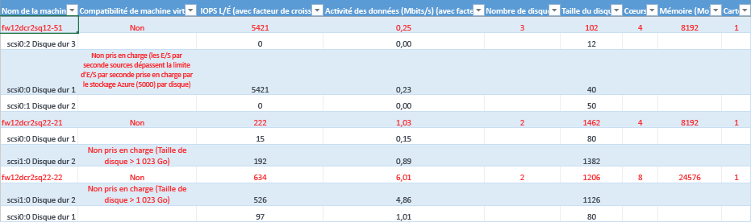

**VM Name** : nom de la machine virtuelle ou adresse IP utilisés dans VMListFile lorsqu’un rapport est généré. Cette colonne répertorie également les disques de machines virtuelles qui sont attachés aux machines virtuelles. Pour distinguer les machines virtuelles vCenter avec des noms ou des adresses IP en double, les noms incluent le nom de l’hôte ESXi. L’hôte ESXi répertorié est celui dans lequel la machine virtuelle a été placée lors de la détection de l’outil pendant le profilage.

**VM Compatibility** : indique pourquoi la machine virtuelle spécifiée est incompatible avec une utilisation avec Site Recovery. Les raisons sont décrites pour chaque disque incompatible de la machine virtuelle et, en fonction des [limites de stockage](https://aka.ms/azure-storage-scalbility-performance), peuvent figurer parmi les suivantes :

* Taille du disque > 1 023 Go. Actuellement, le stockage Azure ne prend pas en charge les tailles de supérieures à 1 To.

* La taille totale de machine virtuelle (réplication + TFO) dépasse la limite de taille du compte de stockage prise en charge (35 To). Cette incompatibilité se produit généralement lorsqu’un seul disque de la machine virtuelle présente une caractéristique de performances dépassant les limites maximales prises en charge Azure ou Site Recovery pour le stockage standard. Une telle instance envoie la machine virtuelle dans la zone de stockage premium en mode Push. Néanmoins, la taille maximale prise en charge d’un compte de stockage premium est de 35 To, et une seule et même machine virtuelle protégée ne peut pas être protégée sur plusieurs comptes de stockage. Notez également que, lorsqu’un test de basculement est exécuté sur une machine virtuelle protégée, elle s’exécute dans le compte de stockage où la réplication est en cours. Dans ce cas, configurez 2 fois la taille du disque pour que la progression de la réplication et le test de basculement réussissent en parallèle.
* Les E/S par seconde source excèdent la limite des E/S par seconde prise en charge par le stockage qui est de 5 000 par disque.
* Les E/S par seconde source excèdent la limite des E/S par seconde prise en charge par le stockage qui est de 80 000 par machine virtuelle.
* L’activité moyenne des données dépasse la limite d’activité des données prise en charge par Site Recovery, qui est de 10 Mbits/s pour la taille d’E/S moyenne de disque.
* L’activité totale des données sur tous les disques de la machine virtuelle dépasse la limite d’activité des données maximale prise en charge par Site Recovery, qui est de 54 Mbits/s par machine virtuelle.
* Les E/S par seconde d’écriture moyennes effectives dépassent la limite des E/S par seconde prise en charge par Site Recovery, qui est de 840 par disque.
* Le stockage calculé des captures instantanées dépasse la limite de stockage des captures instantanées prise en charge, qui est de 10 To.

**R/W IOPS (with Growth Factor)** : les opérations d’E/S par seconde de la charge de travail de pointe sur le disque (95e centile par défaut), y compris le facteur de croissance futur (30 pour cent par défaut). Notez que les E/S par seconde en lecture/écriture de la machine virtuelle ne sont pas toujours la somme des E/S par seconde en lecture/écriture des disques individuels de la machine virtuelle, car les E/S par seconde en lecture/écriture de pointe de la machine virtuelle représentent le pic de la somme des E/S par seconde de ses disques individuels pendant chaque minute de la période de profilage.

**Data Churn in Mbps (with Growth Factor)** : le taux d’activité de pointe sur le disque (95e centile par défaut), y compris le facteur de croissance futur (par défaut : 30 pour cent). Notez que le taux total d’activité des données de la machine virtuelle n’est pas toujours la somme des taux d’activité des données des disques individuels de la machine virtuelle, car le taux d’activité de pointe de la machine virtuelle représente le pic de la somme du taux d’activité de ses disques individuels pendant chaque minute de la période de profilage.

**Number of Disks** : le nombre total de disques de machines virtuelles (VMDK) sur la machine virtuelle.

**Disk size (GB)** : la taille totale d’installation de tous les disques de la machine virtuelle. L’outil affiche également la taille des disques individuels de la machine virtuelle.

**Cores** : le nombre de cœurs de processeur de la machine virtuelle.

**Memory (MB)** : la quantité de RAM sur la machine virtuelle.

**NICs** : le nombre de cartes réseau de la machine virtuelle.


## <a name="site-recovery-limits"></a>Limites Azure Site Recovery

**Stockage de réplication cible** | **Taille d’E/S moyenne de disque source** |**Activité des données moyenne de disque source** | **Total de l’activité des données de disque source par jour**
---|---|---|---
Stockage Standard | 8 Ko    | 2 Mbits/s | 168 Go par disque
Disque P10 Premium | 8 Ko    | 2 Mbits/s | 168 Go par disque
Disque P10 Premium | 16 Ko | 4 Mbits/s |    336 Go par disque
Disque P10 Premium | 32 Ko ou plus | 8 Mbits/s | 672 Go par disque
Disque Premium P20 ou P30 | 8 Ko    | 5 Mbits/s | 421 Go par disque
Disque Premium P20 ou P30 | 16 Ko ou plus |10 Mbits/s | 842 Go par disque

Il s’agit de moyennes en partant sur un chevauchement d’E/S de 30 pour cent. Site Recovery est capable de gérer un débit plus élevé en fonction du ratio de chevauchement, de tailles d’écriture plus grandes et du comportement d’E/S des charges de travail réelles. Les valeurs précédentes supposent un retard de traitement typique de cinq minutes. Autrement dit, une fois que les données sont chargées, elles sont traitées, et un point de récupération est créé dans un délai de cinq minutes.

Les limites sont basées sur nos tests, mais ne peuvent pas couvrir toutes les combinaisons d’E/S d’application possibles. Les résultats réels varient en fonction de la combinaison d’E/S de votre application. Pour de meilleurs résultats, même après la planification du déploiement, nous recommandons toujours que vous effectuiez des tests d’application approfondis à l’aide d’un test de basculement pour obtenir une image réelle des performances.

## <a name="updating-the-deployment-planner"></a>Mise à jour de Deployment planner
Pour mettre à jour Deployment planner, procédez comme suit :

1. Téléchargez la dernière version [d’Azure Site Recovery deployment planner](https://aka.ms/asr-deployment-planner).

2. Copiez le dossier .zip sur le serveur sur lequel vous souhaitez l’exécuter.

3. Extrayez le dossier .zip.

4. Effectuez l’une des actions suivantes :
 * Si la dernière version ne contient pas de correctif de profilage, et que le profilage est déjà en cours sur votre version actuelle de la planification, passez au profilage.
 * Si la dernière version contient un correctif de profilage, nous vous recommandons d’arrêter le profilage sur votre version actuelle et de redémarrer le profilage avec la nouvelle version.

  >[!NOTE]
  >
  >Lorsque vous démarrez le profilage avec la nouvelle version, transmettez le même chemin de répertoire de sortie de sorte que l’outil ajoute les données de profil sur les fichiers existants. Un ensemble complet de données profilées est utilisé pour générer le rapport. Si vous transmettez un répertoire de sortie différent, des fichiers sont créés et les anciennes données profilées ne sont pas utilisées pour générer les rapports.
  >
  >Chaque nouveau deployment planner est une mise à jour cumulative du fichier .zip. Vous n’avez pas besoin de copier les fichiers les plus récents dans le dossier précédent. Vous pouvez créer un dossier et l’utiliser.


## <a name="version-history"></a>Historique des versions
### <a name="11"></a>1.1
Mise à jour : 9 mars 2017

Les problèmes suivants ont été résolus :

* L’outil ne peut pas profiler de machines virtuelles si vCenter possède au moins deux machines virtuelles ayant le même nom ou la même adresse IP sur plusieurs hôtes ESXi.
* La copie et la recherche ont été désactivées pour les feuilles de travail « Compatible VMs » et « Incompatible VMs ».

### <a name="10"></a>1.0
Mise à jour : 23 février 2017

La préversion publique d’Azure Site Recovery Deployment Planner 1.0 rencontre les problèmes connus suivants (à traiter dans les prochaines mises à jour) :

* L’outil fonctionne uniquement pour les scénarios VMware vers Azure, mais pas pour les déploiements Hyper-V vers Azure. Pour ces scénarios Hyper-V vers Azure, utilisez [l’outil de planification de la capacité Hyper-V](./site-recovery-capacity-planning-for-hyper-v-replication.md).
* L’opération GetThroughput n’est pas prise en charge dans les régions Microsoft Azure US Government et Chine.
* L’outil ne peut pas profiler de machines virtuelles si le serveur vCenter possède au moins deux machines virtuelles ayant le même nom ou la même adresse IP sur plusieurs hôtes ESXi. Dans cette version, l’outil ignore le profilage des noms ou adresses IP des machines virtuelles en double dans le fichier VMListFile. La solution de contournement consiste à profiler des machines virtuelles à l’aide d’un hôte ESXi au lieu du serveur vCenter. Vous devez exécuter une instance par hôte ESXi.

