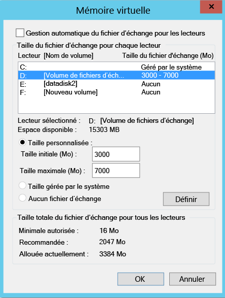
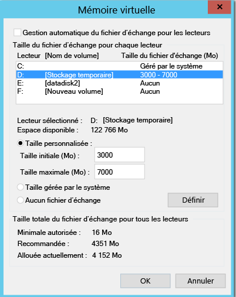
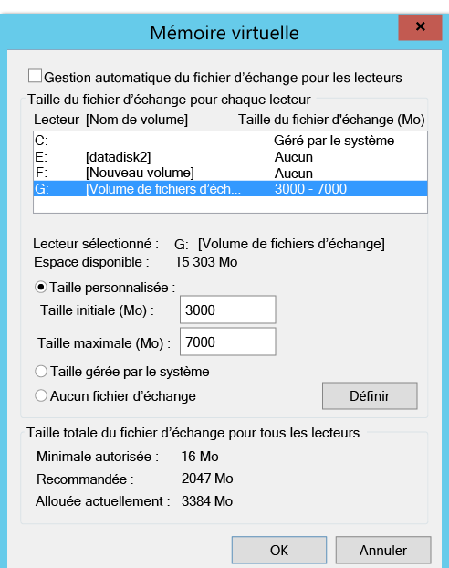
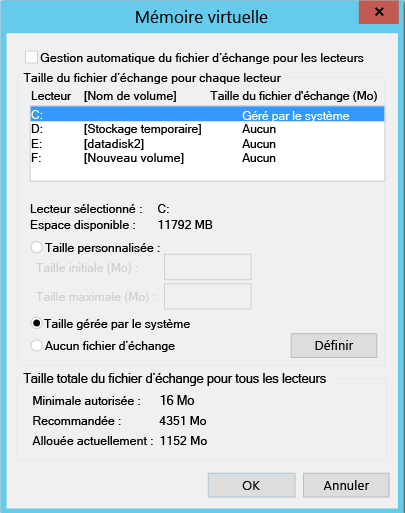

# Exclure les disques de la réplication
Cet article décrit comment exclure des disques de la réplication. Cette exclusion permet d’optimiser la bande passante utilisée pour la réplication ou les ressources côté serveur que ces disques utilisent. Cette fonctionnalité est prise en charge pour les scénarios VMware vers Azure et Hyper-V vers Azure.

## Composants requis

Par défaut, tous les disques d’une machine sont répliqués. Pour exclure un disque de la réplication, vous devez installer le service Mobilité manuellement sur la machine avant d’activer la réplication si vous procédez à une réplication de VMware vers Azure.

## Pourquoi exclure des disques de la réplication ?
L’exclusion de disques de la réplication se révèle souvent nécessaire pour les raisons suivantes :

- Les données hautement évolutives sur le disque exclu ne sont pas importantes ou n’ont pas besoin d’être répliquées.

- Vous voulez économiser des ressources de stockage et réseau en ne répliquant pas ces données.

## Quels sont les scénarios classiques ?
Vous pouvez identifier des exemples précis de données qui sont d’excellents candidats pour l’exclusion. Parmi les exemples figurent les écritures dans un fichier d’échange (pagefile.sys) et les écritures dans le fichier tempdb Microsoft SQL Server. Selon la charge de travail et le sous-système de stockage, le fichier d’échange peut enregistrer une quantité significative de données à fort taux d’évolution. Toutefois, la réplication de ces données du site principal vers Azure nécessiterait de nombreuses ressources. Par conséquent, vous pouvez procéder comme suit pour optimiser la réplication d’une machine virtuelle avec un seul disque virtuel qui contient le système d’exploitation et le fichier d’échange :

1. Fractionnez le disque virtuel unique en deux disques virtuels. Un disque virtuel comporte le système d’exploitation, et l’autre le fichier d’échange.
2. Excluez le disque de fichier d’échange de la réplication.

De même, vous pouvez procéder comme suit pour optimiser un disque qui contient à la fois le fichier tempdb Microsoft SQL Server et le fichier de base de données système :

1. Stockez la base de données système et la base de données tempdb sur deux disques différents.
2. Excluez le disque de base de données tempdb de la réplication.

## Comment exclure des disques de la réplication ?

### VMware vers Azure
Pour protéger une machine virtuelle du portail Azure Site Recovery, suivez le workflow [Activer la réplication](site-recovery-vmware-to-azure.md#enable-replication). Dans la quatrième étape du workflow, utilisez la colonne **DISQUE À RÉPLIQUER** pour exclure des disques de la réplication. Par défaut, tous les disques sont sélectionnés pour la réplication. Décochez les cases correspondant aux disques que vous souhaitez exclure de la réplication, puis exécutez la procédure d’activation de la réplication.

>[!NOTE]
>
> * Vous pouvez uniquement exclure des disques sur lesquels le service Mobilité est déjà installé. Vous devez installer le service Mobilité manuellement, car il n’est installé qu’à l’aide du mécanisme Push après l’activation de la réplication.
> * Seuls les disques de base peuvent être exclus de la réplication. Vous ne pouvez pas exclure de système d’exploitation ni de disque dynamique.
> * Une fois la réplication activée, vous ne pouvez pas ajouter ni supprimer de disques pour la réplication. Si vous voulez ajouter ou exclure un disque, vous devez désactiver la protection de la machine, puis la réactiver.
> * Si vous excluez un disque requis pour le bon fonctionnement d’une application, après le basculement vers Azure, vous devez créer manuellement le disque dans Azure afin que l’application répliquée puisse s’exécuter. Vous pouvez également intégrer Azure Automation dans un plan de récupération afin de créer le disque pendant le basculement de la machine.
> * Machine virtuelle Windows : les disques que vous créez manuellement dans Azure ne sont pas restaurés automatiquement. Par exemple, si vous basculez trois disques et que vous en créez deux directement dans Azure Virtual Machines, seuls les trois disques qui ont été basculés sont restaurés automatiquement. Vous ne pouvez pas inclure de disques créés manuellement dans le processus de restauration automatique ou de reprotection à partir de l’hôte local vers Azure.
> * Machine virtuelle Linux : les disques que vous créez manuellement dans Azure sont restaurés automatiquement. Par exemple, si vous basculez trois disques et créez deux disques directement dans Azure Virtual Machines, les cinq disques seront restaurés. Vous ne pouvez pas exclure de disques créés manuellement de la restauration automatique.
>

### Hyper-V vers Azure
Pour protéger une machine virtuelle du portail Azure Site Recovery, suivez le workflow [Activer la réplication](site-recovery-hyper-v-site-to-azure.md#step-6-enable-replication). Dans la quatrième étape du workflow, utilisez la colonne **DISQUE À RÉPLIQUER** pour exclure des disques de la réplication. Par défaut, tous les disques sont sélectionnés pour la réplication. Décochez les cases correspondant aux disques que vous souhaitez exclure de la réplication, puis exécutez la procédure d’activation de la réplication.

>[!NOTE]
>
> * Seuls les disques de base peuvent être exclus de la réplication. Vous ne pouvez pas exclure les disques de système d’exploitation. Nous vous recommandons de ne pas exclure de disques dynamiques. Azure Site Recovery ne peut pas identifier si les disques durs virtuels (VHD) sont de base ou dynamiques sur les machines virtuelles invitées.  Si tous les disques de volume dynamique dépendants ne sont pas exclus, le disque dynamique protégé devient un disque défectueux sur la machine virtuelle de basculement, et les données de ce disque ne sont pas accessibles.
> * Une fois la réplication activée, vous ne pouvez pas ajouter ni supprimer de disques pour la réplication. Si vous voulez ajouter ou exclure un disque, vous devez désactiver la protection de la machine virtuelle, puis la réactiver.
> * Si vous excluez un disque requis pour le bon fonctionnement d’une application, après le basculement vers Azure, vous devez créer manuellement le disque dans Azure afin que l’application répliquée puisse s’exécuter. Vous pouvez également intégrer Azure Automation dans un plan de récupération afin de créer le disque pendant le basculement de la machine.
> * Les disques que vous créez manuellement dans Azure ne seront pas restaurés automatiquement. Par exemple, si vous basculez trois disques et que vous en créez deux directement dans Azure Virtual Machines, seuls les trois disques qui ont été basculés seront restaurés automatiquement à partir d’Azure sur Hyper-V. Vous ne pouvez pas inclure de disques créés manuellement dans le processus de restauration automatique ou de réplication inverse d’Hyper-V vers Azure.

## Scénarios d’exclusion de disques de bout en bout
Pour vous aider à bien comprendre la fonctionnalité d’exclusion de disques, considérons deux scénarios :

- Disque de base de données tempdb SQL Server
- Disque de fichier d’échange (pagefile.sys)

### Exclure le disque de base de données tempdb SQL Server
Considérons l’exemple d’une machine virtuelle SQL Server dotée d’un disque de base de données tempdb pouvant être exclu.

Le nom du disque virtuel est SalesDB.

Les disques sur la machine virtuelle source sont les suivants :

**Nom du disque** | **Numéro du disque du système d’exploitation invité** | **Lettre de lecteur** | **Type de données sur le disque**
--- | --- | --- | ---
DB-Disk0-OS | DISK0 | C:\ | Disque de système d’exploitation
DB-Disk1| Disk1 | D:\ | Base de données système SQL et base de données utilisateur&1;
DB-Disk2 (disque exclu de la protection) | Disk2 | E:\ | Fichiers temporaires
DB-Disk3 (disque exclu de la protection) | Disk3 | F:\ | Base de données tempdb SQL (chemin du dossier (F:\MSSQL\Data\)   Notez le chemin du dossier avant de procéder au basculement.
DB-Disk4 | Disk4 |G:\ |Base de données utilisateur&2;

Étant donné que l’évolution des données sur deux disques de la machine virtuelle est temporaire, lorsque vous protégez la machine virtuelle SalesDB, excluez les disques Disk2 et Disk3 de la réplication. Azure Site Recovery ne répliquera pas ces disques. Lors du basculement, ces disques ne seront pas présents sur la machine virtuelle de basculement sur Azure.

Les disques sur la machine virtuelle Azure après le basculement sont les suivants :

**Numéro du disque du système d’exploitation invité** | **Lettre de lecteur** | **Type de données sur le disque**
--- | --- | ---
DISK0 |    C:\ | Disque de système d’exploitation
Disk1 |    E:\ | Stockage temporaire   Azure ajoute ce disque et lui attribue la première lettre de lecteur disponible.
Disk2 | D:\ | Base de données système SQL et base de données utilisateur&1;
Disk3 | G:\ | Base de données utilisateur&2;

Étant donné que les disques Disk2 et Disk3 ont été exclus de la machine virtuelle SalesDB, E: est la première lettre de lecteur disponible dans la liste. Azure attribue donc la lettre E: au volume de stockage temporaire. Pour tous les disques répliqués, la lettre de lecteur reste la même.

Le disque Disk3, qui était le disque tempdb SQL (chemin d’accès du dossier tempdb F:\MSSQL\Data\), a été exclu de la réplication. Le disque n’est pas disponible sur la machine virtuelle de basculement. Par conséquent, le service SQL présente l’état arrêté et a besoin du chemin F:\MSSQL\Data.

Il existe deux façons de créer ce chemin :

- Ajoutez un nouveau disque et attribuez-lui le chemin du dossier de tempdb.
- Utilisez un disque de stockage temporaire existant pour le chemin du dossier de tempdb.

#### Ajouter un nouveau disque :

1. Notez le chemin des fichiers SQL tempdb.mdf et tempdb.ldf avant de procéder au basculement.
2. À partir du portail Azure, ajoutez à la machine virtuelle de basculement un nouveau disque présentant une taille identique ou supérieure à celle du disque de base de données tempdb SQL source (Disk3).
3. Connectez-vous à la machine virtuelle Azure. À partir de la console de gestion des disques (diskmgmt.msc), initialisez et formatez le disque que vous venez d’ajouter.
4. Attribuez-lui la lettre de lecteur qui était utilisée par le disque de base de données tempdb SQL (F:).
5. Créez un dossier de tempdb sur le volume F: (F:\MSSQL\Data).
6. Démarrez le service SQL à partir de la console de service.

#### Utilisez un disque de stockage temporaire existant pour le chemin du dossier de tempdb :

1. Ouvrez une invite de commandes.
2. Exécutez SQL Server en mode de récupération à partir de l’invite de commande.

        Net start MSSQLSERVER /f / T3608

3. Exécutez la commande sqlcmd suivante pour remplacer le chemin de la base de données tempdb par un nouveau chemin.

        sqlcmd -A -S SalesDB        **Use your SQL DBname**
        USE master;        
        GO        
        ALTER DATABASE tempdb        
        MODIFY FILE (NAME = tempdev, FILENAME = 'E:\MSSQL\tempdata\tempdb.mdf');
        GO        
        ALTER DATABASE tempdb        
        MODIFY FILE (NAME = templog, FILENAME = 'E:\MSSQL\tempdata\templog.ldf');        
        GO

4. Arrêtez le service Microsoft SQL Server.

        Net stop MSSQLSERVER
5. Démarrez le service Microsoft SQL Server.

        Net start MSSQLSERVER

Consultez les recommandations Azure ci-après concernant le disque de stockage temporaire :

* [Utilisation des disques SSD dans les machines virtuelles Azure pour stocker TempDB et les extensions des pools de mémoires tampons de SQL Server](https://blogs.technet.microsoft.com/dataplatforminsider/2014/09/25/using-ssds-in-azure-vms-to-store-sql-server-tempdb-and-buffer-pool-extensions/)
* [Meilleures pratiques relatives aux performances de SQL Server dans les machines virtuelles Azure](https://docs.microsoft.com/azure/virtual-machines/windows/sql/virtual-machines-windows-sql-performance)

### Restauration automatique (d’Azure vers un hôte local)
À présent, découvrons les disques qui sont répliqués lorsque vous procédez à un basculement d’Azure vers votre hôte Hyper-V ou VMware local. Les disques que vous créez manuellement dans Azure ne seront pas répliqués. Par exemple, si vous basculez trois disques et que vous en créez deux directement dans Azure Virtual Machines, seuls les trois disques qui ont été basculés seront restaurés automatiquement. Vous ne pouvez pas inclure de disques créés manuellement dans le processus de restauration automatique à partir de l’hôte local vers Azure. En outre, le disque de stockage temporaire n’est pas répliqué vers les hôtes locaux.

#### Restauration automatique pour la récupération à l’emplacement d’origine

Dans l’exemple précédent, les disques de la machine virtuelle Azure sont configurés comme suit :

**Numéro du disque du système d’exploitation invité** | **Lettre de lecteur** | **Type de données sur le disque**
--- | --- | ---
DISK0 | C:\ | Disque de système d’exploitation
Disk1 |    E:\ | Stockage temporaire   Azure ajoute ce disque et lui attribue la première lettre de lecteur disponible.
Disk2 |    D:\ | Base de données système SQL et base de données utilisateur&1;
Disk3 |    G:\ | Base de données utilisateur&2;

#### VMware vers Azure
Lorsque la restauration automatique est effectuée à l’emplacement d’origine, la configuration des disques de la machine virtuelle de restauration automatique ne comporte aucun disque exclu. Les disques qui étaient exclus de VMware vers Azure ne seront pas disponibles sur la machine virtuelle de restauration automatique.

Après le basculement planifié d’Azure vers l’hôte VMware local, les disques sur la machine virtuelle VMWare (emplacement d’origine) se présentent comme suit :

**Numéro du disque du système d’exploitation invité** | **Lettre de lecteur** | **Type de données sur le disque**
--- | --- | ---
DISK0 | C:\ | Disque de système d’exploitation
Disk1 |    D:\ | Base de données système SQL et base de données utilisateur&1;
Disk2 |    G:\ | Base de données utilisateur&2;

#### Hyper-V vers Azure
Lorsque la restauration automatique est effectuée à l’emplacement d’origine, la configuration des disques de la machine virtuelle de restauration automatique reste la même que celle des disques de la machine virtuelle d’origine pour Hyper-V. Les disques qui étaient exclus de Hyper-V vers Azure sont disponibles sur la machine virtuelle de restauration automatique.

Après le basculement planifié d’Azure vers l’hôte Hyper-V local, les disques sur la machine virtuelle Hyper-V (emplacement d’origine) se présentent comme suit :

**Nom du disque** | **Numéro du disque du système d’exploitation invité** | **Lettre de lecteur** | **Type de données sur le disque**
--- | --- | --- | ---
DB-Disk0-OS | DISK0 |    C:\ | Disque de système d’exploitation
DB-Disk1 | Disk1 | D:\ | Base de données système SQL et base de données utilisateur&1;
DB-Disk2 (disque exclu) | Disk2 | E:\ | Fichiers temporaires
DB-Disk3 (disque exclu) | Disk3 | F:\ | Base de données tempdb SQL (chemin du dossier (F:\MSSQL\Data\)
DB-Disk4 | Disk4 | G:\ | Base de données utilisateur&2;

#### Exclure le disque de fichier d’échange (pagefile.sys)

Considérons l’exemple d’une machine virtuelle dotée d’un disque de fichier d’échange pouvant être exclu.
Il existe deux cas.

#### Cas 1 : le fichier d’échange est configuré sur le lecteur D:
Voici la configuration des disques :

**Nom du disque** | **Numéro du disque du système d’exploitation invité** | **Lettre de lecteur** | **Type de données sur le disque**
--- | --- | --- | ---
DB-Disk0-OS | DISK0 | C:\ | Disque de système d’exploitation
DB-Disk1 (disque exclu de la protection) | Disk1 | D:\ | pagefile.sys
DB-Disk2 | Disk2 | E:\ | Données utilisateur 1
DB-Disk3 | Disk3 | F:\ | Données utilisateur 2

Voici les paramètres du fichier d’échange sur la machine virtuelle source :

Après le basculement de la machine virtuelle VMware vers Azure ou Hyper-V vers Azure, les disques sur la machine virtuelle Azure se présentent comme suit :

**Nom du disque** | **Numéro du disque du système d’exploitation invité** | **Lettre de lecteur** | **Type de données sur le disque**
--- | --- | --- | ---
DB-Disk0-OS | DISK0 | C:\ | Disque de système d’exploitation
DB-Disk1 | Disk1 | D:\ | Stockage temporaire   pagefile.sys
DB-Disk2 | Disk2 | E:\ | Données utilisateur 1
DB-Disk3 | Disk3 | F:\ | Données utilisateur 2

Étant donné que le disque Disk1 (D:) a été exclu, D: est la première lettre de lecteur disponible. Azure attribue donc la lettre D: au volume de stockage temporaire. Étant donné que D: est disponible sur la machine virtuelle Azure, les paramètres du fichier d’échange de la machine virtuelle restent inchangés.

Voici les paramètres du fichier d’échange sur la machine virtuelle Azure :

#### Cas 2 : le fichier d’échange est configuré sur un autre lecteur (autre que le lecteur D:)

Voici la configuration des disques de la machine virtuelle source :

**Nom du disque** | **Numéro du disque du système d’exploitation invité** | **Lettre de lecteur** | **Type de données sur le disque**
--- | --- | --- | ---
DB-Disk0-OS | DISK0 | C:\ | Disque de système d’exploitation
DB-Disk1 (disque exclu de la protection) | Disk1 | G:\ | pagefile.sys
DB-Disk2 | Disk2 | E:\ | Données utilisateur 1
DB-Disk3 | Disk3 | F:\ | Données utilisateur 2

Voici les paramètres du fichier d’échange sur la machine virtuelle locale :

Après le basculement de la machine virtuelle VMware/Hyper-V vers Azure, les disques sur la machine virtuelle Azure se présentent comme suit :

**Nom du disque**| **Numéro du disque du système d’exploitation invité**| **Lettre de lecteur** | **Type de données sur le disque**
--- | --- | --- | ---
DB-Disk0-OS | DISK0  |C:\ |Disque de système d’exploitation
DB-Disk1 | Disk1 | D:\ | Stockage temporaire   pagefile.sys
DB-Disk2 | Disk2 | E:\ | Données utilisateur 1
DB-Disk3 | Disk3 | F:\ | Données utilisateur 2

Étant donné que D: est la première lettre de lecteur disponible dans la liste, Azure attribue la lettre D: au volume de stockage temporaire. Pour tous les disques répliqués, la lettre de lecteur reste la même. Étant donné que le lecteur G: n’est pas disponible, le système utilisera le lecteur C: pour le fichier d’échange.

Voici les paramètres du fichier d’échange sur la machine virtuelle Azure :

## Étapes suivantes
Une fois votre déploiement configuré et effectué, pour en savoir plus sur les différents types de basculement, [cliquez ici](site-recovery-failover.md) .

