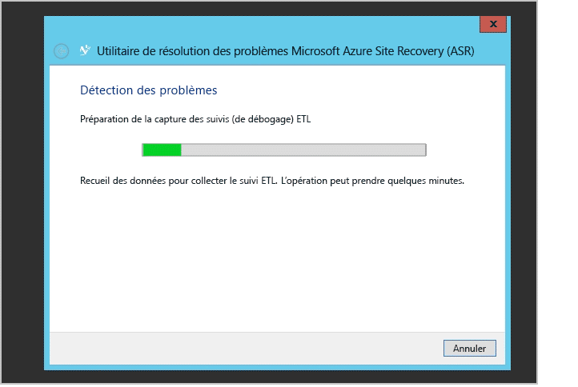

# Surveiller et résoudre les problèmes de protection pour les machines virtuelles et les serveurs physiques
Ce guide de surveillance et de résolution des problèmes présente des techniques de suivi de l’intégrité de la réplication et de résolution des problèmes pour Azure Site Recovery.

## Comprendre les composants
### Déploiement d’une machine virtuelle VMware ou d’un serveur physique à répliquer entre un site local et Azure
Pour configurer la récupération de base de données entre une machine virtuelle VMware locale ou un serveur physique local et Azure, vous devez configurer le serveur de configuration, le serveur cible maître et le serveur de processus sur votre machine ou votre serveur. Lorsque vous activez la protection du serveur source, Azure Site Recovery installe la fonctionnalité Mobile Apps de Microsoft Azure App Service. Après une défaillance locale et le basculement du serveur source sur Azure, les clients doivent configurer un serveur de processus dans Azure et un serveur cible maître local pour reconstruire le serveur source localement.

### Déploiement d’un site VMM (Virtual Machine Manager) à répliquer entre des sites locaux
Pour configurer la récupération de base de données entre deux sites locaux, vous devez télécharger le fournisseur Azure Site Recovery et l’installer sur le serveur Virtual Machine Manager. Le fournisseur a besoin d’une connectivité Internet pour s’assurer que toutes les opérations déclenchées à partir du portail Azure sont traduites en opérations locales.

### Déploiement d’un site VMM (Virtual Machine Manager) à répliquer entre des sites locaux et Azure
Lorsque vous configurez la récupération de base de données entre des sites locaux et Azure, vous devez télécharger le fournisseur Azure Site Recovery et l’installer sur le serveur Virtual Machine Manager. Vous devez également installer Azure Recovery Services Agent qui doit être installé sur chaque hôte Hyper-V. [Cliquez ici](site-recovery-hyper-v-azure-architecture.md) pour plus d’informations.

### Déploiement d’un site Hyper-V à répliquer entre des sites locaux et Azure
Ce processus est similaire au déploiement de Virtual Machine Manager. La seule différence réside dans le fait que le fournisseur Azure Site Recovery et Azure Recovery Services Agent sont installés sur l’hôte Hyper-V lui-même. [En savoir plus](site-recovery-hyper-v-azure-architecture.md). .

## Surveillance des opérations de configuration, de protection et de récupération
Chaque opération dans Azure Site Recovery est auditée et suivie sous l’onglet **TÂCHES**. En cas d’erreur de configuration, de protection ou de récupération, accédez à l’onglet **TÂCHES** et recherchez les défaillances.

Si vous trouvez des défaillances dans l’onglet **TÂCHES**, cliquez sur la tâche puis sur **DÉTAILS DE L’ERREUR** pour cette tâche.

Les détails de l’erreur permettent d’identifier une cause possible et une recommandation relative au problème.

Dans l’exemple précédent, une autre opération en cours semble provoquer l’échec de la configuration de la protection. Résolvez le problème à l’aide de la recommandation, puis cliquez sur **REDÉMARRER** pour relancer l’opération.

L’option **REDÉMARRER** n’est pas disponible pour toutes les opérations. Si une opération n’a pas l’option **REDÉMARRER**, revenez à l’objet et relancez l’opération. Vous pouvez annuler une tâche en cours, à l’aide du bouton **ANNULER**.

## Surveillance de l’intégrité de la réplication des machines virtuelles
Vous pouvez utiliser le portail Azure pour surveiller à distance les fournisseurs Azure Site Recovery de chacune des entités protégées. Cliquez sur **ÉLÉMENTS PROTÉGÉS**, puis sur **CLOUDS VMM** ou **GROUPES DE PROTECTION**. L’onglet **CLOUDS VMM** n’est disponible que pour les déploiements basés sur Virtual Machine Manager. Pour d’autres scénarios, les entités protégées se trouvent dans l’onglet **GROUPES DE PROTECTION**.

Cliquez sur une entité protégée dans le cloud ou le groupe de protection respectif pour afficher toutes les opérations disponibles dans le volet inférieur.

Comme le montre la capture d’écran précédente, l’état de la machine virtuelle est **Critique**. Vous pouvez cliquer sur le bouton **DÉTAILS DE L’ERREUR** en bas pour afficher l’erreur. À l’aide des **Causes possibles** et de la **Recommandation**, résolvez le problème.

> [!NOTE]
> Si des opérations actives sont en cours ou ont échoué, accédez à la vue **TÂCHES** comme indiqué précédemment pour afficher l’erreur d’une tâche spécifique.
>
>

## Résolution des problèmes Hyper-V locaux
Connectez-vous à la console du gestionnaire Hyper-V local, sélectionnez la machine virtuelle et vérifiez l’intégrité de la réplication.

En l’occurrence, l’**intégrité de la réplication** est **Critique**. Cliquez avec le bouton droit sur la machine virtuelle, puis cliquez sur **Réplication** > **Afficher l’intégrité de la réplication** pour afficher les détails.

Si la réplication de la machine virtuelle est suspendue, cliquez avec le bouton droit sur la machine virtuelle et sélectionnez **Réplication** > **Reprendre la réplication**.

Si une machine virtuelle migre un nouvel hôte Hyper-V situé dans le cluster ou une machine autonome, et que cet hôte a été configuré via Azure Site Recovery, la réplication de la machine virtuelle n’est pas affectée. Vérifiez que le nouvel hôte Hyper-V répond à toutes les conditions requises et qu’il est configuré à l’aide d’Azure Site Recovery.

### Journal des événements
| Sources d’événement | Détails |
| --- |:--- |
| **Journaux des applications et des services/Microsoft/VirtualMachineManager/Server/Admin** (serveur Virtual Machine Manager) |Fournit une journalisation permettant de résoudre de nombreux problèmes Virtual Machine Manager. |
| **Journaux des applications et des services/MicrosoftAzureRecoveryServices/Replication** (hôte Hyper-V) |Fournit une journalisation permettant de résoudre de nombreux problèmes liés à Microsoft Azure Recovery Services Agent.    |
| **Journaux des applications et des services/Microsoft/Azure Site Recovery/Provider/Operational** (hôte Hyper-V) |Fournit une journalisation permettant de résoudre de nombreux problèmes liés à Microsoft Azure Recovery Services.    |
| **Journaux des applications et des services/Microsoft/Windows/Hyper-V-VMMS/Admin** (hôte Hyper-V) |Fournit une journalisation permettant de résoudre de nombreux problèmes liés à la gestion des machines virtuelles Hyper-V.    |

### Options de journalisation de réplication Hyper-V
Tous les événements relatifs à la réplication Hyper-V sont consignés dans le journal Hyper-V-VMMS\\Admin situé sous Journaux des applications et des services\\Microsoft\\Windows. En outre, vous pouvez activer un journal d’analyse pour le Service de gestion d’ordinateurs virtuels Hyper-V. Pour activer ce journal, commencez par afficher les journaux d’analyse et de débogage dans l’Observateur d’événements. Ouvrez l’Observateur d’événements, puis cliquez sur **Affichage** > **Afficher les journaux d’analyse et de débogage**.

Un journal d’analyse s’affiche sous **Hyper-V-VMMS**.

Dans le volet **Actions**, cliquez sur **Activer le journal**. Une fois activé, il apparaît dans **Analyseur de performances** comme une **Session de suivi d’événements** située sous **Ensembles de collecteurs de données**.

Pour afficher les informations collectées, arrêtez la session de suivi en désactivant le journal. Enregistrez le journal et rouvrez-le dans l’Observateur d’événements ou utilisez d’autres outils pour le convertir au format souhaité.

## Contacter le support Microsoft
### Collection de journaux
Pour la protection de site Virtual Machine Manager, consultez [Collecte de journaux Azure Site Recovery à l’aide de l’outil SDP (Support Diagnostics Platform)](http://social.technet.microsoft.com/wiki/contents/articles/28198.asr-data-collection-and-analysis-using-the-vmm-support-diagnostics-platform-sdp-tool.aspx) afin de collecter les journaux requis.

Pour la protection de site Hyper-V, téléchargez [l’outil](https://dcupload.microsoft.com/tools/win7files/DIAG_ASRHyperV_global.DiagCab) et exécutez-le sur l’hôte Hyper-V afin de collecter les journaux.

Pour les scénarios de serveur VMware/physiques, consultez [Collecte de journaux Azure Site Recovery pour la protection de sites VMware et physiques](http://social.technet.microsoft.com/wiki/contents/articles/30677.azure-site-recovery-log-collection-for-vmware-and-physical-site-protection.aspx) afin de collecter les journaux requis.

L’outil collecte les journaux localement, dans un sous-dossier au nom aléatoire et situé sous %LocalAppData%\ElevatedDiagnostics.

### Ouverture d’un ticket de support
Pour créer un ticket de support pour Azure Site Recovery, accédez au support Azure en utilisant l’URL disponible sur <http://aka.ms/getazuresupport>.

## Articles de la Base de connaissances
* [Comment conserver la lettre de lecteur pour les machines virtuelles protégées qui ont basculé ou migré sur Azure](http://support.microsoft.com/kb/3031135)
* [Comment gérer l’utilisation de la bande passante réseau par la protection Local vers Azure](https://support.microsoft.com/kb/3056159)
* [Azure Site Recovery : erreur « La ressource de cluster est introuvable » lorsque vous tentez d’activer la protection d’une machine virtuelle](http://support.microsoft.com/kb/3010979)
* [Guide de présentation et de résolution des problèmes relatifs à la réplication Hyper-V](http://social.technet.microsoft.com/wiki/contents/articles/21948.hyper-v-replica-troubleshooting-guide.aspx)

## Erreurs liées à Azure Site Recovery et résolution
Les erreurs suivantes et leurs résolutions sont courantes. Chaque erreur est documentée dans une page WIKI dédiée.

### Généralités
* NOUVEAU [Échec de travaux avec l’erreur « Une opération est en cours ». Erreur 505, 514, 532.](http://social.technet.microsoft.com/wiki/contents/articles/32190.azure-site-recovery-jobs-failing-with-error-an-operation-is-in-progress-error-505-514-532.aspx)
* NOUVEAU [Échec de travaux avec l’erreur « Le serveur n’est pas connecté à Internet ». Erreur 25018.](http://social.technet.microsoft.com/wiki/contents/articles/32192.azure-site-recovery-jobs-failing-with-error-server-isn-t-connected-to-the-internet-error-25018.aspx)

### Paramétrage
* [Impossible d’inscrire le serveur Virtual Machine Manager en raison d’une erreur interne. Pour plus d’informations sur l’erreur, consultez la vue des tâches dans le portail Site Recovery. Relancez le programme d’installation pour inscrire le serveur.](http://social.technet.microsoft.com/wiki/contents/articles/25570.the-vmm-server-cannot-be-registered-due-to-an-internal-error-please-refer-to-the-jobs-view-in-the-site-recovery-portal-for-more-details-on-the-error-run-setup-again-to-register-the-server.aspx)
* [Impossible d’établir une connexion au coffre Hyper-V Recovery Manager. Vérifiez les paramètres de proxy ou réessayez ultérieurement.](http://social.technet.microsoft.com/wiki/contents/articles/25571.a-connection-cant-be-established-to-the-hyper-v-recovery-manager-vault-verify-the-proxy-settings-or-try-again-later.aspx)

### Configuration
* [Impossible de créer un groupe de protection : une erreur est survenue lors de la récupération de la liste de serveurs.](http://blogs.technet.com/b/somaning/archive/2015/08/12/unable-to-create-the-protection-group-in-azure-site-recovery-portal.aspx)
* [Le cluster hôte Hyper-V contient au moins une carte réseau statique ou aucune carte connectée n'est configurée pour utiliser DHCP.](http://social.technet.microsoft.com/wiki/contents/articles/25498.hyper-v-host-cluster-contains-at-least-one-static-network-adapter-or-no-connected-adapters-are-configured-to-use-dhcp.aspx)
* [Virtual Machine Manager n’a pas les autorisations nécessaires pour effectuer une action.](http://social.technet.microsoft.com/wiki/contents/articles/31110.vmm-does-not-have-permissions-to-complete-an-action.aspx)
* [Impossible de sélectionner le compte de stockage dans l’abonnement lors de la configuration de la protection.](http://social.technet.microsoft.com/wiki/contents/articles/32027.can-t-select-the-storage-account-within-the-subscription-while-configuring-protection.aspx)

### Protection
* NOUVEAU [Échec de l’activation de la protection avec l’erreur « Impossible de configurer la protection pour la machine virtuelle ». Erreur 60007, 40003.](http://social.technet.microsoft.com/wiki/contents/articles/32194.azure-site-recovery-enable-protection-failing-with-error-protection-couldn-t-be-configured-for-the-virtual-machine-error-60007-40003.aspx)
* NOUVEAU [Échec de l’activation de la protection avec l’erreur « Impossible d’activer la protection pour la machine virtuelle ». Erreur 70094.](http://social.technet.microsoft.com/wiki/contents/articles/32195.azure-site-recovery-enable-protection-failing-with-error-protection-couldn-t-be-enabled-for-the-virtual-machine-error-70094.aspx)
* NOUVEAU [Erreur de migration en direct 23848 : La machine virtuelle va être déplacée avec le type En direct. Ceci peut endommager l’état de protection de la récupération de la machine virtuelle.](http://social.technet.microsoft.com/wiki/contents/articles/32021.live-migration-error-23848-the-virtual-machine-is-going-to-be-moved-using-type-live-this-could-break-the-recovery-protection-status-of-the-virtual-machine.aspx)
* [Échec de l’activation de la protection, car l’agent n’est pas installé sur la machine hôte.](http://social.technet.microsoft.com/wiki/contents/articles/31105.enable-protection-failed-since-agent-not-installed-on-host-machine.aspx)
* [Impossible de trouver un hôte approprié pour la machine virtuelle de réplication, en raison de faibles ressources de calcul](http://social.technet.microsoft.com/wiki/contents/articles/25501.a-suitable-host-for-the-replica-virtual-machine-can-t-be-found-due-to-low-compute-resources.aspx)
* [Impossible de trouver un hôte approprié pour la machine virtuelle de réplication, en raison de l’absence de réseau logique attaché.](http://social.technet.microsoft.com/wiki/contents/articles/25502.a-suitable-host-for-the-replica-virtual-machine-can-t-be-found-due-to-no-logical-network-attached.aspx)
* [Impossible de se connecter à la machine hôte de réplication : impossible d’établir une connexion.](http://social.technet.microsoft.com/wiki/contents/articles/31106.cannot-connect-to-the-replica-host-machine-connection-could-not-be-established.aspx)

### Récupérer
* Virtual Machine Manager ne peut pas effectuer l’opération de l’hôte :
  * [Basculement vers le point de récupération sélectionné pour la machine virtuelle : accès général refusé.](http://social.technet.microsoft.com/wiki/contents/articles/25504.fail-over-to-the-selected-recovery-point-for-virtual-machine-general-access-denied-error.aspx)
  * [Échec du basculement d’Hyper-V vers le point de récupération sélectionné pour la machine virtuelle : opération abandonnée.  Essayez avec un point de récupération plus récent. (0x80004004).](http://social.technet.microsoft.com/wiki/contents/articles/25503.hyper-v-failed-to-fail-over-to-the-selected-recovery-point-for-virtual-machine-operation-aborted-try-a-more-recent-recovery-point-0x80004004.aspx)
  * Impossible d’établir une connexion au serveur (0x00002EFD).
    * [Impossible pour Hyper-V d’activer la réplication inverse pour la machine virtuelle.](http://social.technet.microsoft.com/wiki/contents/articles/25505.a-connection-with-the-server-could-not-be-established-0x00002efd-hyper-v-failed-to-enable-reverse-replication-for-virtual-machine.aspx)
    * [Impossible pour Hyper-V d’activer la réplication pour la machine virtuelle.](http://social.technet.microsoft.com/wiki/contents/articles/25506.a-connection-with-the-server-could-not-be-established-0x00002efd-hyper-v-failed-to-enable-replication-for-virtual-machine-virtual-machine.aspx)
  * [Impossible de valider le basculement de la machine virtuelle.](http://social.technet.microsoft.com/wiki/contents/articles/25508.could-not-commit-failover-for-virtual-machine.aspx)
* [Le plan de récupération contient des machines virtuelles qui ne sont pas prêtes pour un basculement planifié.](http://social.technet.microsoft.com/wiki/contents/articles/25509.the-recovery-plan-contains-virtual-machines-which-are-not-ready-for-planned-failover.aspx)
* [La machine virtuelle n’est pas prête pour un basculement planifié.](http://social.technet.microsoft.com/wiki/contents/articles/25507.the-virtual-machine-isn-t-ready-for-planned-failover.aspx)
* [La machine virtuelle n’est pas en cours d’exécution et n’est pas hors tension.](http://social.technet.microsoft.com/wiki/contents/articles/25510.virtual-machine-is-not-running-and-is-not-powered-off.aspx)
* [Une opération hors bande s’est produite sur une machine virtuelle et la validation du basculement a échoué.](http://social.technet.microsoft.com/wiki/contents/articles/25507.the-virtual-machine-isn-t-ready-for-planned-failover.aspx)
* Test de basculement
  * [Impossible de lancer le basculement, car le test de basculement en cours.](http://social.technet.microsoft.com/wiki/contents/articles/31111.failover-could-not-be-initiated-since-test-failover-is-in-progress.aspx)
* NOUVEAU Le basculement expire avec le message « PreFailoverWorkflow task WaitForScriptExecutionTaskTimeout » en raison des paramètres de configuration du groupe de sécurité réseau associé à la machine virtuelle ou au sous-réseau auquel la machine appartient. Consultez [« PreFailoverWorkflow task WaitForScriptExecutionTaskTimeout »](https://aka.ms/troubleshoot-nsg-issue-azure-site-recovery) pour plus de détails.

### Serveur de configuration, serveur de processus, serveur maître
* [Échec de l'hôte ESXi sur lequel le serveur de traitement/configuration est hébergé comme machine virtuelle avec un écran violet de la mort.](http://social.technet.microsoft.com/wiki/contents/articles/31107.vmware-esxi-host-experiences-a-purple-screen-of-death.aspx)

### Résolution des problèmes après un basculement de bureau à distance
* Suite à un basculement, de nombreux clients ont été confrontés à des problèmes de connexion à la machine virtuelle dans Azure. [Utilisez le document de résolution des problèmes pour le protocole RDP dans la machine virtuelle.](http://social.technet.microsoft.com/wiki/contents/articles/31666.troubleshooting-remote-desktop-connection-after-failover-using-asr.aspx)

#### Ajout d’une adresse IP publique sur une machine virtuelle du Gestionnaire des ressources
Si le bouton **Connecter** du portail est grisé et si vous n’êtes pas connecté à Azure avec une connexion Express Route ou VPN virtuel de site à site, vous devez créer votre machine virtuelle et lui attribuer une adresse IP publique pour pouvoir utiliser Bureau à distance/Shared Shell. Vous pouvez ensuite ajouter une adresse IP publique sur l’interface réseau de la machine virtuelle.  

