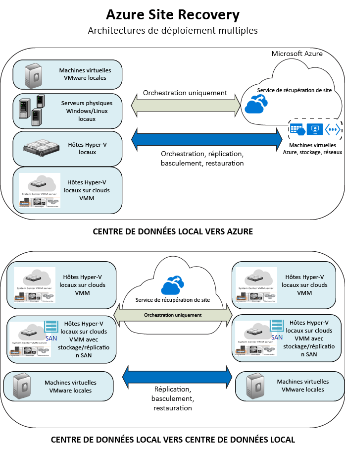

<properties
	pageTitle="Qu’est ce que Site Recovery ? | Microsoft Azure" 
	description="Présente le service Azure Site Recovery et explique comment il peut être déployé." 
	services="site-recovery" 
	documentationCenter="" 
	authors="rayne-wiselman" 
	manager="jwhit" 
	editor=""/>

<tags 
	ms.service="site-recovery" 
	ms.devlang="na"
	ms.topic="get-started-article"
	ms.tgt_pltfrm="na"
	ms.workload="storage-backup-recovery" 
	ms.date="02/22/2016" 
	ms.author="raynew"/>

#  Qu’est-ce que Site Recovery ?

Bienvenue dans Azure Site Recovery ! Commencez par cet article pour obtenir une présentation rapide du service Site Recovery et voir de quelle façon il peut contribuer à votre stratégie de récupération d’urgence et de continuité des activités.

## Vue d'ensemble

Les organisations ont besoin d’une stratégie BCDR qui détermine la façon dont les applications, les charges de travail et les données demeurent opérationnelles et disponibles pendant les temps d’arrêt prévus et imprévus, et qui précise comment rétablir au plus vite des conditions de travail normales. Votre stratégie BCDR doit assurer la sécurisation et la récupération des données d’entreprise, ainsi que la disponibilité continue des charges de travail suite à un sinistre.

Site Recovery est un service Azure qui participe à votre stratégie de continuité des activités et de récupération d’urgence en orchestrant la réplication des machines virtuelles et des serveurs physiques locaux dans le cloud (Azure) ou sur un centre de données secondaire. Lorsque des pannes se produisent sur votre site principal, vous effectuez un basculement sur le site secondaire pour préserver la disponibilité des applications et des charges de travail. Vous restaurez votre site principal dès lors qu’il retrouve un fonctionnement normal. Pour en savoir plus, consultez [Qu’est-ce que Site Recovery ?](site-recovery-overview.md)

## Site Recovery dans le portail Azure

Azure dispose de deux [modèles de déploiement](../resource-manager-deployment-model.md) différents pour créer et utiliser des ressources : le modèle Azure Resource Manager et le modèle classique de gestion des services. De plus, Azure propose deux portails : le [portail Azure Classic](https://manage.windowsazure.com/), qui prend en charge le modèle de déploiement classique, et le [portail Azure](https://portal.azure.com), qui gère les deux modèles de déploiement.

Site Recovery est disponible dans le portail classique et le portail Azure. Dans le Portail Azure Classic, vous pouvez prendre en charge Site Recovery avec le modèle classique de gestion des services. Dans le portail Azure, vous pouvez prendre en charge les déploiements classiques et Ressource Manager. [En savoir plus](site-recovery-overview.md#site-recovery-in-the-azure-portal) sur le déploiement à l’aide du portail Azure.

Les informations contenues dans cet article s’appliquent aux déploiements classiques et de portail Azure. Les différences sont indiquées, le cas échéant.

## Pourquoi utiliser Azure Site Recovery ? 

Voici ce que Site Recovery peut faire pour votre entreprise :

- **Simplifier votre stratégie de continuité des activités et de récupération d’urgence **: Site Recovery facilite la gestion de la réplication, du basculement et de la récupération de plusieurs charges de travail et applications métier à partir d’un emplacement unique. Site Recovery orchestre la réplication et le basculement, sans intercepter les données de vos applications ni posséder des informations à leur sujet.
- **Fournir une réplication flexible **: à l’aide de Site Recovery, vous pouvez répliquer des charges de travail s’exécutant sur des machines virtuelles Hyper-V et VMware, et des serveurs physiques Windows/Linux.
- **Faciliter le basculement et la récupération** : Site Recovery fournit des tests de basculement pour prendre en charge la marche à suivre en cas de récupération d’urgence sans affecter les environnements de production. Vous pouvez également exécuter des basculements planifiés avec une perte de données zéro pour les interruptions attendues, ou des basculements non planifiés avec une perte de données minimale (en fonction de la fréquence de réplication) pour les incidents inattendus. Après le basculement, vous pouvez procéder à une restauration automatique sur vos sites principaux. Site Recovery fournit des plans de récupération qui peuvent inclure des scripts et des classeurs Azure Automation afin que vous puissiez personnaliser le basculement et la récupération d’applications multiniveaux.
- **Éliminer le centre de données secondaire **: vous pouvez procéder à une réplication vers un site secondaire local ou vers Azure. L’utilisation d’Azure comme destination de la récupération d’urgence permet d’éliminer le coût et la complexité de la maintenance d’un site secondaire. Les données répliquées sont stockées dans Azure Storage, avec toute la résilience que cela implique.
- **S’intégrer aux technologies existantes de continuité des activités et de récupération d’urgence **: Site Recovery collabore avec les fonctionnalités de continuité des activités et de récupération d’urgence d’autres applications. Par exemple, vous pouvez utiliser Site Recovery pour protéger le serveur principal SQL Server de charges de travail d’entreprise, notamment la prise en charge native de SQL Server AlwaysOn pour gérer le basculement des groupes de disponibilité.

## Que puis-je répliquer ?

Voici une synthèse des éléments pouvant être répliqués par Site Recovery.

**REPLICATE** | **RÉPLICATION DEPUIS (EN LOCAL)** | **RÉPLICATION VERS** | **ARTICLE**
---|---|---|---
Machines virtuelles VMware | Serveur VMware | Les tables Azure | [En savoir plus](site-recovery-vmware-to-azure-classic.md)
Machines virtuelles VMware | Serveur VMware | Site VMware secondaire | [En savoir plus](site-recovery-vmware-to-vmware.md) 
Machines virtuelles Hyper-V | Hôte Hyper-V dans le cloud VMM | Les tables Azure | [En savoir plus](site-recovery-vmm-to-azure.md) 
Machines virtuelles Hyper-V | Hôte Hyper-V dans le cloud VMM | Site VMM secondaire | [En savoir plus](site-recovery-vmm-to-vmm.md)
Machines virtuelles Hyper-V | Hôte Hyper-V dans le cloud VMM avec le stockage SAN| Site VMM secondaire avec stockage SAN | [En savoir plus](site-recovery-vmm-san.md)
Machines virtuelles Hyper-V | Hôte Hyper-V (sans VMM) | Les tables Azure | [En savoir plus](site-recovery-hyper-v-site-to-azure.md)
Serveurs Windows/Linux physiques | Serveur physique | Les tables Azure | [En savoir plus](site-recovery-vmware-to-azure-classic.md)
Charges de travail s’exécutant sur des serveurs physiques Windows/Linux | Serveur physique | Centre de données secondaire | [En savoir plus](site-recovery-vmware-to-vmware.md) 

## Quelles charges de travail puis-je protéger ?

Site Recovery peut contribuer à la continuité des activités et à la récupération d’urgence compatibles avec les applications afin que les charges de travail et les applications continuent de s’exécuter de manière cohérente en cas de pannes. Site Recovery présente les caractéristiques suivantes :

- **Instantanés de cohérence de l’application** : réplication utilisant des instantanés de cohérence de l’application pour les applications à niveau unique ou multiniveaux.
- **Réplication quasi synchrone** : fréquence de réplication de 30 secondes pour Hyper-V, et réplication continue pour VMware.
- **Intégration à SQL Server AlwaysOn** : vous pouvez gérer le basculement des groupes de disponibilité dans les plans de récupération de Site Recovery.
- **Plans de récupération flexibles** : vous pouvez créer et personnaliser des plans de récupération avec des scripts externes, des actions manuelles et des Runbooks Azure Automation qui vous permettent de récupérer une pile d’application entière en un seul clic.
- **Bibliothèque d’automatisation** : une bibliothèque Azure Automation avancée qui fournit des scripts spécifiques d’application prêts pour la production, qui peuvent être téléchargés et intégrés avec Site Recovery.
- **Gestion réseau simple** : la gestion réseau avancée dans Site Recovery et Azure simplifie les conditions requises du réseau d’application, notamment la réservation d’adresses IP, la configuration d’équilibreurs de charge et l’intégration d’Azure Traffic Manager pour les commutations réseau efficaces.

## Étapes suivantes

- Pour en savoir plus, consultez la page [Quelles charges de travail pouvez-vous protéger avec Azure Site Recovery ?](site-recovery-workload.md)
- Pour en savoir plus sur l’architecture de Site Recovery, consultez l’article [Comment Azure Site Recovery fonctionne-t-il ?](site-recovery-components.md)
 

<!---HONumber=AcomDC_0720_2016-->