<properties
	pageTitle="Microsoft Azure Site Recovery - Test des performances et de l’évolutivité : depuis un site local vers un site local"
	description="Cet article détaille les tests relatifs à l’impact, sur les performances, d’une réplication effectuée via Microsoft Azure Site Recovery dans le cadre du déploiement d’un site local vers un autre site local."
	services="site-recovery"
	documentationCenter=""
	authors="csilauraa"
	manager="jwhit"
	editor="tysonn"/>

<tags
	ms.service="site-recovery"
	ms.devlang="na"
	ms.topic="get-started-article"
	ms.tgt_pltfrm="na"
	ms.workload="storage-backup-recovery"
	ms.date="10/07/2015"
	ms.author="lauraa"/>

# Test des performances et de l’évolutivité : depuis un site local vers un site local

Microsoft Azure Site Recovery orchestre et gère la réplication de votre centre de données principal vers un autre emplacement, afin que les données soient enregistrées et puissent être récupérées en cas d’interruption planifiée ou non planifiée. Vous pouvez sauvegarder les données de clouds privés se trouvant sur System Center Virtual Machine Manager (VMM) vers un autre emplacement local ou sur Microsoft Azure Storage. Pour effectuer la réplication, VMM utilise un mécanisme de réplication appelé Réplica Hyper-V, qui est intégré dans la fonction Hyper-V de Windows Server 2012 et Windows Server 2012 R2. Il assure la réplication asynchrone des machines virtuelles Hyper-V entre deux serveurs d’hébergement. Toute charge de travail de serveur susceptible d’être virtualisée dans Hyper-V peut être répliquée. La réplication fonctionne sur n’importe quel réseau IP ordinaire. Le Réplica Hyper-V fonctionne avec les serveurs autonomes, les clusters de basculement, ou un mélange des deux.

Cette rubrique détaille les tests relatifs à l’impact, sur les performances, d’une réplication effectuée via Microsoft Azure Site Recovery dans le cadre du déploiement d’un site local vers un autre site local. Il fournit des informations détaillées sur les paramètres et réglages de configuration utilisés dans le test, détaille l’étape de déploiement et fournit les résultats détaillés de ce test.

## Objectifs du test

Ce test évalue le comportement de Microsoft Azure Site Recovery lors d’une réplication à l’état stationnaire. Ce type de réplication se produit une fois que les machines virtuelles ont terminé la réplication initiale des données et effectuent une synchronisation du delta des changements. Il est important d’évaluer les performances à l’état stationnaire, car il s’agit de l’état que présentent la plupart des machines virtuelles, sauf en cas d’interruption inattendue.

## Exécution d’un déploiement de test

Le déploiement de test comprend deux sites locaux, dotés d’un serveur VMM chacun. Les deux serveurs VMM sont inscrits au sein d’un coffre Microsoft Azure Site Recovery. Ce déploiement de test est un exemple classique de déploiement de systèmes d’un siège social vers une succursale, le bureau de direction jouant le rôle de site principal et la succursale, de site de récupération ou secondaire.

### Étapes du déploiement de test

1. Création des machines virtuelles à l’aide de modèles VMM.

1. Démarrage des machines virtuelles et capture des mesures de performances de référence sur une période de 12 heures.

1. Création de clouds sur les serveurs VMM principal et de récupération.

1. Configuration de la protection du cloud dans Microsoft Azure Site Recovery, notamment du mappage des clouds source et de récupération.

1. Activation de la protection des machines virtuelles et exécution de la réplication initiale de ces machines.

1. Vérification de la stabilisation du système, après une période d’attente de quelques heures.

1. Capture des mesures de performances sur une période de 12 heures, qui garantit que l’ensemble des machines virtuelles présentent l’état de réplication attendu pendant cette période.

1. Évaluation du delta entre les mesures de performances de référence et celles de la réplication.

## Résultats du déploiement de test

### Performances du serveur principal

- Le Réplica Hyper-V effectue un suivi asynchrone des modifications dans un fichier journal, pour un dépassement de capacité de stockage réduit sur le serveur principal.

- Ce réplica utilise le cache mémoire autogéré pour réduire le dépassement de capacité d’E/S par seconde lors du suivi. Il stocke les écritures du disque VHDX en mémoire, puis vide la mémoire dans le fichier journal avant l’envoi de ce dernier vers le site de récupération. Un vidage disque se produit également si les écritures atteignent une limite prédéfinie.

- Le graphique ci-dessous présente la surcharge d’E/S par seconde à l’état stationnaire lors d’une réplication. Comme nous pouvons le voir, la surcharge d’E/S par seconde liée à la réplication se monte à 5 %, ce qui est assez faible.

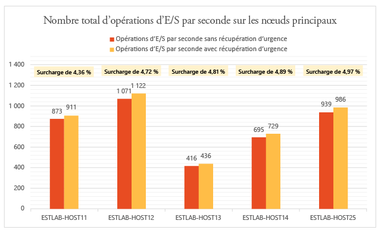

Le Réplica Hyper-V utilise la mémoire du serveur principal pour optimiser les performances des disques. Comme indiqué dans le graphique suivant, le dépassement de capacité de mémoire sur tous les serveurs du cluster principal est mineur. Le dépassement de capacité de mémoire indiqué correspond au pourcentage de mémoire utilisée par la réplication, par rapport à la mémoire totale installée sur le serveur Hyper-V.

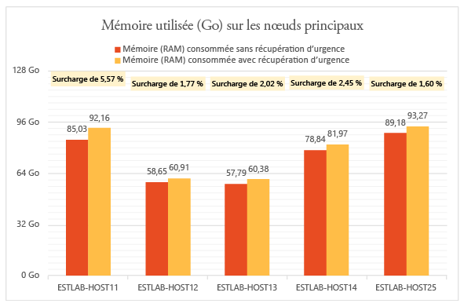

Par ailleurs, le Réplica Hyper-V présente une surcharge minimale pour les processeurs. Comme indiqué dans le graphique, la surcharge de réplication est incluse entre 2 et 3 %.

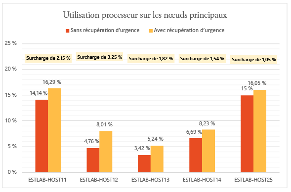

### Performances du serveur secondaire (récupération)

Le Réplica Hyper-V utilise une petite quantité de mémoire sur le serveur de récupération, afin d’optimiser le nombre d’opérations de stockage. Le graphique résume le taux d’utilisation de la mémoire sur le serveur de récupération. Le dépassement de capacité de mémoire indiqué correspond au pourcentage de mémoire utilisée par la réplication, par rapport à la mémoire totale installée sur le serveur Hyper-V.

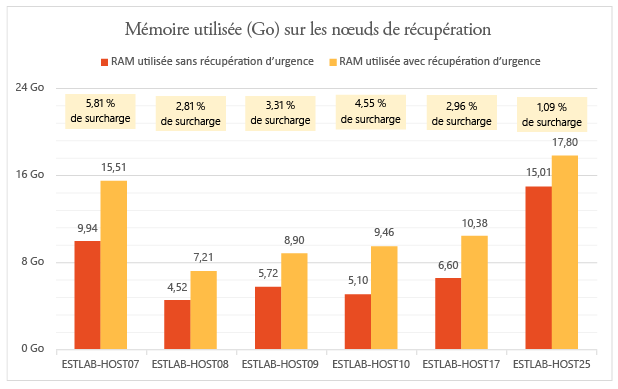

La quantité d’opérations d’E/S sur le site de récupération correspond à une fonction du nombre d’opérations d’écriture sur le site principal. Examinons à présent le nombre total d’opérations d’E/S sur le site de récupération, par rapport au nombre total d’opérations d’E/S et d’écriture sur le site principal. Les graphiques indiquent que le nombre total d’E/S par seconde sur le site de récupération :

- se monte à environ 1,5 fois le nombre d’E/S par seconde en écriture sur le site principal ;

- se monte à environ 37 % du nombre total d’E/S par seconde sur le site principal.

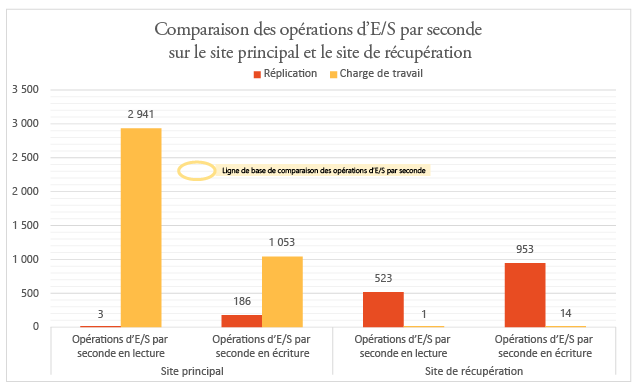

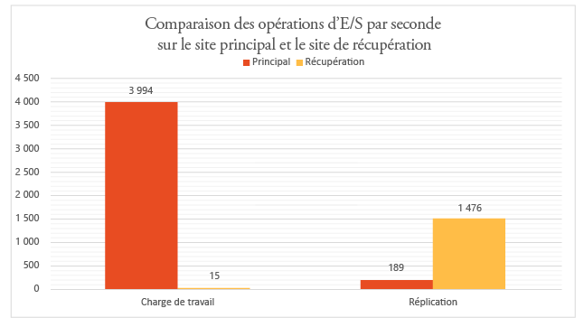

### Effets de la réplication sur le taux d’utilisation du réseau

En moyenne, 275 Mbits/s de bande passante ont été utilisés sur le réseau entre le nœud principal et les nœuds secondaires (la compression étant activée), la bande passante existante étant de 5 Gbit/s.

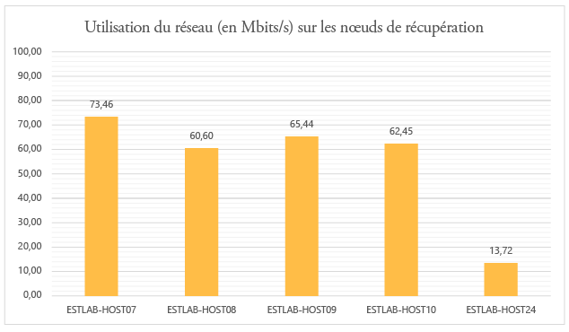

### Effets de la réplication sur les performances des machines virtuelles

Vous devez prendre en compte l’impact de la réplication sur les charges de travail de production exécutées sur des machines virtuelles. Si le site principal est correctement configuré pour la réplication, l’impact sur ces charges doit être nul. Le mécanisme de suivi léger du Réplica Hyper-V s’assure que les charges de travail exécutées dans les machines virtuelles ne sont pas affectées par une réplication à l’état stationnaire. C’est ce qu’indiquent les graphiques suivants.

Ce graphique affiche le nombre d’E/S par seconde produites par les machines virtuelles exécutant diverses charges de travail, avant et après l’activation de la réplication. Comme vous pouvez le voir, ces deux valeurs sont similaires.

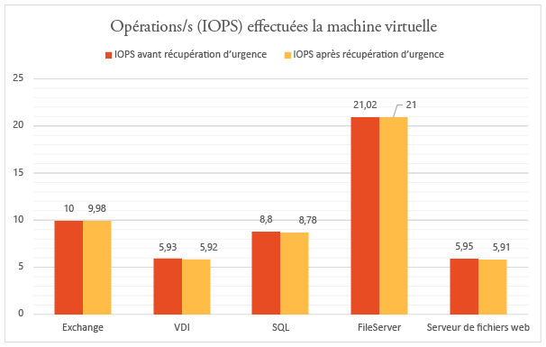

Le graphique suivant affiche le débit des machines virtuelles exécutant diverses charges de travail, avant et après l’activation de la réplication. Comme vous pouvez le voir, l’impact de la réplication est négligeable.

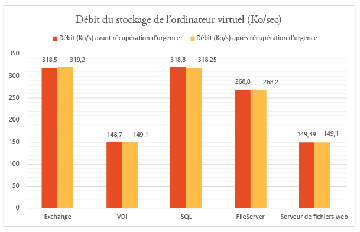

### Conclusion

Les résultats indiquent clairement que la solution Microsoft Azure Site Recovery, utilisée avec le Réplica Hyper-V, s’adapte bien à la surcharge minimale d’un cluster volumineux. Microsoft Azure Site Recovery offre des fonctions simples de déploiement, de réplication, de gestion et de surveillance. Le Réplica Hyper-V fournit l’infrastructure nécessaire pour assurer la réussite de la montée en charge de la réplication. Pour planifier un déploiement optimal, nous vous suggérons de télécharger l’outil [Capacity Planner pour Réplica Hyper-V](https://www.microsoft.com/fr-FR/download/details.aspx?id=39057).

## Environnement du déploiement de test

### Site principal

- Le site principal inclut un cluster qui contient cinq serveurs Hyper-V exécutant 470 machines virtuelles.

- Les machines virtuelles exécutent différentes charges de travail. La protection offerte par Microsoft Azure Site Recovery est activée sur chacune d’elles.

- Pour le nœud de cluster, le stockage est assuré par un SAN iSCSI. Modèle : Hitachi HUS130.

- Chaque serveur du cluster inclut quatre cartes d’interface réseau d’1 Gbit/s chacune.

- Deux cartes d’interface réseau sont connectées à un réseau privé iSCSI et les deux autres, à un réseau d’entreprise externe. L’un des réseaux externes est réservé aux communications du cluster.

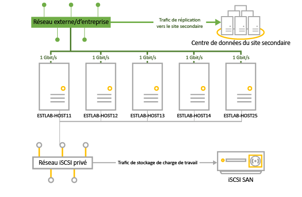

|Serveur|RAM|Modèle|Processeur|Nombre de processeurs|Carte d’interface réseau|Logiciel|
|---|---|---|---|---|---|---|
|Serveurs Hyper-V en cluster :  ESTLAB-HOST11 ESTLAB-HOST12 ESTLAB-HOST13 ESTLAB-HOST14 ESTLAB-HOST25|128 - ESTLAB-HOST25 : 256|Dell™ PowerEdge™ R820|Processeur Intel(R) Xeon(R) E5-4620 0 à 2,20 GHz|4|1 Gbit/s x 4|Windows Server Datacenter 2012 R2 (x 64) + rôle Hyper-V|
|Serveur VMM|2|||2|1 Gbit/s|Windows Server Database 2012 R2 (x 64) + rôle VMM 2012 R2|

### Site secondaire (récupération)

- Le site secondaire dispose d’un cluster de basculement à six nœuds.

- Pour le nœud de cluster, le stockage est assuré par un SAN iSCSI. Modèle : Hitachi HUS130.

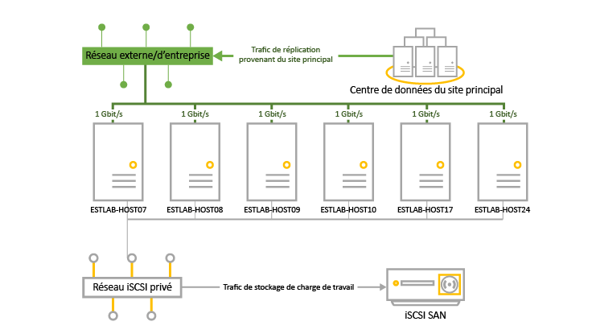

|Serveur|RAM|Modèle|Processeur|Nombre de processeurs|Carte d’interface réseau|Logiciel|
|---|---|---|---|---|---|---|
|Serveurs Hyper-V en cluster :  ESTLAB-HOST07 ESTLAB-HOST08 ESTLAB-HOST09 ESTLAB-HOST10|96|Dell™ PowerEdge™ R720|Processeur Intel(R) Xeon(R) E5-2630 0 à 2,30 GHz|2|1 Gbit/s x 4|Windows Server Datacenter 2012 R2 (x 64) + rôle Hyper-V|
|ESTLAB-HOST17|128|Dell™ PowerEdge™ R820|Processeur Intel(R) Xeon(R) E5-4620 0 à 2,20 GHz|4||Windows Server Datacenter 2012 R2 (x 64) + rôle Hyper-V|
|ESTLAB-HOST24|256|Dell™ PowerEdge™ R820|Processeur Intel(R) Xeon(R) E5-4620 0 à 2,20 GHz|2||Windows Server Datacenter 2012 R2 (x 64) + rôle Hyper-V|
|Serveur VMM|2|||2|1 Gbit/s|Windows Server Database 2012 R2 (x 64) + rôle VMM 2012 R2|

### Charges de travail du serveur

- À des fins de test, nous avons choisi les charges de travail souvent utilisées dans les scénarios de clients d’entreprise.

- Nous utilisons [IOMeter](http://www.iometer.org) en parallèle avec les caractéristiques des charges de travail résumées dans le tableau, à des fins de simulation.

- Tous les profils IOMeter sont définis de manière à écrire des octets aléatoires pour simuler les modes d’écriture aux limites.

|Charge de travail|Taille des E/S (Ko)|Pourcentage d’accès|Pourcentage de lectures|E/S en attente|Modèle d’E/S|
|---|---|---|---|---|---|
|Serveur de fichiers|48163264|60 %20 %5 %5 %10 %|80 %80 %80 %80 %80 %|88888|100 % aléatoires|
|SQL Server (volume 1) SQL Server (volume 2)|864|100 %100 %|70 %0 %|88|100 % aléatoires100 % séquentielles|
|Microsoft Exchange|32|100 %|67 %|8|100 % aléatoires|
|Station de travail/VDI|464|66 %34 %|70 %95 %|11|100 % aléatoires|
|Serveur de fichiers web|4864|33 %34 %33 %|95 %95 %95 %|888|75 % aléatoires|

### Configuration de la machine virtuelle

- 470 machines virtuelles sur le cluster principal.

- Toutes les machines virtuelles avec un disque VHDX.

- Machines virtuelles exécutant les charges de travail résumées dans le tableau. Elles ont toutes été créées avec des modèles VMM.

|Charge de travail|Nombre de VM|Mémoire RAM minimale (en Go)|Mémoire RAM maximale (en Go)|Taille du disque logique par machine virtuelle (en Go)|Nombre maximal d’E/S par seconde|
|---|---|---|---|---|---|
|SQL Server|51|1|4|167|10|
|Microsoft Exchange Server|71|1|4|552|10|
|Serveur de fichiers|50|1|2|552|22|
|VDI|149|0,5|1|80|6|
|Serveur web|149|0,5|1|80|6|
|TOTAL|470|||96,83 To|4 108|

### Paramètres de Microsoft Azure Site Recovery

- Microsoft Azure Site Recovery a été configuré pour assurer la protection entre des sites locaux.

- Le serveur VMM compte quatre clouds configurés, contenant les serveurs du cluster Hyper-V et leurs machines virtuelles.

|Cloud VMM principal|Protection des machines virtuelles dans le cloud|Fréquence de réplication|Points de récupération supplémentaires|
|---|---|---|---|
|PrimaryCloudRpo15m|142|15 minutes|Aucun|
|PrimaryCloudRpo30s|47|30 secondes|Aucun|
|PrimaryCloudRpo30sArp1|47|30 secondes|1|
|PrimaryCloudRpo5m|235|5 minutes|Aucun|

### Mesures de performances

Ce tableau récapitule les mesures de performances et les compteurs utilisés lors du déploiement.

|Mesure|Compteur|
|---|---|
|UC|\\Processor(\_Total)\\% Processor Time|
|Mémoire disponible|\\Memory\\Available MBytes|
|E/S par seconde|\\PhysicalDisk(\_Total)\\Disk Transfers/sec|
|Nombre d’opérations d’E/S par seconde en lecture de la VM|\\Hyper-V Virtual Storage Device(<VHD>)\\Read Operations/Sec|
|Nombre d’opérations d’E/S par seconde en écriture de la VM|\\Hyper-V Virtual Storage Device(<VHD>)\\Write Operations/S|
|Débit de lecture des VM|\\Hyper-V Virtual Storage Device(<VHD>)\\Read Bytes/sec|
|Débit d’écriture des VM|\\Hyper-V Virtual Storage Device(<VHD>)\\Write Bytes/sec|

## Étapes suivantes

Pour commencer à déployer ASR, effectuez les opérations suivantes :

- [Configuration de la protection entre un site local VMM et Azure](site-recovery-vmm-to-azure.md)
- [Configuration de la protection entre un site local Hyper-V et Azure](site-recovery-hyper-v-site-to-azure.md)
- [Configuration de la protection entre des sites VMM locaux](site-recovery-vmm-to-vmm.md)
- [Configuration de la protection entre des sites locaux VMM avec SAN](site-recovery-vmm-san.md)
- [Configuration de la protection avec un seul serveur VMM](site-recovery-single-vmm.md)
 

<!----HONumber=Oct15_HO3-->