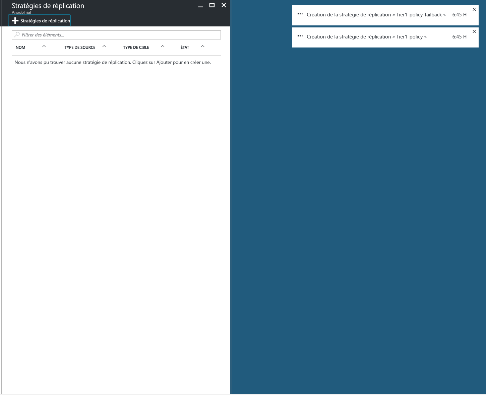
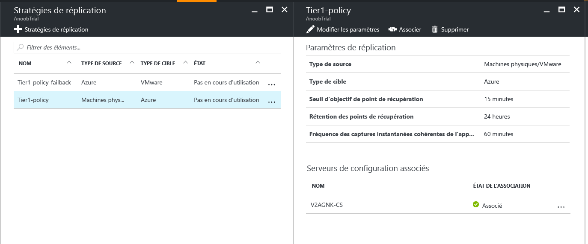
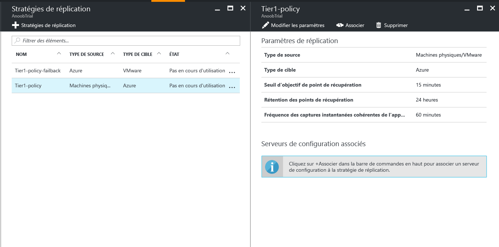
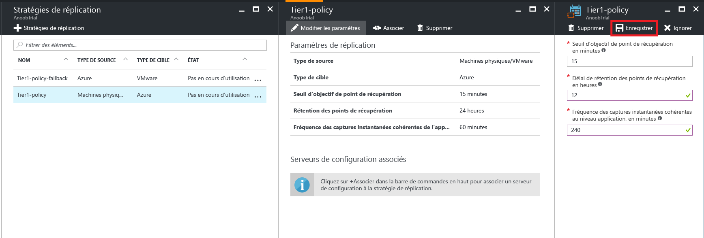

# Gérer la stratégie de réplication pour VMware dans Azure

## Créer une stratégie de réplication

1. Sélectionnez **Gérer** > **Infrastructure Site Recovery**.
2. Sélectionnez **Stratégies de réplication** sous **Pour les machines VMware et physiques**.
3. Sélectionnez **+Stratégie de réplication**.

    

4. Entrez le nom de la stratégie.

5. Dans le champ **Seuil d’objectif de point de récupération**, spécifiez la limite de l’objectif de point de récupération. Des alertes sont générées lorsque la réplication continue dépasse cette limite.
6. Dans **Rétention des points de récupération**, spécifiez la durée (en heures) de la fenêtre de rétention pour chaque point de récupération. Les machines protégées peuvent être récupérées à tout moment pendant cette fenêtre de rétention.

    > [!NOTE]
    > Les machines virtuelles répliquées vers le Stockage Premium peuvent prendre en charge jusqu’à 24 heures de rétention. Les machines virtuelles répliquées vers le Stockage Standard peuvent prendre en charge jusqu’à 72 heures de rétention.

    > [!NOTE]
    > Une stratégie de réplication pour la restauration automatique est automatiquement créée.

7. Dans **Fréquence des captures instantanées cohérentes au niveau de l’application**, spécifiez la fréquence de création des points de récupération qui contiennent des captures instantanées cohérentes au niveau de l’application (en minutes).

8. Cliquez sur **OK**. La création de la stratégie devrait prendre entre 30 et 60 secondes.

## Associer un serveur de configuration à une stratégie de réplication
1. Choisissez la stratégie de réplication à laquelle vous souhaitez associer le serveur de configuration.
2. Cliquez sur **Associer**.

3. Sélectionnez le serveur de configuration dans la liste des serveurs.
4. Cliquez sur **OK**. L’association du serveur de configuration devrait prendre entre une et deux minutes.

## Modifier une stratégie de réplication
1. Choisissez la stratégie de réplication pour laquelle vous souhaitez modifier les paramètres de réplication.

2. Cliquez sur **Edit Settings**.

3. Modifiez les paramètres selon vos besoins.
4. Cliquez sur **Save**. L’enregistrement de la stratégie devrait prendre entre deux et cinq minutes en fonction du nombre de machines virtuelles utilisant la stratégie de réplication.

## Dissocier un serveur de configuration d’une stratégie de réplication
1. Choisissez la stratégie de réplication à laquelle vous souhaitez associer le serveur de configuration.
2. Cliquez sur **Dissocier**.
3. Sélectionnez le serveur de configuration dans la liste des serveurs.
4. Cliquez sur **OK**. La dissociation du serveur de configuration devrait prendre entre une et deux minutes.

    > [!NOTE]
    > Vous ne pouvez pas dissocier un serveur de configuration si un élément répliqué utilise cette stratégie. Vérifiez qu’aucun élément répliqué n’utilise la stratégie avant de dissocier le serveur de configuration.

## Supprimer une stratégie de réplication

1. Choisissez la stratégie de réplication que vous souhaitez supprimer.
2. Cliquez sur **Supprimer**. La suppression de la stratégie devrait prendre entre 30 et 60 secondes.

    > [!NOTE]
    > Vous ne pouvez pas supprimer une stratégie de réplication si un serveur de configuration lui est associé. Assurez-vous qu’aucun élément répliqué n’utilise la stratégie, et supprimez tous les serveurs de configuration avant de supprimer la stratégie.
