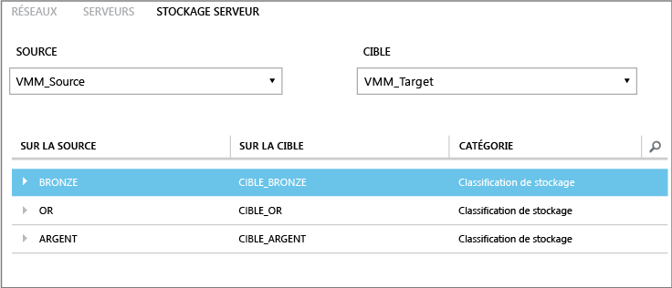

<properties
	pageTitle="Mappage de stockage Site Recovery"
	description="Azure Site Recovery coordonne la réplication, le basculement et la récupération des ordinateurs virtuels et services physiques situés en local vers Azure et vers un site local secondaire."
	services="site-recovery"
	documentationCenter=""
	authors="rayne-wiselman"
	manager="jwhit"
	editor=""/>

<tags
	ms.service="site-recovery"
	ms.devlang="na"
	ms.topic="get-started-article"
	ms.tgt_pltfrm="na"
	ms.workload="storage-backup-recovery"
	ms.date="05/08/2015"
	ms.author="raynew"/>

# Mappage de stockage Site Recovery

Azure Site Recovery contribue à mettre en œuvre la stratégie de continuité des activités et de récupération d'urgence de votre entreprise en coordonnant la réplication, le basculement et la récupération de machines virtuelles et de serveurs physiques. Pour obtenir des instructions sur les différents scénarios de déploiement possibles, voir [Présentation d’Azure Site Recovery](site-recovery-overview.md).

## Dans cet article

Le mappage de stockage est un élément important de votre déploiement Site Recovery. Il garantit une utilisation optimale de stockage. Cet article décrit le mappage de stockage et fournit quelques exemples pour vous aider à en comprendre le fonctionnement.

Publiez vos questions sur le [Forum Azure Recovery Services](https://social.msdn.microsoft.com/forums/azure/home?forum=hypervrecovmgr).

## Vue d'ensemble

La configuration du mappage de stockage dépend de votre scénario de déploiement Site Recovery.

- **Local vers local (réplication avec Réplica Hyper-V)** : mappez les classifications de stockage sur des serveurs VMM source et cible pour effectuer les opérations suivantes :

	- **Identifier le stockage cible des ordinateurs virtuels de réplica** : les ordinateurs virtuels seront répliqués sur une cible de stockage (partage de SMB ou volumes partagés de cluster (VPC)) que vous choisissez.
	- **Placement d’ordinateurs virtuels de réplica** : le mappage de stockage permet d’optimiser le positionnement d’ordinateurs virtuels de réplica sur des serveurs hôtes Hyper-V. Les ordinateurs virtuels de réplica seront placés sur des hôtes ayant accès à la classification de stockage mappé.
	- **Aucun mappage de stockage** : si vous ne configurez aucun mappage de stockage, les ordinateurs virtuels seront répliqués sur l'emplacement de stockage par défaut spécifié sur le serveur hôte Hyper-V associé à l’ordinateur virtuel de réplica.

- **Local vers local (réplication avec SAN)** : mappez les pools de piles de stockage sur des serveurs VMM source et cible pour effectuer les opérations suivantes :
	- **Identifier les pools de stockage cible** : le mappage de stockage garantit que les numéros d'unités logiques dans un groupe de réplication sont répliqués dans le pool de stockage cible mappé.

## Classifications de stockage

Vous créez un mappage entre les classifications de stockage sur les serveurs VMM source et cible ou sur un seul serveur VMM si deux sites sont gérés par le même serveur VMM. Lorsque le mappage est configuré correctement et que la réplication est activée, le disque dur virtuel d’un ordinateur virtuel à l'emplacement primaire est répliqué sur le stockage dans l'emplacement cible mappé. Notez les points suivants :

- Les classifications de stockage doivent être accessibles aux groupes hôtes situés dans les clouds source et cible.
- - Il n'est pas obligatoire qu'elles aient le même type de stockage. Par exemple, vous pouvez mapper une classification source contenant des partages SMB à une classification cible contenant des volumes partagés de cluster.
- Pour en savoir plus, consultez [Comment créer des classifications de stockage dans VMM](https://technet.microsoft.com/library/gg610685.aspx).

## exemples

Si les classifications sont correctement configurées dans VMM lorsque vous sélectionnez les serveurs VMM source et cible lors du mappage de stockage, les classifications source et cible s’affichent. Voici un exemple de partages de fichiers de stockage et de classifications pour une entreprise ayant deux sites à New York et Chicago.

**Emplacement** | **Serveur VMM** | **Partage de fichiers (source)** | **Classification (source)** | **Mappé à** | **Partage de fichiers (cible)**
---|---|--- |---|---|---
New York | VMM_Source| SourceShare1 | GOLD | GOLD_TARGET | TargetShare1
 | | SourceShare2 | SILVER | SILVER_TARGET | TargetShare2
 | | SourceShare3 | BRONZE | BRONZE_TARGET | TargetShare3
Chicago | VMM_Target | | GOLD_TARGET | Non mappé |
| | | SILVER_TARGET | Non mappé |
 | | | BRONZE_TARGET | Non mappé

Vous pouvez les configurer dans l’onglet **Serveur de stockage** de la page **Ressources** du portail Site Recovery.

Dans cet exemple : - Lorsqu'un ordinateur virtuel de réplica est créé pour un ordinateur virtuel sur le stockage GOLD (SourceShare1), il est répliqué sur un stockage GOLD_TARGET (TargetShare1). -Lorsqu'un ordinateur virtuel de réplica est créé pour un ordinateur virtuel sur un stockage SILVER (SourceShare2), il est répliqué sur un stockage SILVER_TARGET (TargetShare2), et ainsi de suite.

Les partages de fichiers et leurs classifications affectées dans VMM sont les suivants.

## Emplacements de stockage multiples

Si la classification cible est affectée à plusieurs partages SMB ou VPC, l’emplacement de stockage optimal est sélectionné automatiquement lorsque l'ordinateur virtuel est protégé. Si aucun stockage cible approprié n'est disponible avec la classification spécifiée, l'emplacement de stockage par défaut spécifié sur l'hôte Hyper-V est utilisé pour placer les disques durs virtuels de réplica.

Le tableau suivant affiche la classification de stockage et les volumes partagés de cluster sont configurés dans notre exemple.

**Emplacement** | **Classification** | **Stockage associé**
---|---|---
New York | GOLD | 
C:\ClusterStorage\\SourceVolume1

\\FileServer\\SourceShare1

 | SILVER | 
C:\ClusterStorage\\SourceVolume2

\\FileServer\\SourceShare2

Chicago | GOLD_TARGET | 
C:\ClusterStorage\\TargetVolume1

\\FileServer\\TargetShare1

 | SILVER_TARGET| 
C:\ClusterStorage\\TargetVolume2

\\FileServer\\TargetShare2

Ce tableau récapitule le comportement lorsque vous activez la protection des ordinateurs virtuels (VM1 à VM5) dans cet exemple d'environnement.

**Ordinateur virtuel** | **Stockage source** | **Classification source** | **Stockage cible mappé**
---|---|---|---
MV1 | C:\ClusterStorage\\SourceVolume1 | GOLD | 
C:\ClusterStorage\\SourceVolume1

\\\\FileServer\\SourceShare1

Both GOLD_TARGET

MV2 | \\FileServer\\SourceShare1 | GOLD | 
C:\ClusterStorage\\SourceVolume1

\\FileServer\\SourceShare1
 
Both GOLD_TARGET

MV3 | C:\ClusterStorage\\SourceVolume2 | SILVER | 
C:\ClusterStorage\\SourceVolume2

\\FileServer\\SourceShare2

MV4 | \\FileServer\\SourceShare2 | SILVER |
C:\ClusterStorage\\SourceVolume2

\\FileServer\\SourceShare2

Both SILVER_TARGET

MV5 | C:\ClusterStorage\\SourceVolume3 | N/A | Aucun mappage. Donc l’emplacement de stockage par défaut de l'hôte Hyper-V est utilisé.

## Étapes suivantes

Maintenant que vous avez une meilleure compréhension du mappage de stockage, lisez les [bonnes pratiques](site-recovery-best-practices.md) de préparation du déploiement.
 

<!---HONumber=58_postMigration-->