<properties
	pageTitle="Configuration de la protection entre un site local VMM et Azure"
	description="Azure Site Recovery coordonne la réplication, le basculement et la récupération de machines virtuelles Hyper-V situées dans des clouds VMM locaux sur Azure."
	services="site-recovery"
	documentationCenter=""
	authors="rayne-wiselman"
	manager="jwhit"
	editor="tysonn"/>

<tags
	ms.service="site-recovery"
	ms.workload="backup-recovery"
	ms.tgt_pltfrm="na"
	ms.devlang="na"
	ms.topic="hero-article"
	ms.date="05/07/2015"
	ms.author="raynew"/>

#  Configuration de la protection entre un site local VMM et Azure

## Vue d'ensemble

Azure Site Recovery contribue à mettre en œuvre la stratégie de continuité des activités et de récupération d'urgence de votre entreprise en coordonnant la réplication, le basculement et la récupération de machines virtuelles dans divers scénarios de déploiement. Pour obtenir la liste complète des scénarios de déploiement, consultez [Vue d'ensemble d'Azure Site Recovery](site-recovery-overview.md).

Ce guide de scénario décrit comment déployer la Récupération de sites pour orchestrer et automatiser la protection des charges de travail exécutées sur des machines virtuelles sur des serveurs hôtes Hyper-V qui se trouvent dans des clouds privés VMM. Dans ce scénario, les machines virtuelles sont répliquées d'un site VMM principal vers Azure à l'aide de Hyper-V Replica.

Le guide indique les conditions prérequises pour le scénario et montre comment configurer un coffre Récupération de sites, installer le fournisseur Azure Site Recovery sur le serveur VMM source, inscrire le serveur dans le coffre, ajouter un compte de stockage Azure, installer l'agent Azure Recovery Services sur les serveurs hôtes Hyper-V, configurer les paramètres de protection des clouds VMM qui seront appliqués à toutes les machines virtuelles protégées, puis activer la protection pour ces machines virtuelles. Pour finir, vous pourrez tester le basculement pour vous assurer que tout fonctionne comme prévu.

Si vous rencontrez des problèmes pour mettre en œuvre ce scénario, posez vos questions sur le [Forum Azure Recovery Services](http://go.microsoft.com/fwlink/?LinkId=313628).

## Avant de commencer

Assurez-vous que les conditions préalables sont remplies :
### Conditions préalables pour Azure

- Vous aurez besoin d’un compte [Microsoft Azure](http://azure.microsoft.com/). Si vous n'en possédez pas, commencez avec une [version d'évaluation gratuite](http://aka.ms/try-azure). Vous pouvez aussi consulter la [Tarification Azure Site Recovery Manager](http://go.microsoft.com/fwlink/?LinkId=378268).
- Vous aurez besoin d'un compte de stockage Azure pour stocker les données répliquées dans Azure. La géo-réplication doit être activée pour ce compte. Ce dernier doit se trouver dans la même région que le service Azure Site Recovery et être associé au même abonnement. Pour en savoir plus sur la configuration du stockage Azure, consultez la page [Introduction à Microsoft Azure Storage](http://go.microsoft.com/fwlink/?LinkId=398704).
- Vous devez vous assurer que les machines virtuelles que vous souhaitez protéger sont conformes aux exigences Azure. Pour plus d'informations, consultez la section [Prise en charge des machines virtuelles](https://msdn.microsoft.com/library/azure/dn469078.aspx#BKMK_E2A).

### Configuration requise pour VMM
- Vous aurez besoin d'un serveur VMM exécuté sur System Center 2012 R2.
- Tout serveur VMM contenant des machines virtuelles à protéger doit exécuter le fournisseur Azure Site Recovery. Celui-ci est installé lors du déploiement d'Azure Site Recovery.
- Vous aurez besoin d'au moins un cloud sur le serveur VMM que vous souhaitez protéger. Le coud doit contenir :
	- un ou plusieurs groupes hôtes VMM ;
	- un ou plusieurs serveurs hôtes Hyper-V ou clusters dans chaque groupe hôte ;
	- une ou plusieurs machines virtuelles sur le serveur Hyper-V source. Les machines virtuelles doivent être de la génération 1.
- Pour en savoir plus sur la configuration des clouds VMM :
	- Lisez la documentation sur les clouds privés VMM dans les sections [Nouveautés sur le cloud privé dans System Center 2012 R2 VMM](http://go.microsoft.com/fwlink/?LinkId=324952) et [VMM 2012 et les clouds](http://go.microsoft.com/fwlink/?LinkId=324956).
	- En savoir plus sur la [Configuration de l'infrastructure de cloud VMM](https://msdn.microsoft.com/library/azure/dn469075.aspx#BKMK_Fabric)
	- Une fois vos éléments d'infrastructure de cloud en place, consultez la documentation sur la création de clouds privés dans les sections [Création d'un cloud privé dans VMM](http://go.microsoft.com/fwlink/?LinkId=324953) et [Procédure pas à pas : création de clouds privés avec System Center 2012 SP1 VMM](http://go.microsoft.com/fwlink/?LinkId=324954).

### Conditions préalables liées à Hyper-V

- Les serveurs hôtes Hyper-V doivent exécuter au moins Windows Server 2012 R2 avec le rôle Hyper-V et les dernières mises à jour doivent être installées.
- Si vous utilisez Hyper-V dans un cluster, notez que le service Broker du cluster n'est pas créé automatiquement si vous avez un cluster basé sur des adresses IP statiques. Vous devez configurer manuellement le service Broker du cluster. Pour obtenir des instructions, consultez la section [Configurer le service Broker de réplication Hyper-V](http://go.microsoft.com/fwlink/?LinkId=403937).
- Tout cluster ou serveur hôte Hyper-V pour lequel vous souhaitez gérer la protection doit être inclus dans un cloud VMM.

L'illustration ci-dessous montre les différents canaux et ports de communication utilisés par Azure Site Recovery pour l'orchestration et la réplication.

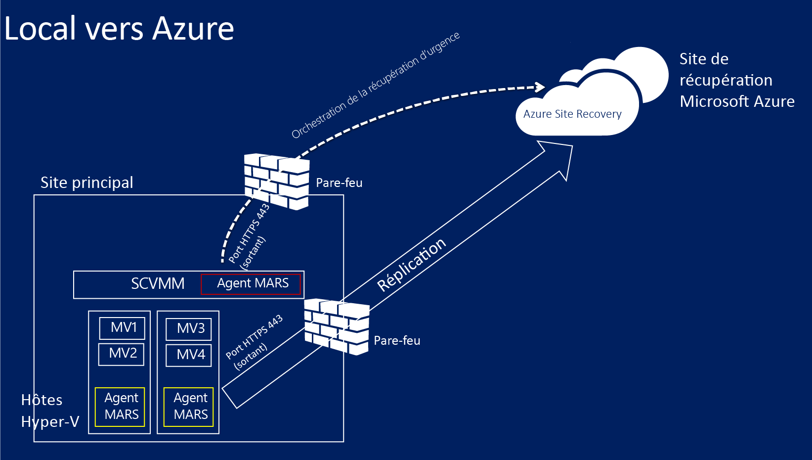

### Conditions préalables liées au mappage réseau
Quand vous protégez des machines virtuelles dans Azure, le mappage réseau effectue un mappage entre les réseaux de machines virtuelles sur le serveur VMM source et les réseaux Azure cibles pour permettre ce qui suit :

- Toutes les machines qui basculent sur le même réseau peuvent se connecter les unes aux autres, quel que soit le plan de récupération auquel elles appartiennent.
- Si une passerelle réseau est configurée sur le réseau Azure cible, les machines virtuelles peuvent se connecter à d'autres machines virtuelles locales.
- Si vous ne configurez pas le mappage réseau, seules les machines virtuelles qui basculent dans le même plan de récupération pourront se connecter les unes aux autres après le basculement vers Azure.

Si vous souhaitez déployer le mappage réseau, les conditions suivantes doivent être remplies :

- Les machines virtuelles que vous souhaitez protéger sur le serveur VMM source doivent être connectées à un réseau de machines virtuelles. Ce réseau doit être lié à un réseau logique lui-même associé au cloud.
- Un réseau Azure auquel les machines virtuelles répliquées peuvent se connecter après le basculement. Vous sélectionnerez ce réseau au moment du basculement. Le réseau doit être dans la même région que votre abonnement Azure Site Recovery.
- En savoir plus sur le mappage réseau :
	- [Configuration de la mise en réseau logique dans VMM](http://go.microsoft.com/fwlink/?LinkId=386307)
	- [Configuration de réseaux de machines virtuelles et de passerelles dans VMM](http://go.microsoft.com/fwlink/?LinkId=386308)
	- [Configurer et analyser des réseaux virtuels dans Azure](http://go.microsoft.com/fwlink/?LinkId=402555)

## Étape 1 : Création d’un coffre Site Recovery

1. Connectez-vous au [Portail de gestion](https://portal.azure.com) à partir du serveur VMM à inscrire.

2. Développez
3. *Services de données*, développez *Recovery Services*, puis cliquez sur *Coffre Site Recovery*. \*
3. Cliquez sur *Create New*, puis sur *Quick Create*.

4. Dans *Name*, entrez un nom convivial pour identifier le coffre.

5. Dans *Region*, sélectionnez la région géographique du coffre. Les régions géographiques disponibles sont les suivantes : Asie orientale, Europe de l'Ouest, Ouest des États-Unis, Est des États-Unis, Europe du Nord et Asie du Sud-Est.
6. Cliquez sur *Create vault*.

	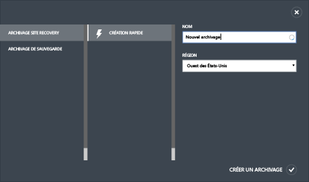

Vérifiez la barre d'état pour vous assurer que le coffre a été créé correctement. Le coffre apparaît comme *Actif* dans la page Recovery Services principale.

## Étape 2 : Génération d’une clé d'inscription du coffre

Générez une clé d'inscription dans le coffre. Une fois que vous aurez téléchargé et installé le fournisseur Azure Site Recovery sur le serveur VMM, vous utiliserez cette clé pour inscrire le serveur VMM dans le coffre.

1. Sur la page *Recovery Services*, cliquez sur le coffre pour ouvrir la page Démarrage rapide. Vous pouvez aussi ouvrir cette page à tout moment au moyen de l'icône.

	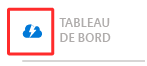

2. Dans la liste déroulante, sélectionnez **Entre un site Hyper-V local et Microsoft Azure**.
3. Dans **Prepare VMM Servers**, cliquez sur le fichier **Generate registration key**. Le fichier de clé est généré automatiquement et est valide pendant cinq jours après sa création. Si vous n'accédez pas au portail Azure à partir du serveur VMM, vous devez copier ce fichier sur le serveur.

	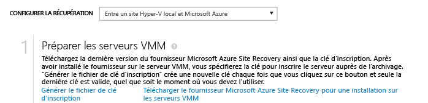

## Étape 3 : Installation du fournisseur Azure Site Recovery

4. Sur la page *Quick Start*, dans **Prepare VMM servers**, cliquez sur *Download Microsoft Azure Site Recovery Provider for installation on VMM servers* pour obtenir la dernière version du fichier d'installation du fournisseur.

2. Exécutez ce fichier sur le serveur VMM source. Si VMM est déployé dans un cluster et que vous installez le fournisseur pour la première fois, installez-le sur un nœud actif et terminez l'installation pour inscrire le serveur VMM dans le coffre. Ensuite, installez le fournisseur sur les autres nœuds. Notez que si vous mettez à niveau le fournisseur, vous devez le mettre à niveau sur tous les nœuds, car ils doivent tous exécuter la même version du fournisseur.

3. Dans **Pre-requirements Check**, choisissez d'arrêter le service VMM pour lancer l'installation du fournisseur. Le service s'arrête et redémarre automatiquement une fois l'installation terminée. Si vous installez sur un cluster VMM, vous serez invité à arrêter le rôle de cluster.

	

4. Dans **Microsoft Update**, vous pouvez opter pour l'installation de mises à jour. En activant ce paramètre, les mises à jour du fournisseur seront installées en fonction de votre stratégie Microsoft Update.

	

Une fois le fournisseur installé, poursuivez l'installation afin d'enregistrer le serveur dans le coffre.

5. Sur la page **Connexion Internet**, indiquez la façon dont le fournisseur exécuté sur le serveur VMM se connecte à Internet. Sélectionnez *Utiliser les paramètres proxy par défaut du système* pour utiliser les paramètres de connexion Internet par défaut configurés sur le serveur.

	 - Si vous souhaitez utiliser un proxy personnalisé, vous devez le configurer avant d'installer le fournisseur. Quand vous configurez les paramètres de proxy personnalisé, un test s'exécute pour vérifier la connexion proxy. - Si vous n'utilisez pas de proxy personnalisé ou si votre proxy par défaut nécessite une authentification, vous devez saisir les détails du proxy, y compris l'adresse du proxy et le port. - Les URL suivantes doivent être accessibles à partir du serveur VMM et des hôtes Hyper-V - *.hypervrecoverymanager.windowsazure.com - *.accesscontrol.windows.net - *.backup.windowsazure.com - *.blob.core.windows.net - *.store.core.windows.net - Autorisez les adresses IP décrites dans la zone [Étendues d’adresses IP du centre de données Azure](http://go.microsoft.com/fwlink/?LinkId=511094) et le protocole HTTPS (443). Vous devez autoriser les plages IP de la région Azure que vous prévoyez d'utiliser et de l'ouest des États-Unis.

	- Si vous utilisez un proxy personnalisé, un compte RunAs VMM (DRAProxyAccount) est créé automatiquement avec les informations d'identification du proxy spécifiées. Configurez le serveur proxy pour que ce compte puisse s'authentifier correctement. Vous pouvez modifier les paramètres du compte RunAs VMM dans la console VMM. Pour cela, ouvrez l'espace de travail Paramètres, développez Sécurité, cliquez sur Comptes d'identification, puis modifiez le mot de passe de DRAProxyAccount. Vous devez redémarrer le service VMM pour que ce paramètre prenne effet.

6. Dans **Registration Key**, indiquez que vous téléchargez depuis Azure Site Recovery et que vous copiez sur le serveur VMM.
7. Dans **Vault name**, vérifiez le nom du coffre dans lequel le serveur est enregistré.
8. Dans **Server name**, entrez un nom convivial pour identifier le serveur VMM dans le coffre. Dans une configuration de cluster, spécifiez le nom de rôle de cluster VMM.

	

8. Dans la synchronisation **Initial cloud metadata**, indiquez si vous souhaitez synchroniser les métadonnées de tous les clouds sur le serveur VMM à l'aide du coffre. Cette action se produit une seule fois sur chaque serveur. Si vous ne souhaitez pas synchroniser tous les clouds, vous pouvez désactiver ce paramètre et synchroniser individuellement chaque cloud via les propriétés du cloud de la console VMM.

9. Dans **Chiffrement des données**, vous spécifiez un emplacement pour enregistrer un certificat SSL généré automatiquement pour le chiffrement de données. Ce certificat est utilisé si vous activez le chiffrement de données pour un cloud protégé par Azure dans le portail Azure Site Recovery. Conservez ce certificat en sécurité. Quand vous exécutez un basculement vers Azure, vous le sélectionner pour déchiffrer les données chiffrées.

	

8. Cliquez sur *Register* pour terminer le processus. Une fois l'inscription terminée, les métadonnées du serveur VMM sont extraites par Azure Site Recovery. Le serveur figure dans l'édition de l'onglet *Resources* de la page **Servers** du coffre.

## Étape 4 : Création d’un compte de stockage Azure

Si vous ne possédez pas de compte de stockage Azure, cliquez sur **Ajouter un compte Azure Storage**. La géo-réplication doit être activée pour ce compte. Ce dernier doit se trouver dans la même région que le service Azure Site Recovery et être associé au même abonnement.

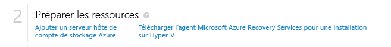

## Étape 5 : Installation de l'agent Azure Recovery Services

Installez l'agent Azure Recovery Services sur chaque serveur hôte Hyper-V situé dans les clouds VMM que vous souhaitez protéger.

1. Sur la page Démarrage rapide, cliquez sur <b>Télécharger l'agent Azure Site Recovery Services et l'installer sur les hôtes</b> afin d'obtenir la dernière version du fichier d'installation de l'agent.

	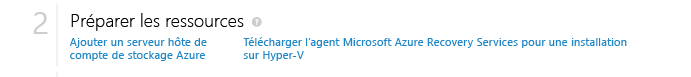

2. Exécutez le fichier d'installation sur chaque serveur hôte Hyper-V situé dans les clouds VMM que vous souhaitez protéger.
3. Sur la page **Vérification de la configuration requise**, cliquez sur <b>Suivant</b>. Tous les éléments manquants de la configuration requise sont automatiquement installés.

	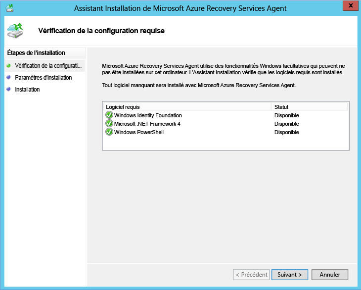

4. Sur la page **Paramètres d'installation**, indiquez où vous voulez installer l'agent et sélectionnez l'emplacement du cache dans lequel les métadonnées de sauvegarde seront installées. Cliquez ensuite sur <b>Installer</b>.

## Étape 6 : Configuration des paramètres de protection de cloud

Une fois le serveur VMM inscrit, vous pouvez configurer les paramètres de protection de cloud. Vous avez activé l'option **Synchroniser les données du cloud avec le coffre** lors de l'installation du fournisseur. Ainsi, tous les clouds du serveur VMM s’affichent dans l'onglet <b>Éléments protégés</b> du coffre.

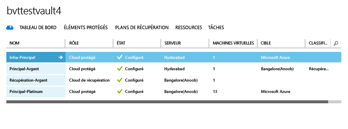

1. Sur la page Démarrage rapide, cliquez sur **Set up protection for VMM clouds**.
2. Sous l'onglet **Éléments protégés**, cliquez sur le cloud que vous souhaitez configurer, puis accédez à l'onglet **Configuration**.
3. Dans la zone <b>Cible</b>, sélectionnez <b>Microsoft Azure</b>.
4. Dans la zone <b>Compte de stockage</b>, sélectionnez le compte de stockage Azure vers lequel vous voulez répliquer vos machines virtuelles.
5. En regard de <b>Chiffrer les données stockées</b>, cliquez sur <b>Désactivé</b>. Ce paramètre indique que les données doivent être répliquées avec chiffrement entre le site local et Azure.
6. Dans <b>Copier la fréquence</b>, laissez le paramètre par défaut. Cette valeur indique la fréquence de synchronisation des données entre les emplacements source et cible.
7. Dans la zone <b>Conserver les points de récupération pour</b>, conservez le paramètre par défaut. Avec une valeur par défaut de zéro, seul le dernier point de récupération d'une machine virtuelle principale est stocké sur un serveur hôte de réplication.
8. Dans <b>Fréquence des instantanés cohérents au niveau applicatif</b>, laissez le paramètre par défaut. Cette valeur indique la fréquence de création de captures instantanées. Ces dernières utilisent le service VSS (Volume Shadow Copy Service) pour s'assurer que les applications sont dans un état cohérent lors de la prise des captures instantanées. Si vous définissez une valeur, assurez-vous qu'elle est inférieure au nombre de points de récupération supplémentaires que vous configurez.
9. Dans la zone <b>Heure de démarrage de la réplication</b>, indiquez l'heure à laquelle la réplication initiale des données dans Azure doit démarrer. Le fuseau horaire du serveur hôte Hyper-V est utilisé à cet effet. Nous vous recommandons de planifier la réplication initiale sur des heures creuses.

	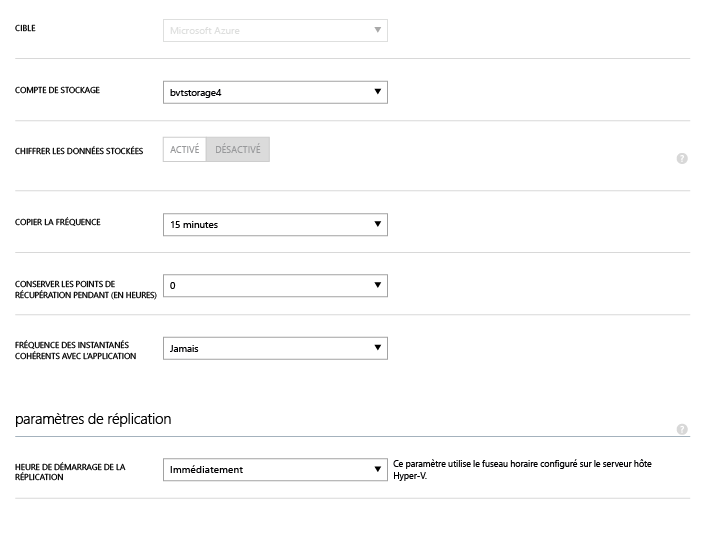

Suite à l'enregistrement des paramètres, une tâche est créée et peut être surveillée sous l'onglet <b>Jobs</b>. Tous les serveurs hôte Hyper-V du cloud VMM source sont configurés pour la réplication.

Après l'enregistrement, les paramètres du cloud peuvent être modifiés sous l'onglet <b>Configurer</b>. Pour modifier l'emplacement ou le compte de stockage cible, vous devez supprimer la configuration du cloud, puis reconfigurer ce dernier. Notez que si vous modifiez le compte de stockage, la modification n'est appliquée que pour les machines virtuelles qui sont activées pour la protection après la modification du compte. Les machines virtuelles existantes ne sont pas migrées vers le nouveau compte de stockage.

## Étape 7 : Configuration du mappage réseau
Avant de commencer le mappage réseau, vérifiez que les machines virtuelles sur le serveur VMM source sont connectées à un réseau de machines virtuelles. En outre, vous devez créer un ou plusieurs réseaux virtuels Azure. Notez que plusieurs réseaux de machines virtuelles peuvent être mappés à un seul réseau Azure.

1. Dans la page Démarrage rapide, cliquez sur **Mapper les réseaux**.
2. Sous l'onglet **Réseaux**, dans **Emplacement source**, sélectionnez le serveur VMM source. Dans **Emplacement cible**, sélectionnez Azure.
3. Dans **Source**, une liste de réseaux de machines virtuelles associées au serveur VMM est affichée. Dans **Cible**, les réseaux Azure associés à l'abonnement sont affichés.
4. Sélectionnez le réseau de machines virtuelles source et cliquez sur **Mapper**.
5. Dans la page **Sélectionner un réseau cible**, sélectionnez le réseau Azure cible que vous souhaitez utiliser.
6. Cliquez sur la coche pour terminer le processus de mappage.

	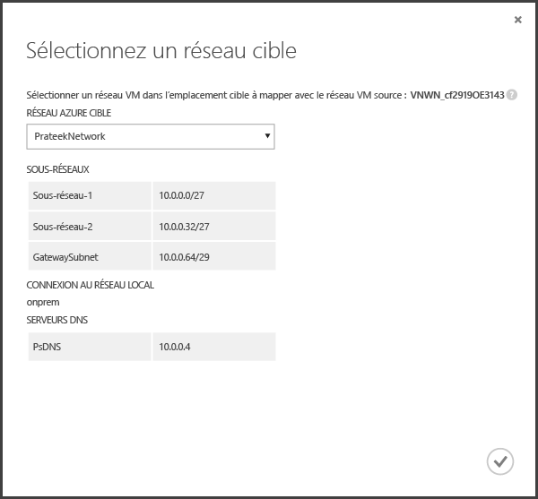

Une fois les paramètres enregistrés, une tâches commence à suivre la progression du mappage et vous pouvez la surveiller sous l'onglet Tâches. Toute machine virtuelle de réplication existante qui correspond au réseau de machines virtuelles source sera connectée aux réseaux Azure cibles. Les nouvelles machines virtuelles qui sont connectées au réseau de machines virtuelles source seront connectées au réseau Azure mappé après la réplication. Si vous modifiez un mappage existant avec un nouveau réseau, les machines virtuelles de réplication seront connectées à l'aide des nouveaux paramètres.

Notez que si le réseau cible a plusieurs sous-réseaux et que l'un d'entre eux a le même nom que le sous-réseau où se trouve la machine virtuelle source, la machine virtuelle de réplication sera connectée à ce sous-réseau cible après le basculement. S’il n’existe aucun sous-réseau cible avec un nom correspondant, la machine virtuelle sera connectée au premier sous-réseau du réseau.

## Étape 8 : Activation de la protection des machines virtuelles

Dès lors que les serveurs, les clouds et les réseaux ont été configurés correctement, vous pouvez activer la protection pour les machines virtuelles du cloud. Notez les points suivants :

- Les machines virtuelles doivent répondre aux exigences liées à Azure. Pour en savoir plus sur ces dernières, consultez la page <a href="http://go.microsoft.com/fwlink/?LinkId=402602">Configuration requise et prise en charge</a> dans le guide de planification.
- Pour activer la protection, vous devez définir les propriétés du système d'exploitation et du disque du système d'exploitation pour la machine virtuelle. Lorsque vous créez une machine virtuelle dans VMM à l'aide d'un modèle de machine virtuelle, vous pouvez définir la propriété. Vous pouvez également définir ces propriétés pour des machines virtuelles existantes dans les onglets **Général** et **Configuration matérielle** des propriétés de la machine virtuelle. Si vous ne définissez pas ces propriétés dans VMM, vous pourrez les configurer dans le portail Azure Site Recovery.

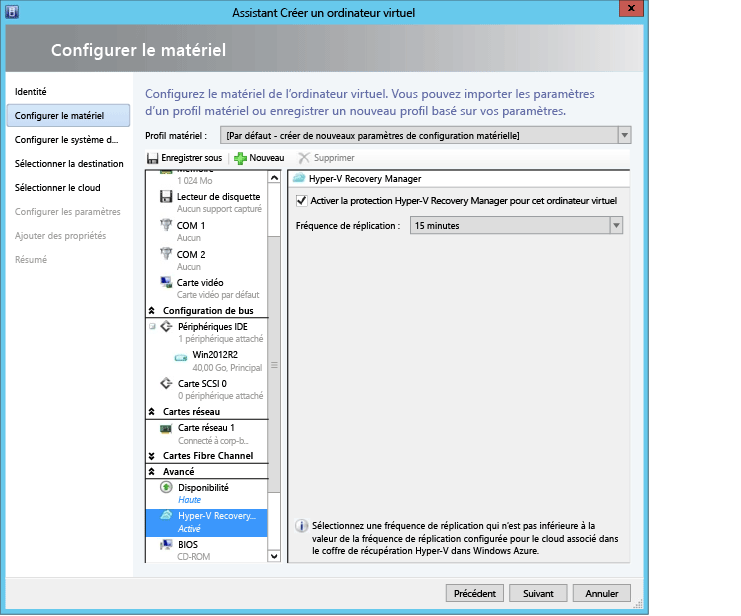

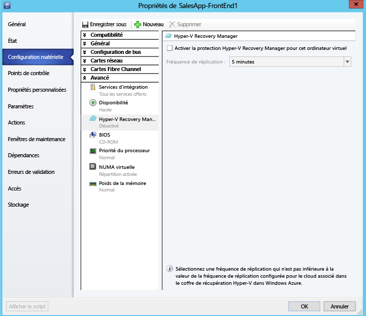

1. Pour activer la protection, sous l'onglet <b>Machines virtuelles</b> dans le cloud où se trouve la machine virtuelle, cliquez sur <b>Activer la protection</b>, puis sélectionnez <b>Ajouter des machines virtuelles</b>
2. Dans la liste des machines virtuelles du cloud, sélectionnez celle que vous voulez protéger.

	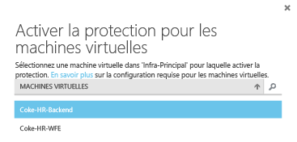

	Suivez la progression de l'action d'activation de la protection, y compris la réplication initiale, dans l'onglet **Tâches**. Lorsque la tâche de finalisation de la protection s’exécute, la machine virtuelle est prête à être basculée. Une fois la protection activée et les machines virtuelles répliquées, celles-ci sont affichées dans Azure.

	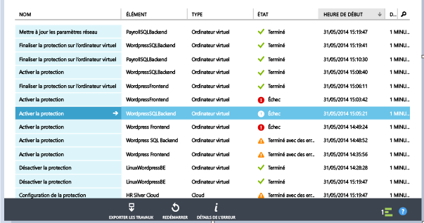

3. Vérifiez les propriétés de la machine virtuelle et modifiez-les si besoin est.

	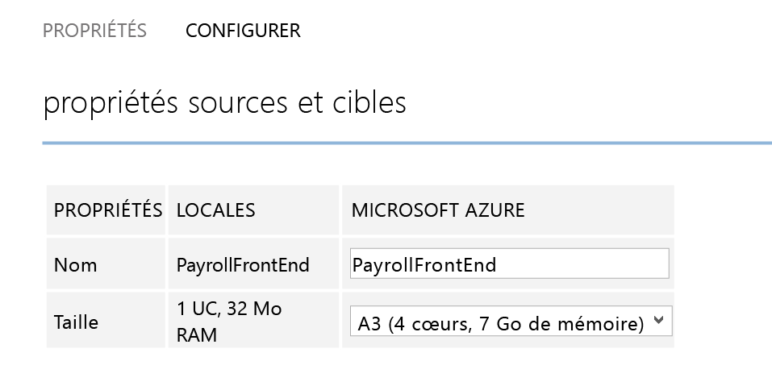

4. Dans l'onglet de configuration des propriétés de la machine virtuelle, les propriétés réseau suivantes ont pu être modifiées.

    1. Nombre de cartes réseau de la machine virtuelle cible : le nombre de cartes réseau sur la machine virtuelle cible dépend de la taille de la machine virtuelle choisie. Le nombre de cartes réseau des machines virtuelles cible est au minimum le nombre de cartes réseau sur la machine virtuelle source et au maximum le nombre de cartes réseau prises en charge par la machine virtuelle choisie en fonction de sa taille.  

	1. Réseau de la machine virtuelle cible : le réseau auquel la machine virtuelle se connecte est déterminé par le mappage réseau du réseau de la machine virtuelle source. Dans le cas où la machine virtuelle source possède plusieurs cartes réseau et où les réseaux source sont mappés à des réseaux différents sur la cible, l'utilisateur doit choisir l'un des réseaux cible.

	1. Sous-réseau de chacune des cartes réseau : pour chaque carte réseau, l'utilisateur peut choisir le sous-réseau auquel la machine virtuelle basculée se connectera.

	1. IP cible : si la carte réseau de la machine virtuelle source est configurée pour utiliser des adresses IP statiques, l'utilisateur peut fournir l'adresse IP de la machine virtuelle cible. L’utilisateur peut utiliser cette fonctionnalité pour conserver l'adresse IP de la machine virtuelle source après un basculement. Si aucune IP n'est fournie, une adresse IP disponible, quelle qu’elle soit, est attribuée à la carte réseau au moment du basculement. Dans le cas où l'adresse IP cible fournie par l'utilisateur est déjà utilisée par une autre machine virtuelle en cours d'exécution dans Azure, le basculement échoue.

		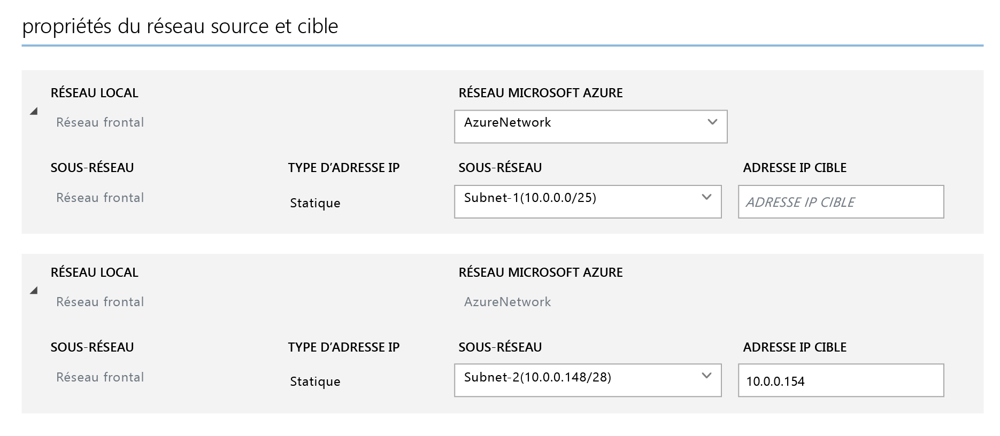

## Tester votre déploiement
Pour tester votre déploiement, vous pouvez exécuter un test de basculement pour une seule machine virtuelle, ou créer un plan de récupération comportant plusieurs machines virtuelles et exécuter sur lui un test de basculement. Il simule votre mécanisme de basculement et de récupération dans un réseau isolé. Notez les points suivants :

- Si vous voulez vous connecter à la machine virtuelle dans Azure avec le Bureau à distance après le basculement, activez Connexion Bureau à distance sur la machine virtuelle avant d’exécuter le test de basculement.
- Après le basculement, vous utiliserez une adresse IP publique pour vous connecter à la machine virtuelle dans Azure avec le Bureau à distance. Dans ce cas, assurez-vous qu'aucune de vos stratégies de domaine ne vous empêche de vous connecter à une machine virtuelle avec une adresse publique.

### Créer un plan de récupération

1. Sous l'onglet **Plans de récupération**, ajoutez un nouveau plan. Spécifiez un nom, **VMM** dans **Type de Source**, puis le serveur VMM source dans **Source**. La cible est Azure.

	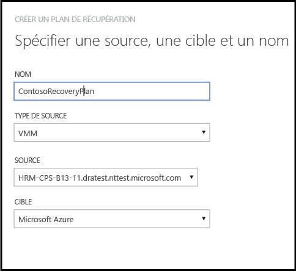

2. Dans la page **Sélectionner les machines virtuelles**, sélectionnez les machines virtuelles à ajouter au plan de récupération. Ces machines virtuelles sont ajoutées au groupe de plan de récupération par défaut (Groupe 1). Un maximum de 100 machines virtuelles dans un même plan de récupération ont été testées.

	- Si vous souhaitez vérifier les propriétés de la machine virtuelle avant de les ajouter au plan, cliquez sur la machine virtuelle dans la page de propriétés du cloud où elle se trouve. Vous pouvez également configurer les propriétés de la machine virtuelle dans la console VMM.
	- Toutes les machines virtuelles affichées ont été activées pour la protection. La liste inclut à la fois les machines virtuelles qui sont activées pour la protection et où la réplication initiale est terminée, et celles qui sont activées pour la protection avec réplication initiale en attente. Seules les machines virtuelles avec réplication initiale terminée peuvent basculer dans le cadre d'un plan de récupération. Par conséquent, vérifiez l'état de la réplication initiale des machines virtuelles dans le plan avant de commencer le basculement du plan de récupération.

	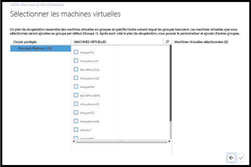

Une fois qu'un plan de récupération a été créé, il apparaît dans la liste sous l'onglet **Plans de récupération**. Vous pouvez également ajouter des [Runbooks Azure Automation](site-recovery-runbook-automation.md) au plan de récupération pour automatiser les actions de temps de basculement.

### Exécution d’un test de basculement

Il existe deux manières d’exécuter un test de basculement vers Azure.

- Tester le basculement sans réseau Azure : ce type de test de basculement vérifie que la machine virtuelle s’affiche correctement dans Azure. La machine virtuelle ne sera connectée à aucun réseau Azure après le basculement.
- Tester le basculement avec un réseau Azure : ce type de basculement vérifie que l’ensemble de l’environnement de réplication s’affiche comme prévu et qu’après le basculement les machines virtuelles seront connectées au réseau Azure cible spécifié. Pour la gestion de sous-réseau, pour le test de basculement le sous-réseau de la machine virtuelle test sera déterminé en fonction du sous-réseau de la machine virtuelle de réplication. Ceci diffère de la réplication normale, selon laquelle le sous-réseau d’une machine virtuelle de réplication est basé sur le sous-réseau de la machine virtuelle source.

Si vous souhaitez exécuter un test de basculement pour une machine virtuelle activée pour la protection dans Azure sans spécifier de réseau Azure cible, vous n’avez pas besoin de rien préparer. Pour exécuter un test de basculement avec un réseau Azure cible, vous devez créer un réseau Azure isolé de votre réseau de production Azure (comportement par défaut quand vous créez un réseau dans Azure) et configurer l’infrastructure pour que la machine virtuelle répliquée fonctionne comme prévu. Par exemple, une machine virtuelle sur laquelle le contrôleur de domaine et DNS sont installés peut être répliquée sur Microsoft Azure via Microsoft Azure Site Recovery et peut être créée dans le réseau de test, via le test de basculement. Pour exécuter un test de basculement, procédez comme suit :

1. Effectuez un test de basculement de la machine virtuelle avec le contrôleur de domaine et DNS, dans le même réseau que celui que vous utiliserez pour le test de basculement réel de la machine virtuelle locale.
2. Notez les adresses IP allouées à la machine virtuelle DNS soumise au basculement.
3. Sur le réseau virtuel Microsoft Azure qui sera utilisé pour le basculement, ajoutez l’adresse IP en tant qu’adresse du serveur DNS.
4. Exécutez le test de basculement des machines virtuelles locales sources, en spécifiant le réseau de test Microsoft Azure.
5. Après avoir vérifié que le test de basculement a fonctionné comme prévu, signalez qu’il a abouti pour le plan de récupération, puis pour le contrôleur de domaine et les machines virtuelles DNS.

Pour exécuter un test de basculement, procédez comme suit :

1. Dans l'onglet **Plans de récupération**, sélectionnez le plan et cliquez sur **Test de basculement**.
1. Sur la page **Confirmer le test de basculement**, sélectionnez **Aucun** ou un réseau Microsoft Azure spécifique. Notez que si vous sélectionnez Aucun, le test de basculement vérifie que la machine virtuelle a été répliquée correctement dans Azure, mais il ne vérifie pas la configuration de votre réseau de réplication.

	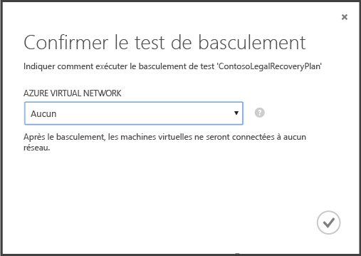

1. Si le chiffrement des données est activé pour le cloud, dans **Clé de chiffrement**, sélectionnez le certificat qui a été émis lors de l'installation du fournisseur sur le serveur VMM, quand vous avez activé l'option d'activation du chiffrement des données pour un cloud.
1. Sur l’onglet **Tâches**, vous pouvez suivre la progression du basculement. Vous devriez aussi pouvoir voir le réplica de test de la machine virtuelle dans le portail Azure. Si vous êtes autorisé à accéder aux machines virtuelles à partir de votre réseau local, vous pouvez initier une connexion Bureau à distance à la machine virtuelle.
1. Lorsque le basculement atteint la phase **Terminer le test**, cliquez sur **Terminer le test** pour finir l’opération. Sous l’onglet **Tâches**, vous pouvez suivre la progression et l’état du basculement et effectuer toutes les actions nécessaires.
1. Après le basculement, vous pouvez voir le réplica de test de la machine virtuelle dans le portail Azure. Si vous êtes autorisé à accéder aux machines virtuelles à partir de votre réseau local, vous pouvez initier une connexion Bureau à distance à la machine virtuelle. Notez les points suivants :

    1. Vérifiez que les machines virtuelles démarrent correctement.
    1. Si vous voulez vous connecter à la machine virtuelle dans Azure avec le Bureau à distance après le basculement, activez Connexion Bureau à distance sur la machine virtuelle avant d’exécuter le test de basculement. Vous devez également ajouter un point de terminaison RDP sur la machine virtuelle. Pour cela, vous pouvez utiliser les [Runbooks de Microsoft Azure Automation](site-recovery-runbook-automation.md).
    1. Une fois le basculement effectué, si vous utilisez une adresse IP publique pour vous connecter à la machine virtuelle dans Microsoft Azure via le Bureau à distance, vérifiez qu’aucune stratégie du domaine ne vous empêche de vous connecter à une machine virtuelle au moyen d’une adresse publique.

1.  Une fois le test effectué, procédez comme suit :
	- Cliquez sur **Le test de basculement est terminé**. Nettoyez l’environnement de test afin qu’il mette hors tension et supprime automatiquement les machines virtuelles de test.
	- Cliquez sur **Notes** pour consigner et enregistrer les éventuelles observations associées au test de basculement.

## Suivi de l'activité

Vous pouvez utiliser l'onglet *Jobs* et le *tableau de bord* pour afficher et surveiller les tâches principales effectuées par le coffre Azure&#160;Site&#160;Recovery, telles que la configuration de la protection d'un cloud, l'activation et la désactivation de la protection d'une machine virtuelle, l'exécution d'un basculement (planifié, non planifié ou test) et la validation d'un basculement non planifié.

Depuis l'onglet *Jobs*, vous pouvez afficher les tâches, accéder aux détails de l'une d'entre elles ainsi qu'aux erreurs précédemment rencontrées lors de l'exécution de celle-ci, exécuter des requêtes de tâches pour récupérer les tâches qui correspondent à des critères spécifiques, exporter des tâches sur Excel et redémarrer celles qui ont échoué.

Depuis le *tableau de bord*, vous pouvez télécharger la dernière version des fichiers d'installation fournisseur et agent, obtenir des informations sur la configuration du coffre, découvrir le nombre de machines virtuelles dont la protection est assurée par le coffre, afficher les tâches récentes, gérer le certificat de coffre et resynchroniser des machines virtuelles.

Pour plus d'informations sur les interactions avec les tâches et le tableau de bord, consultez le <a href="http://go.microsoft.com/fwlink/?LinkId=398534">Guide sur les opérations et la surveillance</a>.

##Étapes suivantes
<UL>
<LI>Pour planifier et déployer Azure Site Recovery dans un environnement de production complet, consultez le <a href="http://go.microsoft.com/fwlink/?LinkId=321294">Guide de planification d'Azure Site Recovery</a> et le <a href="http://go.microsoft.com/fwlink/?LinkId=321295">Guide de déploiement d'Azure Site Recovery</a>.</LI>

<LI>Pour toute question, visitez le <a href="http://go.microsoft.com/fwlink/?LinkId=313628">Forum Azure Recovery Services</a>.</LI></UL>
 

<!---HONumber=July15_HO5-->