# Réplication vers Azure de machines virtuelles Hyper-V hébergées dans des clouds VMM à l’aide du Portail Azure
> [!div class="op_single_selector"]
> * [portail Azure](site-recovery-vmm-to-azure.md)
> * [Portail Azure Classic](site-recovery-vmm-to-azure-classic.md)
> * [PowerShell Resource Manager](site-recovery-vmm-to-azure-powershell-resource-manager.md)
> * [PowerShell Classic](site-recovery-deploy-with-powershell.md)
> 
> 

Bienvenue dans le service Azure Site Recovery.

Site Recovery est un service Azure qui participe à votre stratégie de continuité des activités et de récupération d’urgence. Il orchestre la réplication des machines virtuelles et des serveurs physiques locaux vers le cloud (Azure) ou un centre de données secondaire. Lorsque des pannes se produisent sur votre site principal, vous effectuez un basculement sur le site secondaire pour préserver la disponibilité des applications et des charges de travail. Vous restaurez votre site principal dès lors qu’il retrouve un fonctionnement normal. Pour en savoir plus, voir [Qu’est-ce que Site Recovery ?](site-recovery-overview.md)

Cet article explique comment répliquer des machines virtuelles Hyper-V locales gérées sur les clouds System Center VMM dans Azure Site Recovery, sur le Portail Azure.

Après avoir lu cet article, n’hésitez pas à poster un commentaire en bas de la section des commentaires de Disqus. Publiez vos questions techniques sur le [Forum Azure Recovery Services](https://social.msdn.microsoft.com/forums/azure/home?forum=hypervrecovmgr).

## Référence rapide
Pour un déploiement complet, nous vous recommandons vivement de suivre toutes les étapes de l’article. Si vous manquez de temps, voici un bref résumé proposant des liens vers davantage d’informations.

| **Zone** | **Détails** |
| --- | --- |
| **Scénario de déploiement** |Réplication de machines virtuelles Hyper-V gérées dans des clouds VMM sur Azure à l’aide du Portail Azure |
| **Configuration requise en local** |Un ou plusieurs serveurs VMM s’exécutant sous System Center 2012 R2, avec un ou plusieurs clouds.   Les clouds doivent contenir un ou plusieurs groupes hôtes VMM.   Au moins un serveur Hyper-V dans le cloud, exécutant au moins Windows Server 2012 R2 avec le rôle Hyper-V ou Microsoft Hyper-V Server 2012 R2 avec les dernières mises à jour.   Les serveurs VMM et les hôtes Hyper-V doivent avoir accès à Internet et doivent être en mesure d’accéder à des URL spécifiques directement ou via un proxy. [Informations complètes](#on-premises-prerequisites). |
| **Limitations en local** |Les proxies basés sur HTTPS ne sont pas pris en charge. |
| **Fournisseur/agent** |Les machines virtuelles répliquées ont besoin du fournisseur Azure Site Recovery.   Les hôtes Hyper-V ont besoin de l’agent Azure Recovery Services.   Vous installez ces éléments pendant le déploiement. |
|  **Conditions requises pour Azure** |Compte Azure   Coffre Recovery Services   Compte de stockage LRS ou GRS dans la région du coffre   Compte de stockage standard   Réseau virtuel Azure dans la région du coffre. [Informations complètes](#azure-prerequisites). |
|  **Limitations relatives à Azure** |Si vous utilisez GRS, vous avez besoin d’un autre compte LRS pour la journalisation.   Les comptes de stockage créés dans le Portail Azure ne peuvent pas passer d’un groupe de ressources à l’autre.   Premium Storage n’est pas pris en charge. |
|  **Réplication de machines virtuelles** |Les machines virtuelles doivent respecter les conditions préalables pour Azure](site-recovery-best-practices.md#azure-virtual-machine-requirements)   |
|  **Limitations relatives à la réplication** |Vous ne pouvez pas répliquer de machines virtuelles exécutant Linux avec une adresse IP statique.   Vous ne pouvez pas exclure de disques spécifiques de la réplication. |
| **Étapes du déploiement** |1) Préparez Azure (abonnement, stockage, réseau) -> 2) Préparez les éléments locaux (VMM et le mappage réseau) -> 3) Créez un coffre Recovery Services -> 4) Configurez les hôtes VMM et Hyper-V -> 5) Configurez les paramètres de réplication -> 6) Activez la réplication -> 7) Testez la réplication et le basculement. |

## Site Recovery dans le portail Azure
Azure propose deux [modèles de déploiement](../resource-manager-deployment-model

> ) pour la création et l’utilisation de ressources : Azure Resource Manager et Azure Classic. Azure offre également deux portails : le Portail Azure Classic et le Portail Azure. Cet article explique comment effectuer le déploiement dans le Portail Azure. 
> 
> 

Sur le Portail Azure, Site Recovery fournit de nouvelles fonctionnalités :

* Les services Azure Backup et Azure Site Recovery sont combinés en un seul et même coffre Recovery Services, afin de vous permettre de configurer et de gérer les fonctions de récupération d’urgence et de continuité d’activité (BCDR) à partir d’un emplacement unique. Un tableau de bord unifié permet de surveiller et de gérer des opérations sur vos sites locaux et le cloud public Azure.
* Les utilisateurs dotés d’abonnements Azure configurés avec le programme du fournisseur de solutions cloud (CSP) peuvent désormais gérer les opérations Site Recovery dans le Portail Azure.
* À partir du Portail Azure, vous pouvez répliquer des machines dans des comptes de stockage Azure Resource Manager. Lors du basculement, Site Recovery crée des machines virtuelles Resource Manager dans Azure.
* Il continue de prendre en charge la réplication sur les comptes de stockage classiques. Lors du basculement, Site Recovery crée des machines virtuelles en utilisant le modèle classique.

## Site Recovery dans votre entreprise
Les organisations ont besoin d’une stratégie BCDR qui détermine la façon dont les applications et les données demeurent opérationnelles et disponibles pendant les temps d’arrêt prévus et imprévus, et qui précise comment rétablir au plus vite des conditions de travail normales. Voici ce que Site Recovery peut faire :

* Protection hors site pour les applications professionnelles s’exécutant sur des machines virtuelles Hyper-V
* Fourniture d’un emplacement unique pour configurer, gérer et surveiller la réplication, le basculement et la récupération
* Basculement simple vers Azure et restauration depuis Azure sur des serveurs hôtes Hyper-V dans votre site local
* Plans de récupération incluant plusieurs machines virtuelles et permettant ainsi le basculement simultané de charges de travail d’applications hiérarchisées

## Architecture du scénario
Voici les composants du scénario :

* **Serveur VMM**: un serveur VMM local incluant un ou plusieurs clouds.
* **Hôte ou cluster Hyper-V**: serveurs hôtes ou clusters Hyper-V gérés dans des clouds VMM.
* **Fournisseur Azure Site Recovery et agent Azure Recovery Services** : lors du déploiement, vous installez le fournisseur Azure Site Recovery sur le serveur VMM et l’agent Microsoft Azure Recovery Services sur les serveurs hôtes Hyper-V. Le fournisseur se trouvant sur le serveur VMM communique avec Site Recovery via le port HTTPS 443 pour répliquer l’orchestration. L’agent hébergé sur le serveur hôte Hyper-V réplique les données vers le stockage Azure via le port HTTPS 443, par défaut.
* **Azure**: il vous faut un abonnement Azure, un compte de stockage Azure pour stocker des données répliquées, et un réseau virtuel Azure, afin que les machines virtuelles Azure puissent se connecter à un réseau après un basculement.

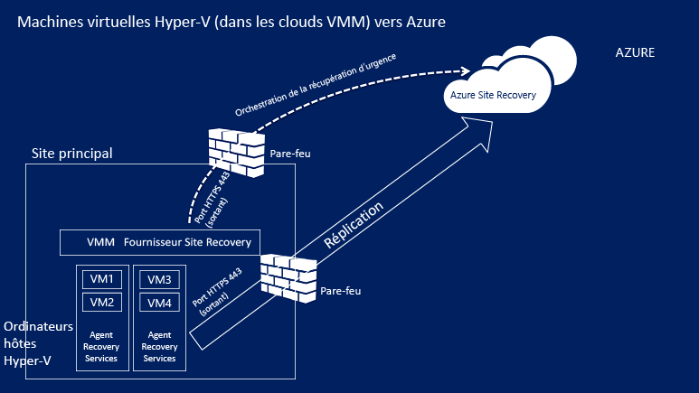

## Conditions préalables pour Azure
Voici ce dont vous avez besoin dans Azure :

| **Configuration requise** | **Détails** |
| --- | --- |
| **Compte Azure** |Vous avez besoin d’un compte [Microsoft Azure](http://azure.microsoft.com/) . Vous pouvez commencer par une version d’ [essai gratuit](https://azure.microsoft.com/pricing/free-trial/). [En savoir plus](https://azure.microsoft.com/pricing/details/site-recovery/) sur la tarification Site Recovery. |
| **Stockage Azure** |Vous avez besoin d’un compte de stockage Azure standard pour stocker les données répliquées. Vous pouvez utiliser un compte de stockage LRS ou GRS. Nous vous recommandons d’utiliser un compte GRS, afin que les données soient résilientes si une panne se produit au niveau régional, ou si la région principale ne peut pas être récupérée. [En savoir plus](../storage/storage-redundancy.md). Ce compte doit se trouver dans la même région que le coffre Recovery Services.  Premium Storage n’est pas pris en charge.   Les données répliquées sont stockées dans Azure Storage et les machines virtuelles Azure sont créées au moment du basculement.    [Découvrez plus d’informations](../storage/storage-introduction.md) sur Azure Storage. |
| **Réseau Azure** |Vous avez besoin d’un réseau virtuel Azure auquel les machines virtuelles Azure se connectent lors du basculement. Ce réseau doit se trouver dans la même région que le coffre Recovery Services. |

## Conditions préalables locales
Voici les éléments dont vous aurez besoin en local :

| **Configuration requise** | **Détails** |
| --- | --- |
| **VMM** |Un ou plusieurs serveurs VMM s’exécutant sous System Center 2012 R2. Chaque serveur VMM doit être associé à un ou plusieurs clouds configurés. Un cloud doit contenir :   un ou plusieurs groupes hôtes VMM ;   un ou plusieurs serveurs hôtes Hyper-V ou clusters dans chaque groupe hôte.  [En savoir plus](http://social.technet.microsoft.com/wiki/contents/articles/2729.how-to-create-a-cloud-in-vmm-2012.aspx) sur la configuration des clouds VMM. |
| **Hyper-V** |Les serveurs hôtes Hyper-V doivent exécuter au moins **Windows Server 2012 R2** avec le rôle Hyper-V ou **Microsoft Hyper-V Server 2012 R2** et les dernières mises à jour doivent être installées.   Un serveur Hyper-V doit contenir au moins une machine virtuelle.   Un serveur hôte ou un cluster Hyper-V comportant des machines virtuelles que vous souhaitez répliquer doit être géré dans un cloud VMM.  Les serveurs Hyper-V doivent être connectés à Internet, directement ou via un proxy.  Les correctifs mentionnés dans l’article [2961977](https://support.microsoft.com/kb/2961977) doivent être installés sur les serveurs Hyper-V.  Les serveurs hôte Hyper-V doivent pouvoir accéder à Internet pour gérer la réplication de données vers Azure. |
| **Fournisseur et agent** |Lors du déploiement d’Azure Site Recovery, vous installez le fournisseur Azure Site Recovery sur le serveur VMM et l’agent Recovery Services sur les hôtes Hyper-V. Le fournisseur et l’agent doivent se connecter à Azure via Internet, directement ou via un proxy. Les proxies basés sur HTTPS ne sont pas pris en charge. Le serveur proxy sur le serveur VMM et les hôtes Hyper-V doit autoriser l’accès à :    ``*.hypervrecoverymanager.windowsazure.com``    ``*.accesscontrol.windows.net``   ``*.backup.windowsazure.com``   ``*.blob.core.windows.net``   ``*.store.core.windows.net``   Si le serveur VMM inclut des règles de pare-feu basées sur l’adresse IP, vérifiez qu’elles autorisent la communication vers Azure. Vous devez autoriser [les plages d’adresses IP de centres de données Azure](https://www.microsoft.com/download/confirmation.aspx?id=41653) et le port HTTPS (443).   Autorisez les plages d’adresses IP relatives à la région de votre abonnement Azure et à la région des États-Unis de l’Ouest.   Par ailleurs : le serveur proxy sur le serveur VMM doit avoir accès à ``https://www.msftncsi.com/ncsi.txt`` |

## Configuration requise pour les machines protégées
| **Configuration requise** | **Détails** |
| --- | --- |
| **Machines virtuelles protégées** |Avant de basculer vers une machine virtuelle, vous devez vous assurer que le nom attribué à la machine virtuelle Azure est conforme à la [configuration requise pour Azure](site-recovery-best-practices.md#azure-virtual-machine-requirements). Le cas échéant, vous pouvez modifier le nom une fois la réplication activée pour la machine virtuelle.    Sur les machines protégées, la capacité d’un disque ne doit pas dépasser 1 023 Go. Une machine virtuelle peut comporter jusqu’à 16 disques (jusqu’à 16 To).   Les clusters invités dont le disque est partagé ne sont pas pris en charge.   L’amorçage UEFI (Unified Extensible Firmware Interface) / EFI (Extensible Firmware Interface) n’est pas pris en charge.   Si la machine virtuelle source propose l’association de cartes réseau, elle est convertie en une carte réseau unique après le basculement vers Azure.  La protection des machines virtuelles exécutant Linux avec une adresse IP statique n’est pas prise en charge. |

## Préparation du déploiement
Pour préparer un déploiement, vous devez :

1. [Configurer un réseau Azure](#set-up-an-azure-network) dans lequel les machines virtuelles Azure sont placées après un basculement.
2. [Configurer un compte de stockage Azure](#set-up-an-azure-storage-account) pour les données répliquées.
3. [préparer le serveur VMM](#prepare-the-vmm-server) au déploiement de Site Recovery ;
4. [Préparez le mappage réseau](#prepare-for-network-mapping). configurer des réseaux de sorte à pouvoir définir le mappage réseau lors du déploiement de Site Recovery.

### Configurer un réseau Azure
Vous devez avoir un réseau Azure, auquel les machines virtuelles Azure créées après le basculement se connecteront.

* Ce réseau doit se trouver dans la même région que le coffre Recovery Services.
* Selon le modèle de ressource que vous souhaitez utiliser pour les machines virtuelles Azure ayant fait l’objet d’un basculement, vous devez configurer le réseau Azure en [mode Azure Resource Manager](../virtual-network/virtual-networks-create-vnet-arm-pportal.md) ou en [mode Classic](../virtual-network/virtual-networks-create-vnet-classic-pportal.md).
* Nous vous recommandons de configurer un réseau avant de commencer. Sinon, vous devrez le faire lors du déploiement de Site Recovery.

> [!NOTE]
> La [migration des réseaux](../resource-group-move-resources.md) entre les groupes de ressources d’un même abonnement ou de plusieurs abonnements n’est pas prise en charge pour les réseaux utilisés pour le déploiement de Site Recovery.
> 
> 

### Configurer un compte de stockage Azure
* Vous avez besoin d’un compte de stockage Azure standard pour stocker les données répliquées sur Azure. Ce compte doit se trouver dans la même région que le coffre Recovery Services.
* Selon le modèle de ressource que vous souhaitez utiliser pour les machines virtuelles Azure ayant fait l’objet d’un basculement, vous allez configurer un compte en [mode Azure Resource Manager](../storage/storage-create-storage-account.md) ou en [mode Classic](../storage/storage-create-storage-account-classic-portal.md).
* Nous vous recommandons de configurer un compte avant de commencer. Sinon, vous devrez le faire lors du déploiement de Site Recovery.

> [!NOTE]
> [La migration de comptes de stockage](../resource-group-move-resources.md) entre les groupes de ressources d’un même abonnement ou de plusieurs abonnements n’est pas prise en charge pour les comptes de stockage utilisés pour le déploiement de Site Recovery.
> 
> 

### Préparez le serveur VMM
* Assurez-vous que le serveur VMM respecte la [configuration requise](#on-premises-prerequisites).
* Lors du déploiement de Site Recovery, vous pouvez indiquer que tous les clouds sur un serveur VMM doivent être disponibles dans le portail Azure. Si vous souhaitez n’afficher que certains clouds dans le portail, vous pouvez activer ce paramètre sur le cloud dans la console d’administration VMM.

### Préparer le mappage réseau
Vous devez configurer le mappage réseau lors du déploiement de Site Recovery. La fonction de mappage réseau effectue le mappage entre les réseaux de machines virtuelles VMM et les réseaux Azure cibles, afin de permettre les opérations suivantes :

* Les machines qui basculent sur le même réseau peuvent se connecter entre elles, même si elles ne sont pas basculées de la même façon ou dans le cadre du même plan de récupération.
* Si une passerelle réseau est configurée sur le réseau Azure cible, les machines virtuelles Azure peuvent se connecter à des machines virtuelles locales.
* Pour configurer le mappage réseau, voici les éléments dont vous avez besoin :
  
  * Assurez-vous que l’ensemble des machines virtuelles du serveur hôte Hyper-V source sont connectées à un réseau de machines virtuelles VMM. Ce réseau doit être lié à un réseau logique lui-même associé au cloud.
  * Un réseau Azure, comme décrit [ci-dessus](#set-up-an-azure-network)
* [Découvrez plus d’informations](site-recovery-network-mapping.md) sur le fonctionnement du mappage réseau.

## Créer un coffre Recovery Services
1. Connectez-vous au [portail Azure](https://portal.azure.com).
2. Cliquez sur **Nouveau** > **Gestion** > **Recovery Services**. Vous pouvez également sélectionner **Parcourir** > **Coffres **Recovery Services > **Ajouter**.
   
    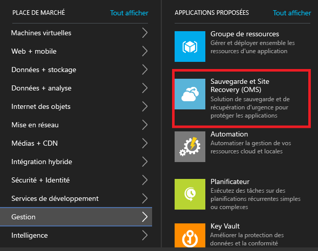
3. Dans **Nom**, indiquez un nom convivial permettant d’identifier le coffre. Si vous avez plusieurs abonnements, sélectionnez-en un.
4. [Créez un groupe de ressources](../resource-group-template-deploy-portal.md)ou sélectionnez-en un. Spécifiez une région Azure. Les machines seront répliquées dans cette région. Pour découvrir les régions prises en charge, référez-vous à la disponibilité géographique de la page [Détails des prix d'Azure Site Recovery](https://azure.microsoft.com/pricing/details/site-recovery/)
5. Si vous souhaitez accéder rapidement au coffre à partir du tableau de bord, cliquez sur **Épingler au tableau de bord** > **Créer un archivage**.
   
    

Le nouveau coffre s’affiche dans la zone **Tableau de bord** > **Toutes les ressources**, et dans le panneau principal **Coffres Recovery Services**.

## Prise en main
Site Recovery propose une expérience de prise en main, qui vous permet d’effectuer le déploiement aussi rapidement que possible. Ainsi, la fonction Prise en main vérifie la configuration requise et vous guide à travers les étapes de déploiement de Site Recovery, dans l’ordre adéquat.

Grâce à cette fonction, vous pouvez sélectionner le type de machine que vous souhaitez répliquer, voire l’endroit auquel vous souhaitez effectuer la réplication. Vous pouvez configurer des serveurs locaux, des comptes Azure Storage et des réseaux. Il est également possible de créer des stratégies de réplication et d’effectuer la planification de la capacité. Une fois l’infrastructure en place, vous activez la réplication des machines virtuelles. Vous pouvez exécuter le basculement de machines spécifiques, ou créer des plans de récupération pour effectuer le basculement de plusieurs machines.

Lancez la fonction Prise en main en sélectionnant le mode de déploiement de Site Recovery. Le flux de la fonction Prise en main change légèrement selon vos exigences en matière de réplication.

## Étape 1 : sélectionner vos objectifs en matière de protection
Sélectionnez les éléments à répliquer et l’emplacement de la réplication.

1. Dans le panneau **Coffres Recovery Services**, choisissez votre coffre et cliquez sur **Paramètres**.
2. Dans **Prise en main**, cliquez sur **Site Recovery** > **Étape 1 : Préparer l’infrastructure** > **Objectif de protection**.
   
    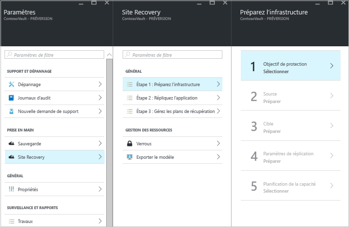
3. Dans la zone **Protection goal (Objectif de la protection)**, sélectionnez **To Azure (Vers Azure)**, puis **Yes, with Hyper-V (Oui, avec Hyper-V)**. Sélectionnez **Oui** pour confirmer votre utilisation de VMM pour gérer les hôtes Hyper-V et le site de récupération. Cliquez ensuite sur **OK**.
   
    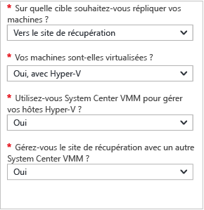

## Étape 2 : configurer l’environnement source
Installez le fournisseur Azure Site Recovery sur le serveur VMM et enregistrez ce dernier dans le coffre. Installez l’agent Azure Recovery Services sur les hôtes Hyper-V.

1. Cliquez sur **Étape 2 : Préparer l’infrastructure** > **Source**.
   
    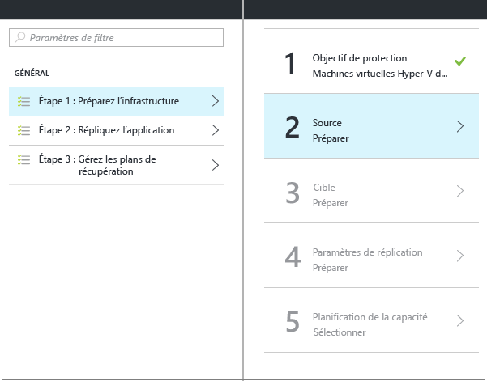
2. Dans **Préparer la source**, cliquez sur **+ VMM** pour ajouter un serveur VMM.
   
    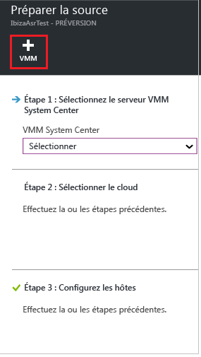
3. Dans le panneau **Ajouter un serveur**, vérifiez que **Serveur System Center VMM** s’affiche dans le champ **Type de serveur** et que le serveur VMM répond à la [configuration requise et aux exigences concernant les URL](#on-premises-prerequisites).
4. Téléchargez le fichier d’installation du fournisseur Azure Site Recovery.
5. Téléchargez la clé d’inscription. Vous en aurez besoin lorsque vous exécuterez le programme d’installation. Une fois générée, la clé reste valide pendant 5 jours.
   
    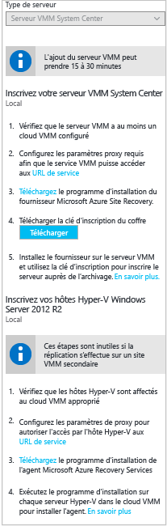
6. Installez le fournisseur Azure Site Recovery sur le serveur VMM.

### Configurer le fournisseur Azure Site Recovery
1. Exécutez le fichier de configuration du fournisseur.
2. Dans **Microsoft Update**, vous pouvez choisir des mises à jour, pour que celles du fournisseur soient installées conformément à votre stratégie Microsoft Update.
3. Dans le champ **Installation**, acceptez ou modifiez l’emplacement d’installation du fournisseur par défaut et cliquez sur **Installer**.
   
    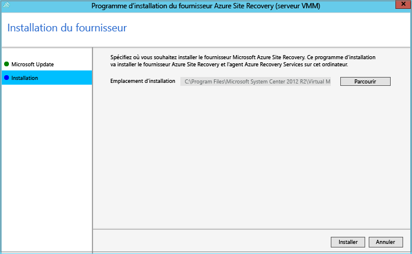
4. Une fois l’installation terminée, cliquez sur **Inscrire** pour inscrire le serveur VMM dans le coffre.
5. Dans la page **Paramètres du coffre**, cliquez sur **Parcourir** pour sélectionner le fichier de clé du coffre. Spécifiez l’abonnement Azure Site Recovery et le nom du coffre.
   
    
6. Dans **Connexion Internet**, indiquez le mode de connexion à Site Recovery du fournisseur exécuté sur le serveur VMM, via Internet.
   
   * Si vous voulez que le fournisseur se connecte directement, sélectionnez **Se connecter directement à Azure Site Recovery sans serveur proxy**.
   * Si votre proxy nécessite une authentification ou si vous voulez utiliser un proxy personnalisé, sélectionnez **Se connecter directement à Azure Site Recovery avec un serveur proxy**.
   * Si vous utilisez un proxy personnalisé, spécifiez l’adresse, le port et les informations d’identification.
   * Si vous utilisez un proxy, vous devez avoir déjà autorisé les URL indiquées dans la section relative à la [configuration requise](#on-premises-prerequisites).
   * Si vous utilisez un proxy personnalisé, un compte RunAs VMM (DRAProxyAccount) est créé automatiquement avec les informations d’identification du proxy spécifiées. Configurez le serveur proxy pour que ce compte puisse s'authentifier correctement. Vous pouvez modifier les paramètres du compte RunAs VMM dans la console VMM. Dans **Paramètres**, développez **Sécurité** > **Comptes d’identification**, puis modifiez le mot de passe de DRAProxyAccount. Vous devez redémarrer le service VMM pour que ce paramètre prenne effet.
     
     
7. Vous pouvez accepter ou modifier l’emplacement d’un certificat SSL généré automatiquement pour le chiffrement de données. Ce certificat est utilisé si vous activez le chiffrement de données pour un cloud protégé par Azure dans le portail Azure Site Recovery. Conservez ce certificat en sécurité. Lorsque vous exécuterez un basculement vers Azure, vous en aurez besoin pour le déchiffrement (si le chiffrement des données est activé).
8. Dans **Server name**, entrez un nom convivial pour identifier le serveur VMM dans le coffre. Dans une configuration de cluster, spécifiez le nom de rôle de cluster VMM.
9. Si vous souhaitez synchroniser les métadonnées de l’ensemble des clouds sur le serveur VMM avec le coffre, activez l’option **Synchroniser les métadonnées du cloud**. Cette action se produit une seule fois sur chaque serveur. Si vous ne souhaitez pas synchroniser tous les clouds, vous pouvez désactiver ce paramètre et synchroniser individuellement chaque cloud via les propriétés du cloud de la console VMM. Cliquez sur **Register** pour terminer le processus.
   
    
10. L’inscription débute. Une fois l’inscription terminée, le serveur s’affiche sur le panneau **Paramètres** > **Serveurs** du coffre.

#### Installation du fournisseur Azure Site Recovery via la ligne de commande
Le fournisseur Azure Site Recovery peut être installé à partir de la ligne de commande. Vous pouvez utiliser cette méthode pour installer le fournisseur sur un module Server Core pour Windows Server 2012 R2.

1. Téléchargez le fichier d’installation du fournisseur et la clé d’inscription dans un dossier, par exemple, C:\ASR.
2. À partir d’une invite de commandes avec élévation de privilèges, exécutez les commandes suivantes pour extraire le programme d’installation du fournisseur :
   
            C:\Windows\System32> CD C:\ASR
            C:\ASR> AzureSiteRecoveryProvider.exe /x:. /q
3. Exécutez cette commande pour installer les composants :
   
            C:\ASR> setupdr.exe /i
4. Ensuite, exécutez les commandes suivantes pour inscrire le serveur dans le coffre :
   
        CD C:\Program Files\Microsoft System Center 2012 R2\Virtual Machine Manager\bin
        C:\Program Files\Microsoft System Center 2012 R2\Virtual Machine Manager\bin\> DRConfigurator.exe /r  /Friendlyname <friendly name of the server> /Credentials <path of the credentials file> /EncryptionEnabled <full file name to save the encryption certificate>       

Où :

* **/Credentials**: paramètre obligatoire qui spécifie l’emplacement du fichier de clé d’inscription.  
* **/FriendlyName**: paramètre obligatoire qui correspond au nom du serveur hôte Hyper-V qui s’affiche dans le portail Azure Site Recovery.
* * **/EncryptionEnabled**: paramètre facultatif utilisé lorsque vous répliquez des machines virtuelles Hyper-V dans des clouds VMM sur Azure. Spécifiez si vous souhaitez chiffrer les machines virtuelles dans Azure (chiffrement au repos). Vérifiez que le nom du fichier porte l’extension **.pfx** . Par défaut, le chiffrement est désactivé
* **/proxyAddress**: paramètre facultatif qui spécifie l’adresse du serveur proxy.
* **/proxyport**: paramètre facultatif qui spécifie le port du serveur proxy.
* **/proxyUsername**: paramètre facultatif qui spécifie le nom d’utilisateur proxy (si le proxy nécessite une authentification).
* **/proxyPassword**: paramètre facultatif qui spécifie le mot de passe à utiliser pour l’authentification auprès du serveur proxy (si le proxy nécessite une authentification).

### Installation de l’agent Azure Recovery Services sur des hôtes Hyper-V
1. Une fois le fournisseur configuré, vous devez télécharger le fichier d’installation de l’agent Azure Recovery Services. Exécutez le programme d’installation sur chaque serveur Hyper-V dans le cloud VMM.
   
    
2. Sous **Vérification de la configuration requise**, cliquez sur **Suivant**. Tous les éléments manquants de la configuration requise sont automatiquement installés.
   
    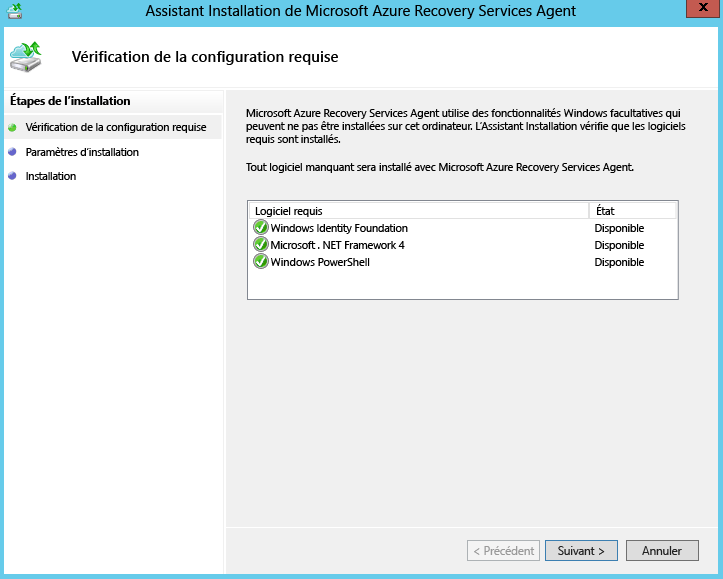
3. Sous **Paramètres d’installation**, acceptez ou modifiez l’emplacement d’installation et l’emplacement du cache. Vous pouvez configurer le cache sur un lecteur qui dispose d’au moins 5 Go de stockage disponible. Toutefois, nous vous recommandons d’utiliser un lecteur de cache présentant au moins 600 Go d’espace disponible. Cliquez ensuite sur **Installer**.
4. Une fois l’installation terminée, cliquez sur **Fermer** pour finaliser le processus.
   
    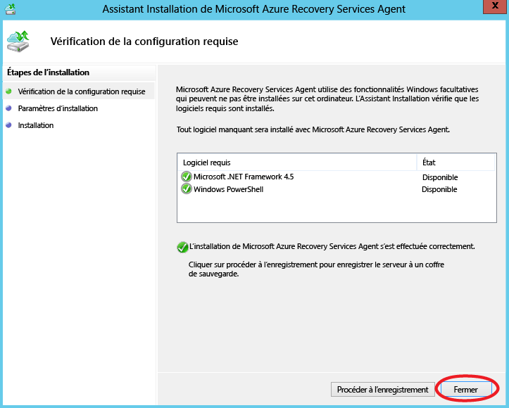

#### Installation de l’agent Azure Site Recovery Services via la ligne de commande
Vous pouvez installer cet agent à partir de la ligne de commande, en saisissant la commande suivante :

     marsagentinstaller.exe /q /nu

#### Configuration de l’accès proxy à Site Recovery via Internet à partir d’hôtes Hyper-V
L’agent Recovery Services exécuté sur les hôtes Hyper-V requiert un accès à Azure, via Internet, pour la réplication des machines virtuelles. Si vous accédez à Internet via un proxy, configurez-le comme suit :

1. Ouvrez le composant logiciel enfichable MMC de Microsoft Azure Backup sur l’hôte Hyper-V. Par défaut, un raccourci vers Microsoft Azure Backup est créé sur le Bureau. Vous pouvez également le trouver ici : C:\Program Files\Microsoft Azure Recovery Services Agent\bin\wabadmin.
2. Dans le composant logiciel enfichable, cliquez sur **Modifier les propriétés**.
3. Dans l’onglet **Configuration du proxy** , spécifiez les informations du serveur proxy.
   
    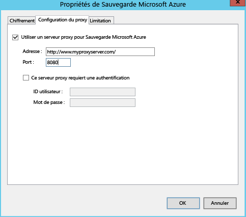
4. Vérifiez que l’agent peut atteindre les URL décrites dans la section [Configuration requise](#on-premises-prerequisites).

## Étape 3 : configurer l’environnement cible
Spécifiez le compte Azure Storage à utiliser pour la réplication, ainsi que le réseau Azure auquel les machines virtuelles Azure se connecteront après le basculement.

1. Cliquez sur **Préparer l’infrastructure** > **Cible** et sélectionnez l’abonnement Azure à utiliser.
2. Spécifiez le modèle de déploiement que vous souhaitez utiliser pour les machines virtuelles après le basculement.
3. Site Recovery vérifie que vous disposez d’un ou de plusieurs réseaux et comptes Azure Storage compatibles.
   
   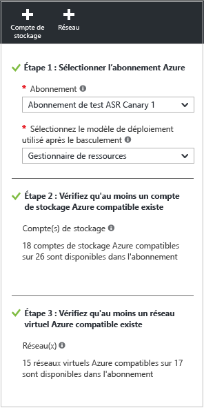
4. Si vous n’avez pas créé de compte de stockage et que vous souhaitez le faire à l’aide de Resource Manager, cliquez sur **+Compte de stockage** pour effectuer l’opération en ligne.  Dans le panneau **Créer un compte de stockage** , saisissez le nom, le type, l’abonnement associé et l’emplacement du compte de stockage. Ce compte doit se trouver au même emplacement que le coffre Recovery Services.
   
   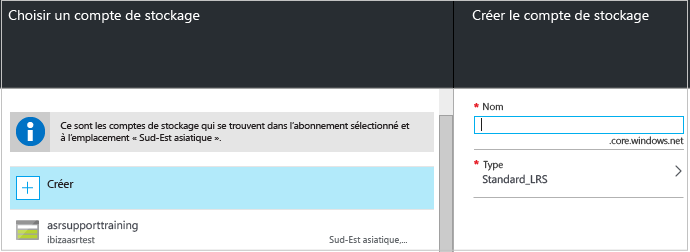
   
   Notez les points suivants :
   
   * Si vous souhaitez créer un compte de stockage en mode Classic, vous pouvez le faire dans le Portail Azure. [En savoir plus](../storage/storage-create-storage-account-classic-portal.md)
   * Si vous utilisez un compte de stockage Premium pour les données répliquées, configurez un compte de stockage standard supplémentaire, afin de stocker les journaux de réplication qui capturent les modifications apportées en continu aux données locales.
5. Si vous n’avez pas créé de réseau Azure et que vous souhaitez le faire avec Azure Resource Manager, cliquez sur **+Réseau** afin d’effectuer l’opération en ligne. Dans le panneau **Créer un réseau virtuel** , spécifiez le nom, la plage d’adresses, les informations sur le sous-réseau associé, l’abonnement et l’emplacement du réseau virtuel. Ce réseau doit se trouver au même emplacement que le coffre Recovery Services.
   
   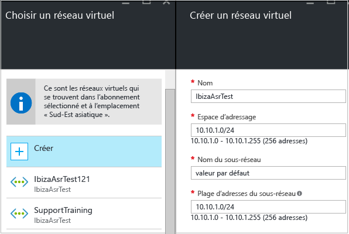
   
   Si vous souhaitez créer un réseau en suivant le modèle classique, utilisez le Portail Azure. [En savoir plus](../virtual-network/virtual-networks-create-vnet-classic-pportal.md).

### configurer le mappage réseau
* [Lisez](#prepare-for-network-mapping) une présentation rapide du mappage réseau. [ce document](site-recovery-network-mapping.md) .
* Vérifiez que les machines virtuelles se trouvant sur le serveur VMM sont connectées à un réseau de machines virtuelles et que vous avez créé au moins un réseau virtuel Azure. Plusieurs réseaux de machines virtuelles peuvent être mappés au même réseau Azure.

Configurez le mappage comme suit :

1. Dans **Paramètres** > **Infrastructure Site Recovery** > **Mappages réseau** > **Mappage réseau**, cliquez sur l’icône **+Mappage réseau**.
   
    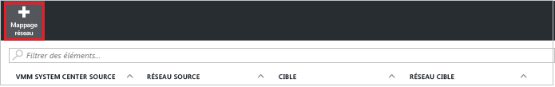
2. Dans la zone **Ajouter un mappage réseau**, sélectionnez le serveur VMM source et choisissez **Azure** comme cible.
3. Vérifiez l’abonnement et le modèle de déploiement après le basculement.
4. Dans **Réseau source**, choisissez le réseau de machines virtuelles local source à mapper à partir de la liste associée au serveur VMM.
5. Dans **Réseau cible**, choisissez le réseau Azure dans lequel les machines virtuelles réplica Azure se trouveront, une fois créées. Cliquez ensuite sur **OK**.
   
    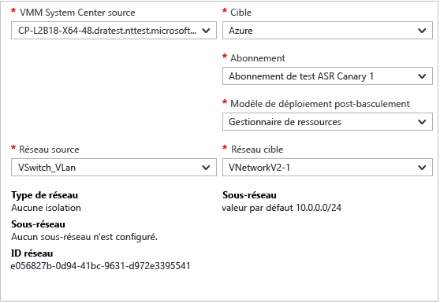

Voici le processus exécuté lorsque le mappage réseau démarre :

* Les machines virtuelles qui existent dans le réseau de machines virtuelles source sont connectées au réseau cible, lorsque le mappage commence. Les nouvelles machines virtuelles connectées au réseau de machines virtuelles source sont connectées au réseau Azure mappé, lors de la réplication.
* Si vous modifiez un mappage réseau existant, les machines virtuelles de réplication se connectent à l’aide des nouveaux paramètres.
* Si le réseau cible est associé à plusieurs sous-réseaux et que l’un d’eux présente le même nom que le sous-réseau dans lequel se trouve la machine virtuelle source, la machine virtuelle de réplication se connecte à ce sous-réseau cible après le basculement.
* S’il n’existe aucun sous-réseau cible avec un nom correspondant, la machine virtuelle se connecte au premier sous-réseau du réseau.

## Étape 4 : configurer les paramètres de réplication
1. Pour créer une stratégie de réplication, cliquez sur **Préparer l’infrastructure** > **Paramètres de réplication** > **+Créer et associer**.
   
    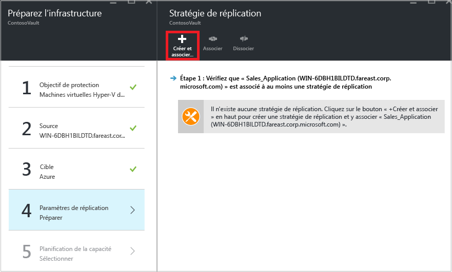
2. Dans **Créer et associer une stratégie**, indiquez le nom de la stratégie.
3. Dans **Fréquence de copie**, spécifiez la fréquence selon laquelle répliquer les données delta après la réplication initiale (toutes les 30 secondes ou toutes les 5 ou 15 minutes).
4. Dans **Rétention des points de récupération**, spécifiez la durée de la fenêtre de rétention pour chaque point de récupération (en heures). Les machines protégées peuvent être récupérées à tout moment pendant cette fenêtre temporelle.
5. Dans **Fréquence des captures instantanées cohérentes de l’application**, spécifiez la fréquence de création des points de récupération contenant des instantanés cohérents au niveau des applications (entre 1 et 12 heures). Hyper-V utilise deux types d’instantanés : un instantané standard qui fournit un instantané incrémentiel de la machine virtuelle complète et un instantané cohérent avec l'application qui prend un instantané des données d'application d'une machine virtuelle. Les instantanés cohérents avec l'application utilisent le service VSS (Volume Shadow Copy Service) pour s'assurer que les applications sont dans un état cohérent lors de la prise des instantanés. Notez que si vous activez les instantanés cohérents avec l'application, cela affectera les performances des applications exécutées sur les machines virtuelles sources. Assurez-vous que la valeur définie est inférieure au nombre de points de récupération supplémentaires que vous configurez.
6. Dans **Heure de début de la réplication initiale**, indiquez à quel moment démarrer la réplication initiale. La réplication se produit via votre bande passante Internet. Il est donc préférable de prévoir son exécution en dehors des heures de bureau.
7. Dans **Chiffrer les données stockées sur Azure**, indiquez si les données au repos doivent être chiffrées dans Azure Storage. Cliquez ensuite sur **OK**.
   
    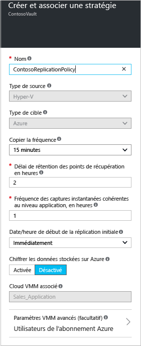
8. Lorsque vous créez une stratégie, elle est automatiquement associée au cloud VMM. Cliquez sur **OK**. Vous pouvez associer des clouds VMM supplémentaires (ainsi que les machines virtuelles qu’ils contiennent) à cette stratégie de réplication en cliquant sur **Paramètres** > **Réplication** > nom de la stratégie > **Associate VMM Cloud** (Associer un cloud VMM).
   
    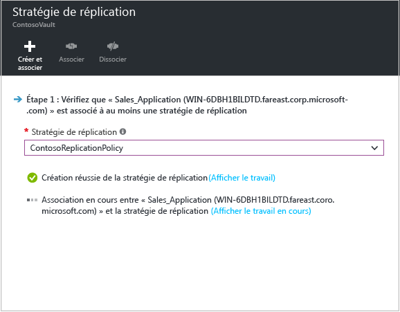

## Étape 5 : planifier la capacité
Votre infrastructure de base est désormais configurée. Vous pouvez donc réfléchir à la planification de la capacité et déterminer si des ressources supplémentaires sont nécessaires.

Site Recovery propose une fonctionnalité, Capacity Planner, qui vous permet d’allouer les bonnes ressources pour l’environnement source, les composants de récupération de sites, la mise en réseau et le stockage. Vous pouvez exécuter Capacity Planner en mode rapide, afin d’obtenir une estimation basée sur le nombre moyen de machines virtuelles et de disques ainsi que sur l’espace de stockage disponible, ou en mode détaillé. Dans ce mode, vous saisissez des chiffres au niveau des charges de travail. Avant de commencer :

* collecter les informations relatives à votre environnement de réplication, notamment les machines virtuelles, le nombre de disques par machine virtuelle et le stockage par disque ;
* déterminer le taux de modification (l’évolution) quotidienne des données répliquées. Pour cela, vous pouvez utiliser la fonction [Capacity Planner pour réplica Hyper-V](https://www.microsoft.com/download/details.aspx?id=39057) .

1. Cliquez sur **Télécharger** pour télécharger l’outil, puis exécutez-le. [Lisez l’article](site-recovery-capacity-planner.md) relatif à cet outil.
2. Quand vous avez terminé, sélectionnez **Oui** sous **Have you run the Capacity Planner?** (Avez-vous exécuté Capacity Planner ?)
   
   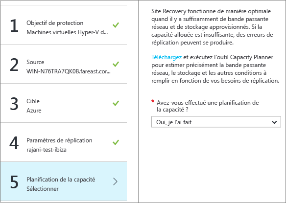

### Remarques relatives à la bande passante réseau
Vous pouvez utiliser l’outil Capacity Planner pour calculer la bande passante requise par la réplication (réplication initiale, puis delta). Vous disposez de plusieurs options pour déterminer la quantité de bande passante utilisée pour la réplication :

* **Limite de bande passante**: le trafic Hyper-V qui est répliqué sur un site secondaire transite par un hôte Hyper-V spécifique. Vous pouvez limiter la bande passante sur le serveur hôte.
* **Ajustement de la bande passante**: vous pouvez influencer la bande passante utilisée pour la réplication à l’aide de quelques clés de Registre.

#### Limiter la bande passante
1. Ouvrez le composant logiciel enfichable MMC de Microsoft Azure Backup sur le serveur hôte Hyper-V. Par défaut, un raccourci vers Microsoft Azure Backup est créé sur le Bureau. Vous pouvez également le trouver ici : C:\Program Files\Microsoft Azure Recovery Services Agent\bin\wabadmin.
2. Dans le composant logiciel enfichable, cliquez sur **Modifier les propriétés**.
3. Dans l’onglet **Limitation**, sélectionnez **Activer la limitation de la bande passante sur Internet pour les opérations de sauvegarde** et définissez les limites relatives aux heures de travail et aux heures non travaillées. Les plages valides vont de 512 Kbits/s à 102 Mbits/s par seconde.
   
    

Vous pouvez également utiliser l’applet de commande [Set-OBMachineSetting](https://technet.microsoft.com/library/hh770409.aspx) pour définir la limitation. Voici un exemple :

    $mon = [System.DayOfWeek]::Monday
    $tue = [System.DayOfWeek]::Tuesday
    Set-OBMachineSetting -WorkDay $mon, $tue -StartWorkHour "9:00:00" -EndWorkHour "18:00:00" -WorkHourBandwidth  (512*1024) -NonWorkHourBandwidth (2048*1024)

**Set-OBMachineSetting -NoThrottle** indique qu’aucune limitation n’est requise.

#### Influer sur la bande passante réseau
La valeur de registre **UploadThreadsPerVM** détermine le nombre de threads utilisés pour le transfert des données (réplication initiale ou delta) sur un disque. Une valeur plus élevée permet d’augmenter la bande passante réseau utilisée pour la réplication. La valeur de registre **DownloadThreadsPerVM** indique le nombre de threads utilisés pour le transfert de données lors de la restauration automatique.

1. Dans le registre, accédez à **HKEY_LOCAL_MACHINE\SOFTWARE\Microsoft\Windows Azure Backup\Replication**.
   
   * Modifiez la valeur de **UploadThreadsPerVM** (ou créez la clé si elle n’existe pas) afin de contrôler les threads utilisés pour la réplication de disque.
   * Modifiez la valeur de **UploadThreadsPerVM** (ou créez la clé si elle n’existe pas) afin de contrôler les threads utilisés pour le trafic de restauration automatique provenant d’Azure.
2. La valeur par défaut est 4. Dans un réseau « surutilisé », ces clés de Registre doivent être modifiées par rapport aux valeurs par défaut. La valeur maximale est de 32. Surveillez le trafic pour optimiser la valeur.

## Étape 6 : activer la réplication
À présent, activez la réplication comme suit :

1. Cliquez sur **Étape 2 : Répliquer l’application** > **Source**. Après avoir activé la réplication pour la première fois, cliquez sur l’option **+Répliquer** dans le coffre pour activer la réplication des autres machines.
   
    
2. Dans le panneau **Source**, sélectionnez le serveur VMM et le cloud hébergeant les hôtes Hyper-V. Cliquez ensuite sur **OK**.
   
    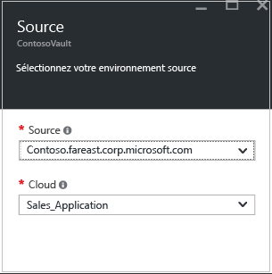
3. Dans **Cible**, sélectionnez l’abonnement, le modèle de déploiement suite au basculement et le compte de stockage utilisé pour les données répliquées.
   
    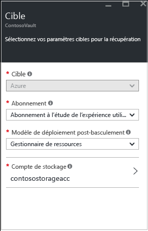
4. Sélectionnez le compte de stockage que vous souhaitez utiliser. Si vous souhaitez utiliser un compte de stockage différent de ceux dont vous disposez, vous pouvez en [créer un](#set-up-an-azure-storage-account). Pour créer un compte de stockage en mode Resource Manager, cliquez sur **Créer**. Si vous souhaitez créer un compte de stockage en mode Classic, vous pouvez le faire [dans le Portail Azure](../storage/storage-create-storage-account-classic-portal.md). Cliquez ensuite sur **OK**.
5. Sélectionnez le sous-réseau et le réseau Azure auxquels les machines virtuelles Azure se connectent lorsqu’elles sont créées après le basculement. Sélectionnez **Effectuez maintenant la configuration pour les machines sélectionnées** pour appliquer le paramètre réseau à l’ensemble des machines que vous sélectionnez à des fins de protection. Sélectionnez **Configurer ultérieurement** pour sélectionner le réseau Azure pour chaque machine. Si vous souhaitez utiliser un réseau différent de ceux dont vous disposez, [créez-le](#set-up-an-azure-network). Pour créer un réseau en mode Resource Manager, cliquez sur **Créer**. Si vous souhaitez créer un réseau en suivant le modèle classique, utilisez le [Portail Azure](../virtual-network/virtual-networks-create-vnet-classic-pportal.md). Sélectionnez un sous-réseau, le cas échéant. Cliquez ensuite sur **OK**.
6. Dans **Machines virtuelles** > **Sélectionner les machines virtuelles**, cliquez sur chaque machine à répliquer. Vous pouvez uniquement sélectionner les machines pour lesquelles la réplication peut être activée. Cliquez ensuite sur **OK**.
   
    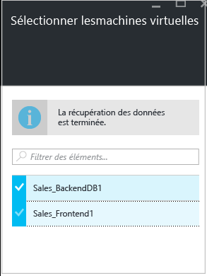
7. Dans **Propriétés** > **Configurer les propriétés**, choisissez le système d’exploitation des machines virtuelles sélectionnées, ainsi que le disque du système d’exploitation. Cliquez ensuite sur **OK**. Vous pouvez opter pour une définition ultérieure des propriétés.
   
    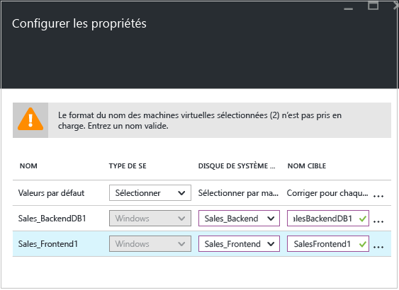
8. Dans **Paramètres de réplication** > **Configurer les paramètres de réplication**, sélectionnez la stratégie de réplication que vous souhaitez appliquer aux machines virtuelles protégées. Cliquez ensuite sur **OK**. Vous pouvez modifier la stratégie de réplication dans **Paramètres** > **Stratégies de réplication** > nom de la stratégie > **Modifier les paramètres**. Les modifications appliquées sont utilisées pour les nouvelles machines et celles dont la réplication est en cours.
   
   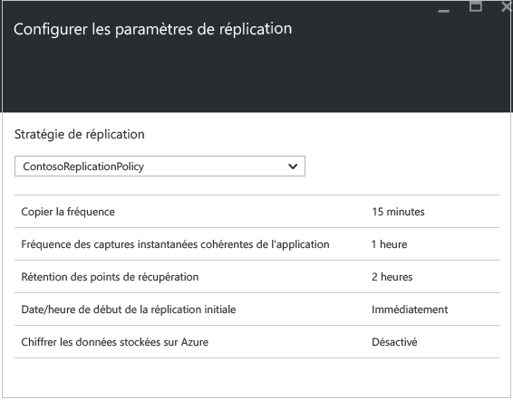

Vous pouvez suivre la progression du travail **Activer la protection** dans **Paramètres** > **Travaux** > **Travaux Site Recovery**. Une fois le travail **Finaliser la protection** exécuté, la machine est prête pour le basculement.

### Afficher et gérer les propriétés des machines virtuelles
Nous vous recommandons de vérifier les propriétés de la machine source. N’oubliez pas que le nom de la machine virtuelle Azure doit respecter la [configuration requise pour les machines virtuelles Azure](site-recovery-best-practices.md#azure-virtual-machine-requirements).

1. Cliquez sur **Paramètres** > **Éléments protégés** > **Éléments répliqués** et sélectionnez la machine dont vous souhaitez afficher les détails.
   
    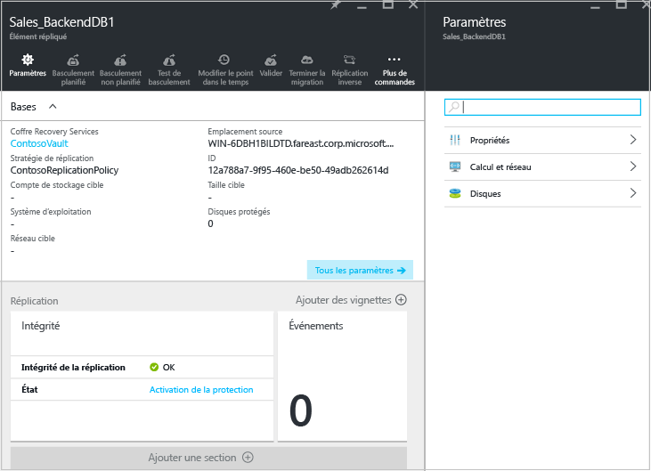
2. Dans **Propriétés**, vous pouvez afficher les informations sur la réplication et le basculement de la machine virtuelle.
   
    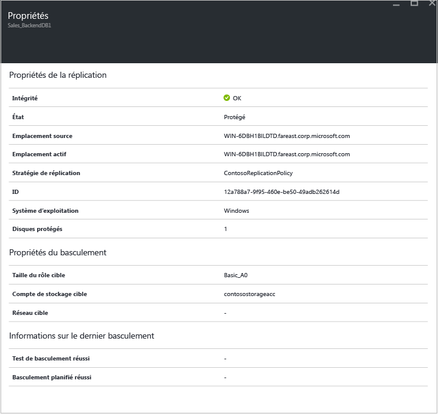
3. Dans **Calcul et réseau** > **Propriétés de calcul**, vous pouvez spécifier la taille de la cible et le nom de la machine virtuelle Azure. Au besoin, modifiez ce nom en fonction de la [configuration Azure requise](site-recovery-best-practices.md#azure-virtual-machine-requirements) . Vous pouvez également afficher et modifier les informations concernant le réseau cible, le sous-réseau et l’adresse IP qui sont affectés à la machine virtuelle Azure. Notez les points suivants :
   
   * Vous pouvez définir l’adresse IP cible. Si vous ne fournissez pas d’adresse IP, la machine ayant basculé utilisera le service DHCP. Si vous définissez une adresse qui n’est pas disponible au moment du basculement, ce dernier échoue. Vous pouvez utiliser la même adresse IP cible pour le test de basculement si cette adresse est disponible sur le réseau de test de basculement.
   * Le nombre de cartes réseau est déterminé par la taille spécifiée pour la machine virtuelle cible, comme suit :
     
     * Si le nombre de cartes réseau sur la machine source est inférieur ou égal au nombre de cartes autorisé pour la taille de la machine cible, la cible présente le même nombre de cartes que la source.
     * Si le nombre de cartes de la machine virtuelle source dépasse la taille cible autorisée, la taille cible maximale est utilisée.
     * Par exemple, si une machine source présente deux cartes réseau et que la taille de la machine cible en accepte quatre, la machine cible présentera deux cartes. Si la machine source inclut deux cartes, mais que la taille cible prise en charge accepte une seule carte, la machine cible présentera une seule carte.     
     * Si la machine virtuelle possède plusieurs cartes réseau, elles se connectent toutes au même réseau.
     
     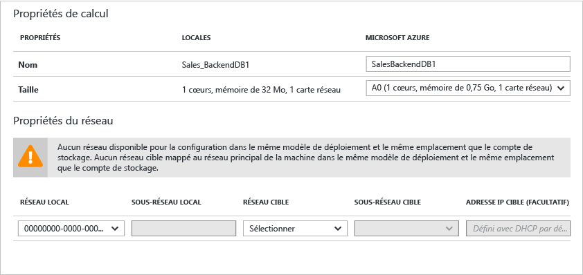
4. Les disques de données et du système d’exploitation de la machine virtuelle qui seront répliqués s’affichent dans **Disques** .

## Étape 7 : tester votre déploiement
Pour tester le déploiement, vous pouvez exécuter un test de basculement pour une seule machine virtuelle, ou un plan de récupération qui contient une ou plusieurs machines virtuelles.

### Préparer un basculement
* Pour exécuter un test de basculement, nous vous recommandons de créer un réseau Azure isolé de votre réseau de production Azure. Il s’agit du comportement par défaut lorsque vous créez un réseau dans Azure. [En savoir plus](site-recovery-failover.md#run-a-test-failover) .
* Pour obtenir les meilleures performances possibles lorsque vous effectuez un basculement vers Azure, assurez-vous que vous avez installé l’agent Azure sur l’ordinateur protégé. Cet agent permet de démarrer le système plus rapidement et facilite le dépannage. Installez l’agent [Linux](https://github.com/Azure/WALinuxAgent) ou [Windows](http://go.microsoft.com/fwlink/?LinkID=394789).
* Pour tester entièrement votre déploiement, vous avez besoin d’une infrastructure pour permettre à la machine répliquée de fonctionner comme prévu. Si vous souhaitez tester Active Directory et DNS, vous pouvez créer une machine virtuelle jouant le rôle de contrôleur de domaine avec DNS, puis la répliquer sur Azure, via Azure Site Recovery. Pour en savoir plus, lisez [Considérations en matière de test de basculement pour Active Directory](site-recovery-active-directory.md#considerations-for-test-failover).
* Si vous souhaitez exécuter un basculement non planifié au lieu d’un test de basculement, notez les éléments suivants :
  
  * Il est préférable d’arrêter les machines principales avant d’exécuter un basculement non planifié lorsque c’est possible. Vous êtes ainsi sûr que les machines source et les réplicas ne fonctionnent pas en même temps.
  * Lorsque vous effectuez un basculement non planifié, la réplication des données depuis les machines principales s’arrête et les différences dans les données ne sont pas transférées après qu’un basculement non planifié a commencé. En outre, si vous exécutez un basculement non planifié sur un plan de récupération, il sera exécuté jusqu’à la fin, même si une erreur se produit.

### Préparer la connexion aux machines virtuelles Azure après le basculement
Si vous souhaitez vous connecter à des machines virtuelles Azure à l’aide de RDP après le basculement, assurez-vous que vous effectuez les opérations suivantes :

**Sur la machine locale, avant le basculement**:

* Pour permettre l’accès par Internet, activez la fonction RDP, vérifiez que les règles TCP et UDP sont ajoutées pour **Public** et assurez-vous que RDP est autorisé dans le champ **Pare-feu Windows** -> **Applications et fonctionnalités autorisées** et ce, pour tous les profils.
* Pour permettre l’accès via une connexion site à site, activez RDP sur la machine, en vérifiant que ce dernier est autorisé dans le champ **Pare-feu Windows** -> **Applications et fonctionnalités autorisées** pour les réseaux de types **Domaine** et **Privé**.
* Installez [l’agent Azure VM](http://go.microsoft.com/fwlink/?LinkID=394789&clcid=0x409) sur la machine locale.
* Vérifiez que la stratégie SAN du système d’exploitation est définie sur la valeur OnlineAll. [En savoir plus](https://support.microsoft.com/kb/3031135)
* Désactivez le service IPSec avant d’exécuter le basculement.

**Sur la machine virtuelle Azure, après le basculement**:

* Ajoutez un point de terminaison public pour le protocole RDP (port 3389) et spécifiez les informations d’identification pour la connexion.
* Assurez-vous qu’aucune de vos stratégies de domaine ne vous empêche de vous connecter à une machine virtuelle avec une adresse publique.
* Essayez de vous connecter. Si vous ne pouvez pas vous connecter, vérifiez que la machine virtuelle fonctionne. Pour accéder à d’autres conseils de dépannage, lisez [cet article](http://social.technet.microsoft.com/wiki/contents/articles/31666.troubleshooting-remote-desktop-connection-after-failover-using-asr.aspx).

Si vous souhaitez accéder à une machine virtuelle Azure exécutant Linux après le basculement à l’aide d’un client Secure Shell (ssh), procédez comme suit :

**Sur la machine locale, avant le basculement**:

* Assurez-vous que le service Secure Shell, sur la machine virtuelle Azure, est défini pour démarrer automatiquement au démarrage du système.
* Vérifiez que les règles de pare-feu autorisent une connexion SSH à ce dernier.

**Sur la machine virtuelle Azure, après le basculement**:

* Les règles des groupes de sécurité réseau figurant sur la machine virtuelle basculée et le sous-réseau Azure auquel elle est connectée doivent autoriser les connexions entrantes avec le port SSH.
* Un point de terminaison public doit être créé pour autoriser les connexions entrantes sur le port SSH (port TCP 22 par défaut).
* Si la machine virtuelle est accessible via une connexion VPN (Express Route ou VPN de site à site), vous pouvez utiliser le client pour vous connecter directement à la machine virtuelle via SSH.

### Exécution d’un test de basculement
1. Pour effectuer le basculement d’une seule machine virtuelle, dans **Paramètres** > **Éléments répliqués**, cliquez sur la machine virtuelle, puis sur **+Test de basculement**.
2. Pour effectuer le basculement d’un plan de récupération, dans **Paramètres** > **Plans de récupération**, cliquez avec le bouton droit sur le plan et sélectionnez **Test de basculement**. Pour créer un plan de récupération, suivez [ces instructions](site-recovery-create-recovery-plans.md).
3. Dans **Test de basculement**, sélectionnez le réseau Azure auquel les machines virtuelles Azure se connectent après le basculement.
4. Cliquez sur **OK** pour commencer le basculement. Vous pouvez suivre la progression du basculement en cliquant sur la machine virtuelle pour ouvrir ses propriétés, ou en sélectionnant la tâche **Test de basculement** dans **Paramètres** > **Travaux Site Recovery**.
5. Lorsque le basculement atteint la phase **Terminer le test** , procédez comme suit :
   
   1. Examinez la machine virtuelle de réplication dans le portail Microsoft Azure. Vérifiez que la machine virtuelle démarre correctement.
   2. Si vous êtes autorisé à accéder aux machines virtuelles à partir de votre réseau local, vous pouvez initier une connexion Bureau à distance à la machine virtuelle.
   3. Cliquez sur **Terminer le test** pour finir l’opération.
   4. Cliquez sur **Notes** pour consigner et enregistrer les éventuelles observations associées au test de basculement.
   5. Cliquez sur **Le test de basculement est terminé**. Nettoyez l’environnement de test pour mettre automatiquement hors tension et supprimer la machine virtuelle de test.
   6. À cette étape, les éléments ou machines virtuelles créés automatiquement par Site Recovery lors du test de basculement sont supprimés. Toutefois, les éléments supplémentaires que vous avez créés pour le test de basculement ne sont pas supprimés.
      
      > [!NOTE]
      > Si un test de basculement s’étend sur plus de deux semaines, le système le force à se terminer.
      > 
      > 
6. Une fois le basculement terminé, vous devez également voir la machine Azure de réplication apparaître dans le Portail Azure > **Machines virtuelles**. Vous devrez vous assurer que la machine virtuelle présente la taille appropriée, qu’elle est bien connectée au réseau approprié et qu’elle s’exécute.
7. Si vous avez [préparé les connexions après le basculement](#prepare-to-connect-to-Azure-VMs-after-failover), vous devez être à même de vous connecter à la machine virtuelle Azure.

## Surveiller votre déploiement
Voici comment vous pouvez surveiller l’intégrité, l’état et les paramètres de configuration de votre déploiement Site Recovery :

1. Cliquez sur le nom du coffre pour accéder au tableau de bord **Essentials** . Ce tableau affiche l’état de la réplication, les tâches, les plans de récupération, l’intégrité du serveur et les événements Site Recovery.  Vous pouvez personnaliser **Essentials** de manière afficher les vignettes et les dispositions qui sont les plus utiles, y compris l’état des autres coffres Site Recovery et Backup.
   
    
2. Dans la mosaïque **Intégrité**, vous pouvez surveiller les problèmes affectant les serveurs du site (VMM ou serveurs de configuration), ainsi que les événements signalés par Site Recovery au cours des dernières 24 heures.
3. Vous pouvez gérer et surveiller la réplication dans les mosaïques **Éléments répliqués**, **Plans de récupération** et **Travaux Site Recovery**. Vous pouvez accéder au détail des travaux dans **Paramètres** > **Travaux** > **Travaux Site Recovery**.

## Étapes suivantes
Une fois votre déploiement configuré et effectué, pour en savoir plus sur les différents types de basculement, [cliquez ici](site-recovery-failover.md) .

<!--HONumber=Nov16_HO2-->

