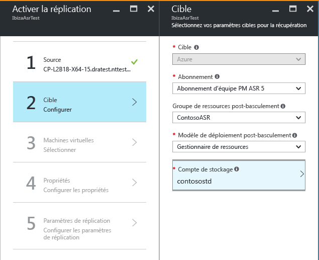
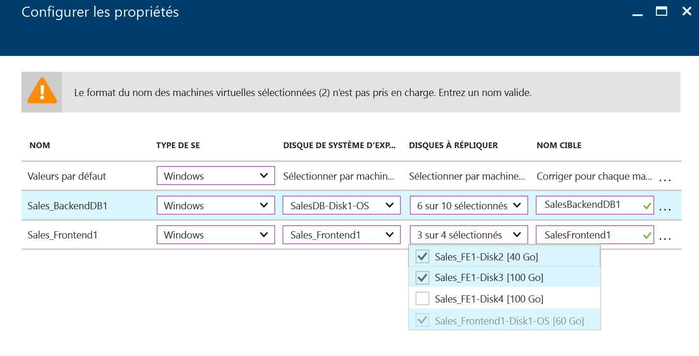

# Répliquer vers Azure des machines virtuelles Hyper-V hébergées dans des clouds VMM à l’aide de Site Recovery sur le Portail Azure
> [!div class="op_single_selector"]
> * [Portail Azure](site-recovery-vmm-to-azure.md)
> * [Portail Azure Classic](site-recovery-vmm-to-azure-classic.md)
> * [PowerShell Resource Manager](site-recovery-vmm-to-azure-powershell-resource-manager.md)
> * [PowerShell Classic](site-recovery-deploy-with-powershell.md)

Cet article explique comment répliquer des machines virtuelles Hyper-V locales gérées sur des clouds System Center VMM à l’aide du service [Azure Site Recovery](site-recovery-overview.md), sur le Portail Azure.

Après avoir lu cet article, publiez des commentaires au bas de ce dernier ou sur le [Forum Azure Recovery Services](https://social.msdn.microsoft.com/forums/azure/home?forum=hypervrecovmgr).

Si vous souhaitez migrer des ordinateurs vers Azure (sans restauration automatique), pour en savoir plus, lisez [cet article](site-recovery-migrate-to-azure.md).

## Étapes du déploiement

Suivez l’article pour effectuer les étapes de déploiement ci-dessous :

1. [En savoir plus](site-recovery-components.md#hyper-v-to-azure) sur l’architecture de ce déploiement. En outre, [découvrez](site-recovery-hyper-v-azure-architecture.md) le fonctionnement de la réplication Hyper-V dans Site Recovery.
2. Vérifiez les conditions préalables et les limitations.
3. Configurez des comptes de réseau et de stockage Azure.
4. Préparez le serveur VMM sur site et les hôtes Hyper-V.
5. Créez un coffre Recovery Services. Le coffre comporte les paramètres de configuration et orchestre la réplication.
6. Spécifiez les paramètres de la source. Inscrivez le serveur VMM auprès du coffre. Installez le fournisseur Azure Site Recovery sur le serveur VMM. Installez l’agent Microsoft Recovery Services sur les hôtes Hyper-V.
7. Configurez les paramètres de la cible et de réplication.
8. Activez la réplication des machines virtuelles.
9. Exécutez un test de basculement afin de vérifier que tout fonctionne bien.

## Conditions préalables

**Configuration requise pour la prise en charge** | **Détails**
--- | ---
**Microsoft Azure** | Découvrez la [configuration requise pour Azure](site-recovery-prereq.md#azure-requirements).
**Serveurs locaux** | [Découvrez](site-recovery-prereq.md#disaster-recovery-of-hyper-v-virtual-machines-in-virtual-machine-manager-clouds-to-azure) la configuration requise pour le serveur VMM en local et les hôtes Hyper-V.
**Machines virtuelles Hyper-V en local** | Les machines virtuelles que vous souhaitez répliquer doivent exécuter un [système d’exploitation pris en charge](site-recovery-support-matrix-to-azure.md#support-for-replicated-machine-os-versions) et être conformes aux [conditions préalables pour Azure](site-recovery-support-matrix-to-azure.md#failed-over-azure-vm-requirements).
**URL Azure** | Le serveur VMM doit également accéder à ces URL :   [!INCLUDE [site-recovery-URLS](../../includes/site-recovery-URLS.md)]   Si vous avez des règles de pare-feu fondées sur l’adresse IP, vérifiez qu’elles autorisent la communication vers Azure.   Autorisez les [plages d’adresses IP de centres de données Azure](https://www.microsoft.com/download/confirmation.aspx?id=41653) et le port HTTPS (443).   Autorisez les plages d’adresses IP relatives à la région de votre abonnement Azure et à la région des États-Unis de l’Ouest (utilisées pour la gestion du contrôle d’accès et des identités).

## Préparation du déploiement
Pour préparer un déploiement, vous devez :

1. [Configurer un réseau Azure](#set-up-an-azure-network) dans lequel les machines virtuelles Azure sont placées après un basculement.
2. [Configurer un compte de stockage Azure](#set-up-an-azure-storage-account) pour les données répliquées.
3. [Préparez le serveur VMM](#prepare-the-vmm-server) au déploiement de Site Recovery.
4. Préparez le mappage réseau. configurer des réseaux de sorte à pouvoir définir le mappage réseau lors du déploiement de Site Recovery.

### Configurer un réseau Azure
Vous devez avoir un réseau Azure, auquel les machines virtuelles Azure créées après le basculement se connecteront.

* Ce réseau doit se trouver dans la même région que le coffre Recovery Services.
* Selon le modèle de ressource que vous souhaitez utiliser pour les machines virtuelles Azure ayant fait l’objet d’un basculement, vous devez configurer le réseau Azure en [mode Azure Resource Manager](../virtual-network/virtual-networks-create-vnet-arm-pportal.md) ou en [mode Classic](../virtual-network/virtual-networks-create-vnet-classic-pportal.md).
* Nous vous recommandons de configurer un réseau avant de commencer. Sinon, vous devrez le faire lors du déploiement de Site Recovery.
Les réseaux Azure utilisés par Site Recovery ne peuvent pas être [déplacés](../azure-resource-manager/resource-group-move-resources.md), que ce soit dans le même abonnement ou dans des abonnements différents.

### Configurer un compte de stockage Azure
* Vous avez besoin d’un compte de stockage Azure Standard ou Premium pour accueillir les données répliquées sur Azure. Un [Stockage Premium](../storage/storage-premium-storage.md) est utilisé pour des machines virtuelles nécessitant en permanence des performances d’E/S élevées et une faible latence pour héberger des charges de travail consommatrices d’E/S. Si vous souhaitez utiliser un compte Premium pour stocker les données répliquées, vous avez aussi besoin d’un compte de stockage standard afin de stocker les journaux de réplication qui capturent les modifications apportées en continu aux données locales. Ce compte doit se trouver dans la même région que le coffre Recovery Services.
* Selon le modèle de ressource que vous souhaitez utiliser pour les machines virtuelles Azure ayant fait l’objet d’un basculement, vous allez configurer un compte en [mode Azure Resource Manager](../storage/storage-create-storage-account.md) ou en [mode Classic](../storage/storage-create-storage-account-classic-portal.md).
* Nous vous recommandons de configurer un compte avant de commencer. Sinon, vous devrez le faire lors du déploiement de Site Recovery.
- Notez que les comptes de stockage utilisés par Site Recovery ne peuvent pas être [déplacés](../azure-resource-manager/resource-group-move-resources.md), que ce soit dans le même abonnement ou dans des abonnements différents.

### Préparez le serveur VMM
* Assurez-vous que le serveur VMM respecte la [configuration requise](#prerequisites).
* Lors du déploiement de Site Recovery, vous pouvez indiquer que tous les clouds sur un serveur VMM doivent être disponibles dans le portail Azure. Si vous souhaitez n’afficher que certains clouds dans le portail, vous pouvez activer ce paramètre sur le cloud dans la console d’administration VMM.

### Préparer le mappage réseau
Vous devez configurer le mappage réseau lors du déploiement de Site Recovery. La fonction de mappage réseau effectue le mappage entre les réseaux de machines virtuelles VMM et les réseaux Azure cibles, afin de permettre les opérations suivantes :

* Les machines qui basculent sur le même réseau peuvent se connecter entre elles, même si elles ne sont pas basculées de la même façon ou dans le cadre du même plan de récupération.
* Si une passerelle réseau est configurée sur le réseau Azure cible, les machines virtuelles Azure peuvent se connecter à des machines virtuelles locales.
* Pour configurer le mappage réseau, voici les éléments dont vous avez besoin :

  * Assurez-vous que l’ensemble des machines virtuelles du serveur hôte Hyper-V source sont connectées à un réseau de machines virtuelles VMM. Ce réseau doit être lié à un réseau logique lui-même associé au cloud.
  * Un réseau Azure, comme décrit [ci-dessus](#set-up-an-azure-network)

## Créer un coffre Recovery Services
1. Connectez-vous au [portail Azure](https://portal.azure.com).
2. Cliquez sur **Nouveau** > **Surveillance + gestion** > **Sauvegarde et Site Recovery (OMS)**.

    
3. Dans **Nom**, indiquez un nom convivial permettant d’identifier le coffre. Si vous avez plusieurs abonnements, sélectionnez-en un.
4. [Créez un groupe de ressources](../azure-resource-manager/resource-group-template-deploy-portal.md)ou sélectionnez-en un. Spécifiez une région Azure. Les machines seront répliquées dans cette région. Pour découvrir les régions prises en charge, référez-vous à la disponibilité géographique de la page [Détails des prix d'Azure Site Recovery](https://azure.microsoft.com/pricing/details/site-recovery/)
5. Si vous souhaitez accéder rapidement au coffre à partir du tableau de bord, cliquez sur **Épingler au tableau de bord** > **Créer un archivage**.

    

Le nouveau coffre s’affiche dans la zone **Tableau de bord** > **Toutes les ressources**, et dans le panneau principal **Coffres Recovery Services**.

## Sélectionner l’objectif de protection

Sélectionnez les éléments à répliquer et l’emplacement de la réplication.

1. Dans **Archivages de Recovery Services**, sélectionnez l’archivage.
2. Dans **Prise en main**, cliquez sur **Site Recovery** > **Préparer l’infrastructure** > **Objectif de protection**.

    
3. Dans la zone **Protection goal (Objectif de la protection)**, sélectionnez **To Azure (Vers Azure)**, puis **Yes, with Hyper-V (Oui, avec Hyper-V)**. Sélectionnez **Oui** pour confirmer votre utilisation de VMM pour gérer les hôtes Hyper-V et le site de récupération. Cliquez ensuite sur **OK**.

## Configurer l’environnement source

Installez le fournisseur Azure Site Recovery sur le serveur VMM et enregistrez ce dernier dans le coffre. Installez l’agent Azure Recovery Services sur les hôtes Hyper-V.

1. Cliquez sur **Préparer l’infrastructure** > **Source**.

    

2. Dans **Préparer la source**, cliquez sur **+ VMM** pour ajouter un serveur VMM.

    

3. Dans **Ajouter un serveur**, vérifiez que **Serveur System Center VMM** s’affiche dans le champ **Type de serveur** et que le serveur VMM répond à la [configuration requise et aux exigences concernant les URL](#prerequisites).
4. Téléchargez le fichier d’installation du fournisseur Azure Site Recovery.
5. Téléchargez la clé d’inscription. Vous en aurez besoin lorsque vous exécuterez le programme d’installation. Une fois générée, la clé reste valide pendant 5 jours.

    

## Installer le fournisseur sur le serveur VMM

1. Exécutez le fichier Provider setup sur le serveur VMM.
2. Dans **Microsoft Update**, vous pouvez choisir des mises à jour, pour que celles du fournisseur soient installées conformément à votre stratégie Microsoft Update.
3. Dans le champ **Installation**, acceptez ou modifiez l’emplacement d’installation du fournisseur par défaut et cliquez sur **Installer**.

    
4. Une fois l’installation terminée, cliquez sur **Inscrire** pour inscrire le serveur VMM dans le coffre.
5. Dans la page **Paramètres du coffre**, cliquez sur **Parcourir** pour sélectionner le fichier de clé du coffre. Spécifiez l’abonnement Azure Site Recovery et le nom du coffre.

    
6. Dans **Connexion Internet**, indiquez le mode de connexion à Site Recovery du fournisseur exécuté sur le serveur VMM, via Internet.

   * Si vous voulez que le fournisseur se connecte directement, sélectionnez **Se connecter directement à Azure Site Recovery sans serveur proxy**.
   * Si votre proxy nécessite une authentification ou si vous voulez utiliser un proxy personnalisé, sélectionnez **Se connecter directement à Azure Site Recovery avec un serveur proxy**.
   * Si vous utilisez un proxy personnalisé, spécifiez l’adresse, le port et les informations d’identification.
   * Si vous utilisez un proxy, vous devez avoir déjà autorisé les URL indiquées dans la section relative à la [configuration requise](#on-premises-prerequisites).
   * Si vous utilisez un proxy personnalisé, un compte RunAs VMM (DRAProxyAccount) est créé automatiquement avec les informations d’identification du proxy spécifiées. Configurez le serveur proxy pour que ce compte puisse s'authentifier correctement. Vous pouvez modifier les paramètres du compte RunAs VMM dans la console VMM. Dans **Paramètres**, développez **Sécurité** > **Comptes d’identification**, puis modifiez le mot de passe de DRAProxyAccount. Vous devez redémarrer le service VMM pour que ce paramètre prenne effet.

     
7. Vous pouvez accepter ou modifier l’emplacement d’un certificat SSL généré automatiquement pour le chiffrement de données. Ce certificat est utilisé si vous activez le chiffrement de données pour un cloud protégé par Azure dans le portail Azure Site Recovery. Conservez ce certificat en sécurité. Lorsque vous exécuterez un basculement vers Azure, vous en aurez besoin pour le déchiffrement (si le chiffrement des données est activé).
8. Dans **Server name**, entrez un nom convivial pour identifier le serveur VMM dans le coffre. Dans une configuration de cluster, spécifiez le nom de rôle de cluster VMM.
9. Si vous souhaitez synchroniser les métadonnées de l’ensemble des clouds sur le serveur VMM avec le coffre, activez l’option **Synchroniser les métadonnées du cloud**. Cette action se produit une seule fois sur chaque serveur. Si vous ne souhaitez pas synchroniser tous les clouds, vous pouvez désactiver ce paramètre et synchroniser individuellement chaque cloud via les propriétés du cloud de la console VMM. Cliquez sur **Register** pour terminer le processus.

    
10. L’inscription débute. Une fois l’inscription terminée, le serveur s’affiche dans **Infrastructure Site Recovery** > **Serveurs VMM**.

## Installer l’agent Azure Recovery Services sur des hôtes Hyper-V

1. Une fois le fournisseur configuré, vous devez télécharger le fichier d’installation de l’agent Azure Recovery Services. Exécutez le programme d’installation sur chaque serveur Hyper-V dans le cloud VMM.

    
2. Sous **Vérification de la configuration requise**, cliquez sur **Suivant**. Tous les éléments manquants de la configuration requise sont automatiquement installés.

    
3. Sous **Paramètres d’installation**, acceptez ou modifiez l’emplacement d’installation et l’emplacement du cache. Vous pouvez configurer le cache sur un lecteur qui dispose d’au moins 5 Go de stockage disponible. Toutefois, nous vous recommandons d’utiliser un lecteur de cache présentant au moins 600 Go d’espace disponible. Cliquez ensuite sur **Installer**.
4. Une fois l’installation terminée, cliquez sur **Fermer** pour finaliser le processus.

    

### Installer à partir de la ligne de commande
Vous pouvez installer cet agent à partir de la ligne de commande, en saisissant la commande suivante :

     marsagentinstaller.exe /q /nu

### Configuration de l’accès proxy à Site Recovery via Internet à partir d’hôtes Hyper-V

L’agent Recovery Services exécuté sur les hôtes Hyper-V requiert un accès à Azure, via Internet, pour la réplication des machines virtuelles. Si vous accédez à Internet via un proxy, configurez-le comme suit :

1. Ouvrez le composant logiciel enfichable MMC de Microsoft Azure Backup sur l’hôte Hyper-V. Par défaut, un raccourci vers Microsoft Azure Backup est créé sur le Bureau. Vous pouvez également le trouver ici : C:\Program Files\Microsoft Azure Recovery Services Agent\bin\wabadmin.
2. Dans le composant logiciel enfichable, cliquez sur **Modifier les propriétés**.
3. Dans l’onglet **Configuration du proxy** , spécifiez les informations du serveur proxy.

    
4. Vérifiez que l’agent peut atteindre les URL décrites dans la section [Configuration requise](#on-premises-prerequisites).

## Configurer l’environnement cible
Spécifiez le compte Azure Storage à utiliser pour la réplication, ainsi que le réseau Azure auquel les machines virtuelles Azure se connecteront après le basculement.

1. Cliquez sur **Préparer l’infrastructure** > **Cible**, puis sélectionnez l’abonnement et le groupe de ressources dans lesquels vous voulez créer les machines virtuelles basculées. Choisissez le modèle de déploiement que vous souhaitez utiliser dans Azure (classique ou gestion des ressources) pour les machines virtuelles basculées.

    

2. Site Recovery vérifie que vous disposez d’un ou de plusieurs réseaux et comptes Azure Storage compatibles.

    

3. Si vous n’avez pas créé de compte de stockage et que vous souhaitez le faire à l’aide de Resource Manager, cliquez sur **+Compte de stockage** pour effectuer l’opération en ligne.  Dans le panneau **Créer un compte de stockage** , saisissez le nom, le type, l’abonnement associé et l’emplacement du compte de stockage. Ce compte doit se trouver au même emplacement que le coffre Recovery Services.

   

   * Si vous souhaitez créer un compte de stockage en mode Classic, vous pouvez le faire dans le Portail Azure. [En savoir plus](../storage/storage-create-storage-account-classic-portal.md)
   * Si vous utilisez un compte de stockage Premium pour les données répliquées, configurez un compte de stockage standard supplémentaire, afin de stocker les journaux de réplication qui capturent les modifications apportées en continu aux données locales.
5. Si vous n’avez pas créé de réseau Azure et que vous souhaitez le faire avec Azure Resource Manager, cliquez sur **+Réseau** afin d’effectuer l’opération en ligne. Dans le panneau **Créer un réseau virtuel** , spécifiez le nom, la plage d’adresses, les informations sur le sous-réseau associé, l’abonnement et l’emplacement du réseau virtuel. Ce réseau doit se trouver au même emplacement que le coffre Recovery Services.

   

   Si vous souhaitez créer un réseau en suivant le modèle classique, utilisez le Portail Azure. [En savoir plus](../virtual-network/virtual-networks-create-vnet-classic-pportal.md).

### Configurer le mappage réseau

* [Lisez](#prepare-for-network-mapping) une présentation rapide du mappage réseau.
* Vérifiez que les machines virtuelles se trouvant sur le serveur VMM sont connectées à un réseau de machines virtuelles et que vous avez créé au moins un réseau virtuel Azure. Plusieurs réseaux de machines virtuelles peuvent être mappés au même réseau Azure.

Configurez le mappage comme suit :

1. Dans **Infrastructure Site Recovery** > **Mappages réseau** > **Mappage réseau**, cliquez sur l’icône**+Mappage réseau**.

    
2. Dans la zone **Ajouter un mappage réseau**, sélectionnez le serveur VMM source et choisissez **Azure** comme cible.
3. Vérifiez l’abonnement et le modèle de déploiement après le basculement.
4. Dans **Réseau source**, choisissez le réseau de machines virtuelles local source à mapper à partir de la liste associée au serveur VMM.
5. Dans **Réseau cible**, choisissez le réseau Azure dans lequel les machines virtuelles réplica Azure se trouveront, une fois créées. Cliquez ensuite sur **OK**.

    

Voici le processus exécuté lorsque le mappage réseau démarre :

* Les machines virtuelles qui existent dans le réseau de machines virtuelles source sont connectées au réseau cible, lorsque le mappage commence. Les nouvelles machines virtuelles connectées au réseau de machines virtuelles source sont connectées au réseau Azure mappé, lors de la réplication.
* Si vous modifiez un mappage réseau existant, les machines virtuelles de réplication se connectent à l’aide des nouveaux paramètres.
* Si le réseau cible est associé à plusieurs sous-réseaux et que l’un d’eux présente le même nom que le sous-réseau dans lequel se trouve la machine virtuelle source, la machine virtuelle de réplication se connecte à ce sous-réseau cible après le basculement.
* S’il n’existe aucun sous-réseau cible avec un nom correspondant, la machine virtuelle se connecte au premier sous-réseau du réseau.

## Configurer les paramètres de réplication
1. Pour créer une stratégie de réplication, cliquez sur **Préparer l’infrastructure** > **Paramètres de réplication** > **+Créer et associer**.

    
2. Dans **Créer et associer une stratégie**, indiquez le nom de la stratégie.
3. Dans **Fréquence de copie**, spécifiez la fréquence selon laquelle répliquer les données delta après la réplication initiale (toutes les 30 secondes ou toutes les 5 ou 15 minutes).

    > [!NOTE]
    >  Une fréquence de 30 secondes n’est pas prise en charge lors de la réplication sur un Stockage Premium. La limitation est déterminée par le nombre d’instantanés par objet blob (100) pris en charge par le Stockage Premium. [En savoir plus](../storage/storage-premium-storage.md#snapshots-and-copy-blob)

4. Dans **Rétention des points de récupération**, spécifiez la durée de la fenêtre de rétention pour chaque point de récupération (en heures). Les machines protégées peuvent être récupérées à tout moment pendant cette fenêtre temporelle.
5. Dans **Fréquence des captures instantanées cohérentes de l’application**, spécifiez la fréquence de création des points de récupération contenant des instantanés cohérents au niveau des applications (entre 1 et 12 heures). Hyper-V utilise deux types d’instantanés : un instantané standard qui fournit un instantané incrémentiel de la machine virtuelle complète et un instantané cohérent avec l'application qui prend un instantané des données d'application d'une machine virtuelle. Les instantanés cohérents avec l'application utilisent le service VSS (Volume Shadow Copy Service) pour s'assurer que les applications sont dans un état cohérent lors de la prise des instantanés. Notez que si vous activez les instantanés cohérents avec l'application, cela affectera les performances des applications exécutées sur les machines virtuelles sources. Assurez-vous que la valeur définie est inférieure au nombre de points de récupération supplémentaires que vous configurez.
6. Dans **Heure de début de la réplication initiale**, indiquez à quel moment démarrer la réplication initiale. La réplication se produit via votre bande passante Internet. Il est donc préférable de prévoir son exécution en dehors des heures de bureau.
7. Dans **Chiffrer les données stockées sur Azure**, indiquez si les données au repos doivent être chiffrées dans Azure Storage. Cliquez ensuite sur **OK**.

    
8. Lorsque vous créez une stratégie, elle est automatiquement associée au cloud VMM. Cliquez sur **OK**. Vous pouvez associer des clouds VMM supplémentaires (ainsi que les machines virtuelles correspondantes) à cette stratégie de réplication en cliquant sur **Réplication** > Nom de la stratégie > **Associer un Cloud VMM**.

    

## Planification de la capacité

Votre infrastructure de base est désormais configurée. Vous pouvez donc réfléchir à la planification de la capacité et déterminer si des ressources supplémentaires sont nécessaires.

Site Recovery propose une fonctionnalité, Capacity Planner, qui vous permet d’allouer les bonnes ressources pour l’environnement source, les composants Site Recovery, la mise en réseau et le stockage. Vous pouvez exécuter Capacity Planner en mode rapide, afin d’obtenir une estimation basée sur le nombre moyen de machines virtuelles et de disques ainsi que sur l’espace de stockage disponible, ou en mode détaillé. Dans ce mode, vous saisissez des chiffres au niveau des charges de travail. Avant de commencer :

* collecter les informations relatives à votre environnement de réplication, notamment les machines virtuelles, le nombre de disques par machine virtuelle et le stockage par disque ;
* déterminer le taux de modification (l’évolution) quotidienne des données répliquées. Pour cela, vous pouvez utiliser la fonction [Capacity Planner pour réplica Hyper-V](https://www.microsoft.com/download/details.aspx?id=39057) .

1. Cliquez sur **Télécharger** pour télécharger l’outil, puis exécutez-le. [Lisez l’article](site-recovery-capacity-planner.md) relatif à cet outil.
2. Quand vous avez terminé, sélectionnez **Oui** sous **Have you run the Capacity Planner?** (Avez-vous exécuté Capacity Planner ?)

   

   En savoir plus sur le [contrôle de la bande passante réseau](#network-bandwidth-considerations)

## Activer la réplication

Avant de commencer, assurez-vous que votre compte d’utilisateur Azure a les [autorisations](site-recovery-role-based-linked-access-control.md#permissions-required-to-enable-replication-for-new-virtual-machines)  requises pour activer la réplication d’une nouvelle machine virtuelle dans Azure.

À présent, activez la réplication comme suit :

1. Cliquez sur **Étape 2 : Répliquer l’application** > **Source**. Après avoir activé la réplication pour la première fois, cliquez sur l’option **+Répliquer** dans le coffre pour activer la réplication des autres machines.

    
2. Dans le panneau **Source**, sélectionnez le serveur VMM et le cloud hébergeant les hôtes Hyper-V. Cliquez ensuite sur **OK**.

    
3. Dans **Cible**, sélectionnez l’abonnement, le modèle de déploiement suite au basculement et le compte de stockage utilisé pour les données répliquées.

    
4. Sélectionnez le compte de stockage que vous souhaitez utiliser. Si vous souhaitez utiliser un compte de stockage différent de ceux dont vous disposez, vous pouvez en [créer un](#set-up-an-azure-storage-account). Si vous utilisez un compte de stockage Premium pour les données répliquées, vous devez sélectionner un compte de stockage Standard supplémentaire, afin de stocker les journaux de réplication qui capturent les modifications apportées en continu aux données locales. Pour créer un compte de stockage à l’aide du modèle Resource Manager, cliquez sur **Créer**. Si vous souhaitez créer un compte de stockage en mode Classic, vous pouvez le faire [dans le Portail Azure](../storage/storage-create-storage-account-classic-portal.md). Cliquez ensuite sur **OK**.
5. Sélectionnez le sous-réseau et le réseau Azure auxquels les machines virtuelles Azure se connectent lorsqu’elles sont créées après le basculement. Sélectionnez **Effectuez maintenant la configuration pour les machines sélectionnées** pour appliquer le paramètre réseau à l’ensemble des machines que vous sélectionnez à des fins de protection. Sélectionnez **Configurer ultérieurement** pour sélectionner le réseau Azure pour chaque machine. Si vous souhaitez utiliser un réseau différent de ceux dont vous disposez, [créez-le](#set-up-an-azure-network). Pour créer un réseau en mode Resource Manager, cliquez sur **Créer**. Si vous souhaitez créer un réseau en suivant le modèle classique, utilisez le [Portail Azure](../virtual-network/virtual-networks-create-vnet-classic-pportal.md). Sélectionnez un sous-réseau, le cas échéant. Cliquez ensuite sur **OK**.
6. Dans **Machines virtuelles** > **Sélectionner les machines virtuelles**, cliquez sur chaque machine à répliquer. Vous pouvez uniquement sélectionner les machines pour lesquelles la réplication peut être activée. Cliquez ensuite sur **OK**.

    

7. Dans **Propriétés** > **Configurer les propriétés**, choisissez le système d’exploitation des machines virtuelles sélectionnées, ainsi que le disque du système d’exploitation.

    - Vérifiez que le nom de la machine virtuelle Azure (nom de la cible) est conforme à la [configuration requise pour les machines virtuelles Azure](site-recovery-support-matrix-to-azure.md#failed-over-azure-vm-requirements).   
    - Par défaut, tous les disques de la machine virtuelle sont sélectionnés pour la réplication, mais vous pouvez décocher des disques afin de les exclure.

        - Vous pouvez exclure des disques pour réduire la bande passante de réplication. Par exemple, vous pouvez ne pas répliquer les disques contenant des données temporaires ou des données actualisées à chaque redémarrage d’une machine ou d’une application (telles que pagefile.sys ou tempdb dans Microsoft SQL Server). Vous pouvez exclure un disque de la réplication en le désélectionnant.
        - Vous ne pouvez exclure que des disques de base. Vous ne pouvez pas exclure de disques de système d’exploitation.
        - Nous vous recommandons de ne pas exclure de disques dynamiques. Site Recovery ne peut pas déterminer si un disque dur virtuel à l’intérieur d’une machine virtuelle invitée est un disque de base ou dynamique. Si tous les disques de volume dynamique dépendants ne sont pas exclus, le disque dynamique protégé s’affichera comme un disque défectueux lors du basculement de la machine virtuelle, et les données de ce disque ne seront pas accessibles.
        - Une fois la réplication activée, vous ne pouvez pas ajouter ni supprimer de disques pour la réplication. Si vous voulez ajouter ou exclure un disque, vous devez désactiver la protection de la machine virtuelle, puis la réactiver.
        - Les disques que vous créez manuellement dans Azure ne sont pas restaurés automatiquement. Par exemple, si vous basculez trois disques et que vous en créez deux directement dans une machine virtuelle Azure, seuls les trois disques qui ont été basculés seront restaurés automatiquement à partir d’Azure sur Hyper-V. Vous ne pouvez pas inclure de disques créés manuellement dans le processus de restauration automatique ou de réplication inverse d’Hyper-V vers Azure.
        - Si vous excluez un disque requis pour le bon fonctionnement d’une application, après le basculement vers Azure, vous devez le créer manuellement dans Azure afin que l’application répliquée puisse s’exécuter. Vous pouvez également intégrer Azure Automation dans un plan de récupération afin de créer le disque pendant le basculement de la machine.

    Cliquez sur **OK** pour enregistrer les modifications. Vous pouvez opter pour une définition ultérieure des propriétés.

    

8. Dans **Paramètres de réplication** > **Configurer les paramètres de réplication**, sélectionnez la stratégie de réplication que vous souhaitez appliquer aux machines virtuelles protégées. Cliquez ensuite sur **OK**. Vous pouvez modifier la stratégie de réplication dans **Stratégies de réplication** > Nom de la stratégie > **Modifier les paramètres**. Les modifications appliquées sont utilisées pour les nouvelles machines et celles dont la réplication est en cours.

   

Vous pouvez suivre la progression du travail **Activer la protection** dans **Travaux** > **Travaux Site Recovery**. Une fois le travail **Finaliser la protection** exécuté, la machine est prête pour le basculement.

### Afficher et gérer les propriétés des machines virtuelles

Nous vous recommandons de vérifier les propriétés de la machine source. N’oubliez pas que le nom de la machine virtuelle Azure doit respecter la [configuration requise pour les machines virtuelles Azure](site-recovery-support-matrix-to-azure.md#failed-over-azure-vm-requirements).

1. Dans **Éléments protégés**, cliquez sur **Éléments répliqués**, sélectionnez la machine pour afficher ses détails.

    
2. Dans **Propriétés**, vous pouvez afficher les informations sur la réplication et le basculement de la machine virtuelle.

    
3. Dans **Calcul et réseau** > **Propriétés de calcul**, vous pouvez spécifier la taille de la cible et le nom de la machine virtuelle Azure. Au besoin, modifiez ce nom en fonction de la [configuration Azure requise](site-recovery-support-matrix-to-azure.md#failed-over-azure-vm-requirements) . Vous pouvez également afficher et modifier les informations concernant le réseau cible, le sous-réseau et l’adresse IP qui sont affectés à la machine virtuelle Azure.
Notez les points suivants :

   * Vous pouvez définir l’adresse IP cible. Si vous ne fournissez pas d’adresse IP, la machine ayant basculé utilisera le service DHCP. Si vous définissez une adresse qui n’est pas disponible au moment du basculement, ce dernier échoue. Vous pouvez utiliser la même adresse IP cible pour le test de basculement si cette adresse est disponible sur le réseau de test de basculement.
   * Le nombre de cartes réseau est déterminé par la taille spécifiée pour la machine virtuelle cible, comme suit :

     * Si le nombre de cartes réseau sur la machine source est inférieur ou égal au nombre de cartes autorisé pour la taille de la machine cible, la cible présente le même nombre de cartes que la source.
     * Si le nombre de cartes de la machine virtuelle source dépasse la taille cible autorisée, la taille cible maximale est utilisée.
     * Par exemple, si une machine source présente deux cartes réseau et que la taille de la machine cible en accepte quatre, la machine cible présentera deux cartes. Si la machine source inclut deux cartes, mais que la taille cible prise en charge accepte une seule carte, la machine cible présentera une seule carte.     
     * Si la machine virtuelle possède plusieurs cartes réseau, elles se connectent toutes au même réseau.

     

4. Les disques de données et du système d’exploitation de la machine virtuelle qui seront répliqués s’affichent dans **Disques**.

#### Disques gérés

Dans **Calcul et réseau** > **Propriétés de calcul**, vous pouvez définir « Utiliser des disques gérés » sur « Oui » pour la machine virtuelle si vous souhaitez attacher des disques gérés sur votre ordinateur à la migration vers Azure. Les disques gérés simplifient la gestion des disques des machines virtuelles Azure IaaS, en gérant les comptes de stockage associés aux disques de machines virtuelles. [En savoir plus sur les disques gérés](https://docs.microsoft.com/en-us/azure/storage/storage-managed-disks-overview).

   - Les disques gérés sont créés et attachés à la machine virtuelle uniquement lors d’un basculement vers Azure. Lors de l’activation de la protection, les données des machines locales continuent à se répliquer sur des comptes de stockage.
   Des disques gérés ne peuvent être créés que pour des machines virtuelles déployées à l’aide du modèle de déploiement de gestionnaire de ressources.  

  > [!NOTE]
  > La restauration automatique d’Azure vers l’environnement local Hyper-V n’est actuellement pas prise en charge pour les ordinateurs avec disques gérés. Ne définissez « Utiliser des disques gérés » sur « Oui » que si vous avez l’intention de migrer cette machine vers Azure.

   - Lorsque vous définissez « Utiliser des disques gérés » sur « Oui », seuls les groupes à haute disponibilité dont la propriété « Utiliser des disques gérés » est sur « Oui » sont sélectionnables. Il en est ainsi car les machines virtuelles avec disques gérés ne peuvent faire partie que de groupes à haute disponibilité avec la propriété « Utiliser des disques gérés » définie sur « Oui ». Vérifiez que vous créez des groupes à haute disponibilité avec la propriété « Utiliser des disques gérés » activée si vous comptez utiliser des disques gérés au basculement.  De même, lorsque vous définissez « Utiliser des disques gérés » sur « Non », seuls les groupes à haute disponibilité dont la propriété « Utiliser des disques gérés » est sur « Non » sont sélectionnables. [En savoir plus sur les disques gérés et les groupes à haute disponibilité](https://docs.microsoft.com/en-us/azure/virtual-machines/windows/manage-availability#use-managed-disks-for-vms-in-an-availability-set).

  > [!NOTE]
  > Si le compte de stockage utilisé pour la réplication a été chiffré à un moment donné avec Storage Service Encryption, la création de disques gérés pendant le basculement échouera. Vous pouvez définir « Disques géré par utilisation » sur « Non » et réessayer la restauration ou désactiver la protection de la machine virtuelle et la protéger sur un compte de stockage dont le chiffrement de service de stockage n’a jamais été activé.
  > [En savoir plus sur Storage Service Encryption et les disques gérés](https://docs.microsoft.com/en-us/azure/storage/storage-managed-disks-overview#managed-disks-and-encryption).

## test du déploiement

Pour tester le déploiement, vous pouvez exécuter un test de basculement pour une seule machine virtuelle, ou un plan de récupération qui contient une ou plusieurs machines virtuelles.

### Avant de commencer

 - Si vous souhaitez vous connecter à des machines virtuelles Azure à l’aide du protocole RDP après le basculement, découvrez comment [préparer la connexion](site-recovery-test-failover-to-azure.md#prepare-to-connect-to-azure-vms-after-failover).
 - Pour effectuer un test complet, vous avez besoin d’une copie d’Active Directory et du DNS dans votre environnement de test. [Plus d’informations](site-recovery-active-directory.md#test-failover-considerations)

### Exécuter un test de basculement

1. Pour effectuer le basculement d’une seule machine virtuelle, dans **Éléments répliqués**, cliquez sur la machine virtuelle, puis sur **+Test de basculement**.
2. Pour effectuer le basculement d’un plan de récupération, cliquez avec le bouton droit sur le plan dans **Plans de récupération** et sélectionnez **Test de basculement**. Pour créer un plan de récupération, suivez [ces instructions](site-recovery-create-recovery-plans.md).
3. Dans **Test de basculement**, sélectionnez le réseau Azure auquel les machines virtuelles Azure se connectent après le basculement.
4. Cliquez sur **OK** pour commencer le basculement. Vous pouvez suivre la progression du basculement en cliquant sur la machine virtuelle pour ouvrir ses propriétés, ou en sélectionnant le travail **Test de basculement** dans **Travaux Site Recovery**.
5. Une fois le basculement terminé, vous devez également voir la machine Azure de réplication apparaître dans le Portail Azure > **Machines virtuelles**. Vous devrez vous assurer que la machine virtuelle présente la taille appropriée, qu’elle est bien connectée au réseau approprié et qu’elle s’exécute.
6. Si vous avez préparé les connexions après basculement, vous devez être à même de vous connecter à la machine virtuelle Azure.
7. Une fois que vous avez terminé, cliquez sur **Nettoyer le test de basculement de nettoyage** sur le plan de récupération. Cliquez sur **Notes** pour consigner et enregistrer d’éventuelles observations associées au test de basculement. Cette opération supprimera les machines virtuelles qui ont été créés au cours du test de basculement.

Pour plus d’informations, consultez l’article [Test de basculement vers Azure dans Site Recovery](site-recovery-test-failover-to-azure.md).

## Surveiller le déploiement

Voici comment surveiller les paramètres de configuration, l’état et l’intégrité de votre déploiement Site Recovery :

1. Cliquez sur le nom du coffre pour accéder au tableau de bord **Essentials** . Ce tableau affiche l’état de la réplication, les tâches, les plans de récupération, l’intégrité du serveur et les événements Site Recovery.  Vous pouvez personnaliser **Essentials** de manière afficher les vignettes et les dispositions qui sont les plus utiles, y compris l’état des autres coffres Site Recovery et Backup.

    
2. Dans **Intégrité**, vous pouvez surveiller les problèmes affectant les serveurs locaux (VMM ou serveurs de configuration), ainsi que les événements signalés par Site Recovery au cours des dernières 24 heures.
3. Vous pouvez gérer et surveiller la réplication dans les mosaïques **Éléments répliqués**, **Plans de récupération** et **Travaux Site Recovery**. Vous pouvez accéder au détail des travaux dans **Travaux** > **Travaux Site Recovery**.

## Installation du fournisseur Azure Site Recovery via la ligne de commande

Le fournisseur Azure Site Recovery peut être installé à partir de la ligne de commande. Vous pouvez utiliser cette méthode pour installer le fournisseur sur un module Server Core pour Windows Server 2012 R2.

1. Téléchargez le fichier d’installation du fournisseur et la clé d’inscription dans un dossier, par exemple, C:\ASR.
2. À partir d’une invite de commandes avec élévation de privilèges, exécutez les commandes suivantes pour extraire le programme d’installation du fournisseur :

            C:\Windows\System32> CD C:\ASR
            C:\ASR> AzureSiteRecoveryProvider.exe /x:. /q
3. Exécutez cette commande pour installer les composants :

            C:\ASR> setupdr.exe /i
4. Ensuite, exécutez les commandes suivantes pour inscrire le serveur dans le coffre :

        CD C:\Program Files\Microsoft System Center 2012 R2\Virtual Machine Manager\bin
        C:\Program Files\Microsoft System Center 2012 R2\Virtual Machine Manager\bin\> DRConfigurator.exe /r  /Friendlyname <friendly name of the server> /Credentials <path of the credentials file> /EncryptionEnabled <full file name to save the encryption certificate>       

Où :

* **/Credentials**: paramètre obligatoire qui spécifie l’emplacement du fichier de clé d’inscription.  
* **/FriendlyName**: paramètre obligatoire qui correspond au nom du serveur hôte Hyper-V qui s’affiche dans le portail Azure Site Recovery.
* * **/EncryptionEnabled**: paramètre facultatif utilisé lorsque vous répliquez des machines virtuelles Hyper-V dans des clouds VMM sur Azure. Spécifiez si vous souhaitez chiffrer les machines virtuelles dans Azure (chiffrement au repos). Vérifiez que le nom du fichier porte l’extension **.pfx** . Par défaut, le chiffrement est désactivé
* **/proxyAddress**: paramètre facultatif qui spécifie l’adresse du serveur proxy.
* **/proxyport**: paramètre facultatif qui spécifie le port du serveur proxy.
* **/proxyUsername**: paramètre facultatif qui spécifie le nom d’utilisateur proxy (si le proxy nécessite une authentification).
* **/proxyPassword**: paramètre facultatif qui spécifie le mot de passe à utiliser pour l’authentification auprès du serveur proxy (si le proxy nécessite une authentification).

### Remarques relatives à la bande passante réseau
Vous pouvez utiliser l’outil Capacity Planner pour calculer la bande passante requise par la réplication (réplication initiale, puis delta). Vous disposez de plusieurs options pour déterminer la quantité de bande passante utilisée pour la réplication :

* **Limite de bande passante**: le trafic Hyper-V qui est répliqué sur un site secondaire transite par un hôte Hyper-V spécifique. Vous pouvez limiter la bande passante sur le serveur hôte.
* **Ajustement de la bande passante**: vous pouvez influencer la bande passante utilisée pour la réplication à l’aide de quelques clés de Registre.

#### Limiter la bande passante
1. Ouvrez le composant logiciel enfichable MMC de Microsoft Azure Backup sur le serveur hôte Hyper-V. Par défaut, un raccourci vers Microsoft Azure Backup est créé sur le Bureau. Vous pouvez également le trouver ici : C:\Program Files\Microsoft Azure Recovery Services Agent\bin\wabadmin.
2. Dans le composant logiciel enfichable, cliquez sur **Modifier les propriétés**.
3. Dans l’onglet **Limitation**, sélectionnez **Activer la limitation de la bande passante sur Internet pour les opérations de sauvegarde** et définissez les limites relatives aux heures de travail et aux heures non travaillées. Les plages valides vont de 512 Kbits/s à 102 Mbits/s par seconde.

    

Vous pouvez également utiliser l’applet de commande [Set-OBMachineSetting](https://technet.microsoft.com/library/hh770409.aspx) pour définir la limitation. Voici un exemple :

    $mon = [System.DayOfWeek]::Monday
    $tue = [System.DayOfWeek]::Tuesday
    Set-OBMachineSetting -WorkDay $mon, $tue -StartWorkHour "9:00:00" -EndWorkHour "18:00:00" -WorkHourBandwidth  (512*1024) -NonWorkHourBandwidth (2048*1024)

**Set-OBMachineSetting -NoThrottle** indique qu’aucune limitation n’est requise.

#### Influer sur la bande passante réseau
La valeur de registre **UploadThreadsPerVM** détermine le nombre de threads utilisés pour le transfert des données (réplication initiale ou delta) sur un disque. Une valeur plus élevée permet d’augmenter la bande passante réseau utilisée pour la réplication. La valeur de registre **DownloadThreadsPerVM** indique le nombre de threads utilisés pour le transfert de données lors de la restauration automatique.

1. Dans le registre, accédez à **HKEY_LOCAL_MACHINE\SOFTWARE\Microsoft\Windows Azure Backup\Replication**.

   * Modifiez la valeur de **UploadThreadsPerVM** (ou créez la clé si elle n’existe pas) afin de contrôler les threads utilisés pour la réplication de disque.
   * Modifiez la valeur de **UploadThreadsPerVM** (ou créez la clé si elle n’existe pas) afin de contrôler les threads utilisés pour le trafic de restauration automatique provenant d’Azure.
2. La valeur par défaut est 4. Dans un réseau « surutilisé », ces clés de Registre doivent être modifiées par rapport aux valeurs par défaut. La valeur maximale est de 32. Surveillez le trafic pour optimiser la valeur.

## Étapes suivantes

Une fois que vous avez terminé la réplication initiale et testé le déploiement, vous pouvez appeler des basculements en cas de besoin. [Apprenez-en davantage](site-recovery-failover.md) sur les différents types de basculement et leur mode exécution.

