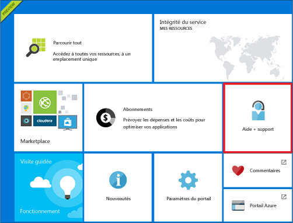
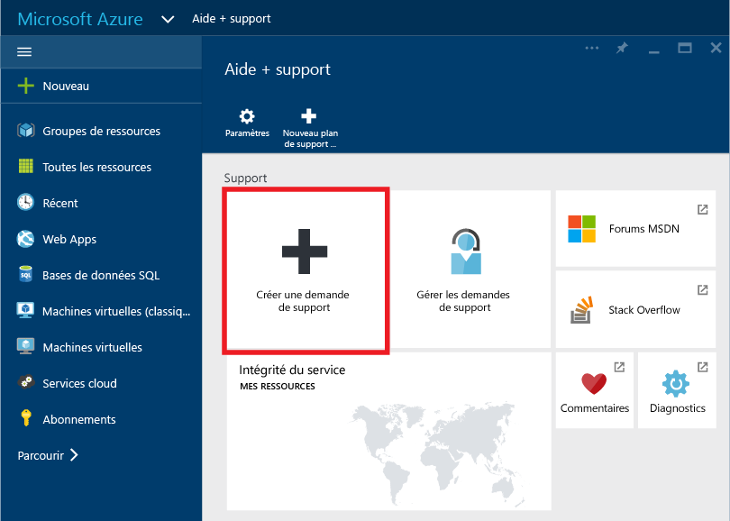
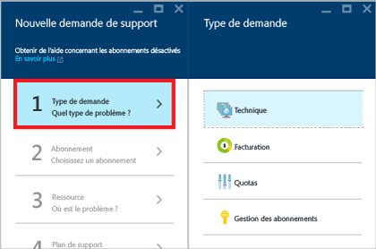
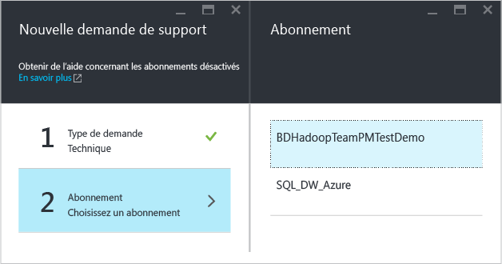
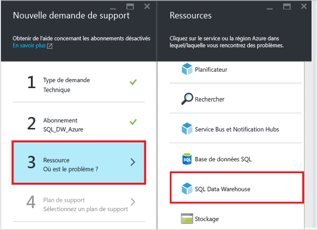
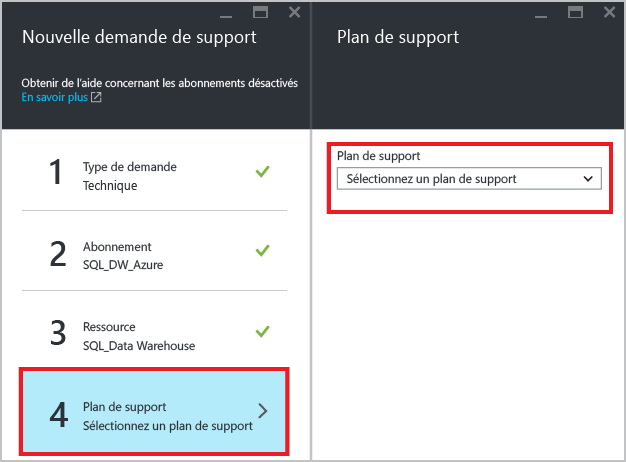
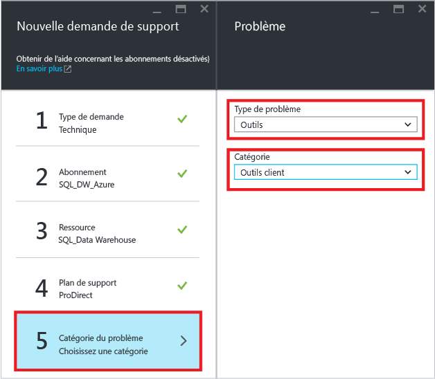
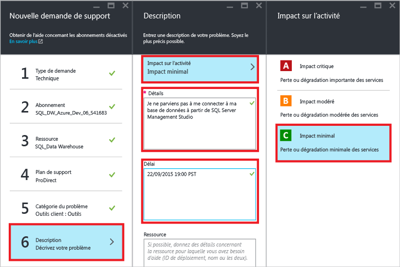
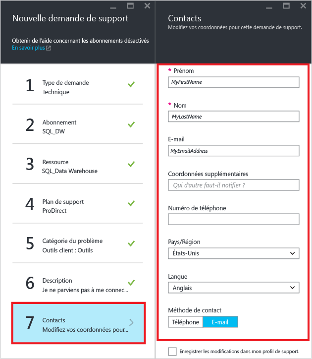
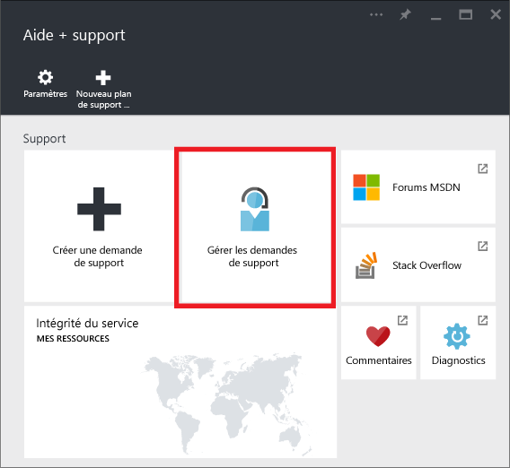

# Création d’un ticket de support pour SQL Data Warehouse
Si vous rencontrez des problèmes avec SQL Data Warehouse, créez un ticket de support pour que notre équipe d’ingénierie puisse vous aider.

> [!NOTE] 
> À compter du 20/12/2016, le contrôle d’intégrité des ressources dans le portail Azure n’est pas exact. Nous travaillons à la résolution de ce problème. 

## Création d’un ticket de support
1. Ouvrez le [portail Azure][Azure portal].
2. Dans l'écran d'accueil, cliquez sur la vignette **Aide + Support** .
   
    
3. Dans le panneau Aide + Support, cliquez sur **Créer une demande de support**.
   
    
   
     
4. Sélectionnez le **Type de demande**.
   
    
   
   > [!NOTE]
   > Par défaut, le **Quota de DTU** de chaque serveur SQL (par exemple, myserver.database.windows.net) est de 45 000. Ce quota constitue simplement une limite de sécurité. Vous pouvez augmenter votre quota en créant un ticket de support et en sélectionnant *Quota* en tant que type de demande. Pour calculer vos besoins en matière de DTU, multipliez le nombre total de [DWU][DWU] nécessaires par 7,5. Si, par exemple, vous souhaitez héberger deux bases de données DW6000 sur un serveur SQL unique, vous devez demander un quota de DTU de 90 000.  Vous pouvez consulter votre consommation de DTU actuelle dans le panneau SQL Server dans le portail. Les bases de données suspendues et réactivées sont prises en compte dans le quota de DTU. 
   > 
   > 
5. Sélectionnez l’ **abonnement** qui héberge la base de données présentant le problème que vous voulez signaler.
   
    
6. Sélectionnez **SQL Data Warehouse** en tant que ressource.
   
    
7. Sélectionnez votre [plan de support Azure][Azure support plan].
   
   * **gestion de la facturation, des abonnements et des quotas** sont pris en charge à tous les niveaux de support.
   * Les problèmes **couverts par la garantie de réparation et d’assistance** sont pris en charge dans les plans de support suivants : [Developer][Developer], [Standard][Standard], [Professional Direct][Professional Direct] ou [Premier][Premier]. Les problèmes couverts par la garantie de réparation et d'assistance sont des problèmes rencontrés par les clients lors de l'utilisation d'Azure et qui peuvent être raisonnablement imputés à Microsoft.
   * Les **services de tutorat** et d’**expertise pour développeur** sont disponibles aux niveaux de support [Professional Direct][Professional Direct] et [Premier][Premier]. 
     
     Si vous avez un plan de support Premier, vous pouvez également signaler les problèmes liés à SQL Data Warehouse sur le [portail en ligne Microsoft Premier][Microsoft Premier online portal].  Consultez les [plans de support Azure][Azure support plan] pour en savoir plus sur les différents plans disponibles, y compris leur portée, leur temps de réponse, leur tarification, etc.  Pour accéder aux questions fréquemment posées sur le support Azure, consultez la page [FAQ du support Azure][Azure support FAQs].  
     
     
8. Sélectionnez le **type** et la **catégorie** de problème. Dans cet exemple, nous avons choisi le type de problème « Outils » et la catégorie « Outils clients ». 
   
    
9. Décrivez le problème et choisissez le niveau de l'impact commercial.
   
    
10. Vos **informations de contact** pour ce ticket de support seront pré-remplies. Mettez-les à jour si nécessaire.
    
    
11. Cliquez sur **Créer** pour envoyer la demande de support.

## Surveiller un ticket de support
Une fois que vous avez envoyé la demande de support, vous serez contacté par l'équipe de support Azure. Pour vérifier le statut et les détails de votre demande, cliquez sur **Gérer les demandes de support** dans le tableau de bord.

## Autres ressources
En outre, vous pouvez contacter la communauté SQL Data Warehouse sur [Stack Overflow][Stack Overflow] ou le [forum MSDN Azure SQL Data Warehouse][Azure SQL Data Warehouse MSDN forum].

<!--Image references--> 

<!--Article references--> 
[DWU]: ./sql-data-warehouse-overview-what-is.md

<!--MSDN references--> 

<!--Other web references--> 
[Azure portal]: https://portal.azure.com/
[Azure support plan]: https://azure.microsoft.com/support/plans/?WT.mc_id=Support_Plan_510979/  
[Developer]: https://azure.microsoft.com/support/plans/developer/  
[Standard]: https://azure.microsoft.com/support/plans/standard/  
[Professional Direct]: https://azure.microsoft.com/support/plans/prodirect/  
[Premier]: https://azure.microsoft.com/support/plans/premier/  
[Azure support FAQs]: https://azure.microsoft.com/support/faq/
[Microsoft Premier online portal]: https://premier.microsoft.com/
[Stack Overflow]: https://stackoverflow.com/questions/tagged/azure-sqldw/
[Azure SQL Data Warehouse MSDN forum]: https://social.msdn.microsoft.com/Forums/home?forum=AzureSQLDataWarehouse/

