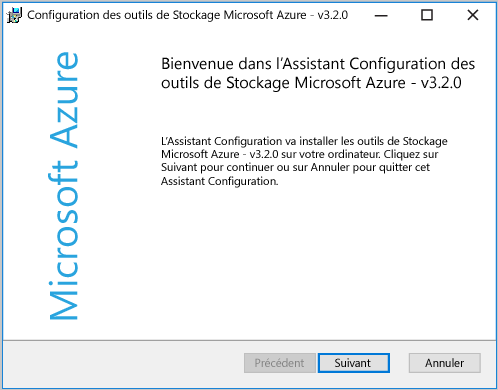
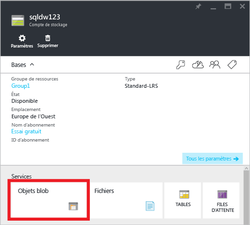
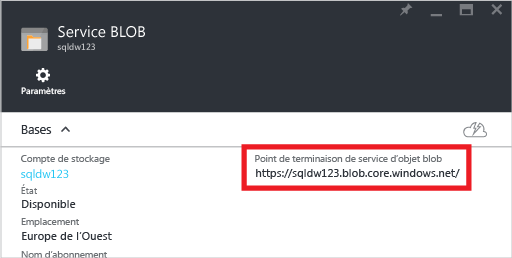
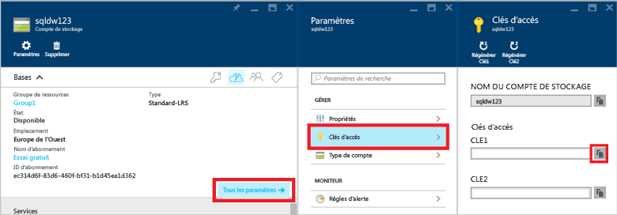
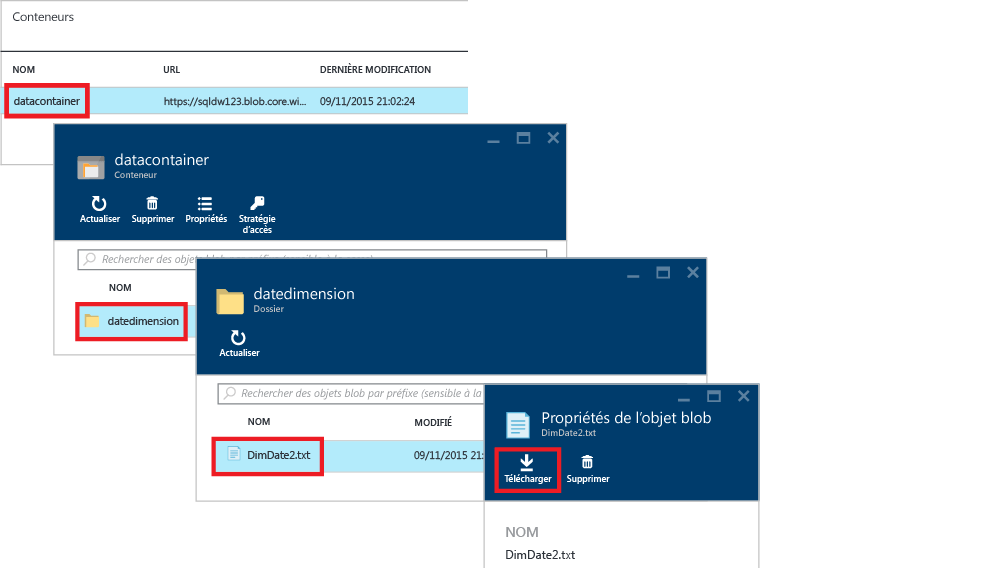
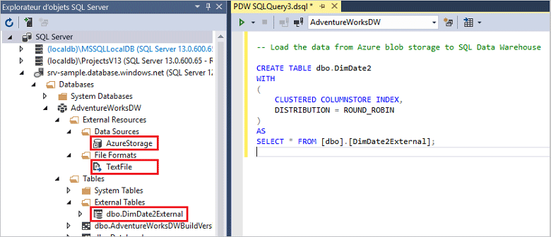

<properties
   pageTitle="Didacticiel PolyBase dans SQL Data Warehouse | Microsoft Azure"
   description="Découvrez PolyBase et apprenez comment utiliser cette solution avec les scénarios d’entreposage de données."
   services="sql-data-warehouse"
   documentationCenter="NA"
   authors="sahaj08"
   manager="barbkess"
   editor=""/>

<tags
   ms.service="sql-data-warehouse"
   ms.devlang="NA"
   ms.topic="get-started-article"
   ms.tgt_pltfrm="NA"
   ms.workload="data-services"
   ms.date="02/25/2016"
   ms.author="sahajs;barbkess;jrj;sonyama"/>


# Télécharger des données avec PolyBase dans SQL Data Warehouse

> [AZURE.SELECTOR]
- [Data Factory](sql-data-warehouse-get-started-load-with-azure-data-factory.md)
- [PolyBase](sql-data-warehouse-get-started-load-with-polybase.md)
- [BCP](sql-data-warehouse-load-with-bcp.md)

Ce didacticiel explique comment charger des données dans SQL Data Warehouse avec AzCopy et PolyBase. À la fin de ce didacticiel, vous saurez comment :

- Utilisez AzCopy pour copier des données vers le stockage d’objets blobs Azure
- Créer des objets de base de données pour définir les données externes
- Exécuter une requête T-SQL pour charger les données

>[AZURE.VIDEO loading-data-with-polybase-in-azure-sql-data-warehouse]

## Composants requis

Pour parcourir ce didacticiel, vous avez besoin des éléments suivants

- Une base de données SQL Data Warehouse
- Un compte de stockage Azure de type stockage redondant local standard (LRS-Standard), stockage géo-redondant Standard (Standard-GRS) ou stockage géo-redondant avec accès en lecture Standard (Standard-RAGRS)
- L’utilitaire de ligne de commande AzCopy Téléchargez et installez la [version la plus récente d’AzCopy][] qui s’installe avec les outils Microsoft Azure Storage.

    


## Étape 1 : ajouter les données exemple au stockage d’objets blobs Azure

Pour charger des données, nous devons placer des exemples de données dans un stockage d’objets blobs Azure. Lors de cette étape, nous allons remplir un objet blob Azure Storage avec des exemples de données. Plus tard, nous allons utiliser PolyBase pour charger ces exemples de données dans votre base de données SQL Data Warehouse.

### A. Préparer un exemple de fichier texte

Pour préparer un exemple de fichier texte :

1. Ouvrez le Bloc-notes et copiez les lignes de données suivantes dans un nouveau fichier. Enregistrez-les dans votre répertoire temporaire local %temp%\\DimDate2.txt.

    ```
    20150301,1,3
    20150501,2,4
    20151001,4,2
    20150201,1,3
    20151201,4,2
    20150801,3,1
    20150601,2,4
    20151101,4,2
    20150401,2,4
    20150701,3,1
    20150901,3,1
    20150101,1,3
    ```

### B. Recherchez votre point de terminaison de service blob

Pour trouver votre point de terminaison de service blob :

1. Dans le portail Azure Classic, sélectionnez **Parcourir** > **Comptes de stockage**.
2. Cliquez sur le compte de stockage que vous souhaitez utiliser.
3. Dans le panneau du compte de stockage, cliquez sur Objets blobs.

    

1. Enregistrez votre URL de point de terminaison du service blob pour l’utiliser à une date ultérieure.

    

### C. Rechercher votre clé de stockage Azure

Pour trouver votre clé de stockage Azure :

1. Dans l’écran d’accueil, sélectionnez **Parcourir** > **Comptes de stockage**.
2. Cliquez sur le compte de stockage que vous souhaitez utiliser.
3. Sélectionnez **Tous les paramètres** > **Clés d’accès**.
4. Cliquez sur la zone de copie pour copier l’une de vos clés d’accès dans le presse-papiers.

    

### D. Copiez l’exemple de fichier de données dans le stockage d’objets blobs Azure.

Pour copier vos données dans le stockage d’objets blob Azure :

1. Ouvrez une invite de commandes, puis changez de répertoire pour le répertoire d’installation AzCopy. Cette commande passe au répertoire d’installation par défaut sur un client Windows 64 bits.

    ```
    cd /d "%ProgramFiles(x86)%\Microsoft SDKs\Azure\AzCopy"
    ```

1. Exécutez la commande suivante pour télécharger le fichier. Spécifiez l’URL du point de terminaison de votre service d’objets blobs pour <blob service endpoint URL> et votre clé de compte de stockage Azure pour <azure_storage_account_key>.

    ```
    .\AzCopy.exe /Source:C:\Temp\ /Dest:<blob service endpoint URL> /datacontainer/datedimension/ /DestKey:<azure_storage_account_key> /Pattern:DimDate2.txt
    ```

Consultez [Prise en main de l’utilitaire de ligne de commande AzCopy][].

### E. Explorer votre conteneur de stockage d’objets blobs

Pour voir le fichier que vous avez téléchargé vers le stockage d’objets blobs :

1. Revenez au panneau de votre service d’objets blobs.
2. Sous Conteneurs, double-cliquez sur **datacontainer**.
3. Pour explorer le chemin d’accès à vos données, cliquez sur le dossier **datedimension** et vous verrez votre fichier **DimDate2.txt** téléchargé.
4. Pour afficher les propriétés, cliquez sur **DimDate2.txt**.
5. Le panneau de propriétés d’objets blobs vous permet de télécharger ou de supprimer le fichier. 

    


## Étape 2 : Créer une table externe pour les exemples de données

Dans cette section, nous allons créer une table externe qui définit les exemples de données.

PolyBase utilise les tables externes pour accéder des données dans le stockage d’objets blobs Azure ou Hadoop. Étant donné que les données ne sont pas stockées dans SQL Data Warehouse, PolyBase gère l’authentification pour les données externes à l’aide des informations d’identification de niveau base de données.

Dans cette étape, l’exemple utilise les instructions Transact-SQL pour créer une table externe.

- [Créer une clé principale (Transact-SQL)][] : pour chiffrer la clé secrète de vos informations d’identification de niveau base de données.
- [Créer des informations d’identification de niveau base de données (Transact-SQL)][] pour spécifier les informations d’authentification de votre compte de stockage Azure.
- [Créer une source de données externe (Transact-SQL)][] : pour spécifier l’emplacement de votre stockage d’objets blobs Azure.
- [Créer un format de fichier externe][] : pour spécifier le format de vos données.
- [Créer les tables externes (Transact-SQL)][] pour spécifier la définition de la table et l’emplacement des données.

Exécutez cette requête sur votre base de données SQL Data Warehouse. Il crée une table externe nommée DimDate2External dans le schéma dbo qui pointe vers les données d’exemple DimDate2.txt dans le stockage d’objets blobs Azure.


```
-- A: Create a master key.
-- Only necessary if one does not already exist.
-- Required to encrypt the credential secret in the next step.

CREATE MASTER KEY;


-- B: Create a database scoped credential
-- IDENTITY: Provide any string, it is not used for authentication to Azure storage.
-- SECRET: Provide your Azure storage account key. 


CREATE DATABASE SCOPED CREDENTIAL AzureStorageCredential 
WITH 
    IDENTITY = 'user', 
    SECRET = '<azure_storage_account_key>'
;


-- C: Create an external data source
-- LOCATION: Provide Azure storage account name and blob container name.
-- CREDENTIAL: Provide the credential created in the previous step.

CREATE EXTERNAL DATA SOURCE AzureStorage 
WITH (	
    TYPE = HADOOP, 
    LOCATION = 'wasbs://<blob_container_name>@<azure_storage_account_name>.blob.core.windows.net',
    CREDENTIAL = AzureStorageCredential
); 


-- D: Create an external file format
-- FORMAT_TYPE: Type of file format in Azure storage (supported: DELIMITEDTEXT, RCFILE, ORC, PARQUET).
-- FORMAT_OPTIONS: Specify field terminator, string delimiter, date format etc. for delimited text files.
-- Specify DATA_COMPRESSION method if data is compressed.

CREATE EXTERNAL FILE FORMAT TextFile 
WITH (
    FORMAT_TYPE = DelimitedText, 
    FORMAT_OPTIONS (FIELD_TERMINATOR = ',')
);


-- E: Create the external table
-- Specify column names and data types. This needs to match the data in the sample file. 
-- LOCATION: Specify path to file or directory that contains the data (relative to the blob container). 
-- To point to all files under the blob container, use LOCATION='.'

CREATE EXTERNAL TABLE dbo.DimDate2External (
    DateId INT NOT NULL, 
    CalendarQuarter TINYINT NOT NULL, 
    FiscalQuarter TINYINT NOT NULL
)
WITH (
    LOCATION='/datedimension/', 
    DATA_SOURCE=AzureStorage, 
    FILE_FORMAT=TextFile
);


-- Run a query on the external table

SELECT count(*) FROM dbo.DimDate2External;

```

## Étape 4 : Charger des données dans SQL Data Warehouse

Une fois la table externe créée, vous pouvez charger les données dans une nouvelle table ou les insérer dans une table existante.

- Pour charger les données dans une nouvelle table, exécutez l’instruction [CREATE TABLE AS SELECT (Transact-SQL)][]. La nouvelle table contient des colonnes nommées dans la requête. Les types de données présentes dans les colonnes correspondent à des types de données dans la définition de la table externe. 
- Pour charger les données dans une table existante, utilisez l’instruction [INSERT...SELECT (Transact-SQL)][]. 

```
-- Load the data from Azure blob storage to SQL Data Warehouse

CREATE TABLE dbo.DimDate2
WITH 
(   
    CLUSTERED COLUMNSTORE INDEX,
    DISTRIBUTION = ROUND_ROBIN
)
AS 
SELECT * FROM [dbo].[DimDate2External];
```
	

Dans l’Explorateur d’objets SQL Server dans Visual Studio, vous pouvez voir le format de fichier externe, la source de données externe et la table DimDate2External.



## Étape 5 : créer des statistiques sur vos données nouvellement chargées 

SQL Data Warehouse ne prend pas en charge les statistiques de création ou de mise à jour automatiques. Par conséquent, pour obtenir des performances élevées pour les requêtes, il est important de créer des statistiques pour chaque colonne de chaque table après le premier chargement. Il est également important de mettre à jour les statistiques après des modifications importantes des données.

Cet exemple crée des statistiques de colonne unique sur la nouvelle table DimDate2External.

```
CREATE STATISTICS [DateId] on [DimDate2] ([DateId]);
CREATE STATISTICS [CalendarQuarter] on [DimDate2] ([CalendarQuarter]);
create statistics [FiscalQuarter] on [DimDate2] ([FiscalQuarter]);
```

Pour en savoir plus, consultez la section [Statistiques][].


## Étapes suivantes
Consultez le [guide PolyBase][] pour obtenir d’autres informations sur le développement d’une solution qui utilise PolyBase.

<!--Image references-->
[1]: ./media/sql-data-warehouse-get-started-load-with-polybase/external-table.png

<!--Article references-->
[PolyBase in SQL Data Warehouse Tutorial]: sql-data-warehouse-get-started-load-with-polybase.md
[Load data with bcp]: sql-data-warehouse-load-with-bcp.md
[solution partners]: sql-data-warehouse-solution-partners.md
[development overview]: sql-data-warehouse-overview-develop.md
[Statistiques]: sql-data-warehouse-develop-statistics.md
[guide PolyBase]: sql-data-warehouse-load-polybase-guide.md
[Prise en main de l’utilitaire de ligne de commande AzCopy]: ../storage/storage-use-azcopy.md
[version la plus récente d’AzCopy]: ../storage/storage-use-azcopy.md

<!--External references-->
[supported source/sink]: https://msdn.microsoft.com/library/dn894007.aspx
[copy activity]: https://msdn.microsoft.com/library/dn835035.aspx
[SQL Server destination adapter]: https://msdn.microsoft.com/library/ms141095.aspx
[SSIS]: https://msdn.microsoft.com/library/ms141026.aspx


[Créer une source de données externe (Transact-SQL)]: https://msdn.microsoft.com/library/dn935022.aspx
[Créer un format de fichier externe]: https://msdn.microsoft.com/library/dn935026.aspx
[Créer les tables externes (Transact-SQL)]: https://msdn.microsoft.com/library/dn935021.aspx

[DROP EXTERNAL DATA SOURCE (Transact-SQL)]: https://msdn.microsoft.com/library/mt146367.aspx
[DROP EXTERNAL FILE FORMAT (Transact-SQL)]: https://msdn.microsoft.com/library/mt146379.aspx
[DROP EXTERNAL TABLE (Transact-SQL)]: https://msdn.microsoft.com/library/mt130698.aspx

[CREATE TABLE AS SELECT (Transact-SQL)]: https://msdn.microsoft.com/library/mt204041.aspx
[INSERT...SELECT (Transact-SQL)]: https://msdn.microsoft.com/library/ms174335.aspx
[Créer une clé principale (Transact-SQL)]: https://msdn.microsoft.com/library/ms174382.aspx
[CREATE CREDENTIAL (Transact-SQL)]: https://msdn.microsoft.com/library/ms189522.aspx
[Créer des informations d’identification de niveau base de données (Transact-SQL)]: https://msdn.microsoft.com/library/mt270260.aspx
[DROP CREDENTIAL (Transact-SQL)]: https://msdn.microsoft.com/library/ms189450.aspx

<!---HONumber=AcomDC_0302_2016-->