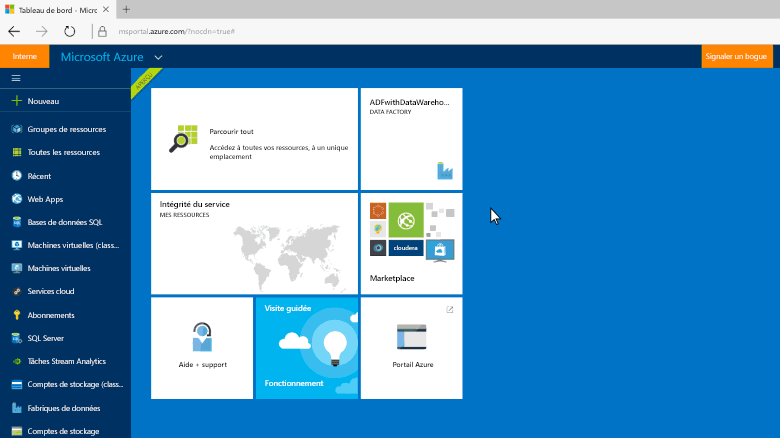
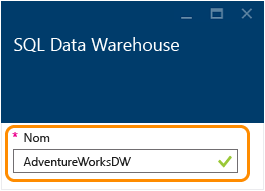
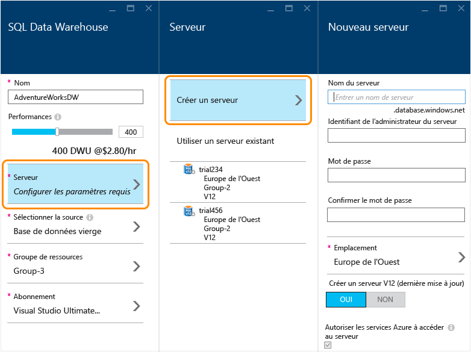
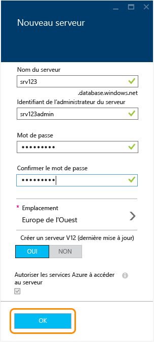
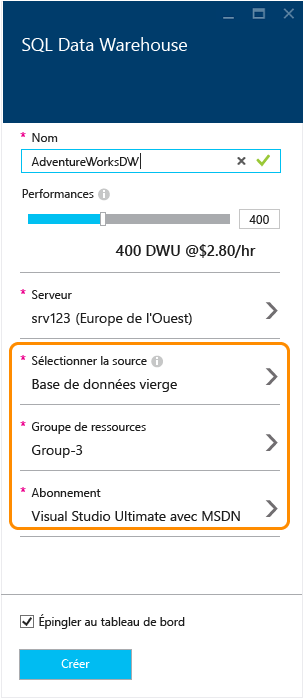
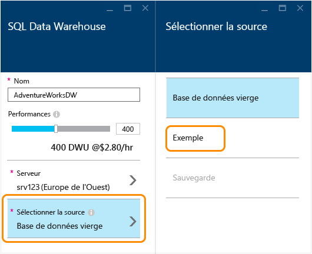
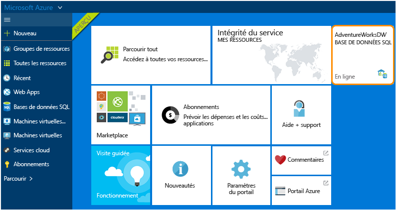
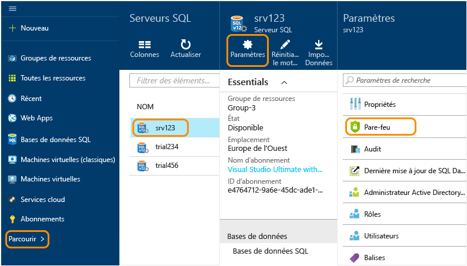
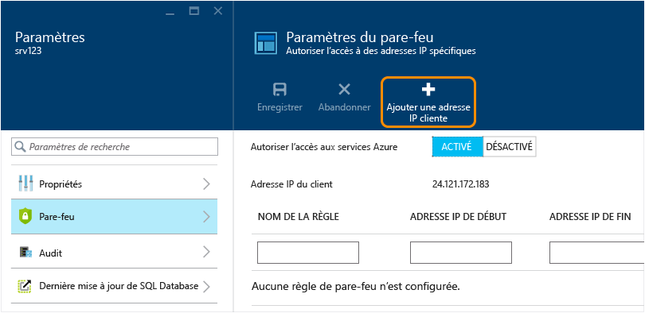
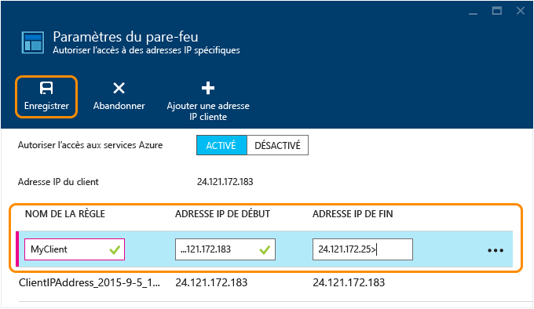

<properties
	pageTitle="Créer une base de données SQL Data Warehouse dans le portail Azure en version préliminaire | Microsoft Azure"
	description="Découvrez comment créer une base de données Azure SQL Data Warehouse dans le portail Azure en version préliminaire"
	services="sql-data-warehouse"
	documentationCenter="NA"
	authors="barbkess"
	manager="jhubbard"
	editor=""
	tags="azure-sql-data-warehouse"/>
<tags
   ms.service="sql-data-warehouse"
   ms.devlang="NA"
   ms.topic="get-started-article"
   ms.tgt_pltfrm="NA"
   ms.workload="data-services"
   ms.date="11/19/2015"
   ms.author="lodipalm;barbkess"/>

# Créer un entrepôt de données SQL

> [AZURE.SELECTOR]
- [Azure preview portal](sql-data-warehouse-get-started-provision.md)
- [TSQL](sql-data-warehouse-get-started-create-database-tsql.md)
- [PowerShell](sql-data-warehouse-get-started-provision-powershell.md)

Ce didacticiel vous explique comment créer une base de données Azure SQL Data Warehouse en quelques minutes à l’aide du portail Azure en version préliminaire.

Ce didacticiel vous apprendra à effectuer les opérations suivantes :

- Créer un serveur qui héberge votre base de données.
- Créer une base de données qui contient l’exemple de base de données AdventureWorksDW.

[AZURE.INCLUDE [free-trial-note](../../includes/free-trial-note.md)]

## Étape 1 : Se connecter et se mettre en route

1. Connectez-vous au [portail Azure en version préliminaire](https://portal.azure.com).

2. Cliquez sur **Nouveau** > **Données et stockage** > **SQL Data Warehouse**.

    

1. Entrez un nom pour votre base de données dans le panneau SQL Data Warehouse. Dans cet exemple, nous nommons la base de données AdventureWorksDW.

    

## Étape 2 : Configurer et créer un serveur

Dans la base de données SQL et SQL Data Warehouse, chaque base de données est affectée à un serveur, et chaque serveur est affecté à un emplacement géographique. Le serveur est appelé serveur SQL logique.

> [AZURE.NOTE]Un serveur SQL logique : >> + Fournit un moyen cohérent de configurer plusieurs bases de données dans le même emplacement géographique. > + N’est pas un matériel physique comme pour un serveur local. Il fait partie du logiciel de service. C’est pourquoi nous l’appelons *serveur logique*. > + Peut héberger plusieurs bases de données sans affecter leurs performances. > + Utilise un *s* minuscule dans son nom. Un **s**erveur SQL est un serveur logique Azure, tandis que SQL **S**erver est un produit de base de données local de Microsoft.

1. Cliquez sur **Serveur** > **Créer un serveur**. Aucuns frais ne s’appliquent pour le serveur. Si vous avez déjà un serveur SQL logique V12 que vous souhaitez utiliser, sélectionnez votre serveur existant et passez à l’étape suivante. 

    

3. Renseignez les informations pour le **nouveau serveur**.
    
	- **Nom du serveur**. Entrez un nom pour votre serveur logique. Il est unique pour chaque site géographique.
	- **Nom de l’administrateur du serveur**. Entrez un nom d’utilisateur pour le compte d’administrateur de serveur.
	- **Mot de passe**. Entrez le mot de passe de l’administrateur de serveur. 
	- **Emplacement**. Choisissez un emplacement géographique pour votre serveur. Pour réduire le temps de transfert des données, il est préférable de placer votre serveur à proximité des autres ressources de données auxquelles cette base de données accédera.
	- **Créer le serveur V12**. OUI est la seule option disponible pour SQL Data Warehouse. 
	- **Autoriser les services Azure à accéder au serveur**. Cette option est toujours activée pour SQL Data Warehouse.

    >[AZURE.NOTE]Veillez à stocker le nom du serveur, le nom de l’administrateur du serveur et le mot de passe quelque part. Vous aurez besoin de ces informations pour vous connecter au serveur.

1. Cliquez sur **OK** pour enregistrer les paramètres de configuration du serveur SQL logique et revenir au panneau SQL Data Warehouse.

    

## Étape 3 : Configurer et créer une base de données

Maintenant que vous avez sélectionné votre serveur SQL logique, vous êtes prêt à achever la création de la base de données.
 
2. Dans le panneau **SQL Data Warehouse**, renseignez les champs restants. 

    
    
    - **Performances** : nous vous recommandons de commencer par 400 DWU. Vous pouvez déplacer le curseur vers la gauche ou vers la droite pour ajuster le niveau de performances de votre base de données, avant et après la création de la base de données. 

        > [AZURE.NOTE]SQL Data Warehouse mesure les performances en DWU (Data Warehouse Units). À mesure que vous augmentez les DWU, SQL Data Warehouse augmente les ressources informatiques disponibles pour vos opérations de base de données. Lorsque vous exécutez votre charge de travail, vous pouvez voir les relations entre les DWU et les performances de votre charge de travail.
        > 
        > Vous pouvez modifier rapidement et facilement le niveau de performance après avoir créé la base de données. Par exemple, si vous n’utilisez pas la base de données, déplacez le curseur vers la gauche pour réduire les coûts. Vous pouvez aussi améliorer les performances quand davantage de ressources sont nécessaires. Pour ne pas encourir de frais, vous pouvez suspendre la base de données. Là réside toute la puissance d’extensibilité de SQL Data Warehouse.

    - **Sélectionner une source**. Cliquez sur **Sélectionner une source** > **Exemple**. Étant donné qu’un seul exemple de base de données est disponible à ce stade, lorsque vous sélectionnez Exemple, Azure renseigne automatiquement l’option **Sélectionner un exemple** avec AdventureWorksDW.
  
        

    - **Groupe de ressources**. Vous pouvez conserver les valeurs par défaut. Un groupe de ressources est un conteneur, conçu pour vous aider à gérer un ensemble de ressources Microsoft Azure. En savoir plus sur les [groupes de ressources](../azure-portal/resource-group-portal.md).
    
    - **Abonnement**. Sélectionnez l’abonnement à facturer pour cette base de données.

1. Cliquez sur **Créer** pour créer votre base de données SQL Data Warehouse.

1. Patientez quelques minutes et votre base de données est prête. Une fois que vous avez terminé, vous êtes en principe redirigé vers le [portail Azure en version préliminaire](https://portal.azure.com). Comme vous pouvez le constater, votre base de données SQL Data Warehouse a été ajoutée au tableau de bord.

    

## Étape 4 : Configurer l’accès au pare-feu du serveur pour l’adresse IP de votre client

Pour vous connecter au serveur à partir de votre adresse IP actuelle, ajoutez l’adresse IP de votre client aux règles du pare-feu. Cette étape vous montre comment procéder.

1. Cliquez sur **Parcourir** > **Serveurs SQL**, choisissez votre serveur, puis cliquez sur **Paramètres** > **Pare-feu**.

    

4. Cliquez sur **Ajouter l’IP du client** pour qu’Azure crée une règle pour votre adresse IP cliente. Cliquez sur **Enregistrer**.

	

1. Créer une règle de pare-feu avec une plage d’adresses IP. Vous pouvez effectuer cette opération maintenant ou ultérieurement.

	>[AZURE.IMPORTANT]Votre adresse IP est susceptible de changer de temps à autre, et vous ne serez peut-être pas en mesure d’accéder à votre serveur jusqu’à ce que vous créiez une nouvelle règle de pare-feu. Pour garantir un accès permanent, nous vous recommandons d’ajouter une plage d’adresses IP. Voir [Configuration des paramètres du pare-feu](../sql-database/sql-database-configure-firewall-settings.md) pour plus de détails.

    Pour créer une règle, saisissez un nom et la plage d’adresses IP, puis cliquez sur **Enregistrer**.

    

Maintenant que vous avez configuré le pare-feu, vous devriez être en mesure d’établir des connexions entre votre ordinateur de bureau et la base de données Azure SQL Data Warehouse que vous venez de créer.

## Étapes suivantes

Maintenant que vous avez créé une base de données exemple pour SQL Data Warehouse, vous êtes prêt à vous [connecter](./sql-data-warehouse-get-started-connect.md) à votre base de données.

<!---HONumber=AcomDC_1125_2015-->