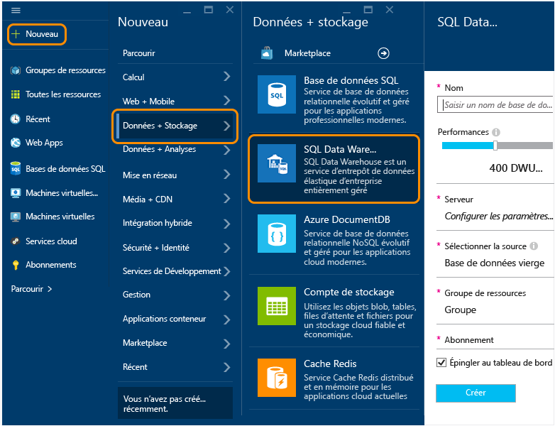

<properties
	pageTitle="Créer une base de données SQL Data Warehouse dans le portail Azure en version préliminaire | Microsoft Azure"
	description="Découvrez comment créer une base de données Azure SQL Data Warehouse dans le portail Azure en version préliminaire"
	services="sql-data-warehouse"
	documentationCenter="NA"
	authors="lodipalm"
	manager="barbkess"
	editor=""
	tags="azure-sql-data-warehouse"/>
<tags
   ms.service="sql-data-warehouse"
   ms.devlang="NA"
   ms.topic="article"
   ms.tgt_pltfrm="NA"
   ms.workload="data-services"
   ms.date="09/29/2015"
   ms.author="lodipalm;barbkess"/>

# Créer une base de données SQL Data Warehouse dans le portail Azure en version préliminaire#

Ce didacticiel montre combien il est facile de créer une base de données Azure SQL Data Warehouse dans le portail Azure en version préliminaire, et ce en quelques minutes.

Lors de cette procédure pas à pas, vous allez :

- créer une base de données SQL Data Warehouse ;
- créer un serveur pour votre base de données ;
- charger AdventureWorksDW dans votre nouvelle base de données.

[AZURE.INCLUDE [free-trial-note](../../includes/free-trial-note.md)]

## Se connecter et rechercher SQL Data Warehouse

1. Connectez-vous au [portail en version préliminaire](https://portal.azure.com).

2. Dans le menu Hub, cliquez sur **Nouveau** > **Données + stockage** > **SQL Data Warehouse**.

	

## Configurer les paramètres de performances et autres paramètres de base

Dans le volet **SQL Data Warehouse**, renseignez les champs suivants. **Serveur** et **Source** sont configurés dans les sections suivantes.

1. **Nom de la base de données** : entrez un nom pour votre base de données SQL Data Warehouse.

2. **Performances** : vous pouvez ajuster les performances de départ de votre instance durant l’approvisionnement. Nous vous recommandons de commencer avec 400 DWU, car cela vous permettra de mieux observer les avantages en termes de MPP offerts par SQL Data Warehouse.
     
    

    > [AZURE.NOTE] Nous mesurons les performances en termes de DWU (Data Warehouse Units). À mesure que vous augmentez les DWU, SQL Data Warehouse augmente les ressources informatiques disponibles pour vos opérations de base de données d’entrepôt de données.

	> [AZURE.NOTE] Vous pouvez modifier rapidement et facilement le niveau de performance après avoir créé la base de données. Par exemple, si vous n’utilisez pas la base de données, déplacez le curseur vers la gauche pour réduire les coûts. Vous pouvez aussi améliorer les performances quand davantage de ressources sont nécessaires. Là réside toute la puissance d’extensibilité de SQL Data Warehouse.
	

2. **Groupe de ressources**. Conservez les valeurs par défaut. Un groupe de ressources est un conteneur conçu pour vous aider à gérer un ensemble de ressources Microsoft Azure. En savoir plus sur les [groupes de ressources](../azure-portal/resource-group-portal.md).
3. **Abonnement**. Sélectionnez l’abonnement à facturer pour cette base de données.

## Configurer un serveur logique

3. Cliquez sur **Serveur** > **Créer un serveur**. Cela crée un serveur logique auquel votre base de données sera associée. Si vous avez déjà un serveur V12 que vous souhaitez utiliser, sélectionnez votre serveur existant et passez à la section suivante.

    

    >[AZURE.NOTE] Dans SQL Data Warehouse et Base de données SQL, un serveur fournit un moyen cohérent de configurer des bases de données dans le cloud. Dans Azure, même si un serveur est lié à un centre de données unique, il ne s’agit pas de matériel physique comme pour une instance locale de SQL Server. Ce serveur fait partie du logiciel du service. C’est pourquoi nous utilisons le terme « serveur logique ». Veuillez noter que, contrairement à la réalité, les charges de travail exécutant des bases de données et des entrepôts de données sur le même serveur n’auront pas d’impact de performances l’une sur l’autre.

1. Dans la fenêtre **Nouveau serveur**, renseignez les informations demandées.

    Veillez à stocker le nom du serveur, le nom de l’administrateur et le mot de passe quelque part. Vous aurez besoin de ces informations pour vous connecter au serveur. 
	- **Nom du serveur**. Entrez un nom pour votre serveur logique.
	- **Nom de l’administrateur de serveur**. Entrez un nom d’utilisateur pour le compte d’administrateur de serveur.
	- **Mot de passe**. Entrez le mot de passe de l’administrateur de serveur.
	- **Emplacement**. Choisissez un emplacement géographique proche de vous ou de vos autres ressources Azure. Cela réduira la latence du réseau, car toutes les bases de données et les ressources qui appartiennent à votre serveur logique résideront physiquement dans la même région.

    

1. Cliquez sur **OK** pour enregistrer les paramètres de configuration du serveur.

## Charger l’exemple de base de données

1. Choisissez **Source** > **Exemple** pour initialiser votre nouvelle base de données avec l’exemple de base de données AdventureWorksDW. 

    

## Terminer la création de la base de données

1. Cliquez sur **Créer** pour créer votre base de données SQL Data Warehouse. 

1. Il ne vous reste plus qu’à patienter quelques minutes. Une fois terminé, votre exemple de base de données apparaît dans votre page d’accueil.

    

## Étapes suivantes

Maintenant que vous avez créé un exemple de base de données pour SQL Data Warehouse, découvrez comment utiliser SQL Data Warehouse dans cette procédure pas à pas suivante.

- [Se connecter et interroger](./sql-data-warehouse-get-started-connect-query.md).

	> [AZURE.NOTE] Nous souhaitons améliorer cet article. Si vous choisissez de répondre « non » à la question « Cet article vous a-t-il été utile ? », veuillez ajouter une brève suggestion concernant ce qui manque ou comment cet article peut être amélioré. Merci d’avance !

<!----HONumber=Oct15_HO1-->