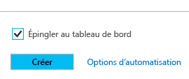
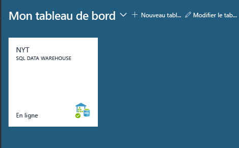
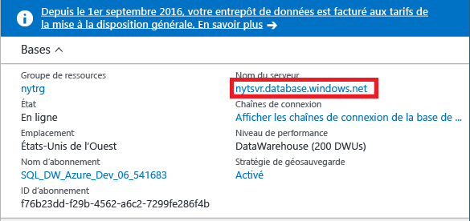
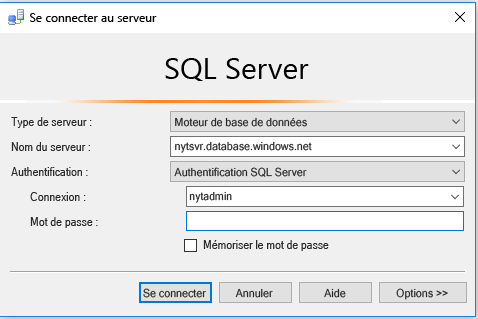
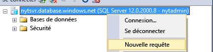
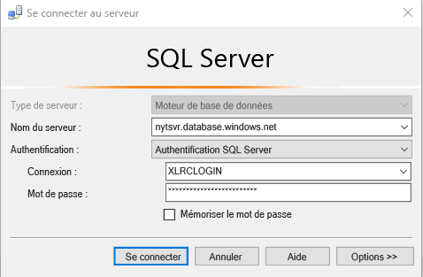
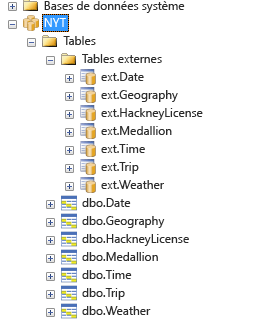
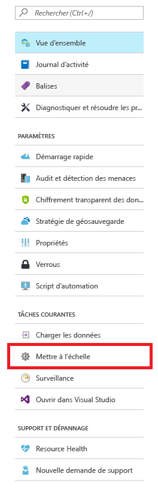
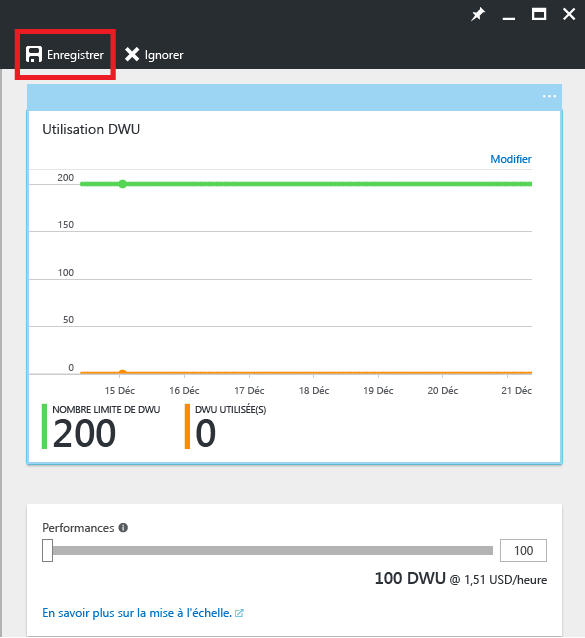

# <a name="get-started-with-sql-data-warehouse"></a>Prise en main de SQL Data Warehouse

Ce didacticiel va vous montrer comment approvisionner et charger des données dans Azure SQL Data Warehouse. Vous allez également découvrir les principes de base de mise à l’échelle, de mise en attente et de réglage. Lorsque vous aurez terminé, vous serez prêt à interroger et à explorer votre entrepôt de données.

**Durée de réalisation estimée :** la réalisation de ce didacticiel de bout en bout contenant un exemple de code prend environ 30 minutes une fois que vous avez rempli les conditions préalables. 

## <a name="prerequisites"></a>Composants requis

Ce didacticiel part du principe que vous connaissez bien les concepts de base de SQL Data Warehouse. Si vous avez besoin d’une introduction, consultez [En quoi consiste Azure SQL Data Warehouse ?](sql-data-warehouse-overview-what-is.md) 

### <a name="sign-up-for-microsoft-azure"></a>S'inscrire à Microsoft Azure
Si vous ne disposez pas d’un compte Microsoft Azure, vous devez vous inscrire pour utiliser ce service. Si vous avez déjà un compte, vous pouvez ignorer cette étape. 

1. Accédez aux pages de compte à l’adresse [https://azure.microsoft.com/fr-fr/account/](https://azure.microsoft.com/account/).
2. Créer un compte Azure gratuit, ou achetez-en un.
3. Suivez les instructions.

### <a name="install-appropriate-sql-client-drivers-and-tools"></a>Installer les pilotes du client SQL et les outils appropriés

La plupart des outils du client SQL peuvent se connecter à SQL Data Warehouse à l’aide de JDBC, ODBC ou ADO.NET. En raison du grand nombre de fonctionnalités T-SQL prises en charge par SQL Data Warehouse, certaines applications clientes ne sont pas entièrement compatibles avec SQL Data Warehouse.

Si vous exécutez un système d’exploitation Windows, nous vous recommandons de recourir à [Visual Studio] ou à [SQL Server Management Studio].

[!INCLUDE [Create a new logical server](../../includes/sql-data-warehouse-create-logical-server.md)] 

[!INCLUDE [SQL Database create server](../../includes/sql-database-create-new-server-firewall-portal.md)]

## <a name="create-a-sql-data-warehouse"></a>Créer un entrepôt de données SQL

SQL Data Warehouse est un type spécial de base de données conçu pour le traitement massivement parallèle. La base de données est répartie sur plusieurs nœuds et traite les requêtes en parallèle. SQL Data Warehouse dispose d’un nœud de contrôle qui orchestre les activités de tous les nœuds. Les nœuds eux-mêmes utilisent SQL Database pour gérer vos données.  

> [!NOTE]
> La création d’un entrepôt de données SQL Data Warehouse peut donner lieu à un nouveau service facturable.  Pour en savoir plus, voir [SQL Data Warehouse - Tarification](https://azure.microsoft.com/pricing/details/sql-data-warehouse/).
>

### <a name="create-a-data-warehouse"></a>Créer un entrepôt de données

1. Connectez-vous au [portail Azure](https://portal.azure.com).
2. Cliquez sur **Nouveau** > **Bases de données** > **SQL Data Warehouse**.

    
    

3. Renseignez les détails relatifs au déploiement.

    **Nom de la base de données** : choisissez le nom de votre choix. Si vous disposez de plusieurs entrepôts de données, nous vous recommandons d’inclure dans ce nom des détails tels que la région et l’environnement, par exemple *mydw-westus-1-test*.

    **Abonnement** : votre abonnement Azure.

    **Groupe de ressources** : créez un groupe de ressources ou utilisez-en un existant.
    > [!NOTE]
    > Les groupes de ressources sont utiles pour administrer les ressources (définition de la portée du contrôle d’accès et déploiement basé sur des modèles, par exemple). Découvrez [ici](https://docs.microsoft.com/azure/azure-resource-manager/resource-group-overview#resource-groups) plus d’informations sur les groupes de ressources et meilleures pratiques Azure.

    **Source** : base de données vide.

    **Serveur** : sélectionnez le serveur que vous avez créé dans le cadre de la section [Composants requis].

    **Classement** : conservez le classement par défaut, à savoir SQL_Latin1_General_CP1_CI_AS.

    **Sélectionner le compteur de performance** : nous vous recommandons de commencer par le modèle 400DWU standard.

4. Choisissez **Épingler au tableau de bord**
    

5. Installez-vous confortablement et attendez le déploiement de votre entrepôt de données. Il est normal que ce processus prenne plusieurs minutes. Le portail vous informe lorsque votre entrepôt de données est opérationnel. 

## <a name="connect-to-sql-data-warehouse"></a>Se connecter à SQL Data Warehouse

Pour les besoins de ce didacticiel, la connexion à l’entrepôt de données est effectuée via SQL Server Management Studio (SSMS). Vous pouvez vous connecter à SQL Data Warehouse par l’intermédiaire de ces connecteurs pris en charge : ADO.NET, JDBC, ODBC et PHP. N’oubliez pas que les fonctionnalités peuvent être limitées si les outils ne sont pas pris en charge par Microsoft.


### <a name="get-connection-information"></a>Obtenir des informations de connexion

Pour vous connecter à votre entrepôt de données, vous devez recourir au serveur SQL logique que vous avez créé dans [Composants requis].

1. Sélectionnez votre entrepôt de données dans le tableau de bord ou recherchez-le dans vos ressources.

    

2. Recherchez le nom complet du serveur SQL Server logique.

    

3. Ouvrez SSMS et utilisez l’Explorateur d’objets pour vous connecter à ce serveur en utilisant les informations d’identification d’administrateur du serveur que vous avez créées dans [Composants requis]

    

Si tout se passe correctement, vous devez maintenant être connecté à votre serveur SQL Server logique. Étant donné que vous êtes connecté en tant qu’administrateur du serveur, vous pouvez vous connecter à n’importe quelle base de données hébergée par le serveur, y compris à la base de données MASTER. 

Il n’existe qu’un compte d’administrateur du serveur, qui dispose de la majorité des privilèges des utilisateurs. Veillez à ne pas autoriser un trop grand nombre de personnes de votre organisation à connaître le mot de passe d’administrateur. 

Vous pouvez également posséder un compte d’administrateur Azure Active Directory. Nous ne fournissons pas les détails afférents ici. Pour en savoir plus sur l’utilisation de l’authentification Azure Active Directory, voir [Authentification Azure Active Directory](https://docs.microsoft.com/azure/sql-database/sql-database-aad-authentication).

Nous étudions maintenant la création d’utilisateurs et d’information de connexion supplémentaires.


## <a name="create-a-database-user"></a>Créer un utilisateur de base de données

Dans cette étape, vous créez un compte d’utilisateur pour accéder à votre entrepôt de données. Nous vous montrons également comment autoriser cet utilisateur à exécuter des requêtes avec une grande quantité de mémoire et de ressources processeur.

### <a name="notes-about-resource-classes-for-allocating-resources-to-queries"></a>Remarques sur les classes de ressources pour allouer des ressources aux requêtes

- Pour que vos données restent sécurisées, n’utilisez pas le compte d’administrateur du serveur pour exécuter des requêtes sur vos bases de données de production. Il possède la majorité des privilèges des utilisateurs, et l’utiliser pour effectuer des opérations sur les données utilisateur expose vos données à des risques. En outre, comme l’administrateur du serveur est censé effectuer des opérations de gestion, il exécute des opérations avec uniquement une petite allocation de mémoire et de ressources processeur. 

- SQL Data Warehouse utilise les rôles de base de données prédéfinis, appelés classes de ressources, pour allouer différentes quantités de mémoire, de ressources processeur et d’emplacements de concurrence aux utilisateurs. Chaque utilisateur peut appartenir à une classe de ressources petite, moyenne, grande ou très grande. La classe de ressources de l’utilisateur détermine les ressources dont l’utilisateur dispose pour exécuter des requêtes et des opérations de chargement.

- Pour optimiser la compression des données, l’utilisateur devra parfois procéder à des chargements avec des allocations de ressources de grande ou de très grande taille. Découvrez plus d’informations sur les classes de ressource [ici](./sql-data-warehouse-develop-concurrency.md#resource-classes) :

### <a name="create-an-account-that-can-control-a-database"></a>Créer un compte pouvant contrôler une base de données

Comme vous êtes actuellement connecté en tant qu’administrateur du serveur, vous êtes autorisé à créer des connexions et des utilisateurs.

1. À l’aide de SSMS ou d’un autre client de requête, ouvrez une nouvelle requête pour **master**.

    

    

2. Dans la fenêtre de requête, exécutez cette commande T-SQL pour créer une connexion nommée MedRCLogin et un utilisateur nommé LoadingUser. Cette connexion peut atteindre un serveur SQL Server logique.

    ```sql
    CREATE LOGIN MedRCLogin WITH PASSWORD = 'a123reallySTRONGpassword!';
    CREATE USER LoadingUser FOR LOGIN MedRCLogin;
    ```

3. En interrogeant la *base de données SQL Data Warehouse*, créez un utilisateur de base de données en fonction de la connexion que vous avez créée pour accéder à la base de données et y effectuer des opérations.

    ```sql
    CREATE USER LoadingUser FOR LOGIN MedRCLogin;
    ```

4. Octroyez à l’utilisateur de base de données des autorisations de contrôle sur la base de données appelée NYT. 

    ```sql
    GRANT CONTROL ON DATABASE::[NYT] to LoadingUser;
    ```
    > [!NOTE]
    > Si le nom de votre base de données comporte des traits d’union, veillez à le placer entre crochets. 
    >

### <a name="give-the-user-medium-resource-allocations"></a>Accorder à l’utilisateur des allocations de ressources de taille moyenne

1. Exécutez cette commande T-SQL pour qu’il devienne membre de la classe de ressources de taille moyenne, appelée mediumrc. 

    ```sql
    EXEC sp_addrolemember 'mediumrc', 'LoadingUser';
    ```
    > [!NOTE]
    > Cliquez [ici](sql-data-warehouse-develop-concurrency.md#resource-classes) pour en savoir plus sur les classes d’accès concurrentiel et de ressources. 
    >

2. Connectez-vous au serveur logique en utilisant les nouvelles informations d’identification.

    


## <a name="load-data-from-azure-blob-storage"></a>Charger des données à partir d’objets Blob Microsoft Azure Storage

Vous êtes maintenant prêt à charger des données dans votre entrepôt de données. Cette étape vous montre comment charger les données des taxis de New York à partir d’un stockage d’objets blob Azure public. 

- Pour charger des données dans SQL Data Warehouse, il est courant de commencer par les déplacer dans le stockage d’objets blob Azure, puis de les charger dans votre entrepôt de données. Pour faciliter la compréhension du chargement, nous avons fait en sorte que les données des taxis de New York soient déjà hébergées dans un stockage d’objets blob Azure public. 

- Pour vous y référer ultérieurement, pour savoir comment charger vos données vers le stockage d’objets blob Azure ou pour les charger directement à partir de votre source dans SQL Data Warehouse, consultez la [présentation du chargement](sql-data-warehouse-overview-load.md).


### <a name="define-external-data"></a>Définir des données externes

1. Créez une clé principale. Vous ne devez créer qu’une clé principale par base de données. 

    ```sql
    CREATE MASTER KEY;
    ```

2. Définissez l’emplacement de l’objet blob Azure qui contient les données des taxis.  

    ```sql
    CREATE EXTERNAL DATA SOURCE NYTPublic
    WITH
    (
        TYPE = Hadoop,
        LOCATION = 'wasbs://2013@nytpublic.blob.core.windows.net/'
    );
    ```

3. Définissez les formats des fichiers externes.

    La commande ```CREATE EXTERNAL FILE FORMAT``` permet de spécifier le format des fichiers qui contiennent les données externes. Ils contiennent du texte séparé par un ou plusieurs caractères, appelés délimiteurs. Pour les besoins de démonstration, les données des taxis sont stockées sous forme de données non compressées et de données compressées au format gzip.

    Exécutez ces commandes T-SQL pour définir les deux formats : non compressé et compressé.

    ```sql
    CREATE EXTERNAL FILE FORMAT uncompressedcsv
    WITH (
        FORMAT_TYPE = DELIMITEDTEXT,
        FORMAT_OPTIONS ( 
            FIELD_TERMINATOR = ',',
            STRING_DELIMITER = '',
            DATE_FORMAT = '',
            USE_TYPE_DEFAULT = False
        )
    );

    CREATE EXTERNAL FILE FORMAT compressedcsv
    WITH ( 
        FORMAT_TYPE = DELIMITEDTEXT,
        FORMAT_OPTIONS ( FIELD_TERMINATOR = '|',
            STRING_DELIMITER = '',
        DATE_FORMAT = '',
            USE_TYPE_DEFAULT = False
        ),
        DATA_COMPRESSION = 'org.apache.hadoop.io.compress.GzipCodec'
    );
    ```

4.  Créez un schéma pour le format de fichier externe. 

    ```sql
    CREATE SCHEMA ext;
    ```
5. Créez les tables externes. Ces tables référencent les données stockées dans le stockage d’objets blob Azure. Exécutez les commandes T-SQL suivantes pour créer plusieurs tables externes pointant toutes vers l’objet blob Azure que nous avons défini précédemment dans notre source de données externe.

```sql
    CREATE EXTERNAL TABLE [ext].[Date] 
    (
        [DateID] int NOT NULL,
        [Date] datetime NULL,
        [DateBKey] char(10) COLLATE SQL_Latin1_General_CP1_CI_AS NULL,
        [DayOfMonth] varchar(2) COLLATE SQL_Latin1_General_CP1_CI_AS NULL,
        [DaySuffix] varchar(4) COLLATE SQL_Latin1_General_CP1_CI_AS NULL,
        [DayName] varchar(9) COLLATE SQL_Latin1_General_CP1_CI_AS NULL,
        [DayOfWeek] char(1) COLLATE SQL_Latin1_General_CP1_CI_AS NULL,
        [DayOfWeekInMonth] varchar(2) COLLATE SQL_Latin1_General_CP1_CI_AS NULL,
        [DayOfWeekInYear] varchar(2) COLLATE SQL_Latin1_General_CP1_CI_AS NULL,
        [DayOfQuarter] varchar(3) COLLATE SQL_Latin1_General_CP1_CI_AS NULL,
        [DayOfYear] varchar(3) COLLATE SQL_Latin1_General_CP1_CI_AS NULL,
        [WeekOfMonth] varchar(1) COLLATE SQL_Latin1_General_CP1_CI_AS NULL,
        [WeekOfQuarter] varchar(2) COLLATE SQL_Latin1_General_CP1_CI_AS NULL,
        [WeekOfYear] varchar(2) COLLATE SQL_Latin1_General_CP1_CI_AS NULL,
        [Month] varchar(2) COLLATE SQL_Latin1_General_CP1_CI_AS NULL,
        [MonthName] varchar(9) COLLATE SQL_Latin1_General_CP1_CI_AS NULL,
        [MonthOfQuarter] varchar(2) COLLATE SQL_Latin1_General_CP1_CI_AS NULL,
        [Quarter] char(1) COLLATE SQL_Latin1_General_CP1_CI_AS NULL,
        [QuarterName] varchar(9) COLLATE SQL_Latin1_General_CP1_CI_AS NULL,
        [Year] char(4) COLLATE SQL_Latin1_General_CP1_CI_AS NULL,
        [YearName] char(7) COLLATE SQL_Latin1_General_CP1_CI_AS NULL,
        [MonthYear] char(10) COLLATE SQL_Latin1_General_CP1_CI_AS NULL,
        [MMYYYY] char(6) COLLATE SQL_Latin1_General_CP1_CI_AS NULL,
        [FirstDayOfMonth] date NULL,
        [LastDayOfMonth] date NULL,
        [FirstDayOfQuarter] date NULL,
        [LastDayOfQuarter] date NULL,
        [FirstDayOfYear] date NULL,
        [LastDayOfYear] date NULL,
        [IsHolidayUSA] bit NULL,
        [IsWeekday] bit NULL,
        [HolidayUSA] varchar(50) COLLATE SQL_Latin1_General_CP1_CI_AS NULL
    )
    WITH
    (
        LOCATION = 'Date',
        DATA_SOURCE = NYTPublic,
        FILE_FORMAT = uncompressedcsv,
        REJECT_TYPE = value,
        REJECT_VALUE = 0
    );
    
    CREATE EXTERNAL TABLE [ext].[Geography]
    (
        [GeographyID] int NOT NULL,
        [ZipCodeBKey] varchar(10) COLLATE SQL_Latin1_General_CP1_CI_AS NOT NULL,
        [County] varchar(50) COLLATE SQL_Latin1_General_CP1_CI_AS NULL,
        [City] varchar(50) COLLATE SQL_Latin1_General_CP1_CI_AS NULL,
        [State] varchar(50) COLLATE SQL_Latin1_General_CP1_CI_AS NULL,
        [Country] varchar(50) COLLATE SQL_Latin1_General_CP1_CI_AS NULL,
        [ZipCode] varchar(50) COLLATE SQL_Latin1_General_CP1_CI_AS NULL
    )
    WITH
    (
        LOCATION = 'Geography',
        DATA_SOURCE = NYTPublic,
        FILE_FORMAT = uncompressedcsv,
        REJECT_TYPE = value,
        REJECT_VALUE = 0 
    );
        
    
    CREATE EXTERNAL TABLE [ext].[HackneyLicense]
    (
        [HackneyLicenseID] int NOT NULL,
        [HackneyLicenseBKey] varchar(50) COLLATE SQL_Latin1_General_CP1_CI_AS NOT NULL,
        [HackneyLicenseCode] varchar(50) COLLATE SQL_Latin1_General_CP1_CI_AS NULL
    )
    WITH
    (
        LOCATION = 'HackneyLicense',
        DATA_SOURCE = NYTPublic,
        FILE_FORMAT = uncompressedcsv,
        REJECT_TYPE = value,
        REJECT_VALUE = 0
    )
    ;
        
    
    CREATE EXTERNAL TABLE [ext].[Medallion]
    (
        [MedallionID] int NOT NULL,
        [MedallionBKey] varchar(50) COLLATE SQL_Latin1_General_CP1_CI_AS NOT NULL,
        [MedallionCode] varchar(50) COLLATE SQL_Latin1_General_CP1_CI_AS NULL
    )
    WITH
    (
        LOCATION = 'Medallion',
        DATA_SOURCE = NYTPublic,
        FILE_FORMAT = uncompressedcsv,
        REJECT_TYPE = value,
        REJECT_VALUE = 0
    )
    ;
        
    CREATE EXTERNAL TABLE [ext].[Time]
    (
        [TimeID] int NOT NULL,
        [TimeBKey] varchar(8) COLLATE SQL_Latin1_General_CP1_CI_AS NOT NULL,
        [HourNumber] tinyint NOT NULL,
        [MinuteNumber] tinyint NOT NULL,
        [SecondNumber] tinyint NOT NULL,
        [TimeInSecond] int NOT NULL,
        [HourlyBucket] varchar(15) COLLATE SQL_Latin1_General_CP1_CI_AS NOT NULL,
        [DayTimeBucketGroupKey] int NOT NULL,
        [DayTimeBucket] varchar(100) COLLATE SQL_Latin1_General_CP1_CI_AS NOT NULL
    )
    WITH
    (
        LOCATION = 'Time',
        DATA_SOURCE = NYTPublic,
        FILE_FORMAT = uncompressedcsv,
        REJECT_TYPE = value,
        REJECT_VALUE = 0
    )
    ;
    
    
    CREATE EXTERNAL TABLE [ext].[Trip]
    (
        [DateID] int NOT NULL,
        [MedallionID] int NOT NULL,
        [HackneyLicenseID] int NOT NULL,
        [PickupTimeID] int NOT NULL,
        [DropoffTimeID] int NOT NULL,
        [PickupGeographyID] int NULL,
        [DropoffGeographyID] int NULL,
        [PickupLatitude] float NULL,
        [PickupLongitude] float NULL,
        [PickupLatLong] varchar(50) COLLATE SQL_Latin1_General_CP1_CI_AS NULL,
        [DropoffLatitude] float NULL,
        [DropoffLongitude] float NULL,
        [DropoffLatLong] varchar(50) COLLATE SQL_Latin1_General_CP1_CI_AS NULL,
        [PassengerCount] int NULL,
        [TripDurationSeconds] int NULL,
        [TripDistanceMiles] float NULL,
        [PaymentType] varchar(50) COLLATE SQL_Latin1_General_CP1_CI_AS NULL,
        [FareAmount] money NULL,
        [SurchargeAmount] money NULL,
        [TaxAmount] money NULL,
        [TipAmount] money NULL,
        [TollsAmount] money NULL,
        [TotalAmount] money NULL
    )
    WITH
    (
        LOCATION = 'Trip2013',
        DATA_SOURCE = NYTPublic,
        FILE_FORMAT = compressedcsv,
        REJECT_TYPE = value,
        REJECT_VALUE = 0
    )
    ;
    
    CREATE EXTERNAL TABLE [ext].[Weather]
    (
        [DateID] int NOT NULL,
        [GeographyID] int NOT NULL,
        [PrecipitationInches] float NOT NULL,
        [AvgTemperatureFahrenheit] float NOT NULL
    )
    WITH
    (
        LOCATION = 'Weather2013',
        DATA_SOURCE = NYTPublic,
        FILE_FORMAT = uncompressedcsv,
        REJECT_TYPE = value,
        REJECT_VALUE = 0
    )
    ;
```

### <a name="import-the-data-from-azure-blob-storage"></a>Importez les données à partir du stockage Blob Azure.

SQL Data Warehouse prend en charge une instruction clé appelée CREATE TABLE AS SELECT (CTAS). Cette instruction crée une table en fonction des résultats d’une instruction select. La nouvelle table propose les mêmes colonnes et les mêmes types de données que les résultats de l’instruction select.  Il s’agit d’un excellent moyen pour importer des données du stockage Blob Azure dans SQL Data Warehouse.

1. Exécutez ce script pour importer vos données.

    ```sql
    CREATE TABLE [dbo].[Date]
    WITH
    ( 
        DISTRIBUTION = ROUND_ROBIN,
        CLUSTERED COLUMNSTORE INDEX
    )
    AS SELECT * FROM [ext].[Date]
    OPTION (LABEL = 'CTAS : Load [dbo].[Date]')
    ;
    
    CREATE TABLE [dbo].[Geography]
    WITH
    ( 
        DISTRIBUTION = ROUND_ROBIN,
        CLUSTERED COLUMNSTORE INDEX
    )
    AS
    SELECT * FROM [ext].[Geography]
    OPTION (LABEL = 'CTAS : Load [dbo].[Geography]')
    ;
    
    CREATE TABLE [dbo].[HackneyLicense]
    WITH
    ( 
        DISTRIBUTION = ROUND_ROBIN,
        CLUSTERED COLUMNSTORE INDEX
    )
    AS SELECT * FROM [ext].[HackneyLicense]
    OPTION (LABEL = 'CTAS : Load [dbo].[HackneyLicense]')
    ;
    
    CREATE TABLE [dbo].[Medallion]
    WITH
    (
        DISTRIBUTION = ROUND_ROBIN,
        CLUSTERED COLUMNSTORE INDEX
    )
    AS SELECT * FROM [ext].[Medallion]
    OPTION (LABEL = 'CTAS : Load [dbo].[Medallion]')
    ;
    
    CREATE TABLE [dbo].[Time]
    WITH
    (
        DISTRIBUTION = ROUND_ROBIN,
        CLUSTERED COLUMNSTORE INDEX
    )
    AS SELECT * FROM [ext].[Time]
    OPTION (LABEL = 'CTAS : Load [dbo].[Time]')
    ;
    
    CREATE TABLE [dbo].[Weather]
    WITH
    ( 
        DISTRIBUTION = ROUND_ROBIN,
        CLUSTERED COLUMNSTORE INDEX
    )
    AS SELECT * FROM [ext].[Weather]
    OPTION (LABEL = 'CTAS : Load [dbo].[Weather]')
    ;
    
    CREATE TABLE [dbo].[Trip]
    WITH
    (
        DISTRIBUTION = ROUND_ROBIN,
        CLUSTERED COLUMNSTORE INDEX
    )
    AS SELECT * FROM [ext].[Trip]
    OPTION (LABEL = 'CTAS : Load [dbo].[Trip]')
    ;
    ```

2. Affichez vos données à mesure qu’elles sont chargées.

   Vous chargez plusieurs gigaoctets de données et les compressez au sein d’index de cluster columnstore hautes performances. Exécutez la requête suivante qui fait appel à des vues de gestion dynamique pour afficher l’état de la charge. Une fois la requête démarrée, prenez un café et quelque chose à grignoter pendant que SQL Data Warehouse fait le gros du travail.
    
    ```sql
    SELECT
        r.command,
        s.request_id,
        r.status,
        count(distinct input_name) as nbr_files,
        sum(s.bytes_processed)/1024/1024/1024 as gb_processed
    FROM 
        sys.dm_pdw_exec_requests r
        INNER JOIN sys.dm_pdw_dms_external_work s
        ON r.request_id = s.request_id
    WHERE
        r.[label] = 'CTAS : Load [dbo].[Date]' OR
        r.[label] = 'CTAS : Load [dbo].[Geography]' OR
        r.[label] = 'CTAS : Load [dbo].[HackneyLicense]' OR
        r.[label] = 'CTAS : Load [dbo].[Medallion]' OR
        r.[label] = 'CTAS : Load [dbo].[Time]' OR
        r.[label] = 'CTAS : Load [dbo].[Weather]' OR
        r.[label] = 'CTAS : Load [dbo].[Trip]'
    GROUP BY
        r.command,
        s.request_id,
        r.status
    ORDER BY
        nbr_files desc, 
        gb_processed desc;
    ```

3. Affichez toutes les requêtes du système.

    ```sql
    SELECT * FROM sys.dm_pdw_exec_requests;
    ```

4. Vous pouvez constater que vos données sont efficacement chargées dans votre entrepôt Azure SQL Data Warehouse.

    


## <a name="improve-query-performance"></a>Améliorer les performances des requêtes

Il existe plusieurs façons d’améliorer les performances des requêtes et d’obtenir les performances haute vitesse que SQL Data Warehouse est conçu pour fournir.  

### <a name="see-the-effect-of-scaling-on-query-performance"></a>Observer l’impact de la mise à l’échelle sur les performances des requêtes 

Pour améliorer les performances des requêtes, vous pouvez mettre à l’échelle des ressources en modifiant le niveau de service DWU de votre entrepôt de données. Chaque niveau de service est plus onéreux, mais vous pouvez réduire la taille des ressources ou les mettre en pause à tout moment. 

Lors de cette étape, vous comparez les performances de deux paramètres DWU différents.

Commençons par réduire la taille à 100 DWU, afin de déterminer de manière générale l’efficacité d’un nœud de calcul pris séparément.

1. Accédez au portail et sélectionnez votre SQL Data Warehouse.

2. Sélectionnez l’échelle dans le panneau SQL Data Warehouse. 

    

3. Effectuez la descente en puissance de la barre de performance jusqu’à atteindre 100 DWU, puis cliquez sur Enregistrer.

    

4. Attendez que l’opération de mise à l’échelle se termine.

    > [!NOTE]
    > Les requêtes ne peuvent pas être exécutées lors de la mise à l’échelle. La mise à l’échelle **supprime** vos requêtes en cours d’exécution. Vous pouvez les redémarrer une fois l’opération terminée.
    >
    
5. Lancez une opération d’analyse sur les données de voyage, en sélectionnant le premier million d’entrées pour toutes les colonnes. Si vous souhaitez avancer rapidement, sélectionnez moins de lignes. Prenez note de la durée d’exécution de cette opération.

    ```sql
    SELECT TOP(1000000) * FROM dbo.[Trip]
    ```
6. Redéfinissez la taille de votre entrepôt de données sur 400 DWU. Rappelez-vous que chaque tranche de 100 DWU entraîne l’ajout d’un autre nœud de calcul dans votre instance Azure SQL Data Warehouse.

7. Exécutez la requête à nouveau. Vous devriez remarquer une différence importante. 

    > [!NOTE]
    > Étant donné que la requête retourne une grande quantité de données, la disponibilité de la bande passante pour l’ordinateur exécutant SSMS peut être un goulot d’étranglement. Cela peut vous empêcher de noter des améliorations des performances !

> [!NOTE]
> Étant donné que SQL Data Warehouse utilise le traitement massivement parallèle, les requêtes qui effectuent des opérations d’analyse ou exécutent des fonctions analytiques sur des millions de lignes profitent de la véritable puissance d’Azure SQL Data Warehouse.
>

### <a name="see-the-effect-of-statistics-on-query-performance"></a>Observer l’impact des statistiques sur les performances des requêtes

1. Exécutez une requête joignant la table des dates avec celles des voyages.

    ```sql
    SELECT TOP (1000000) 
        dt.[DayOfWeek],
        tr.[MedallionID],
        tr.[HackneyLicenseID],
        tr.[PickupTimeID],
        tr.[DropoffTimeID],
        tr.[PickupGeographyID],
        tr.[DropoffGeographyID],
        tr.[PickupLatitude],
        tr.[PickupLongitude],
        tr.[PickupLatLong],
        tr.[DropoffLatitude],
        tr.[DropoffLongitude],
        tr.[DropoffLatLong],
        tr.[PassengerCount],
        tr.[TripDurationSeconds],
        tr.[TripDistanceMiles],
        tr.[PaymentType],
        tr.[FareAmount],
        tr.[SurchargeAmount],
        tr.[TaxAmount],
        tr.[TipAmount],
        tr.[TollsAmount],
        tr.[TotalAmount]
    FROM [dbo].[Trip] as tr
        JOIN dbo.[Date] as dt
        ON  tr.DateID = dt.DateID
    ```

    L’exécution de cette requête prend un certain temps, car SQL Data Warehouse doit réorganiser les données avant de procéder à la jonction. Les jonctions n’ont pas besoin de réorganiser les données si elles visent à joindre les données de la même façon que celle dont elles ont été distribuées. Il s’agit d’un thème plus spécifique. 

2. Les statistiques font la différence. 
3. Exécutez cette instruction pour créer des statistiques sur les colonnes de la jonction.

    ```sql
    CREATE STATISTICS [dbo.Date DateID stats] ON dbo.Date (DateID);
    CREATE STATISTICS [dbo.Trip DateID stats] ON dbo.Trip (DateID);
    ```

    > [!NOTE]
    > Azure SQL Data Warehouse ne gère pas automatiquement les statistiques pour vous. Or, ces statistiques sont importantes pour déterminer les performances des requêtes. Il est donc fortement recommandé de créer et de mettre à jour les statistiques.
    > 
    > **Vous bénéficiez de performances optimales en lançant des statistiques sur les colonnes impliquées dans les jointures, celles utilisées dans la clause WHERE et celles figurant dans GROUP BY.**
    >

3. Exécutez à nouveau la requête depuis Composants requis et notez les différences en termes de performances. Certes, elles ne sont pas aussi visibles que dans le cas de la montée en puissance, mais vous devriez remarquer une accélération. 

## <a name="next-steps"></a>Étapes suivantes

Vous êtes maintenant prêt à lancer des requêtes et explorer les résultats. Découvrez nos meilleures pratiques et nos conseils !

Si vous avez terminé votre exploration, n’oubliez pas d’interrompre votre instance. Dans un environnement de production, vous pouvez réaliser des économies importantes en interrompant vos requêtes et en les mettant à l’échelle en fonction de vos besoins métier.


## <a name="useful-readings"></a>Documents utiles

[Gestion de la concurrence et des charges de travail][]

[Meilleures pratiques pour Azure SQL Data Warehouse][]

[surveillance des requêtes][]

[Top 10 Best Practices for Building a Large Scale Relational Data Warehouse][] (10 meilleures pratiques pour la création d’un entrepôt de données relationnelles à grande échelle)

[Migrating Data to Azure SQL Data Warehouse][] (Migration de données vers Microsoft Azure SQL Data Warehouse)

[Gestion de la concurrence et des charges de travail]: sql-data-warehouse-develop-concurrency.md#change-a-user-resource-class-example
[Meilleures pratiques pour Azure SQL Data Warehouse]: sql-data-warehouse-best-practices.md#hash-distribute-large-tables
[surveillance des requêtes]: sql-data-warehouse-manage-monitor.md
[Top 10 Best Practices for Building a Large Scale Relational Data Warehouse]: https://blogs.msdn.microsoft.com/sqlcat/2013/09/16/top-10-best-practices-for-building-a-large-scale-relational-data-warehouse/ (10 meilleures pratiques pour la création d’un entrepôt de données relationnelles à grande échelle)
[Migrating Data to Azure SQL Data Warehouse]: https://blogs.msdn.microsoft.com/sqlcat/2016/08/18/migrating-data-to-azure-sql-data-warehouse-in-practice/ (Migration de données vers Microsoft Azure SQL Data Warehouse)


[!INCLUDE [Additional Resources](../../includes/sql-data-warehouse-article-footer.md)]

<!-- Internal Links -->
[Composants requis]: sql-data-warehouse-get-started-tutorial.md#prerequisites

<!--Other Web references-->
[Visual Studio]: https://www.visualstudio.com/
[SQL Server Management Studio]: https://msdn.microsoft.com/en-us/library/mt238290.aspx

