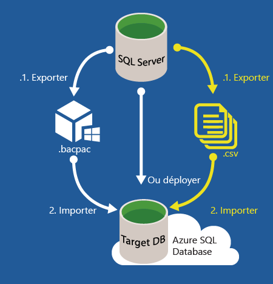
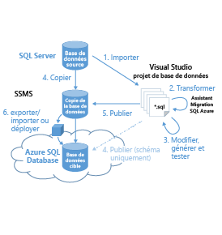

<properties
   pageTitle="Migration d’une base de données SQL Server vers une base de données SQL Azure"
   description="Microsoft Azure SQL Database, déployer base de données, migration base de données, importer base de données, exporter base de données, assistant de migration"
   services="sql-database"
   documentationCenter=""
   authors="carlrabeler"
   manager="jeffreyg"
   editor=""/>

<tags
   ms.service="sql-database"
   ms.devlang="NA"
   ms.topic="article"
   ms.tgt_pltfrm="NA"
   ms.workload="data-management"
   ms.date="10/12/2015"
   ms.author="carlrab"/>

# Migration d’une base de données SQL Server vers une base de données SQL Azure

La complexité du déplacement de votre base de données locale vers une base de données SQL Azure varie selon la conception de votre base de données et de votre application, et votre tolérance aux temps d'arrêt. Pour les bases de données compatibles, la migration vers une base de données SQL Azure s’effectue en toute simplicité. Quant à l’opération de déplacement de données, elle ne nécessite que peu, voire aucune modification du schéma et ne requiert aucune refonte des applications. [Azure SQL Database V12](../sql-database-v12-whats-new.md) offre une compatibilité moteur quasi-totale avec SQL Server 2014 et SQL Server 2016. La plupart des instructions relatives au langage Transact-SQL pour SQL Server 2016 sont entièrement prises en charge dans la base de données SQL Microsoft Azure. Cela inclut les types de données, les opérateurs et les fonctions du curseur chaîne, arithmétiques et logiques de SQL Server, ainsi que les autres éléments Transact-SQL dont dépendent de la plupart des applications. Les fonctions partiellement ou pas du tout prises en charge sont généralement associées à des différences liées à la façon dont la base de données SQL gère la base de données (fichier, haute disponibilité et fonctionnalités de sécurité) ou pour les fonctionnalités d’objectif spécial comme le service broker. Étant donné que la base de données SQL isole les nombreuses fonctionnalités de dépendance sur la base de données master, de nombreuses activités au niveau du serveur sont inappropriées et ainsi non prises en charge. Les fonctionnalités déconseillées dans SQL Server ne sont généralement pas prises en charge dans la base de données SQL. Les bases de données et applications qui reposent sur des [fonctions partiellement ou pas du tout prises en charge](../sql-database-transact-sql-information.md) ont besoin d'une nouvelle ingénierie avant de pouvoir être migrées.

Procédure à suivre pour migrer une base de données SQL Server vers une base de données SQL Azure :

 1. [Déterminer la compatibilité de votre base de données](#determine-if-your-database-is-compatible)
 2. [Si elle n’est pas compatible, résoudre les problèmes de compatibilité de base de données](#fix-database-compatibility-issues)
 3. [Migrer une base de données compatible](#options-to-migrate-a-compatible-database-to-azure-sql-database)

>[AZURE.NOTE]Pour migrer d'autres types de bases de données, notamment Microsoft Access, Sybase, MySQL Oracle et DB2, vers une base de données SQL Azure, consultez l'[Assistant Migration SQL Server](http://blogs.msdn.com/b/ssma/).

## Déterminer la compatibilité de votre base de données
Vous pouvez vous appuyer sur deux méthodes pour déterminer si votre base de données source est compatible. - Exporter une application de la couche Données : cette méthode utilise un assistant dans Management Studio pour analyser votre base de données et affiche les éventuels problèmes de compatibilité de la base de données sur la console. - SQLPackage : cette méthode utilise l'utilitaire de ligne de commande SQLPackage.exe [sqlpackage.exe](https://msdn.microsoft.com/library/hh550080.aspx) pour analyser votre base de données et générer un rapport. SQLPackage est fourni avec Visual Studio et SQL Server.

> [AZURE.NOTE]Il existe une troisième méthode qui utilise des fichiers de trace comme informations sources supplémentaires pour tester la compatibilité au niveau de l'application ainsi qu'au niveau de la base de données. Il s'agit de l'[Assistant Migration SQL Azure](http://sqlazuremw.codeplex.com/), un outil gratuit disponible sur Codeplex. Cet outil peut toutefois détecter des erreurs de compatibilité qui posaient problème sur la version 11 de la base de données SQL Azure mais qui ont été résolues dans la version 12.

Si des incompatibilités de base de données sont détectées, vous devrez les corriger pour pouvoir migrer votre base de données vers une base de données SQL Azure. Pour obtenir des instructions sur la résolution des problèmes de compatibilité de base de données, consultez la page [Résoudre les problèmes de compatibilité de base de données](#fix-database-compatibility-issues).

> [AZURE.IMPORTANT]Ces options ne permettent pas d’intercepter tous les problèmes de compatibilité entre les différents niveaux de bases de données SQL Server (c’est-à-dire les niveaux 90, 100 et 110). Si vous effectuez la migration à partir d’une base de données d’ancienne génération (niveaux 80, 90, 100 et 110), vous devrez dans un premier temps procéder à une mise à niveau (au moins dans l’environnement de développement). Une fois que vous aurez installé SQL Server 2014 ou une version ultérieure, vous pourrez migrer vers la base de données SQL Azure.

## Déterminer la compatibilité de votre base de données à l’aide de l’utilitaire sqlpackage.exe

1. Ouvrez une invite de commandes et modifiez le répertoire contenant la version la plus récente de sqlpackage.exe. Cet utilitaire est fourni avec Visual Studio et SQL Server. Vous pouvez également [télécharger](https://msdn.microsoft.com/library/mt204009.aspx) la dernière version de SQL Server Data Tools pour obtenir cet utilitaire.
2. Exécutez la commande sqlpackage.exe suivante avec les arguments ci-dessous pour votre environnement :

	'sqlpackage.exe /Action:Export /ssn:< server_name > /sdn:< database_name > /tf:< target_file > /p:TableData=< schema_name.table_name > > < output_file > 2>&1'

	| Argument | Description |
	|---|---|
	| < server_name > | nom du serveur source |
	| < database_name > | nom de la base de données source |
	| < target_file > | nom de fichier et emplacement du fichier BACPAC |
	| < schema_name.table_name > | tables pour lesquelles les données seront générées dans le fichier cible |
	| < output_file > | nom de fichier et emplacement du fichier de sortie avec des erreurs, le cas échéant |

	L’argument /p:TableName est utilisé afin de tester uniquement la compatibilité de base de données en vue d’une exportation vers Azure SQL DB V12. Nous ne cherchons pas en effet à exporter les données de toutes les tables. Malheureusement, l’argument d’exportation de sqlpackage.exe ne permet pas de n’extraire aucune table. Vous devrez donc spécifier une petite table. Le fichier < output_file > contiendra le rapport d'erreurs. La chaîne "> 2>&1" dirige le résultat standard et l'erreur standard générés par l'exécution de la commande vers le fichier de sortie spécifié.

	

3. Ouvrez le fichier de sortie et passez en revue les erreurs de compatibilité, le cas échéant. Pour obtenir des instructions sur la résolution des problèmes de compatibilité de base de données, consultez la page [Résoudre les problèmes de compatibilité de base de données](#fix-database-compatibility-issues).

	

## Déterminer la compatibilité de votre base de données à l’aide de l’option Exporter une application de la couche Données

1. Vérifiez que vous disposez de la version 13.0.600.65 ou d’une version ultérieure de SQL Server Management Studio. Les nouvelles versions de Management Studio sont mises à jour tous les mois afin de refléter les mises à jour publiées sur le portail Azure.

 	 >[AZURE.IMPORTANT]Téléchargez la [dernière](https://msdn.microsoft.com/library/mt238290.aspx) version de SQL Server Management Studio. Nous vous recommandons d’utiliser systématiquement la dernière version de Management Studio.

2. Ouvrez Management Studio et connectez-vous à votre base de données source dans l’Explorateur d’objets.
3. Dans l'Explorateur d'objets, cliquez avec le bouton droit de la souris sur la base de données source, pointez sur **Tâches**, puis cliquez sur **Exporter une application de la couche Données**.

	

4. Dans l'Assistant Exportation, cliquez sur **Suivant**, puis sous l'onglet **Paramètres**, configurez l'exportation de manière à enregistrer le fichier BACPAC sur le disque local ou dans un objet blob Azure. L’enregistrement du fichier BACPAC ne pourra s’effectuer que si vous ne rencontrez aucun problème de compatibilité de base de données. Si des problèmes de compatibilité sont détectés, ils s’afficheront sur la console.

	

5. Cliquez sur l'**onglet Avancé** et décochez la case **Sélectionner tout** pour ignorer l'exportation des données. À ce stade, nous ne cherchons qu’à tester la compatibilité.

	

6. Ensuite, cliquez sur **Suivant**, puis sur **Terminer**. Les éventuels problèmes de compatibilité de base de données s’afficheront une fois le schéma validé par l’Assistant.

	

7. Si aucune erreur n’apparaît, votre base de données est compatible : vous êtes donc prêt pour la migration. Si des erreurs sont détectées, vous devez les corriger. Pour afficher les erreurs, cliquez sur **Erreur** au niveau de **Schéma de validation**. Pour savoir comment résoudre ces erreurs, consultez la page [Résoudre les problèmes de compatibilité de base de données](#fix-database-compatibility-issues).

	

8.	Si le fichier *.BACPAC est correctement généré, votre base de données est alors compatible avec la base de données SQL, et vous êtes prêt pour la migration.

## Options de migration d’une base de données compatible vers la base de données SQL Azure

Après avoir vérifié que vous disposez d'une base de données compatible, vous devez choisir votre méthode de migration. Tout d'abord, vous devez décider si vous pouvez vous permettre de sortir la base de données de la production pendant la migration. Dans le cas contraire, utilisez la réplication de transaction SQL Server, comme indiqué ci-dessous. Si vous pouvez vous permettre un temps d'arrêt ou si vous effectuez un test de migration d'une base de données de production que vous envisagez de migrer à l'aide de la réplication transactionnelle, examinez l'une des trois méthodes suivantes.

### Migration d'une base de données compatible avec temps d'arrêt   
La liste suivante décrit les options de migration d'une base de données compatible vers une base de données SQL Azure lorsque vous pouvez vous permettre un temps d'arrêt pendant la migration et avant de rediriger les utilisateurs et les applications vers la base de données migrée dans la base de données SQL Azure. Avec ces méthodes, vous migrez votre base de données telle qu'elle existe à un certain point dans le temps.

> [AZURE.WARNING]Avant de migrer votre base de données à l'aide d'une de ces méthodes, assurez-vous qu'aucune transaction active n'est en cours pour garantir la cohérence transactionnelle pendant la migration. Il existe de nombreuses méthodes pour suspendre une base de données, que ce soit en désactivant la connectivité des clients ou en créant un [instantané de base de données](https://msdn.microsoft.com/library/ms175876.aspx).

- Pour les petites et moyennes bases de données, la migration d’une base de données SQL Server 2005 ou version ultérieure [compatible](#determine-if-your-database-is-compatible) revient à exécuter l’[Assistant de déploiement de base de données dans une base de données Microsoft Azure](#use-deploy-database-to-microsoft-azure-database-wizard) dans SQL Server Management Studio. Si vous avez des problèmes de connectivité (absence de connectivité, faible bande passante ou problèmes de délai d’expiration), vous pouvez [utiliser un fichier BACPAC pour effectuer la migration](#use-a-bacpac-to-migrate-a-sql-server-database-to-azure-sql-database) d’une base de données SQL Server vers la base de données SQL Azure.
- Pour les bases de données plus volumineuses, vous pouvez [utiliser un fichier BACPAC pour effectuer la migration](#use-a-bacpac-to-migrate-a-sql-server-database-to-azure-sql-database) d’une base de données SQL Server vers la base de données SQL Azure. Cette méthode s’applique également si vous rencontrez des problèmes de connectivité. Cette méthode vous permet d'utiliser SQL Server Management Studio pour exporter les données et le schéma dans un fichier [BACPAC](https://msdn.microsoft.com/library/ee210546.aspx#Anchor_4) (enregistré en local ou dans un objet blob Azure), puis d'importer le fichier BACPAC dans votre instance SQL Azure. Si vous enregistrez le fichier BACPAC dans un objet blob Azure, vous pouvez également importer ce fichier à partir du [portail Azure](sql-database-import.md) ou [à l'aide de PowerShell](sql-database-import-powershell.md).
- Pour les bases de données plus volumineuses, vous obtiendrez les meilleures performances en faisant migrer séparément le schéma et les données. Avec cette méthode, créez un [fichier BACPAC sans données](#use-a-bacpac-to-migrate-a-sql-server-database-to-azure-sql-database) et importez ce fichier BACPAC dans la base de données SQL Azure. Une fois le schéma importé dans la base de données SQL Azure, vous pouvez utiliser l'utilitaire [BCP](https://msdn.microsoft.com/library/ms162802.aspx) pour extraire les données dans des fichiers plats, puis importer ces fichiers dans la base de données SQL Azure.

	 

### Migration d'une base de données compatible sans temps d'arrêt

Lorsque vous ne pouvez pas vous permettre de sortir votre base de données SQL Server de la production pendant la migration, vous pouvez utiliser la réplication transactionnelle SQL Server comme solution de migration. Avec la réplication transactionnelle, toutes les modifications apportées à vos données ou à votre schéma qui se produisent entre le début et à la fin de la migration s'afficheront dans votre base de données SQL Azure. Une fois la migration terminée, vous devez modifier la chaîne de connexion de vos applications afin de les pointer vers votre base de données SQL Azure au lieu de votre base de données locale. Une fois que la réplication transactionnelle a appliqué toutes les modifications restantes sur votre base de données locale et que toutes vos applications pointent vers la base de données Azure, vous pouvez désinstaller en toute sécurité la réplication en conservant votre base de données SQL Azure comme système de production.

 

La réplication transactionnelle est une technologie intégrée à SQL Server depuis SQL Server 6.5. Il s'agit d'une technologie très mature et éprouvée que la plupart des administrateurs de bases de données maîtrisent parfaitement. Avec la [version préliminaire de SQL Server 2016](http://www.microsoft.com/server-cloud/products/sql-server-2016/), il est désormais possible de configurer votre base de données SQL Azure comme un [abonné de réplication transactionnelle](https://msdn.microsoft.com/library/mt589530.aspx) à votre publication locale. La configuration dans Management Studio est identique à la configuration d'un abonné de réplication transactionnelle sur un serveur local. Ce scénario est pris en charge avec les versions SQL Server suivantes :

 - SQL Server 2016 CTP3 (version préliminaire) et versions ultérieures 
 - SQL Server 2014 SP1 CU3 et versions ultérieures
 - SQL Server 2014 RTM CU10 et versions ultérieures
 - SQL Server 2012 SP2 CU8 et versions ultérieures
 - SQL Server 2013 SP3 dès sa sortie

Vous pouvez également utiliser la réplication transactionnelle pour migrer un sous-ensemble de votre base de données locale. La publication que vous répliquez vers une base de données SQL Azure peut être limitée à un sous-ensemble des tables dans la base de données en cours de réplication. Par ailleurs, pour chaque table répliquée, vous pouvez limiter les données à un sous-ensemble de lignes et/ou un sous-ensemble de colonnes.

## Utiliser l’Assistant de déploiement de base de données dans une base de données Microsoft Azure

Cet Assistant, disponible dans SQL Server Management Studio, permet de migrer une base de données SQL Server 2005 ou version ultérieure [compatible](#determine-if-your-database-is-compatible) directement dans votre instance de serveur logique SQL Azure.

> [AZURE.NOTE]Les étapes ci-dessous supposent que vous avez déjà [déployé](../sql-database-get-started.md) votre instance logique SQL Azure et que vous disposez des informations de connexion.

1. Vérifiez que vous disposez de la version 13.0.600.65 ou d’une version ultérieure de SQL Server Management Studio. Les nouvelles versions de Management Studio sont mises à jour tous les mois afin de refléter les mises à jour publiées sur le portail Azure.

	 >[AZURE.IMPORTANT]Téléchargez la [dernière](https://msdn.microsoft.com/library/mt238290.aspx) version de SQL Server Management Studio. Nous vous recommandons d’utiliser systématiquement la dernière version de Management Studio.

2. Ouvrez Management Studio et connectez-vous à votre base de données source dans l’Explorateur d’objets.
3. Dans l'Explorateur d'objets, cliquez avec le bouton droit de la souris sur la base de données source, pointez sur **Tâches**, puis cliquez sur **Déployer une base de données sur Microsoft Azure SQL Database...**

	

4.	Dans l'Assistant déploiement, cliquez sur **Suivant**, puis cliquez sur **Connecter** pour configurer la connexion à votre serveur de base de données SQL Azure.

	

5. Dans la boîte de dialogue Se connecter au serveur, entrez vos informations de connexion à votre serveur de base de données SQL Azure.

	

5.	Renseignez le **Nouveau nom de la base de données** résidant sur la base de données SQL Azure, définissez l'**Édition de Microsoft Azure SQL Database** (niveau de service), la **Taille maximale de base de données**, l'**Objectif de service** (niveau de performance) et le **Nom de fichier temporaire** à attribuer au fichier BACPAC qui sera créé par cet Assistant au cours de la migration. Pour plus d'informations sur les niveaux de service et les niveaux de performance, voir [Niveaux de service de base de données SQL Azure](sql-database-service-tiers.md).

	

6.	Terminez l’Assistant pour migrer la base de données. Selon la taille et la complexité de la base de données, le déploiement peut durer de quelques minutes à plusieurs heures.
7.	À l’aide de l’Explorateur d’objets, connectez-vous à la base de données que vous venez de déployer sur votre serveur de base de données SQL Azure.
8.	Dans le portail Azure, vous pouvez afficher votre base de données et ses propriétés.

## Utiliser un fichier BACPAC pour migrer une base de données SQL Server vers une base de données SQL Azure

Si vous utilisez des bases de données volumineuses ou si vous rencontrez des problèmes de connectivité, vous pouvez décomposer le processus de migration en deux étapes distinctes. Vous pouvez exporter le schéma et ses données dans un fichier [BACPAC](https://msdn.microsoft.com/library/ee210546.aspx#Anchor_4) en procédant de l'une des manières suivantes :

- [Exporter vers un fichier BACPAC à l’aide de SQL Server Management Studio](#export-a-compatible-sql-server-database-to-a-bacpac-file-using-sql-server-management-studio)
- [Exporter vers un fichier BACPAC à l’aide de SqlPackage](#export-a-compatible-sql-server-database-to-a-bacpac-file-using-sqlpackage)

Vous pouvez stocker ce fichier BACPAC en local ou dans un objet blob Azure. Vous disposez ensuite de plusieurs méthodes pour l’importer dans la base de données SQL Azure.

- [Importer un fichier BACPAC dans la base de données SQL Azure à l’aide de SQL Server Management Studio](#import-from-a-bacpac-file-into-azure-sql-database-using-sql-server-management-studio)
- [Importer un fichier BACPAC dans la base de données SQL Azure à l’aide de SqlPackage](#import-from-a-bacpac-file-into-azure-sql-database-using-sqlpackage)
- [Importer un fichier BACPAC dans la base de données SQL Azure à l’aide du portail Azure](sql-database-import.md)
- [Importer un fichier BACPAC dans la base de données SQL Azure à l’aide de PowerShell](sql-database-import-powershell.md)

## Exporter une base de données SQL Server compatible vers un fichier BACPAC à l’aide de SQL Server Management Studio

Procédez comme suit pour exporter une base de données SQL Server [compatible](#determine-if-your-database-is-compatible) vers un fichier BACPAC à l'aide de Management Studio.

1. Vérifiez que vous disposez de la version 13.0.600.65 ou d’une version ultérieure de SQL Server Management Studio. Les nouvelles versions de Management Studio sont mises à jour tous les mois afin de refléter les mises à jour publiées sur le portail Azure.

	 >[AZURE.IMPORTANT]Téléchargez la [dernière](https://msdn.microsoft.com/library/mt238290.aspx) version de SQL Server Management Studio. Nous vous recommandons d’utiliser systématiquement la dernière version de Management Studio.

2. Ouvrez Management Studio et connectez-vous à votre base de données source dans l’Explorateur d’objets.

	

3. Dans l'Explorateur d'objets, cliquez avec le bouton droit de la souris sur la base de données source, pointez sur **Tâches**, puis cliquez sur **Exporter une application de la couche Données**.

	

4. Dans l’Assistant Exportation, configurez l’exportation de manière à enregistrer le fichier BACPAC sur le disque local ou dans un objet blob Azure. Le fichier BACPAC exporté inclut toujours le schéma de base de données complet et, par défaut, les données de toutes les tables. Utilisez l’onglet Avancé si vous souhaitez exclure les données de toutes les tables ou de certaines d’entre elles uniquement. Vous pouvez, par exemple, choisir d’exporter uniquement les données des tables de référence au lieu d’exporter toutes les tables.

	

## Exporter une base de données SQL Server compatible vers un fichier BACPAC à l’aide de SqlPackage

Procédez comme suit pour exporter une base de données [compatible](#determine-if-your-database-is-compatible) vers un fichier BACPAC à l'aide de l'utilitaire de ligne de commande [SqlPackage.exe](https://msdn.microsoft.com/library/hh550080.aspx).

> [AZURE.NOTE]Les étapes ci-dessous supposent que vous avez déjà configuré un serveur de base de données SQL Azure, que vous disposez des informations de connexion et que vous avez vérifié la compatibilité de votre base de données source.

1. Ouvrez une invite de commandes et modifiez un répertoire contenant l’utilitaire de ligne de commande sqlpackage.exe Cet utilitaire est fourni avec Visual Studio et SQL Server.
2. Exécutez la commande sqlpackage.exe suivante avec les arguments ci-dessous pour votre environnement :

	'sqlpackage.exe /Action:Export /ssn:< server_name > /sdn:< database_name > /tf:< target_file >

	| Argument | Description |
	|---|---|
	| < server_name > | nom du serveur source |
	| < database_name > | nom de la base de données source |
	| < target_file > | nom de fichier et emplacement du fichier BACPAC |

	

## Importer un fichier BACPAC dans une base de données SQL Azure à l’aide de SQL Server Management Studio

Procédez comme suit pour importer un fichier BACPAC dans une base de données SQL Azure.

> [AZURE.NOTE]Les étapes ci-dessous supposent que vous avez déjà déployé votre instance logique SQL Azure et que vous disposez des informations de connexion.

1. Vérifiez que vous disposez de la version 13.0.600.65 ou d’une version ultérieure de SQL Server Management Studio. Les nouvelles versions de Management Studio sont mises à jour tous les mois afin de refléter les mises à jour publiées sur le portail Azure.

	> [AZURE.IMPORTANT]Téléchargez la [dernière](https://msdn.microsoft.com/library/mt238290.aspx) version de SQL Server Management Studio. Nous vous recommandons d’utiliser systématiquement la dernière version de Management Studio.

2. Ouvrez Management Studio et connectez-vous à votre base de données source dans l’Explorateur d’objets.

	

3. Une fois le fichier BACPAC créé, connectez-vous à votre serveur de base de données SQL Azure, cliquez avec le bouton droit de la souris sur le dossier **Bases de données**, puis cliquez sur **Importer une application de la couche Données**.

    

4.	Dans l’Assistant d’importation, sélectionnez le fichier BACPAC que vous venez d’exporter pour créer la base de données dans Azure SQL Database.

    

5.	Renseignez le **Nouveau nom de la base de données** résidant sur la base de données SQL Azure, définissez l'**Édition de Microsoft Azure SQL Database** (niveau de service), la **Taille maximale de base de données** et l'**Objectif de service** (niveau de performance).

    

6.	Cliquez sur **Suivant**, puis cliquez sur **Terminer** pour importer le fichier BACPAC dans une nouvelle base de données sur le serveur de base de données SQL Azure.

7. À l’aide de l’Explorateur d’objets, connectez-vous à la base de données que vous venez de déployer sur votre serveur de base de données SQL Azure.

8.	Dans le portail Azure, vous pouvez afficher votre base de données et ses propriétés.

## Importer un fichier BACPAC dans une base de données SQL Azure à l’aide de SqlPackage

Procédez comme suit pour importer une base de données SQL Server compatible à partir d'un fichier BACPAC à l'aide de l'utilitaire de ligne de commande [SqlPackage.exe](https://msdn.microsoft.com/library/hh550080.aspx).

> [AZURE.NOTE]Les étapes ci-dessous supposent que vous avez déjà configuré un serveur de base de données SQL Azure et que vous disposez des informations de connexion.

1. Ouvrez une invite de commandes et modifiez un répertoire contenant l’utilitaire de ligne de commande sqlpackage.exe Cet utilitaire est fourni avec Visual Studio et SQL Server.
2. Exécutez la commande sqlpackage.exe suivante avec les arguments ci-dessous pour votre environnement :

	'sqlpackage.exe /Action:Import /tsn:< server_name > /tdn:< database_name > /tu:< user_name > /tp:< password > /sf:< source_file >

	| Argument | Description |
	|---|---|
	| < server_name > | nom du serveur cible |
	| < database_name > | nom de la base de données cible |
	| < user_name > | nom d'utilisateur sur le serveur cible |
	| < password > | mot de passe de l'utilisateur |
	| < source_file > | nom de fichier et emplacement du fichier BACPAC en cours d'importation |

	

## Résoudre les problèmes de compatibilité de base de données

Si vous constatez que votre base de données SQL Server source n'est pas compatible, vous disposez de plusieurs options pour corriger les problèmes de compatibilité que vous avez [identifiés précédemment](#determine-if-your-database-is-compatible).

- Utiliser l'[Assistant Migration SQL Azure](http://sqlazuremw.codeplex.com/). Vous pouvez utiliser cet outil Codeplex pour générer un script T-SQL à partir d’une base de données source incompatible, qui sera ensuite transformé par l’Assistant de manière à garantir sa compatibilité avec la base de données SQL. Il vous suffit alors de vous connecter à la base de données SQL Azure pour exécuter le script. Cet outil analyse également les fichiers de trace afin de déterminer les problèmes de compatibilité. Ce script peut être généré avec un schéma uniquement, ou peut inclure des données au format BCP. Pour obtenir une documentation supplémentaire, y compris des instructions pas à pas, consultez la rubrique [SQL Azure Migration Wizard](http://sqlazuremw.codeplex.com/) sur le site Codeplex.  

 

 >[AZURE.NOTE]Remarque : les schémas non compatibles que l’assistant est susceptible de détecter ne sont pas tous traités par ses transformations intégrées. Un script non compatible qui ne peut pas être traité est signalé comme une erreur et des commentaires sont insérés dans le script généré. Si de nombreuses erreurs sont détectées, utilisez Visual Studio ou SQL Server Management Studio pour examiner et résoudre chaque erreur que l’Assistant Migration SQL Server ne permet pas de corriger.

- Utilisez Visual Studio. Vous pouvez utiliser Visual Studio pour importer le schéma de base de données dans un projet de base de données Visual Studio à des fins d’analyse. Pour l’analyse, vous devez désigner la plate-forme cible du projet en tant que base de données V12, puis réalisez le projet. Si la version est réussie, la base de données est compatible. Si la version échoue, vous pouvez résoudre les erreurs dans SQL Server Data Tools pour Visual Studio (« SSDT »). Une fois la génération du projet réussie, vous pouvez de nouveau publier ce dernier en tant que copie de base de données source, puis utiliser la fonction de comparaison des données de SSDT pour copier les données de la base de données source vers la base de données Azure SQL V12 compatible. Cette base de données ainsi mise à jour est ensuite déployée dans la base de données SQL Azure selon les méthodes [abordées précédemment](#options-to-migrate-a-compatible-database-to-azure-sql-database).

 

 >[AZURE.NOTE]Si seule la migration de schéma est requise, vous pouvez publier le schéma directement depuis Visual Studio vers la base de données SQL Azure. Utilisez cette méthode lorsque le schéma de base de données nécessite un plus grand nombre de modifications qui peuvent être gérées par l’Assistant seul.

- SQL Server Management Studio. Vous pouvez résoudre les problèmes dans Management Studio à l'aide de différentes commandes Transact-SQL, telles que **ALTER DATABASE**.

<!---HONumber=AcomDC_1210_2015-->