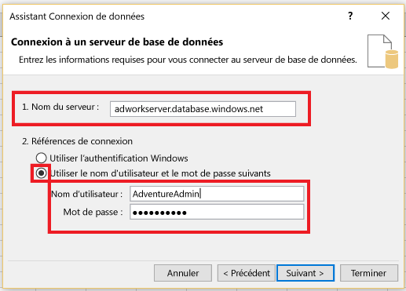
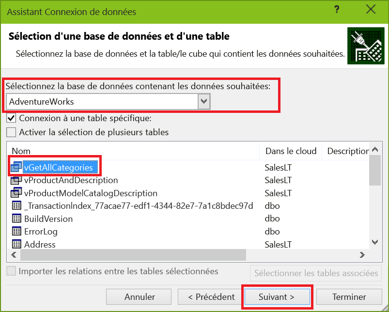
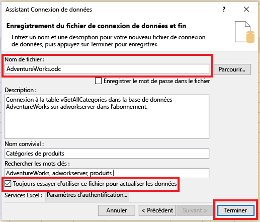
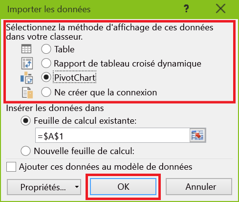
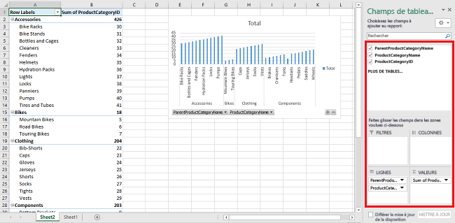

<properties
	pageTitle="Connectez Excel à la base de données SQL | Microsoft Azure"
	description="Découvrez comment connecter Microsoft Excel à la base de données SQL Azure dans le cloud. Importez des données dans Excel pour les rapports et l’exploration des données."
	services="sql-database"
	keywords="connecter excel à sql, importer des données vers excel"
	documentationCenter=""
	authors="joseidz"
	manager="jhubbard"
	editor=""/>

<tags
	ms.service="sql-database"
	ms.workload="data-management"
	ms.tgt_pltfrm="na"
	ms.devlang="na"
	ms.topic="get-started-article"
	ms.date="07/05/2016"
	ms.author="joseidz"/>

# Didacticiel sur la base de données SQL : Connectez Excel à une base de données SQL Azure et créez un rapport

> [AZURE.SELECTOR]
- [Visual Studio](sql-database-connect-query.md)
- [SSMS](sql-database-connect-query-ssms.md)
- [Excel](sql-database-connect-excel.md)

Apprenez à connecter Excel à une base de données SQL dans le cloud afin de pouvoir importer des données et créer des tables et des graphiques basés sur des valeurs de la base de données. Dans ce didacticiel, vous allez configurer la connexion entre Excel et une table de base de données, enregistrer le fichier qui stocke les données et les informations de connexion pour Excel, puis créer un graphique croisé dynamique à partir des valeurs de base de données.

Vous avez besoin d’une base de données SQL dans Azure avant de commencer. Si vous n’en avez pas, consultez [Créer votre première base de données SQL](sql-database-get-started.md) pour obtenir une base de données avec des données exemple opérationnelle en quelques minutes. Dans cet article, vous allez importer des données d’exemple dans Excel à partir de cet article, mais vous pouvez suivre des étapes similaires sur vos propres données.

Vous aurez besoin d’une copie d’Excel. Cet article utilise [Microsoft Excel 2016](https://products.office.com/fr-FR/).

## Connecter Excel à une base de données SQL et créer un fichier odc

1.	Pour connecter Excel à la base de données SQL, ouvrez Excel, puis créez un nouveau classeur ou ouvrez un classeur Excel existant.

2.	Dans la barre de menus en haut de la page, cliquez sur **Données**, cliquez sur **À partir d’autres sources**, puis cliquez sur **À partir de SQL Server**.

	

	L’Assistant Connexion de données s’ouvre.

3.	Dans la boîte de dialogue **Connexion à un serveur de base de données**, saisissez le **Nom du serveur** de la base de données SQL auquel vous voulez vous connecter selon le format *<**nom\_serveur**>.database.windows.net*. Par exemple, **adworkserver.database.windows.net**.

4.	Sous **Références de connexion**, cliquez sur **Utiliser le nom d’utilisateur et le mot de passe suivants :**, saisissez le **Nom d’utilisateur** et le **Mot de passe** que vous avez configurés pour le serveur de base de données SQL lorsque vous l’avez créé, puis cliquez sur **Suivant**.

    

	> [AZURE.TIP] Selon votre environnement réseau, vous n’êtes peut-être pas en mesure de vous connecter ou vous risquez de perdre la connexion si le serveur de base de données SQL n’autorise pas le trafic à partir de l’adresse IP du client. Accédez au [portail Azure](https://portal.azure.com/), cliquez sur Serveurs SQL, cliquez sur votre serveur, cliquez sur le pare-feu sous paramètres et ajoutez l’adresse IP du client. Pour plus d’informations, voir [Configuration des paramètres du pare-feu](sql-database-configure-firewall-settings.md)

5. Dans la boîte de dialogue **Sélection d’une base de données et d’une table**, sélectionnez la base de données que vous souhaitez utiliser dans la liste, puis cliquez sur les tables ou vues que vous souhaitez utiliser (nous avons choisi **vGetAllCategories**), puis cliquez sur **Suivant**.

	

    La boîte de dialogue **Enregistrement du fichier de connexion de données et fin** s’ouvre, dans laquelle vous fournissez des informations sur le fichier de connexion de base de données Office (*.odc) utilisé par Excel. Vous pouvez laisser les valeurs par défaut ou personnaliser vos sélections.

6. Vous pouvez laisser les valeurs par défaut, mais notez le **Nom de fichier** en particulier. Une **Description**, un **Nom convivial**, et des **Mots clés** vous aident, ainsi que d’autres utilisateurs à vous souvenir de l’élément auquel vous vous connectez et à rechercher la connexion. Cliquez sur **Toujours essayer d’utiliser ce fichier pour actualiser les données** si vous souhaitez que les informations de connexion soient stockées dans le fichier odc afin de permettre l’actualisation lorsque vous vous y connectez, puis cliquez sur **Terminer**.

    

    La boîte de dialogue **Importer des données** s’affiche.

## Importer les données dans Excel et créer un graphique croisé dynamique
Maintenant que vous avez établi la connexion et créé le fichier avec les données et les informations de connexion, vous procédez à la lecture pour importer les données.

1. Dans la boîte de dialogue **Importer les données**, cliquez sur l’option souhaitée pour présenter vos données dans la feuille de calcul, puis cliquez sur **OK**. Nous avons choisi **Graphique croisé dynamique**. Vous pouvez également choisir de créer une **Nouvelle feuille de calcul** ou d’**Ajouter ces données au modèle de données**. Pour plus d’informations sur les modèles de données, consultez la page [Créer un modèle de données dans Excel](https://support.office.com/article/Create-a-Data-Model-in-Excel-87E7A54C-87DC-488E-9410-5C75DBCB0F7B). Cliquez sur **Propriétés** pour découvrir les informations relatives au fichier odc que vous avez créé lors de l’étape précédente et choisir les options d’actualisation des données.

	

    La feuille de calcul comporte désormais un tableau et un graphique croisés dynamiques vides.

8. Sous **Champs de tableau croisé dynamique**, cochez toutes les cases correspondant aux champs que vous souhaitez afficher.

	

> [AZURE.TIP] Si vous souhaitez connecter d’autres classeurs Excel et feuilles de calcul à la base de données, cliquez sur **Données**, **Connexions**, **Ajouter**, sélectionnez la connexion que vous avez créée dans la liste, puis cliquez sur **Ouvrir**. 

## Étapes suivantes

- Découvrez comment [se connecter à la base de données SQL avec SQL Server Management Studio](sql-database-connect-query-ssms.md) pour une interrogation et une analyse avancées.
- En savoir plus sur les avantages des [pools élastiques](sql-database-elastic-pool.md).
- Découvrez comment [créer une application web qui se connecte à la base de données SQL sur le serveur principal](../app-service-web/web-sites-dotnet-deploy-aspnet-mvc-app-membership-oauth-sql-database.md).

<!---HONumber=AcomDC_0706_2016-->