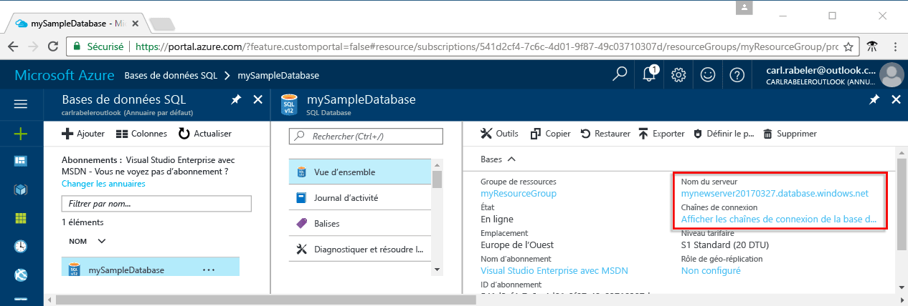

# <a name="azure-sql-database-use-net-c-to-connect-and-query-data"></a>Azure SQL Database : utilisez .NET (C#) pour vous connecter et interroger des données

Ce guide de démarrage rapide indique comment utiliser [C# et ADO.NET](https://msdn.microsoft.com/library/kb9s9ks0.aspx) pour se connecter à une base de données SQL Azure, puis utiliser les instructions Transact-SQL pour interroger, insérer, mettre à jour et supprimer des données dans la base de données à partir des plateformes Windows, Mac OS et Ubuntu Linux.

Ce guide de démarrage rapide utilise comme point de départ les ressources créées dans l’une de ces instructions de démarrage rapide :

- [Créer une base de données - Portail](sql-database-get-started-portal.md)
- [Créer une base de données - CLI](sql-database-get-started-cli.md)

## <a name="install-net"></a>Installer .NET

### <a name="windows-net-framework-and-net-core"></a>**Windows .NET Framework et .NET Core**

Visual Studio 2017 Community est un IDE complet, extensible et gratuit qui permet de créer des applications modernes pour Android, iOS et Windows, ainsi que des applications web et de base de données et des services cloud. Vous pouvez soit installer le composant .NET Framework complet, soit installer uniquement .NET Core. Les extraits de code du guide de démarrage rapide fonctionnent dans les deux cas. Si vous disposez déjà de Visual Studio sur votre ordinateur, ignorez les étapes suivantes.

1. Téléchargez le [programme d’installation](https://go.microsoft.com/fwlink/?LinkId=691978). 
2. Exécutez le programme d’installation et suivez que les invites.

### <a name="mac-os"></a>**Mac OS**
Ouvrez votre terminal et accédez au répertoire dans lequel vous envisagez de créer votre projet .NET Core. Entrez les commandes suivantes pour installer **brew**, **OpenSSL** et **.NET Core**. 

```bash
ruby -e "$(curl -fsSL https://raw.githubusercontent.com/Homebrew/install/master/install)"
brew update
brew install openssl
mkdir -p /usr/local/lib
ln -s /usr/local/opt/openssl/lib/libcrypto.1.0.0.dylib /usr/local/lib/
ln -s /usr/local/opt/openssl/lib/libssl.1.0.0.dylib /usr/local/lib/
```

Installez .NET Core sur macOS. Téléchargez le [programme d’installation officiel](https://go.microsoft.com/fwlink/?linkid=843444). Ce programme d’installation installe les outils et les place dans votre chemin d’accès afin que vous puissiez exécuter dotnet à partir de la Console

### <a name="linux-ubuntu"></a>**Linux (Ubuntu)**
Ouvrez votre terminal et accédez au répertoire dans lequel vous envisagez de créer votre projet .NET Core. Entrez les commandes suivantes pour installer **.NET Core**.

```bash
sudo sh -c 'echo "deb [arch=amd64] https://apt-mo.trafficmanager.net/repos/dotnet-release/ xenial main" > /etc/apt/sources.list.d/dotnetdev.list'
sudo apt-key adv --keyserver hkp://keyserver.ubuntu.com:80 --recv-keys 417A0893
sudo apt-get update
sudo apt-get install dotnet-dev-1.0.1
```

## <a name="get-connection-information"></a>Obtenir des informations de connexion

Récupérez la chaîne de connexion dans le portail Azure. Cette chaîne de connexion vous permet de vous connecter à la base de données SQL Azure.

1. Connectez-vous au [portail Azure](https://portal.azure.com/).
2. Sélectionnez **Bases de données SQL** dans le menu de gauche, puis cliquez sur votre base de données dans la page **Bases de données SQL**. 
3. Dans le volet **Essentials** de votre base de données, vérifiez le nom complet du serveur. 

    

4. Cliquez sur **Afficher les chaînes de connexion de la base de données**.

5. Passez en revue la chaîne de connexion **ADO.NET** complète.

    
    
## <a name="add-systemdatasqlclient"></a>Ajouter System.Data.SqlClient
Lorsque vous utilisez .NET Core, ajoutez System.Data.SqlClient au fichier ***csproj*** de votre projet en tant que dépendance.

```xml
<ItemGroup>
    <PackageReference Include="System.Data.SqlClient" Version="4.3.0" />
</ItemGroup>
```

## <a name="select-data"></a>Sélectionner des données

1. Dans votre environnement de développement, ouvrez un fichier de code vide.
2. Ajoutez ```using System.Data.SqlClient``` à votre fichier de code ([System.Data.SqlClient namespace](https://msdn.microsoft.com/library/system.data.sqlclient.aspx)). 

3. Utilisez [SqlCommand.ExecuteReader](https://msdn.microsoft.com/library/system.data.sqlclient.sqlcommand.executereader.aspx) avec une instruction Transact-SQL [SELECT](https://msdn.microsoft.com/library/ms189499.aspx) pour rechercher des données dans votre base de données Azure SQL Database. Ajoutez les valeurs appropriées pour votre serveur

```csharp
using System;
using System.Data;
using System.Data.SqlClient;

namespace ConsoleApplication1
{
    class Program
    {
        static void Main(string[] args)
        {
            try 
            { 
                SqlConnectionStringBuilder builder = new SqlConnectionStringBuilder();
                builder.DataSource = "your_server.database.windows.net"; 
                builder.UserID = "your_user";            
                builder.Password = "your_password";     
                builder.InitialCatalog = "your_database";

                using (SqlConnection connection = new SqlConnection(builder.ConnectionString))
                {
                    Console.WriteLine("\nQuery data example:");
                    Console.WriteLine("=========================================\n");
                    
                    connection.Open();       
                    StringBuilder sb = new StringBuilder();
                    sb.Append("SELECT TOP 20 pc.Name as CategoryName, p.name as ProductName ");
                    sb.Append("FROM [SalesLT].[ProductCategory] pc ");
                    sb.Append("JOIN [SalesLT].[Product] p ");
                    sb.Append("ON pc.productcategoryid = p.productcategoryid;");
                    String sql = sb.ToString();

                    using (SqlCommand command = new SqlCommand(sql, connection))
                    {
                        using (SqlDataReader reader = command.ExecuteReader())
                        {
                            while (reader.Read())
                            {
                                Console.WriteLine("{0} {1}", reader.GetString(0), reader.GetString(1));
                            }
                        }
                    }                    
                }
            }
            catch (SqlException e)
            {
                Console.WriteLine(e.ToString());
            }
        }
    }
}
```

## <a name="insert-data"></a>Insertion des données

Utilisez [SqlCommand.ExecuteNonQuery](https://msdn.microsoft.com/library/system.data.sqlclient.sqlcommand.executenonquery.aspx) avec une instruction Transact-SQL [INSERT](https://msdn.microsoft.com/library/ms174335.aspx) pour ajouter des données dans votre base de données Azure SQL.

```csharp
using System;
using System.Data;
using System.Data.SqlClient;

namespace ConsoleApplication1
{
    class Program
    {
        static void Main(string[] args)
        {
            try 
            { 
                SqlConnectionStringBuilder builder = new SqlConnectionStringBuilder();
                builder.DataSource = "your_server.database.windows.net"; 
                builder.UserID = "your_user";            
                builder.Password = "your_password";     
                builder.InitialCatalog = "your_database";

                using (SqlConnection connection = new SqlConnection(builder.ConnectionString))
                {
                    Console.WriteLine("\nInsert data example:");
                    Console.WriteLine("=========================================\n");

                    connection.Open();       
                    StringBuilder sb = new StringBuilder();
                    sb.Append("INSERT INTO [SalesLT].[Product] ([Name], [ProductNumber], [Color], [StandardCost], [ListPrice], [SellStartDate]) ");
                    sb.Append("VALUES (@Name, @ProductNumber, @Color, @StandardCost, @ListPrice, @SellStartDate);");
                    String sql = sb.ToString();
                    using (SqlCommand command = new SqlCommand(sql, connection))
                    {
                        command.Parameters.AddWithValue("@Name", "BrandNewProduct");
                        command.Parameters.AddWithValue("@ProductNumber", "200989");
                        command.Parameters.AddWithValue("@Color", "Blue");
                        command.Parameters.AddWithValue("@StandardCost", 75);
                        command.Parameters.AddWithValue("@ListPrice", 80);
                        command.Parameters.AddWithValue("@SellStartDate", "7/1/2016");
                        int rowsAffected = command.ExecuteNonQuery();
                        Console.WriteLine(rowsAffected + " row(s) inserted");
                    }         
                }
            }
            catch (SqlException e)
            {
                Console.WriteLine(e.ToString());
            }
        }
    }
}
```

## <a name="update-data"></a>Mettre à jour des données

Utilisez [SqlCommand.ExecuteNonQuery](https://msdn.microsoft.com/library/system.data.sqlclient.sqlcommand.executenonquery.aspx) avec une instruction Transact-SQL [UPDATE](https://msdn.microsoft.com/library/ms177523.aspx) pour mettre à jour des données dans votre base de données Azure SQL Database.

```csharp
using System;
using System.Data;
using System.Data.SqlClient;

namespace ConsoleApplication1
{
    class Program
    {
        static void Main(string[] args)
        {
            try 
            { 
                SqlConnectionStringBuilder builder = new SqlConnectionStringBuilder();
                builder.DataSource = "your_server.database.windows.net"; 
                builder.UserID = "your_user";            
                builder.Password = "your_password";     
                builder.InitialCatalog = "your_database";

                using (SqlConnection connection = new SqlConnection(builder.ConnectionString))
                {
                    Console.WriteLine("\nUpdate data example");
                    Console.WriteLine("=========================================\n");

                    connection.Open();       
                    StringBuilder sb = new StringBuilder();
                    sb.Append("UPDATE [SalesLT].[Product] SET ListPrice = @ListPrice WHERE Name = @Name;");
                    String sql = sb.ToString();
                    using (SqlCommand command = new SqlCommand(sql, connection))
                    {
                        command.Parameters.AddWithValue("@Name", "BrandNewProduct");
                        command.Parameters.AddWithValue("@ListPrice", 500);
                        int rowsAffected = command.ExecuteNonQuery();
                        Console.WriteLine(rowsAffected + " row(s) updated");
                    }         
                }
            }
            catch (SqlException e)
            {
                Console.WriteLine(e.ToString());
            }
        }
    }
}
```

## <a name="delete-data"></a>Suppression de données

Utilisez [SqlCommand.ExecuteNonQuery](https://msdn.microsoft.com/library/system.data.sqlclient.sqlcommand.executenonquery.aspx) avec une instruction Transact-SQL [DELETE](https://msdn.microsoft.com/library/ms189835.aspx) pour supprimer des données de votre base de données Azure SQL Database.

```csharp
using System;
using System.Data;
using System.Data.SqlClient;

namespace ConsoleApplication1
{
    class Program
    {
        static void Main(string[] args)
        {
            try 
            { 
                SqlConnectionStringBuilder builder = new SqlConnectionStringBuilder();
                builder.DataSource = "your_server.database.windows.net"; 
                builder.UserID = "your_user";            
                builder.Password = "your_password";     
                builder.InitialCatalog = "your_database";

                using (SqlConnection connection = new SqlConnection(builder.ConnectionString))
                {
                    Console.WriteLine("\nDelete data example");
                    Console.WriteLine("=========================================\n");

                    connection.Open();       
                    StringBuilder sb = new StringBuilder();
                    sb.Append("DELETE FROM SalesLT.Product WHERE Name = @Name;");
                    String sql = sb.ToString();
                    using (SqlCommand command = new SqlCommand(sql, connection))
                    {
                        command.Parameters.AddWithValue("@Name", "BrandNewProduct");
                        int rowsAffected = command.ExecuteNonQuery();
                        Console.WriteLine(rowsAffected + " row(s) deleted");
                    }         
                }
            }
            catch (SqlException e)
            {
                Console.WriteLine(e.ToString());
            }
        }
    }
}
```

## <a name="next-steps"></a>Étapes suivantes

- Pour accéder à la documentation .NET, consultez la rubrique [Documentation .NET](https://docs.microsoft.com/dotnet/).
- Pour vous connecter et envoyer des requêtes à l’aide de SQL Server Management Studio, consultez [Se connecter à la base de données SQL avec SQL Server Management Studio et exécuter un exemple de requête T-SQL](sql-database-connect-query-ssms.md).
- Pour vous connecter et exécuter des requêtes à l’aide de Visual Studio Code, consultez l’article décrivant comment [se connecter et effectuer des requêtes avec Visual Studio Code](sql-database-connect-query-vscode.md).
- Pour vous connecter et exécuter des requêtes à l’aide de PHP, consultez l’article décrivant comment [se connecter et effectuer des requêtes avec PHP](sql-database-connect-query-php.md).
- Pour vous connecter et exécuter des requêtes à l’aide de Node.js, consultez l’article décrivant comment [se connecter et effectuer des requêtes avec Node.js](sql-database-connect-query-nodejs.md).
- Pour vous connecter et exécuter des requêtes à l’aide de Java, consultez l’article décrivant comment [se connecter et effectuer des requêtes avec Java](sql-database-connect-query-java.md).
- Pour vous connecter et exécuter des requêtes à l’aide de Python, consultez l’article décrivant comment [se connecter et effectuer des requêtes avec Python](sql-database-connect-query-python.md).
- Pour vous connecter et exécuter des requêtes à l’aide de Ruby, consultez l’article décrivant comment [se connecter et effectuer des requêtes avec Ruby](sql-database-connect-query-ruby.md).

