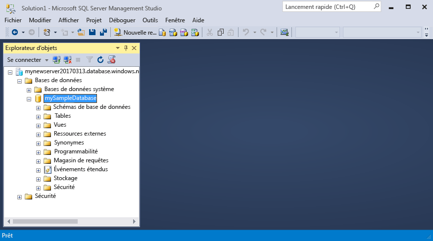
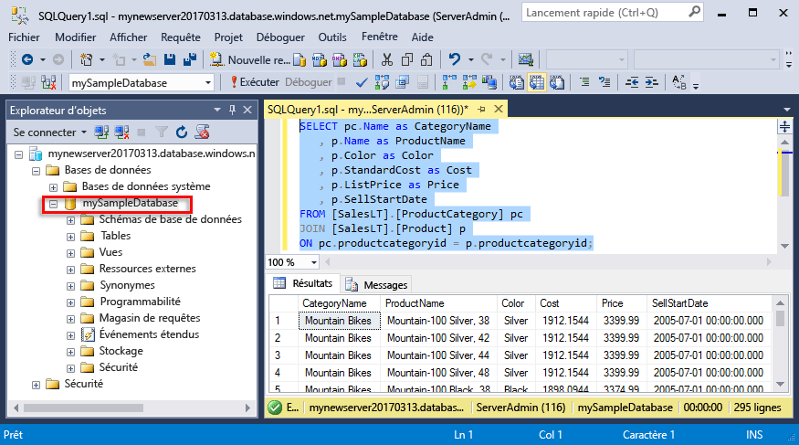

# <a name="azure-sql-database-use-sql-server-management-studio-to-connect-and-query-data"></a>Azure SQL Database : utilisez SQL Server Management Studio pour vous connecter et exécuter des requêtes

[SQL Server Management Studio](https://msdn.microsoft.com/library/ms174173.aspx) (SSMS) est un environnement intégré pour la gestion des infrastructures SQL, allant de SQL Server à SQL Database pour Microsoft Windows. Ce guide de démarrage rapide indique comment utiliser SSMS pour se connecter à une base de données SQL Azure, puis utiliser les instructions Transact-SQL pour interroger, insérer, mettre à jour et supprimer des données dans la base de données. 

## <a name="prerequisites"></a>Composants requis

Ce guide de démarrage rapide utilise comme point de départ les ressources créées dans l’une de ces instructions de démarrage rapide :

- [Créer une base de données - Portail](sql-database-get-started-portal.md)
- [Créer une base de données - CLI](sql-database-get-started-cli.md)
- [Créer une base de données - PowerShell](sql-database-get-started-powershell.md)

Avant de commencer, assurez-vous que vous avez installé la toute dernière version de [SSMS](https://msdn.microsoft.com/library/mt238290.aspx). 

## <a name="sql-server-connection-information"></a>Informations de connexion SQL Server

Obtenez les informations de connexion requises pour la connexion à la base de données SQL Azure. Vous aurez besoin du nom du serveur complet, du nom de la base de données et des informations de connexion dans les procédures suivantes.

1. Connectez-vous au [portail Azure](https://portal.azure.com/).
2. Sélectionnez **Bases de données SQL** dans le menu de gauche, puis cliquez sur votre base de données dans la page **Bases de données SQL**. 
3. Sur la page **Vue d’ensemble** de votre base de données, vérifiez le nom complet du serveur, comme indiqué dans l’image ci-dessous. Vous pouvez pointer sur le nom du serveur pour afficher l’option **Cliquez pour copier**.

    

4. Si vous avez oublié vos informations de connexion à votre serveur Azure SQL Database, accédez à la page du serveur SQL Database pour afficher le nom de l’administrateur du serveur et, si nécessaire, réinitialiser le mot de passe. 

## <a name="connect-to-your-database"></a>Connectez-vous à votre base de données

Utilisez SQL Server Management Studio pour établir une connexion à votre serveur de base de données SQL Azure. 

> [!IMPORTANT]
> Un serveur logique Azure SQL Database écoute sur le port 1433. Si vous essayez de vous connecter à un serveur logique Azure SQL Database à partir d’un pare-feu d’entreprise, ce port doit être ouvert dans le pare-feu d’entreprise pour que vous puissiez vous connecter.
>

1. Ouvrez SQL Server Management Studio.

2. Dans la fenêtre **Se connecter au serveur**, entrez les valeurs suivantes :

   | Paramètre       | Valeur suggérée | Description | 
   | ------------ | ------------------ | ------------------------------------------------- | 
   | **Type de serveur** | Moteur de base de données | Cette valeur est obligatoire. |
   | **Nom du serveur** | Nom complet du serveur | Le nom doit être similaire à ce qui suit : **mynewserver20170313.database.windows.net**. |
   | **Authentification** | l’authentification SQL Server | L’authentification SQL est le seul type d’authentification que nous avons configuré dans ce didacticiel. |
   | **Connexion** | Compte d’administrateur de serveur | Il s’agit du compte que vous avez spécifié lorsque vous avez créé le serveur. |
   | **Mot de passe** | Mot de passe de votre compte d’administrateur de serveur | Il s’agit du mot de passe que vous avez spécifié lorsque vous avez créé le serveur. |

     

3. Cliquez sur **Options** dans la boîte de dialogue **Se connecter au serveur**. Dans la section **Se connecter à la base de données**, entrez **mySampleDatabase** pour vous connecter à cette base de données.

     

4. Cliquez sur **Connecter**. La fenêtre Explorateur d’objets s’ouvre dans SSMS. 

     

5. Dans l’Explorateur d’objets, développez **Bases de données**, puis **mySampleDatabase** pour afficher les objets dans la base de données exemple.

## <a name="query-data"></a>Données de requête

Utilisez le code suivant pour rechercher les 20 premiers produits par catégorie à l’aide de l’instruction Transact-SQL [SELECT](https://msdn.microsoft.com/library/ms189499.aspx).

1. Dans l’Explorateur d’objets, cliquez avec le bouton droit sur **mySampleDatabase**, puis cliquez sur **Nouvelle requête**. Une fenêtre de requête vide connectée à votre base de données s’ouvre.
2. Dans la fenêtre de requête, entrez la requête suivante :

   ```sql
   SELECT pc.Name as CategoryName, p.name as ProductName
   FROM [SalesLT].[ProductCategory] pc
   JOIN [SalesLT].[Product] p
   ON pc.productcategoryid = p.productcategoryid;
   ```

3. Dans la barre d’outils, cliquez sur **Exécuter** pour récupérer des données à partir des tables Product et ProductCategory.

    

## <a name="insert-data"></a>Insertion des données

Utilisez le code suivant pour insérer un nouveau produit dans la table SalesLT.Product à l’aide de l’instruction Transact-SQL [INSERT](https://msdn.microsoft.com/library/ms174335.aspx).

1. Dans la fenêtre de requête, remplacez la requête précédente par la requête suivante :

   ```sql
   INSERT INTO [SalesLT].[Product]
           ( [Name]
           , [ProductNumber]
           , [Color]
           , [ProductCategoryID]
           , [StandardCost]
           , [ListPrice]
           , [SellStartDate]
           )
     VALUES
           ('myNewProduct'
           ,123456789
           ,'NewColor'
           ,1
           ,100
           ,100
           ,GETDATE() );
   ```

2. Dans la barre d’outils, cliquez sur **Exécuter** pour insérer une nouvelle ligne dans la table Product.

    

## <a name="update-data"></a>Mettre à jour des données

Utilisez le code suivant pour mettre à jour le nouveau produit que vous avez ajouté précédemment à l’aide de l’instruction Transact-SQL [UPDATE](https://msdn.microsoft.com/library/ms177523.aspx).

1. Dans la fenêtre de requête, remplacez la requête précédente par la requête suivante :

   ```sql
   UPDATE [SalesLT].[Product]
   SET [ListPrice] = 125
   WHERE Name = 'myNewProduct';
   ```

2. Dans la barre d’outils, cliquez sur **Exécuter** pour mettre à jour la ligne spécifiée dans la table Product.

    

## <a name="delete-data"></a>Suppression de données

Utilisez le code suivant pour supprimer le nouveau produit que vous avez ajouté précédemment à l’aide de l’instruction Transact-SQL [DELETE](https://msdn.microsoft.com/library/ms189835.aspx).

1. Dans la fenêtre de requête, remplacez la requête précédente par la requête suivante :

   ```sql
   DELETE FROM [SalesLT].[Product]
   WHERE Name = 'myNewProduct';
   ```

2. Dans la barre d’outils, cliquez sur **Exécuter** pour supprimer la ligne spécifiée dans la table Product.

    

## <a name="next-steps"></a>Étapes suivantes

- Pour en savoir plus sur la création et la gestion des serveurs et des bases de données avec Transact-SQL, consultez [Learn about Azure SQL Database servers and databases](sql-database-servers-databases.md) (En savoir plus sur les serveurs et bases de données Azure SQL Database).
- Pour plus d’informations sur SSMS, consultez [Utiliser SQL Server Management Studio](https://msdn.microsoft.com/library/ms174173.aspx).
- Pour vous connecter et exécuter des requêtes à l’aide de Visual Studio Code, consultez l’article décrivant comment [se connecter et effectuer des requêtes avec Visual Studio Code](sql-database-connect-query-vscode.md).
- Pour vous connecter et exécuter des requêtes avec .NET, consultez la page [Se connecter et effectuer des requêtes avec .NET](sql-database-connect-query-dotnet.md).
- Pour vous connecter et exécuter des requêtes avec PHP, consultez la page [se connecter et effectuer des requêtes avec PHP](sql-database-connect-query-php.md).
- Pour vous connecter et exécuter des requêtes avec Node.js, consultez la page [se connecter et effectuer des requêtes avec Node.js](sql-database-connect-query-nodejs.md).
- Pour vous connecter et exécuter des requêtes avec Java, consultez la page [se connecter et effectuer des requêtes avec Java](sql-database-connect-query-java.md).
- Pour vous connecter et exécuter des requêtes avec Python, consultez la page [se connecter et effectuer des requêtes avec Python](sql-database-connect-query-python.md).
- Pour vous connecter et exécuter des requêtes avec Ruby, consultez la page [se connecter et effectuer des requêtes avec Ruby](sql-database-connect-query-ruby.md).

