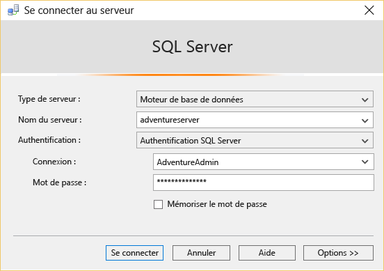

<properties
	pageTitle="Se connecter à Base de données SQL - SQL Server Management Studio | Microsoft Azure"
	description="Découvrez comment vous connecter à Base de données SQL sur Azure avec SQL Server Management Studio (SSMS). Ensuite, exécutez un exemple de requête à l’aide de Transact-SQL (T-SQL)."
	metaCanonical=""
	keywords="connexion à une base de données sql, sql server management studio"
	services="sql-database"
	documentationCenter=""
	authors="stevestein"
	manager="jeffreyg"
	editor="" />

<tags
	ms.service="sql-database"
	ms.workload="data-management"
	ms.tgt_pltfrm="na"
	ms.devlang="na"
	ms.topic="get-started-article"
	ms.date="01/21/2016"
	ms.author="sstein" />

# Se connecter à la base de données SQL avec SQL Server Management Studio et exécuter un exemple de requête T-SQL

> [AZURE.SELECTOR]
- [C#](sql-database-connect-query.md)
- [SSMS](sql-database-connect-query-ssms.md)
- [Excel](sql-database-connect-excel.md)

Cet article vous explique comment vous connecter à une base de données SQL Azure à l’aide de SQL Server Management Studio (SSMS) et effectuer une requête simple à l’aide d’instructions T-SQL (Transact-SQL).

Vous avez d’abord besoin d’une base de données SQL dans Azure. Vous pouvez en créer une rapidement en suivant les instructions de [Prise en main de Microsoft Azure SQL Database](sql-database-get-started.md). Ces exemples sont basés sur la base de données AdventureWorks que vous créez dans cet article, mais les mêmes étapes s’appliquent à toute base de données SQL jusqu’à l’exécution de la requête.

## Installer et démarrer SQL Server Management Studio (SSMS)

Quand vous travaillez avec SQL Database, vous devez utiliser la version la plus récente de SSMS. Pour l’obtenir, accédez à [Téléchargez SQL Server Management Studio](https://msdn.microsoft.com/library/mt238290.aspx). Avec la version la plus récente, SSMS vous avertit automatiquement quand la mise à jour plus récente est disponible.

## Démarrez SSMS et connectez-vous à votre serveur de base de données SQL.

1. Tapez « Microsoft SQL Server Management Studio » dans la zone de recherche de Windows, puis cliquez sur l’application pour ordinateur pour démarrer SSMS.
2. Dans la boîte de dialogue **Connexion au serveur**, dans la zone **Nom du serveur**, entrez le nom du serveur qui héberge votre base de données SQL selon le format *&lt;nomserveur>*.**database.windows.net**.
3. Choisissez **Authentification SQL Server** dans la liste **Authentification**.
4. Saisissez la **connexion** et le **mot de passe** que vous avez configurés au moment de la création du serveur, puis cliquez sur **Connexion** pour vous connecter à la base de données SQL.

	

### Si la connexion échoue

Les échecs de connexion les plus courants sont dus à des erreurs dans le nom du serveur (rappelez-vous que *&lt;;nom\_serveur>* est le nom du serveur logique et non celui de la base de données), dans le nom d’utilisateur ou dans le mot de passe, ou quand le serveur n’autorise pas les connexions pour des raisons de sécurité. Si vous vous connectez pour la première fois ou si la connexion échoue en raison de la modification d’une configuration d’adresse IP, la [dernière version de SSMS](https://msdn.microsoft.com/library/mt238290.aspx) vous demande votre identifiant Azure, puis crée automatiquement la règle de pare-feu dans Azure. Si vous utilisez une version antérieure, l’adresse IP est signalée dans un message d’erreur, et vous devez ajouter cette adresse IP à la règle de pare-feu du serveur dans Azure. Assurez-vous que les paramètres de pare-feu du serveur autorisent les connexions à partir de l’adresse IP de votre ordinateur local et de l’adresse IP utilisée par le client SSMS. Elle sont parfois différentes. Pour plus d’informations, voir [Procédure : configuration des paramètres du pare-feu (Base de données SQL Azure)](sql-database-configure-firewall-settings.md).

## Exécuter les exemples de requêtes

Après vous être connecté à votre serveur logique, vous pouvez vous connecter à une base de données et exécuter un exemple de requête. Si vous n’avez pas créé la base de données en utilisant l’exemple AdventureWorks dans [Prise en main de Microsoft Azure SQL Database](sql-database-get-started.md), cette requête ne fonctionnera pas. Passez directement aux étapes suivantes pour en savoir plus.

1. Dans l’**Explorateur d’objets**, accédez à la base de données **AdventureWorks**.
2. Cliquez avec le bouton droit sur la base de données et sélectionnez **Nouvelle requête**.

	

3. Dans la fenêtre de requête, copiez et collez le code suivant :

		SELECT
		CustomerId
		,Title
		,FirstName
		,LastName
		,CompanyName
		FROM SalesLT.Customer;

4. Cliquez sur le bouton **Exécuter**. La capture d'écran suivante illustre une requête réussie.

	

## Étapes suivantes

Vous pouvez utiliser des instructions T-SQL pour créer et gérer des bases de données dans Azure de la même façon que vous pouvez le faire avec SQL Server. Si vous êtes familiarisé avec l’utilisation de T-SQL avec SQL Server, consultez [Informations sur Transact-SQL avec Azure SQL Database](sql-database-transact-sql-information.md) pour obtenir un récapitulatif des différences.

Si vous débutez avec T-SQL, consultez [Didacticiel : Écriture d’instructions Transact-SQL](https://msdn.microsoft.com/library/ms365303.aspx) et [Informations de référence sur Transact-SQL (moteur de base de données)](https://msdn.microsoft.com/library/bb510741.aspx).

<!---HONumber=AcomDC_0128_2016-->