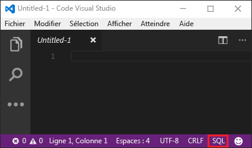
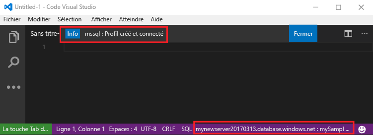
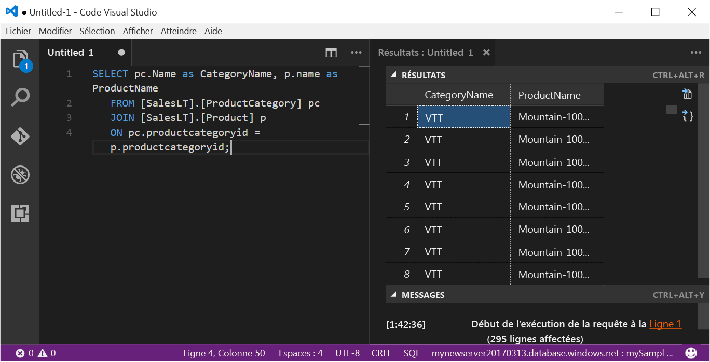

# <a name="azure-sql-database-use-visual-studio-code-to-connect-and-query-data"></a>Azure SQL Database : utilisez Visual Studio Code pour vous connecter et interroger des données

[Visual Studio Code](https://code.visualstudio.com/docs) est un éditeur de code graphique pour Linux, macOS et Windows qui prend en charge les extensions. Utilisation de Visual Studio Code avec l’[extension mssql](https://aka.ms/mssql-marketplace) pour se connecter à une base de données SQL Azure et l’interroger. Ce guide rapide indique en détail comment utiliser Visual Studio Code pour se connecter à une base de données SQL Azure, puis exécuter une requête, insérer, mettre à jour et supprimer des instructions.

Ce guide de démarrage rapide utilise comme point de départ les ressources créées dans l’une de ces instructions de démarrage rapide :

- [Créer une base de données - Portail](sql-database-get-started-portal.md)
- [Créer une base de données - CLI](sql-database-get-started-cli.md)

Avant de commencer, assurez-vous que vous avez installé la toute dernière version de [Visual Studio Code](https://code.visualstudio.com/Download) et chargé l’[extension mssql](https://aka.ms/mssql-marketplace). Pour obtenir des conseils d’installation pour l’extension mssql, consultez la section [Installation de VS Code](https://docs.microsoft.com/sql/linux/sql-server-linux-develop-use-vscode#install-vs-code). 

## <a name="get-connection-information"></a>Obtenir des informations de connexion

Obtenez le nom de serveur complet de votre serveur Azure SQL Database dans le portail Azure. Vous utilisez le nom de serveur complet pour vous connecter à votre serveur à l’aide de Visual Studio Code.

1. Connectez-vous au [portail Azure](https://portal.azure.com/).
2. Sélectionnez **Bases de données SQL** dans le menu de gauche, puis cliquez sur votre base de données dans la page **Bases de données SQL**. 
3. Dans le volet **Essentials** de la page du portail Azure pour votre base de données, recherchez et copiez le **nom du serveur**. Il vous servira ultérieurement dans ce démarrage rapide.

    

## <a name="set-language-mode-to-sql"></a>Définition du mode de langage sur SQL

Définissez le mode de langage sur **SQL** dans Visual Studio Code pour activer les commandes mssql et T-SQL IntelliSense.

1. Ouvrez une nouvelle fenêtre Visual Studio Code. 

2. Appuyez sur **CTRL+K,M**, tapez **SQL** et appuyez sur **ENTRÉE** pour définir le mode de langage sur SQL. 



## <a name="connect-to-the-server"></a>Connexion au serveur

Utilisez Visual Studio Code pour établir une connexion à votre serveur Azure SQL Database.

1. Dans VS Code, appuyez sur **CTRL+MAJ+P** (ou **F1**) pour ouvrir la Palette de commandes.

2. Tapez **sqlcon**, puis appuyez sur **ENTRÉE**.

3. Cliquez sur **Oui** pour définir votre langage sur **SQL**.

4. Appuyez sur **ENTRÉE** pour sélectionner **Créer un profil de connexion**. Cela crée un profil de connexion à votre instance SQL Server.

5. Suivez les invites pour spécifier les propriétés de connexion de ce nouveau profil de connexion. Après avoir spécifié chaque valeur, appuyez sur **ENTRÉE** pour continuer. 

   Le tableau suivant décrit les propriétés du profil de connexion.

   | Paramètre | Description |
   |-----|-----|
   | **Nom du serveur** | Entrez votre nom de serveur complet, par exemple **mynewserver20170313.database.windows.net** |
   | **Nom de la base de données** | Entrez le nom de votre base de données, par exemple **mySampleDatabase** |
   | **Authentification** | Sélectionnez un nom de connexion SQL |
   | **Nom d'utilisateur** | Entrez votre compte d’administrateur de serveur |
   | **Mot de passe (connexion SQL)** | Entrez le mot de passe der votre compte d’administrateur de serveur | 
   | **Enregistrer le mot de passe ?** | Sélectionnez **Oui** ou **Non** |
   | **[Facultatif] Entrez un nom pour ce profil** | Entrez un nom de profil de connexion, par exemple **mySampleDatabase**. 

6. Appuyez sur la touche **ÉCHAP** pour fermer le message d’information qui vous informe que le profil est créé et connecté.

7. Vérifiez votre connexion dans la barre d’état.

   

## <a name="query-data"></a>Données de requête

Utilisez l’instruction Transact-SQL [SELECT](https://msdn.microsoft.com/library/ms189499.aspx) pour rechercher des données dans votre base de données Azure SQL Database.

1. Dans la fenêtre **Éditeur**, saisissez la requête suivante dans la fenêtre de requête vide :

   ```sql
   SELECT pc.Name as CategoryName, p.name as ProductName
   FROM [SalesLT].[ProductCategory] pc
   JOIN [SalesLT].[Product] p
   ON pc.productcategoryid = p.productcategoryid;
   ```

3. Appuyez sur **CTRL+MAJ+E** pour récupérer des données à partir des tables Product et ProductCategory.

    

## <a name="insert-data"></a>Insertion des données

Utilisez l’instruction Transact-SQL [INSERT](https://msdn.microsoft.com/library/ms174335.aspx) pour insérer des données dans votre base de données SQL Azure.

1. Dans la fenêtre **Éditeur**, supprimez la requête précédente et saisissez la requête suivante :

   ```sql
   INSERT INTO [SalesLT].[Product]
           ( [Name]
           , [ProductNumber]
           , [Color]
           , [ProductCategoryID]
           , [StandardCost]
           , [ListPrice]
           , [SellStartDate]
           )
     VALUES
           ('myNewProduct'
           ,123456789
           ,'NewColor'
           ,1
           ,100
           ,100
           ,GETDATE() );
   ```

3. Appuyez sur **CTRL+MAJ+E** pour insérer une nouvelle ligne dans la table Product.

## <a name="update-data"></a>Mise à jour des données

Utilisez l’instruction Transact-SQL [UPDATE](https://msdn.microsoft.com/library/ms177523.aspx) pour mettre à jour des données dans votre base de données SQL Azure.

1.  Dans la fenêtre **Éditeur**, supprimez la requête précédente et saisissez la requête suivante :

   ```sql
   UPDATE [SalesLT].[Product]
   SET [ListPrice] = 125
   WHERE Name = 'myNewProduct';
   ```

3. Appuyez sur **CTRL+MAJ+E** pour mettre à jour la ligne spécifiée dans la table Product.

## <a name="delete-data"></a>Suppression de données

Utilisez l’instruction Transact-SQL [DELETE](https://msdn.microsoft.com/library/ms189835.aspx) pour supprimer des données dans votre base de données SQL Azure.

1. Dans la fenêtre **Éditeur**, supprimez la requête précédente et saisissez la requête suivante :

   ```sql
   DELETE FROM [SalesLT].[Product]
   WHERE Name = 'myNewProduct';
   ```

3. Appuyez sur **CTRL+MAJ+E** pour supprimer la ligne spécifiée dans la table Product.

## <a name="next-steps"></a>Étapes suivantes

- Pour en savoir plus sur Visual Studio Code, voir [Visual Studio Code](https://code.visualstudio.com/docs)
- Pour plus d’informations sur l’interrogation et la modification des données à l’aide de SQL Server Management Studio, consultez [SSMS](https://msdn.microsoft.com/library/ms174173.aspx).

