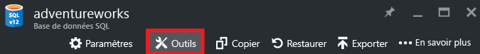
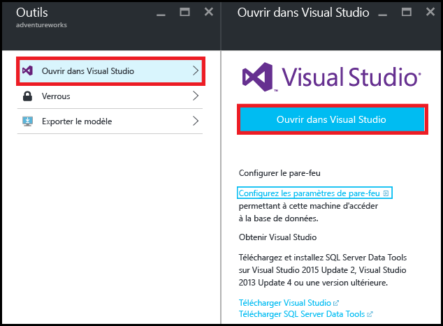
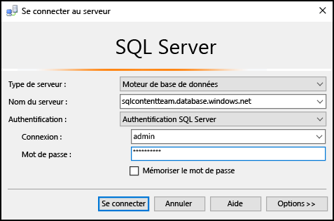
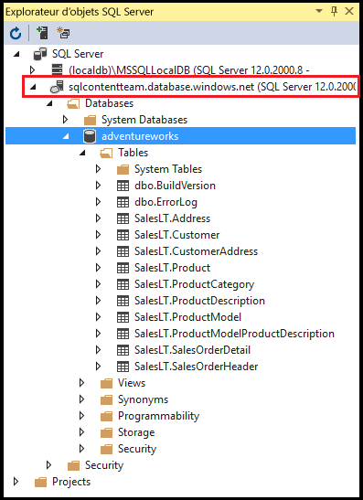
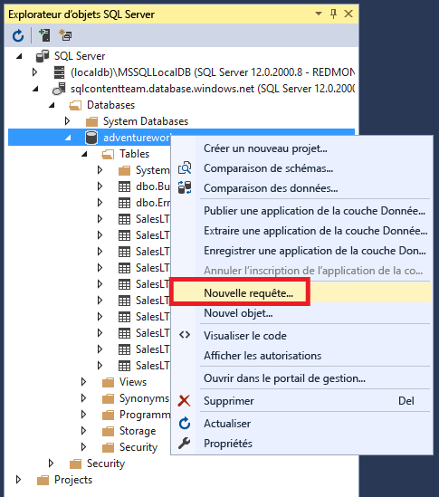
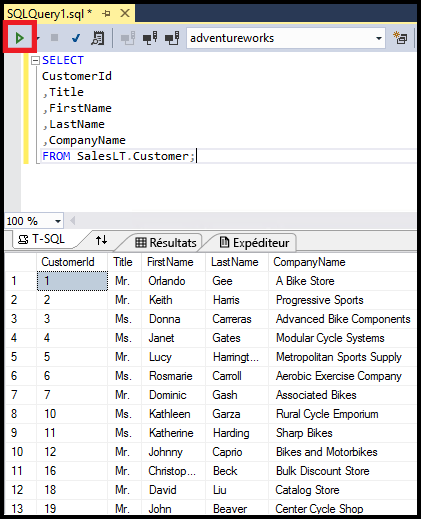

<properties
	pageTitle="Se connecter à la base de données SQL avec une requête C# | Microsoft Azure"
	description="Écrivez un programme en C# pour interroger et vous connecter à une base de données SQL. Informations sur les adresses IP, chaînes de connexion, connexion sécurisée et Visual Studio gratuit."
	services="sql-database"
	keywords="requête de base de données c#, requête c#, se connecter à une base de données, SQL C#"
	documentationCenter=""
	authors="stevestein"
	manager="jhubbard"
	editor=""/>

<tags
	ms.service="sql-database"
	ms.workload="data-management"
	ms.tgt_pltfrm="na"
	ms.devlang="dotnet"
	ms.topic="get-started-article"
	ms.date="08/17/2016"
	ms.author="stevestein"/>

# Se connecter à la base de données SQL avec Visual Studio

> [AZURE.SELECTOR]
- [Visual Studio](sql-database-connect-query.md)
- [SSMS](sql-database-connect-query-ssms.md)
- [Excel](sql-database-connect-excel.md)

Découvrez comment vous connecter à une base de données SQL Azure dans Visual Studio.

## Composants requis

Pour vous connecter à la base de données SQL à l’aide de Visual Studio, vous avez besoin des éléments suivants :

- Une base de données SQL à laquelle se connecter. Cet article utilise l’exemple de base de données **AdventureWorks**. Pour obtenir l’exemple de base de données AdventureWorks, consultez [Créez la base de données de démonstration](sql-database-get-started.md).

- Visual Studio 2013 Update 4 (ou version ultérieure). Microsoft propose désormais Visual Studio Community *gratuitement*.
 - [Visual Studio Community, téléchargement](http://www.visualstudio.com/products/visual-studio-community-vs)
 - [Plus d’options gratuites Visual Studio](http://www.visualstudio.com/products/free-developer-offers-vs.aspx)

## Ouvrez Visual Studio à partir du portail Azure

1. Connectez-vous au [portail Azure](https://portal.azure.com/).

2. Cliquez sur **More Services (Plus de services)** > **Bases de données SQL**
3. Ouvrez le panneau de la base de données **AdventureWorks** en localisant la base de données *AdventureWorks*, puis en cliquant dessus.

6. Cliquez sur le bouton **Outils** en haut du panneau de la base de données :

	

7. Cliquez sur **Ouvrir dans Visual Studio** (si vous avez besoin de Visual Studio, cliquez sur le lien de téléchargement) :

	

8. Visual Studio s’ouvre sur la fenêtre **Se connecter au serveur** déjà configurée pour se connecter au serveur et à la base de données sélectionnés dans le portail. (Cliquez sur **Options** pour vous assurer que la connexion est définie sur la bonne base de données.) Saisissez votre mot de passe d’administrateur du serveur et cliquez sur **Connexion**.

	

8. Si vous n’avez pas de règle de pare-feu définie pour l’adresse IP de votre ordinateur, le message *Impossible de se connecter* s’affiche. Pour créer une règle de pare-feu, consultez [Configurer une règle de pare-feu au niveau du serveur sur une base de données SQL Azure](sql-database-configure-firewall-settings.md).

9. Une fois la connexion établie, la fenêtre de **l’Explorateur d’objets SQL Server** s’ouvre avec une connexion à votre base de données.

	

## Exécuter un exemple de requête

Vous voici connecté à la base de données. Consultez à présent les étapes suivantes pour savoir comment exécuter une requête simple :

2. Cliquez avec le bouton droit sur la base de données et sélectionnez **Nouvelle requête**.

	

3. Dans la fenêtre de requête, copiez et collez le code suivant :

		SELECT
		CustomerId
		,Title
		,FirstName
		,LastName
		,CompanyName
		FROM SalesLT.Customer;

4. Cliquez sur le bouton **Exécuter** pour exécuter la requête :

	

## Étapes suivantes

- L’ouverture des bases de données SQL dans Visual Studio se fait à l’aide de SQL Server Data Tools. Pour plus d’informations, consultez [SQL Server Data Tools](https://msdn.microsoft.com/library/hh272686.aspx).
- Pour vous connecter à une base de données SQL à l’aide d’un code, consultez [Connexion à SQL Database à l’aide de .NET (C#))](sql-database-develop-dotnet-simple.md).

<!-----HONumber=AcomDC_0824_2016-->