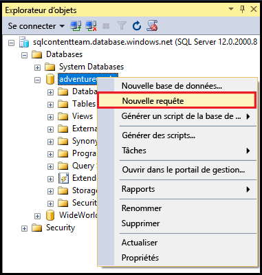
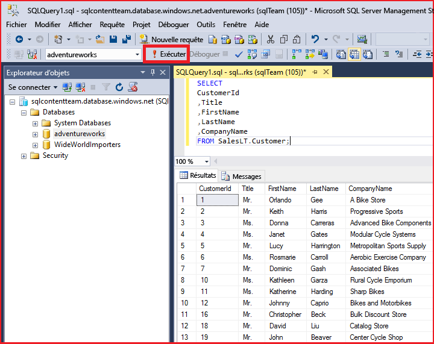

<properties
	pageTitle="Se connecter à la base de données SQL avec une requête C# | Microsoft Azure"
	description="Écrivez un programme en C# pour interroger et vous connecter à une base de données SQL. Informations sur les adresses IP, chaînes de connexion, connexion sécurisée et Visual Studio gratuit."
	services="sql-database"
	keywords="requête de base de données c#, requête c#, se connecter à une base de données, SQL C#"
	documentationCenter=""
	authors="MightyPen"
	manager="jhubbard"
	editor=""/>

<tags
	ms.service="sql-database"
	ms.workload="data-management"
	ms.tgt_pltfrm="na"
	ms.devlang="dotnet"
	ms.topic="get-started-article"
	ms.date="04/25/2016"
	ms.author="annemill"/>

# Se connecter à la base de données SQL avec Visual Studio

> [AZURE.SELECTOR]
- [Visual Studio](sql-database-connect-query.md)
- [SSMS](sql-database-connect-query-ssms.md)
- [Excel](sql-database-connect-excel.md)

Découvrez comment vous connecter à une base de données SQL dans Visual Studio

## Configuration requise

Pour vous connecter à la base de données SQL à l’aide de Visual Studio, vous devez disposer des éléments suivants :

- Un compte et un abonnement Azure. Vous pouvez vous inscrire à un [essai gratuit](https://azure.microsoft.com/pricing/free-trial/).

- Une base de données de démonstration **AdventureWorksLT** sur le service de base de données SQL Azure.
 - [Créez la base de données de démonstration](sql-database-get-started.md) en quelques minutes.

- Visual Studio 2013 Update 4 (ou version ultérieure). Microsoft propose désormais Visual Studio Community *gratuitement*.
 - [Visual Studio Community, téléchargement](http://www.visualstudio.com/products/visual-studio-community-vs)
 - [Plus d’options gratuites Visual Studio](http://www.visualstudio.com/products/free-developer-offers-vs.aspx)
 - Ou laissez l’[étape](#InstallVSForFree), plus loin dans cette rubrique, décrire comment le [portail Azure](https://portal.azure.com/) vous guide dans l’installation de Visual Studio.

&nbsp;

## Étape 1 : Installer Visual Studio Community gratuitement

Si vous devez installer Visual Studio, vous pouvez :

- Installer Visual Studio Community gratuitement en accédant dans votre navigateur aux pages web de produit Visual Studio qui fournissent des téléchargements gratuits et d’autres options
- Laissez le [portail Azure](https://portal.azure.com/) vous guider vers la page web de téléchargement, dont la description est fournie ci-après.

### Visual Studio via le portail Azure

1. Connectez-vous par le biais du [portail Azure](https://portal.azure.com/), http://portal.azure.com/.

2. Cliquez sur **PARCOURIR* TOUT** > **Bases de données SQL**. Un volet s’ouvre pour la recherche des bases de données.

3. Dans la zone de texte de filtre près du haut, commencez à saisir le nom de votre base de données **AdventureWorksLT**.

4. Lorsque la ligne correspondant à votre base de données sur votre serveur s’affiche, cliquez dessus. Un volet s’ouvre pour votre base de données.

5. Pour des raisons pratiques, cliquez sur la commande de réduction sur chacun des volets précédents.

6. Cliquez sur le bouton **Ouvrir dans Visual Studio** vers le haut sur le volet de votre base de données. Un nouveau volet à propos de Visual Studio s’ouvre avec des liens vers des emplacements d’installation pour Visual Studio.

	![Bouton Ouvrir dans Visual Studio][20-OpenInVisualStudioButton]

7. Cliquez sur le lien **Community (gratuit)** ou sur un lien similaire. Une nouvelle page web est ajoutée.

8. Utilisez les liens de la nouvelle page web pour installer Visual Studio.

9. Une fois que Visual Studio est installé, sur le panneau **Ouvrir dans Visual Studio**, cliquez sur le bouton **Ouvrir dans Visual Studio**. Visual Studio s’ouvre.

10. Dans l’intérêt de son volet **Explorateur d’objets SQL Server **, Visual Studio vous demande de renseigner les champs de chaîne de connexion dans une boîte de dialogue.
 - Sélectionnez **Authentification SQL Server** et non **Authentification Windows**.
 - N’oubliez pas de spécifier votre base de données **AdventureWorksLT** (**Options** > **Propriétés de connexion** dans la boîte de dialogue).

11. Dans l’**Explorateur d’objets SQL Server**, développez le nœud pour votre base de données.

## Étape 2 : Exécuter les exemples de requêtes

Après vous être connecté à votre serveur logique, vous pouvez vous connecter à une base de données et exécuter un exemple de requête.

1. Dans l’**Explorateur d’objets**, sélectionnez une base de données sur le serveur auquel vous avez accès, par exemple la base de données **AdventureWorks**.
2. Cliquez avec le bouton droit sur la base de données et sélectionnez **Nouvelle requête**.

	

3. Dans la fenêtre de requête, copiez et collez le code suivant :

		SELECT
		CustomerId
		,Title
		,FirstName
		,LastName
		,CompanyName
		FROM SalesLT.Customer;

4. Cliquez sur le bouton **Exécuter**. La capture d'écran suivante illustre une requête réussie.

	

## Étapes suivantes

[Connexion à SQL Database à l’aide de .NET (C#)](sql-database-develop-dotnet-simple.md)

<!-- Image references. -->

[20-OpenInVisualStudioButton]: ./media/sql-database-connect-query/connqry-free-vs-e.png

<!---HONumber=AcomDC_0525_2016-->